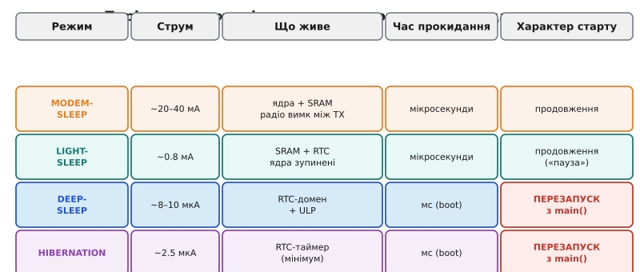

# Режими сну ESP32: modem-sleep, light-sleep, deep-sleep

У бюджеті споживання більшість струму — динамічний, і більшість його — в радіо та ядрах. Сон — це систематичне вимкнення цих доданків. Чим більше вимикаєш, тим менший струм, але тим довше й «дорожче» прокидатися і тим більше стану губиш. Це наскрізний компроміс, що проходить крізь усі режими.

ESP32 має чотири рівні «глибини» сну — від активного стану до майже повного знеструмлення.


*Рис. Драбина режимів сну: ACTIVE → MODEM-SLEEP → LIGHT-SLEEP → DEEP-SLEEP → HIBERNATION. Для кожного щабля: що залишається живим, орієнтовний струм, чи зберігається контекст після пробудження.*

**MODEM-SLEEP** — найлегший рівень: вимкнено лише радіо (між пакетами), ядра продовжують виконувати код на повній швидкості. Корисний для пристроїв «на розетці», де потрібен Wi-Fi, але не весь час. Чіп прокидає радіо лише на маяки точки доступу (DTIM, delivery traffic indication message) — це так зване beacon-based powersave. Економія помірна — десятки відсотків порівняно з повним активним режимом, але не порядки.

**LIGHT-SLEEP** — ядра зупинені (такти загейтовані), але вміст SRAM і стан периферії збережено. Прокидання відбувається за мікросекунди, і програма продовжується з того ж місця, де зупинилася — без перезапуску, без реініціалізації. Аналогія: «пауза» замість «вимкнення». Струм — близько 0.8 мА. Це ефективно зменшує динамічний струм ядер і периферії (їхні такти зупинені), але статичні витоки SRAM і RTC-домену тривають, бо живлення не знімається.

**DEEP-SLEEP** — знеструмлено майже все: ядра, SRAM, більшість периферії. Живим залишається лише RTC-домен: RTC-таймер, RTC-пам'ять (~16 КБ), RTC-GPIO і [ULP-співпроцесор](book:programming/ulp-coprocessor). Струм — 5–10 мкА, у hibernation ще нижче — ~2.5 мкА (коли вимкнено навіть RTC-периферію, лишається тільки таймер). Аналогія: «вимкнути й завести наново, лишивши записку в RTC-пам'яті». Прокидання — це повний перезапуск із `app_main()`, що принципово відрізняє deep-sleep від light-sleep.



*Рис. Порівняльна таблиця режимів: струм, що живе, час прокидання, характер старту. Ключова відмінність — light-sleep продовжує виконання з місця зупинки, deep-sleep щоразу перезапускає.*

> 🔧 **Навіщо це.** Правило великого пальця для вибору режиму: рідко й надовго засинаєш → deep-sleep; часто й коротко → light-sleep; треба тримати Wi-Fi «живим» між пакетами → modem-sleep. Хибний вибір легко з'їдає весь виграш від сну.

Крайній випадок глибокого сну — коли єдиним живим процесором лишається [ULP-співпроцесор](book:programming/ulp-coprocessor/proj-ulp-program.md): навіть велике ядро не прокидається, ULP сам вирішує, коли будити.

Чому не завжди обирають найглибший режим? Deep-sleep скорочує струм сну до мкА, але кожне прокидання тягне за собою boot, реініціалізацію стеку, повторне підключення до Wi-Fi — це секунди при 120 мА. Якщо прокидатися часто, вартість boot-фази домінує. При частих прокиданнях (раз на секунду) light-sleep вигідніший, бо не платить за реініціалізацію щоразу. При рідких (раз на 10–30 хвилин) deep-sleep дає виграш у десятки разів. Точний поріг «коли що» дає [розрахунок робочого циклу й середнього струму](book:programming/duty-cycle-current).

**Worked-приклад. Light-sleep vs deep-sleep при різних частотах прокидань.**

```c
// ESP-IDF: налаштування джерел пробудження для deep-sleep
#include "esp_sleep.h"

void sleep_deep_with_timer(uint32_t sleep_seconds) {
    // Таймер пробудження: мікросекунди
    esp_sleep_enable_timer_wakeup((uint64_t)sleep_seconds * 1000000ULL);
    esp_deep_sleep_start();
    // Після цього рядка — перезапуск із main()
}

void sleep_light_with_timer(uint32_t sleep_seconds) {
    esp_sleep_enable_timer_wakeup((uint64_t)sleep_seconds * 1000000ULL);
    esp_light_sleep_start();
    // Виконання ПРОДОВЖУЄТЬСЯ звідси — без перезапуску
}
```

```
Сценарій А: прокидання раз на 1 с, активна фаза 50 мс при 30 мА.

Deep-sleep:
  boot-вартість за прокидання: 300 мс при 45 мА = 3.75 мА·с
  корисна робота: 50 мс при 30 мА = 1.5 мА·с
  сон: 650 мс при 0.008 мА = 0.005 мА·с
  Разом за 1 с: 5.255 мА·с → I_сер ≈ 5.3 мА

Light-sleep (без boot-вартості):
  активна фаза: 50 мс при 30 мА = 1.5 мА·с
  сон: 950 мс при 0.8 мА = 0.76 мА·с
  Разом: 2.26 мА·с → I_сер ≈ 2.3 мА

Light-sleep виграє вдвічі при частих прокиданнях!

Сценарій Б: прокидання раз на 10 хв (600 с), активна фаза 50 мс.

Deep-sleep:
  boot + робота: 350 мс при ~40 мА = 14 мА·с
  сон: 599.65 с при 0.008 мА = 4.8 мА·с
  Разом: 18.8 мА·с / 600 с → I_сер ≈ 0.031 мА

Light-sleep:
  активна фаза: 50 мс при 30 мА = 1.5 мА·с
  сон: 599.95 с при 0.8 мА = 480 мА·с
  Разом: 481.5 мА·с / 600 с → I_сер ≈ 0.80 мА

Deep-sleep виграє у 25 разів при рідких прокиданнях!
```

Глибина сну обирається **під частоту прокидань**, а не «що менше — те й бери».

---
