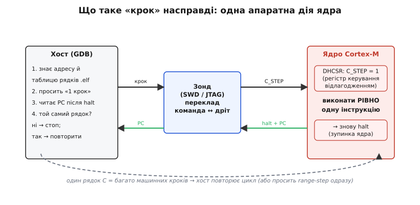

# Кроком по коду — як «крок» зроблено всередині

Команда `step` виглядає магією рівня редактора: натиснув — рядок підсвітився нижче. Насправді за нею стоїть ланцюг із чотирьох рівнів, де кожен робить рівно одну дрібну річ, і «крок по рядку коду» внизу розкладається на серію куди простіших «кроків по одній машинній інструкції». Розібравши цей розклад, перестаєш дивуватися дивній поведінці налагоджувача — стрибкам по рядках, провалюванню в переривання, повільності на віддаленому ядрі — бо бачиш, звідки кожна з них береться.

[Зупинене ядро, зонд по SWD/JTAG і пара OpenOCD + GDB](root:embedded/openocd-gdb) — це сцена, на якій усе відбувається. Тут ми спускаємося на поверх нижче: що саме ядро вміє робити апаратно, як із цього однісінького вміння GDB будує «крок по рядку», і чому ті самі механізми дають збої, які щодня бачить кожен, хто налагоджує прошивку.

### Єдина апаратна цеглина: один крок ядра

Усе покрокове налагодження стоїть на одній апаратній здатності ядра — **виконати рівно одну машинну інструкцію й одразу знову зупинитися**. На ARM Cortex-M ця здатність живе в блоці керування відлагодженням, у регістрі `DHCSR` (Debug Halting Control and Status Register — «регістр керування й стану зупинкового відлагодження»). Хост через зонд по SWD/JTAG записує туди біт `C_STEP` (поряд із `C_DEBUGEN`, що взагалі вмикає відлагодження, і `C_HALT`, що тримає ядро зупиненим). Щойно ядру дають зняти `C_HALT` із виставленим `C_STEP`, воно виконує одну інструкцію, після чого апаратно повертається в halt — і хост знову володіє ситуацією.

На настільному x86 та сама ідея реалізована інакше, але впізнавано: біт `TF` (Trap Flag — «прапорець пастки») у регістрі прапорців. Виставив `TF` — і процесор після **кожної** виконаної інструкції збуджує налагоджувальне переривання (`#DB`). Ядро саме скидає `TF` при вході в обробник, тож щоб крокувати далі, налагоджувач має його щоразу виставляти знову. Деталі різні — біт у регістрі відлагодження проти прапорця в стані процесора, — але суть одна: **апаратура вміє «одну інструкцію й стоп», і більше нічого**. Усе багатство команд `step` / `next` / `finish` хост добудовує над цією єдиною цеглиною.



*«Крок» — не дія IDE, а одна апаратна операція ядра; усе інше хост добудовує над нею, читаючи лічильник команд після кожної зупинки.*

> 🔧 **Навіщо це.** Коли крок поводиться дивно, корисно пам'ятати, що внизу — гола апаратна цеглина «одна інструкція». Більшість «див» (стрибки по рядках, провал у переривання) народжується не в ядрі, а на тому рівні, де хост складає з цих цеглин рух по рядках. Шукати причину треба там.

### Від машинної інструкції до рядка коду

Одна машинна інструкція — це не один рядок C. Рядок `r = f(x) + g(y);` розкладається на десяток інструкцій: завантажити `x`, викликати `f`, зберегти результат, завантажити `y`, викликати `g`, додати, записати в `r`. Тому «крок по рядку», який бачить людина, хост складає з багатьох апаратних мікрокроків.

Працює це так. GDB читає з [.elf-файлу таблицю рядків](topic:programming/firmware-image) — відповідність «діапазон адрес ↔ рядок вихідного коду». Запам'ятавши, на якому рядку зараз стоїть лічильник команд, GDB просить ядро зробити один машинний крок, після зупинки читає новий PC і дивиться в таблицю: ми все ще на тому самому рядку? Якщо так — крок повторюється; якщо ні — рух завершено, керування віддають людині. Так із простого «одна інструкція й стоп» виростає звичний «один рядок C».

Наївно це означало б десятки окремих обмінів «крок — читання PC» між хостом і ядром на кожен рядок. Для зонда на USB така балаканина помітно гальмує, тому GDB має оптимізацію — **покрокування діапазоном** (англ. *range stepping*): замість сипати поодинокими кроками він каже зонду «виконуй, поки PC лишається в діапазоні адрес цього рядка». Один обмін замість десятків. Якщо ціль уміє цей режим (а OpenOCD для Cortex-M уміє), рух по рядках стає відчутно жвавішим; якщо ні — GDB чесно повертається до поодиноких машинних кроків.

```
# умовно, що відбувається на «next» по одному рядку:
# рядок 88 займає адреси 0x400D2030..0x400D2048

(gdb) next
# GDB → зонду: «крокуй, поки PC у [0x400D2030, 0x400D2048)»  (range step)
# ядро виконує всі інструкції рядка, виходить за діапазон, halt
# GDB читає PC=0x400D204A → це вже рядок 89 → стоп, показати рядок 89
```

**Worked-приклад. Один `step` по рядку, де всередині є виклик.** Простежмо механіку на пальцях. Рядок 88 — `r = scale(x);` — компілятор розклав на чотири інструкції: завантажити `x`, виконати `bl scale` (виклик), забрати результат, записати в `r`. Команда `step` має зайти в `scale`, тож тут GDB не може дати один range-step на весь рядок — він мусить помітити виклик.

```
адреси рядка 88:
  0x400D2030  ldr  r0, [x]      ← старт: PC тут, рядок 88
  0x400D2034  bl   scale        ← інструкція виклику
  0x400D2038  mov  r4, r0
  0x400D203C  str  r4, [r]
```

GDB проганяє рядок машинними кроками й після кожного звіряє PC з таблицею рядків. Перший крок: PC стає `0x400D2034` — той самий рядок 88, виклику ще не сталося, рухаємось далі. Другий крок виконує `bl scale` — і ось ключовий момент: PC після нього вже **не** в діапазоні рядка 88, він стрибнув на перший рядок функції `scale`. GDB бачить, що нова адреса належить **іншій** функції з її власним рядком, — і саме це означає «провалилися у виклик»: рух завершено, керування віддають людині, на екрані перший рядок `scale`. Команда `next` на тому самому рядку повелася б інакше: помітивши попереду `bl`, вона не крокувала б крізь нього, а поставила б тимчасову пастку на `0x400D2038` (адреса повернення) і відпустила ядро бігти.

Видно, що `step` і `next` розрізняються рівно в одній точці — як повестися з інструкцією виклику: пройти її машинним кроком (і опинитися всередині) чи перестрибнути через тимчасову пастку на поверненні. Усе інше в обох однакове.

### Крок «через»: тимчасова пастка на адресу повернення

Найхитріше — крок «через» виклик (`next`), коли треба проминути цілу функцію, **не** провалившись у неї. Крокувати її машинними кроками — божевілля: функція може містити мільйони інструкцій, а ще й заглиблюватися у власні виклики. Тут хост застосовує інший прийом, поєднуючи мікрокрок із короткочасною пасткою.

Дійшовши до інструкції виклику, GDB знає, **куди ця функція повернеться** — на наступну інструкцію після виклику. Тож він ставить туди **тимчасову [точку спину](topic:programming/breakpoints-watchpoints)** (англ. *temporary breakpoint*, що знімається після першого ж спрацювання) і дає ядру не крокувати, а просто **бігти** командою «продовжити». Функція виконується на повній швидкості, з усіма своїми вкладеними викликами, повертається — і одразу натикається на тимчасову пастку. Ядро спиняється рівно на наступному рядку, тимчасова пастка тихо знімається. Зовні це виглядає як один рівний «крок через», а всередині — поставив пастку на повернення, відпустив, спіймав.

Той самий прийом — кістяк команди `finish` (крок «назовні»): GDB бере адресу повернення з поточного фрейму, ставить туди тимчасову пастку й відпускає ядро. Різниця лише в тому, звідки взято адресу повернення: для `next` — з інструкції виклику попереду, для `finish` — зі збереженого LR поточного кадру стека.

```
(gdb) next            # на рядку «process(buf);»
# GDB: адреса повернення = наступна інструкція, 0x400D2050
#      ставить тимчасову пастку @0x400D2050
#      команда «continue» (НЕ крок!)
# process() біжить цілком на повній швидкості, повертається
# спрацьовує тимчасова пастка @0x400D2050 → halt
# пастка знімається; показати наступний рядок
```

> 🔧 **Навіщо це.** Звідси випливає практичне: `next` через велику функцію — це майже «біг» (одна пастка), а `step` усередину неї — це чесне покрокування з обміном на кожну інструкцію. Якщо налагодження «приклеїлося» намертво, ти майже напевно крокуєш `step`-ом крізь те, що варто було проскочити `next`-ом.

### З чого зроблено саму тимчасову пастку

Тимчасова пастка на адресу повернення — теж не магія, а одна з [двох фізичних різновидів точок спину](topic:programming/breakpoints-watchpoints/detail), і вибір між ними керує тим, чи спрацює крок «через» взагалі. Різновидів два, і вони радикально різні.

**Програмна пастка** — це підміна інструкції. Хост запам'ятовує оригінальну інструкцію за потрібною адресою, а на її місце записує спеціальну однослівну інструкцію-пастку (на ARM — `BKPT`, англ. *breakpoint*; на x86 — однобайтовий `int 3`). Коли ядро добігає до цього місця й виконує `BKPT`, воно зупиняється. Щоб рушити далі, хост виконує тонкий танок: відновлює оригінальну інструкцію на місці, робить нею один машинний крок, повертає `BKPT` назад і відпускає ядро. Програмних пасток можна ставити **скільки завгодно** — це лише записи в пам'ять, — але працюють вони тільки там, куди можна **писати**: у RAM.

**Апаратна пастка** нічого не підміняє. У ядрі є невеликий блок порівняння адрес — на Cortex-M це `FPB` (Flash Patch and Breakpoint unit — «блок латання Flash і точок спину»). У нього вантажать адресу; ядро на кожній вибірці інструкції звіряє лічильник команд із завантаженими адресами й зупиняється на збігу, не чіпаючи пам'ять зовсім. Тому апаратна пастка — **єдиний** спосіб спинитися на коді, що лежить у Flash (його не перезаписати однією інструкцією), і саме її доводиться ставити для більшості прошивкового коду. Платня — їх **лічені одиниці**: типовий Cortex-M має від двох до восьми компараторів `FPB`, і це жорстка стеля.

Звідси неприємний, але логічний наслідок для кроку «через». Якщо `process()` лежить у Flash (а майже весь код прошивки там і лежить), тимчасова пастка на адресу повернення мусить бути **апаратною** — займає один із кількох компараторів `FPB`. Поставив руками вже стільки точок спину, скільки є компараторів, — і на тимчасову пастку для `next` місця не лишилося. GDB чесно повідомить `Cannot insert breakpoint` і не зробить крок. Лікування пряме: прибрати зайві ручні пастки, щоб звільнити компаратор під механіку кроку.

```
(gdb) next
Cannot insert breakpoint 0.
Cannot access memory at address 0x8001a20    # вільних апаратних компараторів немає
```

> 🔧 **Навіщо це.** «`next` раптом перестав працювати на цьому чипі» — майже завжди вичерпані апаратні компаратори `FPB`: усі зайняті ручними пастками, а на тимчасову для кроку місця нема. Знаючи стелю (`monitor` уміє показати кількість компараторів), ти просто прибираєш зайве замість того, щоб винуватити інструмент.

### Чому крок «провалюється» в переривання

Найбентежніша поведінка для початківця: стоїш на простому рядку, тиснеш крок — і раптом опиняєшся посеред [обробника переривання](topic:programming/isr), якого зовсім не кликав. Це не вада налагоджувача, а пряма геометрія того, як крок зроблено.

Машинний крок — це «виконай одну інструкцію, тоді halt». Але [переривання](topic:programming/interrupts) — асинхронні: якщо в ту саму мить апаратура має готовий запит (тикнув таймер, прийшов байт по UART), ядро спершу обслуговує його. Воно бере вектор, стрибає в обробник — і **там** настає halt після першої інструкції. Ти просив крок свого рядка, а отримав крок усередину ISR, бо переривання вклинилося рівно між «зняти halt» і «спинитися знову».

Лікують це маскуванням переривань на час кроку. На Cortex-M той самий `DHCSR` має для цього біт `C_MASKINTS` (mask interrupts — «маскувати переривання»): хост виставляє його разом із `C_STEP`, ядро на час кроку не приймає запитів, і крок лишається у твоєму коді. OpenOCD робить це за тебе, а в GDB поведінкою керує перемикач `set mem inaccessible-by-default` поряд із налаштуваннями кроку через переривання.

На цьому місці варто знати про реальні граблі заліза. На ранніх ревізіях ядра Cortex-M7 (r0p0 і r0p1, зокрема в кількох STM32F7) `C_MASKINTS` маскує переривання **не так**, як обіцяє документація: попри маску, крок усе одно інколи провалюється в ISR. Це визнана апаратна вада конкретних ревізій; обходять її або новішою ревізією кремнію (r0p2 і пізніші), або обхідними скриптами в інструментах (відповідні версії J-Link і `.gdbinit`-гачки, що крутять `C_MASKINTS` навколо кожного кроку вручну). Те, що виглядає як «глюк налагоджувача», тут — задокументована помилка дрібної ревізії ядра.

> 🔧 **Навіщо це.** Якщо крок раз у раз застрибує в ISR навіть із маскуванням — це не твоя помилка й не вада GDB, а, найімовірніше, рання ревізія Cortex-M7. Замість боротьби з симптомом перевір ревізію ядра й онови інструмент: проблему давно описано й обходять відомими латками.

### Розмотування стека: як bt бачить минуле

Команда `backtrace` теж тримається на структурі, яку треба вміти прочитати, — і коли вона збоїть, без розуміння механізму не обійтися. Кожен виклик лишає на стеку **кадр** (англ. *stack frame*), а кадри зчеплені в ланцюг: у кожному збережено адресу повернення (на ARM — регістр LR) і досить даних, щоб відновити, де закінчується попередній кадр. Прохід цим ланцюгом від поточного кадру до кореня називають **розмотуванням стека** (англ. *stack unwinding* — «розмотування»).

Звідки GDB знає, де межі кожного кадру? Із двох джерел. Простий шлях — за покажчиком кадру (frame pointer): якщо компілятор виділив під нього регістр, кожен кадр прямо вказує на попередній, і розмотування зводиться до проходу зв'язним списком. Але оптимізація часто **забирає** цей регістр під обчислення (саме це робить `-fomit-frame-pointer`), і тоді прямого покажчика немає. Для цього випадку компілятор кладе в `.elf` окремі **таблиці розмотування** (англ. *unwind tables*, секції на кшталт `.debug_frame` / `.eh_frame`): вони описують, як для кожного діапазону адрес відновити збережені регістри й знайти попередній кадр. GDB читає ці таблиці й розмотує стек навіть без покажчика кадру.

Звідси й типові збої backtrace. Якщо `bt` показує сміття після кількох кадрів або обривається на `??`, причина майже завжди одна з двох: або стек **затерто** (переповнення стека задачі, запис за межі буфера зіпсував збережені адреси повернення — і ланцюг урвався), або в зібраному коді **немає таблиць розмотування** для цієї ділянки (асемблерна вставка без анотацій, надто агресивна оптимізація). У першому випадку дивись у бік [розміру стека задачі](topic:programming/task-stacks); у другому — пересобери з відлагоджувальною інформацією й помірною оптимізацією.

```
(gdb) bt
#0  0x400d2034 in ?? ()
#1  0x00000000 in ?? ()           # ланцюг урвався → стек затерто
Backtrace stopped: previous frame identical to this frame
```

Такий обірваний backtrace — сам по собі діагноз: ланцюг кадрів пошкоджено, і перше підозрюване — переповнення стека або запис за межі масиву, що затер збережений LR.

### Крок по даних: вотчпоінт замість кроку по коду

Є питання, на яке покрокування по коду відповідає кепсько: «**хто** псує цю змінну?» Якщо значення затирається десь у глибині сотень викликів, докрокуватися до винуватця руками — марна праця. Тут працює не крок по коду, а зупинка по **події з даними** — вотчпоінт (англ. *watchpoint* — «точка спостереження»). Він теж спирається на окремий апаратний блок ядра, споріднений із тим, що дає апаратні пастки.

На Cortex-M за це відповідає блок `DWT` (Data Watchpoint and Trace — «спостереження за даними й трасування»). У його компаратор вантажать **адресу змінної** (і, за потреби, маску й умову — читання, запис чи обидва). Далі ядро на кожному зверненні до пам'яті звіряє адресу з компаратором і зупиняється рівно тоді, коли хтось торкнувся саме цього байта. Команда `watch g_config.rate` ставить такий вотчпоінт на запис; `rwatch` — на читання; `awatch` — на будь-який доступ.

Принципова відмінність від кроку: вотчпоінт ловить винуватця **незалежно від того, через який код він прийшов**. Не треба знати заздалегідь, де саме станеться затирання, — апаратура спинить ядро в момент запису, хоч би він стався в перериванні, у драйвері чи в зовсім несподіваній функції. А `backtrace` одразу після спрацювання покаже повний ланцюг — хто саме виконав фатальний запис.

```
(gdb) watch g_state.flags     # апаратний вотчпоінт на запис у поле
Hardware watchpoint 2: g_state.flags

(gdb) c
Hardware watchpoint 2: g_state.flags
Old value = 0
New value = 4
clear_flags () at state.c:73   # ось хто записав — і весь шлях видно через bt
```

Платня та сама, що й за апаратні пастки: компараторів `DWT` теж лічені одиниці (часто чотири), і вони окремі від компараторів `FPB`. Тому вотчпоінтів стільки ж мало, скільки апаратних пасток, і так само легко вичерпуються. А ще є зручний місток до попередніх механізмів: вотчпоінт на змінну-вартового на дні стека задачі — апаратний спосіб упіймати [переповнення стека](topic:programming/task-stacks) в момент, коли воно тільки починає затирати сусідню пам'ять, замість того щоб згодом дивитися на вже зруйнований backtrace.

> 🔧 **Навіщо це.** «Звідки взялося це значення?» — питання, від якого крок по коду тільки забирає час. Один `watch` на змінну ловить винуватця за будь-яким шляхом виконання, а наступний `bt` показує його ім'я. Пам'ятай лише про стелю в кілька компараторів `DWT`.

### Крок, що сам знає, де спинитися

Крокувати руками по сто разів, доки лічильник дорахує до потрібної ітерації, — це та сама марна праця, тільки в часі. GDB має на це засоби, і всі вони — надбудова над уже знайомою механікою пасток і мікрокроків.

Найпростіший — `until` із номером рядка: він ставить тимчасову пастку на цей рядок і відпускає ядро, тож цикл пробігає на повній швидкості й зупиняється, коли керування дійде до вказаного місця. Голий `until` без аргументу хитріший — він крокує доти, доки PC не вийде **вперед** за поточний рядок, і цим зручно вискочити з циклу, не докроковуючи кожну його ітерацію: повторний прохід того самого рядка він ігнорує, спиняючись лише коли цикл нарешті завершиться.

Коли ж проблема проявляється не на якійсь ітерації за номером, а **за умовою** — допомагає умовна пастка. `break sensor.c:88 if id == 42` ставить звичайну пастку, але GDB на кожному її спрацюванні сам перевіряє умову: не справдилась — тихо відпускає ядро далі, справдилась — спиняється й віддає керування. Для прошивки тут є тонкість, варта уваги: перевірку умови робить **хост**, а не ядро. Тож на кожному проході циклу ядро спиняється, віддає керування зонду по SWD/JTAG, GDB перевіряє умову й здебільшого відпускає назад. Якщо умовна пастка стоїть у гарячому циклі, що крутиться тисячі разів на секунду, ці обміни помітно гальмують саму прошивку — поведінка, яка на хост-програмі непомітна, а на чипі через дріт відразу дається взнаки. Споріднений важіль — `ignore`: пропустити перші N спрацювань пастки, не питаючи нічого, — дешевший, бо лічильник веде той бік, що швидший.

```
(gdb) break parse.c:120 if pkt.type == 0xFF   # спинитися лише на «битому» пакеті
(gdb) ignore 2 5000                            # перші 5000 спрацювань пастки 2 — пропустити
```

> 🔧 **Навіщо це.** Замість тисячі ручних кроків до потрібної ітерації — одна умовна пастка чи `ignore`. Тільки пам'ятай, що умову перевіряє хост через дріт: у дуже гарячому циклі умовна пастка сама стає гальмом, і тоді краще `ignore` за лічильником.

### Складаємо все докупи

Тепер три щоденні команди читаються як прямі наслідки одного механізму, а не як окремі магічні кнопки. Крок «всередину» — це машинний крок (`C_STEP`) із маскою переривань (`C_MASKINTS`) і звіркою PC з таблицею рядків, повторений, поки рядок той самий. Крок «через» — тимчасова пастка на адресу повернення плюс вільний біг до неї. Крок «назовні» — те саме, але адресу повернення взято зі збереженого LR поточного кадру. А backtrace — прохід ланцюгом кадрів за покажчиком кадру або за таблицями розмотування з `.elf`.

З цього виводяться всі «дивацтва» одним рухом думки. Стрибки по рядках під `-O2` — бо інструкції різних рядків переплелися, а звірка PC з таблицею рядків чесно показує, на чий рядок ти зараз потрапив. Провал у ISR — бо переривання вклинилося між «зняти halt» і «спинитися», а маска не спрацювала. Повільний крок на віддаленому ядрі — бо без покрокування діапазоном кожна інструкція коштує окремого обміну по USB. Обірваний backtrace — бо ланцюг кадрів затерто або нема таблиць розмотування. Жодної магії: одна апаратна цеглина «один крок», а над нею — таблиця рядків, тимчасові пастки й таблиці розмотування.

> 🔧 **Навіщо це.** Розуміння механізму обертає налагодження налагоджувача з ворожіння на діагностику. Замість «GDB якось дивно поводиться» ти питаєш конкретне: «крок не маскує переривання — яка ревізія ядра?», «backtrace рветься — стек затерто чи нема таблиць розмотування?», «крок повзе — чи ввімкнено покрокування діапазоном?» Кожне питання веде прямо до причини, бо ти знаєш, з яких частин складено те, що бачиш.
