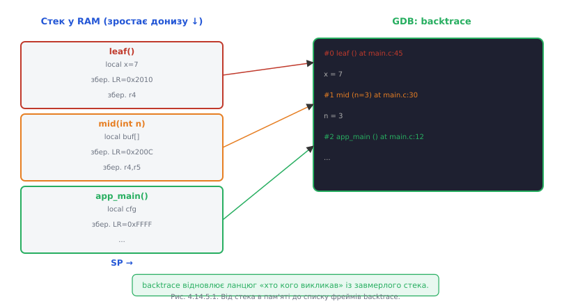

# Кроком по коду: стек викликів, фрейми, перегляд пам'яті й регістрів живої системи

Коли [відлагоджувач підключений і ядро зупинене](book:programming/openocd-gdb), ти опиняєшся всередині завмерлого всесвіту. Що тут можна побачити і як рухатись далі? Це і є щоденне ремесло налагодження — набагато багатше, ніж просто «кроки вперед».

### Три види кроку

Коли ядро зупинене, є три різні способи рухатись далі по коду.

**`step` (s)** — крок із входженням: виконати один рядок вихідного коду, але якщо цей рядок містить виклик функції — **увійти** в неї і зупинитись на першому рядку. Корисний, коли підозрюєш, що проблема всередині конкретної функції.

**`next` (n)** — крок без входження: виконати один рядок вихідного коду, а якщо там виклик функції — **виконати її цілком** і зупинитись на наступному рядку. Рятує від провалювання в бібліотечні функції, HAL-драйвери та інший код, де проблеми не очікуєш.

**`finish`** — виконати поточну функцію до кінця і зупинитись одразу після повернення з неї. Якщо випадково провалився кроком углиб і хочеш вийти на рівень вище — `finish` без зайвих кроків.

**`stepi` (si)** — крок по одній **машинній** інструкції, незалежно від рядків вихідного коду. Потрібний при аналізі асемблерного виходу або коли оптимізатор «склеїв» кілька рядків C в одну інструкцію.


*Рис. Вибір кроку керує тим, провалюєшся ти у функцію чи переступаєш її.*

### Стек викликів і фрейми

Зупинившись у довільному місці, ти хочеш знати: **як сюди потрапили?** Відповідь — команда `backtrace` (або `bt`). Вона читає стек з пам'яті й відновлює ланцюг «хто кого викликав»: від поточної функції (#0) угору через усі проміжні виклики до самої вершини.

Кожен запис у backtrace — це **фрейм**: знімок стану однієї функції в момент, коли вона викликала іншу. Фрейм містить локальні змінні функції, значення ключових регістрів, збережений LR (адреса повернення) і SP (покажчик стека). Саме тому backtrace і можливий: стек — це фізичний слід із хлібних крихт назад до `main`.

```
(gdb) bt
#0  sensor_read (dev=0x3FFB1234, buf=0x0) at sensor.c:88
#1  0x400D2ABC in update_sensors () at tasks/sensors.c:45
#2  0x400D2F10 in sensor_task (arg=0x0) at tasks/sensors.c:120
#3  0x400D0888 in freertos_task_entry () at freertos/tasks.c:512
```

Перейти у конкретний фрейм: `frame 1` або `up`/`down`. Перемкнувшись у фрейм #1, команди `info locals` і `print` покажуть локальні змінні саме цієї функції, а не поточної. Це важливо: якщо шукаєш, яким аргументом тебе викликали, треба перейти у фрейм виклику.



*Рис. backtrace відновлює ланцюг «хто кого викликав» із завмерлого стека.*

### Перегляд живого стану

Зупинившись у фреймі, ти бачиш **все**, а не лише те, що надруковано — у цьому і є принципова відмінність [підключеного відлагоджувача від друку через Serial](book:programming/why-debugger).

```
(gdb) info locals           # всі локальні змінні поточного фрейму
buf = 0x0                   # ось він, нульовий вказівник
len = 64

(gdb) info registers        # всі регістри CPU
pc  0x400D2034  sensor_read+12
sp  0x3FFB6E80
lr  0x400D2ABD

(gdb) x/8xb 0x3FFB1234      # дамп 8 байт з адреси (зручно для перевірки структур)
0x3FFB1234: 0x01 0x00 0x00 0x00 0x64 0x00 0x00 0x00

(gdb) set var buf = &local_buf    # змінити вказівник наживо для перевірки гіпотези
```

Команда `set var` дозволяє **змінювати** значення змінних наживо. Це потужний інструмент перевірки гіпотез: «а що якщо `buf` вказував би на правильний буфер — чи завершилась би функція успішно?» — змінюємо `buf`, відновлюємо виконання й дивимось.

### RTOS-обізнаність: бачимо всі задачі

Одна з найважливіших переваг підключеного відлагоджувача над друком — він бачить **усі задачі FreeRTOS** одночасно. OpenOCD для ESP32 вміє читати список задач зі структур RTOS у RAM, і GDB відображає їх як окремі «потоки».

```
(gdb) info threads
  Id  Target Id   Frame
  1   Task "app_task"   xQueueReceive () at queue.c:112
  2   Task "wifi_task"  esp_wifi_scan () at wifi_api.c:55
* 3   Task "sensor_task"  sensor_read () at sensor.c:88

(gdb) thread 2              # переключитись на wifi_task
(gdb) bt                    # побачити її backtrace
#0  esp_wifi_scan (...)
#1  wifi_connect_handler ()
...
```

Кожна задача має [власний стек у RAM](book:programming/task-stacks) і власне значення PC у точці, де вона зупинилась або заблокувалась. Відлагоджувач надає окремий backtrace для кожної — і ти бачиш картину всієї системи одночасно.


*Рис. Відлагоджувач показує, де застрягла КОЖНА задача водночас — недосяжне для друку.*

### Пастки оптимізованого коду

При компіляції з `-O2` або вище компілятор агресивно перетворює код: вбудовує функції, видаляє «зайві» змінні, об'єднує рядки. Наслідок для налагодження — GDB «стрибає» по рядках непередбачувано, а значення змінних часто показуються як `<optimized out>`. Це не баг GDB; це наслідок того, що конкретна змінна взагалі не існує в пам'яті — вона «живе» у регістрі, і компілятор вирішив її не зберігати.

Для налагодження рекомендується прапорець `-Og` (оптимізація, що не заважає налагодженню) або `-O0` (без оптимізації). Корінь проблеми — у тому, [що оптимізатор робить із кодом на етапах компіляції](book:programming/compiler-stages): переставляє, вбудовує й викидає те, що з погляду джерела мало б існувати.

**Worked-приклад. Backtrace падіння з неправильним аргументом.**

```
(gdb) bt
#0  memcpy (dst=0x0, src=0x3FFB5000, n=64) at memcpy.c:34
#1  0x400D2F88 in pack_response (out=0x0, data=0x3FFB5000) at proto.c:156
    out = 0x0    ← nullptr!
#2  0x400D2ABC in handle_command (cmd=0x3FFB4800) at proto.c:89
    cmd = 0x3FFB4800

(gdb) frame 2
(gdb) info locals
out_buf = 0x0       ← не ініціалізований, залишився nullptr
cmd     = 0x3FFB4800

(gdb) p cmd->response_buf
$1 = 0x0            ← поле не заповнене перед викликом
```

Ланцюг зрозумілий: `handle_command` не ініціалізувала `out_buf` перед передачею у `pack_response`, яка передала `0x0` у `memcpy` — і впала. Без backtrace і перегляду фреймів цей ланцюг міг би ховатись за десятками `Serial.print`.

> 🔧 **Навіщо це:** backtrace — найшвидший шлях від «воно впало десь там» до «ось функція й ось аргумент, що це спричинив»; вміти читати фрейми — половина ремесла налагодження.

---
