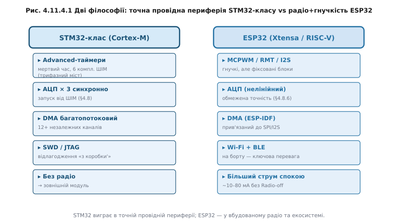

# STM32-клас

Cortex-M — це лише ядро. STM32-клас показує, що буває, коли до цього ядра додати периферію «дорослого» мікроконтролера: не одне ядро-мінімум, а повний набір таймерів, АЦП, DMA-каналів, інтерфейсів. Якщо ESP32 несе радіо, STM32-клас (Cortex-M MCU family by ST) несе багатшу й точнішу провідну периферію — і саме це визначає його нішу.

Розгляньмо периферію по блоках. Таймери у STM32-класі діляться на «basic», «general-purpose» і **«advanced-control»** — останній має вбудовану підтримку мертвого часу (dead time), комплементарні пари виходів і апаратний захист від «прострілу» (shoot-through). [Апаратний ШІМ ESP32 (MCPWM)](book:programming/hardware-pwm) теж уміє генерувати мертвий час, але advanced-control таймер STM32 вміє це з меншими зусиллями конфігурації і суворішим детермінізмом — фази вирівняні апаратно, без джитеру від програмного втручання. [АЦП](book:electronics/adc) у STM32-класі можна конфігурувати на **синхронний** запуск від таймера — кілька АЦП одночасно виробляють вибірку в точно визначений момент ШІМ-циклу, що критично для вимірювання струму фазових обмоток; це контраст із [нелінійністю та похибками АЦП ESP32](book:electronics/adc-errors). [DMA-контролер](book:programming/dma-controller) у STM32-класі має кілька незалежних каналів із пріоритетами — де ESP32 DMA прив'язаний здебільшого до SPI/I2S, там STM32 DMA незалежно обслуговує таймери, АЦП і UART паралельно.

**Worked-приклад «Скільки PWM-каналів треба»**

Задача: керувати трифазним мостом (6 комплементарних ШІМ-виходів із мертвим часом) і одночасно вимірювати струм у трьох фазах синхронно з ШІМ.

```
Вимога                     Потрібно  STM32 adv-timer   ESP32 MCPWM
──────────────────────────────────────────────────────────────────
ШІМ-каналів (комплем.)     6         6 (1 таймер)      6 (2 блоки)
Мертвий час апаратно       так        так               так (MCPWM)
Синхронний запуск АЦП      3 канали  так (TRGO)        потребує доп. налаштувань
Незалежна конфігурація     повна     так               часткова
────────────────────────────────────────────────────────────────────
Висновок: обидва вміють, але STM32 advanced-control таймер
накриває задачу ОДНИМ блоком; на ESP32 потрібні два MCPWM-блоки
і додаткові зусилля для синхронного АЦП-запуску.
```

Для задачі силового керування двигуном STM32-клас пропонує більш компактне і детерміноване рішення. Але є важлива відмінність від ESP32: немає вбудованого радіо. Якщо потрібна бездротова комунікація — треба зовнішній модуль або [мікроконтролер із вбудованим радіо (nRF-клас)](book:programming/nrf-radio-mcu). Натомість ширший вибір корпусів і мікроструктур: від M0+ для простих задач до M7 для вибагливих. SWD (*Serial Wire Debug*) — [відлагоджувальний інтерфейс](book:programming/swd-jtag-internals), який дозволяє ставити точки зупину і читати пам'ять прямо через два дроти.

> 🔌 Плати STM32-класу: [r11-s4-c-stm32-boards.md](comp-stm32-boards.md) — анатомія Nucleo і «Blue Pill», де живе вбудований ST-Link, як харчуються від USB і від зовнішнього джерела.

Доступність і зрілість середовища розробки ST — це і перевага, і вага. STM32CubeMX дозволяє клацати периферію мишею і генерувати ініціалізацію. З одного боку, не треба вручну заповнювати регістри — зручно. З іншого — генерований HAL-код товстий і приховує деталі, які іноді важливо розуміти. Це контраст із [класичним AVR](book:programming/avr): там усе прозоро аж до окремих регістрів. Ця дилема «HAL vs голі регістри» — частина ширшого питання [екосистеми мікроконтролера](book:programming/mcu-ecosystem): наскільки інструменти, бібліотеки й спільнота допомагають чи, навпаки, ховають від тебе залізо.

> 🔧 **Навіщо це**
>
> STM32-клас доречніший за ESP32, коли задача — точне керування силовою електронікою: трифазний міст, сервопривід, перетворювач. Кілька синхронних АЦП-каналів із запуском від ШІМ і апаратний мертвий час — це не «опційні функції», а архітектурні рішення STM32-класу, заточені саме під це.



*Рис. Дві філософії інтеграції: точна провідна периферія STM32-класу проти радіо й гнучких блоків ESP32.*


*Рис. Чому керування трифазним мостом любить advanced-таймер: шість узгоджених виходів і синхронний захват струму.*

STM32 дає БАГАТО готової фіксованої периферії. Протилежну ідею втілює [RP2040 з його блоком PIO](book:programming/rp2040-pio): периферію, якої в нього немає, програмують самі — крихітні автомати на пінах роблять довільний протокол замість фіксованого набору контролерів.

---
