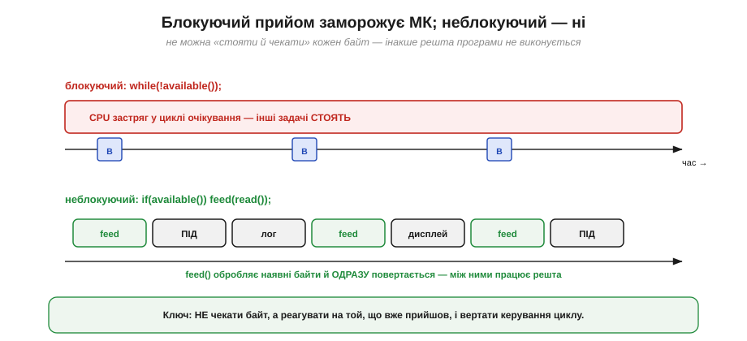
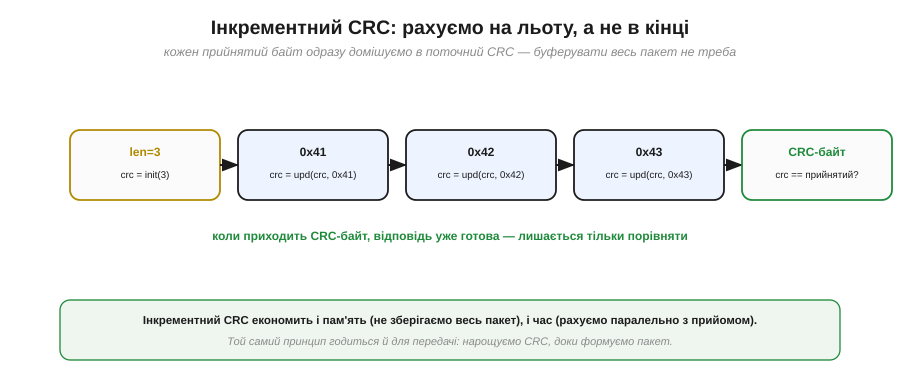
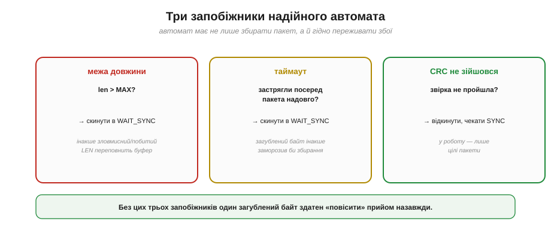

# Розбір потоку автоматом без блокування

Коли [пакет уже спроєктовано](book:communications/packet-design) і байти надійно прибувають у [буфер прийому](book:communications/flow-control), лишається **зібрати** з них повідомлення в живій програмі, яка ще й мусить робити сто інших справ: крутити ПІД-регулятор, оновлювати дисплей, слати телеметрію. Наївний підхід — «дочекатися байта, тоді наступного» — тут згубний. Правильний інструмент — **скінченний автомат** (*finite state machine*, FSM), який обробляє по одному байту за раз, **пам'ятає**, де зупинився, і ніколи не змушує програму чекати. Це не лише про UART: той самий патерн — серце будь-якого неблокуючого розбору потоку.

### Чому не можна «стояти й чекати»

Спокуслива на вигляд конструкція «чекай, поки прийде байт, тоді бери» насправді — пастка. Поки програма крутиться в циклі очікування, мікроконтролер **не робить більше нічого**: не реагує на давачі, не оновлює керування, не обслуговує інші лінії.


*Рис. Угорі: блокуючий `while(!available());` застрягає в очікуванні — усі інші задачі стоять, поки не прийде байт. Унизу: неблокуючий підхід — `if(available()) feed(read());` — обробляє той байт, що вже є, і одразу віддає керування циклу; між байтами спокійно працює решта програми.*

Різниця принципова. Блокуючий код **присвоює собі** процесор, доки лінія не зволить надіслати байт; а лінія повільна (на 9600 один [кадр UART](book:communications/uart-frame) іде ≈1 мс — для процесора це вічність). Неблокуючий код працює навпаки: він **ніколи не чекає**, а лише реагує на те, що вже прийшло, і миттєво повертає керування. Уся хитрість у тому, як обробити **частину** пакета й коректно продовжити з наступним байтом — і саме це робить автомат.

### Скінченний автомат прийому

Ідея автомата: розбити прийом на кілька **станів**, і в кожен момент пам'ятати, у якому ми зараз. Кожен прийнятий байт просуває автомат рівно на один крок — і це все, що робить виклик; далі керування повертається.


*Рис. Чотири стани: **WAIT_SYNC** (відкидаємо все, поки не побачимо SYNC), **GET_LEN** (запам'ятовуємо довжину), **GET_DATA** (збираємо рівно len байтів, лишаючись у цьому стані), **GET_CRC** (звіряємо CRC й повертаємось до WAIT_SYNC). Підписи на стрілках — умови переходів; пунктирна — захисний скид, якщо len завелика.*

Прочитаймо діаграму як історію одного пакета. Спершу автомат у **WAIT_SYNC** — ігнорує всі байти, поки не натрапить на SYNC; це і є те [самовідновлення, що його дає байт-маркер пакета](book:communications/packet-design). Побачив SYNC — переходить у **GET_LEN**, де наступний байт стає довжиною. Далі **GET_DATA**: автомат лишається в цьому стані й накопичує байти, аж поки їх не набереться рівно `len` — тоді переходить у **GET_CRC**. Там приймає контрольний байт, звіряє — і **в будь-якому разі** повертається в WAIT_SYNC, готовий до наступного пакета (видавши повідомлення, якщо CRC зійшовся).

### Стан, що живе між викликами

Що ж робить цей автомат неблокуючим? Те, що його «пам'ять» — кілька змінних — **переживає** між викликами `feed()`. Виклик не тримає процесор; він лише оновлює ці змінні й виходить, а наступний байт продовжить з того самого місця.


*Рис. Між викликами feed() зберігаються: `st` (поточний стан), `len` (очікувана довжина), `idx` (скільки даних уже зібрано), `buf[]` (накопичувач) і `crc` (що рахується на льоту). Саме ця жменька змінних дає автоматові змогу «пам'ятати» половину зібраного пакета, нічого не блокуючи.*

### Трасування: байт за байтом

Найкраще автомат розкривається на трасуванні. Проженімо крізь нього приклад [пакета](book:communications/packet-design) — `AA 03 41 42 43 <CRC>`.


*Рис. Шість прийнятих байтів — шість переходів. SYNC переводить у GET_LEN; довжина 3 — у GET_DATA; три байти даних накопичуються (на третьому idx досягає len); контрольний байт звіряється, пакет видається, автомат вертається у WAIT_SYNC. Між цими шістьма викликами мікроконтролер вільний робити будь-що інше.*

А ось як цей автомат виглядає в коді — компактна функція, яку викликають на кожен прийнятий байт:

```
enum { WAIT_SYNC, GET_LEN, GET_DATA, GET_CRC } st = WAIT_SYNC;
uint8_t buf[MAXLEN], idx, len, crc;

void feed(uint8_t b) {
  switch (st) {
    case WAIT_SYNC:
      if (b == SYNC) st = GET_LEN;            // інакше просто ігноруємо
      break;
    case GET_LEN:
      if (b > MAXLEN) { st = WAIT_SYNC; break; }   // захист від переповнення
      len = b; idx = 0; crc = crc_init(b);
      st = GET_DATA;
      break;
    case GET_DATA:
      buf[idx++] = b;
      crc = crc_update(crc, b);               // CRC рахуємо на льоту
      if (idx == len) st = GET_CRC;
      break;
    case GET_CRC:
      if (b == crc) handle_packet(buf, len);  // цілий пакет — у роботу
      st = WAIT_SYNC;                          // у будь-якому разі — наново
      break;
  }
}
```

Зверніть увагу, який він короткий і як точно повторює діаграму: один `switch` за станом, жодних циклів очікування, кожна гілка робить крихітну роботу й виходить. Це і є канонічний вигляд неблокуючого розбору.

### CRC на льоту

У коді ви вже помітили `crc_update` всередині GET_DATA — це **інкрементний** CRC. Замість збирати весь пакет і аж тоді рахувати контрольну суму, ми домішуємо кожен байт у поточний CRC одразу, щойно він прийшов.


*Рис. CRC ініціалізують на довжині, потім на кожному байті даних оновлюють. Коли приходить контрольний байт, відповідь уже готова — лишається тільки порівняти. Не треба ні зберігати весь пакет заради підрахунку, ні витрачати окремий час наприкінці.*

Це ощадливо подвійно: економить **пам'ять** (не треба тримати весь пакет лише щоб порахувати CRC) і **час** (підрахунок іде паралельно з прийомом). Той самий прийом працює й на передачі: нарощуємо CRC, доки формуємо пакет байт за байтом.

### Три запобіжники надійного автомата

Автомат із діаграми вже непоганий, але в суворому світі йому потрібні три **запобіжники**, без яких один збій здатен «повісити» прийом.


*Рис. **Межа довжини**: якщо len більша за буфер — скидання (інакше побитий чи зловмисний LEN переповнить пам'ять). **Таймаут**: якщо застрягли посеред пакета надовго — скидання (загублений байт інакше заморозив би збирання назавжди). **CRC не зійшовся**: відкинути й чекати SYNC — у роботу йдуть лише цілі пакети.*

Перший — **перевірка межі** довжини (вона вже є в коді: `if (b > MAXLEN)`): без неї спотворений байт довжини змусив би автомат читати, скажімо, 250 байт у 32-байтовий буфер — класичне переповнення. Другий — **таймаут**: якщо посеред пакета байти раптом перестали надходити (один загубився при overrun), автомат застрягне в GET_DATA назавжди; тому варто скидати його в WAIT_SYNC, якщо новий байт не прийшов протягом розумного часу. Третій — **ресинхронізація за CRC**: побитий пакет просто відкидаємо й чекаємо наступного SYNC. Усі три зводяться до одного: хай що піде не так, автомат завжди має дорогу назад у WAIT_SYNC.

> 🔧 **Навіщо це.** Ці запобіжники — різниця між демонстрацією «працює на столі» й кодом, якому можна довірити реальний зв'язок. Перевірка довжини рятує від переповнення буфера (а отже, від хаотичних збоїв і вразливостей); таймаут — від «вічного зависання» на одному загубленому байті; ресинхрон за CRC — від того, щоб побитий пакет колись потрапив у керування. Пишеш розбір протоколу — закладай усі три одразу, а не «потім».

### Місце в головному циклі

Лишилося побачити, як автомат живе в реальній програмі. Його `feed()` просто викликають у головному циклі поряд з усіма іншими задачами — і завдяки неблокуючості він нікому не заважає.


*Рис. У `loop()` по черзі відпрацьовують усі задачі: читання UART із викликом feed(), крок ПІД, оновлення дисплея, телеметрія. Кожна робить трохи й віддає керування. Буфер UART тримає байти між обертами циклу, тож жоден не губиться, навіть якщо до feed() черга дійшла не миттєво.*

Це той самий **неблокуючий** стиль, що й патерн [`millis()` замість `delay()`](book:programming/nonblocking-time) чи [super-loop проти блокувань](book:programming/super-loop-limits). Розбір UART-потоку — лише ще один його приклад: робити маленький крок на кожному оберті циклу й ніколи нікого не змушувати чекати. За потреби `feed()` можна викликати навіть із [переривання UART](book:programming/interrupts) — тоді пакети збиратимуться зовсім «у фоні».

> 🔧 **Навіщо це.** Запам'ятай цей патерн як універсальний: **стан у кількох змінних + крок на байт + жодного очікування**. Він годиться не лише для UART, а для будь-якого розбору потоку — від рядків команд до бінарних протоколів на інших шинах. Опанувавши його, ти зможеш надійно «слухати» будь-яке джерело даних, не жертвуючи чуйністю решти програми.
