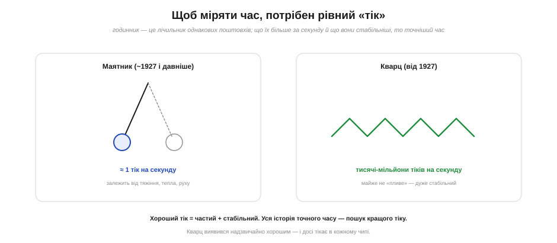
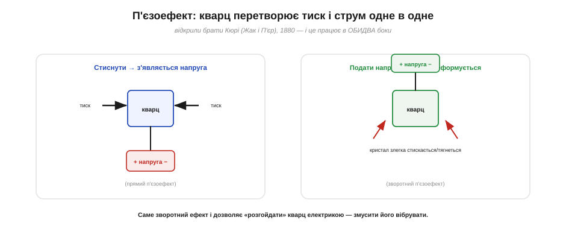
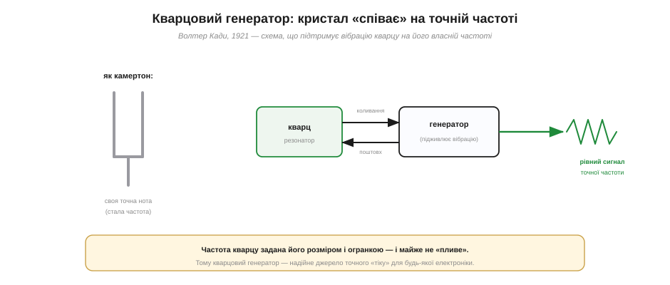
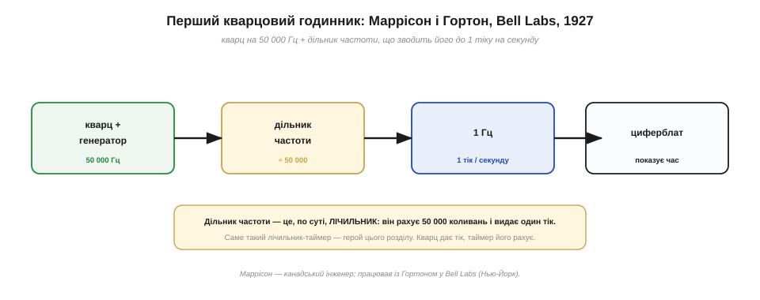
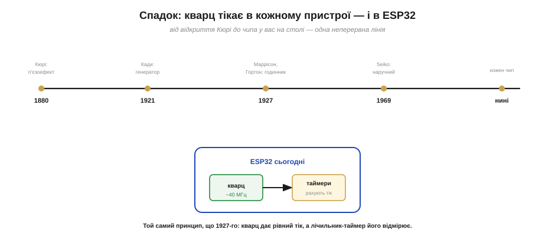

# 📜 Кварцовий резонатор: точний час для машин і годинників

> Ця історія веде **ланцюгом питань** навколо однієї дивовижної ідеї: що крихітний шматочок **кварцу**, якщо «полоскотати» його електрикою, тремтить так рівно й незмінно, що з нього виходить найточніший масовий годинник в історії. Сьогодні цей кристал тихо цокає в кожному телефоні, годиннику й мікроконтролері — зокрема у вашому ESP32, — задаючи ритм усій електроніці. А починалася ця історія від простого спостереження двох братів, що стиснутий кристал чомусь породжує напругу. Заразом видно, що **дільник частоти** з першого кварцового годинника — це і є той самий **лічильник-таймер**, на якому тримається весь [облік часу в мікроконтролері](book:programming/timer-counter).

Перерви навчили мікроконтролер **реагувати на події вмить**. Та лишається велике питання: а як машина взагалі знає, **котра година**, скільки минуло часу, коли настане «рівно секунда»? Реагувати на зовнішню подію — одне; а **самій** відміряти рівні проміжки часу — зовсім інше. Для цього потрібен **рівний, незмінний «тік»** — еталонне биття, за яким можна лічити час. Питання, де взяти такий ідеальний тік, — і є серцевина цієї історії, а водночас і фундамент усієї роботи таймерів.

*Рис. Будь-який годинник — це лічильник однакових поштовхів. Маятник дає приблизно один тік на секунду й «пливе» від тяжіння, тепла й руху. Кварц тремтить тисячі-мільйони разів на секунду й майже не змінює свого ритму. Хороший тік — **частий і стабільний**; уся історія точного часу — це пошук дедалі кращого тіку.*

---

## Машині потрібен рівний тік: що таке хороший годинник

Будь-який годинник, від сонячного до атомного, влаштований однаково: у ньому є щось, що **рівно повторюється**, і лічильник, що ці повторення рахує. Сонце сходить — минула доба; маятник хитнувся — минула секунда; порахували потрібну кількість — знаємо, скільки часу спливло. Уся точність годинника впирається в **якість цього повторюваного тіку**, і вимог до нього дві.

По-перше, тік має бути **стабільним** — повторюватися завжди з тим самим періодом, не пришвидшуючись і не вповільнюючись від тепла, вологи чи струсів. По-друге, бажано, щоб він був **частим**: що більше тіків за секунду, то дрібніші проміжки часу можна розрізнити. Маятник дає лише близько одного тіку на секунду — годі виміряти ним тисячну частку секунди. А ще він підступно «пливе»: нагрівся стрижень — період змінився, повезли годинник кораблем — хитавиця збила хід.

Століттями маятник був вершиною точності. Голландець **Хрістіан Гюйгенс** (*Christiaan Huygens*) у 1656 році вперше приборкав його в годиннику — і це був велетенський крок: похибка впала з хвилин до секунд на день. Та межа маятника швидко стала очевидною: він **повільний** і надто **чутливий** до всього довкола. Щоб піти далі, потрібен був інший, кращий тік — частіший і байдужий до зовнішнього світу. І знайшовся він у геть несподіваному місці — у звичайному на вигляд камінці, кристалі кварцу.

Варто згадати й інший бік цієї гонитви за точністю — **навігацію**. Щоб визначити в морі довготу, морякам конче треба було точно знати час, та маятник на хиткій палубі ставав безпорадним. Англійський годинникар **Джон Гаррісон** (*John Harrison*) півжиття поклав на морський хронометр, що тримав хід попри хитавицю, — і врешті розв'язав цю «проблему довготи» XVIII століття. Його праця яскраво показала, чого світ найбільше прагнув від годинника: бути точним **усюди**, байдужим до руху й тряски. Саме цю якість — незворушність до зовнішнього світу — кварц згодом дав сповна.

> 🔧 **Навіщо це.** Та сама ідея «рівний тік + лічильник» живе й у вашому ESP32, тільки тіків там не один на секунду, а десятки мільйонів. Коли таймер «рахує такти» й сповіщає про сплив часу — це пряме продовження сонячного годинника й маятника Гюйгенса. Змінився лише **тік**: замість тіні чи хитання — тремтіння кварцу. Лічба ж лишилася тією самою.

---

## П'єзоефект: кристал, що відповідає на дотик

1880 року двоє молодих французьких фізиків, брати **Жак і П'єр Кюрі** (*Jacques et Pierre Curie*), помітили дивну річ. Якщо стиснути певні кристали — кварц, турмалін, сегнетову сіль, — на їхніх гранях з'являється електрична **напруга** — то більша, що сильніший тиск. Це явище назвали **п'єзоелектрикою** (від грецького *piezein* — «тиснути»). Молодший із братів, П'єр, згодом стане всесвітньо відомим — разом із дружиною Марією він відкриє радіоактивність і здобуде Нобелівську премію; та піонерську працю про п'єзоефект брати зробили **разом**, і ім'я старшого, Жака, незаслужено лишилося в тіні.

Спершу це здавалося лише цікавим лабораторним фокусом. Та невдовзі інший француз, фізик **Габріель Ліппман** (*Gabriel Lippmann*), теоретично передбачив, що ефект мусить працювати й **навпаки**: якщо **подати** на кристал напругу, він має трохи **деформуватися** — стиснутися чи розтягнутися. Брати Кюрі тут-таки це підтвердили дослідом. Так відкрився **зворотний п'єзоефект** — і саме він, як виявиться згодом, стане ключем до точного часу.

*Рис. Прямий п'єзоефект (Кюрі, 1880): стиснеш кварц — на гранях з'явиться напруга. Зворотний (передбачив Ліппман, підтвердили Кюрі): подаси напругу — кристал злегка деформується. Саме зворотний ефект і дозволяє «розгойдати» кварц електрикою, змусивши його вібрувати.*

Чому це так важливо? Бо зворотний ефект перетворює кварц на **місток** між електрикою й механічним рухом. Подаючи на кристал змінну напругу, можна змусити його **тремтіти** — механічно коливатися. А якщо коливання збігається з тим, як кристал «любить» вібрувати від природи, він відгукується надзвичайно охоче й рівно. Лишалося це використати — але до того минуло ще сорок років.

А чому саме кварц, а не якийсь інший п'єзокристал? Бо кварц — напрочуд вдалий збіг чеснот. Він **поширений** і дешевий (це звичайний діоксид кремнію, той самий, що в піску й гірському кришталі), **хімічно стійкий**, майже не зношується й, головне, має винятково «чистий» резонанс: вдаривши, він дзвенить **довго й рівно**, майже не гублячи енергії. До того ж, якщо вирізати пластинку під правильним кутом до осей кристала, її частота майже не «пливе» від температури. Це поєднання дешевизни, стійкості й чистоти й зробило кварц матеріалом точного часу №1 — він обійшов усіх суперників.

---

## Як змусити кварц співати: генератор Кади

Сорок років п'єзоефект чекав свого інженера. Ним став американський фізик **Волтер Ґайтон Кади** (*Walter Guyton Cady*). 1921 року він показав, що шматочок кварцу поводиться як **резонатор** — точнісінько як камертон. У камертона є своя «нота», власна частота, на якій він дзвенить, коли його вдарити; так само й у кварцового бруска є строго визначена власна частота механічних коливань, задана його **розміром і огранкою**. І ця частота напрочуд **стала** — майже не залежить від температури й часу.

Кади придумав, як цей резонанс **підтримувати** електрично. Він з'єднав кварц зі схемою-підсилювачем так, що коливання кристала керували схемою, а схема раз у раз **підштовхувала** кристал — рівно в такт. Вийшов замкнений цикл, у якому кварц вібрує **безперервно** на своїй власній частоті, а на виході схеми з'являється бездоганно рівний електричний сигнал тієї ж частоти. Так народився **кварцовий генератор** — Кади дістав на нього патенти 1923 року й по праву зветься «батьком сучасної п'єзоелектрики».

*Рис. Кварц у генераторі — мов камертон зі своєю точною «нотою». Схема-генератор (Кади, 1921) підживлює коливання кристала: він коливає схему, схема підштовхує його — і так нескінченно. На виході — рівний електричний сигнал точної, майже незмінної частоти. Це й є джерело ідеального «тіку».*

Раптом інженери дістали саме те, чого бракувало для точного часу: джерело **частих і стабільних** коливань. Кварцовий генератор тікав десятки тисяч разів на секунду — у десятки тисяч разів частіше за маятник — і майже не «плив». Лишався останній крок: перетворити це швидке тремтіння на звичні секунди, хвилини, години. І цей крок зробили в Bell Labs.

---

## Маррісон і Гортон: перший кварцовий годинник

1927 року в **Bell Telephone Laboratories** у Нью-Йорку двоє інженерів — канадець **Воррен Маррісон** (*Warren A. Marrison*, 1896–1980) і його колега **Джозеф Гортон** (*Joseph W. Horton*) — зібрали перший у світі **кварцовий годинник**. Вони працювали над кварцовими генераторами для телефонного зв'язку ще з кінця 1924 року (Bell потребувала точних частот для своєї апаратури) — і збагнули, що той самий стабільний генератор можна перетворити на годинник небаченої точності.

Серце їхнього годинника — кварцовий генератор на **50 000 Гц** (50 тисяч коливань на секунду). Але як із 50 тисяч тремтінь дістати одну рівну секунду? Тут і ховається головна для нас ідея. Маррісон і Гортон пропустили сигнал крізь **дільник частоти** — схему, що **лічить** коливання й видає один імпульс на кожні 50 000 вхідних. Порахувала 50 000 тремтінь — клацнула один раз: ось вона, секунда. Так швидке тремтіння кварцу перетворилося на повільний, але бездоганно рівний хід.

*Рис. Будова годинника Маррісона й Гортона (1927): кварцовий генератор дає 50 000 Гц; дільник частоти ділить їх на 50 000 і видає 1 Гц — один тік на секунду, що рухає циферблат. А **дільник частоти — це, по суті, лічильник**: він рахує коливання й клацає, набравши потрібну кількість. Саме такий лічильник-таймер і відмірює час у мікроконтролері.*

Зупинімося на цьому слові — **дільник**. Поділити частоту на 50 000 означає **порахувати** 50 000 коливань і аж тоді подати сигнал. Тобто дільник частоти — це **лічильник тіків**. А лічильник тіків кварцу — це і є **таймер**. Перший кварцовий годинник 1927 року вже містив у собі те, що сьогодні є в кожному мікроконтролері: джерело рівного тіку (кварц) і лічильник, що цей тік відмірює. Уся робота таймера — лише розгортання цієї простої й могутньої пари.

Перший годинник був ще незграбний — ціла шафа апаратури, — і Маррісон уже 1928 року зробив досконаліший варіант. Та головне було доведено: кварц дає точність, недосяжну для жодного маятника. Похибка кварцового годинника впала до часток секунди на місяць там, де найкращі маятникові помилялися на секунди щодня.

Цікаво, що годинник для Маррісона з Гортоном був майже **побічним** продуктом. Bell Labs цікавила не так точна година, як **точна частота** — стабільний еталон, потрібний, щоб напихати в один телефонний кабель багато розмов одразу й тримати радіостанції на своїх хвилях. Кварц давав цей еталон, а годинник був ефектним доказом його стабільності. Згодом інженери навчилися ще й тримати кристал у **термостаті**: за сталої температури він «плив» зовсім мізерно, — і кварцові годинники Bell на десятиліття стали зберігачами національного еталону часу, доки їх не перевершили атомні.

> 🔧 **Навіщо це.** Запам'ятайте цю пару — **кварц + лічильник**, — бо саме вона працює у вас на столі. ESP32 не «відчуває» часу сам собою; він лічить тіки свого кварцу. Регістр таймера, що зростає на одиницю з кожним тактом, чи функція `millis()`, що повертає кількість мілісекунд, — це буквально нащадок дільника Маррісона. Кварц цокає, таймер лічить, а код читає результат. Уся «магія часу» в мікроконтролері — це лічба коливань кристала.

---

## Що лишилося нам: кварц у кожному чипі

Від першого годинника шлях кварцу був стрімкий. У роки Другої світової кварцові генератори стали серцем радіозв'язку — точна частота тримала станції «на хвилі». А 1969 року японська **Seiko** випустила перший наручний кварцовий годинник *Astron*, і за кілька років дешевий, точний кварц витіснив механіку з зап'ясть усього світу — це назвали «кварцовою революцією». Для ще вищої точності згодом з'явилися атомні годинники, та для повсякдення кварцу більш ніж досить, і він лишився **всюдисущим**.

*Рис. Неперервна лінія: 1880 — п'єзоефект Кюрі; 1921 — генератор Кади; 1927 — годинник Маррісона й Гортона; 1969 — наручний Seiko; нині — кварц у кожному чипі. У ESP32 кварц (типово ~40 МГц) задає такт, а таймери лічать його коливання — той самий принцип, що й 1927 року.*

І ось ця історія приводить нас просто до робочого столу. На платі вашого ESP32 є кварцовий резонатор — звичайно на **40 мегагерців** (40 мільйонів коливань на секунду), а часто й другий, маленький, на 32 768 Гц для годинника реального часу. Цей кварц задає такт усьому чипові: процесор виконує інструкції в його ритмі, а **таймери** — спеціальні апаратні лічильники — рахують його коливання, щоб відміряти час. Коли ваша програма викликає `delay(1000)` чи `millis()`, під капотом працює та сама ідея, що й у дільнику Маррісона: порахувати потрібну кількість тіків кварцу.

У тому маленькому кварці на 32 768 Гц ховається ще й гарна інженерна елегантність. Це число не випадкове: 32 768 — це рівно **два в п'ятнадцятому степені** (2¹⁵). А отже, щоб дістати з нього один тік на секунду, досить **п'ятнадцять разів поділити частоту навпіл** — пропустити її крізь ланцюжок із п'ятнадцяти простих [двійкових](book:math/why-binary) тригерів. Кожен тригер ділить на два, п'ятнадцять поспіль — на 32 768, і на виході рівно 1 Гц. Дільник частоти Маррісона, доведений до краси: найдешевша двійкова лічба перетворює тремтіння кварцу на секунду.

Тож історія точного часу — це не музейна давнина, а буквально опис того, що цокає у вас під пальцями. Брати Кюрі помітили дивну напругу на стиснутому кристалі; Ліппман передбачив, а вони підтвердили зворотний ефект; Кади змусив кварц співати; Маррісон і Гортон порахували його спів і дістали секунди. Кожен додав свою ланку, у різних країнах і різних десятиліттях, — і разом вони подарували машинам відчуття часу. А як саме мікроконтролер лічить ці тіки, як із них роблять мілісекунди, періодичні події, точні затримки й навіть «сторожа», що рятує від зависань, — про це вже сама робота [таймера-лічильника](book:programming/timer-counter).
