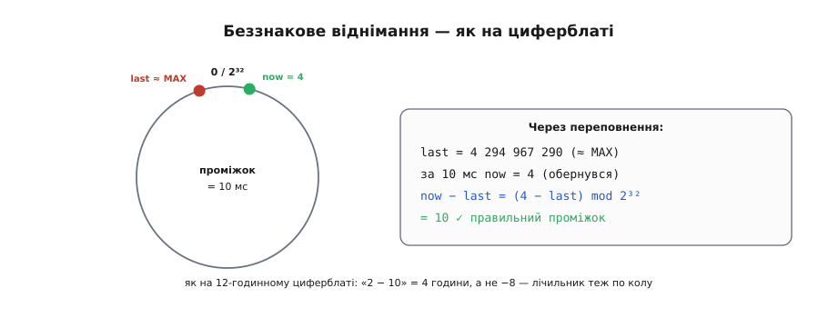
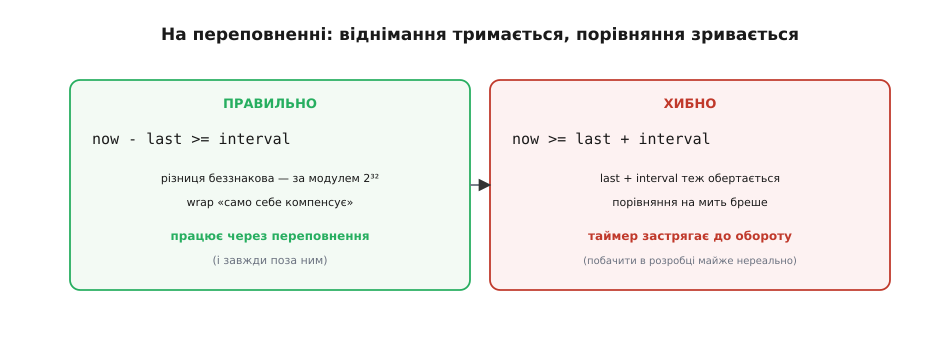

# 🧮 Чому millis() переживає переповнення: модульна арифметика беззнакових

> Математична вставка про [період і переповнення таймера](book:programming/timer-overflow). Є правило «віднімай, не порівнюй». Тут — **чому** воно працює навіть на самому переповненні. Магії нема — є модульна арифметика.

## Означення: лічба за модулем

`millis()` повертає **беззнакове** 32-бітне число; дійшовши до максимуму (2³² − 1 ≈ 4.29 млрд мс ≈ 49.7 дня), воно **обертається** в нуль. Це не випадковість реалізації, а закон мови: будь-яка арифметика над беззнаковим цілим у C/C++ означена **за модулем** 2ᴺ, де N — ширина типу в бітах. «За модулем» (англ. *modulo*, від лат. *modulus* — «мірка, мала міра») означає, що результат будь-якої дії беруть як **лишок від ділення** на 2ᴺ: усе, що «вилазить» за межу, відкидається, лишається тільки залишок.

Формально для беззнакового типу шириною N:

```
a + b   завжди дорівнює   (a + b) mod 2ᴺ
a − b   завжди дорівнює   (a − b) mod 2ᴺ
```

Жодного «переповнення-помилки» тут немає: апаратний суматор просто відкидає біт, що не влазить у N розрядів, а це рівно те саме, що взяти лишок за модулем 2ᴺ. Тому переповнення беззнакового — поведінка **означена й передбачувана** (на відміну від знакового, де переповнення в C — невизначена поведінка; саме тому час **завжди** тримають у беззнаковому типі).

## Інтуїція: усе замкнено в кільце

Найкращий образ — **циферблат**. На 12-годинному годиннику немає числа «13»: після 12 знову йде 1, бо години живуть за модулем 12. І віднімання там теж «по колу»: «2 − 10» дає не −8, а **4** години (саме стільки треба відмотати назад від 10-ї, щоб дістатися 2-ї, обійшовши північ). Від'ємного результату просто не існує — відлік замкнений у кільце.

Беззнаковий лічильник — той самий циферблат, лише з 2³² поділками замість дванадцяти. Значення біжать по колу від 0 до 2³² − 1, а за останнім знову стоїть 0. Тому **різниця двох значень обчислюється по колу** — і виходить правильною, навіть коли одне число вже перескочило через нуль, а друге ще ні. Око бачить «маленьке мінус велике», а кільце повертає чесний короткий проміжок між ними.


*Лічильник замкнений у кільце 0…2³²−1. last близько до MAX, now обернувся через 0 у 4 — а now − last (за модулем 2³²) дає правильні 10. Як на циферблаті: «2 − 10» = 4 години, а не −8.*

## Формальний апарат

Проміжок часу — це різниця за модулем 2³²:

```
проміжок = (now − last) mod 2³²
```

Ця формула дає **правильний** час, що минув, доки справжній проміжок менший за повне коло 2³² (тобто між двома перевірками минуло менш як ~49.7 дня — на практиці завжди). Простежмо найгірший випадок — саме на переповненні, коли `last` майже на межі, а `now` уже обернувся через нуль:

```
last = 4 294 967 290              (близько до MAX = 2³² − 1)
за 10 мс лічильник обертається:
now  = (4 294 967 290 + 10) mod 2³² = 4
now − last = (4 − 4 294 967 290) mod 2³²
           = 4 + 2³² − 4 294 967 290
           = 4 + 6 = 10   ✓
```

Беззнакове віднімання **само** додало «повне коло» (2³²) і повернуло чесні 10 мс. Це не евристика й не щасливий збіг: рівність `(now − last) mod 2³²` дорівнює справжній кількості тіків щоразу, коли тіків було менше за 2³². Доведення коротке: нехай справжня кількість пройдених тіків — `d`, тоді `now = (last + d) mod 2³²`. Підставивши, дістаємо `(now − last) mod 2³² = ((last + d) − last) mod 2³² = d mod 2³²`, а доки `d < 2³²`, це і є саме `d`. Біт переповнення, який «загубився» при додаванні `last + d`, точно компенсується тим самим модулем при відніманні.

На рівні заліза це ще наочніше. Процесор віднімає без жодної перевірки на знак: коли з меншого числа віднімають більше, з неіснуючого «(N+1)-го» розряду береться **позика** (англ. *borrow*), і саме вона вносить ту саму одиницю старшого розряду — тобто рівно 2³². Через те `4 − 4 294 967 290` дає не «мінус щось», а `6`, наче зверху позичили повне коло. Інакше кажучи, апаратна позика при відніманні — це фізичне втілення «+2³² за модулем»; програмісту нічого додавати руками, бо суматор уже зробив це за нього. Та сама апаратна дія обслуговує і додавання, і віднімання — просто в одному випадку зайвий біт відкидається, а в іншому позичається.


*Правильна форма `now − last >= interval` працює через переповнення. Хибна `now >= last + interval` на переповненні зривається: last+interval теж обертається, порівняння бреше, і таймер «застрягає» аж до наступного обороту (~49.7 дня).*

А хибна форма `now >= last + interval` саме тут і зривається. Вона рахує **майбутню межу** `last + interval` — і ця сума так само обертається за модулем. Коли `last` близько до MAX, `last + interval` перескакує через нуль і стає **маленьким** числом; свіже `now` (ще велике, до власного обороту) виявляється більшим — і умова хибно «спрацьовує» зарано або, дзеркально, після обороту `now` стає малим і **ніколи** не дотягує до старої великої межі, тож подія застрягає аж до наступного повного кола. Різниця між двома формами — лише в тому, **що** обертається: у правильній обертається сама різниця (і самокомпенсується), у хибній — межа порівняння (і бреше). Найпідступніше, що побачити цей зрив у розробці майже неможливо: треба тримати прошивку ввімкненою близько 50 днів поспіль, а такого ніхто не робить за столом.

> 🔧 **Навіщо це.** Правило «зберігай мітку беззнаковою й завжди віднімай» прибирає цілий клас «довгограючих» зависань — тих, що в лабораторії не ловляться, а у виробі рано чи пізно стаються. Пам'ятайте різницю не як заклинання, а як наслідок кільця: відняти два значення безпечно завжди, додати до одного з них — небезпечно поблизу обороту.

## Пастка ширини типу

Кільце «зійдеться» лише тоді, коли **мітка й лічильник однакової беззнакової ширини**. Це найчастіша реальна помилка. `millis()` повертає `unsigned long` (32 біти), тож і змінну `last` треба оголошувати `unsigned long`, а не `int` чи `long`:

```c
unsigned long last = 0;            // ПРАВИЛЬНО: та сама ширина, беззнакове
// int last = 0;                   // ПОМИЛКА: 16/32-бітне ЗНАКОВЕ — кільце не те
if (millis() - last >= interval) { last = millis(); /* ... */ }
```

Якщо `last` зробити знаковим або вужчим, віднімання порахується в **іншому** кільці (або взагалі в знаковій арифметиці з невизначеним переповненням) — і компенсація зламається саме на обороті. Наочно видно й на вужчому прикладі: уявімо мітку в 16-бітному беззнаковому (кільце 2¹⁶ = 65536). Якщо лічильник тим часом устиг пройти понад 65536 тіків, різниця `now − last` дасть лишок за модулем 65536 — тобто **заниження** на ціле коло, і таймер «спрацює» на хибному, набагато коротшому проміжку. Кільце мусить бути не вужчим за реальний інтервал, який ви міряєте, — а для `millis` це саме повні 32 біти. Та сама пересторога стосується сталої `interval`: тримайте її беззнаковою (`unsigned long`), щоб порівняння йшло цілком у беззнаковому світі й тип не «підвищувався» несподівано до знакового.

## Де ще це працює

Та сама модульна різниця рятує не лише порівняння інтервалів. Вона ж лежить в основі [захоплення мітки часу на переповненні таймера](book:programming/capture-compare): різницю двох захоплених міток рахують так само відніманням, і wrap лічильника апаратного таймера компенсується тим самим способом. На цьому ж принципі стоять **індекси кільцевого буфера**, що «обертаються» через нуль за модулем розміру буфера, — звідси й назва «кільцевий».

І пам'ятайте, що [`micros()`](book:programming/millis-micros) має менший діапазон: мікросекунд у те саме 32-бітне число влазить у тисячу разів менше, тож воно обертається вже за ~71 хвилину. Там віднімати **тим паче** обов'язково — оборот настає не «колись за 50 днів», а буквально за годину з чвертю безперервної роботи.

Одне правило — «зберігай мітку беззнаковою тієї самої ширини й завжди віднімай» — і всі ці переповнення стають для вас невидимими: код просто працює, скільки б днів пристрій не пропрацював без перезавантаження. Тому-то досвідчені інженери пишуть `now − last` рефлекторно, навіть не згадуючи про ті 49.7 дня.
