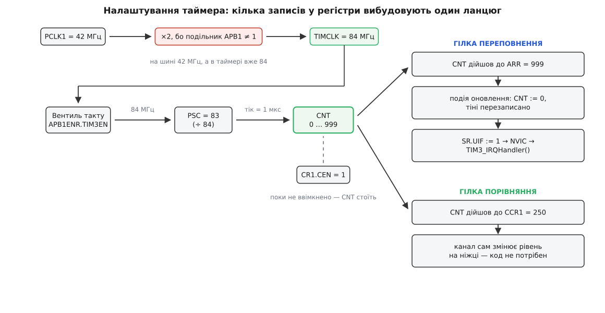
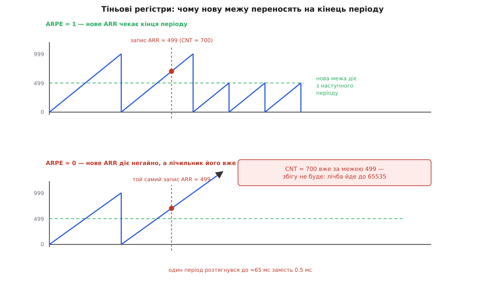
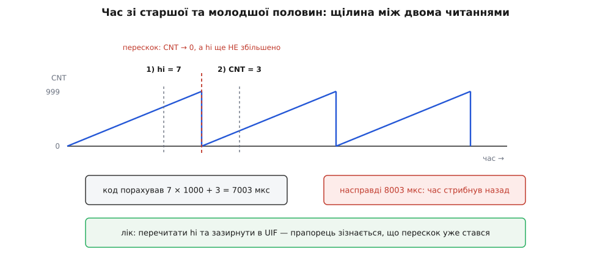

# ⚙️ Налаштувати таймер від нуля: від увімкнення такту до першого спрацювання

Арифметика передільника й межі лічби займає два рядки на серветці, а перетворення цих двох чисел на працюючий таймер потребує десятка записів у регістри — і майже кожен із них має спосіб мовчки збрехати. Тут ми пройдемо весь шлях мовою C на регістрах, і біля кожного запису стоятиме відповідь на питання «а що буде, якщо зробити інакше».

<preknowlist>
- [Регістри периферії](topic:programming/memory-mapped-io) — вузлами чипа керують, читаючи й записуючи комірки з фіксованими адресами.
- [Таймер-лічильник](topic:programming/timer-counter) — як передільник і ширина лічильника складаються в тривалість одного тіку й у діапазон лічби.
- [Переривання](topic:programming/interrupts) — залізо вміє зупинити поточний код і покликати обробник.
- [volatile](topic:programming/volatile) — чому комірку, яку міняє не наш код, компілятору заборонено кешувати в регістрі процесора.
</preknowlist>

## Задача

Візьмімо конкретний чип — STM32F411 із ядром на 84 МГц — і конкретну вимогу, яка трапляється в кожному другому проєкті:

- таймер TIM3 має бити **рівно раз на мілісекунду** й кликати обробник переривання;
- той самий таймер має сам, без участі коду, тримати на ніжці прямокутник із **високим рівнем перші 250 мкс** кожного періоду;
- період мусить бути саме таким, і наприкінці ми маємо вміти це **довести**, а не сподіватися.

TIM3 тут не випадковий: він шістнадцятибітний і висить на повільній шині APB1. Обидві обставини створюють пастки, яких на тридцятидвобітному таймері швидкої шини не видно, — а отже, саме на ньому все цікаве й вилізе.

## Ідея: один ланцюг і два його споживачі

Усе налаштування — це побудова одного ланцюга. Такт заходить у периферійний блок, ділиться передільником, наганяє лічильник; далі лічильник живить двох споживачів, які й роблять із голого числа корисну дію. Перший споживач — порівняння з межею: коли лічильник дійшов до неї, залізо скидає його в нуль і піднімає прапорець. Другий — порівняння з порогом: коли лічильник дійшов до порога, канал сам смикає ніжку.


*Такт від шини APB1 доходить до таймера подвоєним, проходить крізь вентиль тактування периферії й передільник — і лічильник біжить зручними тіками по мікросекунді. Далі та сама лічба живить дві незалежні гілки: порівняння з межею ARR дає період і переривання, порівняння з порогом CCR1 дає рівень на ніжці.*

Записи в регістри йдуть саме в цьому порядку, і порядок не декоративний: кожен наступний запис має сенс лише тоді, коли попередній уже подіяв.

## Крок нульовий: яка частота заходить у таймер

Усі подальші числа рахуються від однієї величини — частоти, що доходить до блока таймера. Помилитися тут означає помилитися в усьому, причому рівно вдвічі, і жоден рядок коду про це не скаже.

На STM32 таймери висять на шинах APB, і в дерева тактування є неочевидне правило: **якщо подільник шини APB дорівнює одиниці, таймер отримує частоту шини; якщо подільник будь-який інший — таймер отримує подвоєну частоту шини**. Зроблено це, щоб таймери не втрачали роздільності на повільній периферійній шині, але виглядає як підступ: у конфігураторі написано «APB1 = 42 МГц», а таймер рахує від 84 МГц.

```
SYSCLK              = 84 МГц
подільник AHB  = 1  → HCLK  = 84 МГц
подільник APB1 = 2  → PCLK1 = 42 МГц
подільник APB1 ≠ 1  → TIMCLK = 2 × PCLK1 = 84 МГц   ← від цього числа рахуємо
```

Наївне «беру 42 МГц, бо на цій шині сидить TIM3» дає передільник удвічі менший, ніж треба, і період удвічі коротший, ніж замовлено. Симптом підступний тим, що виглядає правдоподібно: усе працює, просто вдвічі швидше. Як влаштоване саме це дерево множників і подільників — у статті [дерево тактування STM32](topic:programming/stm32-clock-tree).

## Крок перший: увімкнути такт периферії

Мікроконтролер економить енергію найпрямішим способом — не подає такт на вузли, якими ніхто не користується. Після скидання таймер знеструмлений у цьому сенсі: адреси його регістрів існують, але за ними немає живої логіки. Записи туди зникають безслідно, читання повертає нулі. Тому перший запис — не в таймер:

```c
RCC->APB1ENR |= RCC_APB1ENR_TIM3EN;   /* подати такт на блок TIM3 */
(void)RCC->APB1ENR;                   /* зворотне читання: запис уже дійшов */
```

Другий рядок виглядає безглуздо — прочитали й викинули. Але між ядром і периферією стоїть буфер записів, і процесор іде далі, не чекаючи, поки запис доїде до RCC. Якщо наступною ж інструкцією звернутися до TIM3, звернення може випередити ввімкнення такту, і воно пропаде. Виробник визнає це в офіційних переліках відомих вад чипа, і серед рекомендованих способів — вставити кілька порожніх інструкцій або зробити зворотне читання будь-якого регістра RCC. Читання не має власного сенсу, зате воно не може завершитися, доки шина не віддасть відповідь, — а віддати відповідь вона може лише після того, як попередній запис відпрацював. Докладніше про тактові домени й ціну ввімкнення — у статті [тактування периферії](topic:programming/peripheral-clock-enable).

## Крок другий: два числа й одне «мінус один»

Тепер власне арифметика. Тік у нас має бути 1 мкс, період — 1000 тіків:

```
передільник = TIMCLK / бажана частота тіків = 84 000 000 / 1 000 000 = 84
тіків у періоді = частота тіків / бажана частота = 1 000 000 / 1000 = 1000
```

А в регістри йдуть числа **83** і **999**. Це не примха розробників заліза, і зрозуміти причину варто раз і назавжди, бо вона однакова в усіх чипів.

Передільник — це подільник частоти, і його найменше осмислене значення — одиниця, тобто «не ділити зовсім». Якби регістр зберігав сам подільник, код 0 означав би ділення на нуль — марна, невизначена комбінація, і один із 65 536 кодів пропав би даремно. Зберігаючи «подільник мінус один», залізо робить кожен код корисним: 0 означає ÷1, а 65535 означає ÷65536. Точно так само з межею: період у один тік має бути виразним, тож 0 означає «один тік у періоді», а 65535 — «65 536 тіків». Правило, яке з цього випливає:

```
тіків у періоді = ARR + 1
тактів у періоді = (PSC + 1) × (ARR + 1)
період = (PSC + 1) × (ARR + 1) / TIMCLK
```

Забути «мінус один» в одному місці — отримати період на тік довший, ніж треба. На тисячі тіків це 1000 ppm, тобто в п'ятдесят разів гірше за похибку кварцу; помилка мала на око й величезна за міркою точного часу. Найдешевша страховка — не писати числа руками, а порахувати їх із вимог і перевірити на етапі компіляції:

```c
#define TIMCLK_HZ   84000000u   /* частота, що доходить до TIM3 (не PCLK1!) */
#define TICK_HZ      1000000u   /* хочемо тік 1 мкс */
#define PERIOD_HZ       1000u   /* хочемо період 1 мс */

#define PSC_VAL  (TIMCLK_HZ / TICK_HZ   - 1u)   /* 84   − 1 = 83  */
#define ARR_VAL  (TICK_HZ  / PERIOD_HZ  - 1u)   /* 1000 − 1 = 999 */
#define CCR_VAL  250u                            /* 250 тіків високого рівня */

_Static_assert(TIMCLK_HZ % TICK_HZ  == 0u, "передільник не цілий — тік поїде");
_Static_assert(TICK_HZ % PERIOD_HZ  == 0u, "межа не ціла — період поїде");
_Static_assert(PSC_VAL <= 0xFFFFu,         "PSC не влазить у 16 бітів");
_Static_assert(ARR_VAL <= 0xFFFFu,         "TIM3 шістнадцятибітний, ARR завеликий");
_Static_assert(CCR_VAL <= ARR_VAL + 1u,    "поріг за межею періоду — збігу не буде");
```

П'ять перевірок, які нічого не коштують під час роботи, ловлять п'ять найчастіших способів схибити. Перевірка ширини ARR особливо доречна саме на шістнадцятибітному таймері: варто взяти період довший за 65 536 тіків — і без неї число мовчки обріжеться до молодших шістнадцяти бітів, а період вийде яким завгодно.

> 🔧 **Навіщо це.** Стеля шістнадцятибітного таймера легко рахується: 65 536 тіків у періоді на 65 536 тактів у тіку — це 4.29 мільярда тактів, тобто на 84 МГц близько 51 секунди. Усе, що довше, на одному такому таймері не поміщається, і період доводиться або складати з переповнень у програмі, або брати тридцятидвобітний таймер, або тактуватися не від системної частоти, а від годинникового кварцу на 32 768 Гц. Прикидати цю стелю варто **до** того, як писати код: інакше вимога «раз на дві хвилини» відкривається аж на випробуваннях.

## Крок третій: канал порівняння — і чому тут «мінус один» уже нема

Поріг живе за іншим правилом, і плутанина тут коштує одного тіку в кожному імпульсі. У режимі ШІМ рівень на ніжці активний, доки **лічильник менший за поріг**, тобто на значеннях лічильника 0, 1, …, CCR−1. Виходить рівно CCR тіків активного рівня — без жодного «мінус один»:

```
тривалість високого рівня = CCR тіків
частка високого рівня     = CCR / (ARR + 1)

CCR = 250, ARR = 999  →  250 мкс із 1000 мкс  →  рівно 25 %
```

Причина розбіжності проста: ARR і PSC описують **межі**, а поріг описує **кількість**. Для межі значення 0 має означати щось корисне, тому її зсунули на одиницю; кількість 0 і так осмислена — це «жодного тіку активного рівня», тобто шпаруватість 0 %. Зсувати нічого не треба, і залізо не зсуває.

Канал виводить сигнал на ніжку, а ніжка спершу має погодитися, що нею керує таймер, а не порт вводу-виводу. Для TIM3_CH1 це PA6 в альтернативній функції номер два — окрема історія, докладно розібрана в статті про [регістри GPIO](topic:programming/gpio-registers):

```c
RCC->AHB1ENR |= RCC_AHB1ENR_GPIOAEN;
/* спершу вибрати функцію, потім віддати їй ніжку: після скидання PA6 — вхід,
   тож так він переходить одразу до потрібної функції, ні на мить не ставши
   виходом із чужим рівнем */
GPIOA->AFR[0] = (GPIOA->AFR[0] & ~(0xFu << (6 * 4))) | (2u << (6 * 4));  /* AF2 */
GPIOA->MODER  = (GPIOA->MODER  & ~(3u << (6 * 2))) | (2u << (6 * 2));    /* альтернативна */
```

## Крок четвертий: тіні, або коли новий поріг набуває чинності

Найглибша з пасток — та, що PSC, ARR і CCR існують **у двох примірниках**. Один ви пишете з коду, другим користується лічильник. Другий називають тіньовим, або активним, і перенесення з першого в другий відбувається не тоді, коли вам заманулося, а на **події оновлення** — у мить, коли лічильник перескакує через нуль.

Навіщо така складність, видно з простого питання: що буде, якщо змінити межу посеред періоду? Лічильник уже пробіг 700 тіків, а нова межа — 499. Порівняння дивиться, чи дорівнює лічильник межі, і збіг не станеться ніколи: 700 більше за 499, і далі число тільки росте. Лічильник добіжить аж до краю розрядності, 65 535, перекотиться через нуль і лише тоді знайде свою межу. Один період розтягнеться до 65 мілісекунд замість половини — а на моторі це провал завдовжки в сто тридцять пропущених імпульсів ШІМ.


*Угорі передзавантаження ввімкнено: запис ARR = 499 лягає в буфер, поточний період спокійно добігає до 999, і тільки з наступного періоду межа стає новою. Унизу передзавантаження вимкнене, той самий запис у ту саму мить іде просто в активний регістр — а лічильник уже на 700, за новою межею. Збігу не буде, і лічба піде до самого краю розрядності.*

Звідси три записи, кожен зі своєю ціною:

- **PSC буферований завжди**, вибору нема. Змінили передільник — нічого не сталося; активний передільник підхопить нове число на найближчій події оновлення.
- **ARR буферований за бітом ARPE.** Після скидання біт нульовий, тобто запис іде прямо в активний регістр — саме той випадок із малюнка. Для періодичної тайм-бази й для ШІМ ARPE вмикають завжди.
- **CCR буферований за бітом OCxPE.** Без нього зміна шпаруватості посеред імпульсу дає видимий викид: якщо ніжка вже висока, а новий поріг менший за поточний лічильник, збіг у цьому періоді не станеться, і імпульс злипнеться з наступним. На світлодіоді це блимання, на моторі — ривок.

Правило, яке з цього виростає, одне: **у періодичній роботі буферизацію вмикають скрізь, де вона є**, і тоді будь-яка зміна параметрів набуває чинності атомарно щодо періоду — або весь період по-старому, або весь по-новому, але ніколи не впоперек.

## Крок п'ятий: подія оновлення руками

Лишається запустити ланцюг — і тут чекає наслідок буферизації, який ловить кожного новачка. Ми щойно записали PSC = 83. Активний передільник досі має скидове значення 0, тобто ÷1. Якщо просто ввімкнути лічбу, перший період відрахується **старим** передільником: тисяча тіків по 1/84 мкс замість тисячі по мікросекунді. Це 11.9 мкс замість 1 мс — перше спрацювання прийде у вісімдесят чотири рази зарано, а всі наступні будуть правильні. Помилка, яка трапляється один-єдиний раз і тому найважче ловиться.

Ліки — примусити подію оновлення відбутися негайно, ще до запуску. Для цього є біт UG у регістрі подій: запис у нього робить рукотворну подію оновлення з усіма наслідками — тіні перезаписуються, лічильник обнуляється, передільник підхоплює нове число. Разом із цим подія за замовчуванням піднімає прапорець і просить переривання, а нам зайве спрацювання на старті не потрібне. Тому перед UG ставлять біт URS, який велить вважати джерелом переривання **тільки справжнє переповнення**, а не програмні події:

```c
TIM3->CR1 |= TIM_CR1_URS;   /* програмна подія хай не турбує NVIC */
TIM3->EGR  = TIM_EGR_UG;    /* подія оновлення «руками»: тіні й передільник */
TIM3->SR   = ~TIM_SR_UIF;   /* і про всяк випадок прибрати прапорець */
```

Останній рядок формально надлишковий при URS = 1, але коштує один запис і рятує від різниці в поведінці між родинами чипів. Форма запису тут не випадкова, і чому саме `=`, а не `&=` — наступний розділ.

## Крок шостий: прапорець, який не гасне сам

Прапорець переповнення піднімає залізо, а гасить **тільки програма**. Логіка тут та сама, що й у будь-якої іншої черги подій: якби прапорець гаснув сам, ніхто не міг би гарантувати, що подію взагалі побачили. Наслідок для коду прямий і безжальний: обробник, який не погасив прапорець, буде викликаний знову тієї ж миті, коли повернеться. Контролер переривань бачить, що причина досі стоїть, і заходить в обробник ще раз, і ще. Зовні це виглядає як зависання: основний цикл більше не отримує жодного такту, хоча формально нічого не впало.

І тут — тонкість, яку видно лише в багатоканальному таймері. У регістрі стану всі прапорці зібрані разом, і кожен із них гаситься **записом нуля** у свій біт, а запис одиниці не робить нічого. Порівняймо два способи:

```c
TIM3->SR &= ~TIM_SR_UIF;    /* НЕБЕЗПЕЧНО: читання, зміна, запис */
TIM3->SR  = ~TIM_SR_UIF;    /* правильно: один запис, гасне рівно один біт */
```

Перший рядок читає весь регістр, обнуляє в прочитаній копії потрібний біт і записує копію назад. Якщо між читанням і записом залізо підняло **інший** прапорець — скажімо, спрацювало захоплення на другому каналі, — то в прочитаній копії той біт іще нульовий, і зворотний запис гасить його разом із нашим. Подія зникає безслідно, а виглядає це як випадкова втрата одного вимірювання з тисячі. Другий рядок вільний від цього: одиниці ні на що не впливають, тож простий запис маски гасить рівно один біт і не чіпає решти. Це той самий клас помилок, що й будь-яка інша [гонка на читанні-зміні-записі](topic:programming/atomicity-races), лише розв'язок тут дає саме залізо, а не блокування.

Є й друга тонкість, дрібніша: гасити прапорець краще **першим** рядком обробника, а не останнім. Запис у периферію проходить крізь буфер і може ще бути в дорозі, коли обробник уже повертається; контролер переривань устигає побачити причину, що досі стоїть, і зайти вдруге. Гасіння на початку дає запису вдосталь часу дійти; коли ж воно з якихось причин мусить бути останнім, після нього ставлять [бар'єр пам'яті](topic:programming/memory-barrier-instructions).

```c
volatile uint32_t ms_ticks;

void TIM3_IRQHandler(void)
{
    if (TIM3->SR & TIM_SR_UIF) {
        TIM3->SR = ~TIM_SR_UIF;   /* гасимо першим ділом */
        ms_ticks++;
    }
}
```

Слово `volatile` біля змінної теж не прикраса: її міняє переривання, і без цього слова компілятор має повне право прочитати її один раз перед циклом і більше не перечитувати — а цикл очікування «поки не мине 10 мс» стане вічним.

## Уся ініціалізація разом

```c
#include "stm32f4xx.h"   /* CMSIS: описи TIM3, RCC, GPIOA, NVIC і назви бітів */

void tim3_init(void)
{
    /* 1 — такт периферії; без нього наступні записи впадуть у порожнечу */
    RCC->APB1ENR |= RCC_APB1ENR_TIM3EN;
    (void)RCC->APB1ENR;

    /* 2 — ніжка PA6 віддається каналу 1 (альтернативна функція 2) */
    RCC->AHB1ENR |= RCC_AHB1ENR_GPIOAEN;
    (void)RCC->AHB1ENR;
    GPIOA->AFR[0] = (GPIOA->AFR[0] & ~(0xFu << (6 * 4))) | (2u << (6 * 4));
    GPIOA->MODER  = (GPIOA->MODER  & ~(3u << (6 * 2))) | (2u << (6 * 2));

    /* 3 — часова база: обидва регістри зберігають «на одиницю менше» */
    TIM3->PSC = PSC_VAL;    /* 83  → ділити на 84  → тік 1 мкс   */
    TIM3->ARR = ARR_VAL;    /* 999 → 1000 тіків    → період 1 мс */

    /* 4 — канал 1: ШІМ, високий рівень перші 250 тіків із 1000 */
    TIM3->CCR1  = CCR_VAL;
    TIM3->CCMR1 = (6u << TIM_CCMR1_OC1M_Pos)   /* 110 — ШІМ, режим 1     */
                | TIM_CCMR1_OC1PE;             /* поріг теж через тінь   */
    TIM3->CCER |= TIM_CCER_CC1E;               /* вивести канал на ніжку */

    /* 5 — межа міняється тільки на межі періоду */
    TIM3->CR1 |= TIM_CR1_ARPE;

    /* 6 — перенести PSC/ARR/CCR у тіні негайно, не турбуючи переривання */
    TIM3->CR1 |= TIM_CR1_URS;
    TIM3->EGR  = TIM_EGR_UG;
    TIM3->SR   = ~TIM_SR_UIF;

    /* 7 — дозволити переривання: спершу в таймері, потім у контролері */
    TIM3->DIER |= TIM_DIER_UIE;
    NVIC_SetPriority(TIM3_IRQn, 5);
    NVIC_EnableIRQ(TIM3_IRQn);

    /* 8 — і тільки тепер пустити лічбу */
    TIM3->CR1 |= TIM_CR1_CEN;
}
```

Порядок двох останніх кроків теж не довільний. Дозвіл у самому таймері (біт UIE) і дозвіл у контролері переривань — це два різні вентилі, і між ними є асиметрія. Якщо ввімкнути лічбу раніше, ніж дозволити переривання, перше переповнення підніме прапорець, поки ніхто не слухає, — і щойно ви дозволите переривання, обробник викличеться миттєво з «простроченої» події. Зворотний порядок, як у коді вище, цього не допускає: до першого спрацювання лічильник іще навіть не почав рахувати. Про те, як контролер переривань вирішує, кого пускати першим, — у статті [NVIC Cortex-M](topic:programming/nvic-cortex-m).

## Читання лічильника: щілина між двома числами

Окремий клас пасток починається там, де час треба **прочитати**, а не просто дочекатися. Проблема одна й та сама у двох різних оболонках: значення, яке нас цікавить, ширше за те, що можна взяти одним зверненням.

**Перша оболонка — залізо ширше за шину.** На восьмибітних AVR шістнадцятибітний лічильник читається двома зверненнями, і про узгодженість пари подбало вже саме залізо: коли процесор читає молодший байт, старший байт тієї ж миті защіпається в допоміжний регістр TEMP, а наступне читання старшого байта віддає вже защіпнутий знімок. Пара байтів гарантовано з одного моменту часу. Але засувка TEMP **спільна на всі шістнадцятибітні регістри таймера**, і якщо між двома нашими зверненнями втрутиться переривання, яке чіпає будь-який із них, знімок буде затертий чужим. Тому читання беруть у дужки заборони переривань:

```c
uint16_t tcnt1_read(void)
{
    uint8_t sreg = SREG;
    cli();                  /* ISR не сміє чіпати спільну засувку TEMP */
    uint16_t v = TCNT1;     /* компілятор читає TCNT1L, потім TCNT1H */
    SREG = sreg;            /* повернути дозвіл переривань таким, як був */
    return v;
}
```

Зверніть увагу на збереження й відновлення регістра стану замість простого `sei()` наприкінці. Функцію можуть покликати з місця, де переривання вже були заборонені, і безумовний дозвіл тихо відкрив би вікно посеред чужої критичної ділянки.

**Друга оболонка — лічильник, склеєний програмою.** На тридцятидвобітному ARM одне читання регістра лічильника атомарне, і здається, що проблеми нема. Але шістнадцяти бітів TIM3 вистачає лише на 65 мілісекунд, тож довгий час складають із двох частин: старшу нарощує обробник переповнення, молодшу дає сам лічильник. Кожна частина читається атомарно — а от **пара** ні.


*Прочитали старшу половину — 7 мілісекунд. Поки код ішов до другого читання, лічильник перескочив через нуль, і молодша половина показує 3. Обробник переповнення ще не встиг збільшити старшу — і склеєний час виходить на цілу мілісекунду в минулому. Помітити це на око неможливо: усе виглядає як рідкісний збій десь в іншому місці.*

Гірше того, самої лише повторної перевірки старшої половини замало. Уявімо, що перескок стався, але обробник ще не запустився — процесор саме всередині переривання вищого пріоритету. Старша половина не змінилася й не зміниться, скільки не перечитуй, а молодша вже почала новий період. Єдиний свідок — прапорець переповнення, який стоїть піднятий і чекає свого обробника. Отже, читати треба **три** речі, і прапорець серед них:

```c
uint32_t micros_since_start(void)
{
    uint32_t hi, cnt, pending;

    do {
        hi      = ms_ticks;                  /* старша половина  */
        cnt     = TIM3->CNT;                 /* молодша половина */
        pending = TIM3->SR & TIM_SR_UIF;     /* перескок стався, обробник ще ні? */
    } while (hi != ms_ticks);                /* обробник утрутився — перечитати */

    if (pending && cnt < (ARR_VAL / 2u))     /* знімок узято вже після нуля */
        hi++;

    return hi * 1000u + cnt;
}
```

Умова `cnt < ARR_VAL/2` розводить два різні випадки, у яких прапорець однаково піднятий. Якщо перескок стався **до** читання лічильника, той показує маленьке число — треба додати мілісекунду. Якщо перескок стався між читанням лічильника й читанням прапорця, лічильник показує велике число, близьке до межі, — додавати не можна, бо ця мілісекунда ще не минула. Половина періоду розділяє «маленьке» й «велике» з величезним запасом: щоб умова збрехала, між двома сусідніми рядками мало б минути півмілісекунди. Цей самий прийом стоїть під `micros()` в Arduino — там перевіряється прапорець переповнення нульового таймера й додаткова умова, що лічильник не дорахував до кінця.

І чесне обмеження: `hi * 1000 + cnt` у тридцятидвобітному числі переповниться через 4 294 967 мілісекунд, тобто приблизно за 71 хвилину роботи. Для довшого часу потрібен шістдесятичотирибітний результат — і тоді вже його читання стає неатомарним для основного циклу, і той самий трюк доведеться повторити на рівень вище. Про арифметику часу, що йде по колу, — у статті [період і переповнення](topic:programming/timer-overflow).

## Перевірка: чи справді вийшов той період

Тепер найважливіше — переконатися, а не повірити. Способи йдуть від найдешевшого до найточнішого.

**Порахувати назад із самих регістрів.** Зупиніть програму налагоджувачем після ініціалізації й прочитайте PSC та ARR такими, які вони насправді стали. Це ловить обрізання ARR по шістнадцяти бітах, забуте «мінус один» і випадок, коли чужа бібліотека вже переписала ваш таймер під себе. Другу половину — частоту, від якої все рахується, — теж можна взяти не з голови, а з дерева тактування, прямо під час роботи:

```c
extern const uint8_t APBPrescTable[8];   /* {0,0,0,0,1,2,3,4} — із system_stm32f4xx.c */

static uint32_t tim_clk_hz(void)
{
    uint32_t ppre1 = (RCC->CFGR & RCC_CFGR_PPRE1) >> RCC_CFGR_PPRE1_Pos;  /* біти 12:10 */
    uint32_t pclk1 = SystemCoreClock >> APBPrescTable[ppre1];
    return (ppre1 < 4u) ? pclk1 : pclk1 * 2u;   /* подільник 1 → як є, інакше ×2 */
}

/* період у наносекундах — з тих самих чисел, які реально лежать у залізі */
uint32_t tim3_period_ns(void)
{
    uint64_t ticks = (uint64_t)(TIM3->PSC + 1u) * (TIM3->ARR + 1u);
    return (uint32_t)(ticks * 1000000000ull / tim_clk_hz());
}
```

Ця функція чесна рівно настільки, наскільки чесна `SystemCoreClock`, — а вона всього лише змінна, яку хтось мав оновити після налаштування множників. Якщо є найменший сумнів, її теж рахують із регістрів, а не беруть на віру.

**Подивитися на ніжку — але на правильну.** Спокуса виміряти період осцилографом, перемикаючи ніжку з обробника, велика й хибна одразу двічі. По-перше, обробник перемикає рівень на кожному спрацюванні, тож на ніжці вийде **половина** частоти таймера — а виміряні 500 Гц замість 1000 виглядають як помилка вдвічі й женуть шукати її зовсім не там. По-друге, час входу в обробник плаває залежно від того, що робив процесор, і осцилограф покаже це плавання як дрижання фронтів, ніби винен таймер. Правильна точка вимірювання — **ніжка каналу порівняння**: там немає жодної інструкції, фронти ставить сама апаратура, і період між ними — це буквально те, що ми налаштували.

**Порівняти з еталоном на довгому вікні.** Частотомір із вікном в одну секунду дає на кілогерці роздільність 1 Гц, тобто 1000 ppm — грубіше за все, що ми тут обговорюємо, і похибки в п'ятдесят мільйонних часток він просто не побачить. Виходів два: узяти вікно в сто секунд і дістати 10 ppm або взяти прилад, що міряє період, а не рахує імпульси. Найдешевша ж перевірка без приладів — рахувати власні переривання проти зовнішнього еталона, наприклад секундного імпульсу приймача супутникової навігації: похибка в 50 ppm за годину набіжить на 180 мілісекунд, і це видно неозброєним оком.

**Відділити свою помилку від помилки кварцу.** Є гарний прийом: заведіть вихід каналу на вхід захоплення іншого таймера того самого чипа. Обидва таймери тактуються від одного джерела, тож похибка кварцу з результату скорочується повністю — і залишиться рівно те, що дала ваша арифметика. Так за хвилину відділяється «я порахував не так» від «кварц не той», а це два зовсім різні лікування.

## Бюджет похибки

Тепер зберімо всі внески докупи. Похибка періоду складається з двох незалежних частин: скільки ми втратили на округленні цілих чисел і наскільки бреше саме джерело такту.

```
Період = (PSC + 1) × (ARR + 1) / TIMCLK

1. Арифметика — округлення до цілих тіків
   треба тактів на період:  84 000 000 / 1000 = 84 000
   вийшло:                  (83 + 1) × (999 + 1) = 84 000
   різниця 0 тактів                                         →    0 ppm

2. Джерело — кварц HSE 8 МГц, паспортні ±20 ppm
   помножувач PLL множить і ділить цілими, свого не додає   →  ±20 ppm

3. Дрейф того самого кварцу в діапазоні −40…+85 °C          →  ±30 ppm

   Разом, найгірший випадок                                 →  ±50 ppm
   на періоді 1 мс це                                       →   ±50 нс
```

Перший рядок вийшов нульовим не випадково, а тому, що 84 МГц ділиться на мільйон і мільйон ділиться на тисячу без остачі. Так буває не завжди — і от контрприклад із тими самими 84 МГц, де треба видати ноту ля, 440 Гц:

```
тактів на період: 84 000 000 / 440 = 190 909.09 — не ціле, доведеться округляти

А) тік 1 мкс (PSC = 83):
   тіків у періоді = 1 000 000 / 440 = 2272.73 → беремо 2273
   вийшло          = 1 000 000 / 2273 = 439.947 Гц
   похибка         = −120 ppm

Б) тік 47.6 нс (PSC = 3):
   тіків у періоді = 190 909.09 / 4 = 47 727.27 → беремо 47 727
   вийшло          = 84 000 000 / 190 908 = 440.0025 Гц
   похибка         = +5.7 ppm — у 21 раз менше
```

Круглий тік у мікросекунду зручний людині, бо в ньому легко читати числа, — і платимо ми за цю зручність двадцятикратним програшем у точності. Коли частота задана й важлива, передільник беруть найменший, який ще лишає лічильнику досить діапазону, і читають числа так, як є. Що таке ці мільйонні частки в грошах і в градусах — у статті [точність ppm](topic:electronics/frequency-accuracy-ppm).

Окремо варто розуміти, чого в цьому бюджеті **нема**. Затримка входу в переривання — десятки тактів, та ще й плавучі, — у похибку періоду не входить узагалі. Перезавантаження лічильника робить залізо, і наступна подія прийде рівно через 84 000 тактів незалежно від того, коли встиг початися попередній обробник. Дрижання зсуває **фазу**, а не період, і не накопичується: помилка кожного окремого виклику не додається до наступного. Накопичується зовсім інше — **втрачений тік**. Якщо обробник не встиг відпрацювати до наступного переповнення, друга подія просто застане прапорець уже піднятим, лічба мілісекунд відстане на одиницю, і ця одиниця залишиться в часі назавжди. Тому головна вимога до обробника таймера — не «швидко», а «свідомо коротше за період»; час його виконання рахують так само, як рахували передільник.

## Симптом і причина

Якщо щось не працює, симптоми в цій області на диво однозначні — за виглядом збою майже завжди можна назвати рядок.

| Що бачите | Де шукати |
| --- | --- |
| Регістри читаються нулями, записи не тримаються | Не ввімкнено такт периферії — або ввімкнено, і звернення випередило запис у RCC |
| Період рівно вдвічі не той | Узяли частоту шини APB замість подвоєної частоти таймера |
| Період на один тік довший, ніж треба | Забули «мінус один» у PSC або ARR |
| Перше спрацювання прийшло в десятки разів зарано, далі все гаразд | Не зробили подію оновлення перед запуском: активний передільник іще скидовий |
| Програма ніби зависла, основний цикл не крутиться | Обробник не гасить прапорець і викликається знову одразу після виходу |
| Раз на тисячу губиться захоплений фронт | Гасили прапорець через `&=` і затерли сусідній біт стану |
| Обробник іноді спрацьовує двічі на одну подію | Прапорець погашено останнім рядком, і запис не встиг дійти до периферії |
| Короткий ривок при зміні шпаруватості | Немає буферизації порога: він змінився посеред імпульсу |
| Один період раптом у десятки разів довший | Немає буферизації межі, а нове ARR виявилося меншим за поточний лічильник |
| Час зрідка стрибає назад на цілий період | Старшу й молодшу половини прочитано без перевірки прапорця переповнення |
| Період поповз через тиждень роботи | Це вже не код, а кварц: дивіться дрейф із температурою й старіння |

Останній рядок особливий тим, що позначає межу: усе вище нього лікується правками в коді, а нижче — тільки заміною джерела такту. Тому й розділяти ці дві частини бюджету варто з самого початку: доки арифметика дає сотні ppm, шукати кращий кварц безглуздо, а коли вона вже дає одиниці — кварц стає єдиним, що лишилося покращувати.
