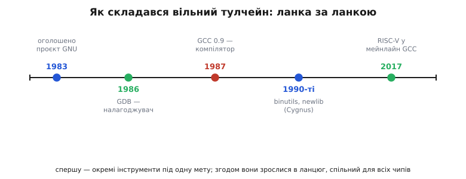
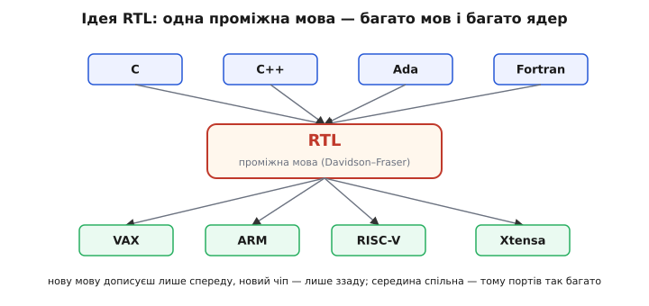

# 📜 Як народився вільний тулчейн

Сьогодні ви ставите компілятор під ARM, під RISC-V, під Xtensa — і майже не думаєте, звідки він. Команда зветься `arm-none-eabi-gcc` чи `xtensa-esp32-elf-gcc`, у ній сидить те саме ядро на літери `gcc`, і воно безкоштовне. Це здається природним, майже як повітря. А насправді за цими трьома літерами — одна вперта людина, одна морально навантажена ідея й майже сорок років роботи багатьох рук. І найдивніше: коли все починалося, ніхто не думав про мікроконтролери. Тулчейн, що став де-факто стандартом вбудованого світу, народився зовсім не для нього.

Варто розказати цю історію не заради ностальгії. Вона пояснює **чому** сучасний вбудований світ влаштований саме так: чому під будь-яке нове ядро першим зазвичай з'являється порт GCC, чому один і той самий інструмент служить і крихітному 8-бітнику, і серверному процесору, чому ви не платите за компілятор ані копійки. Усе це — не випадковість ринку, а прямий наслідок рішень, ухвалених у 1980-х. Розберімо їх по черзі.

## Людина, яка не хотіла підписувати мовчанку

Річард Столмен (*Richard Stallman*, часто просто RMS) працював у Лабораторії штучного інтелекту Массачусетського технологічного інституту. Наприкінці 1970-х і на початку 1980-х із програмами діялася тиха, але глибока зміна. Раніше код здебільшого ходив між людьми вільно: колеги правили, покращували, ділилися. А тепер його дедалі частіше замикали — продавали лише готові двійкові файли, вихідний текст ховали, а щоб отримати навіть його, треба було підписати угоду про нерозголошення (*non-disclosure agreement*, NDA) — обіцянку нікому не показувати й не передавати.

Для Столмена це була не дрібниця, а етичний глухий кут. Якщо сусід просить копію корисної програми, а ти підписав папір, що не даси, — ти мусиш або зрадити сусіда, або зрадити підпис. Столмен не хотів жити в жодному з цих світів. Але сама відмова нічого не міняла: щоб працювати з комп'ютером, усе одно потрібна операційна система, редактор, компілятор — а всі вони ставали закритими.

Звідси й народилося рішення, на позір несумірне з однією людиною: якщо вільних інструментів немає, він **напише їх сам** — стільки, щоб можна було працювати, нікого не зраджуючи. 27 вересня 1983 року Столмен розіслав у мережеві групи `net.unix-wizards` і `net.usoft` коротке повідомлення з темою «new Unix implementation». Воно починалося словами про те, що з наступного Дня подяки він почне писати повноцінну Unix-сумісну систему на ім'я **GNU** — і роздаватиме її вільно кожному, хто зможе користуватися. Назва GNU — жартівливий самопосил: *GNU's Not Unix* («GNU — не Unix»), рекурсивне скорочення, де перша літера розкривається сама через себе. Формально проєкт GNU часто датують 1984 роком — коли Столмен звільнився з MIT і взявся до роботи повний час, щоб інститут не мав прав на написане.

> 🔧 **Навіщо це.** Тут корінь того, чому ваш компілятор безкоштовний і з відкритим кодом. Це не маркетинговий хід «безплатна версія, щоб підсадити», а вихідна умова: система задумувалася вільною з першого дня — вільною не лише «даром», а в сенсі свободи читати, правити й передавати код. Саме тому ви можете взяти GCC, дописати підтримку свого чипа й нікого не питати дозволу — так робили й роблять виробники всіх нових ядер.

Статус цих фактів — **усталений**: дата 27 вересня 1983 року й текст першого оголошення збережені в архівах Фонду вільного програмного забезпечення (*Free Software Foundation*), заснованого Столменом 1985 року для підтримки проєкту.

## Компілятор — серце, з якого треба почати

Щоб зібрати вільну систему, потрібен був порядок дій. І тут — важлива логіка, яку легко проґавити. Операційну систему пишуть на мові C. Щоб перекласти той C у машинний код, потрібен компілятор. Якщо компілятор чужий і закритий — уся система стоїть на закритому фундаменті, хоч би яким вільним був код над ним. Отже, **першою** по-справжньому серйозною цеглиною мусив стати вільний компілятор C. Без нього все інше не має на чому стояти.

Столмен спершу не збирався писати компілятор із нуля — це величезна праця. Він хотів узяти готовий. У Ліверморській національній лабораторії (*Lawrence Livermore National Laboratory*) існував компілятор на ім'я **Pastel** — багатомовний, з власним діалектом Паскаля. Столмен домовився взяти його за основу, написав до нього новий фронтенд для мови C (за допомоги Леонарда Тавера, *Leonard H. Tower Jr.*, який став першим штатним працівником Фонду вільного ПЗ) — і вперся у стіну.

Стіна була суто інженерна, і вона багато чого пояснює про сам фах. Pastel влаштований так, що спершу розбирає **весь** вхідний файл у велике синтаксичне дерево, потім переганяє **все** це дерево в ланцюг проміжних інструкцій, і лише тоді породжує вихід — і при цьому жодного разу не звільняє пам'ять. Для машини з мегабайтами оперативної пам'яті це стерпно. А Столмен цілив у Unix на процесорі 68000, де під програму бувало лічені десятки кілобайтів. Компілятор, якому лише на стек потрібні мегабайти, там просто не вміщався. Стало ясно: доробити чуже не вийде — доведеться **писати свій компілятор з нуля**.

Так буває в інженерії частіше, ніж хочеться: береш готове, щоб зекономити, а обмеження чужої архітектури заганяє тебе в глухий кут глибший, ніж якби ти від початку робив сам. Столмен зберіг лише написаний ним C-фронтенд; жодного рядка самого Pastel у майбутній GCC не потрапило. Це теж **усталений** факт — Столмен сам описав його у своєму нарисі про проєкт GNU.

## 22 березня 1987 року: перший GCC

Новий компілятор Столмен писав, спираючись на одну чужу гарну ідею — і чесно її вказав. Ідея зветься **RTL** (*Register Transfer Language* — «мова передач між регістрами»): проміжна мова, у яку компілятор перекладає програму **перед** тим, як породити команди конкретного процесора. Не одразу з C у машинний код, а через прошарок посередині. Цю ідею — використати RTL як проміжну мову компілятора — запропонували Джек Девідсон (*Jack Davidson*) і Крістофер Фрейзер (*Christopher Fraser*), які розробляли її в Аризонському університеті на початку 1980-х. Столмен узяв цю ідею й побудував на ній свій компілятор.

Навіщо цей прошарок — і чому саме він зробив GCC придатним для вбудованого світу через десятиліття? Бо він **розтинає задачу навпіл**. Уся складна робота «зрозуміти мову C» тепер закінчується на RTL; уся робота «породити команди для цього чипа» починається з RTL. Дві половини стають незалежними. Хочеш підтримати нову мову — дописуєш лише передню половину до RTL. Хочеш підтримати новий процесор — дописуєш лише задню половину від RTL, а всю мовну складність не чіпаєш. Саме ця розв'язка згодом дозволить порту під нове ядро з'явитися швидко: більшість компілятора вже написана й перевірена, лишається описати, як RTL лягає на команди твого чипа.

*Тулчейн збирався не одним махом, а ланка за ланкою впродовж десятиліть. Спершу — окремі вільні інструменти під одну мету (працювати, нікого не зраджуючи); згодом вони зрослися в спільний ланцюг, який тепер обслуговує будь-який чіп.*

22 березня 1987 року Столмен випустив перший **GNU C Compiler** — версію 0.9, першу публічну бета-версію, доступну через FTP із MIT. У релізі йшли машинні описи для VAX і Sun та десятки сторінок документації про те, як писати такі описи для інших машин, — тобто вже тоді закладалася можливість націлювати компілятор на нове залізо. Автором значився Столмен, але він у тому ж оголошенні окремо подякував тим, чия праця в ньому була:

- **Леонард Тавер** — за частини парсера, генератора RTL, означень RTL і за VAX-івський машинний опис;
- **Джек Девідсон і Крістофер Фрейзер** — за саму ідею вживати RTL як проміжну мову;
- **Пол Рубін** (*Paul Rubin*) — за те, що написав більшу частину препроцесора.

Ця подяка — не формальність, а точна історична деталь, і варто її тримати в голові, коли когось називають «автором GCC». Столмен був архітектором і головним автором, але навіть перший реліз був **колективним**: ідея проміжної мови — від Девідсона й Фрейзера, шматки парсера й генератора — від Тавера, препроцесор — від Рубіна. Це типова доля великих інструментів: у них рідко буває один-єдиний творець, і чесна історія називає всіх, а не ліпить одне ім'я на спільну працю. Статус усіх цих фактів — **усталений**: і дата 22 березня 1987 року, і поіменні подяки збережені в тексті самого оголошення про реліз.

Того ж 1987 року, у грудні, GCC навчили компілювати ще й C++. З часом літери в назві переосмислили: спершу GCC означало *GNU C Compiler* (компілятор однієї мови C), а коли мов побільшало — *GNU Compiler Collection* («колекція компіляторів GNU»). Та сама абревіатура, ширший зміст — бо спрацювала та сама розв'язка через RTL: додати мову виявилося посильно.

## Компілятор сам себе не збирає: тулчейн збирається довкола GCC

Тут ховається тонкість, без якої картина неповна. Компілятор перекладає C у **асемблер** — текстові мнемоніки команд. Але чіп розуміє не текст, а числа. Хтось має обернути мнемоніки на числа (це робить асемблер, програма `as`), а потім хтось має зшити всі шматки докупи й роздати адреси (це робить лінкер, `ld`). Сам собою GCC цього не робить — він кличе сусідні інструменти. А отже, вільного компілятора **замало**: щоб із коду вийшов готовий образ, довкола нього мусив зібратися цілий ланцюг вільних програм.

Так і сталося — поступово, різними руками. Асемблер `as`, лінкер `ld` та ціла жменя дрібніших утиліт для роботи з об'єктними файлами зібралися в пакунок **binutils** (*binary utilities* — «двійкові утиліти»). Значну частину цих інструментів у тому вигляді, у якому ними користуються дотепер, довели до пуття інженери компанії **Cygnus Support** на початку 1990-х — фірми, яка першою побудувала бізнес на супроводі вільних GNU-інструментів і, зокрема, на портуванні їх під замовлення на нові процесори. Це важлива ланка: саме Cygnus перетворила «купу вільних програм» на **готові крос-тулчейни під конкретне залізо** — рівно те, що потрібно вбудованому світу.

Друга відсутня деталь — **бібліотека C**. Коли ви пишете `memcpy` чи `printf`, ви не пишете їх самі — берете з готового складу, стандартної бібліотеки C. На великих комп'ютерах це важка glibc, розрахована на операційну систему й щедру пам'ять. Для мікроконтролера, де ні операційної системи, ні пам'яті вдосталь немає, вона не годиться. Тому Cygnus зібрала ощадливий різновид — **newlib** (*new library* — «нова бібліотека»): стандартну бібліотеку C, скроєну під голе залізо, з малим слідом і легким перенесенням на новий чіп. Пізніше, коли 1999 року Cygnus придбала Red Hat, супровід newlib перейшов туди; нею й досі опікуються, зокрема, Джеф Джонстон (*Jeff Johnston*). Newlib стала стандартною бібліотекою C майже в усіх GCC-портах під невбудовані у Linux системи. Про те, як саме її крихітний `printf` уміщається в кілобайти, є [окрема стаття](topic:programming/newlib).

Третя ланка — **налагоджувач**. Ще 1986 року, щойно GNU Emacs став досить стабільним, Столмен написав **GDB** (*GNU Debugger*) — третю велику програму проєкту після Emacs і GCC. Спочатку релізи GDB вів сам Столмен (за допомоги кількох людей), потім, у 1990–1993 роках, супровід перебрав Джон Ґілмор (*John Gilmore*). GDB навчився не лише спиняти програму на вашому ПК, а й керувати виконанням на **іншому**, під'єднаному чипі — а це рівно те, чого потребує вбудована розробка, де програма біжить не там, де ви її налагоджуєте. Чому без покрокового налагоджувача у вбудованому світі важко жити — тема [окремої статті](topic:programming/why-debugger).

Отже, до середини 1990-х довкола GCC зібралося все, що складає сучасний тулчейн: сам компілятор, binutils (`as`, `ld` і супутні), newlib під голе залізо, GDB для налагодження. Кожну ланку писали різні люди й різні організації, у різні роки, під різні потреби — а зрослися вони в один ланцюг, бо всі трималися спільної вільної основи й спільних форматів. Ці факти теж **усталені**: походження binutils і newlib від Cygnus, рік GDB (1986) і роки супроводу задокументовані.

## Чому саме він став стандартом вбудованого світу

Тепер головне питання цієї історії: чому безкоштовний крос-компілятор під будь-яке ядро став **де-факто стандартом**? Адже були й дорогі комерційні компілятори, часто з добрим сервісом. Чому світ осів саме на GNU? Причини складаються одна на одну, і кожна тягне наступну.

**Перша — розв'язка через RTL.** Ми вже бачили: задня половина компілятора від RTL до команд — це порівняно окремий, добре описаний шматок. Щоб підтримати нове ядро, не треба писати компілятор — треба лише описати, як RTL лягає на команди цього ядра. Це посильна праця для невеликої команди, а не багаторічний подвиг. Тому щойно з'являється нова архітектура, найдешевший спосіб дати їй компілятор — **портувати GCC**, а не писати свій.

*Розв'язка, що зробила GCC придатним для будь-якого чипа. Уся складність мови закінчується на RTL; уся робота під конкретне ядро починається від RTL. Нову мову дописуєш лише спереду, новий процесор — лише ззаду, а велика спільна середина не змінюється — тому портів під нові ядра з'являється так багато й так швидко.*

**Друга — свобода правити.** Ліцензія GNU (*GPL* — *General Public License*, «загальна публічна ліцензія») дає кожному право взяти код, змінити його й розповсюджувати — за умови лишати похідне так само вільним. Для виробника чипа це означає: не треба вмовляти чужу компанію додати підтримку твого нового ядра й чекати на її ласку — ти береш GCC і дописуєш порт сам. Саме так і роблять: виробник нового процесора зазвичай сам готує для нього GCC, бо це найшвидший шлях дати розробникам робочий інструмент.

**Третя — ціна нуль і жодних ліцензійних застав.** Комерційний компілятор — це плата за місце, за кількість розробників, іноді за кожну зібрану прошивку. Безкоштовний і вільний тулчейн знімає весь цей тягар: постав на скільки завгодно машин, віддай студентам, вклади в дешеву плату «за десять доларів» — і нікому нічого не винен. Для навчання, для стартапів, для аматорів це вирішило все: поріг входу впав до нуля.

Ці три причини разом породили самопідсильне коло. Що більше ядер підтримує GCC — то більше під нього пишуть; що більше під нього пишуть — то вигідніше виробникові нового чипа дати саме GCC-порт, а не свій компілятор; що більше портів — то він ще стандартніший. Коло розкрутилося так, що сьогодні поява нового ядра **без** GCC-порту виглядала б дивно.

Ось як це видно на живих прикладах — і всі вони **усталені** факти:

- **ARM.** Офіційний вільний тулчейн для ARM зветься **Arm GNU Toolchain** (раніше — *GNU Arm Embedded*, а ще раніше збірки постачали CodeSourcery й Linaro). Це той самий GCC із binutils, newlib і GDB, зібраний під ціль `arm-none-eabi` — «голе ARM-залізо». Саме його ставлять, коли пишуть під STM32 та тисячі інших ARM-мікроконтролерів; сам виробник ядра, компанія Arm, випускає й підтримує ці збірки.
- **RISC-V.** Коли постала відкрита архітектура RISC-V, порт GCC і binutils під неї довели до офіційного дерева проєкту. Роботу з тестування й вивантаження в мейнлайн вели, зокрема, Кіто Ченґ (*Kito Cheng*) і Палмер Даббелт (*Palmer Dabbelt*). Binutils 2.28 стала першим релізом із підтримкою RISC-V, а GCC 7.1 (2017 рік) — першим релізом GCC із нею. Відтоді підтримка RISC-V — частина звичайного GCC, а не окрема латка.
- **Xtensa.** Ядро Xtensa (на ньому побудовано класичні ESP32) теж має GCC-порт. Espressif постачає під свої чипи тулчейн на GCC зі своїми латками для Xtensa й ESP32 — команда з паспортом `xtensa-esp32-elf-`. Той самий ланцюг — GCC, binutils, newlib, GDB, — лише націлений на інше ядро.

Зверніть увагу на спільний малюнок: у кожному разі це **не новий компілятор**, а той самий GCC із дописаною задньою половиною під нове ядро. ARM, RISC-V, Xtensa відрізняються паспортом цілі в імені команди й машинним описом усередині — а серце, уся мовна складність, спільне. Це прямий плід рішення 1987 року розтяти компілятор через RTL: одна робота, зроблена раз, служить усім ядрам одразу.

## Що з цієї історії лишається на щодня

Коли наступного разу ви поставите `arm-none-eabi-gcc` чи `xtensa-esp32-elf-gcc` й зберете прошивку, за секунду цієї команди стоятиме весь цей шлях. Одна людина, що не хотіла зраджувати сусіда й тому взялася писати вільну систему. Чужа гарна ідея — RTL, — чесно вказана й покладена в основу. Тупик із Pastel, що змусив писати з нуля. Реліз 22 березня 1987 року з поіменною подякою тим, хто доклав рук. Асемблер, лінкер, бібліотека й налагоджувач, що збиралися довкола компілятора роками, різними руками. І розв'язка через проміжну мову, завдяки якій той самий інструмент дотягнувся до ядра, якого 1987 року ще й на світі не було.

З цього випливає дуже практична річ. Коли під нове ядро першим виходить саме GCC — це не збіг, а наслідок його будови й ліцензії. Коли той самий `gdb` налагоджує і ваш ПК, і чип на столі — це та сама програма 1986 року, що навчилася керувати виконанням на іншій машині. Коли ви не платите за компілятор — це вихідна умова проєкту, а не акція. Тулчейн вбудованого світу тому й один на всіх, що його з самого початку будували вільним і розтятим на змінні частини. Знаючи це, ви краще розумієте, чого від нього чекати: під будь-яке серйозне нове ядро майже напевно буде GCC-порт, він майже напевно буде безкоштовний, і всередині це буде той самий знайомий ланцюг — просто з іншим паспортом цілі в імені.
