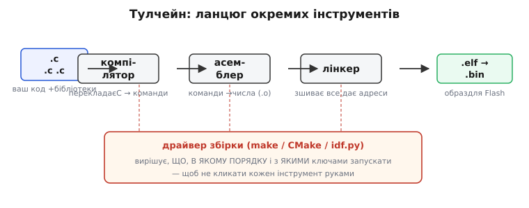
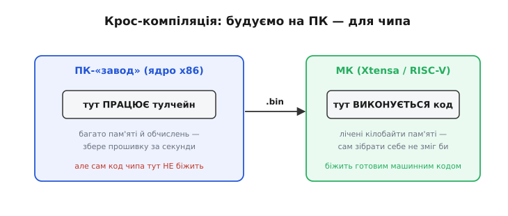
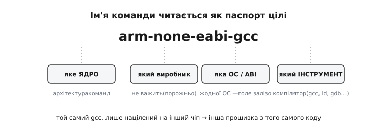

# Тулчейн

Коли ви натискаєте «Прошити» в середовищі розробки, здається, ніби одна кнопка бере ваш текст і кладе його в чіп. Насправді за тим кліком ховається не один інструмент, а **ціла зграя** маленьких програм, кожна зі своєю вузькою роботою, вишикуваних у ланцюг. Цей ланцюг і зветься **тулчейн** (*toolchain* — від англ. *tool* «інструмент» + *chain* «ланцюг»): набір інструментів, з'єднаних так, що вихід одного стає входом наступного, а разом вони проводять код увесь шлях від тексту до готового образу, який ллється у Flash.

Зрозуміти тулчейн варто саме тому, що інакше вбудована розробка лишається чорним ящиком: правиш код, тиснеш кнопку, іноді виходить прошивка, а іноді — незрозуміла помилка від невідомо кого. Щойно ви побачите ланцюг як ланцюг — окремі ланки з окремими ролями, — помилки перестануть бути таємницею: кожна скарга матиме конкретного автора, і ви знатимете, де саме шукати причину.

### Чому ланцюг, а не один інструмент

Найперше питання: навіщо взагалі дробити на ланки? Чи не простіше було б мати одну програму «текст → прошивка»?

Відповідь — та сама інженерна мудрість, що й скрізь: **поділ праці**. Шлях від вашого рядка на C до байтів у пам'яті чипа складається з дуже різних за природою робіт. Спершу треба **перекласти** людський текст у команди процесора — це аналіз мови, тонка й складна справа. Потім ці команди-мнемоніки треба **обернути на числа** — робота механічна, майже словникова. Далі всі шматки з різних файлів і бібліотек треба **зшити докупи** й розкласти по адресах пам'яті — суто бухгалтерська задача про те, хто де лежить. Це три настільки несхожі задачі, що зручно доручити кожну **окремій** програмі, яка робить лише її й робить добре.

З поділу випливає головна користь: кожну ланку можна написати, перевірити й **замінити** незалежно. Захотіли інший компілятор — підставили його, не чіпаючи решти. Той самий лінкер служить і C, і C++, і асемблеру. А коли щось ламається, скарга приходить від **конкретної** ланки — і ви одразу знаєте, у якому з трьох світів шукати біду.


*Тулчейн — не одна програма, а ланцюг окремих інструментів. Компілятор перекладає C у команди, асемблер обертає їх на числа, лінкер зшиває все й роздає адреси; на виході — образ для Flash. А зверху всім диригує драйвер збірки, що вирішує, кого, коли й з якими ключами запустити.*

### Ланки ланцюга: хто що робить

Розберімо ланцюг по ланках. У класичному вбудованому тулчейні (сімейство **GNU**, найпоширеніше) головних дійових осіб небагато, і кожен носить власне ім'я, яке ви бачитимете в логах збірки.

**Препроцесор** — найперший, готує текст іще до перекладу. Він розгортає директиви `#include` (вклеює вміст заголовкових файлів) і `#define` (підставляє макроси), викидає коментарі. На вхід — ваш `.c` із директивами, на вихід — чистий C без жодної `#`. Це радше підготовка тексту, ніж переклад.

**Компілятор** — серце ланцюга. Він бере підготовлений текст і **перекладає** його в асемблер — текстові мнемоніки команд конкретного ядра (`load`, `add`, `store`…). Саме тут людська думка спускається на рівень заліза. У GNU це `gcc` (для C) чи `g++` (для C++). Як саме [компіляція](topic:programming/compilation) розкладає ваш код на машинні кроки — окрема велика тема; тут важлива роль ланки: текст → команди.

**Асемблер** — обертає текстові мнемоніки на **числа**. `add r1, r2` перетворюється на конкретний двійковий код цієї команди. Результат — **об'єктний файл** (`.o`): справжній машинний код одного вихідного файлу плюс таблиця імен, які в ньому є й яких він потребує ззовні. У GNU це `as`. Робота майже словникова: кожній мнемоніці відповідає свій числовий код.

**Лінкер** — остання й найзагадковіша на вигляд ланка. Ваша програма — це не один файл: є ваш код, є код бібліотек, і всі вони скомпільовані **окремо**, кожен «з дірками» — з посиланнями на чужі функції без адрес. [Лінкер](topic:programming/linking) зшиває всі ці `.o` та потрібні шматки бібліотек в одне ціле: з'єднує кожне «кличу функцію X» з тим файлом, де X насправді написана, і роздає кожному шматку остаточну адресу в пам'яті чипа. У GNU це `ld`. Саме звідси славнозвісне `undefined reference` — коли лінкер не знайшов, куди веде виклик.

> 🔧 **Навіщо це.** Це розрізнення ланок — не теорія, а щоденний навик читати помилки. «Не компілюється» і «не лінкується» — **дві різні біди** з різними причинами. Синтаксична помилка (`expected ';'`) приходить від **компілятора**: проблема в тексті одного файлу. А `undefined reference to foo` приходить від **лінкера**: файл скомпілювався добре, але лінкер не знайшов, де живе `foo`, — тобто ви забули під'єднати бібліотеку чи файл із її кодом. Знаючи автора скарги, ви шукаєте причину в правильному місці: у першому разі — у рядку коду, у другому — у **складі** проєкту.

### Не лише компілятор: бібліотеки й рантайм

Ланцюг перекладу — ще не весь тулчейн. Разом з інструментами йде **готовий чужий код**, без якого ваша прошивка не запуститься, і про нього варто знати окремо.

По-перше, **стандартна бібліотека C** (libc) — той склад функцій, звідки беруться `memcpy`, `printf`, `strlen` і сотні інших, яких ви не писали, але кличете. На великих комп'ютерах це важка glibc; для мікроконтролерів беруть її ощадливий різновид — [newlib](topic:programming/newlib), скроєний під скромні ресурси й відсутність операційної системи. Лінкер витягує з неї лише ті функції, що ви справді викликаєте.

По-друге, **стартовий код** — крихітний шматок, що виконується **до** вашого `main`. Процесор після скидання не вміє одразу бігти вашим кодом на C: спершу хтось має налаштувати стек, скопіювати початкові значення змінних із Flash у RAM, обнулити ділянку неініціалізованих даних. Цю чорну роботу робить [стартовий код](topic:programming/c-runtime) (часто зветься `crt0` — *C runtime, zero*), і тулчейн підкладає його автоматично, бо без нього C-програма просто не має де початися. Ширше про те, що робиться на межі між залізом і першим рядком C, — у [C-рантаймі](topic:programming/c-runtime).

По-третє, **лінкер-скрипт** — не код, а карта. Лінкер сам по собі не знає, скільки у вашого чипа Flash і RAM і за якими адресами вони лежать. Це йому підказує [лінкер-скрипт](topic:programming/linker-script) — файл, що описує карту пам'яті **конкретного** чипа: сюди код, сюди дані, отут вершина стека. Тому той самий код, зібраний під різні чипи, лінкер розкладе по різних адресах — карта в кожного своя.

Отже, тулчейн — це не лише перекладачі, а й **комплект супроводу**: бібліотека готового коду, стартовий шматок і карта пам'яті. Усе це має зійтися разом, щоб із вашого тексту вийшла прошивка, яка справді оживе на конкретному чипі.

### Крос-компіляція: будуємо тут, виконуємо там

Тепер тонкість, без якої вбудованого світу не зрозуміти. Запускаєте ви тулчейн **не** на мікроконтролері, а на своєму **ПК**. А машинний код він готує **не** для ПК, а **для чипа**. Тобто збирання йде на одній машині, а результат призначений зовсім іншій. Таке збирання «тут, а для туди» зветься **крос-компіляцією** (*cross-compilation*; *cross* — «навхрест», бо машина-будівельник і машина-ціль різні).

Чому не зібрати програму **на самому** МК? Бо компіляція — важка робота: їй потрібні багато пам'яті й обчислень, яких у скромного [мікроконтролера](topic:programming/microcontroller) з його лічені кілобайти просто нема. Ваш ПК — потужний завод, що залюбки збере прошивку за секунди, а тоді передасть її крихітному виконавцеві. Тому крос-компіляція для вбудованого світу — не дивина, а **норма**: будуємо на великому, виконуємо на малому.


*Крос-компіляція одним поглядом: тулчейн працює на потужному ПК, але готує машинний код для мікроконтролера. Результат на самому ПК не запуститься — це «чужі» для нього числа; зате чіп біжить ним чудово. Машина-будівельник і машина-ціль — різні, тому й «крос».*

> 🔧 **Навіщо це.** Звідси дві щоденні речі. Готова прошивка **не запуститься** на вашому ПК подвійним кліком — це код для іншого ядра, ПК його не розуміє. І для кожного типу чипа потрібен **свій** тулчейн — точніше, своя «ціль» у ньому: зібрати під ESP32 і під STM32 — це два різні тулчейни під два різні ядра. На щастя, середовища на кшталт Arduino чи ESP-IDF ховають це від вас: ви обираєте плату зі списку, а вони підставляють потрібний тулчейн самі.

### Ім'я команди — це паспорт цілі

Крос-компіляція лишає слід у самому **імені** інструментів, і навчитися його читати дуже корисно. Компілятор для ARM-мікроконтролерів зветься не просто `gcc`, а `arm-none-eabi-gcc`. Цей довгий префікс — не примха, а **паспорт цілі**: він каже, під що саме націлено інструмент.

Читається паспорт за усталеною схемою `архітектура-виробник-ОС-abi` (*target triplet* — «трійка цілі»; історично полів було три, звідси й назва, хоча тепер їх зазвичай чотири):

- **`arm`** — яке **ядро**: архітектура набору команд. Числа, зрозумілі ARM, — не ті, що зрозумілі Xtensa чи RISC-V.
- **`none`** — який **виробник**: тут не важить, тому «порожньо». Поле лишилося з історичних часів і для голого заліза здебільшого `none`.
- **`eabi`** — під яку **ОС і угоду**: `eabi` (*Embedded Application Binary Interface*) означає, що операційної системи **нема** — код біжить на голому залізі, за вбудованою угодою про виклики. Якщо ядро має апаратний блок дробових чисел, буває варіант `eabihf` (*hard float*) — з апаратними обчисленнями з комою.


*Довге ім'я команди читається як паспорт: `arm` — під яке ядро, `none` — виробник не важить, `eabi` — жодної ОС, голе залізо, а `gcc` — який саме інструмент ланцюга. Той самий `gcc`, лише націлений на інший чіп, дасть іншу прошивку з того самого коду.*

Останнє слово — вже сам **інструмент**: `arm-none-eabi-gcc` — компілятор, `arm-none-eabi-ld` — лінкер, `arm-none-eabi-objdump` — переглядач машинного коду, `arm-none-eabi-gdb` — [налагоджувач](topic:programming/why-debugger). Усі вони з тим самим паспортом-префіксом, бо всі націлені на ту саму родину чипів. Побачивши `xtensa-esp32-elf-gcc`, ви так само прочитаєте: ядро Xtensa, чіп ESP32.

> 🔧 **Навіщо це.** Цей навик рятує від справжньої пастки початківців: зібрати код «звичайним» `gcc` (тим, що стоїть у системі для програм ПК) — і не зрозуміти, чому прошивка не працює на чипі. `gcc` без префікса націлений на **ваш ПК** (x86), а не на МК; його числа чіп не виконає. Правильний інструмент завжди має паспорт цілі в імені. Побачили в інструкції `arm-none-eabi-…` — знайте: це збірка **під голе ARM-залізо**, і саме такий тулчейн вам треба поставити.

### Драйвер збірки: хто диригує ланцюгом

Лишається питання: якщо інструментів кілька, хто вирішує, **кого і в якому порядку** запускати? Кликати препроцесор, компілятор, асемблер, лінкер руками для кожного з десятків файлів проєкту — пекло. Тому над ланцюгом стоїть **драйвер збірки** — програма, що диригує всім оркестром.

Зверніть увагу на приємну тонкість: сам `gcc` — уже маленький диригент. Коли ви пишете `arm-none-eabi-gcc main.c -o main.elf`, `gcc` **сам** послідовно кличе препроцесор, компілятор, асемблер і лінкер за вас — вам не треба запускати кожну ланку окремо. Але це працює для одного-двох файлів; для справжнього проєкту потрібен диригент рівнем вище.

Цей вищий диригент — **система збірки**. Найстаріша й найпростіша — `make`: ви описуєте в правилах, який файл із якого робиться і якою командою, а `make` сам вираховує, що́ саме треба перезібрати після правки (перезбирає лише змінене, а не весь проєкт — це заощаджує багато часу). Сучасніший підхід — **CMake**: ви описуєте проєкт мовою вищого рівня, а CMake сам породжує потрібні правила збірки під вашу систему. А у світі ESP32 усе це загорнуто ще на рівень вище — в утиліту `idf.py`, що ховає й CMake, і тулчейн за простими командами `idf.py build`, `idf.py flash`.

Так вибудовується **драбина зручності**: голі інструменти внизу, над ними `gcc`-диригент, над ним система збірки, а на самому верху — одна кнопка «Прошити» у середовищі розробки. Кожен шар ховає складність нижчого, тому ви й можете тиснути одну кнопку, не думаючи про ланцюг. Але коли щось ламається — ланцюг проступає крізь усі шари, і саме тоді знання, з чого він складається, стає безцінним.

Про те, як тулчейн вплетено у ширшу [екосистему конкретного МК](topic:programming/mcu-ecosystem) — SDK, драйвери, готові приклади, — варто знати окремо: тулчейн там лише одна (хоч і центральна) частина.

### Простежмо весь ланцюг на одному файлі

Щоб картина стала відчутною, проженімо крихітну програму крізь увесь тулчейн для ARM-мікроконтролера й подивімося, **що** народжується на кожній ланці. Кожна стадія лишає по собі окремий файл зі своїм розширенням — ці розширення ви бачитимете в реальних збірках.

**Приклад (один файл `blink.c` крізь усі ланки, збірка під ARM Cortex-M):**

```
вхід:   blink.c        ваш текст на C (з #include, #define)
   │
   ▼  препроцесор:  розгортає #include і #define, прибирає коментарі
blink.i        чистий C без директив — самий код
   │
   ▼  компілятор:   arm-none-eabi-gcc -S  → переклад C у команди ARM
blink.s        текстові мнемоніки: ldr, orr, str…
   │
   ▼  асемблер:     arm-none-eabi-as      → мнемоніки стають числами
blink.o        машинний код файлу + таблиця символів
   │           (виклики memcpy, HAL_GPIO… поки «висять» без адрес)
   ▼  лінкер:       arm-none-eabi-ld      → зшиває .o + newlib + startup,
   │                за лінкер-скриптом розкладає все по адресах
firmware.elf   повна програма: код + дані + карта адрес
```

Тепер найважливіше: усі ці кроки `gcc` зробить **одним викликом**. Команда

```
arm-none-eabi-gcc blink.c startup.s -T stm32.ld -o firmware.elf
```

сама прожене препроцесор, компілятор, асемблер і лінкер, підкладе стартовий код (`startup.s`), візьме карту пам'яті з лінкер-скрипта (`-T stm32.ld`) і витягне потрібне з newlib. Ви бачите лише вхід (`blink.c`) і вихід (`firmware.elf`) — проміжні `.i`, `.s`, `.o` `gcc` створює й прибирає непомітно. Саме тому здається, ніби «компіляція» — один крок; насправді це весь ланцюг, згорнутий в одну команду.

Але й `firmware.elf` — ще не те, що ллється у Flash. [ELF](topic:programming/elf-image) несе багато службового: карту адрес, налагоджувальні дані, імена символів. Голому завантажувачу чипа потрібні самі **байти образу**, тому останній штрих робить окремий інструмент — у ARM це `arm-none-eabi-objcopy`, у ESP32 — `esptool`:

```
firmware.elf  ──objcopy -O binary──▶  firmware.bin   (готовий образ для Flash)
```

І аж цей `.bin` [прошивальник заливає у Flash](topic:programming/flashing). Ось повний шлях: ваш текст → ланцюг інструментів тулчейну → `firmware.elf` → чисті байти `firmware.bin` → пам'ять чипа. Кожну ланку можна назвати, простежити й — коли треба — розібрати окремо.

> 🔧 **Навіщо це.** Ця картина знімає щоденну плутанину з розширеннями. `.o` — машинний код **одного** файлу, ще з дірками. `.elf` — **уся** зшита програма з картою адрес, нею годують налагоджувач. `.bin` — голі байти, що фізично лягають у Flash. Помилка на кожному рівні своя: `.o` не вийшов — винен компілятор чи асемблер (біда в тексті); `.elf` не зшився — винен лінкер (біда в складі проєкту чи лінкер-скрипті); `.bin` не заливається — винен уже прошивальник чи залізо. Знаючи, який файл на якій ланці народжується, ви читаєте будь-яку скаргу збірки правильно.

### Історія: звідки взявся GNU-тулчейн

Те, що вбудований світ майже суцільно збирають одним сімейством вільних інструментів (`gcc`, `as`, `ld`, `gdb`, newlib), — не випадковість, а наслідок однієї впертої ідеї 1980-х. Коротко про те, [як народився GNU-тулчейн](topic:programming/toolchain/hist-gnu-toolchain.md) і чому вільний компілятор став спільним фундаментом майже для всіх мікроконтролерів, — в окремій історії; тут досить сказати, що можливість безкоштовно зібрати код під будь-який чіп ми маємо саме завдяки цьому рухові.

Отже, тулчейн — це ланцюг окремих інструментів, що разом ведуть код від тексту до образу для Flash: препроцесор готує текст, компілятор перекладає його в команди, асемблер обертає їх на числа, лінкер зшиває все й роздає адреси, а поряд ідуть бібліотека, стартовий код і карта пам'яті. Усе це працює на вашому ПК, але націлене на чіп — крос-компіляція, чий слід видно навіть в іменах команд. Магії нема: є зрозумілий механічний конвеєр, кожну ланку якого можна назвати, простежити й полагодити окремо.
