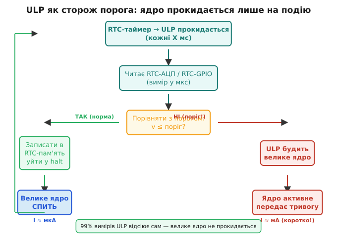

# ULP-співпроцесор: міряти, поки ядра сплять

Будити велике ядро на кожну подію — дорого: [сам boot плюс реініціалізація](book:programming/wakeup-sources) коштують заряду. Ідея ULP (Ultra-Low-Power coprocessor) радикально проста: нехай у deep-sleep залишається живим **крихітний** процесор у RTC-домені, що сам прокидається за таймером, читає давач, порівнює з порогом — і будить «велике» ядро ЛИШЕ тоді, коли є що повідомити. Дев'яносто дев'ять відсотків вимірів він відсіює за наноджоулі.

ESP32 має два варіанти ULP-ядра. Класичний ESP32 містить ULP-FSM — примітивний автомат на мінімальному наборі інструкцій асемблера, достатньому для читання АЦП і GPIO та прийняття простих рішень. Новіші ESP32-S2/S3 отримали ULP-RISC-V — справжнє RISC-V ядро, яке програмують на підмножині C через ESP-IDF. Деталі конкретних програм — у вставці [⚙️ r13-s5-a-ulp-program.md](proj-ulp-program.md); тут розберімо принцип і економіку.

Що ULP вміє і чого ні — межа важлива. Вміє: читати RTC-АЦП і RTC-GPIO, рахувати, порівнювати, записувати в RTC-пам'ять, будити велике ядро. **Не вміє**: Wi-Fi, складних обчислень, доступу до основної SRAM або Flash. Його сила — не потужність, а те, що він **не вимагає будити дорогі домени** для виконання частих простих перевірок.



*Рис. Потокова діаграма: ULP за таймером прокидається → читає RTC-АЦП → у нормі? пише в RTC-пам'ять, засинає (велике ядро спить!); поріг перевищено? → будить ядро, що передає тривогу. Велике ядро активується лише на «так».*

Патерн «сторож порога» — найпоширеніший сценарій ULP. Уявіть термостат у глибокому сні: раз на секунду ULP зчитує [термістор](book:electronics/ntc-thermistor) через RTC-АЦП, обчислює температуру, порівнює з межами [-10°C, +40°C]. Якщо в нормі — записує в RTC-пам'ять і йде назад у halt. Якщо поза межами — будить ядро, яке підключається до Wi-Fi і надсилає тривогу. Ядро прокидається раз на кілька годин, хоч вимірювань відбулося тисячі.

Економіка ULP переконлива числами:


*Рис. Два профілі заряду в часі. (а) Ядро будиться щосекунди — рівномірні дорогі сплески. (б) ULP міряє щосекунди, ядро будиться раз на годину — плаский мікроамперний фон із рідкісним сплеском. Площі під кривими — заряд — відрізняються на порядки.*

```
Порівняння стратегій для «частий вимір, рідка реакція»:

Стратегія А: будити ядро щосекунди на 50 мс при 30 мА
  заряд за прокидання: 30 мА × 50 мс = 1.5 мА·с
  за годину (3600 прокидань): 3600 × 1.5 = 5400 мА·с = 1.5 мА·год
  I_сер ≈ 1.5 мА

Стратегія Б: ULP міряє щосекунди (~10 мкА × 5 мс + halt),
  ядро будиться раз на годину на 2 с при 120 мА:
  ULP за годину: 3600 × (0.01 мА × 5 мс) = 0.18 мА·с = 0.00005 мА·год
  Ядро 1 раз: 120 мА × 2 с = 240 мА·с = 0.067 мА·год
  I_сер ≈ 0.067 мА·год / 1 год ≈ 0.067 мА = 67 мкА

Виграш: 1.5 мА / 0.067 мА ≈ 22 рази!
```

> 🔧 **Навіщо це.** ULP вартий заходу, коли треба **часто дивитися** на повільний сигнал (температура, рівень, рух), але **рідко реагувати**. Якщо реагувати треба на кожен вимір — ULP не дасть виграшу, простіше будити ядро таймером.

[RTC-пам'ять](book:programming/rtc-memory), в яку ULP пише проміжні результати, переживає deep-sleep і доступна ядру після пробудження. Це «склад» між снами: ULP лишає там останній вимір чи лічильник тривог, а велике ядро, прокинувшись, забирає накопичене.

**Worked-приклад. Сторож температури на ULP-RISC-V.**

```c
// Це код, що виконується на ULP-RISC-V ядрі (ESP-IDF)
// Компілюється окремо і завантажується в RTC-пам'ять до запуску deep-sleep

#include "ulp_riscv.h"
#include "driver/rtc_io.h"

// Змінні в RTC-пам'яті — доступні і ULP, і великому ядру
uint32_t ulp_last_adc_value;
uint32_t ulp_alarm_count;

#define THRESHOLD_LOW  400   // ~15°C на 12-бітному АЦП при 3.3 В
#define THRESHOLD_HIGH 700   // ~35°C

void ulp_main(void) {
    while (1) {
        // Читаємо RTC-АЦП (канал термістора)
        uint32_t adc_val = adc1_get_raw(ADC1_CHANNEL_6);
        ulp_last_adc_value = adc_val;

        if (adc_val < THRESHOLD_LOW || adc_val > THRESHOLD_HIGH) {
            // Поріг перевищено — будимо велике ядро
            ulp_alarm_count++;
            ulp_riscv_wakeup_main_processor();
        }
        // У нормі — засинаємо знову; RTC-таймер розбудить через X мс
        ulp_riscv_halt();
    }
}
```

Велике ядро прокидається лише на тривогу. Двадцять три години п'ятдесят дев'ять хвилин з двадцяти чотирьох ULP веде спостереження самотужки, тримаючи середній струм у мкА — і реагує на аномалію за секунди.

---
