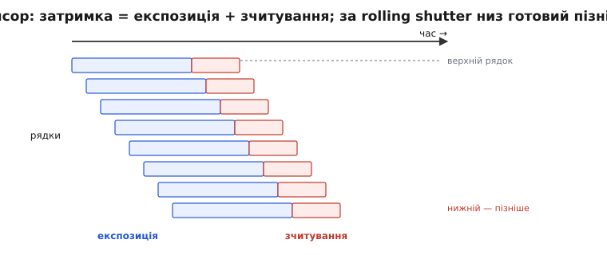
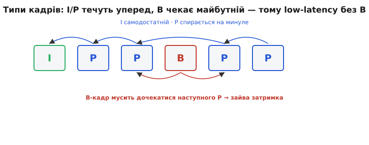
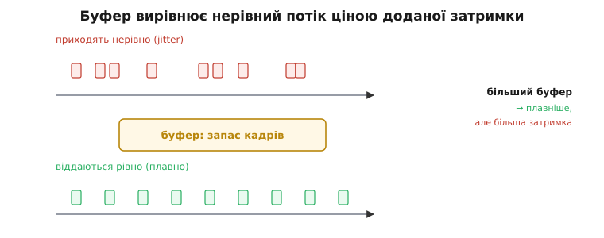

# Затримка відео: розклад по всьому тракту

Затримка відео — це один-єдиний відрізок часу: від миті, коли світло впало на сенсор, до миті, коли картинку видно на екрані. Англійською його звуть **glass-to-glass** (від скла об'єктива до скла дисплея), а саме слово «затримка» походить від латинського *latens* — «прихований»: вона й справді прихована, бо на кадрі її не видно, поки апарат не почне через неї втрачати керованість.

Базова розповідь про затримку показує головне: це сума ланок, вона робить картинку застарілою, і вона сидить у [петлі керування](root:embedded/loop-stability), де є головним ворогом стійкості. Тут ми розкладемо кожну ланку окремо — з реальними числами, з механізмом, чому саме стільки, і з тим, як це поміряти й куди тиснути, щоб скоротити. Бо «зробити менше затримки» — це завжди конкретне рішення на конкретній ланці, а не загальне побажання.

## Карта тракту: шість ланок, що додаються

Перш ніж рахувати, домовмося про межі ланок. Світло пройшло лінзу, впало на [сенсор](topic:electronics/cmos-matrix) — звідси починається відлік. Далі шлях один і той самий для будь-якої системи, тільки деякі ланки в аналозі вироджені майже в нуль:

```
сенсор → кодек → канал → буфер → декодер → екран
 (експо-   (стис-  (радіо/  (запас   (роз-     (онов-
  зиція+    нення)  кабель)  кадрів)  стиснен.) лення+
  зчиту-                                        піксель)
  вання)
```

Ключове слово — **додаються**. Затримка не «середня» й не «найбільша з ланок», а проста сума: кадр мусить послідовно пройти кожну стадію, і час кожної накопичується. Петля керування бачить лише підсумок — їй байдуже, де саме він набіг.

Аналоговий тракт (composite-відео по радіо) має ту саму карту, але **без кодека, буфера й декодера**: сигнал із сенсора майже відразу модулюється в радіо й майже відразу малюється на екрані. Тому аналог тримається в межах 8–40 мс, тоді як цифрове HD легко набирає 70–130 мс — різниця майже цілком у трьох викинутих ланках. Це не «цифра гірша», а пряма ціна стиснення: щоб втиснути HD у вузький радіоканал, кадр треба закодувати, а закодований потік треба буферизувати й декодувати.

> 🔧 **Навіщо це.** Коли в тебе «лагає відео», перша спокуса — звинуватити радіо й крутити антени. Карта ланок одразу каже, що канал — зазвичай найменший доданок, а час крадуть кодек і буфер. Правильний перший крок — не міняти антену, а подивитися налаштування кодувальника й глибину буфера приймача.

## Ланка 1: сенсор — експозиція плюс зчитування

Затримка сенсора складається з двох різних часів, які легко сплутати: **час експозиції** (скільки піксель збирав світло) і **час зчитування** (скільки електроніка виносила заряд з матриці). Вони підсумовуються, але поводяться по-різному.

**Експозиція** — це твоя витримка. На яскравому сонці вона коротка (1–2 мс), у сутінках довга (10–20 мс і більше). Кожна мілісекунда витримки — це мілісекунда, протягом якої кадр «розмазаний» по часу: піксель віддає середнє за весь інтервал, тож його ефективний «вік» дорівнює приблизно половині витримки. Для швидкого польоту довга витримка погана подвійно: і змазує рух, і додає затримки. Тому FPV любить яскраве світло й короткі витримки — це найдешевший спосіб зрізати першу ланку.

**Зчитування** залежить від того, як сенсор виносить кадр. У переважній більшості камер стоїть [CMOS-матриця](topic:electronics/cmos-matrix) з **рядковим зчитуванням** (rolling shutter, «біжуча заслінка»): рядки експонуються й зчитуються не одночасно, а по черзі згори донизу. Один рядок виноситься за мікросекунди, але весь кадр — за мілісекунди: у звичайного CMOS повне зчитування 15–25 мс, у стекового (stacked) сенсора — менше 10 мс.


*Сенсор за rolling shutter. Кожен рядок спершу експонується (синє), тоді зчитується (червоне), і старт кожного наступного рядка зсунутий униз у часі. Тому нижній рядок кадру готовий помітно пізніше за верхній: «вік» картинки залежить ще й від того, де на ній дивитися. Глобальна заслінка (global shutter) виносить усі рядки одночасно — затримка рівна по кадру, але сенсор дорожчий.*

Звідси два наслідки. По-перше, нижня частина кадру завжди «старша» за верхню — за швидкого руху це дає косі стовпи й желейне коливання (jello). По-друге, для затримки важливий не лише середній час, а й те, що низ кадру готовий на повний час зчитування пізніше за верх. Глобальна заслінка (global shutter) виносить усю матрицю миттєво й цього зсуву не має, але такий сенсор дорожчий і шумніший, тож у дешевих камерах майже не стоїть.

:::tabs
```cpp
// внесок сенсора в затримку (мс): половина витримки + повне зчитування
float t_sensor(float exposure_ms, float readout_ms) {
    // піксель віддає середнє за витримку → ефективний вік ≈ половина
    return exposure_ms * 0.5f + readout_ms;
}
// яскраве сонце, звичайний CMOS:  t_sensor(2, 20)  = 21 мс
// сутінки, той самий сенсор:      t_sensor(15, 20) = 27.5 мс
// сонце, стековий сенсор:         t_sensor(2, 8)   = 9 мс
```
```python
# внесок сенсора в затримку (мс): половина витримки + повне зчитування
def t_sensor(exposure_ms, readout_ms):
    # піксель віддає середнє за витримку → ефективний вік ≈ половина
    return exposure_ms * 0.5 + readout_ms

# яскраве сонце, звичайний CMOS:  t_sensor(2, 20)  = 21 мс
# сутінки, той самий сенсор:      t_sensor(15, 20) = 27.5 мс
# сонце, стековий сенсор:         t_sensor(2, 8)   = 9 мс
```
:::

## Ланка 2: кодек — стиснення, що коштує найдорожче

Кадр зчитано — у цифровому тракті його треба **стиснути**, бо сирий HD-потік (наприклад, 1080p60 — це понад гігабіт за секунду сирих даних) у радіоканал не влізе. [Навіщо й як стискають відео](topic:algorithms/why-compress) — окрема велика тема; тут нас цікавить лише одне: **скільки часу це додає в петлю**.

Затримка кодека керується насамперед **типами кадрів** і їхніми залежностями. Стиснене відео — це не послідовність незалежних картинок, а три роди кадрів:

- **I-кадр** (intra, «всередині себе») — самодостатній, стиснений як окреме зображення, ні на що не спирається.
- **P-кадр** (predicted, «передбачений») — кодує лише різницю від **попереднього** кадру. Спирається назад, у минуле, яке вже є.
- **B-кадр** (bidirectional, «двобічний») — спирається і назад, і **вперед**, на ще не показаний кадр.


*Типи кадрів і їхні залежності. I-кадр самодостатній; P спирається на минулий кадр (стрілки назад). А B-кадр посилається ще й на майбутній кадр — тому декодер мусить дочекатися наступного P, перш ніж видати B. Ця обов'язкова пауза «на майбутнє» і є зайвою затримкою, тож системи реального часу B-кадри просто викидають.*

Звідси головне правило затримки: **B-кадри отруйні для реального часу**. Щоб видати B-кадр, декодер мусить дочекатися кадру, що йде **після** нього в часі, — а це означає тримати в руках щонайменше один зайвий кадр, тобто додати цілий інтервал кадру до затримки. Тому всі low-latency-кодери (FPV, відеодзвінки, хмарний гейминг) працюють у baseline-профілі **без B-кадрів**: тільки I та P. Тестування показує, що сам лише викид B-кадрів збиває затримку кодування під 20 мс.

Другий важіль — **частота I-кадрів** (структура GOP, group of pictures). I-кадр важкий і дає сплеск бітрейта; якщо ставити його часто, канал захлинається, якщо рідко — довге відновлення після втрати пакета. Але великий GOP сам собою латентності не додає, якщо немає B-кадрів: P-кадри течуть уперед без пауз. Класична помилка — наладнати кодек «під запис у файл» (з великим GOP і B-кадрами) і дивуватися, чому в каналі пів секунди лагу.

:::tabs
```cpp
// налаштування кодека під мінімальну затримку (псевдо-API, але реальна логіка)
enc.profile     = PROFILE_BASELINE; // ← НЕМАЄ B-кадрів: не чекаємо майбутнє
enc.gop_size    = 30;               // I раз на ~0.5 с при 60 fps — компроміс
enc.tune        = TUNE_ZEROLATENCY; // не накопичувати кадри перед видачею
enc.lookahead   = 0;                // 0 кадрів наперед = 0 кадрів затримки
// з B-кадрами та lookahead той самий кодер легко дає +50…100 мс
```
```python
# налаштування кодека під мінімальну затримку (PyAV / libx264)
enc = av.CodecContext.create("libx264", "w")
enc.profile      = "baseline"       # ← НЕМАЄ B-кадрів: не чекаємо майбутнє
enc.gop_size     = 30               # I раз на ~0.5 с при 60 fps — компроміс
enc.options      = {
    "tune":         "zerolatency",  # не накопичувати кадри перед видачею
    "rc-lookahead": "0",            # 0 кадрів наперед = 0 кадрів затримки
}
# з B-кадрами та lookahead той самий кодер легко дає +50…100 мс
```
:::

> 🔧 **Навіщо це.** Один прапорець `tune=zerolatency` (або його еквівалент) у бібліотеці кодування часто рятує більше мілісекунд, ніж будь-який апгрейд заліза. Він забороняє кодеру притримувати кадри «для кращого стиснення» — а саме це притримування і є левова частка затримки кодека. Якщо в проєкті відео «чомусь лагає», перше, що варто перевірити, — чи не ввімкнені B-кадри й lookahead.

## Ланка 3: канал — найменший доданок

Передача стисненого потоку по радіо чи кабелю — ланка, яку інтуїція переоцінює найдужче. Насправді сам **час польоту біт** малий: на типовому FPV-каналі це одиниці мілісекунд. Радіохвиля долає кілометр за ~3 мікросекунди; навіть пакетування й черга в передавачі рідко дають більше 5–10 мс.

Канал стає винним лише тоді, коли його **не вистачає**: якщо бітрейт кодека більший за ємність каналу, пакети стають у чергу, черга росте, і затримка вибухає (це зветься буфербло́т — bufferbloat, «розпухання буфера»). Але це вже не «повільне радіо», а **невідповідність бітрейта каналу** — лікується зниженням бітрейта чи роздільності, не антеною.

Окрема історія — **втрата пакетів**. Радіоканал губить біти, і тут між аналогом і цифрою прірва. Аналог деградує **плавно**: слабне сигнал — росте шум, картинка «сніжить», але летіти ще можна. Цифра деградує **обвалом**: поки сигналу вистачає — ідеальна картинка, а за порогом декодер не може зібрати кадр і дає заморозку чи кашу з квадратів. Тому FPV-радіо часто свідомо не перезапитує втрачені пакети (це додало б затримки), а малює що є, — краще зіпсований свіжий кадр, ніж бездоганний застарілий.

## Ланка 4: буфер — плата за плавність

Ось друга велика пожирачка часу. Пакети з радіо приходять **нерівномірно**: один швидко, наступний із запізненням, потім два разом. Ця нерівність зветься **джитер** (jitter, «тремтіння»). Якщо віддавати кадри на екран рівно так, як вони прийшли, картинка смикатиметься. Щоб згладити, приймач тримає **буфер** — невеликий запас уже отриманих кадрів — і видає їх рівним темпом.


*Буфер проти джитера. Пакети приходять нерівно (червоне зверху); буфер тримає запас і віддає кадри рівним темпом (зелене знизу). Платня пряма: кожен кадр, що чекає в буфері, — це додана затримка. Більший буфер краще ховає ривки й випадання, але робить картинку «старшою»; менший дає менший лаг ціною ризику смикань.*

Компроміс тут жорсткий і неуникний: **глибина буфера = плавність проти затримки**. Кожен кадр, що чекає в буфері, додає цілий свій інтервал до загального часу. Буфер на три кадри при 30 fps — це вже +100 мс, майже весь бюджет летабельності. Системи запису й перегляду (де затримка байдужа) ставлять буфери щедро; системи керування мусять різати їх до кісток — часто до одного кадру або й до часткового кадру, миряючись із випадковими смиканнями.

:::tabs
```cpp
// внесок буфера: глибина в кадрах × тривалість кадру
float t_buffer(int frames, float fps) {
    return frames * (1000.0f / fps); // мс
}
// 3 кадри @ 30 fps:  t_buffer(3, 30) = 100 мс  ← цілий бюджет з'їдено
// 1 кадр  @ 60 fps:  t_buffer(1, 60) = 16.7 мс ← терпимо для керування
```
```python
# внесок буфера: глибина в кадрах × тривалість кадру
def t_buffer(frames, fps):
    return frames * (1000.0 / fps)  # мс

# 3 кадри @ 30 fps:  t_buffer(3, 30) = 100 мс  ← цілий бюджет з'їдено
# 1 кадр  @ 60 fps:  t_buffer(1, 60) = 16.7 мс ← терпимо для керування
```
:::

> 🔧 **Навіщо це.** Якщо стрім «гладкий, але керувати неможливо» — винен майже завжди буфер, а не кодек і не радіо. Гладкість і є симптомом: її купили затримкою. Для апарата, яким керують, треба свідомо вибрати найменший буфер, який ще не дає нестерпних ривків, і прийняти, що картинка інколи смикнеться. Це той випадок, коли «гірше виглядає» означає «краще летить».

## Ланка 5: декодер — дзеркало кодека

На приймачі стиснений потік треба **розтиснути**. Власне арифметика декодування швидка, але декодер успадковує всі затримки, закладені структурою потоку. Якщо в потоці є B-кадри, декодер **мусить** тримати кадри й переставляти їх у правильний порядок показу — звідси відома «затримка у два кадри» багатьох апаратних декодерів. Прибери B-кадри на боці кодера — і ця затримка зникне й тут: декодер віддаватиме кожен кадр, щойно його зібрав.

Тому ланки 2 і 5 нероздільні: рішення, ухвалене кодером (профіль, B-кадри, GOP), визначає затримку обох кінців. Не можна «швидко закодувати, але повільно декодувати» — структура потоку одна на двох. Це й пояснює, чому FPV-системи проєктують кодер і декодер як пару під одну мету: мінімум кадрів у польоті між ними.

## Ланка 6: екран — оновлення плюс відгук пікселя

Остання ланка теж має дві складові. Перша — **оновлення панелі** (refresh): екран малює новий кадр не безперервно, а порціями з фіксованою частотою. 60 Гц — це новий кадр кожні 16.7 мс, 120 Гц — кожні 8.3 мс, 240 Гц — кожні 4.2 мс. У середньому свіжий кадр чекає на показ півперіоду оновлення. Якщо ще ввімкнена синхронізація з вертикальним ходом (VSync) із подвійним буфером, додається до півтора кадру зайвого лагу — тому ігрові й FPV-дисплеї часто VSync вимикають.

Друга складова — **час відгуку пікселя**: скільки фізично перемикається комірка з одного кольору в інший. На OLED це менше 1 мс, на типовій LCD-панелі 5–10 мс залежно від переходу й розгону (overdrive). Сам по собі відгук пікселя затримки в петлю майже не додає (картинка вже на місці, просто «доходить» кольором), але на повільній панелі за швидкого руху додає змаз, який читається як вища латентність.

:::tabs
```cpp
// внесок екрана: півперіод оновлення + відгук пікселя
float t_screen(float refresh_hz, float pixel_ms) {
    float frame_ms = 1000.0f / refresh_hz;
    return frame_ms * 0.5f + pixel_ms; // в середньому чекаємо півкадру
}
// 60 Гц, LCD 8 мс:  t_screen(60, 8)   = 16.3 мс
// 120 Гц, OLED 1 мс: t_screen(120, 1) = 5.2 мс
```
```python
# внесок екрана: півперіод оновлення + відгук пікселя
def t_screen(refresh_hz, pixel_ms):
    frame_ms = 1000.0 / refresh_hz
    return frame_ms * 0.5 + pixel_ms  # в середньому чекаємо півкадру

# 60 Гц, LCD 8 мс:  t_screen(60, 8)   = 16.3 мс
# 120 Гц, OLED 1 мс: t_screen(120, 1) = 5.2 мс
```
:::

## Складаємо бюджет

Тепер у нас є всі ланки з механізмом. Зберімо типовий цифровий HD-канал докупи — кожна ланка просто додається:

:::tabs
```cpp
// повний бюджет glass-to-glass для типового цифрового HD-FPV, мс
float t_sensor =  18.0f; // витримка/2 + зчитування CMOS
float t_encode =  22.0f; // кодек baseline, без B, zerolatency
float t_link   =   8.0f; // радіо, бітрейт уміщається в канал
float t_buffer =  25.0f; // ~1.5 кадру запасу проти джитера
float t_decode =  12.0f; // апаратний декодер, без переставлення
float t_screen =  12.0f; // 120 Гц + швидкий піксель

float g2g = t_sensor + t_encode + t_link + t_buffer + t_decode + t_screen;
// = 18 + 22 + 8 + 25 + 12 + 12 = 97 мс
```
```python
# повний бюджет glass-to-glass для типового цифрового HD-FPV, мс
t_sensor = 18.0  # витримка/2 + зчитування CMOS
t_encode = 22.0  # кодек baseline, без B, zerolatency
t_link   =  8.0  # радіо, бітрейт уміщається в канал
t_buffer = 25.0  # ~1.5 кадру запасу проти джитера
t_decode = 12.0  # апаратний декодер, без переставлення
t_screen = 12.0  # 120 Гц + швидкий піксель

g2g = t_sensor + t_encode + t_link + t_buffer + t_decode + t_screen
# = 18 + 22 + 8 + 25 + 12 + 12 = 97 мс
```
:::

Дев'яносто сім мілісекунд — це «на межі» бюджету летабельності: «миттєвим» для меткого польоту відчувається десь до 50 мс, до ~100 ще летабельно (хоч важче), за ~150–200 керувати на швидкості майже неможливо. І бюджет одразу показує, **куди тиснути**: канал — найменша ланка (8 мс), чіпати його марно. Найгладші доданки — кодек (22) і буфер (25), разом майже половина суми. Зріж буфер до одного кадру (16 мс) і поставь швидший сенсор (9 мс) — і ті ж 97 падають до ~75. А викинь кодек, буфер і декодер зовсім — отримаєш аналоговий тракт під 40 мс. Саме цей розклад, а не загальні слова, дає інженерне рішення.

## Де різати: важелі й їхня ціна

Розклад по ланках дає не лише число, а й порядок дій. Важелі впорядковані за віддачею на вкладене зусилля, і важливо тиснути на них у правильній черзі, а не хапатися за найдорожчий апгрейд.

Найдешевший важіль — **умови зйомки**: яскравіше світло коротшає витримку без жодних витрат на залізо, а це пів першої ланки. Далі — **налаштування кодека**: baseline-профіль, нуль B-кадрів, нуль lookahead. Це теж безкоштовно (тільки прапорці) і часто рятує більше, ніж усе інше разом. Тоді — **глибина буфера**: зрізати до одного кадру, прийнявши випадкові смикання. І лише коли ці три вичерпано, має сенс **залізо**: стековий сенсор зі швидким зчитуванням, апаратний кодер, дисплей на 120 Гц замість 60.

Є й тонший важіль усередині кодека — **порядок кодування кадру**. Замість того щоб тримати цілий кадр, поки він закодується, кодер може різати його на горизонтальні **смуги** (slices) і відправляти кожну, щойно вона готова. Тоді передача починається, ще поки нижні рядки кадру кодуються, — ланки кодека й каналу частково перекриваються в часі замість додаватися. Це зветься конвеєризацією (pipelining) і вичавлює ще кілька мілісекунд там, де паспортні цифри вже здаються межею.

Окреме рішення — **що робити з втраченим кадром**. Дві стратегії, і вибір диктує саме затримка. Можна **заморозити** останній добрий кадр і чекати на відновлення — картинка ціла, але «вік» її стрибає вгору, тож для керування це гірше за все. Можна **впустити** кадр і малювати наступний свіжий — буде смикання, зате затримка не росте. Системи керування майже завжди обирають друге: краще рваний, але свіжий потік, ніж гладкий, але старіючий. Це та сама логіка, що й з буфером, тільки на рівні окремого кадру.

Спільне в усіх важелях — **асиметрія ціни**. Мілісекунда, зрізана на буфері чи кодеку, коштує лише налаштування; мілісекунда на сенсорі чи екрані коштує грошей за швидше залізо. Тому грамотний інженер вичерпує безкоштовні важелі до дна, перш ніж відкривати гаманець, — і майже завжди виявляє, що бюджет уже вклався в летабельне, а залізо чіпати й не треба.

## Як це поміряти: реальний glass-to-glass

Усі ці числа варті чогось лише тоді, коли ти вмієш поміряти **справжню** затримку свого тракту — а не вірити цифрам з реклами, де часто рахують лише «лаг каналу» без сенсора, буфера й екрана. Метод простий, дешевий і чесний, бо міряє все коло разом, від скла до скла.

Постав камеру так, щоб вона дивилася на **точний таймер** (секундомір із мілісекундами на іншому екрані чи телефоні). Її відео виведи на свій екран — поряд із тим самим таймером у кадрі. Тепер сфотографуй обидва екрани **третьою** камерою з короткою витримкою (або зніми швидке відео й розбери по кадрах). На знімку буде два показники таймера: «живий» і той, що пройшов через увесь тракт. Різниця між ними — і є твоя glass-to-glass затримка.

:::tabs
```cpp
// з кадру вимірювання: різниця двох таймерів = повна затримка
int live_ms    = 12840; // що показує таймер «наживо»
int through_ms = 12743; // що показує той самий таймер на твоєму екрані
int g2g_ms     = live_ms - through_ms; // = 97 мс — уся затримка тракту
```
```python
# з кадру вимірювання: різниця двох таймерів = повна затримка
live_ms    = 12840  # що показує таймер «наживо»
through_ms = 12743  # що показує той самий таймер на твоєму екрані
g2g_ms     = live_ms - through_ms  # = 97 мс — уся затримка тракту
```
:::

Цей метод ловить **усе**, що інші підрахунки пропускають: і півкадру очікування на сенсорі, і буфер приймача, і затримку панелі. Тому інженерне правило тверде: міряй усю затримку скло-до-скла, а не довіряй паспортному «лагу каналу» — найбільше з'їдають кодек і буфер, а їх у паспорті каналу немає.

> 🔧 **Навіщо це.** Цей тест варто прогнати на власному обладнанні перед першим швидким польотом — особливо коли збираєш тракт із різних виробників (камера одна, передавач інший, окуляри треті). Паспортні цифри додаються нечесно: кожен виробник міряв свою ланку у вигідних умовах. Реальний glass-to-glass на твоєму столі — єдине число, якому можна довіряти, коли ставка — керованість.

## Чому це впирається в керування

Усі шість ланок ведуть до одного: картинка, що дійшла до ока чи до алгоритму, **застаріла** рівно на суму їхніх часів. А керування — це замкнена [петля](root:embedded/loop-stability) «бачу → вирішую → дію → знову бачу», і затримка відео сидить на ланці «бачу». Запізніла інформація у зворотному зв'язку — це класичний рецепт розгойдування: кожне виправлення приходить трохи невчасно й накладається не туди, тож замість гасити відхилення петля його підкачує.

Тому затримка задає **темп**, у якому взагалі можна керувати. Що довша затримка, то повільнішим і м'якшим мусить бути керування, щоб не піти врознос, — а отже, тим гіршу динаміку терпить апарат. За певною межею (грубо понад ~150–200 мс на швидкості) летіти стає неможливо: будь-яка спроба меткого маневру миттєво зриває петлю в коливання.

Те саме правило діє й для [поєднання давачів](topic:algorithms/latency-sync): дані з різних джерел треба зводити не за часом приходу, а за часом, коли подію **зняли**, інакше затримка одного каналу отруїть оцінку. А для [машинного бачення на борту](topic:algorithms/compute-cost) затримка відео доростає ще одним доданком — **часом обчислень**: поки детектор пережовує кадр, апарат летить далі, тож повільний точний алгоритм у петлі керування гірший за швидкий простіший, бо діє на застаріле. Тому в зорі-в-петлі цінують темп, а важку обробку виносять із критичного кола керування назовні.

Ось чому затримка відео — не питання комфорту перегляду, а фундаментальна межа керованості. Кожна з шести ланок — це конкретний важіль: коротша витримка й швидший сенсор, кодек без B-кадрів, бітрейт під канал, тонкий буфер, парний декодер, швидкий екран. І кожен важіль має ту саму ціну, яку платить увесь FPV: [менша затримка коштує якості](topic:algorithms/why-compress) — менше стиснення, простіший тракт, нижча чіткість. Гонщик свідомо обирає затримку понад роздільність, бо на швидкості два метри наосліп страшніші за трохи м'якшу картинку.
