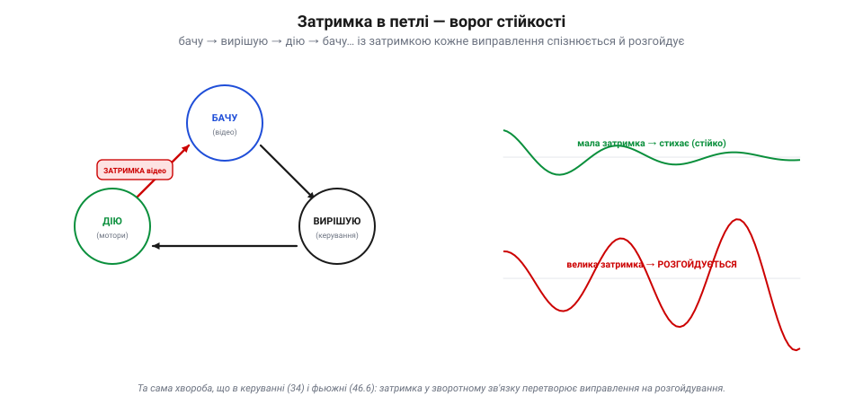
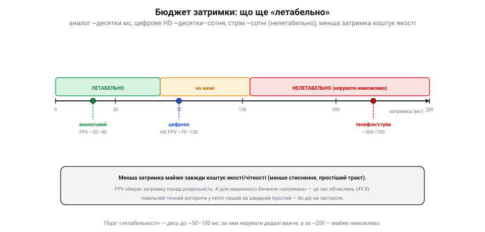

# Затримка (latency) і чому критична для керування

Увесь шлях відео — від [фотона на пікселі сенсора](book:electronics/image-sensor) до [сигналу, що тече дротом чи радіо](book:communications/analog-video) — веде до однієї, найважливішої для **керування** величини: **затримки** (*latency*). Це час, що минає від миті, коли світло впало на лінзу камери, до миті, коли картинку видно (тобі чи алгоритму). На вигляд дрібниця в мілісекундах — а насправді саме вона вирішує, чи можна на цьому відео **летіти**.

### Скло-до-скла: з чого складається затримка

Затримку міряють «**скло-до-скла**» (*glass-to-glass*): від скла об'єктива камери до скла твого екрана. І складається вона з **ланцюжка** кроків, кожен зі своїми мілісекундами.

*Рис. Затримка «скло-до-скла» — сума ланцюжка. Світло треба зекспонувати й зчитати з сенсора, передати, показати на екрані — кожен крок коштує мілісекунд. В **аналозі** ланцюг короткий (~16 мс, майже миттєво). **Цифра** додає дві ненажерливі ланки — кодування (стиснення) перед передачею й декодування після — плюс буфери, і набирає ~70 мс і більше.*

Світло треба **зекспонувати й зчитати** з [сенсора](book:electronics/cmos-matrix) — кілька-десяток мс. Тоді — **передати** (радіо, кабель). Тоді — **показати** на екрані (у нього свій буфер і оновлення). У **аналозі** цей ланцюг короткий: сигнал майже відразу стає картинкою — разом десь **15–40 мс**. А **цифра** додає дві ненажерливі ланки: кадр треба **стиснути** (закодувати) перед передачею й **розтиснути** (декодувати) після — а це ще десятки мс, плюс буфери. Звідси цифрове HD FPV легко набирає **70–130 мс** і більше. Кожен крок коштує часу, і вони **додаються**.

### Летиш у минулому

Чому ці мілісекунди такі важливі? Бо картинка, яку ти бачиш, — **застаріла**. Поки кадр зняли, передали й показали, апарат уже **зрушив**. Ти керуєш по тому, де він **був**, а не де він **є**.

*Рис. Керуєш по застарілій картинці. Поки кадр зняли, передали й показали, апарат уже зрушив: на екрані він там, де **був** (сіре), а насправді — далі по курсу (синє). Виправляючи неактуальне, пілот (чи алгоритм) перекручує, апарат проскакує — і починається розгойдування, те саме [перерегулювання](book:math/loop-stability). На швидкості 20 м/с навіть 100 мс — це два метри наосліп.*

На малій швидкості це дрібниця, та на швидкому польоті — біда. За 100 мс дрон на швидкості 20 м/с пролітає **два метри** — наосліп, бо ти їх іще не бачив. Реагуючи на застарілу картинку, пілот (чи алгоритм) виправляє вже **неактуальне**, апарат проскакує ціль, доводиться виправляти назад — і починається **розгойдування**, те саме [перерегулювання в керуванні](book:math/loop-stability). Що більша затримка й швидший політ, то сильніше «пливе» керування.

### Затримка в петлі — ворог стійкості

І це не випадковість, а закон. Керування — це **петля** зі зворотним зв'язком: **бачу → вирішую → дію → знову бачу**. А затримка відео сидить прямісінько в цій петлі, на ланці «бачу».

*Рис. Затримка в петлі керування. Керування — петля «бачу → вирішую → дію → знову бачу», і затримка відео сидить на ланці «бачу». За малої затримки відхилення стихає (стійко, зелене); за великої — кожне виправлення спізнюється й накладається не туди, тож петля **розгойдується** (червоне). Та сама хвороба, що в [керуванні](book:math/loop-stability) і [поєднанні](book:algorithms/latency-sync).*

І в [теорії керування](book:math/loop-stability), і у [поєднанні давачів](book:algorithms/latency-sync) діє те саме правило: **затримка у зворотному зв'язку — головний ворог стійкості**. Коли реакція на дію приходить запізно, кожне виправлення накладається не туди, де треба, — і замість того, щоб гасити відхилення, петля його **розгойдує**. Чим довша затримка, тим **повільнішим і м'якшим** мусить бути керування, щоб не піти врознос, — а отже, тим гіршу динаміку терпить апарат. Ось чому затримка відео — не питання комфорту, а питання **керованості**: за певною межею летіти стає просто неможливо.

> 📜 Найжорстокіший урок про затримку дала місячна поверхня. 1970 року радянський **«Луноход-1»** став першим апаратом, що його **керували по відео** з іншого світу: п'ятеро операторів на Землі (командир, водій, штурман…) вели місяцехід, дивлячись на знімки з його камер. Та які знімки! Камера слала не відео, а **окремі кадри**, раз на **7–20 секунд**, а самому радіосигналу треба було **~3 секунди** на дорогу туди-назад. Тож водій бачив наслідок свого керма аж за багато секунд — а місяцехід за цей час уже від'їжджав на метри вперед. Вести його було пекельно важко: рушали поштовхами, завмирали, боялися кратерів. Це й є затримка в петлі, доведена до краю: керувати, дивлячись у глибоке минуле. «Луноход» проїздив 11 місяців — тріумф попри все, — але назавжди показав, **чому** далеким апаратам потрібна власна автономія, а не лише джойстик із Землі.

### Бюджет затримки: де межа летабельності

Скільки ж затримки апарат **терпить**? Грубо — поки вона мала проти швидкості реакції самого апарата.

*Рис. Бюджет летабельності. «Миттєвим» для меткого польоту відчувається десь до 50 мс; до ~100 ще летабельно, за ~150–200 — майже неможливо. Тому аналоговий FPV (~20–40 мс) любий гонщикам, цифрове HD FPV (~70–130) на межі, а стрім/телефон (сотні мс) для керування непридатний. Менша затримка майже завжди коштує якості.*

Для меткого FPV-польоту «миттєвим» відчувається десь **до 50 мс**; до ~100 ще летабельно, хоч важче; за ~150–200 мс керувати на швидкості стає майже неможливо. Тому **аналог** (20–40 мс) такий любий гонщикам, **цифрове HD FPV** (70–130 мс) — на межі прийнятного, а звичайний відеострім чи телефон (сотні мс) для керування **непридатний** зовсім — ним хіба фотографувати, не летіти. І скрізь та сама плата: **менша затримка коштує якості** — менше стиснення, простіший тракт, нижча чіткість. FPV свідомо обирає затримку понад роздільність.

> 🔧 **Навіщо це.** Для **машинного бачення** на борту «затримка відео» обертається на [час обчислень](book:algorithms/compute-cost): поки алгоритм пережовує кадр, апарат летить далі, тож повільний точний детектор у петлі керування гірший за швидкий простіший — бо діє на застаріле. Тому в зорі-в-петлі цінують **темп**, а важку обробку виносять із критичного кола. А ще: міряй **усю** затримку скло-до-скла, не лише «лаг каналу» — найбільше з'їдають кодування й буфери, а не саме радіо.

### Підсумок теми

Затримка — це повний час «**скло-до-скла**» від світла на лінзі до картинки в очах: сума всіх кроків (експозиція, зчитування, у цифри ще кодування й декодування, передача, екран), що дає десятки мс в аналозі й сотню-півтори в цифровому HD. Вона критична, бо картинка завжди **застаріла**: керуєш по тому, де апарат був, а на швидкості це метри наосліп. А головне — затримка сидить **у петлі керування**, а там вона головний ворог [стійкості](book:math/loop-stability): запізніле виправлення **розгойдує** замість гасити. Тому є **бюджет летабельності** (грубо до ~100 мс), і FPV свідомо жертвує якістю заради малої затримки, а машинне бачення — точністю заради темпу. І саме затримка задає головну вимогу до того, як [стиснути відео](book:algorithms/why-compress): кодек має не лише вкластися в канал, а й не з'їсти зайвих мілісекунд — інакше виграш у чіткості обернеться втратою керованості.
