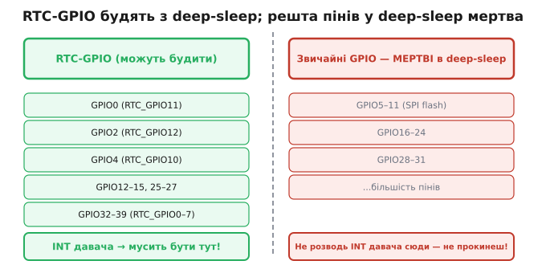

# Джерела пробудження: таймер, GPIO, дотик, ULP

Сон без пробудження — смерть. Пристрій мусить уміти прокинутися на подію — і кожне джерело пробудження має свою ціну в мікроамперах, бо щось мусить залишатися живим, щоб стежити за цією подією. Вибір джерела — це вибір, що тримати ввімкненим уві сні.

**Таймер (RTC timer)**: «розбуди через N секунд». Найдешевший і найпростіший варіант. Живим лишається лише той самий [RTC-таймер, що веде час уві сні](book:programming/rtc), і споживає він одиниці наноампер — практично безкоштовно. Основа будь-якого давача з «рідкісним семплуванням» — прокидатися раз на хвилину, виміряти, заснути.

**GPIO / зовнішнє пробудження (ext0/ext1)**: «розбуди, коли ніжка змінить рівень». Для кнопки чи для INT-виходу зовнішнього давача, що сам [сигналізує про подію перериванням](book:programming/interrupts). ext0 стежить за однією ніжкою, ext1 — за маскою кількох (умова АБО або І). Ціна: тримати RTC-GPIO живим — кілька мікроампер.

**Дотик (touch pad)**: ємнісна площадка на ніжці ESP32 може будити чип, коли хтось торкнувся. Корисно для кнопок без механіки — кнопки ламаються, площадки — ні. Трохи дорожче: потрібне періодичне сканування ємності, тому струм вищий — близько 30 мкА.

**ULP (co-processor)**: крихітний [процесор у RTC-домені](book:programming/ulp-coprocessor) сам прокидається за таймером, щось вимірює і вирішує, будити велике ядро чи ні. Найрозумніший і найгнучкіший, але й найскладніший у програмуванні.


*Рис. Карта чотирьох джерел пробудження навкруги сплячого чипа: таймер, GPIO/ext, touch, ULP — із підписом «що тримає живим» і доданим струмом у мкА. Критерій вибору: найдешевше джерело, що закриває задачу.*

Важлива практична деталь: у deep-sleep **тільки RTC-GPIO зберігає здатність будити**. Звичайні GPIO в deep-sleep мертві — логіка їхньої периферії знеструмлена. Це лише підмножина пінів ESP32, і прив'язана вона до конкретних номерів.



*Рис. Ліворуч — RTC-GPIO (спроможні будити з deep-sleep), праворуч — звичайні GPIO (у deep-sleep мертві). Пастка при розведенні плати: якщо INT-вихід давача потрапить на не-RTC-пін, чип не прокинеться на подію.*

> 🔧 **Навіщо це.** Джерело пробудження — це те, що тримаєш увімкненим уві сні. Бери найдешевше, що закриває задачу: для рідкісного давача — таймер; для реакції на зовнішню подію — GPIO; будити ядро на кожен дрібний поріг — марно, краще ULP.

> 🔌 Зовнішні залізні будильники — [r13-s4-c-wake-hw.md](comp-wake-hw.md): зовнішній RTC з alarm-виходом, load switch, кнопка-защіпка. Коли треба знеструмити ESP32 **повністю** і будити ззовні — це окремий клас схемних рішень.

Особливість deep-sleep: джерел пробудження можна ввімкнути кілька одночасно. Таймер і кнопка — і чип прокинеться від того, що настало раніше. Після пробудження прошивка питає причину через `esp_sleep_get_wakeup_cause()` — той самий патерн «чому я стартував», що й при [розрізненні причин reset](book:programming/reset-causes).

**Worked-приклад. Пробудження від кнопки АБО таймеру.**

```c
#include "esp_sleep.h"
#include "driver/gpio.h"

#define WAKEUP_GPIO GPIO_NUM_36   // мусить бути RTC-здатним піном!
#define SLEEP_MINUTES 15

void app_main(void) {
    // Дізнатися причину пробудження
    esp_sleep_wakeup_cause_t cause = esp_sleep_get_wakeup_cause();
    switch (cause) {
        case ESP_SLEEP_WAKEUP_TIMER:
            handle_periodic_measurement();
            break;
        case ESP_SLEEP_WAKEUP_EXT0:
            handle_button_press();
            break;
        default:
            cold_start_init();  // перше ввімкнення
            break;
    }

    // Налаштувати ОБИДВА джерела пробудження
    esp_sleep_enable_timer_wakeup((uint64_t)SLEEP_MINUTES * 60 * 1000000ULL);
    esp_sleep_enable_ext0_wakeup(WAKEUP_GPIO, 0);  // рівень LOW будить

    esp_deep_sleep_start();
}
```

Два рядки налаштування — і пристрій реагує і на розклад, і на кнопку. Причину розрізняє при старті і обирає відповідну гілку коду.

---
