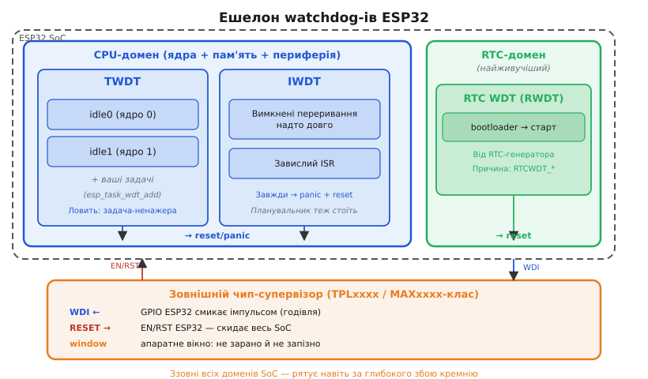
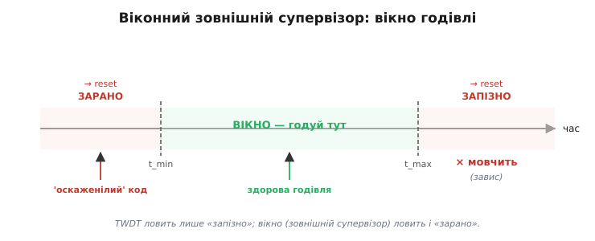

# 🔌 Три watchdog-и ESP32: TWDT, RTC WDT, віконний режим і зовнішній супервізор

> Компонентна вставка про [watchdog як таймер, що рятує від зависання](book:programming/watchdog). Сама ідея сторожа й те, як його чесно годувати, — там; тут *залізна правда ESP32*: скільки в ньому сторожів насправді, який за що відповідає, як їх увімкнути в ESP-IDF і коли на додачу ставлять зовнішній.

У ESP32 сторожів троє; гляньмо на кожного впритул, бо їх постійно плутають, а виправляють зовсім по-різному. Перший — **TWDT** (Task WDT) — стежить, чи отримують усі задачі процесорний час: якщо idle-задача ядра не отримує керування, значить хтось монополізував CPU. Другий — **Interrupt WDT (IWDT)** — чатує інакше: чи не вимкнені переривання надто довго, чи не завис ISR так, що планувальник замовк. Третій — **RTC WDT (RWDT)** — найживучіший: відраховує від окремого RTC-генератора і стереже ще до того, як запустився ваш код. Четвертий рівень — *зовнішній* чип-супервізор, що розташований поза SoC; до нього дійдемо нижче.

Двоядерність ESP32 підказує важливу деталь: сторожі не забули і про другий процесор — кожне ядро має свою idle-задачу, і TWDT стежить за обома.

## Що це за вузол: не периферія, а вбудована сітка

На відміну від зовнішнього [RTC-модуля](book:programming/rtc), сюди нічого паяти: **три апаратні блоки вже всередині SoC** — вони живуть у різних доменах живлення і тактування, тому не замінюють одне одного.

**TWDT** — задачний watchdog (task watchdog timer), що працює поверх FreeRTOS. Не варто уявляти його «таймером на ніжці»: TWDT стежить, щоб *idle-задача кожного ядра* отримувала процесорний час. Логіка проста: idle запускається планувальником лише тоді, коли жодна прикладна задача не потребує ядра. Якщо idle довго не отримує керування — значить, якась задача *захопила ядро і не відпускає*. Саме тоді в лог падає «task watchdog got triggered». Можна підписати й *власні* задачі через `esp_task_wdt_add` — тоді кожна з них зобов'язана самостійно викликати `reset`.

**IWDT** (interrupt watchdog timer) бачить те, чого TWDT ніколи не побачить: коли переривання вимкнені настільки довго, що зупиняється навіть планувальник. Типовий сценарій — надто довга [критична секція](book:programming/atomicity-races) або завислий обробник переривання. TWDT у такому стані сам мовчить, бо мовчить і FreeRTOS. IWDT завжди закінчується панікою.

**RTC WDT** (RWDT) відраховує від RTC-генератора — найживучішого домену ESP32, що продовжує працювати навіть під час глибокого сну. Він активується ще *завантажувачем*, до вашого `app_main`. Якщо bootloader або сам старт прошивки завис — саме RWDT ініціює скидання. Причина скидання потрапляє в [лог причин ресету](book:programming/reset-causes) як `RTCWDT_*` — перший орієнтир при налагодженні після загадкового перезавантаження.



*Рис. Три внутрішні watchdog-и ESP32 за доменами живлення/такту й зовнішній супервізор над ними: TWDT стереже idle-задачі обох ядер, IWDT — задовге вимкнення переривань, RTC WDT — завантаження й старт у RTC-домені, а зовнішній чип смикає EN усього чипа, коли й внутрішнім сторожам зле.*

> 🔧 **Навіщо це.** Коли пристрій сам перезавантажується, перший крок — *який саме сторож* спрацював: TWDT кричить про задачу-ненажеру, IWDT — про задовгі вимкнені переривання, RTC WDT — про застрягання ще до старту. Знаючи винуватця, лагодиш причину, а не глушиш скиди. Тому ESP32 і пише reason при кожному reset — навчися його читати.

## «Розпіновка»: входи, виходи й конфіги

Замість фізичних ніжок — параметри керування. Ось вони у форматі «розпіновки»:

```
TWDT   timeout_ms        // поріг (idle/задачі мають скидати до нього)
TWDT   idle_core_mask    // які idle-задачі підписані (CORE0 / CORE1)
TWDT   trigger_panic     // true → паніка + reset; false → лише лог
IWDT   timeout_ms        // макс. час із вимкненими перериваннями
RWDT   (bootloader cfg)  // стереже старт; вмикається до main
```

Кожен рядок важить. `timeout_ms` визначає, скільки часу задача чи idle мають, щоб показати ознаки життя; `idle_core_mask` вказує, котрі idle-задачі зобов'язані відмічатися (на двоядерному ESP32 — обидва, якщо не хочете сліпої зони). Ключовий вибір — `trigger_panic`: значення `true` дає паніку зі стектрейсом і перезапуск, `false` — лише запис у лог (пристрій продовжує працювати). Для виробничих прошивок майже завжди обирають `true` — тихий лог не рятує заклинілий пристрій.

Двоядерність тут нетривіальна: TWDT логічно один, але стежить за idle-задачею *кожного ядра окремо*. Прикладна логіка зазвичай виконується на ядрі 1 (там `app_main` і `loopTask` Arduino-шару); якщо вона заморозить це ядро, idle1 не отримає часу — і TWDT це зафіксує.

Де живуть ці конфіги: `menuconfig` / `sdkconfig` з префіксами `CONFIG_ESP_TASK_WDT_*`, `CONFIG_ESP_INT_WDT_*`, `CONFIG_BOOTLOADER_WDT_*`. Їх можна перевизначити і програмно.

## Підключення: нічого паяти, лише ввімкнути

TWDT у типовому ESP-IDF-проєкті вже активний: idle-задачі обох ядер підписані за замовчуванням. «Підключення» — переконатися, що ваша тривала задача або своєчасно *yield*-ить, або **підписана** і годується самостійно.

Якщо хочете стерегти критичну власну задачу: одним викликом `esp_task_wdt_add(NULL)` з її контексту ви підписуєте поточну задачу, і тепер вона зобов'язана самостійно викликати `esp_task_wdt_reset()` на кожному успішному оберті.

В Arduino-шарі поверх IDF `loopTask` зазвичай підписана — звідси й класичне «Task watchdog got triggered» у `loop()` без `delay()`. TWDT там той самий, API той самий; [сам принцип годівлі сторожа](book:programming/watchdog) — окрема розмова.

## Перший байт: підписати задачу під TWDT і чесно її годувати

**Ось мінімальний приклад: підписуємо задачу під TWDT і чесно її годуємо.**

```c
#include "esp_task_wdt.h"

void app_main(void) {
    esp_task_wdt_config_t wdt = {
        .timeout_ms     = 5000,                   // 5 с на оберт
        .idle_core_mask = (1 << 0) | (1 << 1),   // обидва idle
        .trigger_panic  = true,                   // протух → паніка + reset
    };
    esp_task_wdt_init(&wdt);      // або reconfigure, якщо вже live
    esp_task_wdt_add(NULL);       // стерегти ЦЮ задачу

    for (;;) {
        do_work();                // завис тут — до reset не дійде
        esp_task_wdt_reset();     // доказ поступу → годуємо
    }
}
```

`reset` стоїть *після* `do_work()` — це і є [годівля як доказ поступу](book:programming/watchdog). `timeout_ms` має перевищувати найдовший чесний оберт вашого коду. Важливий нюанс версій: у ESP-IDF v5+ `esp_task_wdt_init` приймає структуру `esp_task_wdt_config_t`; якщо TWDT уже запущений системою — потрібен `esp_task_wdt_reconfigure`. Старий підпис `esp_task_wdt_init(timeout_ms, panic)` (IDF v4 і раніше) не скомпілюється в новому SDK — реальна пастка для тих, хто копіює приклади з інтернету.

## Віконний режим на ESP32

Будьмо чесні: класичного «не годуй зарано» — windowed watchdog — у TWDT рівня FreeRTOS немає. TWDT реагує лише на «надто пізно»: задача не встигла викликати `reset`. Апаратний MWDT/RWDT таймерної групи має нижню і верхню межу в регістрах, але через стандартний прикладний API вони зазвичай не виставляються.

Для суворого «вікна», якого вимагають функційно-безпечні стандарти (IEC 61508, ISO 26262), застосовують **зовнішній віконний супервізор**. [Ідея вікна](book:programming/watchdog) на ESP32 живе радше *ззовні*, ніж у TWDT.

## Зовнішній супервізор: коли й кремнію всередині мало

Три внутрішні сторожі відраховують від доменів живлення й тактування самого SoC. Глибокий збій — перенапруга, латч-ап, дефект кремнію, завислий RTC-домен — може вивести їх усі з ладу одночасно. Тому в апаратурі, що мусить вижити будь-що (медтехніка, автомобільна електроніка, промислові контролери, космос — там, де поодинокий збій від частинки, SEU, цілком реальний), ставлять **окремий чип-сторож поза SoC**.

Такий чип — мікросхема класу watchdog supervisor (сімейства TPLxxxx, MAXxxxx та подібні) — часто суміщає нагляд за живленням і функцію watchdog в одному корпусі; нагляд за просіданням живлення тут споріднений із [захистом від brown-out](book:programming/brownout). Його «розпіновка» — три сигнали:

```
WDI   ← МК смикає цей GPIO імпульсом (годівля)
RESET → тягне EN/RST ESP32 у скид
WD_EN / window — увімкнення, задає часове вікно
```

Підключення: `WDI` — на будь-який вільний GPIO; `RESET` — на лінію `EN` ESP32 (ту саму, що смикає [схема авто-прошивки](book:programming/esp32-architecture)). Зовнішній чип не знає, що таке FreeRTOS або RTC-домен; він знає одне: завмер `WDI` — ініціювати скидання через `EN`. Більшість таких мікросхем реалізують *справжнє* апаратне вікно: і занадто ранній, і запізнілий імпульс однаково призводять до скидання. Ось де «не годуй зарано» нарешті стає реальністю.



*Рис. Віконний зовнішній супервізор: годівля мусить влучити у вузьке вікно — і не запізно (завис), і не зарано («оскаженілий» цикл). На відміну від TWDT, що карає лише за спізнення, вікно ловить і надто часту годівлю.*

«Перший байт» зовнішнього сторожа — один перемикальний імпульс GPIO у ритмі вікна: зависання МК → GPIO завмир → чип самостійно скидає `EN`.

## Типові граблі

- **Плутати TWDT і IWDT.** «Task wdt» = задача-ненажера (виправлення: `yield`, `vTaskDelay`, підписка й `reset`); «Interrupt wdt» = задовго вимкнені переривання або завислий ISR (виправлення: коротша [критична секція](book:programming/atomicity-races), оптимізований обробник). Симптоми різні — і засоби різні.
- **Версії IDF.** Старий API: `esp_task_wdt_init(timeout_ms, panic)`. Новий (v5+): структура `esp_task_wdt_config_t` + `reconfigure`, якщо TWDT уже запущений системою. Приклад зі StackOverflow 2021 року часто не компілюється в новому SDK — читайте поточний `esp_task_wdt.h`.
- **Налагоджувач проти сторожа.** На точці зупину відладчика TWDT і IWDT вважають це зависанням і ініціюють скидання. На час налагодження вимикайте: `CONFIG_ESP_TASK_WDT_ENABLED=n` або `esp_task_wdt_delete(NULL)`. У релізі обов'язково повертайте.
- **Підписав — мусиш годувати.** `esp_task_wdt_add(task)` без подальших `reset` у тій задачі — гарантоване скидання. Підписка — обов'язок, а не безкоштовна страховка.
- **Зовнішній на EN, не у порожнечу.** Якщо вихід RESET зовнішнього чипа веде просто «нікуди» (GPIO без зв'язку з EN) — це бутафорія. Підключайте до тієї самої лінії `EN`, що й схема авто-прошивки.
- **idle_core_mask.** Забули підписати idle потрібного ядра — TWDT не побачить зависання саме на ньому. На двоядерному ESP32 зазвичай `(1 << 0) | (1 << 1)`.

## Варіації класу: драбина надійності

Для більшості IoT і аматорських задач вистачає трьох внутрішніх (вони вже ввімкнені): **TWDT** ловить задачі-ненажери — це покриває 90% реальних зависань; **IWDT** ловить «німі» зависання з вимкненими перериваннями — теж є з коробки; **RTC WDT** стереже старт і bootloader — також. Зовнішній чип додають саме там, де потрібно вижити при збої самого кремнію і де функційна безпека вимагає апаратного вікна.

Отже, «watchdog ESP32» — це не один таймер, а ешелон із трьох внутрішніх і, за потреби, зовнішнього. Знати, хто за що відповідає, — половина успіху в налагодженні мимовільних перезавантажень.
