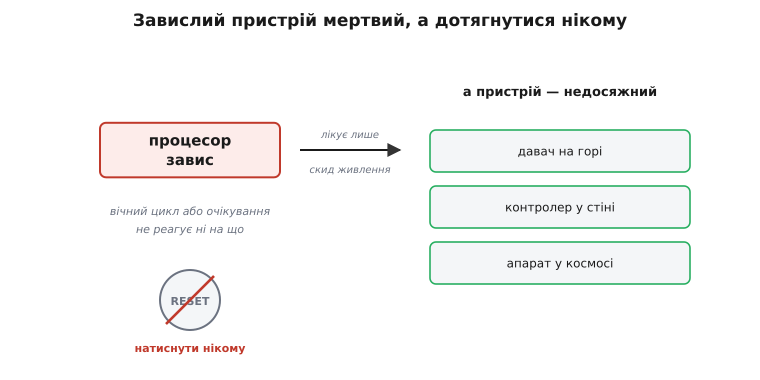
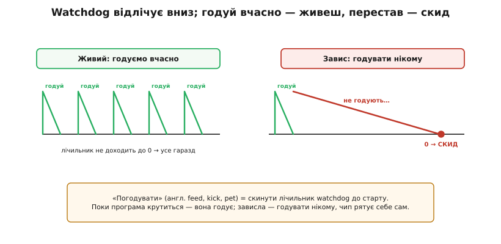
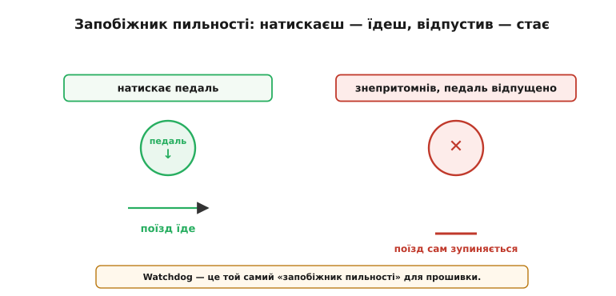
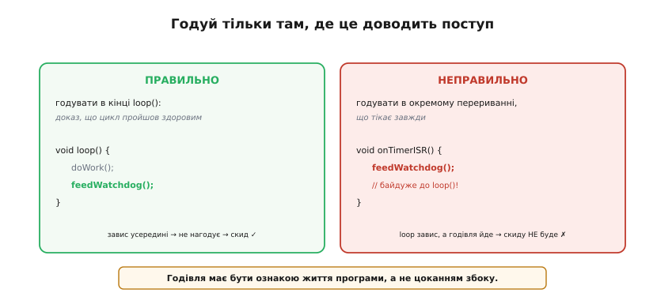
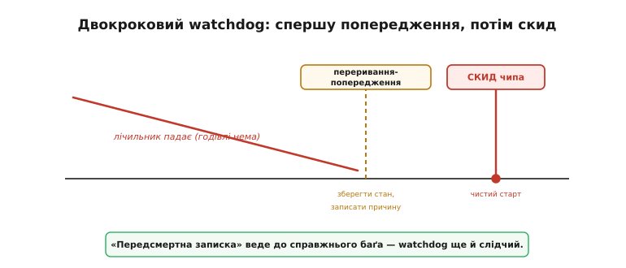
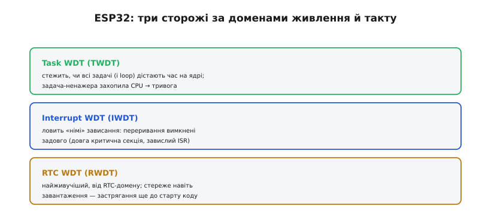

# Watchdog: таймер, що рятує від зависання

Є в таймера особлива, **сторожова** роль. Хоч би як ретельно ви писали код, прошивка може **зависнути**: потрапити у вічний цикл, застрягти в очікуванні пристрою, що не відповідає, чи спіткнутися об рідкісну помилку, яку годі відтворити. Завислий пристрій — мертвий: він не реагує ні на що, і єдиний рятунок — перезавантаження. Та що, як до пристрою не дотягнутися рукою? Тут і виходить на сцену **watchdog** (англ. *watchdog timer* — «сторожовий таймер») — апаратний охоронець, що сам перезапустить чип, якщо програма «замовкне». Це остання лінія оборони надійних вбудованих систем.

### Проблема: зависання, до якого не дотягнутися

Чому це серйозно, видно з причин. Програма може зависнути з багатьох причин: логічна помилка завела в нескінченний цикл; код чекає на відповідь давача, який заглух; стався збій пам'яті від перешкоди чи космічної частинки. Хоч би яка причина — наслідок один: процесор більше не просувається, пристрій не реагує, і «вилікувати» його може лише скид живлення.


*Прошивка застрягла — у вічному циклі чи в очікуванні. Пристрій не реагує ні на що, і допоможе лише перезапуск. Та біда в тім, що багато пристроїв недосяжні: давач на горі, контролер у стіні, апарат у космосі. Натиснути «reset» нікому — потрібен автоматичний рятівник.*

Саме недосяжність робить зависання нестерпним. Світлодіодний блимавчик на столі можна перемкнути вручну, та промисловий давач, метеостанцію на даху чи супутник — ні. А вимога працювати **місяцями без нагляду** означає, що навіть рідкісний, «раз на мільйон» збій колись та станеться. Покладатися лише на бездоганність коду тут наївно — потрібен механізм, що **сам** виявить зависання й оживить пристрій.

Окремо варто згадати збої, що **не** залежать від якості коду взагалі. Заряджена частинка (космічний промінь, природний радіаційний фон) здатна на льоту [**перевернути біт**](book:algorithms/bit-flips) у пам'яті чи регістрі — це називають «одиничним збоєм» (SEU). У космосі це буденність, та зрідка трапляється й на Землі. Бездоганний код тут безсилий: його стан псує зовнішня фізика. І саме проти таких невловних, невідтворюваних збоїв watchdog незамінний — він не питає **чому** система зависла, а просто повертає її до життя.

### Watchdog: сторожовий таймер, що скине чип

Цей механізм гранично простий і елегантний. **Watchdog** — це окремий апаратний таймер, що невпинно відлічує час **вниз**. Якщо він дійде до нуля, він **перезавантажить** чип. А щоб цього не сталося, працездатна програма має раз у раз **«годувати»** його (англ. *feed*, *kick*, *pet*): скидати його лічильник назад до старту, доводячи цим «я ще жива й працюю». Поки програма крутиться — вона годує сторожа, і скиду не буває. Та щойно вона зависне, годувати стане нікому — лічильник дійде до нуля, і watchdog сам перезапустить систему.


*Ліворуч — здорова програма регулярно «годує» watchdog (скидає його лічильник), тож той не доходить до нуля. Праворуч — програма зависла, годувати нікому, лічильник добігає нуля — і чип перезавантажується. «Погодувати» означає просто скинути лічильник watchdog до початку; зависання вимикає це годування — і чип рятує себе сам.*

Краса ідеї в тому, що watchdog — **незалежний** від процесора вузол: він тікає від власного джерела й не залежить від того, що коїться в коді. Навіть якщо ядро намертво застрягло, сторож продовжує відлічувати — і доводить справу до скиду. Це **остання** лінія оборони: вона не запобігає зависанню, а **відновлює** систему після нього, повертаючи її до робочого стану без участі людини.

Незалежність watchdog часто сягає й **джерела такту**: багато сторожів тікають від власного, окремого генератора (простого RC-осцилятора), а не від головного кварцу. Це зроблено навмисне: якщо відмовить основний такт — а від нього залежить увесь чип, — звичайний таймер теж стане, а ось watchdog зі своїм генератором усе одно дорахує до нуля й перезавантажить систему. Тобто сторож стереже навіть від поломки самого «серцебиття» процесора — справді остання лінія оборони.

### Аналогія: «запобіжник пильності» машиніста

Найкраще суть watchdog передає старий залізничний винахід — **запобіжник пильності** (його ще звуть «вимикачем мерця»). Машиніст поїзда мусить раз у раз натискати педаль чи кнопку, підтверджуючи, що він при тямі. Поки натискає — поїзд їде. Та якщо машиніст знепритомнів і педаль лишилася відпущеною надто довго, система **сама** зупиняє поїзд, рятуючи від катастрофи.


*Машиніст регулярно натискає педаль — поїзд їде; знепритомнів, педаль відпущено — поїзд сам зупиняється. Watchdog — це той самий «запобіжник пильності» для прошивки: годуєш регулярно (натискаєш) — система живе; перестав (завис) — вона сама себе перезапускає.*

Аналогія точна до дрібниць: «натискання педалі» — це годування watchdog, а «зупинка поїзда» — автоматичний скид. І сенс той самий: система не довіряє безперервній справності оператора (чи коду), а вимагає **постійного доказу життя** — і діє, щойно той доказ зникає.

Той самий принцип лежить і в людських системах безпеки. Самотній працівник на небезпечній ділянці раз у раз тисне кнопку «я в нормі»; перестав — висилають допомогу. Альпініст виходить на зв'язок за розкладом; зник — починають пошук. Усюди одне: довіряй не обіцянці справності, а **регулярному сигналу життя** — і дій, коли сигнал обірвався. Watchdog переносить цю давню ідею безпеки у світ кремнію.

### Де годувати правильно

Є тут тонкість, на якій ламається багато новачків. Годувати watchdog треба **не абияк**, а саме там, де це **доводить**, що програма реально просувається. Звична правильна точка — кінець головного циклу (у голому C це тіло `while (1)`, в Arduino — `loop()`, під RTOS — цикл робочої задачі): якщо цикл дійшов донизу здоровим, він годує сторожа; а якщо завис десь усередині — до годування не дійде, і станеться рятівний скид.


*Праворуч — помилка: годувати watchdog у незалежному перериванні таймера, що тікає завжди. Тоді навіть якщо `loop()` намертво застряг, годування йде, і скиду не буде — сторож засліплений. Ліворуч — правильно: годувати в кінці `loop()`, як доказ, що цикл проходить здоровим. Годівля має бути ознакою життя програми, а не автоматичним цоканням збоку.*

Це і є золоте правило watchdog: **годівля мусить бути доказом поступу**. Найгірша помилка — годувати сторожа «наосліп», з місця, що працює незалежно від основної програми (наприклад, із переривання таймера). Тоді watchdog годуватиметься, навіть коли головний код давно мертвий, — і весь сенс охорони втрачено. Годуйте лише там, де проходження цієї точки справді означає, що система жива й рухається вперед.

> ⚙️ **А якщо задач багато?** Тоді одного «місця поступу» мало: треба, щоб **кожна** важлива задача підтвердила, що жива. Прийом — **чекпойнти**: кожна задача відмічається, а годуємо watchdog, лише коли **всі** відмітились нещодавно. Як це зробити — у вставці [Як «годувати» watchdog правильно](book:programming/watchdog/proj-watchdog-feed.md).

> 🔧 **Навіщо це.** Запам'ятайте: watchdog корисний рівно настільки, наскільки чесна його годівля. Найпідступніша помилка — «заткнути» зайві скиди, годуючи сторожа надто часто чи з неправильного місця: так ви глушите сигнал тривоги, замість лікувати причину. Якщо watchdog зрідка скидає пристрій — це **симптом**, а не ворог: шукайте, де код застрягає чи що триває довше за таймаут. Годуйте watchdog як свідчення «усе йде за планом», а не як набридливий будильник, що його хочеться вимкнути.

Найсуворіші watchdog ідуть ще далі — вони **віконні** (windowed): годувати їх можна не лише «не запізно», а й «не зарано». Тобто є вікно часу, у яке має влучити годівля; нагодуєш надто **рано** — і це теж вважається помилкою. Навіщо? Бо «оскаженілий» код, що застряг у щільному циклі, міг би годувати сторожа надто **часто** й тим маскувати свій збій. Віконний watchdog ловить і таке: здорова програма годує рівно в ритм, а збита — або зарано, або запізно.

### Спершу попередження, потім скид

Багато watchdog уміють не просто рубати з плеча, а діяти у два кроки. Спершу, не дочекавшись годівлі, сторож піднімає коротке **переривання-попередження** — даючи програмі останній шанс зробити щось корисне: зберегти важливі дані, записати в журнал причину, акуратно вимкнути небезпечні виходи. І лише якщо й після цього годівлі немає, watchdog виконує **скид**.


*Двокроковий watchdog: коли лічильник майже добіг нуля, спершу спрацьовує коротке переривання-попередження (зберегти стан, записати причину), а вже потім — скид чипа й чистий старт. Так пристрій не лише оживає, а й може лишити «передсмертну записку» — чому він завис.*

Це робить watchdog не лише рятівником, а й **слідчим**: «передсмертна записка» (наприклад, адреса, де код застряг, чи стан змінних) безцінна для пошуку причини зависання. Без неї ви знали б лише, що пристрій час від часу перезавантажується; з нею — маєте слід, який веде до справжнього баґа. Тож двокроковий watchdog і відновлює систему, і допомагає її **полагодити** назавжди.

Watchdog — не єдина така сітка безпеки в чипі. Поряд із ним зазвичай працює [**детектор просідання живлення**](book:programming/brownout) (brown-out): якщо напруга впала нижче безпечної (сіла батарея, стрибок навантаження), він теж перезавантажує чип, не даючи йому виконувати код «на голодному пайку», де можливі будь-які дивацтва. Разом watchdog і детектор живлення прикривають дві найпідступніші біди автономних пристроїв — зависання й нестабільне живлення, — і обидва варто вмикати в усьому, що має працювати надійно.

### Watchdog у ESP32

У ESP32 сторож не один. Два з них стережуть різні види зависань уже працюючого коду. **Задачний watchdog** (Task WDT) стежить, чи всі задачі (зокрема й та, у якій крутиться ваш головний цикл) регулярно дістають час на ядрі; якщо якась задача надовго «захопила» процесор і не віддає його, він б'є тривогу. **Перериваннєвий watchdog** (Interrupt WDT) ловить інше — коли переривання вимкнені занадто довго (задовга [критична секція](book:programming/atomicity-races) чи завислий обробник), через що система «німіє».


*Task WDT стежить, чи задачі (і `loop`) дістають час, — ось чому довгий `loop()` без `delay`/`yield` інколи «падає» зі скидом. Interrupt WDT ловить «німі» зависання, коли переривання вимкнені занадто довго. RTC WDT від найживучішого домену стереже навіть завантаження. У коді watchdog вмикають із таймаутом і регулярно годують; таймаут беруть більший за найдовшу чесну операцію, щоб не було хибних скидів.*

Саме через задачний watchdog новачки інколи бачать загадкове «Task watchdog got triggered», запхавши в головний цикл довге блокування без перерви, — і це, по суті, сторож виконує свою роботу. Користуватися watchdog у коді просто: його вмикають із вибраним **таймаутом** і регулярно годують. Головне рішення — правильний таймаут.

**Підписати головний цикл під сторожа й чесно годувати його (найдовша чесна ітерація — близько 1.2 с).** Дії скрізь ті самі: увімкнути сторожа з таймаутом, підписати під нього робочий контекст і годувати в кінці циклу — різняться лише імена.

:::tabs
```arduino
#include "esp_task_wdt.h"

#define WDT_TIMEOUT_S 5          // таймаут сторожа, секунди

void setup() {
  esp_task_wdt_init(WDT_TIMEOUT_S, true);  // увімкнути: 5 с, true → reset
  esp_task_wdt_add(NULL);                  // стерегти ЦЮ задачу (loopTask)
}

void loop() {
  doWork();                 // якщо завис ТУТ — до годівлі не дійде
  esp_task_wdt_reset();     // дійшли здоровими → скидаємо лічильник
}
```
```esp-idf
#include "esp_task_wdt.h"
#include "freertos/FreeRTOS.h"
#include "freertos/task.h"

#define WDT_TIMEOUT_MS 5000      // таймаут сторожа, мілісекунди

static void work_task(void *arg) {
    esp_task_wdt_add(NULL);              // стерегти ЦЮ задачу
    for (;;) {
        do_work();                       // якщо завис ТУТ — до годівлі не дійде
        esp_task_wdt_reset();            // дійшли здоровими → скидаємо лічильник
        vTaskDelay(pdMS_TO_TICKS(10));   // віддати час іншим задачам
    }
}

void app_main(void) {
    esp_task_wdt_config_t cfg = {
        .timeout_ms = WDT_TIMEOUT_MS, .idle_core_mask = 0, .trigger_panic = true,
    };
    ESP_ERROR_CHECK(esp_task_wdt_reconfigure(&cfg));  // TWDT уже ввімкнено в menuconfig
    xTaskCreate(work_task, "work", 4096, NULL, 5, NULL);
}
```
```stm32
#include "stm32f4xx_hal.h"

IWDG_HandleTypeDef hiwdg;    // незалежний сторож від власного LSI-генератора

int main(void) {
  HAL_Init();
  SystemClock_Config();

  hiwdg.Instance       = IWDG;
  hiwdg.Init.Prescaler = IWDG_PRESCALER_128;  // LSI ≈ 32 кГц / 128 ≈ 250 тактів/с
  hiwdg.Init.Reload    = 1250;                // 1250 / 250 = 5 с таймауту
  HAL_IWDG_Init(&hiwdg);                      // Init одразу ЗАПУСКАЄ сторожа

  for (;;) {
    DoWork();                    // якщо завис ТУТ — до годівлі не дійде
    HAL_IWDG_Refresh(&hiwdg);    // дійшли здоровими → скидаємо лічильник
  }
}
```
:::

Таймаут тут — компроміс, і його видно з чисел:

```
найдовша чесна ітерація  ≈ 1.2 с
обраний таймаут          = 5.0 с
запас                    = 5.0 − 1.2 = 3.8 с   → хибних скидів немає
найгірше «мертве» вікно  ≤ 5.0 с               → користувач ледь помітить
```

Замалий таймаут — і watchdog скидатиме пристрій під час законних, але довгеньких операцій (хибні спрацювання). Завеликий — і пристрій надовго «зависатиме» перед рятівним скидом. Тому беруть таймаут із запасом **більший** за найдовшу нормальну ітерацію, але не настільки великий, щоб користувач устиг помітити «мертвий» пристрій. Один нюанс версій: у новому ядрі Arduino-ESP32 3.x підпис `esp_task_wdt_init` змінився на структуру, а на вже ввімкненому сторожі кличуть `esp_task_wdt_reconfigure`.

Третій сторож стереже не код, а сам старт: **RTC-watchdog** тікає від найживучішого, RTC-домену й пильнує навіть **завантаження** — якщо чип застрягне ще до старту вашої програми (приміром, у завантажувачі), оживить його саме він. І остання практична дрібниця: під час налагодження покроково watchdog заважає (поки ви «стоїте» на точці зупину, він вважає це зависанням і скидає), тож на час відлагодження його зазвичай тимчасово вимикають — а в робочій прошивці неодмінно вмикають назад.

> 🔌 **Усі три сторожі ESP32 впритул.** TWDT, IWDT і RTC WDT живуть у різних доменах живлення й такту, вмикаються по-різному й вимагають різного виправлення; а понад ними іноді ставлять ще зовнішній чип-супервізор із апаратним вікном. Хто за що відповідає, які конфіги в `menuconfig` і коли потрібен зовнішній — у вставці [Три watchdog ESP32: TWDT, RTC WDT і зовнішній супервізор](book:programming/watchdog/comp-esp32-watchdogs.md).

> 🔧 **Навіщо це.** Для будь-якого пристрою, що працює без нагляду чи має бути надійним, **вмикайте watchdog** — це дешева страховка від рідкісних, невловних зависань. Та користуйтеся ним чесно: годуйте з місця, що доводить поступ, обирайте таймаут із запасом і **не глушіть** його скиди, а розслідуйте їх. Watchdog не замінює доброго коду — він рятує тоді, коли добрий код усе ж спіткнувся об щось непередбачене. Це остання сітка безпеки, і добре, коли вона є, та погано покладатися на неї щодня.

Отже, watchdog — це апаратний сторож, що сам перезапускає завислий пристрій: програма регулярно «годує» його як доказ життя, а щойно годівля зникне (код завис), настає рятівний скид. Годують його лише там, де це доводить поступ, із таймаутом, більшим за найдовшу чесну операцію, — і вмикають у всьому, що має працювати надійно й без нагляду.
