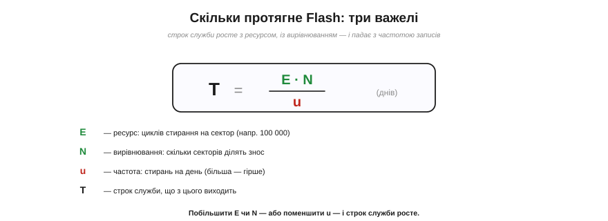
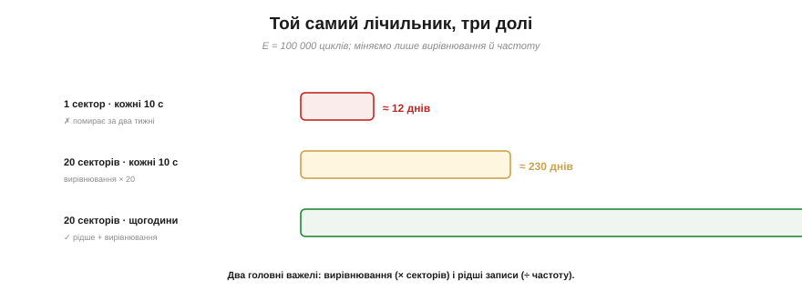

# 🧮 Арифметика ресурсу: цикли стирання × вирівнювання = роки служби

> Математична вставка до теми [вирівнювання зносу](book:programming/wear-leveling): порахуймо, **скільки саме** служить Flash — і коли ресурсу таки не вистачить.

## Означення

Кожен сектор Flash витримує скінченне число **стирань**, перш ніж зноситься, — це його **ресурс** (*endurance*), цикли «стерти-записати» (P/E cycles). Позначимо його **E**. Типове E для NOR-Flash, де лежить код, — близько 100 000.

[Вирівнювання зносу](book:programming/wear-leveling) розкладає записи по **N** секторах, тож кожен зношується повільніше. А темп записів задамо як **u** — скільки **стирань** на день спричиняє ваш пристрій.

## Інтуїція

Думайте про сектор як про блокнот, з якого можна стерти й переписати сторінку лише E разів. Якщо ви стираєте **один** блокнот u разів на день, він скінчиться за E/u днів. Вирівнювання дає вам **N** блокнотів і пише в них по черзі — отже, життя розтягується **в N разів**. А пишете рідше (менше u) — служить довше прямо пропорційно.

## Формальний апарат

```
Один сектор (наївно):
T₁ = E / u                        днів

З вирівнюванням по N секторах:
T  = E · N / u                    днів
```

Три важелі: ресурс **E**, число секторів **N** (вирівнювання) і частота **u**. Строк **T** росте з E і N та падає з u.


*Рис. Строк служби T = E·N / u тримається на трьох важелях: ресурс E (циклів на сектор), вирівнювання N (скільки секторів ділять знос) і частота u (стирань на день). Більші E чи N — або менша u — і строк росте.*

Порахуймо на живому прикладі — лічильнику, що оновлюється. Нехай E = 100 000.

```
Лічильник щодесять секунд, наївно в один сектор:
u  = 86400 / 10             = 8640 стирань/день
T₁ = E / u = 100000 / 8640  ≈ 12 днів           ← помирає за два тижні!

Те саме, але з вирівнюванням по 20 секторах:
T  = E · N / u = 100000 · 20 / 8640 ≈ 231 день

Те саме, але раз на годину (рідше):
u  = 24 стирання/день
T  = 100000 · 20 / 24 ≈ 83000 днів ≈ 228 років  ← з головою
```


*Рис. Один лічильник (E = 100 000), три долі. Наївно в один сектор щодесять секунд — ≈12 днів. Вирівнювання по 20 секторах — ≈230 днів (× N). Раз на годину з вирівнюванням — сотні років. Два важелі: вирівнювання й рідші записи.*

Два висновки кричущі. По-перше, **вирівнювання** саме по собі множить життя на N (тут — у 20 разів). По-друге, **рідші записи** б'ють іще сильніше: переходом із «щодесять секунд» на «щогодини» ми додали множник 360. Найдешевший спосіб подовжити життя Flash — просто **писати рідше**.

## Тонкість: один запис ≠ одне стирання

У нашому u ми наївно прирівняли «оновлення» до «стирання». Насправді розумні сховища ([NVS](book:programming/nvs), [кільцевий лог](book:programming/why-persist)) **дописують** багато записів, перш ніж стерти сектор, — пакуючи, скажімо, k записів на одне стирання. Тоді справжнє u менше в k разів:

```
u = (оновлень на день) / k
```

— і строк служби відповідно більший. Тому в реальності з NVS ваші числа ще оптимістичніші, ніж у наївному розрахунку: NVS «розмазує» не лише по секторах (N), а й у часі (k).

## Де це працює

Ця арифметика — кількісний бік [вирівнювання зносу](book:programming/wear-leveling). Вона підказує, **коли вирівнювання рятує, а коли ні**: якщо після множення на N і k строк усе одно мізерний (як «12 днів» вище), жодна бібліотека не зарадить — треба або писати рідше, або взяти [**FRAM**](book:electronics/eeprom-fram), де E астрономічне. А ще вона стоїть за порадою [«не commit'ити щосекунди»](book:programming/nvs): тепер ви бачите її в числах, а не на віру.
