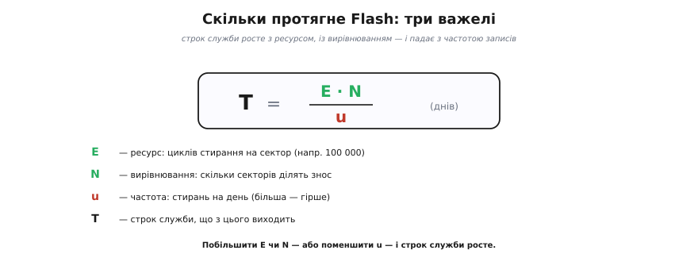
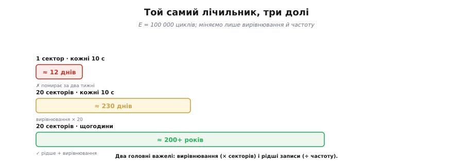

# 🧮 Арифметика ресурсу: цикли стирання × вирівнювання = роки служби

> Математична вставка до теми [вирівнювання зносу](topic:programming/wear-leveling): порахуймо, **скільки саме** служить Flash — і коли ресурсу таки не вистачить.

## Означення

Кожен сектор Flash витримує скінченне число **стирань**, перш ніж зноситься, — це його **ресурс** (*endurance*), цикли «стерти-записати» (P/E cycles). Позначимо його **E**. Типове E для NOR-Flash, де лежить код, — близько 100 000.

[Вирівнювання зносу](topic:programming/wear-leveling) розкладає записи по **N** секторах, тож кожен зношується повільніше. А темп записів задамо як **u** — скільки **стирань** на день спричиняє ваш пристрій.

## Інтуїція

Думайте про сектор як про блокнот, з якого можна стерти й переписати сторінку лише E разів. Якщо ви стираєте **один** блокнот u разів на день, він скінчиться за E/u днів. Вирівнювання дає вам **N** блокнотів і пише в них по черзі — отже, життя розтягується **в N разів**. А пишете рідше (менше u) — служить довше прямо пропорційно.

Уся модель навмисне **песимістична**, і це її чеснота. Ми беремо E як гарантований мінімум із даташита (хоча більшість комірок живе довше), припускаємо ідеально рівний розподіл по N секторах і не зараховуємо запас зайвих секторів, що його тримають контролери. Тому реальний пристрій майже завжди переживе розрахункове T — а от не дотягнути до нього важко. Саме так і треба читати ці формули: не як точне пророцтво до дня, а як **нижню оцінку**, на яку безпечно закладатися в проєкті. Якщо вже й песимістична оцінка дає десятиліття — спіть спокійно; якщо вона дає місяці — це твердий сигнал тривоги, а не «можливо, пронесе».

## Формальний апарат

```
Один сектор (наївно):
T₁ = E / u                        днів

З вирівнюванням по N секторах:
T  = E · N / u                    днів
```

Три важелі: ресурс **E**, число секторів **N** (вирівнювання) і частота **u**. Строк **T** росте з E і N та падає з u.


*Строк служби T = E·N / u тримається на трьох важелях: ресурс E (циклів на сектор), вирівнювання N (скільки секторів ділять знос) і частота u (стирань на день). Більші E чи N — або менша u — і строк росте.*

Порахуймо на живому прикладі — лічильнику, що оновлюється. Нехай E = 100 000.

```
Лічильник щодесять секунд, наївно в один сектор:
u  = 86400 / 10             = 8640 стирань/день
T₁ = E / u = 100000 / 8640  ≈ 12 днів           ← помирає за два тижні!

Те саме, але з вирівнюванням по 20 секторах:
T  = E · N / u = 100000 · 20 / 8640 ≈ 231 день

Те саме, але раз на годину (рідше):
u  = 24 стирання/день
T  = 100000 · 20 / 24 ≈ 83000 днів ≈ 228 років  ← з головою
```


*Один лічильник (E = 100 000), три долі. Наївно в один сектор щодесять секунд — близько 12 днів. Вирівнювання по 20 секторах — близько 230 днів (× N). Раз на годину з вирівнюванням — сотні років. Два важелі: вирівнювання й рідші записи.*

Два висновки кричущі. По-перше, **вирівнювання** саме по собі множить життя на N (тут — у 20 разів). По-друге, **рідші записи** б'ють іще сильніше: переходом із «щодесять секунд» на «щогодини» ми додали множник 360. Найдешевший спосіб подовжити життя Flash — просто **писати рідше**.

Варто відчути й несиметрію цих важелів. Вирівнювання — це разове проєктне рішення: узяли N секторів, дістали множник N, і більше нічого з ним не зробиш, стелю задано наперед розміром розділу. А частота — важіль, який ви тримаєте в руках **на кожному рядку коду**: кожне зайве оновлення, якого можна було уникнути, прямо ділить строк служби. Тому між «додати ще секторів» і «писати вдвічі рідше» друге майже завжди дешевше й дієвіше: воно не коштує ані байта Flash, лише трохи акуратності.

Розгляньмо другий типовий випадок — **налаштування, які пишуть при кожній зміні**. Хай користувач у меню совгає повзунки, і прошивка наївно зберігає весь конфіг після кожного руху; за день активного налаштування набіжить, скажімо, 500 збережень. Без вирівнювання, в один сектор:

```
T₁ = E / u = 100000 / 500 = 200 днів        ← менше року на самому лише меню
```

Двісті днів — і пристрій, який начебто «майже нічого не пише», втрачає налаштування. Лікуються тут обидва важелі разом: відкласти запис (зберігати не на кожен рух, а раз по кількох секундах тиші — і u падає на порядок) плюс вирівнювання від менеджера (× N). Цифри з «менше року» вистрибують у десятиліття — і знову помітно, що **зменшення u** дешевше за все інше.

## Тонкість: один запис ≠ одне стирання

У нашому u ми наївно прирівняли «оновлення» до «стирання». Насправді розумні сховища ([NVS](topic:programming/nvs), [кільцевий лог](topic:programming/why-persist)) **дописують** багато записів, перш ніж стерти сектор, — пакуючи, скажімо, k записів на одне стирання. Тоді справжнє u менше в k разів:

```
u = (оновлень на день) / k
```

Цей **k** легко прикинути з геометрії: якщо сектор завбільшки S байтів, а один запис займає r байтів, то в сектор уміщається близько k = S / r записів, перш ніж його доведеться стерти й почати наново. Наприклад, сектор 4096 байтів і компактний запис на 32 байти дають k ≈ 128 — отже, **одне** стирання припадає аж на 128 оновлень. Підставмо це в той самий лічильник, що тикав щодесять секунд:

```
Лічильник щодесять секунд, але NVS пакує k = 128 записів на стирання:
оновлень/день = 86400 / 10        = 8640
u = 8640 / 128                    ≈ 67.5 стирань/день      ← замість 8640!
T = E · N / u = 100000 · 20 / 67.5 ≈ 29630 днів ≈ 81 рік
```

Той самий потік оновлень, що «наївно» вбивав сектор за 12 днів, із вирівнюванням (N) **і** пакуванням (k) розтягується на десятиліття. Тому повна формула строку — це

```
T = E · N · k / (оновлень на день)        днів
```

— три множники в чисельнику (ресурс, сектори, пакування) проти одного темпу оновлень у знаменнику. NVS «розмазує» знос одразу **двома** осями: по секторах (N) і в часі (k); саме тому реальні числа з готовим менеджером майже завжди оптимістичніші за наївний розрахунок «оновлення = стирання».

## Коли вирівнювання не рятує: поріг

Корисніше, ніж рахувати T для кожного випадку, — знайти **межу**, за якою жодне вирівнювання вже не допоможе. Хай ви хочете, щоб пристрій прожив щонайменше T_ціль днів. Підставивши це в формулу й розв'язавши відносно темпу оновлень, дістаємо гранично допустиму частоту:

```
оновлень_на_день ≤ E · N · k / T_ціль
```

Візьмімо реальні числа: E = 100 000, N = 64 сектори, k = 100 записів на стирання, а прожити пристрій має 10 років (T_ціль ≈ 3650 днів):

```
оновлень_на_день ≤ 100000 · 64 · 100 / 3650 ≈ 175 000 / день
                 ≈ 2 оновлення/секунду (стало, усі 10 років)
```

Результат витвережує: навіть із вирівнюванням на 64 сектори й пакуванням 128-у-1 безпечна стеля — лише **близько двох записів на секунду** в середньому за весь строк. Поки ви оновлюєте значення рідше — Flash переживе пристрій, і перейматися нема чим. А щойно темп її пробиває (швидкий лічильник обертів, що тикає десятки тисяч разів на секунду; сирий потік телеметрії, що ллється у Flash без буфера) — навіть найкраще вирівнювання лише відсуває смерть на пару тижнів. Це і є кількісний критерій рішення: **порахуйте праву частину для свого чипа — і якщо ваш темп оновлень її перевищує, Flash вам не підходить у принципі, треба [FRAM](root:embedded/eeprom-fram) або RAM-буфер.**

## Тонкість: ресурс — не єдиний годинник

Формула рахує лише знос від стирань. Та комірку «вбиває» й другий, незалежний годинник — **утримання** (*retention*): навіть незношений Flash гарантує збереження даних типово «10 років при 25 °C», і кожні +10 °C приблизно **вдвічі** скорочують цей строк. Тож якщо ваш T із формули вийшов у сотні років, реальну стелю ставить уже не endurance, а retention з температурою: дані просто «вицвітуть» раніше, ніж скінчиться ресурс стирань. Практичний висновок: щойно розрахунок дає десятиліття — далі дивіться не на цикли, а на температуру й строк зберігання.

## Де це працює

Ця арифметика — кількісний бік [вирівнювання зносу](topic:programming/wear-leveling). Вона підказує, **коли вирівнювання рятує, а коли ні**: якщо після множення на N і k строк усе одно мізерний (як «12 днів» вище), жодна бібліотека не зарадить — треба або писати рідше, або взяти [**FRAM**](root:embedded/eeprom-fram), де E астрономічне. А ще вона стоїть за порадою [«не commit'ити щосекунди»](topic:programming/nvs): тепер ви бачите її в числах, а не на віру.
