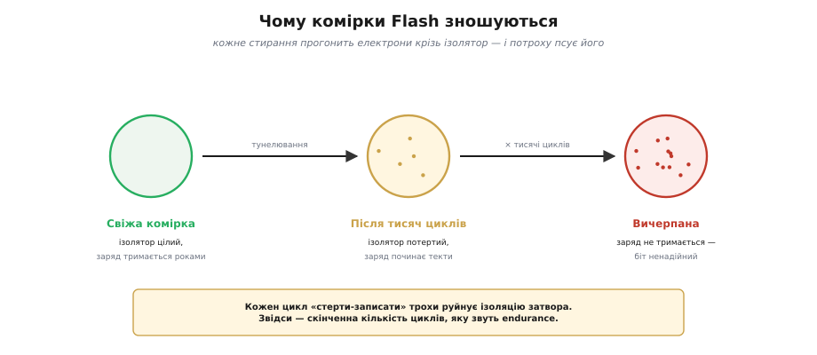
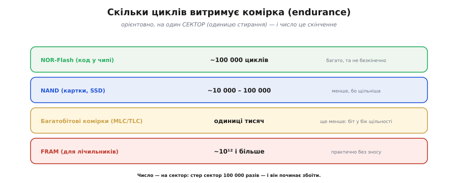
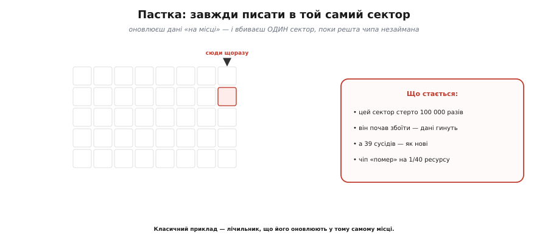
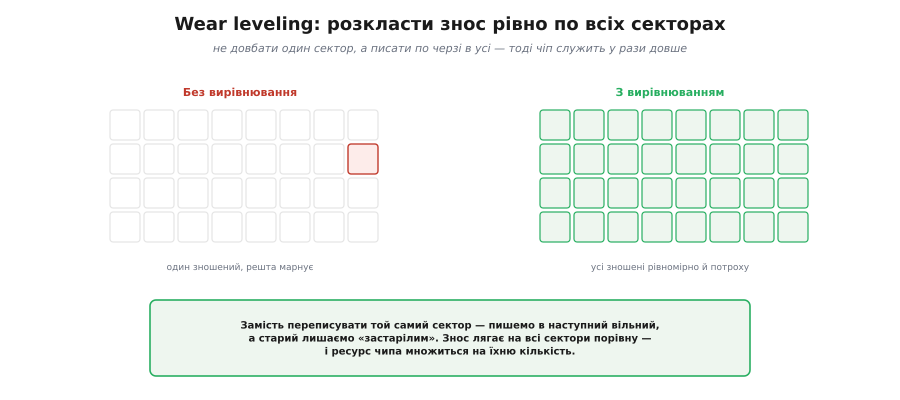
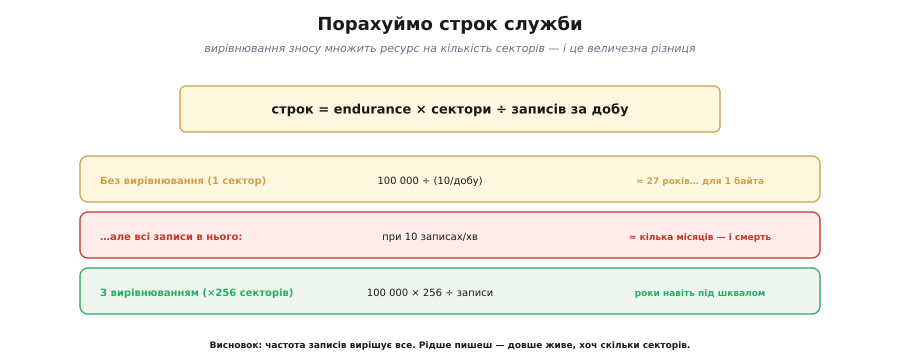
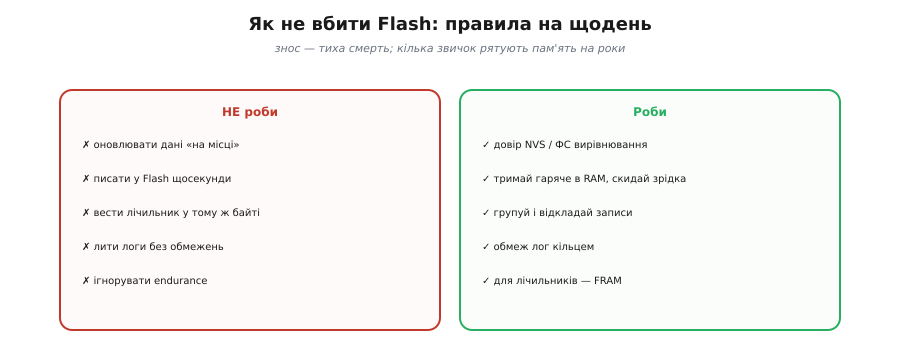

# Зношування комірок і wear leveling

Кожне стирання потроху **виснажує** Flash. Це не дрібна примітка, а одна з найважливіших властивостей цієї пам'яті — і та, що найчастіше вбиває пристрої в полі, причому **тихо** й непомітно. Тому розберімося як слід: чому Flash зношується, наскільки його вистачає, як його найлегше вбити необережністю — і як розумні сховища розтягують його ресурс на роки.

Тримайте при цьому в голові головну відмінність від звичної пам'яті. RAM байдуже, скільки разів у неї писати, — вона переживе мільярди перезаписів і не зморгне. Flash же — пам'ять із **обмеженим числом життів**: у кожної комірки їх лічена кількість, і витративши всі, вона вмирає. Через те звичка «пишу куди хочу й скільки хочу», цілком безпечна для RAM, для Flash стає **згубною**. Уся ця тема, по суті, про те, як перенести звички з безмежної RAM у скінченний світ Flash, нічого там не спаливши.

### Чому Flash зношується

Корінь зносу — у самій [фізиці комірки Flash](topic:programming/flash-internals): біт тут — це **заряд**, замкнений у плаваючому затворі за стіною ізолятора. Щоб **записати** чи **стерти** комірку, цей заряд треба заштовхати всередину або витягти назовні — а зробити це можна, лише **продерши** електрони **крізь** саму ізоляцію (фізики звуть це тунелюванням). І щоразу, проходячи крізь ізолятор, електрони лишають у ньому мікроскопічні пошкодження. Один прохід — дрібниця; але цикли «стерти-записати» множаться, пошкодження накопичуються, і поступово ізоляція перестає тримати заряд надійно: він починає **витікати**, або, навпаки, не заштовхується як слід. Комірка ще жива, та її біт стає **ненадійним** — то нуль, то одиниця, як пощастить.

Фізично шкода буває двоякою: частина зарядів **застрягає** в самій ізоляції, де їм не місце, а частина ламає її структуру, утворюючи «**пастки**», крізь які заряд легше тікає. Перше зміщує поріг, за яким комірку читають як нуль чи одиницю; друге пришвидшує витік. Обидва ефекти з кожним циклом наростають, аж поки межа між «нуль» і «одиниця» розмивається настільки, що комірці більше не можна вірити. Це не раптова поломка, а **поступове старіння**: спершу комірка лише гірше тримає дані з часом, а вже потім зовсім відмовляє.


*Кожен цикл «стерти-записати» прогонить електрони крізь ізоляцію плаваючого затвора, трохи її псуючи. Свіжа комірка тримає заряд роками; після тисяч циклів ізоляція потерта й заряд починає текти; вичерпана — біт уже ненадійний. Звідси й скінченне число циклів, яке звуть endurance.*

Ключове слово тут — **endurance** (англ. *endurance* — витривалість, від лат. *indurare* — гартувати): скільки циклів стирання комірка витримає, перш ніж стане ненадійною. На відміну від звичайної RAM, яку можна переписувати **безкінечно**, Flash має цей ресурс **скінченним**. І це принципово міняє те, як із ним треба поводитися: кожне стирання — не безкоштовне, а **витрата** з обмеженого рахунку.

### Скільки циклів: число endurance

Наскільки ж обмеженого? Тут добра новина: для більшості задач ресурсу **багато**. Типовий **NOR**-Flash, що тримає код у чипах, витримує близько **100 000** циклів стирання — на кожен сектор. **NAND** (картки, SSD) витриваліший на біт по-різному, часто менше; а **багатобітові** комірки (де в одну фізичну комірку пакують два-три біти заради щільності) платять за щільність саме ресурсом — їх вистачає лише на одиниці тисяч циклів. На іншому полюсі стоїть **FRAM** — інша пам'ять, що практично **не зношується** (трильйони циклів), і саме тому її беруть там, де треба писати дуже часто.

Цей компроміс «щільність проти ресурсу» варто розкрити, бо він всюди. У найпростішій комірці зберігають **один** біт (SLC, англ. *single-level cell* — одно­рівнева комірка): лише два рівні заряду, «є» і «нема», їх легко розрізнити, тож і циклів вона витримує найбільше. Щоб подвоїти ємність, у ту саму комірку пакують **два** біти (MLC, *multi-level* — багаторівнева) — уже чотири рівні заряду, ближчі один до одного, а отже чутливіші до найменшого зносу; ресурс падає. Три біти (TLC, *triple-level*) і чотири (QLC, *quad-level*) ідуть іще далі цим шляхом: щораз більше ємності за щораз менший ресурс. Тому дешеві об'ємні SSD внутрішньо тримають **запас** зайвих секторів і агресивно вирівнюють знос — інакше їхні куці кілька тисяч циклів вичерпалися б надто швидко.

Поряд із числом циклів варто знати й про сусідній бік старіння — **утримання** (англ. *retention*, від лат. *retinere* — утримувати): як довго комірка тримає заряд **без** перезапису. Свіжий Flash береже дані багато років; але **зношена** комірка тримає їх гірше й коротше, бо ізоляція вже дірява. Тобто знос б'є двічі: спершу комірці важче переписуватись, а потім вона ще й гірше зберігає вже записане. Для більшості пристроїв це не клопіт — роки утримання з запасом; але для тих, що десятиліттями лежать без живлення, це окреме питання.

Ще одна втішна тонкість: число endurance у даташиті — це **гарантований мінімум**, а не межа. Виробник обіцяє, що **будь-яка** комірка витримає принаймні стільки; на практиці більшість живе помітно довше, а збоїти першими починають лише найслабші. Тому «100 000» — це радше «не менше ста тисяч», ніж «рівно сто тисяч»; запас зазвичай є. Але закладатися на нього не варто: проєктують завжди на **гарантоване** число, а несподіваний надлишок приймають як подарунок, а не як план.


*Орієнтовний ресурс у циклах стирання, на один сектор. NOR (код у чипі) близько 100 000; NAND менше; багатобітові комірки ще менше (платять ресурсом за щільність); FRAM — практично без зносу. Число скінченне: стер сектор стільки разів — і він починає збоїти.*

Тут критично зрозуміти **одиницю**: ресурс рахують **на сектор** — на ту найменшу ділянку, яку [Flash уміє стирати лише цілком](topic:programming/flash-internals). Сто тисяч циклів — це сто тисяч **стирань того самого сектора**. І саме тут ховається пастка, через яку гинуть навіть пристрої з нібито «вічного» NOR.

### Пастка: гаряча точка

Уявімо найприродніший, найневинніший код: лічильник напрацювання, який ми оновлюємо у Flash, **зберігаючи його щоразу в тому самому місці**. Логічно ж — є поле «лічильник», у нього й пишемо нове значення. Але [«змінити» у Flash означає «стерти сектор і переписати»](topic:programming/flash-internals): стерти можна лише цілий сектор, не окремий байт. Отже, кожне оновлення лічильника **стирає той самий сектор**. Десять оновлень на хвилину — і за кілька місяців той єдиний сектор вичерпає свої 100 000 циклів і почне збоїти — а разом із ним загинуть і дані лічильника.


*Оновлюючи дані «на місці», ви довбаєте один сектор. Він вичерпує ресурс і починає збоїти, поки решта чипа — як нова. Чіп «помирає» на крихітній частці справжнього ресурсу. Класичний винуватець — лічильник, що його оновлюють у тому самому байті.*

Найгірше тут — **марнотратство**: ви вбили чіп, використавши лише **дрібну частку** його сукупного ресурсу. Решта сорока секторів так і лишилися незайманими, по нулю циклів кожен, поки один-єдиний горів за всіх. Це як зносити одну сходинку до дірки, ходячи лише по ній, тоді як уся решта сходів — нові. І найпідступніше — що проявляється це не одразу: пристрій місяцями працює бездоганно, а тоді раптом починає «забувати» чи глючити, і причину — затертий до смерті сектор — знайти геть непросто.

Лічильник — лише найочевидніший винуватець; та сама пастка ховається й під іншими невинними звичками. Зберігати конфігурацію **при кожній найдрібнішій зміні** (посунув повзунок — записав) — і ось уже сектор налаштувань горить. Вести «лог», **перезаписуючи** той самий запис останньої події. Складати у Flash проміжний стан машини щокроку. Усе це — той самий гріх «довбати одне місце», лише в різних масках. Спільна ознака проста: якщо якесь дане **часто змінюється**, а ви пишете його у Flash **щоразу**, — ви на прямій дорозі до гарячої точки.

### Wear leveling: розкласти знос рівно

Рішення напрошується саме собою: не довбати один сектор, а **розподіляти** записи рівномірно по **всіх** секторах. Цей прийом і зветься **вирівнюванням зносу** (англ. *wear leveling* — буквально «робити знос рівним», від *wear* — знос і *level* — рівень). Замість того щоб переписувати лічильник у тому самому місці, система пише його нове значення в **наступний вільний** сектор, а старий лишає позначеним «застарілий» — той самий хід [«дописуй, а не переписуй»](topic:programming/flash-internals), що оминає дороге стирання. Наступне оновлення йде в ще наступний сектор — і так по колу. У підсумку **кожен** сектор стирається приблизно **однакову** кількість разів, і жоден не вичерпується раніше за інших.


*Замість переписувати той самий сектор — пишемо в наступний вільний, а старий лишаємо «застарілим». Знос лягає на всі сектори порівну, і строк служби множиться на їхню кількість.*

Виграш від цього **величезний**: якщо знос розкладено на, скажімо, 256 секторів порівну, то весь чіп витримає в **256 разів** більше записів, ніж витримав би один сектор. Розрізняють два ґатунки вирівнювання: **динамічне** (рівняє лише ті сектори, що активно перезаписуються) і **статичне** (час від часу пересуває й давні, незмінні дані, щоб звільнити «недознесені» сектори під ротацію). Для нас деталі не такі важливі, як головна думка: **рівномірність множить ресурс**.

А як менеджер устигає за цією ротацією, не плутаючись, де що лежить? За допомогою **відображення**. Ви звертаєтесь до даних за **логічним** іменем («лічильник», «конфіг»), а менеджер тримає окрему табличку, що каже, у якому **фізичному** секторі лежить остання, дійсна версія. Перемістив дані в інший сектор задля рівномірності — оновив табличку; для вас же ім'я лишилося тим самим. Цей шар-перекладач між «логічним, що бачите ви» і «фізичним, де воно насправді лежить» — серце і wear leveling, і файлових систем на Flash; саме він дозволяє їм **сховати** від вас усю ротацію секторів, лишивши просте `set("ключ", значення)`.

Щоб побачити цей хід зблизька, напишімо найдрібніший вирівнювач власноруч — на одному лічильнику. Уся хитрість в одному рядку: куди писати наступне значення.

**Маємо кільце з N секторів і лічильник, що часто зростає. Замість стирати той самий сектор — записуємо нове значення в наступний по колу, а свіжість позначаємо номером покоління (seq), що лише росте.** Кожен запис у вільну, уже стерту комірку коштує лише саме стирання раз на повний оберт кільця, а знос лягає на всі N секторів порівну:

:::tabs
```c
// Кільце з N секторів; у кожному — один запис {seq, value, crc}.
// «Жива» комірка та, у якої найбільший seq; писати треба в наступну за нею.
#define N_SECT     64u            // скільки секторів ділять знос
#define SECT_SIZE  4096u          // розмір сектора Flash, байтів
#define MAGIC      0xC0FFEEu

typedef struct {                  // один слот = одна фізична комірка
    uint32_t magic;               // позначка «тут є валідний запис»
    uint32_t seq;                 // номер покоління: що більший — то свіжіший
    uint32_t value;               // власне корисні дані (наш лічильник)
    uint32_t crc;                 // контроль цілості запису
} record_t;

static uint32_t g_seq;            // seq останнього запису
static uint32_t g_slot;          // індекс сектора з останнім записом

// Знайти найсвіжіший запис серед усіх секторів (виклик раз, на старті).
static bool counter_mount(uint32_t base_addr, uint32_t *out_value) {
    uint32_t best_seq = 0; bool found = false;
    for (uint32_t i = 0; i < N_SECT; i++) {
        record_t r;
        flash_read(base_addr + i * SECT_SIZE, &r, sizeof r);
        if (r.magic != MAGIC) continue;            // порожній/стертий сектор
        if (crc32(&r, sizeof r - 4) != r.crc) continue;  // битий запис — пропустити
        if (!found || r.seq > best_seq) {          // запам'ятати найсвіжіший
            best_seq = r.seq; g_slot = i; *out_value = r.value; found = true;
        }
    }
    g_seq = found ? best_seq : 0;
    if (!found) *out_value = 0;
    return found;
}

// Записати нове значення — у НАСТУПНИЙ сектор по колу (ось і все вирівнювання).
static void counter_save(uint32_t base_addr, uint32_t value) {
    uint32_t next = (g_slot + 1u) % N_SECT;        // ротація: наступний сектор
    uint32_t addr = base_addr + next * SECT_SIZE;
    flash_erase_sector(addr);                      // одне стирання раз на оберт
    record_t r = { MAGIC, g_seq + 1u, value, 0 };  // новий seq — на одиницю більший
    r.crc = crc32(&r, sizeof r - 4);
    flash_write(addr, &r, sizeof r);               // дописуємо у вільну комірку
    g_slot = next; g_seq += 1u;                    // тепер «жива» комірка — ця
}
```
```python
import struct

# Кільце з N секторів; у кожному — один запис {seq, value, crc}.
# «Жива» комірка та, у якої найбільший seq; писати треба в наступну за нею.
N_SECT    = 64          # скільки секторів ділять знос
SECT_SIZE = 4096        # розмір сектора Flash, байтів
MAGIC     = 0xC0FFEE

# один слот = одна фізична комірка: magic, seq, value, crc — чотири uint32 LE
_REC = struct.Struct("<4I")     # magic, seq, value, crc

# апаратура застабована ззовні: flash_read/flash_write/flash_erase_sector, crc32

class Counter:
    def __init__(self, base_addr):
        self.base = base_addr
        self.seq  = 0           # seq останнього запису
        self.slot = 0           # індекс сектора з останнім записом

    # Знайти найсвіжіший запис серед усіх секторів (виклик раз, на старті).
    def mount(self):
        best_seq = 0
        value = 0
        found = False
        for i in range(N_SECT):
            raw = flash_read(self.base + i * SECT_SIZE, _REC.size)
            magic, seq, val, crc = _REC.unpack(raw)
            if magic != MAGIC:                        # порожній/стертий сектор
                continue
            if crc32(raw[:-4]) != crc:                # битий запис — пропустити
                continue
            if not found or seq > best_seq:           # запам'ятати найсвіжіший
                best_seq, self.slot, value, found = seq, i, val, True
        self.seq = best_seq if found else 0
        return (found, value)

    # Записати нове значення — у НАСТУПНИЙ сектор по колу (ось і все вирівнювання).
    def save(self, value):
        nxt  = (self.slot + 1) % N_SECT               # ротація: наступний сектор
        addr = self.base + nxt * SECT_SIZE
        flash_erase_sector(addr)                      # одне стирання раз на оберт
        body = struct.pack("<3I", MAGIC, self.seq + 1, value)  # новий seq — на одиницю більший
        rec  = body + struct.pack("<I", crc32(body))
        flash_write(addr, rec)                        # дописуємо у вільну комірку
        self.slot, self.seq = nxt, self.seq + 1       # тепер «жива» комірка — ця
```
```go
package wearleveling

import "encoding/binary"

// Кільце з N секторів; у кожному — один запис {seq, value, crc}.
// «Жива» комірка та, у якої найбільший seq; писати треба в наступну за нею.
const (
	nSect    = 64   // скільки секторів ділять знос
	sectSize = 4096 // розмір сектора Flash, байтів
	magic    = 0xC0FFEE
	recSize  = 16 // один слот = magic, seq, value, crc — чотири uint32
)

// апаратура застабована ззовні: flashRead/flashWrite/flashEraseSector, crc32

type Counter struct {
	base uint32
	seq  uint32 // seq останнього запису
	slot uint32 // індекс сектора з останнім записом
}

// Знайти найсвіжіший запис серед усіх секторів (виклик раз, на старті).
func (c *Counter) Mount() (found bool, value uint32) {
	var bestSeq uint32
	for i := uint32(0); i < nSect; i++ {
		r := flashRead(c.base+i*sectSize, recSize)
		if binary.LittleEndian.Uint32(r[0:]) != magic { // порожній/стертий сектор
			continue
		}
		if crc32(r[:recSize-4]) != binary.LittleEndian.Uint32(r[12:]) { // битий запис — пропустити
			continue
		}
		if seq := binary.LittleEndian.Uint32(r[4:]); !found || seq > bestSeq { // запам'ятати найсвіжіший
			bestSeq, c.slot, value, found = seq, i, binary.LittleEndian.Uint32(r[8:]), true
		}
	}
	if found {
		c.seq = bestSeq
	} else {
		c.seq = 0
	}
	return found, value
}

// Записати нове значення — у НАСТУПНИЙ сектор по колу (ось і все вирівнювання).
func (c *Counter) Save(value uint32) {
	next := (c.slot + 1) % nSect     // ротація: наступний сектор
	addr := c.base + next*sectSize
	flashEraseSector(addr)           // одне стирання раз на оберт
	var r [recSize]byte
	binary.LittleEndian.PutUint32(r[0:], magic)
	binary.LittleEndian.PutUint32(r[4:], c.seq+1) // новий seq — на одиницю більший
	binary.LittleEndian.PutUint32(r[8:], value)
	binary.LittleEndian.PutUint32(r[12:], crc32(r[:recSize-4]))
	flashWrite(addr, r[:])           // дописуємо у вільну комірку
	c.slot, c.seq = next, c.seq+1    // тепер «жива» комірка — ця
}
```
:::

Уся різниця зі згубним «писати на місці» — в одному `% N_SECT`: індекс сектора щоразу зсувається на один, тож за повний прохід кільця кожен сектор отримує **рівно один** запис. Свіжість визначає не позиція, а `seq`, тож на старті `counter_mount` просто бере запис із найбільшим номером покоління, а биті комірки відсіює за `crc`. Це і є вся суть динамічного вирівнювання в мініатюрі — справжні NVS чи файлова система додають згори лише облік вільного місця та списання мертвих секторів.

> 🔧 **Навіщо це.** Той самий шаблон «кільце + seq + crc» лежить в основі кільцевого логу подій, лічильника перезавантажень і будь-якого значення, що оновлюється частіше за все інше. Зрозумівши його на цих сорока рядках, ви читатимете нутрощі NVS і LittleFS не як магію, а як знайому конструкцію — і знатимете, коли двох секторів замало, а коли власний вирівнювач узагалі зайвий і досить готового менеджера.

### Порахуймо строк служби

Зведімо це в просту арифметику, бо вона разюча. Строк служби в записах — це приблизно `endurance × кількість_секторів ÷ записів_за_добу`. Без вирівнювання, коли всі записи б'ють в один сектор, чисельник губить множник «сектори»: 100 000 циклів, поділені на десяток записів за хвилину, — і пристрій мертвий за **місяці**. А з вирівнюванням той самий потік записів розкладається на сотні секторів, чисельник зростає в сотні разів — і той самий пристрій живе **роками** навіть під шквалом записів.


*Строк = endurance × сектори ÷ записів за добу. Без вирівнювання всі записи б'ють в один сектор — і він гине за місяці. З вирівнюванням ресурс множиться на число секторів — роки навіть під шквалом. Головний висновок: частота записів вирішує все.*

> 🧮 **Порахувати точно.** Скільки саме років протягне ваш Flash під заданим темпом записів — від циклів стирання через вирівнювання до конкретних чисел — рахуємо у вставці [Арифметика ресурсу](topic:programming/wear-leveling/math-endurance.md).

Прикиньмо на конкретних числах. Хай endurance — 100 000 циклів, а ви пишете налаштування **раз на хвилину** (1440 разів на добу). Б'ючи в один сектор: 100 000 ÷ 1440 ≈ **69 діб** — і за два з лишком місяці сектор мертвий. Тепер увімкнімо вирівнювання на, скажімо, 64 сектори: ресурс множиться на 64, виходить 100 000 × 64 ÷ 1440 ≈ **12 років**. А якщо ще й писати не щохвилини, а раз на годину — додайте множник 60, і строк сягне століть, тобто практично «назавжди». Ті самі дані, той самий чіп — а різниця між «два місяці» і «назавжди» лише в двох рішеннях: вирівнювати знос і не писати марно.

З цієї формули видно й головний важіль, на який ви впливаєте найбільше: **частота записів**. Хоч скільки секторів і яке вирівнювання — якщо ви пишете надто часто, ресурс однаково розтане. Тому найдієвіше — не стільки покладатися на вирівнювання, скільки **писати рідше**.

### Практика: як не вбити Flash

Зведімо все в звички на щодень. Чого **не** робити: оновлювати дані «на місці» в тому самому секторі; писати у Flash щосекунди чи в гарячому циклі; вести швидкий лічильник, перезаписуючи той самий байт; лити логи без жодного обмеження; узагалі забувати, що в Flash скінченний ресурс. Що **робити** натомість: довірити вирівнювання зносу **менеджерові** (NVS чи файловій системі — вони роблять його за вас); тримати гаряче, мінливе значення в **RAM**, а у Flash скидати **зрідка** (раз на годину, перед сном); **групувати** й **відкладати** записи; обмежувати [лог **кільцем** фіксованого розміру](topic:programming/why-persist); а для справді інтенсивних лічильників, що оновлюються десятки разів на секунду, де навіть вирівнювання не врятує, брати пам'ять без зносу — [**FRAM**](root:embedded/eeprom-fram).


*Чого не робити: оновлювати на місці, писати щосекунди, вести лічильник у тому ж байті, лити логи без меж. Що робити натомість: довірити вирівнювання NVS чи файловій системі, тримати гаряче в RAM, групувати записи, обмежувати лог кільцем, а для справжніх лічильників брати FRAM.*

> 🔧 **Навіщо це.** Знос Flash — найпідступніший клас помилок, бо він **тихий і відкладений**: код, що оновлює налаштування в циклі, на столі працює бездоганно, проходить усі тести — і вбиває пам'ять лише за пів року в полі, коли пристрій уже в стіні замовника. Тому питання «скільки разів я тут пишу у Flash?» треба ставити собі **на етапі проєктування**, дивлячись на код тверезими очима, а не чекати, поки перші пристрої почнуть масово «дуріти». Гарна звичка — у думці множити частоту запису на час життя пристрою й порівнювати з endurance.

А як менеджер узагалі дізнається, що сектор почав збоїти? Найпростіше — **перевіряти запис**: записав — одразу прочитав і звірив; не збіглося — отже, сектор уже ненадійний, і його позначають «битим», більше туди не пишучи. Так сховище не лише розкладає знос, а й **відстежує** його, граційно списуючи мертві сектори, поки лишаються живі. Знати це вам не обов'язково — та приємно розуміти, що під простим `set("ключ", значення)` ховається ще й тиха турбота про здоров'я пам'яті.

Підсумок простий: Flash щедрий, але **не вічний**, і вбити його найлегше одноманітністю — довбаючи те саме місце. Розумні сховища рятують вас, розкладаючи знос; ваша ж частина угоди — **писати рідко й не в одне місце**. Це знання й відрізняє іграшку від продукту: зробити пристрій, що працює тиждень на столі, легко; зробити такий, що працює **десять років** у стіні замовника, — означає, серед іншого, поважати знос Flash на кожному записі. Інженери, що цього не знають, регулярно випускають вироби, які масово «вмирають» через рік-два однаковим чином, — і довго не розуміють чому. А ви тепер знаєте. Сам же простір Flash, на якому розгортається ця турбота про знос, ділять на іменовані ділянки під код, дані й налаштування — [**розділи**](topic:programming/partition-table).
