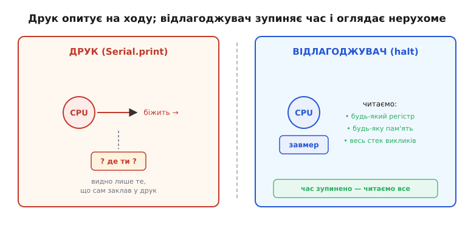
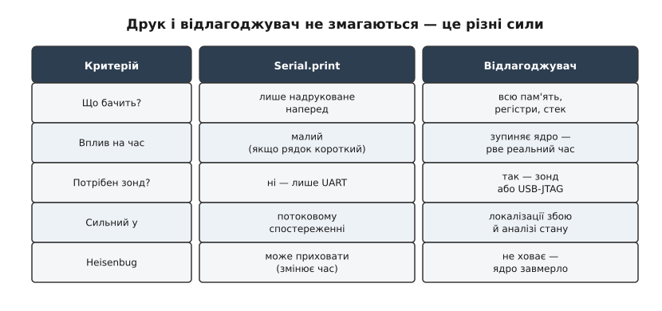

# Навіщо відлагоджувач

`Serial.print` — чудовий інструмент, і користуються ним щодня. Він простий, не потребує жодного обладнання, крім кабелю, і дає безперервний потік подій у реальному часі. Для більшості завдань — відстежити стан, простежити шлях виконання, перевірити значення на різних етапах — його цілком достатньо. Тож перш ніж говорити про межі, варто чесно віддати друку належне: більшість буденних помилок ловиться саме ним, і тягнутися по важче знаряддя щоразу немає сенсу.

Та в друку є одна вада, що випливає з самої його природи: він **змінює час**. Кожен виклик тягне за собою форматування рядка, заповнення буфера UART і — залежно від налаштувань — або очікування передачі, або обробку переривання. На ESP32 при 115200 бод один символ летить дротом за ~87 мкс; рядок із 40 символів — це понад 3 мс, поки порт його випхне. Для алгоритму, що відпрацьовує за 500 мкс, або для гонки між задачами з вікнами в кілька мікросекунд така затримка міняє все. Звідси добре знайома картина: помилка стабільно відтворюється без друку — і зникає, щойно додаєш рядок; або навпаки, живе лише доти, доки друк на місці. Цей клас помилок має власну назву — **heisenbug** (від прізвища фізика Вернера Гайзенберга: за принципом невизначеності саме спостереження збурює систему). Тому й друкувати всередині [обробника переривання](topic:programming/isr) небезпечно: ти не просто «дивишся» на нього збоку, а втручаєшся в його хід.

Є й глибша межа. Друк показує тільки те, що ти **заздалегідь вирішив** надрукувати. Рядки ти розставляєш там, де підозрюєш проблему, — а збій стається там, де ти її не чекав, де немає жодного `print`. Ця сліпа пляма — не лінь і не технічна вада, а вбудоване обмеження самого підходу: не можна надрукувати те, про що не здогадався. Щоб побачити несподіване, потрібен інструмент, який не вимагає вгадати наперед, куди дивитися.

## Зупинити час

Саме це й робить **відлагоджувач** (англ. *debugger*, від *debug* — «прибрати помилку»; саме слово *bug*, «жук», у сенсі дрібної технічної вади ходило серед інженерів ще з листів Едісона 1870-х, а закріпив його за обчислювальною технікою колектив Mark II у 1947-му разом із буквальним метеликом у реле). Його ключова дія — **halt**: ядро завмирає між двома машинними командами. Програма не рухається, таймери стоять, нових даних не надходить. У цьому стані можна прочитати будь-який регістр (PC, SP, LR і всі загальні), будь-яку комірку оперативної чи Flash-пам'яті, увесь стек викликів — і жоден рядок прошивки при цьому не виконується. Порівняння просте: друк — це розпитувати бігуна на ходу; відлагоджувач — натиснути «паузу» на цілому всесвіті й спокійно ходити поміж завмерлими.



*Друк опитує систему на ходу й чує лише те, що сам заклав у рядки; відлагоджувач зупиняє час і дає прочитати нерухоме повністю.*

З цього базового вміння — зупинити ядро будь-де — випливають сили, недоступні друку. Перша: завмерти в точно заданому місці коду — це [**точка зупину**](topic:programming/breakpoints-watchpoints) (англ. *breakpoint*, дослівно «точка розриву»). Ти кажеш «зупинись, коли виконання дійде до `process_packet`» — і ядро стає саме там, хоч би як далеко ця функція була від будь-якого друку. Друга: завмерти на **доступі до даних** — це [**точка спостереження**](topic:programming/breakpoints-watchpoints) (англ. *watchpoint*, «точка нагляду»). «Зупинись, коли хтось запише у `g_sensor_val`» — ядро стає і показує, який саме рядок це зробив. Це пряма відповідь на питання «хто псує мою змінну?», якого жодна кількість `Serial.print` не розв'яже, бо псує її якраз той рядок, де друку немає. Третя: **крок по одній команді** (англ. *single-step*, «один крок») — виконати рівно одну інструкцію й знову завмерти, звіряючи стан між кожними двома кроками.

До цих трьох додається четверта, посмертна. Якщо ядро впало в [обробник збою](topic:programming/hardfault), воно саме складає знімок свого стану на стек. Відлагоджувач або спеціальний обробник читає цей [знімок пам'яті](root:embedded/core-dump) і відновлює повну картину аварії — де саме стався збій і які були значення регістрів, навіть якщо пристрій уже не відповідає.

> 🔧 **Навіщо це.** У польовому пристрої без екрана й без UART відлагоджувач — єдиний спосіб побачити, що насправді в пам'яті о третій ночі. Друк туди просто не достукається: нікому показувати рядок і нема куди його слати — хіба що пустити сам вивід крізь зонд, [через відлагоджувач (semihosting)](topic:programming/semihosting), коли окремого порту немає.

## Коли друку досить, а коли треба зонд

Сили відлагоджувача недешеві: за них платять обладнанням і доступом до порту. Друку вистачає мідного кабелю UART; відлагоджувачу потрібен **зонд** — апаратний перехідник (J-Link, ST-Link, ESP-Prog або вбудований у новіші ESP32 USB-JTAG), що говорить з кристалом його службовою мовою по [JTAG/SWD](root:embedded/jtag-swd-tools). Поки збій сидить у логіці потоку — який стан, у якому порядку йдуть події, чи правильні значення на вході — друку зазвичай досить, і він навіть зручніший, бо дає історію в часі. А коли збій точковий і мовчазний — псується одна змінна невідомо ким, ловиться [HardFault](topic:programming/hardfault), або пристрій зависає без жодного сліду — тоді потрібні halt, точки зупину й спостереження, тобто зонд.



*Це не «краще/гірше», а поділ праці: друк сильний у потоковому спостереженні, відлагоджувач — у локалізації точкового збою й аналізі завмерлого стану.*

**Worked-приклад. Баг, який зникає від друку.**

Розгляньмо типовий heisenbug: спільна змінна між обробником переривання й головним циклом — без `volatile`.

```c
// Без volatile компілятор має право закешувати значення в регістрі
uint32_t g_counter = 0;

void IRAM_ATTR timer_isr(void *arg) {
    g_counter++;                     // переривання збільшує лічильник
}

void app_main(void) {
    esp_timer_start_periodic(timer, 100);  // переривання кожні 100 мкс

    while (1) {
        if (g_counter >= 1000) {
            do_something();
            g_counter = 0;
        }
        // Без друку компілятор кешує g_counter у регістрі —
        // цикл ніколи не бачить оновлень із переривання → завис
    }
}
```

Додаєш у цикл `Serial.printf("cnt=%lu\n", g_counter)` — і завис зникає. Чому? Виклик `printf` непрозорий для оптимізатора, тож компілятор змушений перечитати `g_counter` з пам'яті перед викликом — і гонка щезає. Прибираєш друк — повертається. Друк тут не лікує помилку, а маскує її: класичний heisenbug. Справжня причина — відсутність [`volatile`](topic:programming/volatile).

З відлагоджувачем картина інша. Ставиш точку зупину в `do_something()`, чекаєш — вона не спрацьовує ніколи. Тоді робиш halt вручну в довільну мить, читаєш регістри й бачиш: `g_counter` лежить у регістрі CPU на нулі від самого початку і з пам'яті не перечитується жодного разу. Компілятор «оптимізував» змінну в регістр — ось і вся розгадка, без жодного рядка друку.

```
без друку:   цикл читає КОПІЮ g_counter у регістрі → завжди 0 → завис
з друком:    printf змушує перечитати g_counter з пам'яті → гонка зникає (баг схований)
з halt:      info registers → g_counter у регістрі = 0, у пам'ять не пишеться → причину видно
```

Є тут і пастка вже самого відлагоджувача, і на ESP32 вона особливо відчутна: апаратних точок зупину **обмаль**. Xtensa-ядро ESP32 дає рівно **2 апаратні точки зупину й 2 точки спостереження** (програмних точок, що їх IDE вставляє підміною інструкції в RAM, — до 64, але у Flash вони не працюють). Тобто «постав watchpoint на кожне поле структури» не вийде — доводиться обирати, за чим саме стежиш. Це не теоретична дрібниця: коли треба зловити запис у дві різні змінні плюс ще точку зупину — ліміт уже вичерпано.

## Дві сили поруч

Відлагоджувач — не срібна куля. Є випадки, де друк таки кращий: системи жорсткого реального часу, де ядро не можна спиняти — двигун крутиться, радіо в ефірі, петля керування з жорстким часовим вікном. Halt розриває таймінги й може вибити систему зі стійкого стану, а інколи й пошкодити обладнання (зупинений ШІМ лишає силовий ключ у небезпечному положенні). У такому разі лишається або асинхронний друк, або апаратний трасувальник (ITM/ETM — він пише потік подій, не спиняючи ядро, але це вже за межами цього матеріалу). Тож обидва інструменти живуть поруч і доповнюють одне одного: друк веде хроніку живої системи, відлагоджувач розтинає завмерлу. Зрілий підхід — не обирати раз і назавжди, а тримати обидва напоготові й брати той, що пасує до конкретного збою.

> 🔧 **Навіщо це.** Знати межу економить години: коли бачиш мовчазний збій однієї змінної — не сій `Serial.print` наосліп, а став watchpoint і злови винний рядок з першого разу; коли ламається таймінг швидкої петлі — навпаки, не чіпай ядро halt'ом, а лий легкий асинхронний друк.
