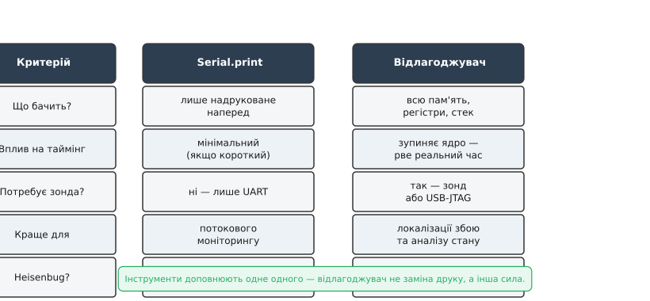

# Де друк безсилий: навіщо відлагоджувач, коли є Serial

Serial.print — чудовий інструмент, і ми користуємося ним щодня. Він простий, не потребує жодного обладнання крім кабелю і дає безперервний потік подій у реальному часі. Для більшості завдань — відстеження стану, трасування потоку виконання, перевірки значень на різних етапах — він бездоганний. Перш ніж говорити про обмеження, слід чесно віддати йому належне.

Але Serial.print має одне фундаментальне обмеження, що випливає з самої його природи: він **змінює час**. Кожен виклик `printf` тягне за собою форматування рядка, заповнення буфера UART і — залежно від налаштувань — або очікування передачі, або обробку переривання UART. На ESP32 при 115200 бод один символ передається за ~87 мкс; рядок із 40 символів — понад 3 мс. Для алгоритму, що виконується за 500 мкс, або для гонок між задачами з часовими вікнами у кілька мікросекунд — це катастрофічна зміна. Баг, що відтворюється без друку, зникає, щойно додаєш `Serial.print`, — і навпаки. Цей клас помилок отримав власну назву: **heisenbug**, від принципу невизначеності Гайзенберга. Саме тому друкувати всередині [обробника переривання](book:programming/isr) небезпечно: ти не просто «спостерігаєш» за ним, а втручаєшся в нього.

Є ще глибша проблема. Друк показує лише те, що ти **заздалегідь вирішив** надрукувати. Ти ставиш `Serial.print` у місцях, де підозрюєш проблему. Але збій стається там, де ти не підозрюєш, — там, де немає жодного друку. Ця сліпа пляма — не технічна вада і не лінь розробника, а структурне обмеження самого підходу. Не можна надрукувати те, про що не здогадався.

Відлагоджувач вирішує обидві проблеми одразу. Його ключова операція — **halt**: ядро завмирає між двома машинними командами. Програма не рухається, таймери зупинені, жодних нових даних не надходить. У цьому стані можна прочитати будь-який регістр (PC, SP, LR і всі загальні), будь-яку комірку оперативної чи Flash-пам'яті, весь стек викликів — і жодна частина коду прошивки при цьому не виконується. Порівняймо: друк — розпитувати бігуна на ходу; відлагоджувач — натиснути «пауза» на цілому всесвіті й ходити між завмерлими.


*Рис. Друк опитує живе на ходу; відлагоджувач зупиняє час і оглядає нерухоме.*

З цього базового принципу випливають три **суперсили**, недоступні для друку. Перша — зупинитись у точній точці коду: [брейкпоінт](book:programming/breakpoints-watchpoints). Ти кажеш «зупинись, коли виконання дійде до функції `process_packet`» — і ядро зупиняється там, незалежно від того, наскільки далеко ця функція від будь-якого друку. Друга сила — зупинитись на **доступі до даних**: [вотчпоінт](book:programming/breakpoints-watchpoints). «Зупинись, коли хтось запише у змінну `g_sensor_val`» — ядро зупиняється і показує, який саме рядок коду це зробив. Це пряма відповідь на запитання «хто псує мою змінну?», яке ніякою кількістю рядків `Serial.print` не розв'язати. Третя сила — крок по одній команді, що дає змогу спостерігати виконання покроково, перевіряючи стан між кожними двома інструкціями.

До цих трьох додається четверта: **посмертний знімок**. Якщо ядро впало в [обробник збою](book:programming/hardfault), воно саме зберігає знімок свого стану на стеку. Відлагоджувач або спеціальний обробник може прочитати цей [знімок пам'яті](book:programming/core-dump) і відновити повну картину — де саме стався збій, які були значення регістрів.

**Worked-приклад. Баг, який зникає від друку.**

Розглянемо типовий heisenbug: спільна змінна між ISR і головним циклом — без `volatile`.

```c
// Без volatile — компілятор кешує значення в регістрі
uint32_t g_counter = 0;

void IRAM_ATTR timer_isr(void *arg) {
    g_counter++;                     // ISR збільшує лічильник
}

void app_main(void) {
    esp_timer_start_periodic(timer, 100);  // ISR кожні 100 мкс

    while (1) {
        if (g_counter >= 1000) {
            do_something();
            g_counter = 0;
        }
        // Варіант A (без друку): компілятор може закешувати g_counter
        // у регістрі — цикл ніколи не бачить оновлень ISR → deadlock
    }
}
```

Додаєш `Serial.printf("cnt=%lu\n", g_counter)` у цикл — баг зникає. Чому? Друк змушує компілятор перечитати `g_counter` з пам'яті (функція `printf` непрозора для оптимізатора), і гонка зникає. Прибираєш друк — повертається. Саме для цього існує [`volatile`](book:programming/volatile).

З відлагоджувачем ситуація інша. Ти ставиш брейкпоінт у `do_something()`, чекаєш — брейк не спрацьовує ніколи. Тоді виконуєш `halt` вручну в довільний момент, `info registers` → бачиш, що `g_counter` у регістрі CPU стоїть на 0 від початку і жодного разу не читається з пам'яті. Компілятор «оптимізував» змінну з пам'яті до регістра. Причина — відсутність `volatile`. Жодного рядка друку не потрібно.

> 🔧 **Навіщо це:** у польовому пристрої без екрана й UART відлагоджувач — єдиний спосіб побачити, що насправді в пам'яті о третій ночі. Друк туди не достукається.

Але відлагоджувач — не срібна куля. Є ситуації, де друк кращий: системи реального часу, де ядро не можна зупиняти (двигун крутиться, радіо в ефірі, петля керування з жорстким часовим обмеженням). Halt розриває таймінги і може вивести систему зі стабільного стану. У такому разі — лише асинхронний друк або апаратний трасувальник (ITM/ETM, але це за межами курсу). Обидва інструменти існують поруч і доповнюють одне одного.



*Рис. Інструменти доповнюють одне одного — відлагоджувач не заміна друку, а інша сила.*

---
