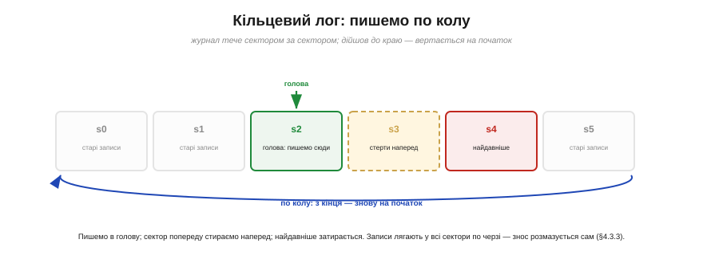
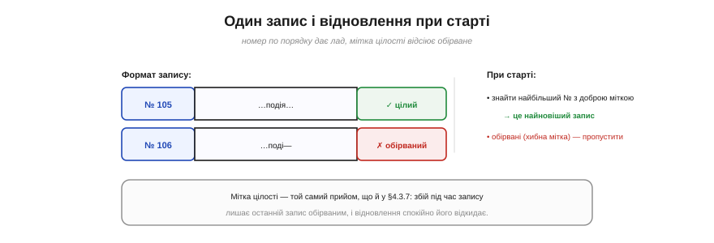

# ⚙️ Кільцевий лог у Flash: писати журнал, не вбиваючи сектори

> Алгоритмічна вставка про те, як вести [журнал на Flash](book:programming/why-persist), що росте й дописується, — не зносячи окремі сектори скінченної памʼяті.

## Задача

Журнал хоче двох несумісних, на перший погляд, речей. Він **росте безкінечно** — подія за подією, можливо, роками. А Flash, по-перше, **скінченний** (місця обмаль), по-друге, **зношується** від частих записів в одне місце (звідси й потреба [вирівнювати знос](book:programming/wear-leveling)). Якби ми просто дописували лог в один сектор, ми б і місце скоро вичерпали, і той сектор стерли б на смерть. Потрібен спосіб вести **нескінченний** журнал у **скінченному** Flash, рівномірно розмазуючи знос.

## Ідея

Відповідь елегантна — **кільце**. Виділимо під лог кілька секторів і думаймо про них не як про рядок із початком і кінцем, а як про **коло** (Рис. нижче). Нові записи дописуємо в «голову», посуваючи її вперед сектором за сектором. Дійшла голова до останнього сектора — **вертається на перший**, по колу. А щоб звільнити місце під нове, сектор **попереду** голови **стираємо наперед** — і цим затираємо **найдавніші** записи. Так журнал завжди тримає останні події, а старі тихо випадають.


*Рис. Сектори логу — це коло. Пишемо в голову; сектор попереду стираємо наперед, затираючи найдавніше; дійшли до краю — вертаємось на початок. Записи лягають у всі сектори по черзі, тож знос розмазується сам.*

Дві приємні речі стаються самі собою. По-перше, **місце обмежене**: лог ніколи не переповнить Flash, бо крутиться в межах виділеного кільця. По-друге — і це краса прийому — записи лягають **по черзі в усі сектори**, тож знос **розмазується сам**, без окремих зусиль: те саме [вирівнювання зносу](book:programming/wear-leveling), але вбудоване в саму будову логу.

Лишається питання: як при старті зрозуміти, де голова й у якому порядку йшли записи? Для цього кожному запису дають **наскрізний номер** (sequence number), що лише росте. Тоді найновіший запис — той, у кого **номер найбільший**, а порядок відновлюється за номером.


*Рис. Кожен запис несе наскрізний номер і мітку цілості. При старті відновлення знаходить найбільший номер із доброю міткою — це найновіший запис, — а обірвані (хибна мітка) пропускає. Мітка — той самий прийом, що й [перевірка цілості запису](book:programming/write-integrity).*

## Псевдокод

```
append(подія):
    якщо голова дійшла до межі сектора:
        стерти наступний сектор (звільнити найдавніше)
    записати { №=++лічильник, подія, мітка_цілості } у голову
    посунути голову вперед (з кінця — на початок: по колу)

при старті (відновлення):
    пробігти всі записи кільця
    відкинути обірвані (мітка цілості не сходиться)
    голова = одразу за записом із найбільшим №
    лічильник = найбільший №
```

Мітку цілості тут беремо з [прийому перевірки запису](book:programming/write-integrity): коротка позначка «запис завершено», щоб відсіяти той, що його обірвав збій живлення на півдорозі.

## Складність і пастки на МК

- **Швидкість.** Дописати — O(1): майже завжди це лише запис у голову. Дорога операція — **стирання сектора** — трапляється раз на цілий сектор записів, тож «розмазується» в часі, але дає періодичні **сплески затримки**. Якщо лог пишуть у чутливому до часу циклі, стирання наступного сектора варто робити **наперед**, у спокійну мить, а не тоді, коли він раптом знадобився.
- **Відновлення.** Простий спосіб знайти голову — **прочитати все** кільце при старті: O(n) за розміром логу. Для дрібного логу це дешево; для великого можна тримати окрему позначку голови.
- **Обірваний запис.** Збій під час дописування лишає останній запис недописаним — рятує мітка цілості: відновлення його просто пропускає. А оскільки стирали ми **найдавніше** (попереду голови), збій під час стирання губить лише старі, уже непотрібні дані.
- **Переповнення лічильника.** Номер росте вічно — беріть його **достатньо широким** (скажімо, 32 чи 64 біти), щоб за весь вік пристрою він не «обернувся» через нуль і не сплутав порядку.

Підсумок: кільцевий лог — це той випадок, коли одна проста ідея (писати по колу) одразу вирішує **три** проблеми — обмежує місце, розмазує знос і дає лад записам, — і саме тому він класичний для журналів на Flash.
