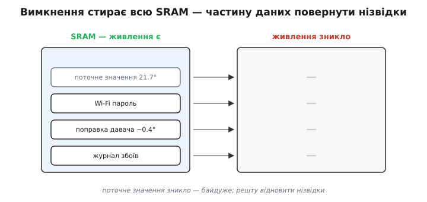
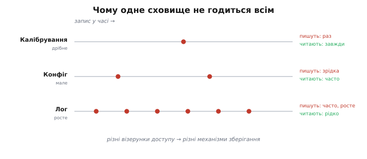
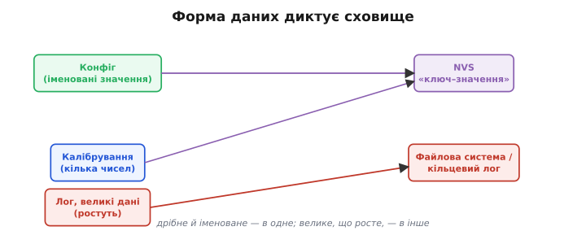
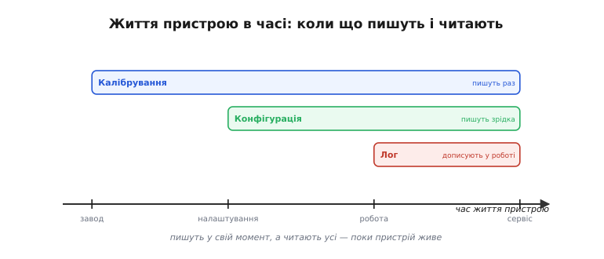
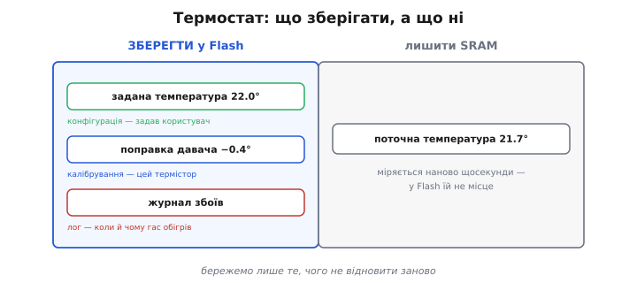

# Навіщо зберігати: конфігурація, калібрування, логи

Найпростіше питання про сховище пристрою — а **що** взагалі треба зберігати «надовго», і навіщо? Відповідь визначає все інше: який механізм брати, скільки місця виділяти, як часто писати. Почнімо з болю, який це все вирішує.

### Чому самої SRAM не досить

Робочі дані пристрою живуть у [**SRAM**](book:programming/mcu-blocks), а вона **енергозалежна** — зникло живлення, і весь її вміст миттю стерто. Для багато чого це байдуже: поточне показання давача, лічильник у циклі, проміжний результат — усе це пристрій порахує **наново** після ввімкнення, тож втрачати його не шкода. Але є дані **іншого ґатунку** — ті, що відновити нізвідки. Wi-Fi пароль, який ввів користувач; поправку, що робить давач точним; журнал того, що пішло не так. Якщо вони живуть лише в SRAM, то кожне вимкнення стирає їх **назавжди** — і пристрій щоразу прокидається безпорадним немовлям.


*Вимкнення стирає всю SRAM. Поточне значення зникає — і не шкода, бо його міряють наново. А от Wi-Fi пароль, поправку давача й журнал відновити нізвідки: зникли — то й по всьому. Частину даних втрачати не можна, але SRAM берегти їх не вміє.*

Варто на мить відчути всю абсурдність пристрою без постійного сховища. З самою лише SRAM він страждає на повну **амнезію**: кожне ввімкнення для нього — народження з чистого аркуша, без жодної пам'яті про те, ким він був мить тому. Хоч скільки його налаштовуй, хоч як ретельно калібруй — одне моргання живлення, і він знову нічого не знає. Жити з таким неможливо: реальному пристрою потрібна **тяглість**, ниточка пам'яті, що з'єднує його «вчора» і «сьогодні» крізь вимкнення. Цю ниточку й дає постійне сховище.

Корисно одразу прийняти просту картину: у будь-якому пристрої стан живе у **двох** місцях. Швидкий, **робочий** стан — у SRAM: він мінливий, його не шкода, він зникає при вимкненні й відроджується сам. А **тривкий** стан — у Flash: те, що визначає, ким пристрій лишається між запусками. Уся ця тема, по суті, про те, як провести межу між цими двома — що лишити мінливому, а що довірити тривкому. І більшість новачкових багів зі сховищем — це або забуте «зберегти потрібне», або зайве «зберегти непотрібне»; обидва — наслідок розмитої межі.

Звідси й потреба в **постійному сховищі** — місці, що переживає вимкнення. На чипі таке місце одне — **Flash**, тільки тепер не під код, а під ваші дані. Лишається зрозуміти, які саме дані туди класти. Їх зручно розділити на **три роди**, бо в кожного — своя природа й свої правила.


*Три роди даних, що мусять пережити вимкнення. **Конфігурація** — налаштування (пише користувач, зрідка). **Калібрування** — поправки саме цього екземпляра (пише раз). **Логи** — запис подій у часі (дописує часто). У кожного — своя ціна втрати.*

### Конфігурація: налаштування, що пам'ятає пристрій

Перший рід — **конфігурація** (від латин. *configurare* — «надати спільного обрису», *con-* «разом» + *figura* «обрис»): те, що користувач чи установник **налаштував**, і що має лишитися таким після перезавантаження. Wi-Fi мережа й пароль, ім'я пристрою, задана температура, обраний режим, мережеві адреси. Цей рід має характерний візерунок: його пишуть **зрідка** (коли користувач щось змінив), а читають **часто** (щостарту, а то й постійно). Втратити конфігурацію — означає змусити людину **переналаштовувати** все наново, що з боку користувача виглядає як поломка: «я ж усе налаштував, а воно забуло».

Конфігурації в реальному пристрої набирається чимало: окрім Wi-Fi — розклад роботи розумної розетки, пороги спрацювання давача, яскравість екрана, мова інтерфейсу, адреса сервера, куди слати дані, обрані одиниці вимірювання. Усе це людина задає **один раз** і слушно очікує, що пристрій це **запам'ятає** — назавжди, а не до першого відключення світла. Що складніший пристрій, то більше в нього таких налаштувань і то болючіше їх загубити.

> 🔧 **Навіщо це.** Будь-який пристрій, складніший за ліхтарик, має конфігурацію — і користувач очікує, що вона **запам'ятається**. Уявіть розетку, що забуває розклад при кожному блиманні світла, або термостат, який після відключення живлення скидає вашу комфортну температуру на заводську. Збереження конфігурації — не розкіш, а базова гідність пристрою.

### Калібрування: поправки саме цього екземпляра

Другий рід тонший — **калібрування** (від *calibre* — «внутрішній розмір ствола»; колись звіряли саме калібр, згодом — будь-який вимірювальний еталон). Жоден реальний давач не ідеальний: один термістор показує на пів градуса більше, інший — менше; АЦП у кожному чипі трішки зміщений (звідси [похибки АЦП](book:electronics/adc-errors), що різняться від екземпляра до екземпляра). Калібрування — це **поправки**, що роблять **саме цей екземпляр** точним: зсув, нахил, заводський підлаштунок. Їхній візерунок — найхарактерніший: пишуть їх **раз** (на заводі чи під час першого налаштування), а читають **постійно**, на кожному вимірі. Втратити калібрування — означає, що давач почне **брехати**: не зламається явно, а тихо даватиме криві числа, і це найпідступніший вид поломки.

Ключове тут — слово «**саме цього**». Конфігурація в усіх пристроях однієї моделі може бути різна, але задається людиною; а калібрування **унікальне для кожної фізичної одиниці** й відображає її крихітні апаратні відмінності. Тому його не можна ані зашити в код (він однаковий для всіх), ані відновити обчисленням — лише виміряти й **зберегти** для цього конкретного пристрою.

Найчастіша форма калібрування — два числа: **зсув** (offset) і **нахил** (slope), тобто «на скільки додати» й «на скільки помножити», щоб сире показання збіглося з правдою. Звідки беруться самі ці числа — окрема тема ([калібрування давача](book:electronics/calibration) за еталоном); а от звідки береться **потреба** в них, варто відчути вже тут. Дві однакові на вигляд плати, зійшовши з одного конвеєра, дадуть трохи різні покази: різнобій компонентів, температура паяння, мікроскопічні відмінності кремнію. Зашити одну спільну поправку в код **не можна** — для сусідньої плати вона буде хибною. Тому кожен екземпляр калібрують **окремо** й зберігають його власні числа в його власному Flash. Це і є причина, чому калібрування — не код і не спільне налаштування, а **персональні дані конкретної залізяки**.

### Логи: чорна скринька пристрою

Третій рід — **логи** (від англ. *log* — корабельний журнал; назва тягнеться від колоди-*log*, яку колись кидали за борт, щоб виміряти швидкість і занести в журнал): запис того, що **відбувалося** в часі. Помилки й збої, важливі виміри, історія [причин reset](book:programming/reset-causes), моменти ввімкнення. На відміну від перших двох, лог не «налаштування», а **літопис**: його не перезаписують, а **дописують**, і він **росте**. Читають його рідко — зазвичай тоді, коли щось пішло не так і треба зрозуміти, **що саме** передувало біді. Це **чорна скринька** пристрою: поки все гаразд, вона мовчки накопичує, а в годину розслідування стає безцінною.

Що саме варто заносити в лог? Передусім **рідкісне й важливе**: помилки, збої, [причини перезавантажень](book:programming/reset-causes), перемикання режимів, виходи значень за межі. У полі, де немає ні відлагоджувача, ні очей інженера, лог часто — **єдиний** свідок того, що сталося о третій ночі за тиждень до того, як пристрій принесли в сервіс. Авіаційна «чорна скринька» тут не просто метафора: так само, як вона переживає катастрофу, щоб розповісти про її причини, лог пристрою має пережити збій і донести передісторію. Тому його не лише пишуть, а й дбають, щоб він **уцілів** при аварії, — а це вже окреме інженерне завдання.

> 🔧 **Навіщо це.** Лог — інженерна звичка, що окупається саме тоді, коли все вже погано. Поки пристрій працює, ви про нього не згадуєте; але першого ж разу, коли він «загадково перезавантажується в полі», саме збережений лог відрізнить безпорадне «годинами гадаю» від упевненого «бачу: brownout щовечора о 20:00, коли вмикається сусідній насос». Кілька кілобайтів під лог — чи не найдешевша страховка в усьому пристрої.

> ⚙️ **Як вести лог, не вбиваючи Flash.** Журнал росте безкінечно, а Flash скінченний і зношується — як це поєднати? Класична відповідь — **кільцевий лог**: пишемо по колу, рівномірно розмазуючи знос. Алгоритм розбираємо у вставці [Кільцевий лог у Flash](book:programming/why-persist/proj-flash-ring-log.md).

### Чому їм потрібні різні сховища

І ось головне. Ці три роди не просто «різні дані» — у них **різні візерунки доступу**, і саме тому їх не можна звалити в одне сховище. Калібрування пишуть **раз**, читають **завжди**, і воно дрібне. Конфігурацію пишуть **зрідка**, читають **часто**, вона мала. А лог **дописують часто** й він **росте** без межі. Сховище, ідеальне для дрібного «запиши раз — читай завжди», геть не годиться для «дописуй щохвилини й рости», і навпаки.

Гляньмо на конкретну незручність. Спробуйте тримати лог у сховищі «ключ–значення»: кожен новий запис — новий ключ, їх тисячі, і структура, розрахована на десяток іменованих налаштувань, тріщить по швах. І навпаки: тримати єдине налаштування «задана температура» як рядок у файлі-журналі — це гарматою по горобцях, ще й шукати останнє значення доведеться, гортаючи всю історію. Кожен інструмент гострий під свою форму даних: дрібне й іменоване — в одне, велике й послідовне — в інше. Сплутати їх — значить весь час боротися зі сховищем замість того, щоб ним користуватися.


*Чому одне сховище не годиться всім. Калібрування: пишуть раз, читають постійно, дрібне. Конфіг: пишуть зрідка, читають часто, мале. Лог: дописують часто, ще й росте. Різні візерунки доступу → різні механізми зберігання.*

Саме з цієї різниці й виростає вибір механізму зберігання. Дрібні конфіг і калібрування — це по суті кілька **іменованих значень**, тож їм пасує сховище «**ключ–значення**» ([NVS](book:programming/nvs)): мале, швидке, надійне. А логи й великі дані, що ростуть, просяться у [**файлову систему**](book:programming/flash-filesystems) чи **кільцевий лог** — туди, де можна дописувати й гортати. Кожен механізм улаштований під свою форму даних.

Не лякайтеся, що механізмів кілька: це не ускладнення заради ускладнення, а та сама мудрість «кожному своє». NVS бере на себе нудну, але важливу роботу з дрібними налаштуваннями — атомарно, надійно, не змушуючи вас думати про сектори й стирання. Файлові системи дають звичні «файли» там, де даних багато. А під усім цим лежить той самий [Flash](book:programming/flash-internals) із його примхами, які ці механізми **ховають** від вас, поводячись із ним правильно за вас. Саме ці примхи й пояснюють, **чому** кожен механізм улаштований саме так.


*Форма даних диктує сховище. Дрібні конфіг і калібрування лягають у NVS («ключ–значення»); великі дані, що ростуть, — у файлову систему чи кільцевий лог.*

### Коли що пишуть і читають

Корисно глянути на ці три роди ще й **у часі** — за все життя пристрою. **Калібрування** записують найраніше — **на заводі** чи під час першого налаштування, коли вимірюють поправки саме для цієї одиниці. **Конфігурацію** — пізніше, коли пристрій уперше потрапляє до користувача й той його налаштовує. А **лог** дописується **впродовж усієї роботи**. Читають же їх усі — постійно, поки пристрій живе, аж до години **сервісу**, коли лог стає головним свідком. Ця часова картина теж підказує вимоги: те, що пишуть раз, можна зробити майже незмінним; те, що дописують щодня, мусить витримати тисячі записів (а тут уже постає [**знос** Flash](book:programming/wear-leveling)).

Має цей поділ і суто практичний наслідок для того, **хто** й **коли** записує дані. Калібрування зазвичай заносить **виробник** — на спеціальному стенді, де еталонним приладом міряють поправку для кожної одиниці; користувач його ніколи не бачить і не чіпає. Конфігурацію, навпаки, пише **користувач** — через інтерфейс налаштування, не знаючи й не бажаючи знати, що там у Flash. А лог веде **сама прошивка**, без жодної людини. Три роди даних — троє різних «авторів» у три різні моменти; і добре спроєктоване сховище це враховує, відводячи кожному своє місце.


*Кожен рід даних має свій момент запису: калібрування — на заводі, конфіг — при налаштуванні, лог — у роботі. А читають їх усі, поки пристрій живе. Звідси й різні вимоги до сховища.*

### Приклад: термостат

Зведімо все на простому пристрої — кімнатному **термостаті**. Що йому треба пам'ятати крізь вимкнення, а що ні?

```
ЗБЕРЕГТИ (переживає вимкнення):
  задана температура  22.0°   → конфігурація (її задав користувач)
  поправка давача    −0.4°    → калібрування (цей термістор так зміщений)
  журнал збоїв                 → лог (коли й чому вимикався обігрів)

НЕ зберігати (відновлюється саме):
  поточна температура 21.7°    → міряється наново щосекунди — у Flash їй не місце
```


*Термостат у Flash тримає задану температуру (конфіг), поправку давача (калібрування) і журнал збоїв (лог). А поточну температуру — ні: її щоразу міряють наново, тож класти її в постійне сховище нема сенсу. Правило просте: бережемо лише те, чого не відновити заново.*

У коді цей поділ виглядає прозоро. Усе тривке — а це лише конфіг і калібрування — складають в одну структуру, що при старті піднімається зі сховища; поточне ж значення живе в звичайній змінній і ніде не зберігається.

**Умова.** Термостат прокинувся після вимкнення. Калібрування каже, що цей термістор зміщений на −0.4° (зсув) із нахилом 1.0; сирий вимір дав 22.1°. Яку температуру термостат покаже й чи ввімкне обігрів за заданих 22.0°?

```c
// Тривкий стан: піднімається зі сховища при старті (конфіг + калібрування).
typedef struct {
    float set_point;   // конфіг: задана користувачем температура, °C
    float cal_offset;  // калібрування: зсув саме цього термістора, °C
    float cal_slope;   // калібрування: нахил (зазвичай близько 1.0)
} persist_t;

persist_t cfg;                 // живе так, ніби лежить у Flash
storage_load(&cfg);            // при старті — читаємо збережене

float raw  = read_thermistor();          // сирий вимір = 22.1 (у SRAM, не зберігаємо)
float temp = raw * cfg.cal_slope + cfg.cal_offset;   // застосовуємо калібрування
bool  heat = temp < cfg.set_point;       // рішення про обігрів
```

```
set_point  = 22.0    (конфіг, пережив вимкнення)
cal_offset = -0.4    (калібрування, пережило вимкнення)
cal_slope  =  1.0
raw        = 22.1    (виміряно наново — у Flash не лежить)

temp = raw * cal_slope + cal_offset
     = 22.1 * 1.0 + (-0.4)
     = 21.7°C
heat = (21.7 < 22.0) = true  → обігрів увімкнути
```

Висновок: усе, що пережило вимкнення (`set_point`, `cal_offset`, `cal_slope`), піднялося зі сховища одним рухом — і відразу дало правильне рішення. А `raw` свідомо **не** зберігали: його дав свіжий вимір. Якби калібрування пропало, термостат узяв би сирі 22.1°, вирішив «уже тепло» і **не** ввімкнув би обігрів — та сама тиха брехня давача, тільки в дії.

### Ціна забудькуватості

Щоб остаточно переконатися, навіщо все це, гляньмо, що буває **без** постійного сховища — по кожному роду окремо. Без **конфігурації** користувач переналаштовує пристрій після кожного відключення живлення: вводить Wi-Fi, виставляє розклад, обирає режим — щоразу; за кілька повторень це сприймається як справжня поломка, і пристрій летить у смітник. Без **калібрування** давач тихо бреше — не падає з помилкою, а просто дає криві числа, на які хтось покладається; це найдорожчий вид збою, бо його довго не помічають. Без **логів** будь-яка халепа в полі стає нерозв'язною загадкою: пристрій перезавантажився, а **чому** — невідомо, бо свідок зник разом із живленням. Усі три біди ріднить одне: вони **тихі**. Пристрій начебто працює — а насправді щоразу гублить те, що мав би пам'ятати.

### Висновок: бережи потрібне — і тільки його

Це правило — головний висновок теми, і воно економить і місце, і знос Flash: **зберігай те, чого не відновити, і нічого зайвого**. Поточні показання, проміжні розрахунки, тимчасові стани лиши SRAM — вони на те й тимчасові. А конфігурацію, калібрування й важливі події віддай постійному сховищу.

Тут є й зворотний бік, який легко проґавити: зберігати **зайве** — теж погано. Кожен запис у Flash повільніший за запис у RAM і потроху [**зношує** пам'ять](book:programming/wear-leveling). Тому тримати в постійному сховищі те, що й так відновлюється — поточну температуру, лічильник циклу, проміжний результат, — не лише марно, а й шкідливо: ви платите зносом і складністю ні за що. Гарне правило протилежне до жадібності: у Flash потрапляє **мінімум** потрібного, а не максимум можливого.

І ще: ці три роди — не вичерпний канон, а зручний орієнтир. Трапляються й проміжні випадки: лічильник напрацювання — щось середнє між конфігом і логом; знімок стану перед сном — окрема історія. Та хай би якими були ваші дані, перші питання до них ті самі: чи переживуть вони вимкнення **самі**? якщо ні — чи варто їх **берегти**? і **куди**, за їхньою формою, їх покласти? Відповіси чесно на ці три — і половину рішень про сховище вже ухвалено.

Питання «**що** і **навіщо** зберігати» — лише половина справи: рівнем нижче лежить сам [Flash](book:programming/flash-internals) із тим, **як** він улаштований зсередини та чому вимагає особливого поводження.
