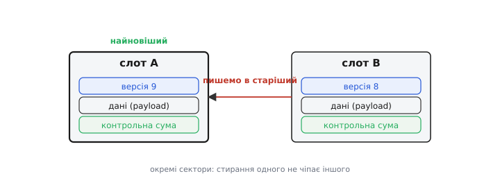
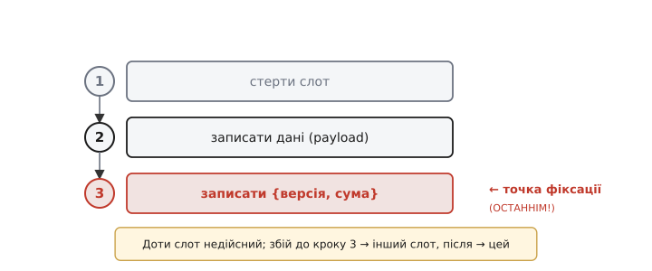

# ⚙️ Атомарне оновлення конфігурації: два слоти + лічильник версії + контрольна сума

> Повний рецепт відмовостійкого оновлення конфігу у Flash — крок за кроком, із наголосом на тонкощі **порядку** записів і робочим C.

## Задача

Маємо конфіг — невелику грудку даних (налаштування, калібрування), яку час від часу **оновлюють**. Треба, щоб збій живлення в будь-яку мить оновлення лишив нас або з **повністю старим**, або з **повністю новим** конфігом — але ніколи з напіврозбитим. NVS і LittleFS роблять це за вас; та коли ви пишете в «голий» Flash самотужки, рецепт треба знати.

## Ідея

Заводимо **два слоти** — A і B — в **окремих** секторах (щоб стирання одного не чіпало іншого). Кожен слот містить три речі: **версію** (число, що росте), **дані** (англ. *payload* — корисний вантаж, самі налаштування) й **контрольну суму**. Правило оновлення:

```
пиши завжди в той слот, що ЗАРАЗ старіший (не чинний),
а новій копії дай більший номер версії
```

Поки ми заповнюємо старіший слот, чинний (новіший) стоїть недоторканий — отже, є запас на випадок збою. А при старті беремо слот із **найбільшою версією серед тих, що проходять суму**.


*Пишемо завжди в старіший слот, давши новій копії більший номер; новіший стоїть цілим запасом. При старті беремо слот із найбільшою версією, що проходить суму, — тож добра копія є завжди.*

## Тонкість, що вирішує все: порядок запису

Уся надійність тримається на **одній** деталі — у якому порядку класти три частини слота. Підпис «версія + сума», що **робить слот дійсним**, треба писати **ОСТАННІМ**, уже після того, як дані повністю лягли:

```
1) стерти слот
2) записати дані (payload)
3) записати { версія, сума }   ← ОСТАННІМ: це точка фіксації
```

Чому саме так? Бо доти, доки крок 3 не зроблено, слот не має дійсного заголовка — і відновлення його просто не візьме. Збій **до** кроку 3 → слот «недійсний», беремо інший (старий, цілий). Збій **після** → слот цілий і найновіший, беремо його. Це **атомарний перемикач**: один останній запис вирішує все.


*Доти слот недійсний; збій до кроку 3 лишає чинним інший слот, після — цей. Один останній запис — точка фіксації.*

Якби ж ми писали навпаки — спершу версію, потім дані, — то збій між ними лишив би слот із «дійсною» версією, але **напіврозбитими** даними, і відновлення повірило б у сміття. Тому порядок тут не косметичний, а критичний.

## Робочий код

Стартова умова — два слоти у Flash. Структуру кладемо так, щоб **сума й версія йшли в окремому хвості-підписі**, який пишемо останнім; тоді «дописати підпис» — це один короткий запис у відоме місце.

**Зберегти конфіг: знайти старіший слот, записати дані, і ОСТАННІМ — підпис {версія, сума}.**

:::tabs
```c
#include <stdint.h>
#include <stddef.h>

#define SLOT_A_ADDR  0x9000     // окремий сектор під слот A
#define SLOT_B_ADDR  0xA000     // окремий сектор під слот B (інший сектор!)

typedef struct {                // підпис, що РОБИТЬ слот дійсним
    uint32_t version;           // лічильник; більший = новіший
    uint32_t crc;               // CRC від payload, рахується перед записом
} footer_t;                     // пишеться ОСТАННІМ, цілим коротким записом

// дані лежать на початку сектора, підпис — у його кінці
#define FOOTER_OFFSET  (SECTOR_SIZE - sizeof(footer_t))

// прочитати версію дійсного слота, або 0, якщо слот недійсний
static uint32_t slot_version(uint32_t base) {
    footer_t f;
    flash_read(base + FOOTER_OFFSET, &f, sizeof f);
    uint8_t payload[sizeof(config_t)];
    flash_read(base, payload, sizeof payload);
    return (crc32(payload, sizeof payload) == f.crc) ? f.version : 0;
}

void save_config(const config_t *cfg) {
    uint32_t va = slot_version(SLOT_A_ADDR);
    uint32_t vb = slot_version(SLOT_B_ADDR);

    // пишемо в СТАРІШИЙ слот; новій копії — версія на 1 більша за найбільшу
    uint32_t target = (va <= vb) ? SLOT_A_ADDR : SLOT_B_ADDR;
    uint32_t next_v = ((va > vb) ? va : vb) + 1;

    flash_erase_sector(target);                       // 1) стерти (усі біти в 1)
    flash_write(target, cfg, sizeof *cfg);            // 2) записати дані

    footer_t f = { .version = next_v,
                   .crc = crc32(cfg, sizeof *cfg) };
    flash_write(target + FOOTER_OFFSET, &f, sizeof f); // 3) підпис — ОСТАННІМ
}
```
```cpp
#include <cstdint>
#include <cstring>

constexpr uint32_t SLOT_A_ADDR = 0x9000;  // окремий сектор під слот A
constexpr uint32_t SLOT_B_ADDR = 0xA000;  // окремий сектор під слот B (інший сектор!)

struct Footer {                 // підпис, що РОБИТЬ слот дійсним
    uint32_t version;           // лічильник; більший = новіший
    uint32_t crc;               // CRC від payload, рахується перед записом
};                              // пишеться ОСТАННІМ, цілим коротким записом

// дані лежать на початку сектора, підпис — у його кінці
constexpr uint32_t FOOTER_OFFSET = SECTOR_SIZE - sizeof(Footer);

// прочитати версію дійсного слота, або 0, якщо слот недійсний
static uint32_t slot_version(uint32_t base) {
    Footer f;
    flash_read(base + FOOTER_OFFSET, &f, sizeof f);
    uint8_t payload[sizeof(Config)];
    flash_read(base, payload, sizeof payload);
    return (crc32(payload, sizeof payload) == f.crc) ? f.version : 0;
}

void save_config(const Config &cfg) {
    uint32_t va = slot_version(SLOT_A_ADDR);
    uint32_t vb = slot_version(SLOT_B_ADDR);

    // пишемо в СТАРІШИЙ слот; новій копії — версія на 1 більша за найбільшу
    uint32_t target = (va <= vb) ? SLOT_A_ADDR : SLOT_B_ADDR;
    uint32_t next_v = std::max(va, vb) + 1;

    flash_erase_sector(target);                       // 1) стерти (усі біти в 1)
    flash_write(target, &cfg, sizeof cfg);            // 2) записати дані

    Footer f{next_v, crc32(&cfg, sizeof cfg)};
    flash_write(target + FOOTER_OFFSET, &f, sizeof f); // 3) підпис — ОСТАННІМ
}
```
```python
import struct

SLOT_A_ADDR = 0x9000     # окремий сектор під слот A
SLOT_B_ADDR = 0xA000     # окремий сектор під слот B (інший сектор!)

# підпис, що РОБИТЬ слот дійсним: version, crc — два uint32
# пишеться ОСТАННІМ, цілим коротким записом
FOOTER_FMT = "<II"                        # version (лічильник), crc від payload
FOOTER_SIZE = struct.calcsize(FOOTER_FMT)

# дані лежать на початку сектора, підпис — у його кінці
FOOTER_OFFSET = SECTOR_SIZE - FOOTER_SIZE

def slot_version(base):
    """Версія дійсного слота, або 0, якщо слот недійсний."""
    version, crc = struct.unpack(FOOTER_FMT, flash_read(base + FOOTER_OFFSET, FOOTER_SIZE))
    payload = flash_read(base, CONFIG_SIZE)
    return version if crc32(payload) == crc else 0

def save_config(cfg):
    va = slot_version(SLOT_A_ADDR)
    vb = slot_version(SLOT_B_ADDR)

    # пишемо в СТАРІШИЙ слот; новій копії — версія на 1 більша за найбільшу
    target = SLOT_A_ADDR if va <= vb else SLOT_B_ADDR
    next_v = max(va, vb) + 1

    payload = pack_config(cfg)
    flash_erase_sector(target)                        # 1) стерти (усі біти в 1)
    flash_write(target, payload)                      # 2) записати дані

    footer = struct.pack(FOOTER_FMT, next_v, crc32(payload))
    flash_write(target + FOOTER_OFFSET, footer)       # 3) підпис — ОСТАННІМ
```
```go
package config

import "encoding/binary"

const (
    slotAAddr = 0x9000 // окремий сектор під слот A
    slotBAddr = 0xA000 // окремий сектор під слот B (інший сектор!)
)

// footer — підпис, що РОБИТЬ слот дійсним; пишеться ОСТАННІМ, цілим коротким записом
type footer struct {
    version uint32 // лічильник; більший = новіший
    crc     uint32 // CRC від payload, рахується перед записом
}

const footerSize = 8

// дані лежать на початку сектора, підпис — у його кінці
const footerOffset = sectorSize - footerSize

// slotVersion повертає версію дійсного слота, або 0, якщо слот недійсний
func slotVersion(base uint32) uint32 {
    buf := flashRead(base+footerOffset, footerSize)
    version := binary.LittleEndian.Uint32(buf[0:4])
    crc := binary.LittleEndian.Uint32(buf[4:8])
    payload := flashRead(base, configSize)
    if crc32(payload) == crc {
        return version
    }
    return 0
}

func saveConfig(cfg *Config) {
    va := slotVersion(slotAAddr)
    vb := slotVersion(slotBAddr)

    // пишемо в СТАРІШИЙ слот; новій копії — версія на 1 більша за найбільшу
    target := uint32(slotAAddr)
    if va > vb {
        target = slotBAddr
    }
    next := max(va, vb) + 1

    payload := packConfig(cfg)
    flashEraseSector(target)      // 1) стерти (усі біти в 1)
    flashWrite(target, payload)   // 2) записати дані

    buf := make([]byte, footerSize)
    binary.LittleEndian.PutUint32(buf[0:4], next)
    binary.LittleEndian.PutUint32(buf[4:8], crc32(payload))
    flashWrite(target+footerOffset, buf) // 3) підпис — ОСТАННІМ
}
```
:::

Крок 3 — точка фіксації: доки підпис не ліг, `slot_version()` поверне 0 (бо `crc` ще не сходиться або старий), і відновлення цей слот не візьме. Збій між кроками 1–2 → недійсний слот → беруть інший. Збій після кроку 3 → слот цілий і найновіший.

Зворотний бік — читання при старті — збігається з тим, що робить основна стаття: перевірити обидва підписи, узяти цілий слот із більшою версією, а як жодного дійсного нема — це перший старт, беремо `config_defaults()`.

## Складність і пастки на МК

- **Порядок — понад усе.** Підпис (версія+сума) — лише після даних. Це головна й найлегша для забуття помилка.
- **Окремі сектори.** Слоти мусять лежати в **різних** секторах, вирівняні на [4 КБ](book:programming/partition-table): інакше, стираючи один, зачепиш інший — і втратиш обидві копії разом.
- **Лічильник версії.** Беріть достатньо широкий, щоб не «обернувся». Порівнюєте лише дві версії — тож можна й нормалізувати (після читання звести до 0/1), аби число не зростало вічно.
- **Сума, не підпис.** Контрольна сума ловить **випадкове** псування, але не [зловмисну підміну](book:programming/firmware-secure-boot) — для конфігу зазвичай цього й досить.
- **Знос.** Кожне `save` стирає сектор слота — отже, зношує. Але два слоти **чергуються**, тож знос ділиться навпіл проти одного слота; для рідкісних оновлень конфігу це некритично.
- **Не винаходьте, якщо є NVS.** Усе це [NVS](book:programming/nvs) уже робить усередині. Писати руками варто лише там, де NVS чомусь недоступний, — інакше беріть готове.

## Підсумок

Два слоти, версія, сума — і **підпис останнім кроком**. Ось і весь секрет відмовостійкого конфігу: завжди є ціла копія, а останній запис чесно перемикає «чинне» з одного на інше, не лишаючи місця для «напіврозбитого».
