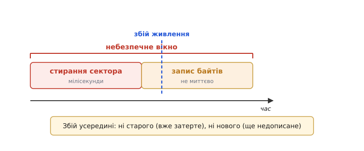
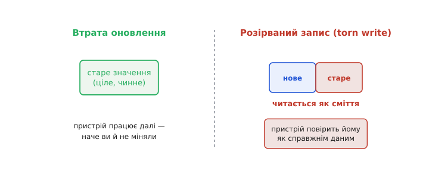
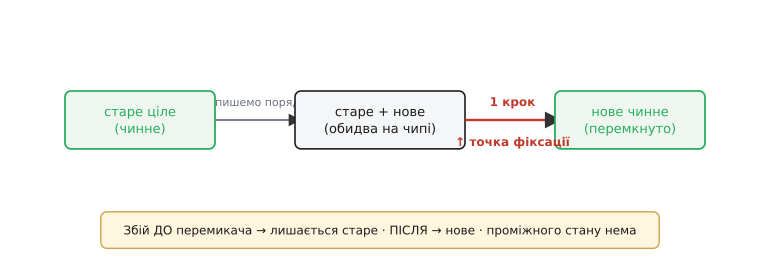
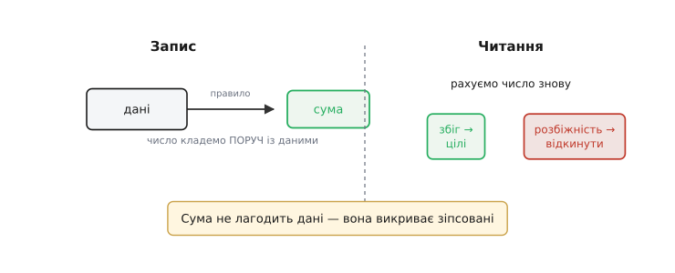
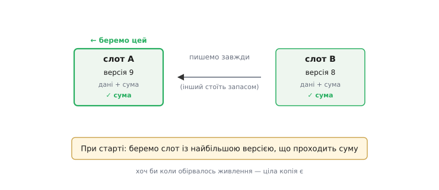
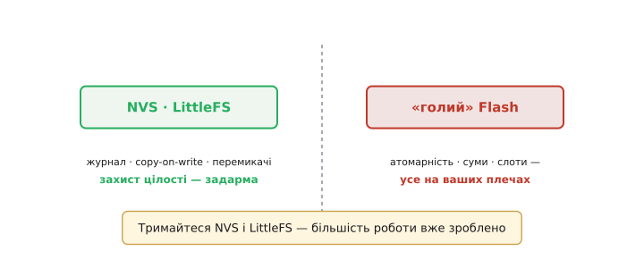

# Цілісність запису

Над усім, що пристрій зберігає у Flash, висить одне неприємне запитання, і час глянути йому в очі. Живлення може зникнути будь-якої миті — висмикнули виделку, сіла батарея, просіла напруга. Найчастіше це байдуже: вимкнувся пристрій, увімкнеться знову. Та є одна **найгірша** мить для збою — рівно тоді, коли пристрій **щось записує** у Flash. Що станеться з даними, якщо струм пропаде на півдорозі? Чи не лишимося ми з понівеченим, недописаним сміттям замість налаштувань? Це і є питання **цілісності** (від латинського *integritas* — неушкодженість, повнота) даних, і воно — серцевина надійного сховища.

### Найнебезпечніша мить

Щоб відчути загрозу, варто триматися того, як [влаштований Flash зсередини](topic:programming/flash-internals): запис у нього **не миттєвий**. Тут є ще й фізична асиметрія: стерта комірка тримає одиницю, а запис лише **гасить** окремі біти з 1 у 0 — повернути біт з 0 в 1 поодинці не можна, для цього треба стерти цілий сектор. Тому оновлення даних — це спершу **стерти** сектор (підняти всі біти в 1), а тоді **записати** нові байти (погасити потрібні в 0); кожна з цих дій триває відчутний час. Поки вона триває, дані в секторі — у проміжному, **нецілому** стані: старе вже затерте, нове ще не лягло повністю.


*Поки триває це «небезпечне вікно», збій живлення лишає ні старого значення (вже затерте), ні нового (ще недописане), а щось середнє.*

Ось воно, небезпечне вікно. Обірвись живлення в розпал стирання чи запису — і на чипі лишиться ні старе значення (його вже немає), ні нове (воно недописане), а щось середнє, безладне. Найприкріше, що тривалість цього вікна — не нуль: це не одна блискавична мить, а помітний відрізок часу, протягом якого збій справді ймовірний, надто якщо живлення вже й так хитке. Тож питання не в тому, **чи** колись струм пропаде посеред запису, а в тому, **що пристрій робитиме**, коли це станеться.

Наскільки ж велике це вікно? Стирання сектора — найповільніша операція Flash, воно тягнеться **мілісекунди**, а цілого великого блока на типовому NOR-чипі — і сотні мілісекунд; запис байтів швидший, та теж не миттєвий. Як на людину — оком не змигнути; як на пристрій, що пише налаштування десятки разів на день роками, — досить нагод, щоб колись та й збігтися з обривом живлення. Саме тому надійні сховища не сподіваються на «пронесе», а будуються так, ніби збій посеред запису — не виняток, а коли-небудь неминучість.

### Чому півзапис гірший за втрату

Може здатися: загубиться оновлення — то й нехай, невелика біда. І тут криється важлива різниця. Одна річ — **втратити оновлення**: пристрій просто лишиться зі **старим**, цілим значенням, наче ви й не міняли його. Це майже завжди прийнятно: старе працювало вчора, попрацює й сьогодні. Зовсім інша річ — **розірваний запис** (англ. *torn write*, дослівно «роздертий запис»): коли половина даних уже нова, а половина ще стара, і разом вони — нісенітниця.


*Втратити оновлення — ще пів біди: лишається старе, ціле значення, і пристрій працює далі. Розірваний запис читається як сміття — і це гірше, бо пристрій повірить йому як справжнім даним.*

Розірваний запис підступніший, бо при наступному старті пристрій прочитає це місиво **як справжні дані** й повірить йому. Налаштування виявляться зіпсованими, структура — поламаною, а поведінка пристрою — непередбачуваною: він може зависнути, перезавантажуватися по колу чи робити дурниці. Тому головна мета захисту цілості формулюється так: **за будь-якого збою лишитися або з повністю старим, або з повністю новим — але ніколи з «півнового»**. Чесно зберегти старе — не поразка; поразка — лишити нечитабельне сміття, якому пристрій довірятиме.

Уявімо це на пальцях. Хай у конфігу поряд лежать два пов'язані поля: «режим = автоматичний» і «цільова температура = 22». Ви міняєте обидва — на «ручний» і «18». Збій ловить вас на півдорозі, і на чипі лишається безглузда суміш: режим уже «ручний», а температура ще «22» — або й гірше, самі поля недописані до якихось напівбайтів. Пристрій, прочитавши таке, діятиме за станом, якого ви **ніколи не задавали**. Ось чому половинчастість така страшна: вона породжує комбінації, що не мали б існувати, — і саме їх захист цілості мусить унеможливити.

### Рятунок перший: усе або нічого

Перша й головна зброя проти розірваного запису зветься мудрим словом **атомарність** (від грецького *átomos* — неподільний, той, що не ділиться на частини). «Атомарний» тут означає саме це: дія або сталася **повністю**, або не сталася **зовсім**, третього не дано. Як домогтися цього на Flash, де сам запис довгий і подільний? Хитрим обхідним маневром, що лежить в основі всіх надійних сховищ.

Не чіпаймо старі дані, поки пишемо. Спершу запишімо нове значення в **інше, вільне** місце — поряд зі старим, не зачіпаючи його. Старе при цьому лишається цілим і чинним. І аж коли нове повністю лягло й перевірене, зробімо **один-єдиний крихітний крок**: перемкнімо маленький покажчик чи прапорець, що каже «віднині чинне — оте нове». Оцей крок і є **точка фіксації**.

Цей маневр знайомий і поза мікроконтролерами. Коли програма на комп'ютері «безпечно» зберігає документ, вона часто робить те саме: пише новий вміст у тимчасовий файл поряд, а тоді одним рухом **перейменовує** його на місце старого. Перейменування — дія коротка й неподільна: або сталося, або ні. Доти, доки новий файл не готовий, старий лишається недоторканим. Та сама обачність, лише на іншому поверсі: ніколи не руйнуй єдину добру копію, поки не маєш готової заміни.


*Збій до перемикача лишає старе, після — нове; проміжного стану не буває, бо сам перемикач — одна неподільна дія.*

Уся сила в тому, що сам перемикач — крихітний і робиться однією неподільною дією. Обірвись живлення **до** нього — лишається старе, ціле значення, бо нове ще не оголошене чинним. Обірвись **після** — лишається нове, ціле, бо воно вже повністю записане. А **посередині** опинитися неможливо: перемикач або клацнув, або ні. Саме так працює [NVS](topic:programming/nvs), дописуючи новий запис і позначаючи старий застарілим, і саме так працюють [файлові системи Flash](topic:programming/flash-filesystems) на кшталт LittleFS зі своїм copy-on-write. Один і той самий прийом — «пиши нове поряд, потім перемкни одним кроком» — наскрізний для всіх надійних сховищ.

Може майнути спокуса: а що, як просто писати **дуже швидко** — проскочити небезпечне вікно, поки струм не зник? Не вийде. Швидкість лише зменшує ймовірність, але не прибирає її: вікно ніколи не стає нульовим, а Flash має свою фізичну мінімальну тривалість стирання, яку не обігнати. Надійність дають не перегони з блискавкою, а будова, за якої **байдуже**, коли саме впаде струм. Атомарність — це відмова від ставки на щастя на користь конструкції, що тримається за будь-якого розкладу.

### Рятунок другий: контрольна сума

Атомарність береже від півзапису. Та лишається ще одне питання: а **як узагалі дізнатися**, чи запис цілий? Раптом він таки недописаний — як це **помітити** при читанні? Тут на сцену виходить **контрольна сума** (англ. *checksum*, від *check* — перевірка і *sum* — сума: число, яким перевіряють цілість).

Ідея проста й елегантна. Записуючи дані, ми тут-таки рахуємо з них коротке «контрольне число» — за певним нескладним правилом, що перемішує всі байти, — і кладемо це число **поруч** із даними. Читаючи дані назад, ми рахуємо число **ще раз**, за тим самим правилом, і звіряємо з тим, що збережене. Збіглося — дані цілі, їм можна вірити. Не збіглося — десь усередині щось зіпсувалося чи недописалося, і запис треба **відкинути**.


*Збіг — запис цілий; розбіжність — розірваний, його відкидають. Сума не лагодить дані, а викриває зіпсовані.*

Тут важливо вловити: контрольна сума нічого не **лагодить** — вона лише **викриває**. Її робота — чесно сказати «цьому запису довіряти не можна», щоб сховище встигло відступити до попередньої, цілої копії, а не подати програмі сміття під виглядом даних. Це наче печатка на конверті: зламана печатка не повертає лист, але попереджає, що його чіпали. У парі з атомарністю сума й дає повний захист: атомарність гарантує, що **десь** є ціла копія, а сума дозволяє **впізнати** її серед, можливо, недописаної.

Саме правило підрахунку буває різним за хитрістю. Найпростіше — поскладати чи побітово додати усі байти; надійніше — так звана [**CRC**](topic:communications/crc) (англ. *cyclic redundancy check* — циклічна надлишкова перевірка), що ловить навіть дрібні, підступні ушкодження, які проста сума проґавила б. Але затямте межу: контрольна сума захищає від **випадкового** псування — недопису, збою, перешкоди, — а не від **навмисної** підробки, бо зловмисник перерахував би й суму під свої підмінені дані. Боротьба з підробкою — то вже інша зброя, [цифровий підпис і безпечне завантаження](topic:programming/firmware-secure-boot).

### Подвійний слот і лічильник версії

Складімо обидва рятунки в один практичний візерунок, яким бережуть важливі налаштування. Заведімо **два слоти** під конфіг — назвімо їх A і B. У кожному, крім самих даних, лежить **номер версії** й **контрольна сума**. У будь-яку мить щонайменше один слот містить добру, цілу копію.

Оновлюємо так: ніколи не пишемо в той слот, що зараз чинний, — пишемо в **інший**, старіший. Поки ми його заповнюємо, чинний слот стоїть цілий і недоторканий: трапся збій — ми нічого не втратили, бо стару добру копію не чіпали. Коли новий слот дописано, він дістає **більший** номер версії — і цим стає найновішим.


*Пишемо завжди в старіший слот; другий стоїть цілий запасом. При старті беремо слот із найбільшою версією, що проходить суму, — тож хоч би коли обірвалось живлення, ціла копія є.*

А при старті пристрій робить просту річ: дивиться на обидва слоти й бере той, що має **найбільшу версію серед тих, що проходять контрольну суму**. Якщо новий слот дописався — у нього свіжіша версія, беремо його. Якщо збій застав нас на півзаписі — у нового слота або ще стара версія, або сума не сходиться, і пристрій спокійно бере **старий**, цілий слот. Хоч би коли обірвалося живлення, завжди лишається принаймні одна копія, якій можна вірити. Це і є надійне, **відмовостійке** оновлення — і саме воно ховається всередині того, як ESP32 зберігає важливі дані.

Простежмо це на трьох обірваннях живлення, щоб переконатися, що діри нема. Нехай чинний слот B має версію 8, і ми починаємо писати новий конфіг у слот A. **Збій на початку запису A**: слот A недописаний (сума не зійдеться), B цілий, версія 8 — пристрій бере B, ми лишилися з попереднім конфігом. **Збій під кінець, перед оновленням версії A**: A фізично майже повний, але його версія ще стара чи сума ще не дописана — однаково неприйнятний; знову беремо B. **Збій уже після того, як A став версією 9**: A цілий і найновіший — беремо A, оновлення вдалося. У жодному з трьох випадків нема стану «нема жодної доброї копії» — оце і є відмовостійкість на практиці, а не на словах.

Як цей вибір виглядає в реальному коді? Ось серцевина старту: читаємо обидва слоти, відкидаємо ті, де сума не сходиться, і з решти беремо найновіший за версією.

**Два слоти конфігу A і B; при старті обираємо найновіший, що проходить контрольну суму.**

```c
#include <stdint.h>
#include <string.h>

typedef struct {
    uint32_t version;     // лічильник; більший = новіший
    config_t data;        // самі налаштування
    uint32_t crc;         // CRC від version+data, записується ОСТАННІМ
} slot_t;

// CRC покриває все, крім самого поля crc (перші два члени структури)
static uint32_t slot_crc(const slot_t *s) {
    return crc32(s, offsetof(slot_t, crc));
}

static int slot_valid(const slot_t *s) {
    return s->crc == slot_crc(s);   // сходиться → слот цілий
}

// читаємо A і B із Flash у RAM, повертаємо чинний конфіг
config_t load_config(const slot_t *a, const slot_t *b) {
    int a_ok = slot_valid(a);
    int b_ok = slot_valid(b);

    if (a_ok && b_ok)
        return (a->version >= b->version) ? a->data : b->data;  // обидва цілі → новіший
    if (a_ok) return a->data;        // лише A цілий
    if (b_ok) return b->data;        // лише B цілий
    return config_defaults();        // жодного — перший старт або обидва биті
}
```

Простежмо за тим самим сценарієм. Збій під час запису A лишив його `crc`, що не сходиться → `a_ok == 0`; беремо ціле B з версією 8. Коли ж A дописався цілим із версією 9, обидва `*_ok == 1`, і `a->version (9) >= b->version (8)` віддає `a->data`. Жодна гілка не повертає «півнового»: або новіший цілий слот, або старіший цілий, або типові значення.

> ⚙️ **Як це зробити власноруч.** Повний рецепт «два слоти + лічильник версії + контрольна сума» — із зворотним боком, **записом** (порядок кроків усередині слота), — у вставці [Атомарне оновлення конфігурації](topic:programming/write-integrity/proj-atomic-config.md).

### Хто це робить за вас

Тут варто видихнути з полегшенням. Усю цю хитру механіку — атомарний перемикач, контрольні суми, запас на випадок збою — **NVS** і **LittleFS** уже роблять **усередині, самі**. Користуєтесь NVS для налаштувань чи LittleFS для файлів — і захист цілості дістаєте задарма, навіть не думаючи про нього: вони спроєктовані так, щоб переживати раптове вимкнення.


*NVS і LittleFS тримають усередині журнал, copy-on-write і перемикачі — ви дістаєте захист задарма. Самому клопотатися атомарністю, сумами й слотами доводиться лише при записі в «голий» Flash повз ці бібліотеки.*

Самотужки клопотатися атомарністю й сумами доводиться лише тоді, коли ви пишете в **«голий»** Flash повз ці бібліотеки — рідкісний для новачка випадок. Тож практичний висновок підбадьорливий: **тримайтеся NVS і LittleFS — і більшість роботи зі збереження цілості вже зроблено за вас**. Знати ж, **як** саме вона зроблена, корисно не щоб винаходити це наново, а щоб довіряти інструментам із розумінням і впізнавати ту саму ідею, коли вона трапиться знову.

Один практичний застереж: «майже» не дорівнює «завжди». Навіть з NVS чи LittleFS можна нашкодити собі — скажімо, тримати важливу зміну незакріпленою й смикнути живлення (незакріплене загубиться, і це нормально), або писати в обхід бібліотеки нестандартним способом, що повертає весь клопіт вам на плечі. Тому правило просте: пишіть через ці бібліотеки їхнім звичайним способом — і їхній захист працюватиме сам; обходьте їх — і захищайте себе самотужки.

> 🔧 **Навіщо це.** Цілість — не абстракція: це різниця між пристроєм, що спокійно переживає тисячі вимикань, і тим, що раз на місяць «псує собі налаштування» й вимагає скидання. Дві практичні поради звідси. Перша: **закріплюйте дані вчасно** — не тримайте важливу зміну лише в RAM надто довго, запишіть її у Flash, доки живлення є. Друга: якщо напруга буває хисткою, згадайте про [захист від просідання живлення (brownout)](topic:programming/brownout) — хай пристрій радше **не почне** запис, ніж обірве його на півдорозі.

Варто чесно окреслити й межу цих обіцянок. Цілість не означає «ніколи нічого не загубиться». Якщо збій застав вас рівно тоді, коли найновіша зміна ще не закріплена, ви її **втратите** — повернетесь до попереднього доброго стану. Цілість обіцяє інше, скромніше, та безцінне: ви ніколи не лишитеся зі **сміттям**. Між «втратив останню зміну, маю передостанній цілий стан» і «маю нечитабельне місиво, якому пристрій повірив» різниця величезна — і весь захист саме про те, щоб гарантувати перше й виключити друге.

Підсумуймо. Збій живлення посеред запису — реальна загроза, і відповідь на неї стоїть на двох опорах. **Атомарність** (пиши нове поряд, тоді перемкни одним кроком) гарантує, що ціла копія завжди десь є — стара чи нова, але не «півнова». **Контрольна сума** дозволяє ту цілу копію впізнати, відкинувши недописану. Разом, та ще й у візерунку «два слоти + версія», вони роблять сховище **відмовостійким**. І найкраща новина: NVS та LittleFS уже несуть це в собі. Та сама ідея масштабується на найбільше з усього, що зберігає пристрій, — на **саму прошивку**: [оновлення коду «по повітрю» з двома слотами](topic:programming/ota-slots) теж тримається на атомарному перемиканні й контрольній сумі, щоб ніколи не лишити пристрій із напівоновленим, мертвим образом.
