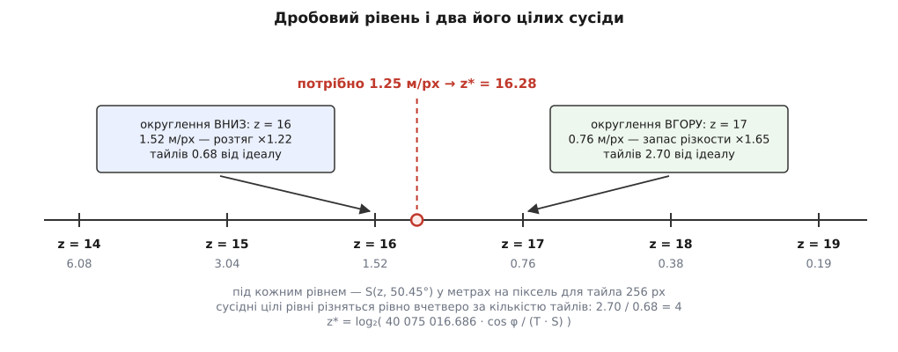
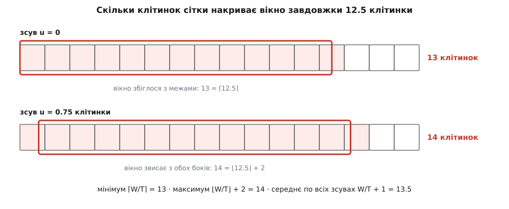

# 🧮 Арифметика піраміди тайлів: скільки штук, скільки метрів на піксель, скільки байтів

Три числа вирішують долю тайлової карти — скільки тайлів узагалі існує, який шматок землі припадає на один піксель і скільки байтів це важить у пам'яті, — і жодне з них не вгадується на око, тому тут вони виведені до кінця, з доведеннями, лічбою на конкретних екранах і задачами на перевірку.

## Скільки тайлів на рівні

Рівень z ділить квадрат світу на 2ᶻ смуг по горизонталі й на стільки ж по вертикалі, тож кількість клітинок — добуток:

```
N(z) = 2ᶻ · 2ᶻ = 4ᶻ
```

```
z     2ᶻ по осі      N(z) = 4ᶻ
 0            1                    1
 5           32                1 024
10        1 024            1 048 576
15       32 768        1 073 741 824
19      524 288      274 877 906 944
```

Кожен крок зуму множить кількість на чотири — саме тому нижні рівні світової піраміди ніхто не тримає повними. Рівень 19 у двадцятикілобайтових картинках важив би 274 877 906 944 · 20 КіБ ≈ 5 ПіБ, а більша частина цих тайлів — однотонний океан і пустелі, які зберігають окремо або не зберігають зовсім.

## Сума піраміди й теорема про третину

Уся піраміда від нульового рівня до z — це сума [геометричної прогресії](topic:math/geometric-series) зі знаменником 4. Її зручно згорнути не індукцією, а множенням на (4 − 1), бо тоді все, крім країв, взаємно знищується:

```
Σ = 4⁰ + 4¹ + … + 4ᶻ

3·Σ = 4·Σ − Σ
    = (4¹ + 4² + … + 4^(z+1)) − (4⁰ + 4¹ + … + 4ᶻ)
    = 4^(z+1) − 1

Σ = (4^(z+1) − 1)/3
```

Позначимо N = 4ᶻ — кількість тайлів найглибшого рівня. Тоді вся піраміда важить (4N − 1)/3, а самі лише предки, тобто всі рівні від 0 до z−1, — рівно

```
A(z) = 4⁰ + 4¹ + … + 4^(z−1) = (4ᶻ − 1)/3 = (N − 1)/3
```

Це тотожність, а не наближення: **предків рівно третина того, що лишиться від нижнього рівня, якщо забрати з нього один тайл**. Частка A/N наближається до ⅓ знизу й уже на п'ятому рівні збігається з нею до третього знака:

```
z        A(z)/N(z)
1          0.250000
2          0.312500
3          0.328125
5          0.333008
10         0.333333
```

Звідси й формулювання «уся піраміда коштує на третину більше за свій нижній рівень»: (4N − 1)/3 ≈ 1.3333·N.

Ця третина — властивість площини, а не карт. Якщо кожна клітинка при переході на рівень глибше розпадається на b дітей, то те саме згортання дає A = (N − 1)/(b − 1), а b = 2ᵈ для простору вимірности d:

```
d = 1   b = 2   предки коштують  1/1 = 100 %   (розріз відрізка)
d = 2   b = 4   предки коштують  1/3 ≈  33 %   (карта, мітмапи текстур)
d = 3   b = 8   предки коштують  1/7 ≈  14 %   (об'ємні дані, воксельні сітки)
```

У вимірності 1 предки коштують стільки ж, скільки сам нижній рівень, — повна піраміда виходить удвічі дорожча за нього; у площині вона дорожча на третину; в об'ємі — на сьому частину. Тайлова карта живе в зручному місці цієї шкали не випадково, а тому, що вона двовимірна.

Обрізана піраміда рахується так само: якщо тримають лише рівні від z₁ до z₂, їх сумарна кількість — (4^(z₂+1) − 4^z₁)/3.

## Третина — це про цілий світ, а не про екран

Тотожність A = (N − 1)/3 виконується для **повного** рівня. Видимий набір — не повний рівень, а прямокутник a × b тайлів, і для нього третина перестає бути правдою. Причина суто арифметична: кількість предків не може впасти нижче одиниці на рівень, а рівнів угору стільки, скільки дає z.

Предки прямокутника a × b на рівні z−k — теж прямокутник, і його сторони обмежені зверху так:

```
сторона_x(k) ≤ ⌊(a − 1)/2ᵏ⌋ + 1 ≤ a/2ᵏ + 1
```

(одиниця з'являється тому, що краї прямокутника майже ніколи не збігаються з межами грубішої сітки — ті самі «звисаючі» клітинки, що й у підрахунку вікна). Сума по всіх рівнях угору:

```
A_вид ≤ Σ(k=1..z) (a/2ᵏ + 1)(b/2ᵏ + 1)
      = Σ (ab/4ᵏ + a/2ᵏ + b/2ᵏ + 1)
      ≤ ab/3 + a + b + z
```

Перший доданок — та сама третина, решта три — периметр і хвіст ланцюга, де на кожному рівні лишається по одному тайлу. На екранних розмірах ці три разом важать десь половину першого. Порахуймо точно для прямокутника 14 × 9 (це найгірший випадок вікна 3200 × 1800 фізичних пікселів на тайлах 256) з нижнім рівнем z = 17:

```
k = 1     7 × 5  =  35
k = 2     4 × 3  =  12
k = 3     2 × 2  =   4
k = 4     1 × 1  =   1
k = 5…17  1 × 1  =  13   (по одному тайлу на рівень)
──────────────────────────
A_вид             =  65
```

Проти N/3 = 42 і проти оцінки згори 42 + 14 + 9 + 17 = 82. Тобто предки видимого набору коштують не третину, а близько **половини** самого набору, і перевищення дає не арифметика площ, а тринадцять майже порожніх верхніх рівнів. Практичний наслідок від цього не змінюється — 65 тайлів проти 126 усе одно дешево, — але той, хто закладає в бюджет рівно третину, помиляється у півтора раза.

## Роздільність на землі

Друге число — скільки метрів землі припадає на піксель тайла. Виводиться воно з двох величин: довжини екватора й розміру тайла.

[Web Mercator](topic:math/web-mercator-tiles) кладе весь світ у квадрат, ширина якого по побудові дорівнює довжині екватора. Ця довжина в карті — не результат вимірювання, а наслідок означення: система WGS 84 задає велику піввісь еліпсоїда точним числом a = 6 378 137 м, екватор еліпсоїда — коло саме цього радіуса, а Web Mercator ще й рахує Землю сферою того самого радіуса. Звідси

```
C = 2·π·a = 2·π·6 378 137 = 40 075 016.6856 м
```

(меридіан коротший — Земля сплюснута, — але тайлова сітка користується виключно екваторіальним числом, бо квадрат світу будується від нього.)

На рівні z цей квадрат покрито 2ᶻ тайлами по осі, у кожному T пікселів. Отже, на екваторі:

```
пікселів по осі світу = 2ᶻ · T
S(z, 0) = C / (2ᶻ · T)
```

Широту додає властивість самої проєкції. Паралель на широті φ — коло радіуса a·cos φ, тобто справжня її довжина C·cos φ; на карті ж вона намальована на всю ширину квадрата, як екватор. Проєкція розтягує її в 1/cos φ раза, тож на піксель припадає у cos φ разів менше справжніх метрів:

```
S(z, φ) = C · cos φ / (2ᶻ · T)

при T = 256:   S(z, φ) = 40 075 016.686 · cos φ / 2^(z+8)
                       = 156 543.034 · cos φ / 2ᶻ      м/піксель
```

Двійка в степені z+8 — це 2ᶻ клітинок по 2⁸ = 256 пікселів; стала 156 543.034 — просто C/256.

```
z      S(z, 0)          z      S(z, 0)
 0   156 543.034 м/px   12       38.219 м/px
 2    39 135.758 м/px   14        9.555 м/px
 4     9 783.940 м/px   16        2.389 м/px
 6     2 445.985 м/px   18        0.597 м/px
 8       611.496 м/px   19        0.299 м/px
10       152.874 м/px   22        0.037 м/px
```

Формула одразу дає й співвідношення розмірів тайла. Оскільки T стоїть у знаменнику разом з 2ᶻ:

```
S(z, φ, T = 512) = C·cos φ / 2^(z+9) = S(z + 1, φ, T = 256)
```

Тайл 512 пікселів на рівні z різкий рівно так, як тайл 256 на рівні z+1, і накриває рівно ту саму землю, що чотири тайли 256 того рівня. Це не наближення й не домовленість — це та сама формула, прочитана в інший бік.

## Обернена задача: вибрати цілий рівень

На практиці відомий не z, а потрібна роздільність S\* (стільки метрів має лягти на піксель екрана). Розв'язати рівняння відносно z — узяти [двійковий логарифм](topic:math/binary-logarithm):

```
2ᶻ = C · cos φ / (T · S*)

z* = log₂( C · cos φ / (T · S*) )
```

**Вікно 1600 × 900 логічних пікселів на екрані подвійної щільности (3200 × 1800 фізичних), треба вкласти в ширину смугу 4 км, широта Києва φ = 50.45°, тайли 256 px.**

```
S*        = 4000 м / 3200 px            = 1.25    м/px
cos 50.45° = 0.636751
S(0, φ)   = 156 543.034 · 0.636751      = 99 678.99  м/px
2^z*      = 99 678.99 / 1.25            = 79 743.19
z*        = log₂ 79 743.19              = 16.2831
```

Цілого рівня 16.2831 не існує, тож треба округлити, і обидва напрямки коштують. Розкладімо z\* = m + f, де m = ⌊z\*⌋ — ціла частина ([підлога](topic:math/floor-division)), f ∈ [0, 1) — дробова. Тут m = 16, f = 0.2831.

**Ціна різкости.** На рівні m роздільність у 2^f раза грубіша за потрібну, тобто картинку доведеться розтягти лінійно в 2^f раза; на рівні m+1 вона в 2^(1−f) раза дрібніша за потрібну, тобто зайва.

**Ціна обсягу.** Один піксель тайла рівня z покриває 2^(z\*−z) пікселів екрана, тому на фіксований екран W × H потрібно тайлів:

```
n(z) = (W·H / T²) · 4^(z − z*)

n(m)   = ідеал · 4^(−f)
n(m+1) = ідеал · 4^(1−f)
n(m+1)/n(m) = 4      — завжди, за будь-якого f
```

Підставмо f = 0.2831:

```
округлення ВНИЗ,  z = 16:  S = 1.521 м/px   розтяг ×1.217   тайлів 0.675 від ідеалу
округлення ВГОРУ, z = 17:  S = 0.761 м/px   запас  ×1.645   тайлів 2.702 від ідеалу
```



*Відношення обсягів двох сусідніх варіантів — рівно чотири, незалежно від того, куди саме між рівнями впав дробовий z\*.*

Межі похибки округлення виводяться зі значень f на краях відрізка:

```
f → 0    вниз: розтяг ×1.00 (ідеально), тайлів ×1
         вгору: зайва різкість ×2, тайлів ×4      — учетверо дорожче задарма
f → 1    вниз: розтяг ×2 (помітне розмиття), тайлів ×0.25
         вгору: ані розтягу, ані зайвої різкости, тайлів ×1
f = 0.5  вниз: розтяг ×1.414, тайлів ×0.5
         вгору: зайва різкість ×1.414, тайлів ×2
```

Отже, округлення вниз ніколи не розмиває більш ніж удвічі, а округлення вгору ніколи не коштує більш ніж учетверо проти ідеалу. Точка f = 0.5 симетрична за логарифмом (√2 в обидва боки) і тому природно править за поріг перемикання; зсув порога вгору (наприклад, перемикатися лише при f > 0.7) економить трафік ціною видимішого розмиття.

## Скільки тайлів накриває вікно

Формулу (W/T + 1)·(H/T + 1) звикли вважати грубою оцінкою «плюс одна клітинка на звисання». Насправді це точне середнє, і корисно знати, що воно не збігається з найгіршим випадком.

Розгляньмо одну вісь. Вікно — відрізок довжини W пікселів, лінії сітки стоять кратно T. Хай ліва межа вікна лежить у точці x; накриті клітинки мають індекси від ⌊x/T⌋ до ⌈(x+W)/T⌉ − 1, тож їх

```
n = ⌈(x + W)/T⌉ − ⌊x/T⌋
```

Запишімо x/T = a + u, де a ціле, u ∈ [0, 1) — зсув вікна всередині клітинки, і w = W/T — довжина вікна в клітинках. Ціла частина a виноситься зі стелі й скорочується:

```
n = ⌈a + u + w⌉ − a = ⌈u + w⌉
```

Отже, кількість залежить лише від довжини й зсуву. Хай w = ⌊w⌋ + g, де g — дробова частина w. Тоді ⌈u + w⌉ = ⌊w⌋ + ⌈u + g⌉, а ⌈u + g⌉ дорівнює 1, поки u < 1 − g, і 2, коли u > 1 − g (окремі зсуви, де u + g виходить цілим, — міра нуль і на середнє не впливають). Усереднення по рівномірному зсуву:

```
E[n] = ⌊w⌋ + 1·(1 − g) + 2·g = ⌊w⌋ + 1 + g = w + 1
```

Середнє — **точно** W/T + 1, за будь-якої довжини вікна. А крайні значення інші:

```
мінімум   n = ⌈w⌉
максимум  n = ⌊w⌋ + 2        (для дробового w)
середнє   n = w + 1
```



*Формула W/T + 1 дає 13.5 — це середнє по всіх можливих зсувах, а не стеля; найгірший зсув коштує чотирнадцятої клітинки.*

Осі незалежні, тож двовимірні величини — добутки одновимірних:

```
Вікно 3200 × 1800 фізичних пікселів

T = 256:  w = 12.5      h = 7.03125
          мінімум  13 · 8 = 104
          середнє  13.5 · 8.031 = 108.4
          максимум 14 · 9 = 126

T = 512:  w = 6.25      h = 3.515625
          мінімум   7 · 4 =  28
          середнє   7.25 · 4.516 = 32.7
          максимум  8 · 5 =  40
```

Різниця між середнім і максимумом — 16 %, і це та сама різниця, що між «зазвичай вистачає» й «іноді мерехтить». Кеш планують за максимумом.

Кільце запасу навколо вікна входить у ту саму формулу підстановкою W + 2m замість W:

```
запас m (px)   найгірший випадок, T = 256   приріст
    0          14 ·  9 = 126                   —
  128          15 · 10 = 150                 +24
  256          16 · 11 = 176                 +26
  384          17 · 12 = 204                 +28
  512          18 · 13 = 234                 +30
  640          19 · 14 = 266                 +32
  768          20 · 15 = 300                 +34
```

Запас у 256 пікселів коштує +40 % тайлів, у 768 — у 2.4 раза більше за голе вікно. Приріст росте лінійно (24, 26, 28, 30, …), а не квадратично: у площі кільця запасу доданок 4m² помітно переважить доданок 2m(W+H) лише тоді, коли m стане порівнянним із самим вікном. Тому перші сотні пікселів запасу дешеві, і скупитися на них немає підстав.

## Скільки це байтів

Розпакований тайл — це масив пікселів, і його розмір не залежить ні від рівня, ні від того, що на ньому намальовано:

```
байтів(T, bpp) = T · T · bpp

T = 256  RGBA8888 (4 Б/px)   262 144 Б = 256 КіБ
T = 256  RGB888   (3 Б/px)   196 608 Б = 192 КіБ
T = 256  RGB565   (2 Б/px)   131 072 Б = 128 КіБ
T = 512  RGBA8888 (4 Б/px) 1 048 576 Б = 1 МіБ
T = 512  RGB888   (3 Б/px)   786 432 Б = 768 КіБ
T = 512  RGB565   (2 Б/px)   524 288 Б = 512 КіБ
```

Відношення крайніх рядків — 1 МіБ / 128 КіБ = **8**. Ось точна ціна лічби кешу в штуках: якщо в одному сховищі лежать тайли різних розмірів і різних форматів, лічильник штук може недооцінити зайняту пам'ять у вісім разів. Тому обмеження задають у байтах, а лічильник штук лишають хіба що для звітів.

Зручна для усного рахунку рівність: тайл 256 RGBA — це ¼ МіБ, тож **кількість таких тайлів ділиться на чотири й одразу дає мегабайти**.

**Робочий набір для вікна 3200 × 1800, T = 256, RGBA, рівень 17, запас 768 px.**

```
видимих із запасом (найгірший випадок)   300 тайлів   75.00 МіБ
предки прямокутника 20 × 15 до рівня 0   121 тайл     30.25 МіБ
──────────────────────────────────────────────────────────────
                                         421 тайл    105.25 МіБ
```

Тепер сусідні рівні під час зуму. Рівень z−1 у цьому підрахунку **вже врахований** — він і є перший поверх ланцюга предків, 80 тайлів із тих 121. Тобто тримати грубішого сусіда не коштує нічого понад те, що вже полічено. А рівень z+1 коштує вчетверо більше за поточний: 4 · 300 = 1200 тайлів, тобто 300 МіБ самим лише додатковим рівнем. Ця асиметрія — 0 проти 300 МіБ — і є арифметична причина, чому при зумі тримають старий грубіший рівень, а не завантажують наперед детальніший.

Обернена задача — від бюджету до запасу:

```
бюджет 128 МіБ  →  128 / 0.25 = 512 тайлів 256 RGBA
потрібно        →  421 тайл (запас 768 px разом із предками)
лишається       →   91 тайл на несподіванки
```

Бюджет у 128 МіБ покриває вікно 3200 × 1800 із дуже щедрим запасом.

Тепер порівняймо розміри тайла на тій самій площі. Вікно із запасом 768 пікселів — це 4736 × 3336 = 15 799 296 пікселів, тобто 60.3 МіБ у RGBA, якби їх можна було взяти рівно стільки, скільки треба. Тайли беруться цілими, і надлишок платиться по краях:

```
T = 256   найгірший випадок 20 × 15 = 300 тайлів · 256 КіБ = 75.0 МіБ   +24 % понад площу
T = 512   найгірший випадок 11 ·  8 =  88 тайлів ·   1 МіБ = 88.0 МіБ   +46 % понад площу
```

Байтів у робочому наборі більший тайл не економить — навпаки, з'їдає на 17 % більше, бо кожна зайва смуга по краю вдвічі ширша. Він економить **кількість об'єктів і запитів**: 88 проти 300. Це і є справжній компроміс розміру тайла, і в байтах він програшний.

## Задачі

**1.** Скільки всього тайлів у повній піраміді рівнів 0…12 і яка частка припадає на предків?

```
N        = 4¹² = 16 777 216
предки   = (4¹² − 1)/3 = 5 592 405
разом    = (4·4¹² − 1)/3 = 22 369 621
частка   = 5 592 405 / 16 777 216 = 0.333333
```

**2.** Який найменший цілий рівень дає роздільність не гіршу за 0.5 м/px на широті 60°? Тайли 256 px.

```
S(0, 60°) = 156 543.034 · 0.5 = 78 271.517 м/px
2^z*      = 78 271.517 / 0.5  = 156 543.03
z*        = log₂ 156 543.03   = 17.2562
```

Округлення вгору: z = 18, і воно дає 0.2986 м/px — у 1.67 раза різкіше за потрібне (це і є 2^(1−f) при f = 0.2562). Рівень 17 дає 0.5972 м/px, тобто на 19 % грубіше за вимогу; якщо вимога «не гірше» тверда, вибору немає, і платити доводиться вчетверо більшою кількістю тайлів.

**3.** Вікно 2560 × 1440, тайли 512 px. Скільки тайлів у найкращому, середньому й найгіршому випадку?

```
w = 2560/512 = 5      (ціле!)      h = 1440/512 = 2.8125
по осі x: мінімум 5, максимум 6            (для цілого w максимум = w + 1)
по осі y: мінімум 3, максимум 4
мінімум  5 · 3 = 15      середнє 6 · 3.8125 = 22.9      максимум 6 · 4 = 24
```

Ціле w — окремий випадок: коли вікно збігається з сіткою, воно накриває рівно w клітинок, а за будь-якого іншого зсуву — w + 1. Тому мінімум досягається лише в одній-єдиній позиції з нескінченної множини, і планувати на нього не можна.

**4.** У кеші лежать 400 тайлів 256 RGB565 і 150 тайлів 512 RGBA. Скільки це байтів і в скільки разів помилиться той, хто рахує «550 тайлів по 256 КіБ»?

```
400 · 131 072   =  52 428 800 Б  =  50 МіБ
150 · 1 048 576 = 157 286 400 Б  = 150 МіБ
разом                            = 200 МіБ

наївна лічба: 550 · 256 КіБ = 137.5 МіБ   —  заниження в 1.45 раза
```

**5.** Доведіть, що ланцюг предків одного тайла рівня z містить рівно z тайлів, і поясніть, чому це не суперечить формулі A = (N − 1)/3.

```
предок(z, x, y) = (z−1, x >> 1, y >> 1)
```

Кожне застосування зменшує рівень на одиницю, отже від z до 0 їх рівно z. Суперечности немає, бо (N − 1)/3 рахує предків **усіх** N тайлів рівня разом, а не одного: ланцюги різних тайлів майже цілком збігаються вгорі, і на рівні z−k різних предків лише 4^(z−k), скільки б тайлів унизу на них не спиралося.

**6.** Екран 3840 × 2160, тайли 256 px, потрібно вкласти в ширину 12 км на широті 0°. Який цілий рівень і скільки тайлів у найгіршому випадку?

```
S*   = 12 000 / 3840 = 3.125 м/px
2^z* = 156 543.034 / 3.125 = 50 093.77
z*   = log₂ 50 093.77 = 15.6122        m = 15, f = 0.6122

вниз,  z = 15: S = 4.777 м/px, розтяг ×1.529, тайлів 4^(−f)  = 0.43 від ідеалу
вгору, z = 16: S = 2.389 м/px, запас  ×1.308, тайлів 4^(1−f) = 1.71 від ідеалу

w = 3840/256 = 15 (ціле)   h = 2160/256 = 8.4375
найгірший випадок: 16 · 10 = 160 тайлів = 40 МіБ у RGBA
```

Дробова частина 0.61 більша за половину, тож поріг f = 0.5 велить брати рівень 16 — і саме він тут доречний: розтяг у півтора раза на дрібному тексті карти вже читається як розмиття.
