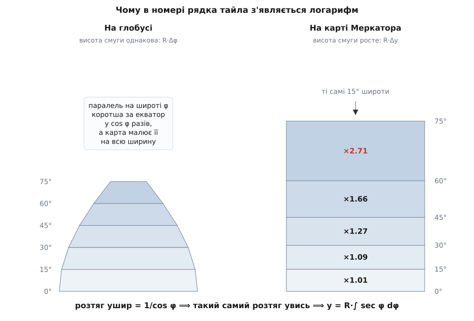
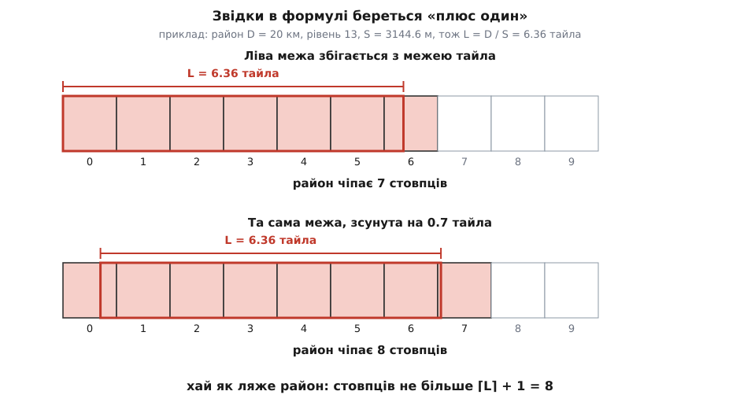

# 🧮 Арифметика офлайн-набору: від градусів широти до гігабайтів

За безневинним питанням «завантажити цей район?» стоїть ланцюжок обчислень, кожну ланку якого можна вивести з нуля й перевірити на папері: межі прямокутника й діапазон рівнів → номери тайлів по кутах → скільки тайлів на кожному рівні → скільки байтів разом. Тут цей ланцюжок виведено повністю й доведено до числа, щоб його можна було відтворити для будь-якого району й будь-якої широти.

Одразу варто розділити ланцюжок надвоє за природою його ланок, бо це рятує від хибних сподівань. **Кількість тайлів рахується точно**: це цілі числа, здобуті з геометрії, і два застосунки, які порахували правильно, дістануть однакову відповідь до одиниці. **Обсяг у байтах — оцінка**, бо середній розмір тайла залежить від шару й від того, що саме на землі: над однорідним морем стиснений PNG важить сотні байтів, над щільним містом — десятки кілобайтів. Уся неточність підсумку сидить рівно в одному множнику, і корисно знати, у якому саме.

## Довгота лінійна, широта — ні

Сітка тайлів улаштована так: на рівні `z` світ покрито квадратом 2ᶻ × 2ᶻ клітинок, стовпці `x` рахують від меридіана −180° на схід, рядки `y` — від верхнього краю карти на південь. Щоб дізнатися, у яку клітинку впаде точка, треба спершу перевести її в частки карти — два числа від 0 до 1.

З довготою все просто, і саме тому вона нецікава. Меркаторова карта розтягує всі меридіани в паралельні вертикальні прямі на рівній відстані, тож довгота лягає на ширину карти лінійно:

```
u = (λ + 180) / 360                 частка ширини карти, 0 ≤ u < 1
x = ⌊ u · 2ᶻ ⌋                      номер стовпця тайла
```

Із широтою так не вийде, і причина не в зручності, а у вимозі, заради якої проєкцію взагалі створили. Меркаторова карта потрібна морякові, щоб курс сталого компасного напрямку малювався на ній **прямою лінією**. Це можливо лише тоді, коли карта не спотворює кутів: маленька фігура на місцевості має перетворюватися на подібну до себе фігуру на карті — більшу чи меншу, але не перекошену. Проєкцію з такою властивістю називають конформною (лат. *conformis* — «однакової форми»), і вона [купує збереження кутів ціною спотворення площ](book:math/map-projections) — саме тому Ґренландія на такій карті виглядає як Африка.

Тепер порахуймо, наскільки карта мусить розтягувати місцевість, і ця вимога сама продиктує формулу. Візьмімо на глобусі радіуса `R` крихітну латку: Δλ по довготі, Δφ по широті.

```
на місцевості:   ширина = R · cos φ · Δλ        (паралель на широті φ
                 висота = R · Δφ                 коротша за екватор у cos φ разів)

на карті:        ширина = R · Δλ                 (усі паралелі — на всю ширину)
                 висота = Δy                     (це ми й шукаємо)

розтяг ушир  =  R·Δλ / (R·cos φ·Δλ)  =  1 / cos φ  =  sec φ
розтяг увись =  Δy / (R·Δφ)
```

Ось і все: конформність означає, що ці два розтяги мають бути **однакові** — інакше латка вийде не подібна до себе, а сплюснута чи витягнута. Прирівнюємо їх і дістаємо диференціальне рівняння, у якому вже видно майбутній логарифм:

```
Δy / (R·Δφ) = sec φ        ⟹        dy/dφ = R · sec φ
```


*Однакові 15° широти дають на глобусі смуги однакової висоти, а на карті — смуги, що ростуть. Смуга 60°…75° виходить на карті у 2.71 раза вищою, ніж та сама смуга на глобусі, — рівно настільки ж карта розтягнула її й ушир.*

Далі лишається [проінтегрувати](book:math/integral) від екватора до потрібної широти. Первісна секанса — та сама, яку століттями шукали навпомацки:

```
y(φ) = R · ∫₀^φ sec t dt = R · ln(tan φ + sec φ)
```

Перевірити її можна прямо, за одну дію, і це варто зробити, бо результат виглядає взятим зі стелі:

```
d/dφ  ln(sec φ + tan φ)  =  (sec φ·tan φ + sec²φ) / (sec φ + tan φ)
                         =  sec φ·(tan φ + sec φ) / (sec φ + tan φ)
                         =  sec φ                                   ✓
```

Історія цієї первісної повчальна саме тим, що показує розрив між «уміти рахувати» і «знати формулу». Фламандець Ґерард Меркатор оприлюднив карту 1569 року, але способу побудови не пояснив. Англієць Едвард Райт у праці «Certaine Errors in Navigation» (1599) дав перші точні таблиці, порахувавши інтеграл **чисельно** — тим, що ми сьогодні назвали б сумами Рімана. Учитель навігації Генрі Бонд у 1640-х порівняв Райтові числа з таблицею логарифмів тангенса, побачив збіг і **висунув здогад**, що йдеться про `ln tan(π/4 + φ/2)`. Здогад лишався здогадом ще чверть століття: шотландець Джеймс Ґреґорі довів його 1668 року в «Exercitationes geometricae», а перше придатне для читання доведення дав англієць Ісаак Барроу 1670 року через розклад на прості дроби — це найраніше відоме застосування такого прийому в інтегруванні. Усе це — усталені факти історії математики. Менш певне тут місце Томаса Гарріота: він викладав навігаційну математику з кінця 1583 року й дістав робочий числовий розв'язок Меркаторової задачі, найпевніше саме додаванням секансів, — але надрукованого сліду не лишив, рукописи за життя не вийшли, а конспект «Arcticon» узагалі втрачено. Тож ані точної дати, ані меж зробленого встановити не можна: пріоритет тут не доведений, а правдоподібний.

Обидві форми первісної рівносильні, бо `tan φ + sec φ = tan(π/4 + φ/2)`, і в коді трапляються обидві.

Тепер нормуємо. Карту обрізають там, де `|y| = πR` — тоді світ стає точним квадратом зі стороною 2πR, що й дозволяє покрити його сіткою 2ᶻ × 2ᶻ однакових квадратів:

```
v = 1/2 − y / (2πR) = (1 − ln(tan φ + sec φ)/π) / 2      частка висоти, 0 ≤ v < 1
y_тайла = ⌊ v · 2ᶻ ⌋                                     номер рядка
```

Межову широту знайдемо з умови `y = πR`, і тут ховається гарна тотожність. Позначмо `u = ln(tan φ + sec φ)`. Тоді `eᵘ = tan φ + sec φ`, а оскільки `sec²φ − tan²φ = 1`, обернене число дорівнює `e⁻ᵘ = sec φ − tan φ`. Віднімаємо:

```
sinh u = (eᵘ − e⁻ᵘ)/2 = ((tan φ + sec φ) − (sec φ − tan φ))/2 = tan φ

⟹  обернений перехід:  φ = arctan( sinh(y/R) )        (функція Гудермана)
⟹  межа при y = πR:    φ = arctan(sinh π) = arctan(11.548739) = 85.0511288°
```

Те саме число дає й друга форма, `φ = 2·arctan(eᵖ) − π/2`, — обидві сходяться до 85.0511287798°. Полюси на такій карті недосяжні принципово: інтеграл секанса розбігається, тож 90° широти відповідає нескінченному `y`.

Перевірмо весь перехід на конкретній точці — Київ, 50.4501° пн. ш., 30.5234° сх. д.:

```
u = (30.5234 + 180)/360 = 0.5847872
y/R = ln(tan 50.4501° + sec 50.4501°) = 1.0229622
v = (1 − 1.0229622/3.14159265)/2 = 0.3371905

z = 13:  x = ⌊0.5847872 · 8192⌋   = ⌊  4790.58⌋ =   4790
         y = ⌊0.3371905 · 8192⌋   = ⌊  2762.26⌋ =   2762
z = 18:  x = ⌊0.5847872 · 262144⌋ = ⌊153298.46⌋ = 153298
         y = ⌊0.3371905 · 262144⌋ = ⌊ 88392.47⌋ =  88392
```

Одну чесність тут треба проговорити, бо вона трапляється в чужих багах. У ці сферичні формули підставляють широту з WGS-84, тобто з **еліпсоїда**, а не зі сфери. Це свідома невідповідність: [еліпсоїд сплюснутий, і його широта визначена інакше](book:math/wgs84-datum), тож Web Mercator строго кажучи навіть не цілком конформний. Для нашої задачі це не має значення — ми рахуємо клітинки тієї самої сітки, у якій карта й намальована, — але при перерахунку в справжню меркаторову проєкцію ця сама плутанина дає розходження до сорока кілометрів на місцевості.

## Скільки землі під одним тайлом

Карта завширшки в цілий екватор, `C = 2πR`, поділена на 2ᶻ стовпців, тож один стовпець забирає `C/2ᶻ` метрів **карти**. На землі ця сама смуга коротша рівно в `cos φ` разів — паралель же коротша за екватор:

```
C = 2π · 6378137 = 40075016.686 м                  (екваторіальний радіус WGS-84)
S(z) = C · cos φ / 2ᶻ                               ширина тайла на місцевості, м
```

Висота тайла на місцевості виходить така сама, і це не збіг, а вже здобута конформність: із `dy = R·sec φ·dφ` випливає `R·dφ = dy·cos φ`, тобто вертикальний розмір на землі рахується тим самим множником, що й горизонтальний. Тайл на карті квадратний — отже, він квадратний і на землі.

Ось звідки береться стала, яку часто бачать без пояснення: тайл має 256 пікселів, тож на нульовому рівні один піксель — це `40075016.686 / 256 = 156543.03` метра на екваторі. Для широти 50° таблиця виходить така:

```
cos 50° = 0.6428                C · cos φ = 25760221 м

S(13) = 25760221 /   8192 = 3144.6 м
S(14) = 25760221 /  16384 = 1572.3 м
S(15) = 25760221 /  32768 =  786.1 м
S(16) = 25760221 /  65536 =  393.1 м
S(17) = 25760221 / 131072 =  196.5 м
S(18) = 25760221 / 262144 =   98.3 м
```

Наскільки чесно тут вважати `cos φ` сталим у межах одного тайла? Перевіримо на найгрубішому рівні, який нас цікавить: тайл рівня 13 біля 50.45° накриває 0.028° широти, і косинус на його південному й північному краях різниться на 0.06 %. На рівні 18 тайл накриває 0.00087° — приблизно 97 метрів, — і різниця зникає зовсім. Тобто сталий косинус тут точніший, ніж усе інше в оцінці.

А от третя цифра самого косинуса іноді таки важить. Точне `cos 50° = 0.642788` замість округленого `0.6428` міняє `S(13)` з 3144.6 на 3144.5 метра — і на підсумок це не впливає взагалі, бо далі число проходить крізь округлення вгору. Але коли `D/S` лягає впритул до цілого, та сама третя цифра перекидає стелю на одиницю й міняє цілий стовпець сітки. Тож константи варто тримати точними, а не «достатньо точними».

## Скільки тайлів у прямокутнику

Переведімо розмір району в ту саму валюту, що й сітку, — у ширини тайла:

```
L = D / S(z)                    довжина району в тайлах, взагалі кажучи дробова
```

Скільки стовпців сітки чіпає відрізок довжини `L`? Відповідь залежить від того, **де** він почався, а цього ми не обираємо: сітка прибита до глобуса, а район вибирає людина. Хай ліва межа району стоїть у точці `a` (у тих самих тайлових одиницях), і хай `f = a − ⌊a⌋` — її зсув усередині свого тайла, число з проміжку [0, 1).

```
перший зачеплений стовпець = ⌊a⌋
останній зачеплений        = ⌊a + L⌋
кількість = ⌊a + L⌋ − ⌊a⌋ + 1 = ⌊f + L⌋ + 1

f = 0        →  ⌊L⌋ + 1 = ⌈L⌉        (найкращий випадок: межа збіглася із сіткою)
f → 1        →  ⌈L⌉ + 1              (найгірший: район звисає з обох боків)
```

Отже, стовпців буває або `⌈L⌉`, або `⌈L⌉ + 1` — і ніколи більше. Оскільки зсув нам не підвладний, для оцінки беруть стелю: `⌈L⌉ + 1`. Це і є той «запас на межі», який у формулі виглядає довільним плюсом, а насправді є точною верхньою межею.


*Довжина району — 6.36 тайла, але зачеплених стовпців буває 7 або 8 залежно від зсуву; більше за ⌈L⌉ + 1 = 8 не буде ніколи.*

(Дрібниця для повноти: коли `L` — рівно ціле, а `f` = 0, формула дає на один стовпець більше, ніж потрібно, бо права межа зараховується до наступного тайла. Це випадок нульової ймовірності — `D/S` практично ніколи не буває цілим, — і зайвий стовпець у бік запасу нічого не псує.)

Для прямокутного району обидві сторони рахуються незалежно, а тайли перемножуються:

```
N(z) = ( ⌈Dx / S(z)⌉ + 1 ) · ( ⌈Dy / S(z)⌉ + 1 )

квадрат 20 × 20 км на широті 50°:
                 L = D/S      ⌈L⌉+1      N = сторона²
z=13:              6.36           8          8² =    64
z=14:             12.72          14         14² =   196
z=15:             25.44          27         27² =   729
z=16:             50.88          52         52² =  2704
z=17:            101.76         103        103² = 10609
z=18:            203.53         205        205² = 42025
                                                 -------
                                           разом   56327
```

## Знаменник 4 і чому найглибший рівень — три чверті

Крок углиб ділить тайл навпіл по кожній осі, тож `S(z+1) = S(z)/2`, а `L` подвоюється. Сторона блока подвоюється, а сам блок — квадрат, отже кількість учетверяється. Це і є прогресія зі знаменником 4, і її суму варто вивести, бо саме вона керує всім плануванням. [Стандартний прийом](book:math/geometric-series): помножити суму на знаменник і відняти від неї саму себе.

```
Σ = 4⁰ + 4¹ + … + 4ⁿ
4Σ =      4¹ + … + 4ⁿ + 4ⁿ⁺¹
4Σ − Σ = 4ⁿ⁺¹ − 4⁰                ⟹    Σ = (4ⁿ⁺¹ − 1) / 3

для діапазону рівнів m…n:              Σ = (4ⁿ⁺¹ − 4ᵐ) / 3
```

Тепер частка найглибшого рівня в цій сумі:

```
4ⁿ / [(4ⁿ⁺¹ − 4ᵐ)/3]  =  3 / (4 − 4^(m−n))

діапазон завширшки 1 рівень:   3/(4 − 1/4)    = 0.800
                    3 рівні:   3/(4 − 1/64)   = 0.753
                    6 рівнів:  3/(4 − 1/1024) = 0.75018
```

Ось де живуть ті самі «три чверті». Частка збігається до ¾ **згори** і вже на трьох рівнях відрізняється від неї менш ніж на відсоток: скільки рівнів не додавай угору, дешевші вони не стануть, бо кожен попередній вчетверо менший за наступний. Друге прочитання тієї самої формули важливіше на практиці: додати один рівень углиб — це помножити **весь** набір приблизно на 4, бо новий рівень сам по собі дорівнює всьому старому набору плюс ще стільки ж.

У справжньому стовпчику частка виходить трохи інша — `42025 / 56327 = 0.7461`, тобто нижче за 0.75018. Розходження не помилка, а слід того самого «плюс одного». Розкриймо квадрат:

```
N = (k + 1)² = k² + (2k + 1)
     └─┬──┘     └───┬───┘
   чиста площа   периметр — накладні витрати межі

z=13:  k=7    k²=   49   межа= 15   →  23.4 % рівня — це облямівка
z=15:  k=26   k²=  676   межа= 53   →   7.3 %
z=18:  k=204  k²=41616   межа=409   →   1.0 %
```

Груба сітка обкладена облямівкою відносно куди товщою, ніж дрібна, тож грубі рівні «роздуті» проти чистих степенів четвірки, а відношення сусідніх рівнів підповзає до чотирьох знизу: 3.06, 3.72, 3.71, 3.92, 3.96. Через це на останній рівень припадає трохи менше за три чверті, а додавання рівня 19 множить набір не рівно на 4, а на 3.97 — 223 608 тайлів замість 56 327.

Якщо стовпчик рахувати не хочеться, чисту частину можна згорнути в одну формулу — вона дає відповідь одразу, без таблиці:

```
N ≈ (Dx·Dy) / (C·cos φ)²  ·  (4ⁿ⁺¹ − 4ᵐ) / 3

(20000 / 25760221)² · (4¹⁹ − 4¹³)/3 = 6.0278·10⁻⁷ · 91603599360 = 55217
```

Проти точних 56 327 це занижено на 2 % — рівно на ту саму облямівку, яку формула відкидає. Для діалогу «завантажити?» такої точності досить із запасом.

## Від тайлів до байтів

Останній перехід найкоротший і водночас єдиний неточний:

```
B = N · b̄                    b̄ — середній розмір тайла

56327 · 25 КіБ = 56327 · 25600 = 1 441 971 200 байтів
                               = 1 441 971 200 / 2³⁰ = 1.343 ГіБ
```

Оскільки `N` — точне ціле, [уся відносна похибка підсумку дорівнює відносній похибці `b̄`](book:math/error-propagation) і більше нічому: помилився в середньому розмірі на 20 % — на стільки ж помилився в гігабайтах. Звідси й практичний висновок: `b̄` не вгадують, а міряють — по перших сотнях завантажених тайлів цього самого шару, і бажано окремо для кожного рівня, бо глибокі рівні над містом важать помітно більше за грубі.

Друга пастка цього рядка — не математична, а одинична, і вона регулярно розсварює два числа на екрані. Гігабайт буває двійковий і десятковий:

```
1 ГіБ = 2³⁰ = 1 073 741 824 байтів
1 ГБ  = 10⁹ = 1 000 000 000 байтів
2³⁰ / 10⁹ = 1.0737          різниця 7.4 %

наш набір:  1.343 ГіБ  =  1.442 ГБ
```

Одне й те саме сховище чесно називають то «1.34», то «1.44» — і користувач, який порівнює оцінку застосунку з вільним місцем у системному діалозі, бачить розбіжність там, де її немає. Обирати можна будь-яку одиницю; не можна змішувати дві в одному застосунку.

## Три множники, які варто тримати в голові

Формула `N ∝ Dx·Dy·4ᶻ / cos²φ` містить рівно три ручки, і кожна з них дорога по-своєму.

**Рівень.** Плюс один рівень углиб — приблизно ×4. Це найдорожча ручка інтерфейсу й найнепомітніша: повзунок пересувається на одну поділку.

**Розмір району.** Подвоїти сторону — це вчетверити площу, тобто теж ×4. Тут хоч інтуїція не підводить: люди зазвичай очікують, що більший район коштує більше.

**Широта.** А от ця ручка непомітна зовсім, бо її не крутять свідомо. Тайл покриває `cos φ` метрів на кожен метр екваторіального тайла, отже район сталого фізичного розміру потребує `1/cos²φ` тайлів:

```
широта    cos φ    1/cos²φ    той самий квадрат 20×20 км, рівні 13…18
  0°      1.000      1.00       23 529 тайлів   ≈ 0.56 ГіБ
 30°      0.866      1.33       ~1.3× екватора
 50°      0.643      2.42       56 327 тайлів   ≈ 1.34 ГіБ
 60°      0.500      4.00       92 662 тайли    ≈ 2.21 ГіБ
 64°      0.438      5.20       ~5× екватора
```

Той самий за розміром полігон коштує в Скандинавії вп'ятеро більше, ніж у тропіках, — і жоден рядок коду про це не попереджає.

Наостанок — дві прикидки, з яких [оцінка робиться усно](book:programming/back-of-envelope), без таблиці. Перша: оскільки найглибший рівень — три чверті набору, увесь набір дорівнює приблизно `4/3` цього рівня. Для нашого прикладу `42025 · 4/3 = 56033` проти точних 56 327 — розходження пів відсотка. Друга: поділивши підсумок на площу, дістаємо число, яке легко тримати в пам'яті для [звичної тайлової сітки](book:math/web-mercator-tiles) на середніх широтах:

```
56327 тайлів / 400 км² = 141 тайл на км²
1.343 ГіБ    / 400 км² = 3.4 МіБ на км²      (рівні 13…18, φ ≈ 50°, 25 КіБ на тайл)
```

Три з половиною мегабайти на квадратний кілометр — це достатньо, щоб на слух відповісти на будь-яке «а якщо взяти всю область?». Область на 30 000 км² при тих самих рівнях — це сотня гігабайтів, і про це краще дізнатися до того, як хтось натисне «завантажити».
