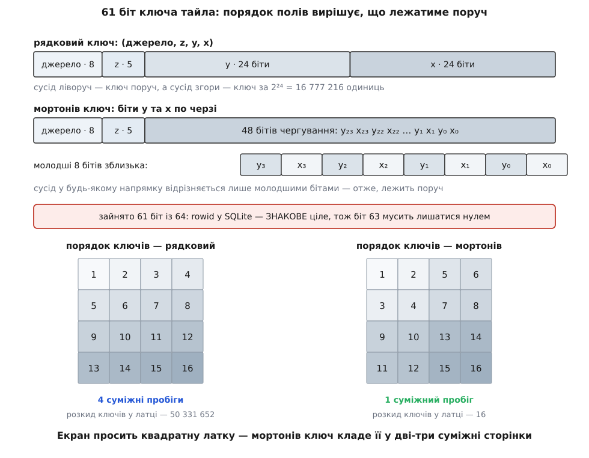
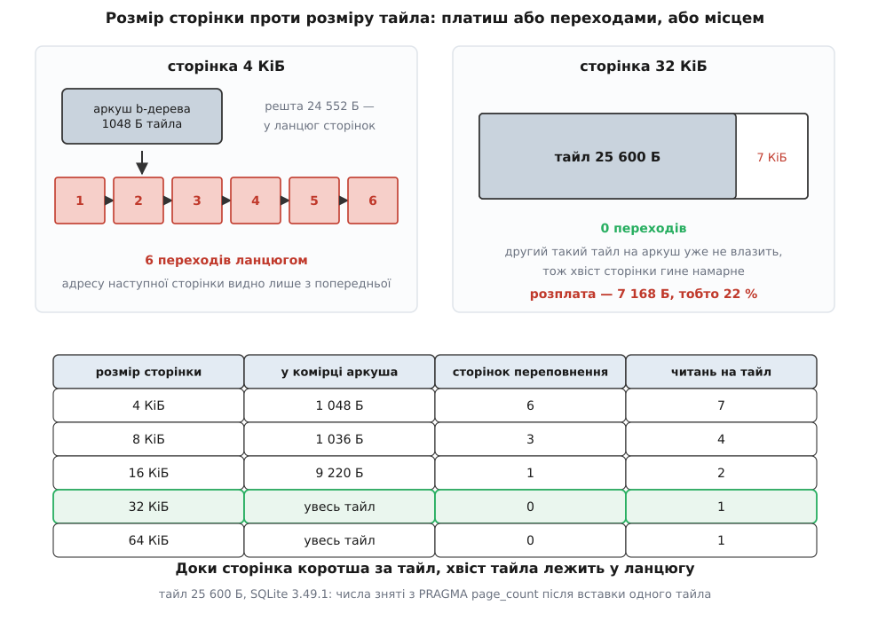

# ⚙️ Сховище тайлів на SQLite: код, який тримає карту без мережі

Нижче — робоче сховище офлайн-карти: чотири таблиці, десяток підготовлених запитів і близько двохсот рядків C++ поверх [вбудованої бази даних](book:programming/embedded-database), яке кладе тайли пакетами, віддає їх за час, непомітний у кадрі, підмінює відсутній тайл предком і само себе підчищає, жодного разу не зачепивши того, що оператор завантажив свідомо. Код написано прямо на C-інтерфейсі SQLite, без обгорток і фреймворків: сховище лежить на гарячому шляху малювання, і кожен зайвий прошарок тут доводиться потім пояснювати профайлером.

Числа в тексті не оціночні, а виміряні: Windows 11, NVMe, SQLite 3.49.1, тайл 25 600 Б.

## П'ять дій і те, що в кожній ламається

Сховище мусить уміти рівно п'ять речей, і кожна з них має рівно одне місце, де реалізації розсипаються.

**Покласти сотню тайлів, які щойно принесла мережа.** Ламається на транзакціях: вставка кожного тайла окремо перетворює завантаження району на багатогодинне.

**Віддати тайл за адресою `(джерело, z, x, y)`.** Ламається на ключі: рядок замість числа коштує і місця, і порівнянь, а невдалий порядок полів у ключі розкидає сусідні на карті тайли по різних сторінках.

**Коли тайла немає — віддати предка.** Ламається на тому, що «немає» буває двох різних сортів: тайла немає у сховищі і тайла не існує в постачальника. Перше треба довантажити, друге — запам'ятати, щоб не питати знову.

**Витіснити зайве.** Ламається на закріплених наборах: витіснення зобов'язане обходити тайли, на які хтось посилається, і не має права запускатися посеред роботи.

**Пережити вимкнення живлення.** Ламається на тому, що список роботи живе в пам'яті процесу, якого вже немає.

## Схема: чотири таблиці

```sql
CREATE TABLE IF NOT EXISTS tiles (
  key     INTEGER PRIMARY KEY,   -- (джерело, z, x, y), запаковані в 61 біт
  bytes   INTEGER NOT NULL,      -- довжина тіла; 0 разом із body IS NULL = «тайла немає»
  fetched INTEGER NOT NULL,      -- коли завантажено (unix-час)
  used    INTEGER NOT NULL,      -- коли востаннє віддано — за цим витісняємо
  etag    TEXT,                  -- мітка версії від сервера
  body    BLOB                   -- САМЕ ОСТАННІЙ стовпець, див. нижче
);
CREATE INDEX IF NOT EXISTS tiles_used ON tiles(used, bytes);

CREATE TABLE IF NOT EXISTS sets (
  id      INTEGER PRIMARY KEY,
  name    TEXT NOT NULL UNIQUE,
  src     INTEGER NOT NULL,
  zmin    INTEGER NOT NULL, zmax  INTEGER NOT NULL,
  west    REAL NOT NULL,    south REAL NOT NULL,
  east    REAL NOT NULL,    north REAL NOT NULL,
  created INTEGER NOT NULL
);

CREATE TABLE IF NOT EXISTS set_tiles (       -- «набір посилається на тайл»
  set_id INTEGER NOT NULL REFERENCES sets(id) ON DELETE CASCADE,
  key    INTEGER NOT NULL,
  PRIMARY KEY (set_id, key)
) WITHOUT ROWID;
CREATE INDEX IF NOT EXISTS set_tiles_key ON set_tiles(key);

CREATE TABLE IF NOT EXISTS download_queue (  -- робота, що переживає перезапуск
  key    INTEGER NOT NULL,
  set_id INTEGER NOT NULL REFERENCES sets(id) ON DELETE CASCADE,
  state  INTEGER NOT NULL DEFAULT 0,         -- 0 чекає · 1 у роботі · 2 готово · 3 помилка
  tries  INTEGER NOT NULL DEFAULT 0,
  PRIMARY KEY (set_id, key)
) WITHOUT ROWID;
CREATE INDEX IF NOT EXISTS queue_ready ON download_queue(state, set_id);
```

Тут чотири рішення, які варті пояснення, бо кожне з них видно у профілі.

**`key INTEGER PRIMARY KEY` — це не «ще один стовпець із ключем».** У SQLite такий стовпець стає самим `rowid`, тобто ключем b-дерева таблиці, і окремого індексу під нього не існує взагалі. Ключ будь-якого іншого вигляду — текст, `BLOB` або те саме ціле, оголошене як `UNIQUE`, — означав би друге дерево поруч із таблицею: і місце, і зайве читання при кожному пошуку.

**`body` — останній стовпець, і це не косметика.** SQLite розбирає рядок зліва направо і читає рівно стільки байтів, скільки треба, щоб дістати потрібні стовпці. Тіло тайла на 25 КіБ не вміщається в одну сторінку [b-дерева](book:algorithms/b-tree) й лежить у ланцюгу сторінок переповнення — тож якщо `body` стоїть перед дрібними полями, будь-який запит по цих полях змушений спускатися в ланцюг. Різниця вимірюється просто: три тисячі рядків по 25 600 Б, запит `SELECT SUM(used)`, свіже з'єднання на кожен прогін.

```
body ОСТАННІЙ  →   2.4 мс
body ПЕРШИЙ    →  24.3 мс
```

Удесятеро — на порожньому місці, лише через порядок стовпців у `CREATE TABLE`.

**Індекс `tiles_used(used, bytes)` покриває обидва службові запити.** Індекс у SQLite завжди несе в собі `rowid`, тобто наш `key`; додавши до нього `bytes`, ми дістаємо компактне дерево, з якого можна прочитати геть усе, що потрібно витісненню, — ключ, давність і розмір, — не торкаючись самої таблиці з блобами. Це видно з плану: `EXPLAIN QUERY PLAN SELECT SUM(bytes) FROM tiles` відповідає `SCAN tiles USING COVERING INDEX tiles_used`. Різниця не косметична: 56 тисяч тайлів у таблиці — це 56 тисяч сторінок по 32 КіБ (1.8 ГіБ читання), а в покривному індексі — близько сотні сторінок. [Покривний індекс](book:programming/database-indexes) тут перетворює хвилинну операцію на миттєву.

**`set_tiles` і `download_queue` — `WITHOUT ROWID`.** Обидві таблиці не мають нічого, крім свого ключа; звичайна форма зберігання тримала б окремо таблицю з невидимим `rowid` і окремо індекс під первинний ключ — тобто ті самі дані двічі. `WITHOUT ROWID` кладе рядки просто в дерево первинного ключа.

## Ключ: 61 біт замість двадцяти байтів

Адреса тайла — це джерело (постачальник плюс шар), рівень і дві координати. Усі складники малі й обмежені, тож усі разом вони вміщаються в одне ціле, яке стане `rowid`:

```cpp
#include <cstdint>

// x, y < 2²⁴ (вистачає до рівня 24), z < 32, номер джерела < 256
constexpr uint64_t src_z(uint8_t src, uint32_t z)
{
    return (uint64_t(src) << 53) | (uint64_t(z & 31) << 48);
}

constexpr uint64_t row_key(uint8_t src, uint32_t z, uint32_t x, uint32_t y)
{
    return src_z(src, z) | (uint64_t(y & 0xFFFFFF) << 24) | uint64_t(x & 0xFFFFFF);
}
```

Вісім бітів джерела, п'ять рівня, по двадцять чотири на координати — шістдесят один біт. Три верхні лишаються нулями навмисно: `rowid` у SQLite — **знакове** 64-бітове ціле, і ключ, у якого стоїть біт 63, стане від'ємним з усіма наслідками для впорядкування.

Ключ `row_key` кладе тайли одного рівня рядками: сусід ліворуч відрізняється на одиницю, а сусід згори — на 2²⁴ = 16 777 216. Тим часом екран просить не смужку, а квадратну латку. Лікує це **чергування бітів**: беремо по одному біту від `y` і `x` по черзі, від старших до молодших, — те саме, що [крива Мортона, або Z-порядок](book:algorithms/z-order-curve). Розсунути 24 біти по парних позиціях можна без циклу, п'ятьма кроками подвоєння:

```cpp
// b₂₃…b₀  →  0 b₂₃ 0 b₂₂ … 0 b₀   (24 біти розтягнуто на 48 позицій)
constexpr uint64_t spread24(uint32_t v)
{
    uint64_t x = v & 0xFFFFFFu;
    x = (x ^ (x << 16)) & 0x0000FFFF0000FFFFULL;
    x = (x ^ (x <<  8)) & 0x00FF00FF00FF00FFULL;
    x = (x ^ (x <<  4)) & 0x0F0F0F0F0F0F0F0FULL;
    x = (x ^ (x <<  2)) & 0x3333333333333333ULL;
    x = (x ^ (x <<  1)) & 0x5555555555555555ULL;
    return x;
}

constexpr uint64_t tile_key(uint8_t src, uint32_t z, uint32_t x, uint32_t y)
{
    return src_z(src, z) | (spread24(y) << 1) | spread24(x);
}

// x = 1011₂, y = 0110₂  →  пари (y₃x₃)(y₂x₂)(y₁x₁)(y₀x₀) = 01 10 11 01
static_assert(tile_key(0, 0, 0b1011, 0b0110) == 0b01101101, "чергування бітів");
```

Кожен крок бере половину бітів, які вже на місці, і зсуває їх туди, де вони мають стояти; маска лишає в живих саме ту половину. Після п'ятого кроку між усіма бітами по одній порожній позиції — саме там сяде друга координата. Тридцять команд процесора замість двадцяти чотирьох ітерацій циклу, і все це рахується на етапі компіляції, коли аргументи сталі.


*Ті самі 61 біт, два порядки. Рядковий ключ розкидає квадратну латку 4×4 на чотири пробіги з розкидом у п'ятдесят мільйонів; мортонів кладе вирівняну латку в один суміжний пробіг завдовжки 16. Латка, зсунута відносно сітки, дає шість пробігів із розкидом 44 — усе одно на шість порядків щільніше.*

> 🔧 **Навіщо це.** Просторова близькість у ключі не прикрашає код, а вирішує, скільки сторінок доведеться підняти з диска на один кадр. Квадрат 4×4 тайли при рядковому ключі — чотири далекі пробіги в дереві, при мортоновому — один. На настільному SSD різницю можна не помітити; на планшеті з повільною пам'яттю її не помітити неможливо. Замінити ключ пізніше — це переписати всю базу на пристрої користувача, тож вибір робиться один раз і назавжди.

## Відкриття: п'ять прагм, кожна з яких щось вирішує

```cpp
static bool exec(sqlite3* db, const char* sql)
{
    char* err = nullptr;
    if (sqlite3_exec(db, sql, nullptr, nullptr, &err) == SQLITE_OK) return true;
    std::fprintf(stderr, "sqlite: %s [%s]\n", err ? err : "?", sql);
    sqlite3_free(err);
    return false;
}

static int64_t scalar(sqlite3* db, const char* sql)
{
    sqlite3_stmt* s = nullptr;
    if (sqlite3_prepare_v2(db, sql, -1, &s, nullptr) != SQLITE_OK) return -1;
    int64_t v = (sqlite3_step(s) == SQLITE_ROW) ? sqlite3_column_int64(s, 0) : -1;
    sqlite3_finalize(s);
    return v;
}

bool TileStore::open(const char* path, int page_size /* = 32768 */)
{
    const int flags = SQLITE_OPEN_READWRITE | SQLITE_OPEN_CREATE | SQLITE_OPEN_NOMUTEX;
    if (sqlite3_open_v2(path, &db_, flags, nullptr) != SQLITE_OK) return false;

    char buf[64];
    std::snprintf(buf, sizeof buf, "PRAGMA page_size=%d;", page_size);
    exec(db_, buf);                              // подіє лише на ЩЕ НЕ створеній базі
    exec(db_, "PRAGMA auto_vacuum=INCREMENTAL;");// теж лише до перших таблиць
    exec(db_, "PRAGMA journal_mode=WAL;");
    exec(db_, "PRAGMA synchronous=NORMAL;");
    exec(db_, "PRAGMA foreign_keys=ON;");        // поза транзакцією — інакше мовчазний no-op
    sqlite3_busy_timeout(db_, 5000);

    if (!exec(db_, SCHEMA_SQL)) return false;
    if (scalar(db_, "PRAGMA page_size;") != page_size)
        std::fprintf(stderr, "увага: база лишилася зі сторінкою %lld\n",
                     (long long)scalar(db_, "PRAGMA page_size;"));

    exec(db_, "UPDATE download_queue SET state=0 WHERE state=1;");  // після аварійного виходу
    return prepare_all();
}
```

Порядок тут не довільний. `page_size` і `auto_vacuum` записуються у **заголовок файлу** й тому діють лише тоді, коли файл ще порожній; після створення першої таблиці змінити їх можна тільки повним перебудуванням через `VACUUM` (та й то не в режимі WAL). Саме тому обидві прагми стоять до `SCHEMA_SQL`, а після нього — перевірка: якщо база вже існувала зі сторінкою 4 КіБ, ніхто про це не скаже, і сховище тихо робитиме сім читань там, де могло б одне.

`journal_mode=WAL` дає те, чого не дає типовий відкотний журнал: читання не блокуються записом. Малювальник тягне тайли на кадр рівно тоді, коли завантажувач пише пакет, і без WAL вони штовхалися б ліктями. Ціна — [журнал попереднього запису](book:programming/write-ahead-log) як окремий файл поруч із базою і потреба зрідка його зливати.

`synchronous=NORMAL` — те місце, де сховище тайлів має право на вільність, якої не має бухгалтерія. У режимі WAL із `NORMAL` фіксація [транзакції](book:programming/transactions-acid) не робить синхронізації з диском: база лишається несуперечливою за будь-якої аварії, але останні зафіксовані транзакції можуть відкотитися після зникнення живлення. Для тайлів це прийнятно рівно тому, що втрачений тайл — це не втрачені дані, а привід завантажити його ще раз; черга в базі знає, чого бракує.

## Байти, які вдають із себе картинку

Перед записом варто витратити наносекунди й перевірити, що прийшло. Сигнатура ловить чужий тип (класика — сторінка входу від точки доступу з обов'язковою авторизацією, яка відповідає кодом 200 на кожен запит), а кінець файлу — обрив посеред відповіді.

```cpp
#include <cstring>

// PNG: 89 50 4E 47 0D 0A 1A 0A · JPEG: FF D8 FF · WebP: 'RIFF' <довжина> 'WEBP'
static bool looks_like_tile(const unsigned char* p, int n)
{
    if (!p || n < 16) return false;

    if (!std::memcmp(p, "\x89PNG\r\n\x1a\n", 8))                    // початок PNG
        return !std::memcmp(p + n - 8, "IEND\xae\x42\x60\x82", 8);  // і чанк IEND у кінці

    if (p[0] == 0xFF && p[1] == 0xD8 && p[2] == 0xFF)               // SOI + перший маркер
        return p[n - 2] == 0xFF && p[n - 1] == 0xD9;                // EOI

    if (!std::memcmp(p, "RIFF", 4) && !std::memcmp(p + 8, "WEBP", 4)) {
        const uint32_t sz = uint32_t(p[4])        | (uint32_t(p[5]) <<  8)
                          | (uint32_t(p[6]) << 16) | (uint32_t(p[7]) << 24);
        return int64_t(sz) + 8 == int64_t(n);     // оголошена довжина = фактична
    }
    return false;
}
```

Вісім байтів сигнатури PNG підібрані не навмання — кожен щось ловить, і специфікація формату це прямо пояснює. Перший байт узято поза ASCII, щоб текстовий файл не сприйняли за PNG, а канал, який гасить старший біт, викрив себе одразу. Далі три літери `PNG`. Потім пара `CR LF` — її зіпсує передавання в текстовому режимі. Далі `1A`: на цьому символі команда `TYPE` у MS-DOS припиняла показ файлу. Останній байт, переведення рядка, ловить зворотне перетворення — коли самотній `LF` перетворили на `CR LF`. Тому перевіряти варто всі вісім, а не два перші. WebP простіший: контейнер RIFF сам оголошує свою довжину в байтах 4–7, і збіг цієї довжини з фактичною — готова перевірка на обрив.

## Пакет: сотня тайлів в одній транзакції

```cpp
struct TileIn {                    // те, що щойно принесла мережа
    uint64_t             key;
    const unsigned char* body;     // nullptr → «такого тайла не існує»
    int                  len;
    std::string          etag;
};

struct Reset {                     // повертає підготовлений вираз у вихідний стан
    sqlite3_stmt* s;
    ~Reset() { sqlite3_reset(s); sqlite3_clear_bindings(s); }
};

int TileStore::put_batch(const std::vector<TileIn>& in, int64_t set_id, int64_t now)
{
    if (in.empty()) return 0;
    if (!exec(db_, "BEGIN IMMEDIATE")) return -1;   // одразу беремо право на запис

    int written = 0;
    for (const TileIn& t : in) {
        const bool missing = (t.body == nullptr);
        if (!missing && !looks_like_tile(t.body, t.len)) continue;   // не картинка — не пишемо

        Reset r{put_};
        sqlite3_bind_int64(put_, 1, (sqlite3_int64)t.key);
        sqlite3_bind_int  (put_, 2, missing ? 0 : t.len);
        sqlite3_bind_int64(put_, 3, now);
        sqlite3_bind_int64(put_, 4, now);
        if (t.etag.empty()) sqlite3_bind_null(put_, 5);
        else sqlite3_bind_text(put_, 5, t.etag.c_str(), -1, SQLITE_STATIC);
        if (missing) sqlite3_bind_null(put_, 6);
        else sqlite3_bind_blob(put_, 6, t.body, t.len, SQLITE_STATIC);

        if (sqlite3_step(put_) != SQLITE_DONE) { exec(db_, "ROLLBACK"); return -1; }
        ++written;

        if (set_id > 0) {                            // тайл дістає посилання від набору
            Reset rl{link_};
            sqlite3_bind_int64(link_, 1, set_id);
            sqlite3_bind_int64(link_, 2, (sqlite3_int64)t.key);
            sqlite3_step(link_);
        }
    }
    if (!exec(db_, "COMMIT")) { exec(db_, "ROLLBACK"); return -1; }
    return written;
}
```

Самі запити готуються один раз при відкритті — SQLite компілює текст SQL у програму для своєї віртуальної машини, і робити це 56 тисяч разів немає жодних причин ([підготовлений вираз](book:programming/prepared-statements) виконується скільки завгодно разів із новими значеннями):

```cpp
put_  = prep(db_,
    "INSERT INTO tiles(key,bytes,fetched,used,etag,body) VALUES(?,?,?,?,?,?) "
    "ON CONFLICT(key) DO UPDATE SET bytes=excluded.bytes, fetched=excluded.fetched, "
    "used=excluded.used, etag=excluded.etag, body=excluded.body");
link_ = prep(db_, "INSERT OR IGNORE INTO set_tiles(set_id,key) VALUES(?,?)");
get_  = prep(db_, "SELECT bytes, body FROM tiles WHERE key=?");
touch_= prep(db_, "UPDATE tiles SET used=? WHERE key=?");
```

Чотири подробиці, кожна з яких колись коштувала комусь вечора.

**`BEGIN IMMEDIATE`, а не просто `BEGIN`.** Звичайна транзакція починається як читацька й проситься на запис при першій зміні; якщо тим часом право на запис узяв хтось інший, підвищення не вдасться — і не «зачекає», а поверне помилку зайнятості, бо чекати вже пізно: наш знімок бази застарів. `IMMEDIATE` бере право на запис одразу, і тоді `busy_timeout` чесно відпрацьовує чергу.

**`SQLITE_STATIC` проти `SQLITE_TRANSIENT`.** Перше означає «пам'ять за цим вказівником житиме, доки я не завершу виконання» і не коштує нічого; друге змушує SQLite скопіювати всі 25 КіБ до себе. Тут `SQLITE_STATIC` правильний, бо тіла лежать у векторі, який переживе весь пакет. Але варто хоч раз передати так вказівник на тимчасовий буфер, який помирає в кінці ітерації, — і ви дістанете псування пам'яті, яке проявиться в іншому місці й іншого дня.

**`Reset` як [страж часу життя](book:programming/raii).** Кожен підготовлений вираз після використання треба повернути у вихідний стан. Забутий `sqlite3_reset` на запиті `SELECT` — це відкрита читацька транзакція, яка тримає знімок бази; поки вона жива, журнал WAL не можна злити в базу, і файл поруч росте, доки на диску є місце. Деструктор робить це без права забути.

**Повтор має коштувати дешево.** `ON CONFLICT(key) DO UPDATE` робить повторне завантаження безпечним: тайл, який уже є, просто оновиться, а не викличе помилку унікальності. Разом із `INSERT OR IGNORE` у таблиці зв'язків це дає властивість, без якої офлайн-завантажувач нежилий: натиснути «завантажити» на район, що вже наполовину є, коштує дешево й нічого не псує.

## Пошук: сам тайл, а якщо його немає — предок

```cpp
struct TileOut {
    std::vector<unsigned char> body;
    int  px = 0, py = 0, side = 256;  // який підквадрат узяти з того, що знайшлося
    int  up = 0;                      // на скільки рівнів довелося піднятися
    bool known_missing = false;       // сховище пам'ятає: такого тайла не існує
};

bool TileStore::get(uint8_t src, uint32_t z, uint32_t x, uint32_t y,
                    int max_up, TileOut& out)
{
    for (int k = 0; k <= max_up && k <= (int)z; ++k) {
        Reset r{get_};
        const uint64_t key = tile_key(src, z - k, x >> k, y >> k);
        sqlite3_bind_int64(get_, 1, (sqlite3_int64)key);
        if (sqlite3_step(get_) != SQLITE_ROW) continue;      // цього предка нема — вище

        if (sqlite3_column_type(get_, 1) == SQLITE_NULL) {   // запис «тайла не існує»
            if (k == 0) out.known_missing = true;            // мережу турбувати не треба
            continue;                                        // предок усе одно згодиться
        }

        const unsigned char* p = (const unsigned char*)sqlite3_column_blob(get_, 1);
        const int n = sqlite3_column_bytes(get_, 1);
        out.body.assign(p, p + n);        // копіюємо: після reset цей вказівник мертвий
        out.side = 256 >> k;              // сторона підквадрата в пікселях предка
        const uint32_t mask = (1u << k) - 1;
        out.px = int((x & mask) * out.side);
        out.py = int((y & mask) * out.side);
        out.up = k;
        touch(key);
        return true;
    }
    return false;
}
```

Підйом працює тому, що тайлова сітка вкладена рівно: тайл рівня `z` займає в предку рівня `z−k` квадрат зі стороною `256 >> k`, а те, який саме це квадрат, кажуть молодші `k` бітів координат. Ніякого перерахунку проєкції не потрібно — лише зсуви й маска. Розумна стеля — два-три рівні: учетверо розтягнутий тайл ще показує берегову лінію й дороги, увосьмеро — уже майже самі кольорові плями, а глибше підніматися немає сенсу.

Окремої уваги вартий випадок `body IS NULL`. Це не порожній тайл і не помилка, а знання: постачальник відповів «такого немає» (над океаном, за межами покриття шару, глибше за його максимальний рівень). Позначаючи цей факт у `TileOut`, ми відрізняємо «треба довантажити» від «просити марно», але **не** відмовляємося від підстановки предка: намалювати розтягнутий океан краще, ніж дірку. Запис без тіла коштує один рядок і має жити менше за справжній тайл — у постачальника могли бути тимчасові негаразди, і вічно пам'ятати «тут порожньо» гірше, ніж зайвий запит через тиждень.

**Дотик не має бути записом.** `touch(key)` спокусливо реалізувати як `UPDATE tiles SET used=?`, і тоді кожне читання карти перетвориться на транзакцію запису: WAL росте, право на запис забирається в завантажувача, кадр чекає на диск. Тому дотики копляться в пам'яті й лягають у базу разом:

```cpp
void TileStore::touch(uint64_t key) { pending_.push_back(key); }

void TileStore::flush_touches(int64_t now)      // раз на кілька секунд або при паузі
{
    if (pending_.empty() || !exec(db_, "BEGIN IMMEDIATE")) return;
    for (uint64_t k : pending_) {
        Reset r{touch_};
        sqlite3_bind_int64(touch_, 1, now);
        sqlite3_bind_int64(touch_, 2, (sqlite3_int64)k);
        sqlite3_step(touch_);
    }
    exec(db_, "COMMIT");
    pending_.clear();
}
```

Втратити кілька останніх дотиків не страшно: наслідком буде рівно те, що якийсь тайл витісниться трохи раніше, ніж мав би.

## Витіснення: нуль посилань і дві межі

```cpp
static const char* const EVICT_SQL =
    "DELETE FROM tiles WHERE key IN ("
    "  SELECT t.key FROM tiles t"
    "    LEFT JOIN set_tiles s ON s.key = t.key"
    "   WHERE s.key IS NULL"        // на тайл не посилається ЖОДЕН набір
    "   ORDER BY t.used ASC"        // найдавніше вживані першими
    "   LIMIT ?) "
    "RETURNING bytes";
// evict_ = prep(db_, EVICT_SQL) — так само один раз при відкритті

int64_t TileStore::evict(int64_t high, int64_t low)   // скажімо, 2 ГіБ і 1.7 ГіБ
{
    int64_t total = scalar(db_, "SELECT COALESCE(SUM(bytes),0) FROM tiles");
    if (total <= high) return 0;                      // нижче верхньої межі не рухаємось

    int64_t freed = 0;
    while (total - freed > low) {
        Reset r{evict_};
        sqlite3_bind_int(evict_, 1, 5000);
        int64_t round = 0, rows = 0;
        while (sqlite3_step(evict_) == SQLITE_ROW) {  // RETURNING віддає рядки видалених
            round += sqlite3_column_int64(evict_, 0);
            ++rows;
        }
        if (rows == 0) break;                         // вільного більше нема — усе закріплене
        freed += round;
    }
    exec(db_, "PRAGMA incremental_vacuum(2000)");     // віддати місце файловій системі
    return freed;
}
```

Приєднання ліворуч із перевіркою `s.key IS NULL` — це і є [підрахунок посилань](book:programming/reference-counting), розкладений у SQL: якщо тайл згадано бодай в одному наборі, приєднання дасть рядок, і в жертви він не потрапить ніколи. План запиту показує, що це дешево: `SCAN t USING COVERING INDEX tiles_used` плюс `SEARCH s USING COVERING INDEX set_tiles_key (key=?)` — сканування ведеться по індексу в порядку давності й обривається, щойно набереться `LIMIT` жертв, а на кожну кандидатку припадає один пошук у компактному дереві посилань.

Форма з підзапитом тут не примха стилю. `DELETE ... ORDER BY ... LIMIT` у SQLite доступний лише в збірках із увімкненою опцією `SQLITE_ENABLE_UPDATE_DELETE_LIMIT`, якої в типовій амальгамі немає: спроба відповідає синтаксичною помилкою на слові `LIMIT`. Тож упорядкування й обмеження живуть у підзапиті, а `DELETE` бачить готовий список ключів.

`RETURNING bytes` (з SQLite 3.35.0) дає точну суму звільненого, не роблячи другого проходу. Уся робота видалення відбувається під час **першого** виклику `sqlite3_step`, а рядки лише розбираються з нагромадженого в пам'яті буфера — тому повертати звідси `body` не можна: п'ять тисяч тайлів по 25 КіБ склали б сто тридцять мегабайтів у пам'яті на рівному місці.

Дві межі замість однієї — це **гістерезис** (гр. *hystéresis* — «відставання»): доки сховище не перевищило верхньої, чистка не запускається взагалі; перевищило — за один захід зрізаємо до нижньої, десь на 15 % нижче. Правило «перевір розмір і видали один рядок на кожну вставку» дає ту саму середню кількість видалень, але розмазує її на тисячі дрібних транзакцій, кожна з яких перебудовує індекс і б'ється за право запису з тим, хто саме зараз качає район.

## Черга, що переживає перезапуск

Завантаження району обривається завжди — не через мережу, то через кришку ноутбука. Тому список роботи живе не в пам'яті процесу, а в тій самій базі:

```sql
-- поставити тайл у чергу, якщо його ще нема або він застарів
INSERT OR IGNORE INTO download_queue(key, set_id)
SELECT ?1, ?2
 WHERE NOT EXISTS (SELECT 1 FROM tiles
                    WHERE key = ?1 AND body IS NOT NULL AND fetched > ?3);

-- взяти наступну порцію (індекс queue_ready покриває і пошук, і порядок)
SELECT key FROM download_queue WHERE state = 0 AND set_id = ?1 ORDER BY key LIMIT 64;

-- позначити зроблене; помилку — з лічильником спроб
UPDATE download_queue SET state = 2 WHERE set_id = ?1 AND key = ?2;
UPDATE download_queue SET state = 3, tries = tries + 1 WHERE set_id = ?1 AND key = ?2;

-- чесний відсоток для смужки прогресу
SELECT SUM(state = 2), COUNT(*) FROM download_queue WHERE set_id = ?1;
```

Умова `NOT EXISTS` — це те, що робить повторне завантаження дешевим: тайл, який уже лежить у сховищі й не прострочений, у чергу не потрапляє, а лише дістає посилання від нового набору. Дві половини сусідніх районів так само не дублюють спільну смугу.

Стан `1` («у роботі») здається зайвим у однопотоковому завантажувачі, доки не станеться аварійного виходу: тоді рядки залишаються в ньому назавжди й тихо випадають з роботи. Саме тому `open()` починає з `UPDATE download_queue SET state=0 WHERE state=1` — після падіння вся незавершена робота повертається в чергу. Порядок `ORDER BY key` при мортоновому ключі має приємний побічний ефект: тайли качаються просторовими згустками, тож частково завантажений район виглядає як заповнена частина карти, а не як розсипаний по всьому екрану пил.

## Скільки коштує кожна операція

Візьмімо район на 56 тисяч тайлів по 25 600 Б (близько 1.4 ГіБ) і сторінку 32 КіБ.

```
Пошук одного тайла
  глибина дерева: 56 327 аркушів (1 тайл на аркуш)
                  комірка внутрішньої сторінки ≈ 15 Б  →  ≈ 2 180 ключів на сторінку
                  56 327 / 2 180 = 26 внутрішніх сторінок  →  1 корінь
                  разом глибина 3: корінь → внутрішня → аркуш
  насправді з диска: 1 сторінка (корінь і внутрішні майже завжди в кеші)

Пакет зі 100 тайлів
  100 вставок у дерево + 100 вставок у set_tiles
  у журнал WAL лягає 100 нових аркушів по 32 КіБ ≈ 3.1 МіБ + сторінки індексів
  синхронізацій із диском при synchronous=NORMAL — жодної

Витіснення 5 000 тайлів
  прохід покривним індексом у порядку давності: ≈ 5 000 записів індексу
  + 5 000 пошуків у set_tiles + 5 000 видалень рядків
  сама таблиця з блобами читається лише на видаленні сторінок

Підйом до предка на 3 рівні
  щонайбільше 4 точкові пошуки замість одного
```

Головне число тут — **три сторінки на пошук, з яких дві в кеші**. Саме воно дозволяє синхронно смикати сховище просто з коду малювання кадру: точковий пошук по `rowid` коштує одного читання й розбору заголовка рядка.

## Пастки, на яких це ламається

**Транзакція на кожен тайл.** Тисяча тайлів по 25 600 Б, вставка в одній транзакції проти вставки по одній:

```
режим журналу   synchronous   одна транзакція   транзакція на тайл
delete          FULL                  40 мс           2 230 мс   у 56 разів
delete          NORMAL                48 мс           1 958 мс   у 41 раз
wal             FULL                  93 мс             509 мс   у 5.5 раза
wal             NORMAL                83 мс             116 мс   у 1.4 раза
```

Перший рядок — це **типові налаштування**, які дістає той, хто не чіпав жодної прагми: 2.2 мс на тайл, тобто дві хвилини чистого очікування диска на район із 56 тисяч тайлів, і це на швидкому NVMe. Кожна фіксація в цьому режимі створює й видаляє файл журналу та кілька разів синхронізує дані з диском — а синхронізація коштує рівно стільки, скільки коштує в конкретного накопичувача, і на повільній флеш-пам'яті поля вона помітно дорожча, ніж на цьому NVMe. Останній рядок показує, чому WAL із `NORMAL` — правильний вибір саме для тайлів: фіксація не синхронізує, і пакетування перестає бути питанням життя і смерті (хоч лишається питанням акуратності — кожна транзакція все одно пише свій кадр у журнал).

**Розмір сторінки проти розміру тайла.** Рядок, довший за сторінку, SQLite ріже: скільки влізло — в комірку аркуша, решта — в ланцюг сторінок переповнення, кожна з яких у перших чотирьох байтах тримає номер наступної. Ланцюг **принципово послідовний**: адресу наступної сторінки видно лише з попередньої, тож шість ланок — це шість окремих очікувань, які не можна ані злити, ані передбачити.


*Доки сторінка коротша за тайл, хвіст тайла лежить у ланцюзі: при 4 КіБ у комірці аркуша залишається 1 048 Б, а 24 552 Б розходяться на шість сторінок. Коли тайл вміщається цілком, читання стає одним. Числа зняті з `PRAGMA page_count` після вставки одного тайла.*

Межу рахує сам формат файлу. Якщо рядок коротший за `U−35`, де `U` — корисний розмір сторінки, він лежить у комірці цілком. Інакше в комірці залишається `K = M + ((P−M) mod (U−4))` байтів, де `P` — довжина рядка, а `M = ((U−12)·32/255)−23` (ділення цілочислове) — мінімум, який SQLite тримає локально в будь-якому разі. Звідси й береться дивна на вигляд цифра 1 048 для чотирикілобайтової сторінки: залишок від ділення підібрано так, щоб усі сторінки ланцюга вийшли заповненими рівно вщерть. Практичне правило просте: **сторінка має бути більшою за типовий тайл**. Розплата — хвіст: якщо всі тайли по 25 600 Б, у сторінці 32 КіБ другий такий рядок уже не вміститься й 7 168 Б (22 %) пропадуть. У реальній суміші дрібні тайли частково заповнюють ці хвости, бо в одному аркуші лежать сусідні за ключем рядки — ще один доказ на користь мортонового ключа, який кладе поруч сусідів по місцевості, а не по номеру рядка.

**Файл, що не зменшується.** Видалення звільняє сторінки **всередині** файлу, у список вільних; розмір файлу при цьому не змінюється жодним чином. Застосункові, який пообіцяв «звільнено 800 МіБ», а на диску не змінив нічого, більше не вірять. Ліки — `auto_vacuum=INCREMENTAL` (записується в заголовок файлу, тому вмикається **до** створення таблиць) і виклик `PRAGMA incremental_vacuum(N)` після великих видалень: він знімає до `N` сторінок зі списку вільних і рівно на стільки ж обрізає файл. Альтернатива, `VACUUM`, перебудовує базу цілком — а це тимчасовий простій і тимчасова потреба в місці, більшому за саму базу, тобто саме те, чого на пристрої з майже повним диском немає. Якщо ж база вже створена без `auto_vacuum`, увімкнути його заднім числом можна тільки тим самим `VACUUM`.

**Один запис, багато читань.** WAL дозволяє скільки завгодно читачів і рівно одного письменника. Кожен потік мусить мати власне з'єднання (`SQLITE_OPEN_NOMUTEX` каже бібліотеці, що ви не збираєтеся ділити його між потоками), а `sqlite3_busy_timeout` — перетворити відмову «зайнято» на очікування. Найтиповіша аварія тут не в паралельності як такій, а в забутому `sqlite3_reset`: незакритий `SELECT` тримає читацький знімок, знімок не дає злити журнал у базу, і файл `-wal` спокійно росте до гігабайтів, поки всі впевнені, що база маленька.
