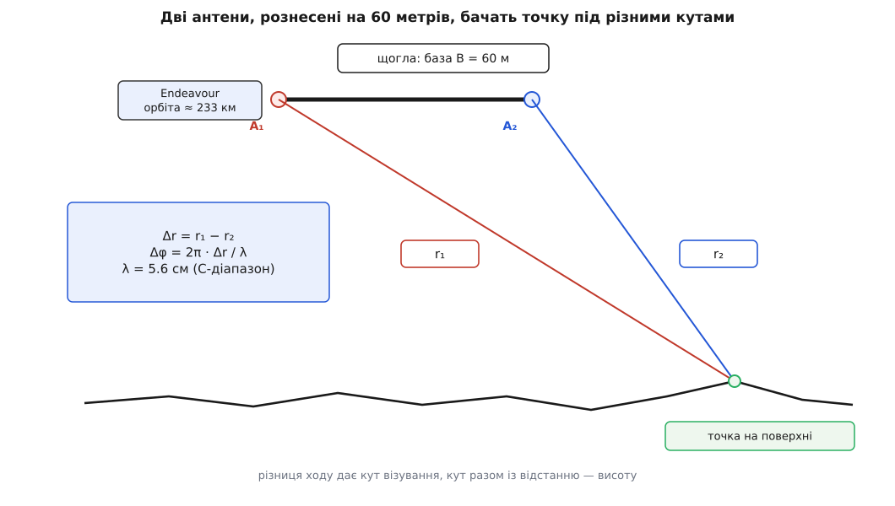
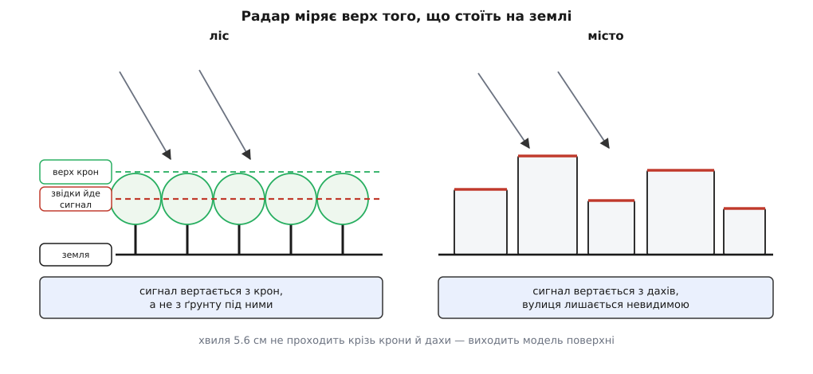
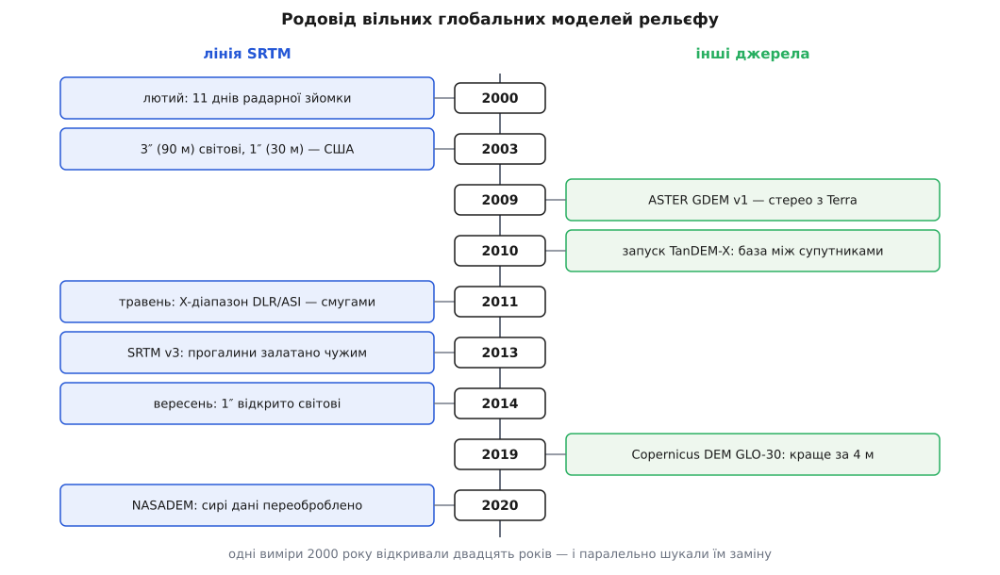

# 📜 Одинадцять днів, за які виміряли суходіл

Перша однорідна карта висот усієї заселеної суші постала не з десятиліть наземних робіт, а з одинадцяти днів польоту космічного шатла в лютому 2000 року — і майже все, що вільна програма сьогодні знає про рельєф, походить або з тих одинадцяти днів, або з пізніших спроб залатати їхні вади.

## Чого бракувало до 2000 року

Висоти міряли задовго до супутників, і міряли добре: тріангуляція, нівелювання, аерофотограмметрія давали сантиметри там, де хтось за це платив. Біда була не в точності, а в тому, що ці дані незіставні між собою. Кожна країна знімала свою територію у свій час, від свого нуля висот, зі своєю густиною точок і зі своїм правом доступу. Над океанами, пустелями й тропічним лісом не було нічого. Зшити з цього суцільну модель планети — приблизно те саме, що складати книжку зі сторінок різних видань: кожна сторінка правильна, а разом вони не читаються.

Замовник однорідного покриття був цілком конкретний. SRTM (Shuttle Radar Topography Mission — місія топографічної зйомки з шатла) робили спільно NASA й американське National Imagery and Mapping Agency, NIMA — військово-картографічне відомство, яке в листопаді 2003 року перейменували на National Geospatial-Intelligence Agency, NGA. Це партнерство зафіксоване в офіційних матеріалах місії, і воно пояснює те, що станеться з даними далі: коли одну половину роботи оплачує оборонне відомство, режим доступу до результату визначає не наукове агентство.

## Одна орбіта, дві антени, шістдесят метрів між ними

Щоб дістати з зображення висоту, треба два погляди з різних точок. Стереофотограмметрія бере два знімки й шукає ту саму деталь на обох. Радар може інакше й значно точніше: він міряє не яскравість, а фазу відбитої хвилі.

> Дві хвилі, що прийшли до приймача різними шляхами, складаються з різницею фаз, і ця різниця прямо пропорційна різниці довжин шляхів. Саме на цьому тримається будь-який інтерферометр: непомітну різницю відстаней він перетворює на добре вимірювану зміну фази. Основа явища — [інтерференція хвиль](book:physics/wave-interference).

Різницю ходу можна міряти з двох окремих прольотів над тим самим місцем. Але між двома прольотами листя ворухнеться, ґрунт підсохне, випаде сніг — і дрібний візерунок відбиття, з якого й береться фаза, перестане збігатися сам із собою. До того ж атмосфера між прольотами затримає сигнал по-різному, і ця затримка додасться до висоти як невідома домішка. Обидві біди зникають, якщо обидва погляди зробити **одночасно**: тоді це та сама мить, та сама атмосфера й той самий візерунок.

Ціна одночасности — жорстка база. Дві антени треба рознести в просторі й тримати на відомій відстані одна від одної. Звідси й найпомітніша деталь місії: щогла завдовжки шістдесят метрів. У вантажному відсіку вона лежала складеною в контейнері, а на орбіті розгорталася у ферму, на кінці якої стояла друга антена. Шістдесятиметрове плече з масою на кінці працює на орбітальний апарат як важіль, тож на вершині щогли поставили газовий двигунець, що втримував конструкцію; його система дала збій, витрата робочого тіла подвоїлася, і політ довелося переплановувати на ходу — це задокументовано у звітності місії.

Решта чисел так само конкретна. Endeavour стартував 11 лютого 2000 року о 17:43 UTC, сів 22 лютого о 23:23 UTC, політ тривав 11 діб 5 годин 39 хвилин. Орбіта — нахил 57°, висота від 224 до 242 кілометрів. Зйомка забрала 222 години 23 хвилини й покрила 99.98 % запланованої площі; накопичилося близько восьми терабайтів, які писали на бортові стрічки — передати таке на Землю по радіо тоді не було як. Екіпаж із шести осіб був міжнародний: серед них німець Ґергард Тіле й японець Мамору Морі.

Радарів було два. C-діапазон вела NASA, X-діапазон — німецька DLR разом з італійською ASI. C-радар мав ширшу смугу огляду, X-радар — вужчу, зате детальнішу. Орбіту планували під смугу C, тож X-дані вийшли не суцільним килимом, а окремими стьожками з прогалинами між ними. Ця дрібна конструктивна деталь потім обернеться на прикру історію з доступом.

## Як різниця ходу перетворюється на висоту

Випромінювала головна антена, а приймали обидві. Тому різниця ходу до тієї самої точки на поверхні входить у фазу один раз, а не двічі:

```
Δr = r₁ − r₂            різниця відстаней від двох антен до точки
Δφ = 2π · Δr / λ        фазова різниця між каналами
λ  = 5.6 см             C-діапазон, ≈ 5.3 ГГц
```



*Різниця ходу до тієї самої точки мала, але фаза робить її вимірюваною*

Знаючи Δr і базу, дістаємо кут, під яким антена дивиться на точку; знаючи кут і відстань до неї, дістаємо висоту. Питання лише в тому, наскільки чутливе це перетворення. Подивімося, якій зміні висоти відповідає **один повний оберт фази** — цю величину називають висотою неоднозначности:

```
h_a ≈ λ · r · sin θ / B⊥

λ  = 0.056 м            довжина хвилі
r  ≈ 3.5·10⁵ м          похила відстань до точки
θ  ≈ 45°                кут візування, sin θ ≈ 0.71
B⊥ ≈ 45 м               складова бази поперек променя

h_a ≈ 0.056 · 3.5·10⁵ · 0.71 / 45 ≈ 3.1·10² м
```

Отже одна повна смуга інтерференції — це близько трьохсот метрів висоти. Щоб мати похибку в десяток метрів, фазу треба міряти з точністю приблизно до тридцятої частки оберту. Це і є справжня складність місії: не політ і не щогла, а вимірювання фази стабільно, по всій смузі, впродовж дев'яти діб безперервної зйомки. Проєктна вимога до SRTM була не гірша за 16 метрів абсолютної вертикальної похибки на рівні довіри 90 % — і арифметика вище показує, звідки береться саме такий порядок.

*(Числа в цьому підрахунку — оцінка за стандартною формулою інтерферометрії з правдоподібними значеннями геометрії, а не цитований показник місії; порядок величини вони передають правильно.)*

> 🔧 **Навіщо це.** Висота неоднозначности лінійно залежить від бази: довша база — тонші смуги й чутливіше вимірювання. Але коли смуга стає надто тонкою, сусідні оберти фази зливаються, і розкрутити їх у суцільну висоту вже не вдається. Шістдесят метрів — не рекорд конструкторів, а компроміс між чутливістю й розв'язністю. Та сама логіка згодом дозволить обирати базу вільно, коли антени рознесуть на два окремі супутники.

Роздільність у метри з висоти двохсот кілометрів жодна фізична антена не дає — її **синтезують**, складаючи сотні послідовних імпульсів, знятих із різних точок траси, в одну довгу віртуальну антену. Без цього прийому вся розмова про фазу була б безпредметна: [радар із синтезованою апертурою](book:electronics/sar-interferometry) — та основа, на якій стоїть і SRTM, і все, що прийшло після неї.

## Чому 56° південної і 60° північної

Траса апарата з нахилом орбіти 57° сягає 57° північної й південної широти — далі вона просто не заходить. Радар при цьому дивиться не вниз, а вбік, тож смуга зйомки зсунута від траси в один бік. На північ вона виходить за трасу й дотягується до 60°, а на південь, навпаки, не добирає й обривається на 56°. Звідси й несиметричні межі покриття, і приблизно 80 % площі суходолу.

Поза покриттям лишилися північ Скандинавії й Сибіру, Ґренландія, канадська Арктика й уся Антарктида. Для програми, що читає висоти, це не абстракція: за 60-ю паралеллю глобальний набір просто закінчується, і там доводиться братися до інших джерел.

## Три секунди для світу, одна для своїх

З 2003 року дані почали роздавати — але не всі однаково. Світові дісталася сітка з кроком 3 кутові секунди, тобто близько 90 метрів на екваторі. Повний крок в 1 кутову секунду (близько 30 метрів) був доступний лише над територією Сполучених Штатів. Це зафіксовано в офіційному повідомленні про пізніше зняття обмеження.

Різниця тут не косметична. Утричі грубший крок — це вдев'ятеро більша площа комірки: хребет, який тридцятиметрова сітка тримає хребтом, дев'яностометрова розмазує на схил, а вузьку долину, якою піде повінь, стирає зовсім. Планування дренажу, траси дороги, зони затоплення чи покриття мобільної мережі на такій сітці дає систематично іншу відповідь.

Найгостріше в цій історії те, що детальніші дані **вже існували** — ті самі стрічки, та сама зйомка лютого 2000 року. Річ була не в обробленні й не в грошах, а в рішенні.

Рішення змінили 23 вересня 2014 року: Білий дім оголосив на кліматичному саміті глав держав ООН у Нью-Йорку, що тридцятиметрові дані відкривають усьому світові. Першою пішла Африка, решту обіцяли впродовж року, і Близький Схід закрили в серпні 2015-го. Мотив назвали прямо — готовність до посух, повеней, зсувів і штормових нагонів; NASA у своєму повідомленні додала до цього безпеку авіації й цивільне будівництво.

Німецько-італійський X-діапазон мав окрему долю: DLR відкрила його ще в травні 2011 року, з кроком близько 25 метрів. Але це були ті самі стьожки з прогалинами, бо орбіту колись рахували під смугу C-радара. Детальніші виміри частини планети лежали у відкритому доступі на три роки раніше — просто не суцільним покриттям.

## Модель поверхні, а не землі

Хвиля завдовжки 5.6 сантиметра вертається від першого, що її розсіє. Над лісом це крони, над містом — дахи. Тому число в комірці означає не «висота ґрунту тут», а «висота того, що тут стоїть».



*Радар міряє верх покриву, а не землю під ним*

Найнеприємніше не саме зміщення, а те, що воно **не випадкове**. Похибка корелює з рослинним покривом: під суцільним лісом вона додатна й тримається на десятки метрів, на голому полі поруч — майже нульова. Усереднення тут не рятує, бо усереднювати нічого: це не шум, а систематичний зсув, прив'язаний до карти покриву. Модель повені над лісистою заплавою на таких висотах систематично занижує глибину затоплення; розрахунок видимости над містом, навпаки, випадково виходить правдоподібний, бо дахи справді затуляють огляд.

Є ще одна деталь, без якої числа не мають сенсу: висоти в наборі відлічені не від еліпсоїда, а від геоїда моделі EGM96, тоді як планові координати — у WGS84. Змішати ці два нулі в одній програмі — типова помилка на десятки метрів; про природу самих поверхонь відліку — [геоїд і висота над рівнем моря](book:math/geoid-and-amsl).

## Прогалини й латки

Радар не всюди чує відповідь. Крутий схил, відвернутий від променя, лежить у радарній тіні — сигнал туди не доходить. Протилежний схил, надто крутий назустріч променю, дає накладання: вершина повертається раніше за підніжжя, і два різні місця зливаються в один відлік. Спокійна вода й рівний пісок відбивають дзеркально — енергія йде геть від антени, назад вертається самий шум, узгодженість фази падає, висоти немає.

Сумарно порожнечі склали не більше за 0.2 % знятої площі. Число мале, але розподілене воно найгірше з можливих: діри сидять саме у високих горах, там, де гідролог або планувальник польоту найбільше потребує значень.

Латали їх поетапно. Друга версія набору пройшла редагування в NGA: окреслені берегові лінії, вирівняні водойми. Третя, опублікована у вересні 2013 року, закрила порожнечі чужими даними — ASTER GDEM версії 2, GMTED2010 і американським NED. Для програми тут важлива одна річ: залатане значення виглядає рівно так само, як виміряне, хоча міряли його іншим приладом або не міряли зовсім. Якщо ваш розрахунок чутливий до цього, слід тримати маску походження, а не саму лише сітку висот — і, до речі, у роздачі це звичайні тайли у своїх [форматах геоданих](book:programming/geo-data-formats), де така маска йде окремим шаром.

Останній крок у цій лінії — NASADEM, випущений 2020 року. Це не нова зйомка, а переоброблення **сирих** радарних даних 2000 року: як вертикальну опору взяли виміри лазерного альтиметра ICESat GLAS, поліпшили геоприв'язку, порожнечі заповнили ASTER GDEM 2 і японським AW3D30, висоти перерахували до геоїда. Двадцять років потому ті самі стрічки дали кращу відповідь — не тому, що змінилися виміри, а тому, що навколо них зʼявився кращий довідковий матеріал.

## Що прийшло на зміну

Першою альтернативою стала оптика. Прилад ASTER на супутнику Terra знімає ту саму смугу двічі — вертикально й назад, окремим ближнім інфрачервоним каналом, — тож із пари знімків будується стереопара без жодного радара. ASTER GDEM версії 1 вийшов у червні 2009 року, склеєний приблизно з 1.3 мільйона знімків, із кроком 1 кутова секунда й покриттям від 83° північної до 83° південної широти — тобто далеко за межі того, куди дотягнувся шатл. Версія 2 з'явилася в жовтні 2011-го, версія 3 — у серпні 2019-го.

Слабина тут суто оптична: потрібне безхмарне небо, а склеювання багатьох різночасних знімків лишає артефакти. Перша версія офіційно йшла з поміткою «дослідницької якости». Тому історична роль ASTER GDEM вийшла не та, на яку розраховували: він став не заміною SRTM, а постачальником латок для його порожнеч.

Справжня зміна прийшла з поверненням до інтерферометрії — але без щогли. 21 червня 2010 року запустили TanDEM-X, супутник-близнюк до вже наявного TerraSAR-X. Два апарати літають у формації на відстані переважно 250–500 метрів один від одного, і саме ця відстань тепер править за базу. База перестала бути конструкцією й стала параметром: її змінюють між кампаніями під характер рельєфу — довшу там, де потрібна чутливість, коротшу над горами, де смуги інакше злилися б. Зйомку вели з 2011 по 2015 рік; глобальна модель вийшла з кроком краще за 12 метрів і відносною точністю близько 2 метрів.

З неї зробили комерційний WorldDEM, а з WorldDEM — Copernicus DEM у варіантах GLO-30 і GLO-90, які з 2019 року роздають вільно. Абсолютна вертикальна похибка там краща за 4 метри на рівні 90 %, водойми вирівняні, річки приведені до узгодженого стоку. Це вчетверо краще за проєктну вимогу SRTM — і при цьому все ще модель поверхні: фізика не змінилася, крони так само не пропускають хвилю, змінилися тільки числа.



*Двадцять років між першою зйомкою і вільним доступом до кращої за неї моделі*

За ці двадцять років змінилася не сама лише точність. Виміри 2000 року стали доступними світові після оголошення на саміті — доступ був подією. Дані Copernicus вільні за задумом, без окремого рішення й без окремої дати. Для програми, що читає висоти, ця різниця важить не менше за чотири метри проти шістнадцяти.
