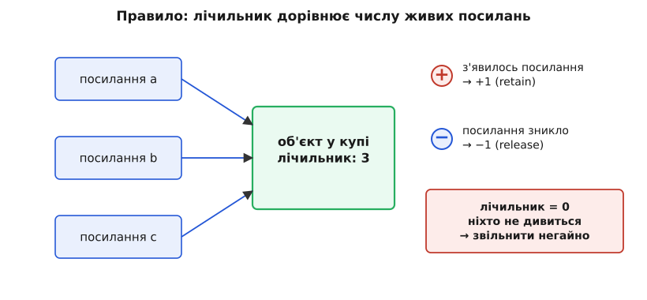
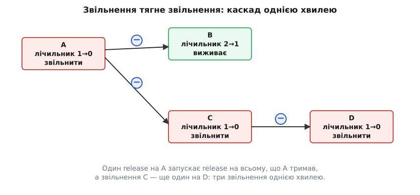
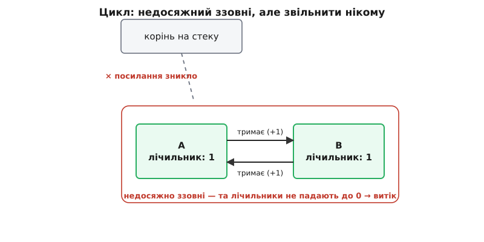

# Підрахунок посилань

<preknowlist>
- [Купа](topic:programming/heap-dynamic-memory) — звідки беруться довговічні об'єкти, які хтось мусить згодом звільнити вручну; без задачі «виділив — колись віддай назад» немає й потреби в підрахунку.
- [Адреси й покажчики](topic:programming/addresses-pointers) — посилання на об'єкт це, по суті, його адреса, і кілька покажчиків можуть дивитися на той самий об'єкт у купі одночасно.
</preknowlist>

Ти виділив об'єкт у купі й дав на нього подивитися половині програми. Список у кеші, той самий список у відповіді на запит, він же в фоновому завданні, що дораховує підсумок. Настає момент, коли частина цих місць уже відпрацювала. І тут спливає питання, від якого нікуди не втекти: **коли цей об'єкт можна звільнити?**

Схибити можна у два боки. **Звільниш зарано**, коли на об'єкт ще дивиться чийсь покажчик, — а пам'ять під ним система вже віддала комусь іншому. Покажчик тепер указує на чуже: прочитаєш — дістанеш сміття, запишеш — тихо зіпсуєш чужий об'єкт, і збій вигулькне через годину зовсім не там, де причина. Такий покажчик на звільнене звуть **звисаючим**. **Не звільниш ніколи** — і навпаки: об'єкт вічно займає пам'ять, хоч ним ніхто не користується; у довгому процесі такі об'єкти копичаться, аж поки не з'їдять усю. Це витік.

Здавалося б, розв'язок очевидний: хай останній, хто скористався об'єктом, його й звільнить. Але спробуй указати пальцем на цього «останнього». Кеш не знає, чи вже впоралося фонове завдання. Завдання не знає, чи викине кеш свій запис за секунду. Жодне з цих місць не володіє фактом, який тут єдино потрібен — **чи є ще хтось, крім мене**. Цей факт не локальний для жодного власника: він про всіх одразу. І саме тому ручне `free` у точці «я закінчив» — це ставка навмання: ти закладаєшся, що ти останній, і рано чи пізно закладаєшся неправильно.

Отут і народжується ідея, до безсоромності проста. Якщо жоден власник не знає, скільки їх усього, — хай сам об'єкт веде цей рахунок.

## Лічильник замість здогаду

Причепимо до кожного об'єкта в купі одне маленьке число — **скільки посилань зараз на нього дивиться**. Не хто саме, а просто скільки. І домовимося тримати це число завжди правдивим, за трьома простими правилами.

Коли з'являється нове посилання на об'єкт — хтось скопіював покажчик, поклав його в поле, передав у список — лічильник збільшуємо на одиницю. Цю операцію традиційно звуть **захопленням** (англ. *retain* — утримати) або просто `incref`. Коли посилання зникає — змінна вийшла з області видимості, поле перезаписали іншим, власника знищили — лічильник зменшуємо на одиницю; це **звільнення посилання** (англ. *release* — відпустити), або `decref`. І третє, заради чого все затівалося: **щойно лічильник упав до нуля** — на об'єкт більше ніхто не дивиться, дотягтися до нього неможливо, — його звільняємо негайно.



*Лічильник перетворює глобальне питання «чи користується цим ще хтось?» на локальне число, яке кожна операція з посиланням уміє підправити сама. Захоплення додає одиницю, звільнення віднімає, а нуль — це доказ, що останній спостерігач пішов.*

Уся сила тут — у другому реченні підпису. Питання «чи є ще хтось» вимагало оглянути всю програму; число «скільки» кожен окремий крок уміє підтримати, нікуди не зазираючи. Скопіював покажчик — додай одиницю тут-таки. Затер покажчик — відніми одиницю тут-таки. Ніхто нікого не опитує, ніхто не веде глобального реєстру власників: об'єкт сам носить свій рахунок, а розкидані по програмі операції лише чесно його підправляють. Нуль стає **доказом**, а не здогадом: якщо кожне захоплення й кожне звільнення враховане, то нуль означає, що останнє посилання щойно зникло, і помилитися тут нема на чому.

Ось тільки застереження «якщо кожне враховане» і є вся складність, яку ця проста ідея ховає.

## Тримати рахунок правдивим — оце і є вся робота

Легко сказати «додай при появі, відніми при зникненні». На практиці кожне присвоєння покажчика — це водночас і поява, і зникнення, і зробити їх треба в правильному порядку, інакше рахунок збреше.

Візьмімо звичайне `p = q`, де і `p`, і `q` — це наші розумні покажчики з лічильником. Що тут відбувається насправді? По-перше, `p` перестає дивитися на свій старий об'єкт — той старий об'єкт втрачає одне посилання, треба `release`. По-друге, `p` починає дивитися на об'єкт, на який дивиться `q` — той об'єкт отримує нове посилання, треба `retain`. Здавалося б, порядок байдужий. Він не байдужий. Розгляньмо присвоєння самому собі, `p = p` (яке в реальності приховане: `a[i] = a[j]`, де `i` випадково дорівнює `j`). Якщо спершу зробити `release` старого об'єкта `p`, а він єдиний власник — лічильник упаде до нуля, об'єкт звільниться, і `retain`, який ми зробимо наступним, збільшить лічильник уже мертвого об'єкта. Правильний порядок протилежний: **спершу захопити нове, потім звільнити старе**. Тоді самоприсвоєння підніме лічильник до двох і опустить до одного — об'єкт переживе операцію, як і мусив.

Ось цей самий обов'язковий порядок у операторі присвоєння лічильникового покажчика:

```cpp
Handle& Handle::operator=(const Handle& other) {
    other.inc();      // спершу захопити нове: рятує від p = p
    dec();            // тоді звільнити старе (може впасти до 0 і звільнитися)
    obj_ = other.obj_;
    return *this;
}
```

Дрібниця в два рядки, а переставиш їх місцями — дістанеш звільнення живого об'єкта в найбезневиннішому на вигляд коді. І таких дрібниць повно: копіювання покажчика, передавання у функцію за значенням, повернення з функції, знищення локальної змінної, перезапис елемента масиву — **кожна** така подія мусить бути спарована з `retain` чи `release`, і забути хоч одну означає або витік (забув `release`), або передчасну смерть (забув `retain`, або зробив зайвий `release`).

Варто розрізняти тут і те, що саме копіюється. Присвоєння `p = q` — це **поверхнева копія**: обидва покажчики тепер дивляться на *той самий* об'єкт, лічильник просто зріс. Це не те саме, що [глибока копія](topic:programming/deep-shallow-copy), яка створила б окремий дублікат об'єкта з власним, новим лічильником. Підрахунок посилань — механізм саме спільного володіння одним примірником, а не розмноження; коли справді треба незалежна копія, її роблять окремо.

Саме тому, що людина неминуче колись забуде парну операцію, підрахунок посилань майже ніде не лишають на ручний розсуд. Його ховають усередину типу-обгортки, який робить `retain` у копіювальному конструкторі й `release` у деструкторі автоматично — тоді облік ведуть не програмісти, а компілятор, розставляючи виклики за правилами мови. Як саме збудувати такий тип із нуля — з окремим блоком обліку, підтримкою слабких посилань і потокобезпечним лічильником — розібрано покроково в [проєкті «Розумний покажчик із підрахунком посилань»](topic:programming/reference-counting/proj-shared-ptr.md): там наростає повна робоча реалізація в стилі `shared_ptr`.

## Головна нагорода — миттєве й передбачуване звільнення

Заради чого вся ця морока з обліком кожного покажчика? Заради властивості, якої не дає жоден інший підхід так дешево: **об'єкт помирає точно в ту мить, коли зникає останнє посилання, і в точно відомому місці коду**.

Це не абстрактна краса. Пам'ять — не єдиний ресурс, який треба вчасно віддати. Відкритий файл, мережеве з'єднання, захоплений замок, дескриптор пристрою — усе це має бути звільнене, і бажано в передбачуваний момент, а не «колись потім». Коли час життя такого ресурсу прив'язати до лічильника посилань, звільнення відбувається **детерміновано**: закрив останній власник — файл закрився тут-таки, на цьому рядку, а не за десять секунд, коли якийсь фоновий механізм зволить придивитися до пам'яті. Саме на цьому стоїть [прив'язка ресурсу до часу життя об'єкта (RAII)](topic:programming/raii): деструктор, що спрацьовує на нулі лічильника, — надійна точка, де ресурс гарантовано повертають системі.

Порівняй це з підходом, де момент смерті об'єкта визначає окремий [збирач сміття](topic:programming/garbage-collection), періодично обходячи всю живу пам'ять. Там об'єкт стане недосяжним в одну мить, а фізично звільниться — коли до нього дійде черговий обхід, тобто невідомо коли. Для чистої пам'яті це стерпно. Для файлу чи замка — ні: тримати з'єднання відкритим «ще трохи, поки збирач не прокинеться» означає вичерпати ліміт дескрипторів на рівному місці. Передбачуваність моменту звільнення — це те, чим підрахунок посилань бере, і чого нащадкам-збирачам доводиться доробляти окремими милицями.

## Тільки смерть буває заразною

У цієї миттєвості є зворотний бік, про який згадують рідше. Об'єкт майже ніколи не самотній: він сам тримає посилання на інші об'єкти — вузол списку вказує на наступний, об'єкт-власник тримає свої поля. Коли ми звільняємо об'єкт, ми мусимо чесно зменшити лічильники всього, на що він дивився: його посилання теж зникають. А отже, звільнення одного об'єкта може обвалити лічильник наступного до нуля — і той теж звільниться, зменшивши лічильники своїх дітей, і так далі.



*Одне-єдине звільнення посилання на вершину структури розганяє хвилю звільнень усім, що звідти було досяжне лише через неї. Для дерева з мільйона вузлів це мільйон звільнень, виконаних за один синхронний спалах — рівно тоді, коли керування дійшло до останнього `release`.*

Ось чому поширене гасло «підрахунок посилань не має пауз, на відміну від збирача сміття» — лише півправда. Пауз від глобального обходу пам'яті справді немає. Зате є **каскад**: відпустив посилання на корінь величезної структури — і потік застряг, доки рекурсивно не звільниться кожен її вузол. Це той самий сплеск затримки, тільки прив'язаний не до таймера збирача, а до конкретного `release` у твоєму коді. У системах, де важлива рівна затримка, з цим борються **відкладеним звільненням**: об'єкти з нульовим лічильником не знищують одразу, а складають у чергу й розбирають потроху, обмежену порцію за раз, щоб розмазати роботу в часі.

## За що доводиться платити

Миттєвість і детермінізм не безкоштовні, і чесно розкласти ціну варто, бо саме вона визначає, де підрахунок посилань доречний, а де ні.

Перше — **місце**. Кожному об'єктові потрібне поле під лічильник, зазвичай ціле машинне слово. Для великих об'єктів це дрібниця; для мільйонів дрібних вузлів зайве слово на кожен помітно роздуває пам'ять.

Друге, підступніше — **час і кожен дотик до покажчика стає записом**. У підході зі збирачем сміття копіювання покажчика безплатне: скопіював адресу — і по всьому. Тут же кожне копіювання й кожне знищення посилання зобов'язане підправити лічильник, тобто **записати** в пам'ять. Навіть якщо ти лише читаєш спільний об'єкт і нікуди його не міняєш, сам факт, що ти на нього подивився через ще один покажчик, змушує систему писати в його лічильник — двічі: плюс при вході, мінус при виході. Дані, які логічно доступні лише для читання, фізично раз у раз перезаписуються.

Третє випливає з другого й болить найдужче — **багатопотоковість**. Якщо той самий об'єкт бачать кілька потоків одночасно (а це типова причина ним ділитися), то й лічильник вони смикають одночасно. Звичайне `лічильник += 1` з кількох потоків — це [гонка](topic:programming/atomicity-races): двоє прочитали однакове значення, обидва додали одиницю, записали — і замість двох захоплень зараховане одне. Загублене захоплення означає передчасне звільнення живого об'єкта. Щоб цього не сталося, лічильник роблять **атомарним** — інкремент і декремент виконують неподільною апаратною операцією. А атомарна операція не лише сама собою дорожча за звичайне додавання: вона перетворює лічильник на **точку розжарення**. Рядок кеша з лічильником змушений безперервно перескакувати між ядрами, які цей об'єкт чіпають, — навіть коли всі вони об'єкт тільки читають. Незмінні на позір дані тягнуть за собою одну люто змінну комірку, і вона стає вузьким місцем.

> 🔧 **Навіщо це.** Коли профіль показує, що програма впирається в підрахунок посилань, винне майже завжди третє — атомарний лічильник на гарячому спільному об'єкті. Класична пастка: незмінний конфіг чи довідник, який усі потоки лише читають, роздали через лічильниковий покажчик — і тепер кожне читання б'є атомарним записом по одному рядку кеша, а ядра з'ясовують стосунки за право його змінити. Ліки — не ділити такі об'єкти через лічильник узагалі (роздати сирий покажчик на щось, що житиме до кінця програми), або тримати локальні копії покажчика в межах потоку, щоб не смикати спільний лічильник на кожен чих.

Мова Rust робить цей компроміс видимим прямо в типах: `Rc` — лічильниковий покажчик зі **звичайним**, неатомарним лічильником, дешевий, але тільки в межах одного потоку; `Arc` (від *atomically reference counted*) — той самий покажчик з **атомарним** лічильником, придатний між потоками, але дорожчий. Ти платиш за атомарність рівно тоді, коли справді переходиш межу потоку, і жодним тактом раніше — компілятор не дасть віддати `Rc` в інший потік. Це прямий відбиток [моделі власності Rust](topic:programming/rust-ownership) на ціну підрахунку. І окремо варто затямити: атомарний лічильник захищає **сам лічильник**, а не вміст об'єкта. Те, що двоє потоків безпечно ділять покажчик, не означає, що вони можуть безпечно міняти об'єкт під ним, — для цього потрібен окремий замок. Атомарність обліку й потокобезпека даних — різні речі.

## Сліпа пляма, яку не залатати підрахунком

А тепер вада, через яку підрахунок посилань ніколи не буває єдиним механізмом у серйозній системі. Вона не в реалізації — її неможливо виправити, не змінивши самої ідеї.

Уяви два об'єкти, що тримають посилання одне на одного. Батько тримає дитину, дитина тримає назад батька. Дуже звичайна конфігурація: вузол дерева з посиланням на батька, два спостерігачі, що знають один про одного, будь-який граф із зустрічними ребрами. Лічильник батька — одиниця (на нього дивиться дитина), лічильник дитини — одиниця (на неї дивиться батько). Тепер програма відпускає єдине зовнішнє посилання на цю пару. Ззовні до них більше не дотягтися — вони випали зі світу. Але їхні лічильники не нульові: батько все ще має одиницю від дитини, дитина — одиницю від батька. Обидва тримають одне одного за руки й тонуть разом, і жоден лічильник ніколи не впаде до нуля.



*Цикл із двох взаємних посилань тримає сам себе живим: зовні недосяжний, зсередини — з ненульовими лічильниками. Підрахунок ніколи їх не звільнить, бо кожен об'єкт чесно бачить одного, хто на нього дивиться, — просто цей «хтось» замкнений із ним в одному колі.*

Чому підрахунок посилань принципово тут безсилий? Бо лічильник — це **локальний** факт: скільки стрілок цілиться в мене особисто. А досяжність — факт **глобальний**: чи існує шлях до мене від якогось живого кореня програми. Локальне число не може відповісти на глобальне питання. Для об'єктів у циклі локальна відповідь «на мене дивляться» правдива й водночас нічого не варта, бо той, хто дивиться, сам вивалився з досяжності. Це не помилка в коді обліку — це стеля самого підходу. Підрахунок посилань бачить стрілки, але не бачить, чи веде хоч одна з них назовні кола.

## Дві втечі з циклу

Раз підрахунок сам циклів не бере, потрібен додатковий механізм. Історично склалося два, і вони не виключають один одного.

Перший — **слабкі посилання**. Ідея прямо цілить у корінь біди: зробимо посилання, яке дивиться на об'єкт, але **не збільшує його лічильник**. Таке посилання не тримає об'єкт живим — воно лише спостерігає. Тепер цикл розмикають навмисно: одне з двох зустрічних посилань роблять слабким. Батько тримає дитину звичайним (сильним) посиланням, а дитина дивиться на батька **слабким**. Поки живий батько, дитина бачить його; коли останнє сильне посилання на батька зникає, його лічильник падає до нуля попри слабке посилання дитини — бо слабкі в лічильнику не рахуються, — і батько звільняється як належить. Розрив кола коштує одного свідомого рішення: яке з ребер тут «власницьке», а яке — лише «знайомство».

Плата за слабке посилання в тому, що на нього не можна просто розіменувати покажчик і піти читати: об'єкта під ним може вже не бути. Тому слабке посилання спершу **підвищують** до сильного (в C++ це `weak_ptr::lock`): операція атомарно перевіряє, чи об'єкт іще живий, і, якщо так, повертає повноцінне сильне посилання (заодно піднявши лічильник), а якщо ні — повертає порожнечу. Ти або дістаєш гарантовано живий об'єкт на час, поки тримаєш це тимчасове сильне посилання, або чесне «його вже нема». Детальніше про різновиди й поведінку таких посилань — у темі [слабкі й м'які посилання](topic:programming/weak-references).

Другий шлях — **збирач циклів**. Замість перекладати розрив кіл на плечі програміста, система час від часу сама шукає цикли сміття. Робить вона це вже не підрахунком, а частковим обходом: бере підозрілі об'єкти, подумки віднімає внутрішні посилання й дивиться, чи лишилося в когось посилання ззовні кола; у кого не лишилося — той цикл і є недосяжне сміття. Це **гібрид**: підрахунок посилань миттєво прибирає переважну більшість об'єктів (усе, що не в циклах), а зрідка запущений збирач добирає ті самі цикли, яких підрахунок не бачить.

Саме так влаштований [CPython](topic:programming/reference-counting/hist-refcounting-origins.md): кожен об'єкт мови несе своє поле `ob_refcnt`, макроси `Py_INCREF`/`Py_DECREF` ведуть облік і звільняють об'єкт на нулі негайно — а поверх цього працює окремий поколіннєвий збирач саме циклів, доданий у Python 2.0. Підрахунок робить дешеву буденну роботу, збирач — рідкісну складну. Ідею такого обходу докладніше розбирає тема [збирання сміття](topic:programming/garbage-collection).

> 🔧 **Навіщо це.** У повсякденному коді цикли трапляються частіше, ніж здається: двобічні зв'язки «батько ↔ дитина», спостерігач, що тримає посилання на джерело подій, кеш, який тримає те, що тримає його. Практичне правило просте: коли малюєш структуру з посиланнями в обидва боки, одразу питай себе, який напрямок тут **власницький** (тримає життя), а який — **зворотний погляд** (лише знайомство). Власницький лишай сильним, зворотний роби слабким. Пропустиш це — і в системі без збирача циклів дістанеш повільний витік, який нічим себе не виказує, поки процес не почне пухнути через дні роботи.

## Сильні й слабкі разом: керівний блок

Щоб і сильні, і слабкі посилання співіснували, одного лічильника мало — потрібні два, і жити вони мусять в окремому місці. Розберімо це на моделі `shared_ptr`/`weak_ptr`, бо вона показує механізм у чистому вигляді.

Поряд із самим об'єктом заводять маленьку структуру — **керівний блок** — з двома лічильниками: скільки сильних посилань і скільки слабких. Об'єкт знищують, коли **сильних** стає нуль: живих власників не лишилося. А от сам керівний блок звільняють пізніше — коли й сильних, і слабких нуль. Чому не разом з об'єктом? Бо слабкі посилання, які ще існують, мусять десь прочитати, що об'єкта вже нема; якби блок зник разом з об'єктом, слабкому не було б куди подивитися й спитати «ти живий?». Тому блок переживає об'єкт рівно доти, доки на нього дивиться бодай одне слабке посилання.


*Два лічильники розводять два питання, які плутати не можна: «чи є ще власник» (сильні) вирішує долю об'єкта, «чи є ще спостерігач» (слабкі) — долю самого блока обліку. Слабке посилання дивиться на блок, а не на об'єкт напряму, тому переживає його смерть і чесно про неї дізнається через `lock`.*

Ця конструкція пояснює й дрібну, але показову деталь. Коли розумний покажчик створюють одразу з об'єктом єдиною операцією (в C++ це `make_shared`), керівний блок і сам об'єкт кладуть в одну ділянку пам'яті — одне виділення замість двох, швидше й щільніше. Але тоді пам'ять під об'єкт не можна віддати системі, поки живий блок, — а блок живий, поки є слабкі посилання. Виходить парадокс: об'єкт уже «мертвий» (сильних нуль, деструктор відпрацював), а його байти ще зайняті, бо злиплися з блоком, який тримає слабке посилання. Дрібниця, поки об'єкт малий; пастка, якщо це величезний масив, який слабке посилання невидимо не дає віддати. Повна реалізація керівного блока з обома лічильниками й безпечним `lock` зібрана в [проєкті «Розумний покажчик із підрахунком посилань»](topic:programming/reference-counting/proj-shared-ptr.md).

## Де підрахунок посилань живе насправді

Ідея давня: її описав [Джордж Коллінз ще 1960 року](topic:programming/reference-counting/hist-refcounting-origins.md) — задовго до того, як з'явилися мови, де вона стала непомітною основою керування пам'яттю. Сьогодні підрахунок посилань — не екзотика, а робочий кінь цілих екосистем, і корисно бачити, у скількох різних оболонках він трапляється.

CPython, як уже сказано, тримає ним усю пам'ять мови, добираючи цикли окремим збирачем. C++ дає `std::shared_ptr` — той самий підрахунок із сильними й слабкими лічильниками, що виріс із бібліотеки Boost, пройшов через технічний звіт TR1 і став частиною стандарту у C++11. Rust розводить `Rc` та `Arc` за ціною атомарності. У світі Apple працює **автоматичний підрахунок посилань (ARC)**: компілятор Clang сам розставляє виклики `retain` і `release` у точках, де програміст їх забув би, — лічильник нікуди не подівся, автоматизували лише виклики, і сталося це для Objective-C близько 2011 року, а згодом лягло в основу керування пам'яттю у Swift. Модель компонентів COM від Microsoft збудована на парі `AddRef`/`Release`, якими об'єкт рахує своїх клієнтів через межі мов і процесів. Різні світи, різний синтаксис — а всередині те саме число, що росте на захопленні й падає на звільненні.

## Підрахунок проти обходу: коли платити

Щоб покласти підрахунок посилань на місце, його треба поставити поруч із головним суперником — трасувальним [збирачем сміття](topic:programming/garbage-collection), що періодично обходить усю досяжну пам'ять від коренів і звільняє все, чого не торкнувся. Різниця між ними — не в тому, «хто кращий», а в тому, **коли** система платить за керування пам'яттю.

Підрахунок посилань платить **безперервно й дрібними монетами**. Кожна операція з покажчиком трохи дорожча, зате вартість розмазана по всій роботі й пропорційна саме кількості дій із посиланнями, а не обсягу живих даних. Об'єкти помирають миттєво й у передбачуваному місці, зайвої пам'яті про запас не треба — але за це маєш накладні на кожен дотик до покажчика, каскади на великих структурах і повну сліпоту до циклів.

Трасувальний збирач платить **зрідка й великими сумами**. Копіювання покажчиків безплатне, циклам він радий не менше, ніж деревам, — обхід від коренів однаково добирає і те, і те. Зате вартість одного збирання пропорційна обсягу **живих** даних на момент обходу, збирання накочується паузами, і йому потрібен запас вільної пам'яті, щоб було де розігнатися між обходами; момент смерті об'єкта — невизначений.

Через цю симетрію реальні системи рідко тримаються чистого підходу: найчастіше це **гібриди**. CPython — підрахунок плюс збирач циклів. Багато трасувальних збирачів усередині поводяться з молодими об'єктами майже як підрахунок. Вибір між підрахунком і обходом — це вибір розкладу платежів: постійні дрібні внески проти нечастих великих, передбачуваність кожної операції проти безтурботності копіювання покажчиків.

## Побічна вигода: копіювати лише коли треба

Наостанок — одне застосування, заради якого підрахунок посилань іноді заводять навіть там, де пам'ять і без нього під контролем. Лічильник відповідає на питання, яке ще десь дуже потрібне: **чи я єдиний власник?** Якщо лічильник дорівнює одиниці — на об'єкт дивлюся тільки я, і міняти його безпечно, нікого не зачеплю. Якщо більше одиниці — об'єкт хтось іще поділяє, і перш ніж міняти, треба зробити собі окрему копію.

Це і є **копіювання при записі** (англ. *copy-on-write*): значення вільно роздають наліво й направо, лише піднімаючи лічильник, — усі читачі ділять один примірник задарма. І тільки коли хтось хоче **змінити** об'єкт, він дивиться на лічильник: одиниця — міняй на місці; більше — спершу відколи власну копію, а тоді міняй її. Дороге копіювання відкладене рівно до моменту, коли без нього справді не обійтися, і не робиться жодного разу, поки всі лише читають. Лічильник посилань тут — саме той датчик спільності, без якого прийом не працює; докладніше — у темі [копіювання при записі](topic:algorithms/copy-on-write-structures).

## Одне число, з якого все випливає

Якщо звести підрахунок посилань до суті, уся тема тримається на одному рішенні: відповісти на глобальне питання «чи користується цим ще хтось» локальним числом, яке кожна операція вміє підправити сама, нікуди не зазираючи. З цієї локальності випливає геть усе інше — і чесноти, і вади, як два боки однієї монети.

Локальність дає миттєвість: щойно останнє посилання зникло, це видно тут-таки за нулем, і об'єкт помирає негайно, у відомій точці коду, — звідси детермінований розпад ресурсів, на якому стоїть RAII. Та сама локальність дає й сліпоту: число знає лише, скільки стрілок цілиться в об'єкт, і не може знати, чи веде хоч одна з них до живого кореня, — звідси нездоланні власними силами цикли. Підрахунок посилань — це володіння за принципом «плати, поки користуєшся»: дешеве для міркування, чесне щодо теперішнього, миттєве в реакції й структурно нездатне побачити кільце. Розуміти його — означає тримати в голові обидва боки того самого числа.
