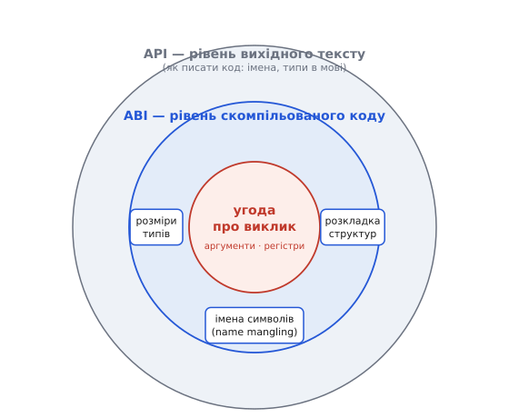
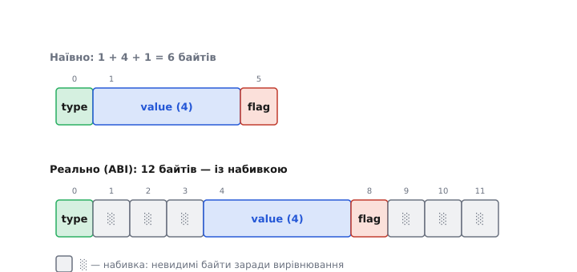
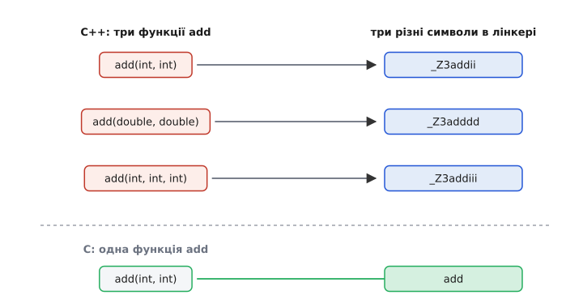

# ABI та calling convention: контракт, за яким склеюється скомпільований код

Компілятор бере ваш файл коду й перетворює текст на числа. Але майже жодна корисна програма не живе в одному файлі: ви лінкуєтеся з бібліотекою, кличете `printf`, під'єднуєте драйвер, скомпільований п'ять років тому чужою версією GCC, а то й зшиваєте докупи модулі, писані різними мовами. Усі ці шматки народилися **окремо** — кожен компілювався сам, не бачачи решти. І все одно вони мусять зімкнутися так, щоб виклик з одного точно потрапив у функцію в іншому, а числа передалися без спотворення.

Що робить це можливим? Не сам процесор — йому байдуже. Можливим це робить **домовленість**, якої обидві сторони тримаються, хоч ніколи одна одну «не бачили». Ця домовленість зветься **ABI** (англ. *Application Binary Interface* — «двійковий інтерфейс застосунку»): повний звід правил, за якими скомпільований код однієї частини вміє стикатися зі скомпільованим кодом іншої. Не як писати текст програми (це — API, інтерфейс на рівні вихідного коду), а як має виглядати вже **готовий двійковий результат**, щоб частини склеїлися.

> 🔧 **Навіщо це.** ABI — це те, чому взагалі існують бібліотеки й розділена компіляція. Ви не перекомпільовуєте `libc` щоразу; ви лінкуєте готовий `.o`, скомпільований колись давно, — і воно працює **лише тому**, що і він, і ваш код дотримали одного ABI. Тому ж «зібрано під один ABI, запущено під інший» — класичне джерело крахів, що не ловляться компілятором: кожен файл сам по собі коректний, а разом вони говорять різними діалектами й тихо руйнуються.

## ABI ширший за один виклик

Найвідоміша частина ABI — **угода про виклик** (англ. *calling convention*): куди класти аргументи функції, звідки брати результат, хто з двох боків береже які регістри, хто прибирає стек. Це реальна серцевина, і вона заслуговує окремого розгляду на рівні заліза — механіку регістрів, летких і стійких, кадр стека й адресу повернення докладно розбирає [угода про виклик як контракт між caller і callee](topic:programming/calling-convention). Тут нам важливо інше: угода про виклик — **лише один пункт** ширшого договору.

Бо навіть якщо два боки ідеально погодили, у якому регістрі їде перший аргумент, вони ще не зможуть співпрацювати, доки не погодять і решту:

- **розміри й вирівнювання типів** — скільки байтів займає `int`, `long`, вказівник; на яку межу адреси їх класти;
- **розкладку структур** — у якому порядку лежать поля `struct`, де компілятор вставив невидимі проміжки (вирівнювання);
- **імена символів** — під яким саме ім'ям функція `add` потрапить у [таблицю символів](topic:programming/linking), щоб лінкер зумів її знайти;
- як передаються великі об'єкти, як влаштований запуск програми, як виглядають обробники винятків, — і ще багато дрібнішого.

Угода про виклик відповідає лише за перший рядок цього списку. ABI — за **весь** список. Тому корисно бачити їх як вкладені кола: угода про виклик усередині, ABI — ширше коло довкола неї.


*Три рівні контракту. Найширше коло — API: як писати текст програми (імена функцій, типи аргументів у мові). Всередині — ABI: як має виглядати вже скомпільований двійковий результат (розміри типів, розкладка структур, імена символів, запуск програми). У самому центрі — угода про виклик: куди в регістрах і на стеку кладуть аргументи одного виклику. Угода — лише серцевина ABI, а не весь він.*

Розрізнення API і ABI варте того, щоб його вкорінити. **API** (англ. *Application Programming Interface*) — контракт на рівні **вихідного тексту**: «є функція `int add(int, int)`, кличеш її отак». Дотримати API — означає, що ваш код **скомпілюється**. **ABI** — контракт на рівні **скомпільованого коду**: «`int` — це 4 байти, аргументи їдуть отут, символ зветься отак». Дотримати ABI — означає, що ваш уже зібраний `.o` **злінкується й запрацює** з чужим уже зібраним `.o`, без перекомпіляції. Можна дотримати API й порушити ABI: той самий вихідний текст, зібраний двома несумісними компіляторами, дасть двійковий код, що не стикується.

## Чому розмір типу — це теж договір

Здається, ніби `int` — це просто «ціле число», і що тут погоджувати. Але коли `main` кладе в регістр `long`, а функція на тому боці читає звідти `long` **іншого розміру**, вони прочитають різну кількість байтів з того самого місця — і одна з них дістане сміття. Розмір типу — не властивість Всесвіту, а рядок ABI.

Класична пастка — тип `long`. Мова C гарантує лише, що `long` **не менший** за `int`; конкретний розмір лишено платформі, тобто ABI. І платформи розійшлися:

```
Тип long, розмір у байтах — за різними ABI:
  Linux / macOS, 64-бітні (модель LP64):   long = 8 байтів
  Windows,       64-бітні (модель LLP64):   long = 4 байти
```

Ось чому той самий рядок C поводиться по-різному:

**Один вихідний текст, два ABI — різний результат:**

```c
#include <stdint.h>
long value = 0;
value = value - 1;   // тепер усі біти = 1
// Скільки це? Залежить від розміру long, а він — від ABI:
//   LP64 (Linux/macOS): long = 8 байтів → 0xFFFFFFFFFFFFFFFF
//   LLP64 (Windows):     long = 4 байти  → 0xFFFFFFFF
```

Код той самий, поведінка різна — бо `long` під двома ABI має різний розмір. Саме тому в переносному коді уникають «голого» `long`, коли важлива точна ширина, і беруть типи з `<stdint.h>` (`int32_t`, `int64_t`), де розмір **зашитий у назву** й від ABI не залежить. Ця розбіжність — типова причина того, що код, який роками жив на Linux, ламається при перенесенні на Windows: не синтаксис змінився, а ABI під ногами.

> 🔧 **Навіщо це.** У прошивці це б'є одразу. Ви обмінюєтеся структурою через UART чи по мережі з іншим пристроєм; якщо описали поле як `long`, воно займе 4 байти на одному кінці й 8 на іншому — і весь пакет «попливе» з цього байта. Тому протоколи й регістрові карти завжди описують полями фіксованої ширини (`uint16_t`, `uint32_t`), а не `int`/`long`: точний розмір — частина контракту, і його не можна лишати на розсуд ABI.

## Розкладка структур: невидимі проміжки

Наступний пункт ABI ще підступніший, бо він **невидимий у коді**. Візьміть структуру:

```c
struct Packet {
    uint8_t  type;   // 1 байт
    uint32_t value;  // 4 байти
    uint8_t  flag;   // 1 байт
};
```

Скільки байтів вона займає? Наївно — шість (1 + 4 + 1). Насправді на типовому 32-бітному ABI — **дванадцять**. Компілятор мовчки вставив невидимі байти-заповнювачі (англ. *padding* — «набивка»), щоб кожне поле лягло на «зручну» для процесора адресу. Правило [вирівнювання](topic:programming/memory-alignment): поле розміром N байтів має починатися з адреси, кратної N. Процесор читає з вирівняної адреси швидше (а деякі ядра з невирівняної **взагалі не вміють**), тож компілятор жертвує пам'яттю заради швидкості й коректності.

Ось як він розкладе `Packet`:

```
Зсув  Байти          Що там
  0    [type   ]      type (1 байт)
  1    [░ ░ ░  ]      3 байти набивки — щоб value лягло на межу 4
  4    [value        ] value (4 байти, починається зі зсуву 4 — кратно 4)
  8    [flag   ]      flag (1 байт)
  9    [░ ░ ░  ]      3 байти набивки — щоб уся структура була кратна 4
 ────
  12   усього = 12 байтів, а не 6
```

Ключова думка: **де саме лежить кожне поле і скільки набивки між ними — вирішує ABI**, а не ви. Два боки, що обмінюються структурою, мусять розкладати її **однаково** — інакше поле `value` в одного почнеться зі зсуву 4, а в іншого зі зсуву 1, і вони читатимуть різні байти під тією самою назвою. Порядок полів у `struct`, розмір кожного, правила набивки — усе це ABI фіксує, щоб розкладка була передбачувана.


*Розкладка структури — теж частина ABI. Наївно `Packet` мала б займати 6 байтів (1+4+1); реально — 12: компілятор вставив невидиму набивку, щоб `value` лягло на адресу, кратну 4, а вся структура була кратна своєму найбільшому полю. Обидва боки мусять розкладати структуру однаково, інакше поля «поповзуть».*

Звідси практичне: якщо структуру треба передати по дроту чи покласти на диск байт-у-байт, покладатися на «природну» розкладку ризиковано — інший компілятор чи ABI розкладе інакше. Тоді або описують формат вручну байт за байтом (серіалізація), або наказують компілятору прибрати набивку (директивою «щільної упаковки» на кшталт `#pragma pack`), свідомо жертвуючи вирівнюванням заради точного контролю над байтами. Що саме відбувається під час такого пакування й чому воно небезпечне на ядрах без невирівняного доступу — розбирає [вставка про упаковку структур](topic:programming/abi-calling-convention/proj-struct-packing.md).

## Name mangling: як функція знаходить своє ім'я в лінкері

Тепер найцікавіше — місце, де ABI впритул стикається з **трансляцією мови**, а не лише із залізом. Щоб лінкер зшив виклик із функцією, обидва боки мусять називати її **тим самим символом** у [таблиці символів](topic:programming/linking). Але як компілятор перетворює ім'я функції з коду на це двійкове ім'я-символ?

У C — майже ніяк. Функція `add` стає символом `add` (у деяких ABI з підкресленням спереду — `_add`), і на цьому все. Просто, бо в C ім'я функції **унікальне**: двох функцій `add` в одній програмі бути не може. Одне ім'я в коді — один символ у лінкері.

А тепер C++. Тут можна написати **три різні функції з одним іменем**:

```cpp
int  add(int a, int b);          // ціла версія
double add(double a, double b);  // дробова версія
int  add(int a, int b, int c);   // на три аргументи
```

Це зветься **перевантаженням** (англ. *overloading* — «навантажити те саме ім'я різними значеннями»), і компілятор мусить розрізняти ці функції. Але таблиця символів лінкера — **пласка**: у ній ім'я — просто рядок, без жодного уявлення про типи аргументів чи простори імен. Якби всі три `add` стали символом `add`, лінкер побачив би три визначення одного імені й закричав про [множинне визначення](topic:programming/linking). Конфлікт.

Розв'язання, що його ще на світанку C++ винайшов Бʼярне Струструп у своєму першому компіляторі cfront (AT&T Bell Labs, початок 1980-х, коли мова ще звалася «C with Classes»), — **закодувати типи аргументів прямо в ім'я символу**. Компілятор бере ім'я функції, домішує до нього зашифрований опис її сигнатури (типи аргументів, простір імен, клас) і робить із цього довгий унікальний символ. Цей прийом і зветься **name mangling** (англ. *to mangle* — «покалічити, спотворити»): людське ім'я функції навмисне «калічать» у машинне, зате однозначне.

Три наші `add` під поширеною схемою (тією, що нею користуються GCC і Clang) перетворяться приблизно так:

```
Ім'я в коді           →  Символ у лінкері (name mangling)
add(int, int)         →  _Z3addii
double add(double,…)  →  _Z3adddd
add(int, int, int)    →  _Z3addiii
```

Розберімо `_Z3addii`: префікс `_Z` каже «це закодоване ім'я C++», `3add` — «ім'я з трьох літер: add», а хвіст `ii` — «два аргументи типу `int`». Версія на три `int` дістає хвіст `iii`, дробова — `dd` (два `double`). Тепер це **три різні символи**, конфлікту нема, і кожен виклик у коді компілятор кодує в той самий символ, що й потрібну версію функції. Пласка таблиця лінкера більше не заважає — уся типова інформація сховалась у самому рядку імені.


*Name mangling розв'язує конфлікт перевантаження. Три функції з іменем `add` у коді C++ (ліворуч) компілятор кодує у три різні символи (праворуч), вшиваючи типи аргументів у рядок імені — пласка таблиця лінкера бачить три різні імена, а не одне. У C перевантаження нема, тож `add` лишається простим символом `add`.*

> 🔧 **Навіщо це.** Коли лінкер C++ кричить `undefined reference to 'foo(int)'`, а поруч у виводі миготить щось на кшталт `_Z3fooi`, ви тепер читаєте це без страху: `_Z3fooi` — це і є `foo(int)` після name mangling. Найчастіша причина такої скарги — ви **оголосили** функцію з одним набором типів, а **визначили** з трохи іншим (скажімо, `foo(int)` проти `foo(unsigned)`): це вже різні mangled-символи, тож виклик шукає один, а існує інший. Уміти прочитати покалічене ім'я назад у сигнатуру — половина розгадки таких помилок.

## C ABI як спільна мова

І тут виникає проблема сумісності. Схема name mangling — **не стандартизована** мовою C++: стандарт каже, що функції треба розрізняти, але **як саме** кодувати ім'я — лишає компілятору. Історично кожен компілятор калічив імена по-своєму, і символ від одного не збігався із символом від іншого — об'єктні файли двох компіляторів C++ просто не лінкувалися.

Порядок навела [історія «війн ABI»](topic:programming/abi-calling-convention/hist-cpp-abi.md): коли Intel наприкінці 1990-х проштовхувала архітектуру Itanium (IA-64), консорціум виробників погодив єдиний **Itanium C++ ABI** — зокрема єдину схему mangling. Попри «айтанієвську» назву, вона пережила саму архітектуру: сьогодні GCC і Clang на всіх Unix-системах (Linux, macOS, і x86, і ARM) кодують імена **однаково**, тож об'єктний файл від Clang лінкується з об'єктним від GCC. Microsoft лишилася при власній схемі, тож MSVC калічить імена інакше — код, зібраний MSVC і GCC, за замовчуванням не стикується на рівні C++.

Як же тоді змусити дві мови — чи два несумісні компілятори — надійно кликати одне одного? Через **найменший спільний знаменник — C ABI**. У C name mangling практично нема (ім'я `add` → символ `add`), схема тривіальна й **однакова майже скрізь**. Тому C ABI став спільною мовою всього двійкового світу: Rust, Go, Python, Swift — усі вміють викликати C і бути викликаними як C, бо C ABI простий і всюди той самий.

У C++ для цього є спеціальний перемикач — `extern "C"`. Він каже компілятору: «цю функцію **не калічити**, дай їй просте C-ім'я»:

```cpp
// Звичайна C++ функція — ім'я буде покалічене (напр. _Z11send_uarth):
void send_uart(uint8_t byte);

// Та сама функція, але з C-сумісним символом «send_uart»:
extern "C" void send_uart(uint8_t byte);
```

Ціна відмови від mangling — таку функцію **не можна перевантажувати** (символ став простим і унікальним, як у C, тож двох версій з одним іменем уже не буде). Натомість її бачить будь-хто, хто розуміє C ABI: інший компілятор C++, код на C, драйвер, асемблерна вставка. Саме через `extern "C"` бібліотеки C++ виставляють назовні стабільний інтерфейс, а прошивки на C++ дозволяють C-коду (чи згенерованим HAL-функціям) кликати свої функції. Простота C ABI — це і є та вузька хвіртка, крізь яку різні світи домовляються.

## Стабільність ABI: чому зміна структури ламає готові програми

Останнє, що робить ABI по-справжньому важливим, — його **стабільність у часі**. Якщо бібліотека роздається у вигляді готового `.so`/`.dll` (динамічне лінкування), а програми до неї вже скомпільовані й розповсюджені, то будь-яка зміна ABI бібліотеки **мовчки ламає** ці програми — навіть якщо вихідний код лишився нібито сумісним.

Уявіть, що бібліотека віддає структуру:

```c
struct Config {
    uint32_t baud;
    uint8_t  parity;
};
```

Програма скомпілювалася під цю розкладку: «`baud` — байти 0–3, `parity` — байт 4, уся структура — 8 байтів». Тепер автори бібліотеки додають поле **на початок**:

```c
struct Config {
    uint16_t version;   // ← нове поле спереду
    uint32_t baud;      // ← поповзло: тепер зсув 4, а не 0
    uint8_t  parity;
};
```

Вихідний код досі компілюється. Але **розкладка з'їхала**: у новій версії `baud` починається зі зсуву 4, а стара програма, зібрана під давню розкладку, досі читає його зі зсуву 0. Вона дістане сміття, хоч ніхто не змінив жодного рядка в ній самій. Це **злам ABI** (англ. *ABI break*): двійкова несумісність без видимих змін у коді.

Ось чому супровід поширюваних бібліотек — це щоденна дисципліна навколо ABI: нові поля додають **у кінець** структури, а не в середину; не змінюють порядок і розмір наявних полів; не викидають функції з експортованого набору. Зламав ABI — і всі, хто зібрав програму під стару версію, мусять перекомпілюватися, інакше програми тихо посиплються. У C++ це ще гостріше: там від mangling залежить навіть те, чи знайде програма функцію після зміни її сигнатури.

> 🔧 **Навіщо це.** У вбудованому світі жорсткого динамічного лінкування зазвичай нема — прошивку [лінкують статично](topic:programming/linking) в один образ, і весь код зростає й падає разом, тож класичний «злам ABI між .so й програмою» тут рідкість. Зате той самий закон вилазить на **межах**, які лишаються двійковими: структура в спільній пам'яті між двома ядрами; формат пакета між пристроями; блок налаштувань, що переживає оновлення прошивки в тій самій флеш-пам'яті. Додасте поле в середину такої структури — і старі дані (чи інше ядро) читатимуться викривлено. Тому на всіх таких межах ABI фіксують явно: поля фіксованої ширини, продумана набивка, версія формату всередині самого блоку.

## Складімо докупи

Виклик функції між окремо скомпільованими шматками — не магія мови, а дотримання договору, у якому кілька рівнів. **Угода про виклик** каже, як передати один виклик: аргументи в регістри, тоді на стек, результат у визначений регістр, поділ регістрів на леткі й стійкі. Ширший **ABI** додає все, без чого стик не тримається: **розміри й вирівнювання типів** (той самий `long` — 4 байти чи 8), **розкладку структур** з невидимою набивкою, і — на межі з трансляцією мови — **name mangling**, що вшиває типи в ім'я символу, аби перевантажені функції не зіштовхувались у пласкій таблиці лінкера. А над усім цим — **стабільність у часі**: змінив розкладку чи набір символів — тихо зламав усіх, хто вже зібрав програму під стару версію.

Спільна нитка одна: скомпільований код різних авторів, мов, компіляторів і років склеюється **тільки тому**, що всі мовчки тримаються тих самих правил про двійкове представлення. Де ці правила збігаються — код стикується сам собою; де розходяться — потрібна вузька спільна хвіртка (C ABI через `extern "C"`), а порушення бодай одного пункту дає найпідступніший клас збоїв: кожен шматок правильний окремо, а разом вони руйнуються без жодної скарги компілятора.
