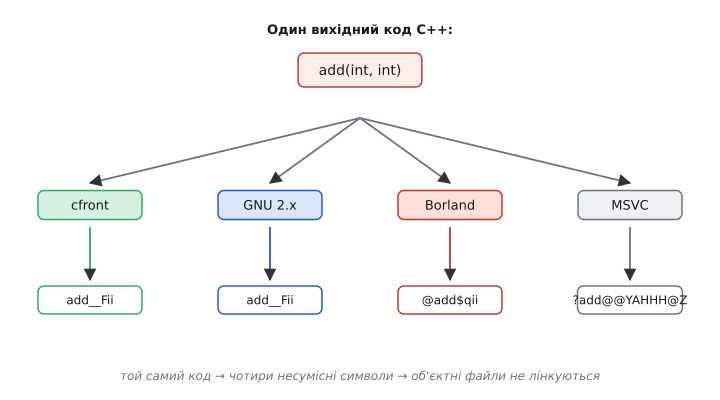
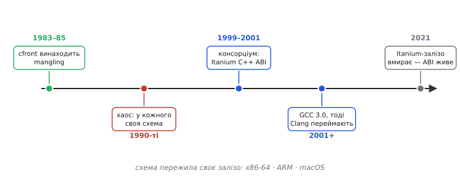

# 📜 Війни ABI: як C++ ледь не розпався на несумісні діалекти

Уявіть банк, де кожен касир видає гроші в купюрах власного дизайну. У межах одного вікна все гладко: ти приніс купюру — тобі порахували здачу тими самими купюрами. Але щойно ти переходиш до сусіднього вікна, твої гроші там ніхто не бере — вони «не тієї системи». Кілька років C++ жив саме так. Компілятор Borland випікав об'єктні файли, яких не розумів компілятор Watcom; те, що зібрав ранній GNU C++, не стикувалося з тим, що зібрав компілятор від Sun. Мова була одна, стандарт — один, а **двійковий результат** виходив у кожного свій, і зшити його докупи було неможливо.

Найдивніше тут ось що: розкол стався не через недбалість і не через злу волю. Він був **закладений у самий стандарт мови** — точніше, у те, чого стандарт свідомо не сказав. Історія того, як C++ ледь не розпалася на несумісні діалекти й хто зрештою навів лад, починається з крихітного інженерного рішення, ухваленого ще до того, як мова взагалі здобула ім'я.

## Дірка, яку стандарт лишив навмисне

Щоб два скомпільовані шматки коду знайшли одне одного, лінкеру потрібне **ім'я** — рядок у [таблиці символів](book:programming/linking), за яким виклик у одному файлі змикається з визначенням в іншому. У C з цим просто: функція `add` стає символом `add`, і крапка. Але в C++ можна оголосити кілька функцій з однаковим іменем — це **перевантаження** (англ. *overloading*):

```cpp
int    add(int a, int b);
double add(double a, double b);
```

Дві різні функції, одне ім'я в коді. А таблиця символів лінкера — **пласка**: у ній ім'я — просто рядок, без жодного поняття про типи аргументів. Якби обидві стали символом `add`, лінкер побачив би два визначення одного імені й зупинився з помилкою. Тож компілятор мусить якось **закодувати типи прямо в ім'я символу**, щоб `add(int,int)` і `add(double,double)` стали різними рядками. Цей прийом і зветься name mangling — «калічення» людського імені в машинне, зате однозначне.

І ось ключове. Стандарт C++ каже: перевантажені функції **мусять** мати різні символи. Але **як саме** їх кодувати — стандарт не диктує. Жодного слова про формат. Це не забудькуватість комітету, а обдумане рішення: різні процесори мають різні обмеження на довжину імен, різні лінкери — різні дозволені символи, і прибити один-єдиний формат на всіх означало б зв'язати руки реалізаціям. Комітет лишив питання **на розсуд компілятора**, довіряючи ринку зійтися на чомусь спільному природним шляхом.

Ринок не зійшовся. Кожна команда, що писала свій компілятор C++, вигадала **власну** схему mangling — і рівно тому об'єктні файли двох компіляторів переставали лінкуватися. Найдивніше: це стосувалося навіть **різних версій того самого компілятора**. Змінили схему між версіями — і бібліотека, зібрана торішнім компілятором, більше не лінкується з програмою, зібраною цьогорічним. Формально в кожного був коректний C++; практично — стільки взаємно-глухих діалектів, скільки компіляторів на ринку.

> 🔧 **Навіщо це.** Ця дірка в стандарті — не курйоз із минулого, а причина, чому й сьогодні не можна безтурботно змішувати об'єктні файли від різних тулчейнів. Коли лінкер сипле `undefined reference` на функцію, яка **точно існує** в бібліотеці, перша підозра — саме тут: бібліотеку зібрали компілятором з іншою схемою mangling, і символ, який шукає ваш код, просто називається інакше в неї всередині. Розуміти, звідки взявся цей розкол, — значить одразу знати, куди дивитися.

## cfront: де народилася сама ідея калічити імена

Щоб зрозуміти корінь розколу, треба повернутися до самого початку — до першого компілятора C++, коли мова ще навіть не звалася C++.

Наприкінці 1970-х данський інженер Бʼярне Струструп (дан. *Bjarne Stroustrup*) у Bell Labs (AT&T, США) почав додавати до мови C класи — спершу під назвою «C with Classes» («C з класами»). Його перший робочий транслятор, **cfront**, з'явився для внутрішнього вжитку в Bell Labs у серпні 1983-го, а комерційно вийшов версією 1.0 у жовтні 1985-го — разом із першим виданням книжки «The C++ Programming Language» (на той час мова вже мала теперішню назву). *(Дати усталені: підтверджені історією мови за авторством самого Струструпа й довідковими джерелами.)*

Хитрість cfront була в тому, що він **не породжував машинний код** сам. Він перекладав C++ у звичайний C, а вже цей C віддавав наявному C-компілятору платформи. Рішення геніальне з погляду переносності: C-компілятор був на кожній машині, тож C++ миттєво «поїхав» скрізь, де був C. Але саме звідси й виросла потреба в mangling.

Річ у тім, що лінкери тієї доби були **примітивні**. Символ для них — короткий рядок, і про типи аргументів вони не знали нічого. А cfront мусив якось передати цим лінкерам, що `add(int,int)` і `add(double,double)` — **різні** функції, хоч у коді ім'я одне. Розв'язок напрошувався: закодувати опис типів прямо в ім'я символу, яке cfront випише в породжений C-код. Так уперше з'явилося калічене ім'я — не через теоретичний задум, а тому що інакше перевантаження просто не працювало б поверх тодішніх C-лінкерів.

У схеми cfront були свої болячки — зокрема, кодовані імена легко вилазили за межу довжини, яку тодішні лінкери взагалі витримували (близько трьох десятків символів), і це доводилося обходити. Але важливе інше: **сама ідея вшивати типи в символ народилася тут**. Кожен наступний компілятор C++ успадкував цю ідею — і водночас свободу робити її **по-своєму**. Струструп започаткував прийом; стандарт не зафіксував його формат; решта галузі розбіглася хто куди. Пізніше, 1988 року, Струструп опише теоретичне підґрунтя цього механізму в праці «Type-Safe Linkage for C++» («Типобезпечне лінкування для C++»), але то вже було осмислення практики, яка встигла роздрібнитися на десяток несумісних варіантів.


*Вавилон mangling до стандартизації. Стандарт вимагав лише, щоб перевантажені функції мали різні символи, але формат лишав компілятору — тож та сама функція `add(int,int)` перетворювалася на різні, взаємно-незрозумілі символи в кожного компілятора. Об'єктні файли двох компіляторів через це не лінкувалися.*

## Несподіваний рятівник: архітектура, якій не судилося вижити

Порядок у цей хаос прийшов з боку, звідки його ніхто не чекав, — і з нагоди, яка сама по собі виявилася провалом.

Наприкінці 1990-х Intel і HP спільно розробляли геть нову 64-бітну архітектуру процесора — **IA-64**, під торговою назвою **Itanium**. Задум був сміливий: порвати з тридцятирічною спадщиною x86 і побудувати процесор на нових принципах. Intel вкладала в Itanium величезні гроші й розраховувала, що той стане майбутнім серверів і високопродуктивних обчислень.

Для нової архітектури потрібна була вся програмна екосистема з нуля — зокрема компілятори C++. І тут Intel зробила розумний хід, якого сама не робила раніше й ніхто не робив до неї в такому масштабі. Замість того щоб пустити виробників компіляторів наробити для Itanium той самий вавилон несумісних схем, який уже панував на x86, Intel **посадила їх за один стіл** — домовитися про єдиний ABI для C++ заздалегідь. Раз архітектура нова й старої сумісності берегти ні з чим, є унікальний шанс зробити все правильно з першого разу.

Так близько 1999–2001 років народився **Itanium C++ ABI**. Розробляла його не одна компанія, а неформальна галузева коаліція. Її склад варто назвати поіменно, бо це майже весь тодішній світ серйозних C++-інструментів (за алфавітом, як подає сам документ): **CodeSourcery, Compaq, EDG, HP, IBM, Intel, Red Hat, SGI**. *(Склад коаліції усталений — прямо зафіксований у вступі до самого документа ABI.)* Тут і виробники заліза (Intel, HP, Compaq, SGI, IBM), і автори компіляторних технологій (EDG — чий front-end ліг в основу багатьох комерційних компіляторів; CodeSourcery і Red Hat — люди навколо GCC).

Цей документ фіксував **усе те, що стандарт мови лишив відкритим**: не лише єдину схему name mangling, а й розкладку таблиць віртуальних функцій, влаштування RTTI, порядок виклику конструкторів і деструкторів, механіку обробки винятків — увесь той шар, без якого об'єктні файли двох компіляторів не тримаються купи. Це й був той спільний контракт, якого C++ бракувало п'ятнадцять років.

Практичним редактором і рушієм специфікації став **Марк Мітчелл (англ. *Mark Mitchell*)** з CodeSourcery — та сама людина, що невдовзі керуватиме випуском GCC 3.0. *(Роль CodeSourcery та особисто Мітчелла усталена: підтверджена документацією GCC.)*

А сам Itanium? Він **провалився**. Архітектура спізнилася з виходом, не вміла швидко виконувати старий x86-код, а тим часом AMD випустила x86-64 (AMD64) — 64-бітне розширення звичного x86, яке зберігало сумісність зі старим кодом. Ринок обрав шлях AMD, і Intel сама змушена була піти тим самим шляхом у своїх Xeon. За Itanium закріпилося глузливе прізвисько **«Itanic»** — гра на «Titanic». Останні процесори відвантажили 2021 року. *(Провал і дати усталені: підтверджені численними технічними джерелами.)* Архітектура, заради якої створювали ABI, лягла на дно — а ABI, викуваний для неї, лишився жити. І не просто лишився: він став панівним.

> 🔧 **Навіщо це.** Ось чому дотепер у помилках компіляторів, у назвах бібліотек LLVM, у документації GCC ви натрапляєте на слово «Itanium» там, де про процесор Itanium не йдеться ані слова. Коли Clang згадує «Itanium C++ ABI» на вашому ARM-мікроконтролері чи на Linux-сервері з x86 — це не помилка й не пережиток заліза. Це назва **схеми**, яка пережила своє залізо. Знаючи цю історію, ви не сплутаєте назву специфікації з назвою давно мертвого процесора.

## Як схема пережила своє залізо

Чому ж ABI, зроблений для приреченої архітектури, підкорив геть інші? Тому що він виявився **добре зробленим і вільним** — а C++-світу катастрофічно бракувало саме такого спільного знаменника.

Ключовий момент настав 18 червня 2001 року, коли вийшов **GCC 3.0**. *(Дата усталена: підтверджена офіційним пресрелізом GNU.)* Це був не звичайний реліз: у ньому GNU-компілятор C++ **переписали під новий ABI** — саме той, айтанієвський. Реалізацію нового ABI в GCC зробили Марк Мітчелл, Нейтан Сідвелл (англ. *Nathan Sidwell*) і Александр Семюел (англ. *Alexander Samuel*) з CodeSourcery. Відтоді й донині GNU-компілятор кодує імена й розкладає C++-об'єкти **за Itanium C++ ABI**.

Ціна цього кроку була реальна й болюча: об'єктні файли, зібрані старим GCC 2.x, **перестали лінкуватися** з тим, що видавав GCC 3.0. Уся екосистема Linux мусила перекомпілюватися. Але це була разова біль заради того, щоб роз'єднаність скінчилася **назавжди**: далі GCC уже тримав ABI стабільним, і галузь нарешті отримала твердий ґрунт.

Коли за кілька років з'явився **Clang** (компілятор C++ на основі LLVM), питання, яку схему брати, навіть не стояло. На Unix-системах — Linux, macOS, BSD — Clang свідомо кодує імена й розкладає об'єкти **за тим самим Itanium C++ ABI**, що й GCC. І це дало те, чого доти не бувало: об'єктний файл, зібраний Clang, **лінкується** з об'єктним файлом, зібраним GCC. Дві незалежні реалізації, різні команди, різні кодові бази — і повна двійкова сумісність на рівні C++, бо обидві тримаються одного контракту.

Так «айтанієвський» ABI став **фактичним стандартом усього Unix-світу C++**, байдуже до архітектури під ним: x86-64, ARM (зокрема весь світ Android і Apple Silicon), і навіть екзотичніші процесори. Назва лишилася історичним слідом; суть — це спільна мова, якою тепер розмовляють C++-компілятори на переважній більшості платформ. Пізніше специфікацію винесли в **відкритий проєкт** (нині вона живе на GitHub і розвивається спільнотою) — остаточно відв'язавши її від колишнього корпоративного походження та від самого Itanium.


*Шлях від хаосу до спільного контракту. Ідея mangling народилася в cfront, розсипалася в 1990-х на несумісні схеми, і лише консорціум навколо Itanium (1999–2001) дав єдиний ABI. GCC 3.0 переписали під нього 2001-го, слідом його перейняв Clang — і хоча саме залізо Itanium померло 2021 року, схема живе на x86-64 та ARM як фактичний стандарт Unix-світу.*

## Одна межа, що не впала: світ Microsoft

Уся ця історія примирення оминула один великий материк — **Windows**.

Microsoft ніколи не приєднувалася до айтанієвської коаліції в тому, що стосується власного компілятора для x86, і **MSVC** (Microsoft Visual C++) досі калічить імена та розкладає C++-об'єкти **за власною схемою**, ні на кого не схожою. Причина не в упертості: у Microsoft свій ABI для Windows склався раніше й окремо, під власну модель викликів, обробки винятків, COM-об'єктів; переписувати весь Windows під чужий контракт означало б зламати двійкову сумісність цілої платформи заради вигоди, яку Microsoft не вважала для себе першочерговою.

Наслідок відчутний і донині. Об'єктний файл, зібраний MSVC, **не лінкується** з об'єктним файлом, зібраним GCC чи Clang, на рівні C++: імена не збігаються, розкладка інша, механіка винятків інша. Світ C++ фактично розділений на **два материки** — велику Unix-плиту (GCC + Clang, спільний Itanium ABI) і окрему плиту Windows/MSVC. Через це, до речі, той самий Clang **роздвоюється** залежно від платформи: на Linux і macOS він говорить айтанієвським ABI, а коли складає код під Windows-ціль у зв'язці з MSVC — свідомо переходить на **схему Microsoft**, щоб стикуватися з рідними для Windows бібліотеками. Компілятор один, а «мова», якою він калічить імена, залежить від того, на якому материку він зараз працює.

> 🔧 **Навіщо це.** Практичний висновок для вбудованого й системного розробника: **тулчейн не можна змішувати** через голий C++-інтерфейс. Бібліотека, зібрана MSVC, не віддасться проєктові на MinGW/GCC напряму — символи різні. І навпаки. Коли двом світам таки треба поговорити, роблять це не через C++, а через **найменший спільний знаменник — C ABI** (`extern "C"`), бо схема C-символів тривіальна й **однакова на обох материках**. Ось чому крос-мовні й крос-тулчейнові інтерфейси майже завжди виставляють назовні як C, а не як C++: C-хвіртка — єдине місце, де плита Unix і плита Windows гарантовано змикаються.

## Що з цього лишилося

Розкол C++ на несумісні двійкові діалекти був не збоєм, а **прямим наслідком свободи**, яку стандарт мови свідомо лишив реалізаціям: він вимагав, щоб перевантажені функції мали різні символи, але формат цих символів не фіксував. Свобода обернулася вавилоном — стільки схем mangling, скільки компіляторів, і об'єктні файли, що не тямили одне одного.

Ідею вшивати типи в символ подарував світові cfront Струструпа — на порозі 1980-х, коли примітивні лінкери інакше не вміли розрізняти перевантаження. Порядок же прийшов через дві десятиліття й з несподіваного боку: консорціум навколо приреченої архітектури Itanium викував єдиний C++ ABI, а GCC 3.0 і згодом Clang зробили його спільним для всього Unix-світу. Саме залізо, заради якого все затівалося, потонуло; контракт, викуваний для нього, став фактичним стандартом на x86-64 і ARM.

І одна межа лишилася непереборною донині — між Unix-плитою і світом Microsoft, кожна зі своєю схемою. Там, де ці материки мусять зустрітися, працює єдина спільна хвіртка — простий C ABI. Тож нинішня, оманливо-спокійна сумісність C++ тримається не на тому, що всі раптом стали однакові, а на **двох великих домовленостях і одному вузькому містку між ними** — і кожна з них має ім'я, дату й людей, що за нею стоять.
