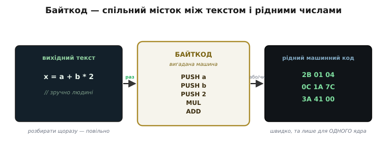
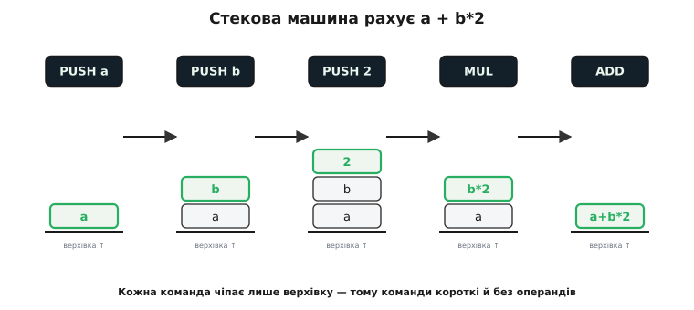
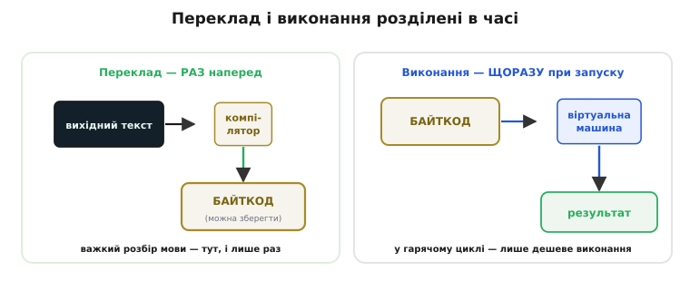

# Байткод і віртуальна машина

Між двома крайнощами виконання програми лежить хитрий третій шлях. Одна крайність — [скомпілювати](topic:programming/compilation) весь текст наперед у рідні числа процесора, і хай ядро біжить ними напряму: швидко, але результат прив'язаний до одного типу чипа. Друга — тримати при собі програму-тлумача, що читає ваш **вихідний текст** рядок за рядком і щоразу робить написане: гнучко й переносно, але марудно повільно, бо тлумач знову й знову розбирає ті самі букви. Байткод — це компроміс, що бере краще з обох: перекласти текст **один раз**, але не в числа конкретного ядра, а в команди **вигаданої машини**, яку потім легко відтворити на будь-якому справжньому чипі. Розберімося, чому такий гак виявляється розумним, а не безглуздим гаком.

### Чому не досить двох звичних шляхів

Уявіть, що ви написали мову й хочете, щоб програми нею йшли на десятках різних процесорів — ARM, RISC-V, x86. Перший порив — писати повний компілятор під кожен: свій **генератор коду** для ARM, свій для RISC-V, свій для x86. Але передня частина всіх цих компіляторів — та, що розбирає ваш текст, будує дерево, перевіряє типи — була б **однаковою**; різнилися б лише хвости, що видають рідні числа. Виходить, ту саму важку роботу «зрозуміти мову» ви переписуєте раз за разом, міняючи тільки останній крок. Марнотратство.

Другий порив — узагалі не перекладати в числа: хай програма-**інтерпретатор** просто читає ваш текст і виконує. Тоді один інтерпретатор, перенесений на новий чіп, тягне за собою всю мову. Переносно — але дорого щоразу: щоб виконати `x = a + b` усередині циклу на мільйон обертів, тлумач мільйон разів наново розпізнає, де тут ім'я, де плюс, де присвоєння. Він витрачає левову частку сил не на **додавання**, а на **розбір тексту**, який щоразу той самий.

Обидва шляхи впираються в те саме: розбір мови — робота важка, а її або дублюють під кожен чіп, або без потреби повторюють у кожній ітерації циклу. Напрошується думка: зробити розбір **раз**, зберегти його результат у зручній для швидкого виконання формі — і вже цю форму або тлумачити (дешево, бо розбирати вже нічого), або перекладати в рідні числа під конкретний чіп. Ця «зручна форма посередині» і є байткод.

### Що таке байткод

**Байткод** (*bytecode*; назва — від того, що кожна команда кодується здебільшого **одним байтом** коду операції) — це набір команд не для справжнього процесора, а для **вигаданого**, придуманого автором мови. Компілятор перекладає ваш текст не в числа ARM чи RISC-V, а в ці команди уявної машини: коротенькі числові інструкції на кшталт «поклади число 2», «додай два верхні значення», «виклич функцію». Виглядає це майже як [машинний код](topic:programming/isa) — теж числа-команди, — тільки процесора, якого фізично не існує.

І тут ключ до всього: раз машина вигадана, її **набір команд можна зробити ідеальним для нашої мови** — не заручником того, які регістри й режими адресації дав виробник кремнію. Автор мови сам вирішує, якими будуть команди, скільки їх, як вони працюють. Ця свобода — головна причина, чому байткод узагалі вигадали.

Він займає проміжне становище між двома світами. Вихідний текст — надто «людський», щоб виконувати його швидко: у ньому імена, пробіли, дужки, які треба щоразу розбирати. Рідний машинний код — надто «залізний», прив'язаний до одного ядра. Байткод посередині: уже не текст (розбирати нічого — це готові числові команди), але ще не рідні числа якогось конкретного чипа (а команди спільної для всіх вигаданої машини).


*Байткод стоїть між двома світами. Ліворуч — вихідний текст, зручний людині, та повільний у виконанні. Праворуч — рідні числа, швидкі, але прив'язані до одного ядра. Посередині байткод: уже готові числові команди (розбирати нічого), але команди спільної вигаданої машини, а не якогось конкретного чипа. Саме ця «серединність» дає і швидкість, і переносність.*

> 🔧 **Навіщо це.** Коли ви бачите файл `.pyc` поряд зі скриптом Python, `.class` поряд із Java-кодом чи `.mpy` у прошивці на MicroPython — це і є збережений байткод. Мова вже «перекладена» раз, розбирати текст більше не треба; лишилося тільки виконати ці команди. Тому повторний запуск програми часто швидший за перший: перекладати наново не доводиться, готовий байткод беруть із файлу.

### Віртуальна машина: процесор, зроблений із коду

Байткод — команди неіснуючого процесора. Але команди самі себе не виконають; хтось мусить їх **виконувати**. Цей «хтось» — не залізо, а програма, і зветься вона **віртуальною машиною** (*virtual machine*, VM; *virtual* — «уявний, не-фізичний»): по суті, **процесор, зроблений із коду**. Вона робить те саме, що робить справжнє ядро зі своїм [машинним кодом](topic:programming/fetch-decode-execute) — вибирає чергову команду, розпізнає її, виконує, — тільки не в кремнії, а всередині звичайної програми.

Аналогія тут точна аж до дрібниць, і варто побачити, де саме вона перестає бути аналогією. Справжнє ядро має **лічильник команд** — регістр, що вказує на наступну інструкцію в пам'яті. Віртуальна машина має рівно те саме — тільки не регістр у кремнії, а звичайну змінну-покажчик, що вказує на наступний байт байткоду в масиві. Справжнє ядро крутить цикл «вибірка → декодування → виконання». Віртуальна машина крутить **той самий** цикл, але кодом:

:::tabs
```cpp
uint8_t *pc = code;              // «лічильник команд» — просто покажчик
for (;;) {                       // вічний цикл вибірки
    uint8_t op = *pc++;          // вибірка: взяти байт-команду, зсунути покажчик
    switch (op) {                // декодування: що це за команда?
        case OP_ADD:  /* … */ break;   // виконання
        case OP_HALT: return;
        /* … решта команд … */
    }
}
```
```python
pc = 0                           # «лічильник команд» — просто індекс
while True:                      # вічний цикл вибірки
    op = code[pc]; pc += 1       # вибірка: взяти байт-команду, зсунути покажчик
    if op == OP_ADD:             # декодування: що це за команда?
        ...                      # виконання
    elif op == OP_HALT:
        return
    # … решта команд …
```
:::

Цей цикл — серце будь-якої віртуальної машини, його звуть **циклом диспетчеризації** (*dispatch loop*; *dispatch* — «розсилати за призначенням»). Він читає команду й **розсилає** керування у гілку, що її виконує. Де в кремнії дешифратор команд апаратно спрямовує сигнали, там у VM це робить звичайний `switch`. Аналогія ламається лише в одному: апаратний дешифратор миттєвий, а `switch` — це реальні такти на кожну команду. Саме тому байткод повільніший за рідний код: кожна ваша команда коштує ще й обгортку «прочитати-розпізнати-стрибнути» довкола корисної роботи. Але ця обгортка — **стала й дешева** проти повторного розбору тексту, і в цьому вся вигода.

> 🔧 **Навіщо це.** Ось чому інтерпретована мова на мікроконтролері (той-таки MicroPython на ESP32) відчутно повільніша за C, але все одно жива: цикл диспетчеризації додає накладні витрати на кожну команду, проте розбирати вихідний текст щоразу вже не треба. Для керування світлодіодом чи опитування давача цього з головою досить; для жорсткого реального часу — ні, там лишається C.

### Чому байткод майже завжди стековий

Придумуючи команди для своєї вигаданої машини, автор має вибір, **звідки** інструкціям брати дані. Реальні процесори здебільшого беруть їх із **регістрів** — іменованих комірок усередині ядра (`add r1, r2, r3` — «поклади в r1 суму r2 і r3»). Але переважна більшість байткодів побудована інакше — **на стеку**. І причина повчальна.

**Стекова машина** (*stack machine*) не має іменованих регістрів. Натомість у неї є [стек](topic:programming/stack-lifo) — купка значень, куди можна класти зверху й звідки брати зверху. Команди працюють з **верхівкою** цієї купки. Скажімо, команда `ADD` не називає жодних регістрів: вона просто **знімає два верхні значення, додає їх і кладе суму назад**. Команда `PUSH 5` кладе число 5 нагору. Усе спілкування команд іде через один спільний стек.

Порівняймо, як обидва підходи рахують той самий вираз `a + b * 2`:

```asm
Регістрова машина (називає регістри — команди складніші):
    load  r1, a          ; r1 ← a
    load  r2, b          ; r2 ← b
    mul   r2, r2, 2      ; r2 ← b * 2
    add   r1, r1, r2     ; r1 ← a + (b*2)

Стекова машина (усе через верхівку — команди прості):
    PUSH a               ; стек: [a]
    PUSH b               ; стек: [a, b]
    PUSH 2               ; стек: [a, b, 2]
    MUL                  ; стек: [a, b*2]     (зняв 2 і b, поклав добуток)
    ADD                  ; стек: [a + b*2]    (зняв два, поклав суму)
```

Різниця впадає в око: команди стекової машини **нічого не називають**. `ADD` — це просто байт `ADD`, без операндів; він завжди бере те, що на верхівці. `MUL` — теж просто байт. А команда регістрової машини мусить нести в собі номери регістрів — які з яким і куди. Тому стекові команди **коротші й одноманітніші**: часто-густо це один-єдиний байт коду операції без жодних доважків. А байткод, як каже сама назва, і прагне вкладатися в байти.

Це й пояснює вибір. По-перше, стекові команди простіше **генерувати**: обхід дерева виразу зверху вниз природно лягає в «поклади, поклади, склади» — компілятор майже не думає, куди що покласти, бо все йде на спільний стек. По-друге, їх простіше **виконувати** у VM: не треба тримати таблицю регістрів, керувати їхнім розподілом — уся арифметика крутиться довкола однієї структури-стека. По-третє, вони **компактніші**, а компактність байткоду — це і менше пам'яті, і менше роботи циклу диспетчеризації. За все це платять трохи більшою кількістю команд (стековий запис довший рядками), але кожна команда така дешева, що виграш переважує.


*Як стекова машина рахує `a + b*2`. Кожна команда чіпає лише верхівку стека: три `PUSH` нарощують купку до `[a, b, 2]`, тоді `MUL` знімає два верхні й повертає добуток, а `ADD` знімає ще два й лишає єдиний результат. Команди не називають жодних регістрів — тому вони короткі, і саме тому байткод здебільшого стековий.*

### Дві стадії: спершу переклад, потім виконання

Тепер уся картина складається в один зрозумілий конвеєр, розбитий на **дві окремі стадії з різним часом життя**. Перша стадія — переклад — трапляється **один раз**: ваш вихідний текст проходить компілятор, який замість рідних чисел видає **байткод**. Друга стадія — виконання — трапляється **щоразу під час запуску**: віртуальна машина бере цей байткод і крутить свій цикл диспетчеризації, роблячи те, що команди велять.

Розділити їх у часі — і є головна хитрість. Уся важка робота «зрозуміти мову» (розбір тексту, перевірка типів, побудова команд) робиться **наперед і один раз**, її плід зберігається у вигляді байткоду. А під час роботи лишається сама лише дешева частина — виконувати готові числові команди, більше нічого не розбираючи. Саме тому байткод швидший за тлумачення сирого тексту: розбір винесено з гарячого циклу назовні, зроблено заздалегідь.


*Два різні за часом життя кроки. Ліворуч — переклад: текст проходить компілятор і **один раз** стає байткодом (його можна зберегти у файл). Праворуч — виконання: віртуальна машина бере готовий байткод і крутить його **щоразу** при запуску. Важкий розбір мови зроблено наперед; у гарячому циклі лишилося тільки виконувати дешеві числові команди.*

А тепер повернімося до тієї переносності, з якої почали. Байткод — команди вигаданої машини, **однакові скрізь**. Тому, щоб запустити мову на новому чипі, треба перенести на нього лише **одну програму — віртуальну машину** (і, за потреби, компілятор у байткод). Сам байткод при цьому **не міняється**: той самий `.class`-файл Java чи `.pyc`-файл Python побіжить і на ARM, і на x86, аби там була відповідна VM. Ось звідки славнозвісне гасло Java «написав раз — виконуй будь-де»: написали й переклали в байткод один раз, а далі його носить від машини до машини незмінна VM. Як ця ідея визрівала — від навчальної [p-машини Вірта до JVM](topic:programming/bytecode-vm/hist-pcode-jvm.md) — окрема, доволі повчальна історія.

### Складаємо власну крихітну VM

Щоб магія розвіялася остаточно, зберімо справжню — хоч і крихітну — стекову віртуальну машину на C. Вона рахуватиме `(2 + 3) * 4`. Спочатку домовмося про команди нашої вигаданої машини (це і є її «набір інструкцій»):

:::tabs
```cpp
enum {
    OP_PUSH,   // за цим байтом іде число — покласти його на стек
    OP_ADD,    // зняти два верхні, покласти їхню суму
    OP_MUL,    // зняти два верхні, покласти їхній добуток
    OP_HALT    // зупинитися; результат — на верхівці стека
};
```
```python
from enum import IntEnum, auto

class Op(IntEnum):
    PUSH = auto()   # за цим байтом іде число — покласти його на стек
    ADD  = auto()   # зняти два верхні, покласти їхню суму
    MUL  = auto()   # зняти два верхні, покласти їхній добуток
    HALT = auto()   # зупинитися; результат — на верхівці стека
```
:::

Тепер сам вираз `(2 + 3) * 4`, уже перекладений у байткод. Читається він як послідовність «поклади 2, поклади 3, склади, поклади 4, помнож»:

```c
uint8_t program[] = {
    OP_PUSH, 2,
    OP_PUSH, 3,
    OP_ADD,          // на стеку лишиться 5
    OP_PUSH, 4,
    OP_MUL,          // на стеку лишиться 20
    OP_HALT
};
```

І серце — сама віртуальна машина: лічильник команд, стек із покажчиком верхівки й цикл диспетчеризації, що розсилає кожну команду у свою гілку.

```c
int32_t run(uint8_t *code) {
    int32_t stack[16];           // наш стек значень
    int sp = 0;                  // покажчик верхівки (скільки значень на стеку)
    uint8_t *pc = code;          // «лічильник команд»

    for (;;) {
        uint8_t op = *pc++;      // вибірка команди + зсув покажчика
        switch (op) {            // декодування й диспетчеризація
        case OP_PUSH:
            stack[sp++] = *pc++; // покласти наступний байт-число на стек
            break;
        case OP_ADD: {
            int32_t b = stack[--sp];   // зняти верхній
            int32_t a = stack[--sp];   // зняти наступний
            stack[sp++] = a + b;       // покласти суму
            break;
        }
        case OP_MUL: {
            int32_t b = stack[--sp];
            int32_t a = stack[--sp];
            stack[sp++] = a * b;       // покласти добуток
            break;
        }
        case OP_HALT:
            return stack[sp - 1];      // результат — на верхівці
        }
    }
}
```

**Приклад (проганяємо `(2 + 3) * 4` крізь нашу VM).** Простежмо, що діється зі стеком на кожній команді:

```
крок  команда     дія                          стек після
────────────────────────────────────────────────────────
 1    PUSH 2      кладемо 2                     [2]
 2    PUSH 3      кладемо 3                     [2, 3]
 3    ADD         знімаємо 3 і 2, кладемо 5     [5]
 4    PUSH 4      кладемо 4                     [5, 4]
 5    MUL         знімаємо 4 і 5, кладемо 20    [20]
 6    HALT        повертаємо верхівку           → 20
```

Ось і вся віртуальна машина — кілька десятків рядків. У ній є все, що робить справжню VM машиною: власний набір команд, лічильник команд, вибірка-декодування-виконання в циклі. Різниця між нашою іграшкою й серйозною VM на кшталт JVM — не в природі, а лише в **масштабі**: там сотні команд замість чотирьох, купа перевірок, збирання сміття, часто ще й прискорення через [проміжне представлення](topic:programming/intermediate-representation) та оптимізації. Але кістяк — цей самий цикл `switch` довкола стека.

> 🔧 **Навіщо це.** Такий самий крихітний інтерпретатор байткоду інколи пишуть і в реальній прошивці — щоб зашити у пристрій маленький «скрипт», який можна міняти без перезбирання всього коду: формат приладу, послідовність калібрування, сценарій поведінки. Пристрій виконує байткод-сценарій своєю мініатюрною VM, а сам сценарій лежить у Flash як дані й оновлюється окремо від прошивки. Розуміючи, з чого VM складається, ви можете зробити таку саму — і додати гнучкості там, де повний перезалив прошивки був би незручний.

### Коли повільно — байткод перекладають у рідні числа на ходу

Лишається чесно визнати платню: цикл диспетчеризації додає накладні витрати на **кожну** команду, тож у найгарячіших місцях байткод помітно програє рідному коду. Інженери знайшли на це елегантну відповідь — і вона гарно замикає всю картину. Що, як помітити, які шматки байткоду виконуються **найчастіше**, і саме їх під час роботи перекласти в рідні числа процесора — щоб далі вони бігли напряму, без обгортки VM?

Саме це робить **компіляція на льоту** (*just-in-time compilation*, JIT; «якраз вчасно» — переклад стається не наперед і не ніколи, а **в мить**, коли шматок ось-ось знадобиться часто). VM якийсь час виконує байткод звично, стежачи, які функції чи цикли «гарячі»; щойно якийсь стає надто витратним, вона тут-таки компілює його байткод у рідний машинний код і далі виконує вже цю швидку версію. Так поєднуються обидві переваги: переносність байткоду (програму розповсюджують у ньому) і швидкість рідного коду (гарячі місця зрештою біжать напряму). Саме завдяки JIT сучасні Java й JavaScript, попри байткодову природу, працюють на швидкостях, близьких до скомпільованих мов. У світі мікроконтролерів JIT майже не трапляється — пам'яті обмаль, а передбачуваність часу важливіша за пікову швидкість, — але як прийом він показує, що межа «інтерпретоване проти скомпільованого» насправді розмита: одну й ту саму програму можна виконувати то так, то так.

Отже, байткод — це набір команд вигаданої машини, у який мову перекладають **раз**, щоб потім **щоразу** швидко виконувати переносною віртуальною машиною — процесором, зробленим із коду. Стековим його роблять заради коротких одноманітних команд; двостадійність (переклад наперед, виконання при запуску) дає і швидкість проти сирого тексту, і переносність проти рідних чисел; а JIT за потреби підтягує гарячі місця аж до швидкості справжнього ядра.
