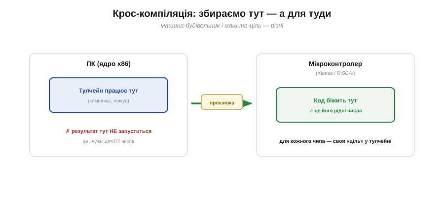

# Від тексту до машинного коду: що таке компіляція

В основі всього лежить одна **ідея**: машина може сама перекласти зрозумілий людині запис у свій машинний код. Перетворімо цю ідею на чітке інженерне розуміння. Що таке **компіляція** насправді, чому вона взагалі потрібна — і чому це не один чарівний крок, а цілий конвеєр. Розібравшись із цим, ви назавжди позбудетеся відчуття, що між вашим кодом і чипом діється щось незбагненне.

### Два світи: текст для людини, числа для машини

Почнімо з прірви, яку треба перейти. Те, що ви пишете, — **вихідний код** (*source code*): текст, розрахований на **людину**. Рядок `OUT |= (1<<2);` ви читаєте майже як речення: «увімкни біт 2 у регістрі OUT». А те, що виконує ядро, — **машинний код** (*machine code*): послідовність двійкових команд, тобто **чисел**, кожне з яких ядро тлумачить як інструкцію з власного [набору команд процесора](book:programming/isa), що звертається до [регістрів](book:programming/memory-mapped-io). Це **два різні описи** одного наміру: один — словами для нас, другий — числами для кремнію.

І прірва ця не примха, а наслідок того, як улаштоване ядро. Процесор — проста за духом машина: він лише вибирає з пам'яті чергове число, упізнає в ньому одну зі своїх небагатьох команд і виконує її — це і є цикл [«вибірка → декодування → виконання»](book:programming/fetch-decode-execute). Жодних «слів», «змінних» чи «операторів» він не знає — тільки наперед домовлений набір **числових** команд. Тому будь-яку нашу думку, хоч яку струнку, доводиться зрештою звести до цього бідного, але блискавично швидкого алфавіту чисел. Перекинути місток через цю прірву — і є робота компілятора.


*Рис. Прірва між двома описами. Ліворуч — вихідний код: текст, що його легко читає людина. Праворуч — машинний код: голі числа-команди, єдине, що розуміє ядро. Той самий намір — два геть різні представлення. Хтось мусить **перекласти** ліве на праве.*

### Що таке компіляція

Цей переклад і є **компіляція** (*compilation*): перетворення вихідного коду (тексту вищого рівня) на **машинний код** — рідні інструкції конкретного процесора. Програму, що його робить, звуть **компілятором** (*compiler*) — те саме слово, яке дала світу Грейс Гоппер. На вхід компілятор бере ваш текст, на виході видає числа, готові до виконання ядром.

Тут варто пояснити, **між чим і чим** іде переклад. Мови на кшталт C і C++, якими програмують мікроконтролери, звуть **високорівневими** (*high-level*): вони ближчі до людської думки — зі змінними, функціями, зрозумілими операторами. Машинний код — це найнижчий, **низькорівневий** (*low-level*) рівень: голі команди процесора. C тут — золота середина: достатньо людяний, щоб писати зручно, та достатньо «близький до заліза», щоб дати швидкий і компактний код, потрібний МК. Компілятор і є той міст, що спускає нас із високого рівня на низький.

Тут криється ще одна важлива тонкість: машинний код **прив'язаний до архітектури**. Інструкції, зрозумілі ядру Xtensa, — це не ті числа, що зрозумілі ядру RISC-V. Тому **той самий** вихідний текст компілятор переведе у **різний** машинний код залежно від того, під який чіп ви збираєте: оригінальний ESP32 на Xtensa й [C3 на RISC-V](book:programming/esp32-family) потребують різного машинного коду з одного джерела.


*Рис. Що робить компілятор. Він бере людський текст і видає **числа** — машинні команди. Але які саме числа — залежить від **ядра**: для Xtensa один машинний код, для RISC-V інший. Один вихідний текст → різні прошивки під різні чипи. Тому й кажуть «зібрати **під** ESP32» чи «**під** C3».*

> 🔧 **Навіщо це.** Ось чому буває «помилка компіляції»: якщо ваш текст порушує правила мови, компілятор-перекладач **не може** його зрозуміти — і чесно зупиняється, не видавши прошивки. Це навіть благо: зламаний код **ніколи не доходить** до чипа, помилку видно ще на вашому ПК. Тому компілятор — ваш перший і найдешевший контролер якості: він ловить цілий клас помилок до того, як ви бодай торкнулися заліза.

### Чому не виконувати текст напряму? Компільоване проти інтерпретованого

Виникає природне питання: а навіщо взагалі **заздалегідь** усе перекладати? Чи не можна, щоб машина читала наш текст і робила написане **на ходу**? Можна — і це другий, інший підхід. Існує два способи виконати програму:

- **Компільований** (*compiled*, переклад наперед): увесь текст перекладають у машинний код **один раз**, ще до запуску; далі чіп виконує готові швидкі числа **напряму**. Так працюють C і C++ — мови, якими програмують мікроконтролери.
- **Інтерпретований** (*interpreted*, переклад на ходу): окрема програма-**інтерпретатор** під час роботи читає ваш текст рядок за рядком і **щоразу** виконує написане. Так працює Python (а на МК — його різновид MicroPython).


*Рис. Два способи виконати програму. **Компільований:** переклали раз наперед — далі чіп біжить готовим машинним кодом, швидко й без посередника. **Інтерпретований:** інтерпретатор сидить у пам'яті й щоразу на ходу тлумачить ваш текст — гнучко, але повільніше й важче. Мікроконтролери майже завжди обирають **перший** шлях.*

Чому МК майже завжди обирають **компіляцію**? Бо переклад наперед дає те, що для них найцінніше: **швидкість** (ядро виконує готові інструкції, не марнуючи час на тлумачення), **малий розмір** (не треба тримати в дефіцитній пам'яті важкий інтерпретатор) і роботу **на голому залізі** без операційної системи. Інтерпретовані мови на МК існують (той-таки MicroPython), але це радше виняток для зручності, ніж основний шлях.

Платою за це є зручність розробки: компільований код треба **щоразу перезбирати й перезаливати** після кожної правки, тоді як інтерпретатор виконав би новий текст одразу. Це типовий для вбудованого світу компроміс: МК міняють трохи зручності розробника на багато ефективності виконання. Адже ресурси [мікроконтролера](book:programming/microcontroller) скромні й полічені, тож «важкий, але зручний» інтерпретатор тут — розкіш не за кишенею, а «сухий і швидкий» машинний код — саме те, що треба.

### Компіляція — не один крок, а конвеєр

А тепер — найважливіше прозріння цієї теми, від якого розплутується весь розділ. Перетворення вашого тексту на прошивку, готову залити в чіп, — це **не один** магічний крок «компіляція». Це **конвеєр** із кількох окремих інструментів, кожен зі своєю вузькою роботою. Саме цей конвеєр і зветься **тулчейном**.


*Рис. Шлях коду — це конвеєр. Вихідний текст проходить **препроцесор** (готує текст), **компілятор** (переклад у команди), **асемблер** (у числа), **лінкер** (зшиває все докупи) — і на виході постає **образ прошивки**, готовий до заливання. Кожен інструмент робить лише свою частину; разом вони і є тулчейн.*

Те, що в побуті звуть одним словом «скомпілювати», насправді — кілька злагоджених кроків. Препроцесор готує текст; компілятор перекладає його в команди процесора; асемблер обертає ці команди на числа; лінкер зшиває всі шматки й бібліотеки в єдине ціле; на виході постає **образ прошивки**. Кожен із цих кроків має власну тему — [перші три стадії тулчейну](book:programming/compiler-stages) і окремо [зшивання лінкером](book:programming/linking); тут важлива сама картина — **конвеєр, а не диво**.

А навіщо взагалі дробити переклад на стадії — чи не простіше було б зробити все одним «чорним ящиком»? Тут діє та сама інженерна мудрість, що й усюди: **поділ праці**. Кожен інструмент конвеєра робить одну вузьку справу й робить її добре, а отже, його легше написати, перевірити й **замінити** окремо. Захотіли інший компілятор — підставили його, не чіпаючи решти; той самий лінкер служить різним мовам. Розбивши велику задачу на прості злагоджені кроки, її і будувати, і лагодити незрівнянно легше — а нам, зі свого боку, легше **зрозуміти**, бо кожну стадію можна вивчити окремо.

### Не лише ваш код: бібліотеки докладаються

Є ще одна причина, чому шлях до прошивки — конвеєр, а не один крок. Ваш файл із кодом — **не вся** програма. Коли ви пишете `digitalWrite(2, HIGH)` чи `Serial.println("привіт")`, ви кличете **чужий**, уже написаний код — функції з **бібліотек** (ядра Arduino, ESP-IDF, стандартної бібліотеки мови). Самі ви їх не писали, але у вашій прошивці вони мусять опинитися — інакше виклику нема куди вести.

Тож тулчейн збирає докупи **кілька джерел**: ваш код, код бібліотек, готові шматки підтримки. Хтось мусить усе це знайти, перекласти й **зшити** в одне ціле, узгодивши, де що лежатиме. Саме цим займається останній інструмент конвеєра — **лінкер**, прямий нащадок Гопперового A-0. Деталі того, як [лінкер зшиває програму](book:programming/linking), розкрито окремо; тут важлива думка: навіть «маленька» програма насправді склеюється з багатьох частин, і одна з причин існування тулчейну — упорати цю склейку.

### Крос-компіляція: будуємо на ПК для іншого чипа

І ще одна тонкість, без якої не зрозуміти роботи з МК. Запускаєте ви тулчейн **не** на самому мікроконтролері, а на своєму **ПК** (з ядром, скажімо, x86). А машинний код він готує **не** для вашого ПК, а **для чипа** (Xtensa чи RISC-V). Тобто збирання відбувається на одній машині, а результат призначений для **зовсім іншої**. Таке збирання «тут, а для туди» зветься **крос-компіляцією** (*cross-compilation*).

А чому б не зібрати програму **на самому** мікроконтролері? Бо це було б як просити рисове зернятко спекти собі піч. Компіляція — важка робота: їй потрібні багато пам'яті й обчислень, яких у скромного МК із його [лічені кілобайти пам'яті](book:programming/mcu-blocks) просто нема. Натомість ваш ПК — потужний «завод», що залюбки збере прошивку за секунди, а тоді передасть її крихітному виконавцеві. Тому крос-компіляція для вбудованого світу — не дивина, а **норма**: будуємо на великому, виконуємо на малому.


*Рис. Збираємо тут — а для туди. Тулчейн працює на потужному **ПК** (ядро x86), але готує машинний код **для мікроконтролера** (Xtensa/RISC-V). Результат на самому ПК виконати не можна — це «чужі» для нього числа; зате чіп біжить ним чудово. Це й є крос-компіляція: машина-будівельник і машина-ціль — різні.*

> 🔧 **Навіщо це.** Звідси дві практичні речі. По-перше, готова прошивка **не запуститься** на вашому ПК подвійним кліком — це код для іншого ядра, ПК його не розуміє. По-друге, для кожного типу чипа потрібен **свій** тулчейн (точніше, своя «ціль» у ньому): зібрати під ESP32 і під C3 — це налаштувати компілятор на різні ядра. На щастя, середовища на кшталт Arduino чи ESP-IDF ховають це від вас: ви лише обираєте плату зі списку, а вони підставляють потрібну ціль самі.

### Що насправді робить компілятор: один рядок → кілька команд

Щоб остаточно прогнати відчуття магії, погляньмо, **на що** перетворюється бодай один наш рядок. Візьмімо знайоме `OUT |= (1<<2);` — увімкнути біт 2. Для ядра це не одна дія, а **кілька** дрібніших машинних команд, і всі вони зрештою — числа.

**Приклад (один рядок C → машинні команди).** Простежмо переклад одного оператора:

```
вихідний код (C):
    OUT |= (1 << 2);

машинні команди (ідея — «читай-зміни-запиши» з §4.1.3):
    load   r1, [адреса OUT]    ; 1) прочитати поточне значення регістра
    or     r1, r1, 0x04        ; 2) накласти маску  (1<<2 = 0b100 = 0x04)
    store  [адреса OUT], r1    ; 3) записати назад у регістр

а це, своєю чергою, — лише числа:
    3A 01 .. ..   2B 01 04   3C 01 .. ..
```


*Рис. Розгортання одного рядка. `OUT |= (1<<2)` — для ядра не одна дія, а **три** дрібніші команди (прочитати → накласти маску → записати), і всі вони зрештою — голі числа. Саме цю марудну роботу «розписати намір на машинні кроки» компілятор і бере на себе.*

Зверніть увагу на три речі. По-перше, **один** зрозумілий рядок розгорнувся у **кілька** машинних команд — компілятор зробив за вас усю дрібну роботу, яку на світанку обчислювальної техніки доводилося робити вручну. По-друге, кінцевий результат — **голі числа**, єдине, що розуміє ядро. По-третє, ці числа **різні** для різних ядер: показані тут умовні коди для Xtensa й RISC-V не збіглися б. Оце розгортання «людський рядок → жменя машинних чисел під конкретний чіп» і є, по суті, вся компіляція.

> 🔧 **Навіщо це.** Це розгортання пояснює дві щоденні речі. Чому прошивка у Flash виходить **більшою**, ніж здається з вашого короткого коду: кожен ваш рядок стає кількома командами, та ще й бібліотеки докладаються. І чому, зазирнувши [налагоджувачем](book:programming/why-debugger) «під капот», ви бачите не свої рядки, а їхній **машинний переклад** — асемблер: корисно навчитися впізнавати в ньому свій код, коли полюєте на хитрий баг.

Отже, компіляція — це переклад нашого тексту в рідні числа процесора, зроблений **наперед** і **під конкретне ядро**, а «скомпілювати» насправді означає прогнати код цілим **конвеєром** інструментів. Магії більше нема — є зрозумілий механічний переклад, який можна простежити крок за кроком: від першої [стадії тулчейну](book:programming/compiler-stages) до фінального [зшивання лінкером](book:programming/linking).

---
