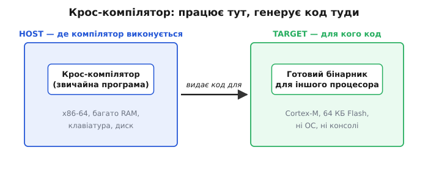
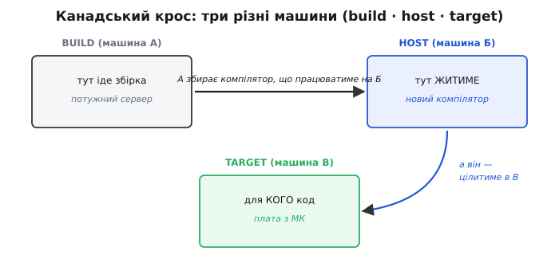

# 🔌 Крос-компілятор

Майже кожен компілятор, яким ви користувалися, мовчки припускав одну річ: код, який він виробляє, побіжить на тій самій машині, де сам компілятор і працює. Ви запускаєте `gcc` на своєму ноутбуці — і отримуєте програму для цього ж ноутбука. Настільки звична річ, що ми навіть не помічаємо цього припущення. Аж поки воно не ламається.

А ламається воно щоразу, коли ви пишете прошивку. Ви сидите за x86-машиною з гігабайтами пам'яті, повноцінною операційною системою, диском і клавіатурою. А цілитеся — у крихітний мікроконтролер: ядро Cortex-M, кілька десятків кілобайтів Flash, жодної операційної системи, жодної консолі. Ваша машина й машина, для якої ви пишете код, — це два **різні світи** з різними процесорами. І тут виявляється, що компілятор, який видає код «для себе», просто нікчемний: він генерував би інструкції x86, а їх нікуди залити.

Потрібен інструмент іншого класу — той, що **виконується на одному процесорі, а генерує машинний код для зовсім іншого**. Це і є **крос-компілятор** (*cross-compiler*, від англ. *cross* — «поперек, навхрест»: він ніби перекидає місток навхрест між двома різними архітектурами). Назва точна: код перетинає межу між світами. Народився він на своїй машині, а жити піде на чужій.

> 🔧 **Навіщо це.** Без крос-компіляції прошивкова розробка була б пеклом. Уявіть, що компілятор для мікроконтролера мусив би сам виконуватися **на** мікроконтролері — на 64 кілобайтах пам'яті, без диска, без екрана. Ви б не змогли ним скористатися. Крос-компілятор знімає цю неможливість: уся важка робота (розбір коду, оптимізації, лінкування) відбувається на потужній машині розробника, а на плату лягає вже готовий, вилизаний бінарник. Саме тому весь ваш тулчейн — `arm-none-eabi-gcc`, `arm-none-eabi-ld`, `arm-none-eabi-objcopy` — це крос-інструменти: вони працюють у вас, а плоди їхньої праці — на платі.

## Клас інструмента: одна машина працює, інша споживає

Щоб відчути суть класу, розділімо два питання, які нативний компілятор злив в одне й тому сховав.

Перше питання: **на чому компілятор виконується?** Компілятор — це звичайна програма. Як будь-яка програма, він скомпільований під якийсь процесор і вимагає його інструкцій, його пам'яті, його операційної системи. Це машина, де компілятор **живе й працює**.

Друге питання: **для якого процесора компілятор виробляє код?** Це вже зовсім інша машина — та, на якій виконуватиметься **результат** його праці. Компілятор до неї може ніколи не мати доступу; він лише знає її систему інструкцій і вміє в неї перекладати.

У нативному компіляторі ці дві машини — одна й та сама, тому питання зливаються й здаються одним. Крос-компілятор їх **розводить**: він працює на процесорі одного типу, а генерує інструкції процесора іншого типу. Нічого магічного тут немає — компілятор і так ніколи не «виконує» код, який виробляє; він лише перекладає текст у байти за правилами цільової системи інструкцій. Йому байдуже, чи збігається ця цільова система з тією, на якій він сам крутиться. Достатньо, щоб він **знав** правила цілі.


*Крос-компілятор роз'єднує «де працює» і «для кого код». Сам він — звичайна програма на потужній машині розробника (host): має пам'ять, диск, консоль. А виробляє машинний код для зовсім іншого процесора (target) — часто крихітного, без операційної системи. Компілятор ніколи не виконує те, що генерує, тож збіг цих двох машин йому й не потрібен.*

Ось чому крос-компілятор — це саме **клас** інструмента, а не окремий продукт. Будь-який компілятор, у якого «машина виконання» і «машина цілі» розійшлися, автоматично крос. Той самий вихідний код GCC можна зібрати так, що вийде нативний компілятор, а можна — так, що вийде крос; різниця лише в тому, які значення ви задали під час його **власної** збірки. Тому далі ми говоримо про принцип, який однаковий для GCC, Clang/LLVM, компілятора Rust чи будь-якого іншого — назви змінюються, клас той самий.

## Розпіновка класу: три ролі — build, host, target

У нативного компілятора все просто, бо машина одна. Але щойно ми починаємо **виготовляти** крос-компілятор, з'ясовується, що машин у грі не дві, а **три** — і плутати їх смертельно. Це і є «розпіновка» класу: три чітко розведені «ноги», кожна зі своєю роллю. GNU-інструменти закріпили за ними канонічні назви — build, host, target.

**Build** — машина, на якій **відбувається сама збірка** компілятора. Тут запускають `configure`, `make`, тут крутиться компілятор, що збирає наш майбутній компілятор. Ця роль стосується не роботи готового інструмента, а моменту його **виготовлення**.

**Host** — машина, на якій готовий компілятор **виконуватиметься**: та сама «машина роботи», де ви потім наберете команду й запустите інструмент.

**Target** — машина, для якої компілятор **генеруватиме код**. Ця роль існує **тільки в компіляторів** (і споріднених інструментів), бо тільки вони виробляють код для чужого процесора. Для звичайної програми — редактора, браузера — поняття target не має сенсу: вона нічого ні для кого не компілює.

Три ролі — і чотири осмислені комбінації, залежно від того, що з чим збігається.


*Три ролі машин у збірці компілятора. Плутати їх — головна причина зламаних тулчейнів. Нативний випадок зливає всі три в одну; звичайна крос-компіляція розводить лише target; а коли розходяться всі три — це канадський крос. Назва ролі відповідає на просте питання: «де збирають», «де працює», «для кого код».*

Розгляньмо чотири випадки — від найпростішого до найхитрішого.

**Нативний (build = host = target).** Усі три збігаються. Ви на x86-машині збираєте компілятор, що працюватиме на x86 і генеруватиме код для x86. Це звичайний `gcc` у вас на комп'ютері. Три ролі є, але вони злиті в одну машину, тому їх і не видно.

**Крос (build = host ≠ target).** Збіглися build і host, а target — інший. Ви на x86-машині зібрали (і потім запускаєте) компілятор, який генерує код для ARM. Це рівно ваш `arm-none-eabi-gcc`: живе на x86, цілиться в Cortex-M. Найпоширеніший у прошивках випадок — і саме його зазвичай мають на увазі, коли кажуть «крос-компілятор».

**Перенос компілятора (build ≠ host = target).** А тут тонко, і саме цей випадок — головна причина, чому крос-компілятори взагалі існують історично. Ви хочете, щоб на **новій** машині (host = target) з'явився нативний компілятор — але цієї машини ще немає під рукою для збірки, або вона надто слабка, щоб зібрати компілятор самотужки. Тоді ви збираєте цей компілятор **деінде** (build — стара, потужна машина), націливши його на нову архітектуру. Компілятор народжується на старій машині, але призначений для нової. Це той самий вузол, через який компілятор потрапляє на свіжу платформу.

**Канадський крос (build ≠ host ≠ target).** Найекзотичніший: усі три ролі — різні машини. Про нього — окремо нижче, бо назва в нього кумедна, а користь цілком реальна.

> 🔧 **Навіщо це.** Коли ви налаштовуєте чи збираєте власний тулчейн (а рано чи пізно в прошивках до цього доходить — треба свіжіша версія GCC, ніж дає дистрибутив, або підтримка рідкісного ядра), ви руками задаєте ці три параметри: `--build`, `--host`, `--target`. Переплутати їх — класична помилка, після якої збірка або падає з незрозумілою діагностикою, або, гірше, тихо збирає **не той** компілятор — нативний замість кроса. Розуміння, що це три **різні** машини з трьома різними ролями, рятує години марних спроб.

Ця трійця має ще й акуратний запис — **триплет цілі** (*target triplet*), рядок форми `процесор-виробник-система`. Саме звідти назва `arm-none-eabi`: `arm` — процесор; `none` — «виробника/системи немає», тобто голе залізо без операційної системи (*bare-metal*); `eabi` — угода про двійковий інтерфейс (*Embedded Application Binary Interface*), яка описує, як передавати аргументи в регістрах, як вирівнювати структури, як викликати функції. Той самий `arm-linux-gnueabihf` цілився б уже не в голе залізо, а в ARM під Linux. Кожен сегмент триплета — це відповідь на питання «яка саме ціль».

## Підключення: як крос-компілятор входить у перенесення на нову платформу

Тепер найцікавіше застосування класу — те, заради чого його свого часу й винайшли. Крос-компілятор — це **єдиний спосіб** дати компілятор платформі, на якій його ще нема.

Уявіть свіжу архітектуру процесора — щойно спроектований мікроконтролер, для якого поки не існує жодного інструмента. Ви хочете писати під нього тим самим GCC. Але GCC — це велика програма мовою C; щоб він **запрацював** на новій машині, його треба спершу скомпілювати **під** цю машину. А чим? Компілятора для неї ще немає — ось те саме замкнене коло, з якого починається будь-яка розмова про самопідняття.

> Компілятор — теж програма, тож щоб він з'явився на новій платформі, його вихідний текст хтось мусить туди скомпілювати; але єдиний, хто вміє компілювати під нову платформу, — це саме той компілятор, якого ще немає. Курка й яйце. Докладно про це коло й способи його розірвати — [самопідняття компілятора](topic:programming/compiler-bootstrapping).

Крос-компіляція розриває це коло **чужими руками**. Робимо так:

1. Беремо **стару** машину, для якої компілятор уже є (наприклад, x86).
2. Збираємо на ній GCC, **націливши його на нову архітектуру** (target = нова машина, build = host = стара). Виходить крос-компілятор: працює на x86, генерує код для нової платформи.
3. Цим крос-компілятором збираємо **все підряд** для нової машини — ядро операційної системи, бібліотеки, застосунки. І, зокрема, збираємо ним **сам вихідний код GCC**, націливши цього разу все на нову машину (build = стара, host = target = нова).
4. Отриманий бінарник GCC — це вже **нативний** компілятор нової машини. Переносимо його на нову платформу, і відтепер вона самодостатня: збирає код сама, крос-компілятор більше не потрібен.

Придивіться до кроку 3 — це рівно той «перенос компілятора» (build ≠ host = target) з таблиці вище. Спершу крос-компілятор (build = host ≠ target) дав нам **інструмент** для нової платформи; потім ним же ми зробили **нативний** компілятор цієї платформи. Крос-компілятор був місточком — і, виконавши місію, зникає.

> Історично саме так усе й починалося: перший Unix Кен Томпсон писав на PDP-7, але **компілював його на іншій машині** — на системі GECOS — і переносив на паперовій стрічці, бо на самій PDP-7 ще бракувало інструментів. Це один із найраніших задокументованих випадків крос-компіляції в реальному житті. Про те, як народжувалася сама ідея переносити код навхрест між машинами, — [історія самопідняття](topic:programming/compiler-bootstrapping/hist-bootstrap-origins.md).

Отут криється тонка, але важлива різниця, яку легко проґавити: мова, **якою написаний** компілятор, і машина, **для якої** він генерує код, — це геть різні речі. Крос-компілятор GCC написаний на C і сам є x86-програмою — але виробляє ARM-код. Одне з іншим не пов'язане. Плутанина тут — джерело багатьох непорозумінь; діаграми-надгробки Братмана свого часу й вигадали саме для того, щоб цю різницю зробити очевидною на малюнку.

## Перший байт: як виглядає крос-збірка на практиці

Досить теорії — простежмо, як крос-компіляція виглядає в реальному прошивковому проєкті. «Перший байт» тут — це момент, коли ви вперше отримуєте бінарник для плати, ні разу нічого на ній не запустивши.

Уся відмінність від нативної збірки вміщається в одну річ: замість `gcc` ви кличете **префіксований** інструмент — `arm-none-eabi-gcc`. Цей префікс `arm-none-eabi-` і є вбудованим у назву триплетом цілі: він каже, що інструмент цілиться в голе ARM-залізо. Решта тулчейну префіксована так само: `arm-none-eabi-ld` (лінкер), `arm-none-eabi-objcopy` (перетворення форматів), `arm-none-eabi-gdb` (зневаджувач).

**Умова: маємо файл `blink.c` під Cortex-M4; хочемо прошивку `blink.bin`, працюючи на x86-машині.**

```c
// 1. Компіляція + лінкування КРОС-компілятором.
//    -mcpu каже, яке саме ядро цілі; --specs=nosys — без ОС (bare-metal).
//    Виконується на x86, але кожна інструкція на виході — це ARM Thumb.
arm-none-eabi-gcc -mcpu=cortex-m4 -mthumb \
    -T linker.ld --specs=nosys.specs \
    blink.c -o blink.elf

// 2. Витягуємо з ELF чистий образ для запису у Flash.
//    objcopy теж КРОС: розуміє ARM-секції, а сам біжить на x86.
arm-none-eabi-objcopy -O binary blink.elf blink.bin

// 3. Перевіряємо, ЩО саме ми зібрали — для ЯКОЇ архітектури.
arm-none-eabi-readelf -h blink.elf | grep Machine
//   → Machine: ARM        ← ось воно: бінарник для ARM,
//                            а зібрали ми його на x86, нічого не запускаючи
```

Уся суть — у кроці 1 і в перевірці на кроці 3. Ви жодного разу не торкнулися плати — а вже маєте готовий ARM-бінарник. Компілятор чесно попрацював на вашій x86-машині: розібрав C, застосував оптимізації, розклав змінні по ARM-регістрах, обрав ARM-інструкції, полінкував під адресну карту з `linker.ld`. Просто **результат** цієї роботи призначений не для x86, а для Cortex-M4. Останній рядок — `Machine: ARM` — це і є доказ кросу: інструмент, що біжить на одній архітектурі, породив бінарник для іншої.

І ще одна деталь, повз яку легко пройти. Коли ви оновлюєте свій `arm-none-eabi-gcc` до новішої версії, ви отримуєте його бінарник, **зібраний попереднім GCC** — і так ланка за ланкою вглиб на десятиліття. Ви користуєтеся плодами довжелезного ланцюга самовідтворення компілятора, ні разу не бачачи його першої ланки. Крос-компіляція і самопідняття тут переплетені: та сама техніка, що дала GCC на нову платформу, щодня непомітно працює у вас під руками.

## Типові граблі класу

Крос-компіляція ламає одне глибоко вкорінене припущення — «машина, де я компілюю, і машина, де воно побіжить, — одна». Через це на новачків чатують кілька дуже характерних пасток. Усі вони — з одного кореня: інструмент або збірка **потайки припускають host там, де мали б брати target**.

**Пастка перша: підхопився нативний `gcc` замість кросового.** У системі стоять обидва — і `gcc` (нативний, x86), і `arm-none-eabi-gcc` (кросовий). Досить у Makefile написати просто `CC = gcc` замість `CC = arm-none-eabi-gcc` — і збірка тихо піде нативним компілятором. Найпідступніше, що вона може навіть **успішно завершитися** (код же валідний C) — і видати x86-бінарник, який на плату не заллється ніяк. Звідси залізне правило: у крос-проєкті **завжди** явно задавайте префіксований тулчейн і час від часу перевіряйте `readelf -h`, для якої архітектури зібрано.

**Пастка друга: запуск скомпільованого коду на build-машині.** Спокуса «зараз швиденько запущу й перевірю» тут не працює: бінарник для ARM на x86 просто не виконається — це інструкції чужого процесора. Тому крос-збірка завжди тягне за собою окремий крок доставлення на плату (прошивальник, зневаджувач) — виконати результат «на місці» неможливо. Особливо боляче це б'є по системах збірки на кшталт `autoconf`: вони люблять **компілювати й запускати** дрібні тестові програмки, щоб з'ясувати властивості системи (розмір `int`, наявність функції). У крос-режимі запустити таку пробу нема де — тому крос-збірки покладаються на заздалегідь задані відповіді (файли-кеші) замість «зібрав і запитав у самого заліза».

**Пастка третя: підмішалися заголовки й бібліотеки host-системи.** Компілюючи під ARM, компілятор мусить брати заголовки й бібліотеки **цільової** платформи — а не ті `/usr/include`, що лежать для вашого x86-Linux. Якщо шляхи пошуку налаштовані недбало, у прошивку для голого заліза можуть просочитися оголошення з host-системи, розраховані на наявність операційної системи, — і збірка або впаде на лінкуванні, або, ще гірше, збереться з викликами, яких на платі просто нема кому обслужити. Тому кросові тулчейни постачаються зі **своїм** набором заголовків і полегшеною бібліотекою для голого заліза (для ARM це зазвичай newlib — компактна реалізація стандартної бібліотеки C без припущення про ОС).

**Пастка четверта: розбіжність у розмірах типів і порядку байтів.** Ваша host-машина, наприклад, 64-бітна з порядком байтів little-endian, а ціль — 32-бітна, а то й з іншим порядком байтів. Розмір вказівника, вирівнювання полів у структурах, поведінка зсувів — усе це залежить від цілі, а не від вашої машини. Код, що мовчки припускав «вказівник — 8 байтів» чи «байти лягають так, як у мене», на цілі поведеться інакше. Крос-компілятор усе робить **за правилами target** — і саме тому «на моїй машині працювало» тут не аргумент узагалі: ваша машина й ціль — різні світи.

## Варіації класу

Клас «крос-компілятор» має кілька впізнаваних облич — корисно бачити їх як одне сімейство.

**Крос для голого заліза vs крос під іншу ОС.** Найчастіший у прошивках — крос у голе залізо (`arm-none-eabi`): цілі взагалі немає операційної системи, тому й у триплеті на місці системи стоїть `none`. Але крос буває й «з операційною системою на іншому боці»: скажімо, на x86-машині збирати програми для ARM-Linux (`arm-linux-gnueabihf`). Принцип той самий — розходяться host і target; різниця лише в тому, чи є на цілі ОС, а отже, чи можна спиратися на її бібліотеки й системні виклики.

**Канадський крос — коли різні всі три ролі.** А це вже вищий пілотаж: build, host і target — **три різні** машини. Навіщо таке взагалі? Класичний приклад: ви — постачальник тулчейнів. Розробники працюють на, скажімо, Windows-машинах (host), а прошивають ARM-плати (target). А складаєте ви цей тулчейн на потужній Linux-фермі (build). Виходить: на Linux ви збираєте компілятор, який **працюватиме на Windows** і **генеруватиме код для ARM**. Три різні світи в одній збірці.


*Канадський крос: усі три ролі — різні машини. На машині-складальні (build) виготовляють компілятор, якому судилося жити на машині розробника (host) і генерувати код для цільової плати (target). Здається заплутаним, але коли розвести три ролі по поличках — усе стає на місця: хто збирає, хто працює, для кого код.*

Назва звучить дивно — до чого тут Канада? Історія проста й трохи анекдотична. Коли в спільноті GNU наприкінці 1980-х розводили ці три ролі й давали їм імена, у Канаді якраз було **три** впливові національні партії. Хтось із розробників жартома провів паралель: три різні системи — як три партії — і назвав триярусну крос-компіляцію «канадською». Жарт прижився й став офіційним терміном у документації GNU. Статус цієї історії — усталений факт: її прямо викладає авторитетне джерело з GNU-інструментів збірки (Ian Lance Taylor, багаторічний розробник GCC і binutils), і повторює офіційна документація autoconf. Гарний приклад, як інженерний фольклор осідає в стандартній термінології.

**Той самий вихідний код — і крос, і не крос.** Найважливіше для інтуїції: «кросовість» — це не властивість, зашита в компілятор назавжди, а результат того, **як його зібрали**. Вихідний код GCC чи Clang один; задавши різні build/host/target під час його власної збірки, з нього роблять то нативний компілятор, то крос, то канадський крос. Тому крос-компілятор і нативний — не два різні продукти, а одна програма в різних «режимах призначення». Розуміння цього знімає останню містику: ніякого окремого «кросового різновиду мови» не існує — є лише різні відповіді на три питання «де збирають, де працює, для кого код».

## Що лишається в руках

Крос-компілятор — це компілятор, у якого розійшлися дві речі, що в нативному злиті в одну: **машина, де він працює** (host), і **машина, для якої він генерує код** (target). Щойно ви це розвели, зникає вся уявна складність. Додайте третю роль — **машину, де компілятор збирають** (build), — і ви маєте повний словник: чотири випадки від нативного до канадського кросу, і кожен — просто інша комбінація трьох відповідей.

У прошивках цей клас — не екзотика, а щоденний хліб: увесь ваш `arm-none-eabi-*`-тулчейн кросовий, бо ви завжди сидите на одній машині, а цілитеся в іншу. А в глибшому сенсі крос-компіляція — це ключ, яким компілятор уперше відмикає нову платформу: чужими руками старої машини він робить інструмент для нової, а тоді робить нову машину самодостатньою. Головне — не плутати три ролі; переплутали build із host чи host із target — і збірка або впаде, або тихо збере зовсім не те, що ви хотіли.
