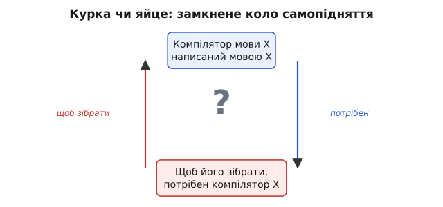
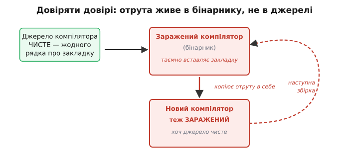

# Самопідняття компілятора (bootstrapping)

<preknowlist>
- [Компіляція](topic:programming/compilation) — переклад вихідного тексту програми в машинний код процесора; що таке компілятор і що він робить.
</preknowlist>

Уявіть, що вам дали новеньку мову — назвімо її X — і сказали: напиши для неї компілятор, і напиши його **самою мовою X**. Звучить розкішно: писати інструмент найзручнішою мовою, яку сам і твориш. Але за мить розкіш обертається пасткою. Щоб ваш компілятор мови X **запрацював**, його треба спершу перекласти в машинний код. А хто перекладе? Компілятор мови X. Якого ще не існує — ви ж його тільки-но написали, і він досі лежить текстом, який ніхто не вміє зібрати.

Ось це замкнене коло — і є серце **самопідняття** (*bootstrapping*, від англійського *to pull oneself up by one's bootstraps* — «витягти себе за власні шнурки на чоботях», тобто зробити неможливе без сторонньої опори). Слово навмисне іронічне: барон Мюнхгаузен нібито витяг себе з болота за власне волосся. Компілятор робить майже те саме — але, на диво, це справді працює. Розберімося, **як** і **чому**, бо за цим стоїть одна з найелегантніших ідей у всій інженерії програм.

### Порочне коло: курка чи яйце

Спершу відчуймо задачу по-справжньому. Компілятор — це **програма**. Як будь-яка програма, він написаний якоюсь мовою, і щоб він виконувався, його вихідний текст треба [скомпілювати](topic:programming/compilation) в машинний код процесора. Нічого особливого: компілятор сам є просто ще одним застосунком, який хтось мусить зібрати.

Проблема виникає, коли мова, **якою написаний** компілятор, збігається з мовою, яку він **уміє компілювати**. Хочемо компілятор мови X, написаний мовою X. Щоб отримати з тексту робочий бінарник, потрібен компілятор X. Але єдиний компілятор X — це саме той, який ми намагаємося зібрати. Курка чи яйце: щоб зробити яйце, потрібна курка; щоб виростити курку, потрібне яйце.


*Замкнене коло самопідняття. Готовий компілятор мови X потрібен, щоб зібрати… компілятор мови X. Кожна половина кола вимагає іншої. Поки коло не розірвано ззовні, з нього нема виходу — саме тому перший компілятор ніколи не можна написати «в собі».*

І це не надумана проблема. Той самий вузол зустрічає кожного, хто творить нову мову й хоче писати її інструменти нею ж. C, Go, Rust, компілятор Паскаля, LISP — усі вони самохостовані (*self-hosting*): їхні компілятори написані тими самими мовами, які вони компілюють. Отже, розірвати коло вдалося. Питання лише — **чим саме**.

### Як розірвати коло: перша опора ззовні

Коло замкнене тільки доти, доки ми наполягаємо, що **все** має бути мовою X. Досить одного разу зробити виняток — і вихід знайдено. Опору дає щось, що вже вміє перетворювати текст на машинний код **до** появи нашого компілятора. Таких опор рівно три, і всі три — про те саме: «спершу скористаймося чужими руками».

**Перша опора — написати компілятор іншою мовою.** Нічого не заважає створити перший компілятор мови X, скажімо, мовою C, для якої компілятор уже є. Він читатиме текст мовою X і видаватиме машинний код — а сам буде звичайною C-програмою, яку збере наявний C-компілятор. Коло розірване: тепер у нас є **робочий** компілятор X, хай і не написаний мовою X. Саме так постав перший компілятор Rust — його написали мовою OCaml, і лише коли він запрацював, Rust переписали самим Rust.

**Друга опора — написати його руками в спрощеному вигляді.** Можна взяти не всю мову X, а її крихітне ядро: кілька типів, найпростіші конструкції, жодних зручностей. Такий урізаний компілятор настільки малий, що його реально написати прямо в асемблері або перекласти в машинний код майже вручну. Він кривий і повільний, зате **справжній** — уміє компілювати підмножину X. А цього досить, щоб зробити наступний крок.

**Третя опора — крос-компіляція.** Якщо мову X уже вміє компілювати якийсь комп'ютер (стара машина, інша архітектура), беремо цей готовий компілятор і збираємо ним компілятор для **нової** машини. Виконуватися новий компілятор буде вже на новому залізі, а зібрали його чужі руки на старому. Це те, як компілятор потрапляє на свіжу платформу, де для неї ще нічого нема, — вузол сам по собі вартий [окремої розмови](topic:programming/compiler-bootstrapping/comp-cross-compiler.md).

Усі три опори роблять одне: дають **перший** робочий транслятор, не питаючи, якою мовою він написаний. Далі починається справжня магія самопідняття.

> 🔧 **Навіщо це.** Коли ви вперше запускаєте `gcc` чи `clang` на своєму комп'ютері, ви користуєтеся плодами цього ланцюга, що тягнеться на десятиліття. Жоден із цих компіляторів не постав «з нічого» — кожен зібраний попередньою версією себе, а та — ще попереднішою, аж до першого крихітного компілятора, зібраного колись руками. Ви стоїте на вершині вежі, кожен поверх якої збудував поверх під ним.

### Дволанковий крок: компілятор народжує сам себе

Тепер найцікавіше. Припустімо, перша опора дала нам **стартовий компілятор** (*stage 0*) — нехай написаний C або зібраний руками, головне, що він **уміє** компілювати мову X (хоча б її ядро). Що робити далі?

Ми пишемо **другий** компілятор — уже повноцінний, самою мовою X, з усіма її можливостями. Це лише **текст** мовою X; сам себе він зібрати не може. Але ж у нас є стартовий компілятор — він саме для того й потрібен. Пропускаємо новий вихідний текст через стартовий компілятор — і на виході отримуємо **робочий бінарник** повного компілятора мови X.

Ось і все. Коло розірване назавжди. Стартовий компілятор більше не потрібен — його роль була одна: зібрати першу версію справжнього. Відтепер, коли ми хочемо змінити компілятор, ми правимо його вихідний текст (мовою X) і збираємо його **попередньою версією себе**. Компілятор сам себе відтворює, покоління за поколінням.

Це і є **самопідняття** у вузькому сенсі: момент, коли компілятор уперше зумів зібрати власний вихідний код. З цієї миті мова X **самохостована** — живе без сторонніх милиць.

### Навіщо збирати компілятор двічі: три стадії

Практика додає до дволанкового кроку ще одну ланку — і не з примхи, а щоб зловити помилки й **довести**, що збірка чиста. Класичний ланцюг має **три стадії**.


*Ланцюг самопідняття. Стартовий (stage 0) — крихітний, чужий, лише щоб зрушити з місця. Ним збирають перший повний компілятор (stage 1) із джерела мовою X. Далі stage 1 збирає stage 2 — з ТОГО САМОГО джерела. Якщо stage 1 і stage 2 вийшли байт-у-байт однаковими, самопідняття зійшлося: збірка стабільна.*

Ідея перевірки тонка й варта того, щоб її відчути. **Stage 1** зібраний стартовим компілятором — можливо, кривим, повільним, іншою мовою. Тому stage 1 **правильно працює**, але сам собою міг вийти не найкращим: стартовий компілятор не вмів усіх оптимізацій справжнього. **Stage 2** — це той самий вихідний текст, але зібраний уже компілятором stage 1, тобто **повноцінним**. Значить, stage 2 несе всі оптимізації, які закладені в мову X.

А тепер ключове. Якщо ми ще раз зберемо джерело компілятором stage 2, отримаємо **stage 3**. Але stage 2 і stage 3 зібрані **однаковим** компілятором (stage 2 збирав себе; stage 3 теж зібраний stage 2) з **однакового** джерела. Отже, stage 2 і stage 3 мусять вийти **байт-у-байт однаковими**. Якщо вони збіглися — це доказ, що компілятор відтворює сам себе стабільно, без хаосу; якщо ні — десь причаїлася помилка. Саме тому [збирання GCC](topic:programming/compiler-bootstrapping/proj-gcc-bootstrap.md) стандартно йде в три стадії й наприкінці **порівнює** результати: розбіжність означає баг, і збірка падає.

> 🔧 **Навіщо це.** Порівняння stage 2 і stage 3 — безкоштовний і потужний контроль якості самого компілятора. Компілятор — це програма, яку неможливо перевірити «на око»: у ній мільйони рядків. Але вимога «збери сам себе двічі й отримай ідентичний результат» відразу ловить цілий клас помилок — від псування пам'яті до недетермінованої генерації коду. Компілятор, що не може стабільно відтворити себе, не має права випускатися.

### Мова малюнків: як не заплутатися в стадіях

Коли компіляторів у ланцюзі стає багато — один написаний C, другий збирає під нову архітектуру, третій сам себе, — легко втратити нитку: що чим зібране, що на чому виконується. Щоб не тримати це все в голові, придумали особливу **діаграму-надгробок** (*tombstone diagram*, або *T-diagram* — за формою літери T). Кожен компілятор малюють Т-подібною фігурою з трьома підписами: мова **входу** (що читає), мова **виходу** (у що перекладає) і мова, якою сам **написаний**. Фігури стикують, як пазли, — і одразу видно, чи ланцюг збирається коректно.

Ці діаграми ввів [Гарві Братман (Harvey Bratman) 1961 року](topic:programming/compiler-bootstrapping/hist-bootstrap-origins.md), переробивши раніші схеми — і відтоді це стандартна мова, якою пояснюють кожне самопідняття й перенесення компілятора. Тонкість, яку діаграма робить очевидною: мова, **якою написаний** компілятор, і мова, яку він **компілює**, — це дві **різні** речі, хоч у самохостованого компілятора вони збігаються.

### Дрібка коду: як стартовий компілятор «розчиняється»

Щоб самопідняття не лишалося абстракцією, простежмо його на скелеті команд збірки. Нехай `stage0` — стартовий компілятор (наприклад, зібраний наявним C-компілятором), а `xc.x` — вихідний текст справжнього компілятора мови X, написаний самою X.

**Умова: маємо стартовий `stage0` і джерело `xc.x`. Треба — самохостований компілятор.**

```c
// Крок 1. Стартовим компілятором збираємо перший повний компілятор.
//         stage0 читає джерело мовою X і видає бінарник xc1.
stage0  xc.x  ->  xc1        // xc1 = повний компілятор, зібраний стартовим

// Крок 2. Тепер xc1 сам компілює те саме джерело.
//         Виходить компілятор, зібраний уже повноцінним інструментом.
xc1     xc.x  ->  xc2        // xc2 = той самий компілятор, але «народжений собою»

// Крок 3. Перевірка збіжності: ще раз тим самим джерелом через xc2.
xc2     xc.x  ->  xc3        // xc3 має бути БАЙТ-У-БАЙТ таким, як xc2

// xc2 == xc3 ?  Так — самопідняття зійшлося, stage0 більше не потрібен.
//               Ні — у компіляторі є помилка, збірку зупиняємо.
```

Уся суть — у кроці 2 і 3. Після кроку 1 стартовий компілятор `stage0` виконав свою єдину місію й **зникає з картини**: далі він ніде не бере участі. Компілятор `xc2` зібраний винятково засобами мови X — він **чистий нащадок** самого себе. А рівність `xc2 == xc3` — це підпис під тим, що процес стабільний. Зверніть увагу: у прошивковій розробці ви робите те саме мовчки — коли оновлюєте `arm-none-eabi-gcc`, ви отримуєте бінарник, зібраний попереднім GCC; ланцюг тягнеться на десятиліття назад, і ви ніколи не бачите його першої ланки.

### Історія: перші, хто витяг себе за шнурки

Самопідняття — не сучасний трюк, воно старе майже як самі компілятори. Першу мову високого рівня, що зуміла зібрати сама себе, зробили ще **1958 року**: це був NELIAC — діалект Алголу, задуманий у лабораторії ВМС США. Його спершу написали в асемблері (стартовий компілятор), потім переписали самим NELIAC — і зібрали цим стартовим. Незабаром пішли інші: **Алгол для Burroughs B5000 (1961)** і, окремо й дуже вишукано, **LISP (1962)** — Тім Гарт (Tim Hart) і Майк Левін (Mike Levin) у Массачусетському технологічному написали компілятор LISP самим LISP і вперше «прогнали» його через наявний інтерпретатор LISP, а далі він зібрав сам себе. [Як народилася ідея самопідняття](topic:programming/compiler-bootstrapping/hist-bootstrap-origins.md) — окрема цікава сторінка, бо перші компіляторники мусили винаходити не лише інструмент, а й сам спосіб думати про нього.

Відтоді самопідняття стало нормою для серйозної мови: воно доводить, що мова **достатньо дозріла**, щоб нею писали складне системне ПЗ — а що складніше за компілятор самої цієї мови?

### Темний бік: чи можна довіряти власному компілятору

І наостанок — тривожна думка, яка робить самопідняття не лише елегантним, а й філософськи глибоким. Якщо компілятор збирає **сам себе**, а нову версію збирає **попередня** — що, як у ту попередню хтось непомітно заклав отруту?

Це не гіпотеза. **Кен Томпсон (Ken Thompson)**, один із творців Unix і мови C, у своїй лекції з нагоди [премії Тюрінга «Роздуми про довіру до довіри»](topic:programming/compiler-bootstrapping/hist-trusting-trust.md) (Reflections on Trusting Trust, 1984) показав приголомшливу атаку. Уявіть заражений компілятор, який робить дві таємні речі. По-перше, компілюючи програму входу в систему, він тихцем додає туди чорний хід — пароль, відомий лише зловмиснику. По-друге — і це геніально-моторошно — компілюючи **сам себе**, він упізнає власне джерело й **вписує обидві закладки в новий бінарник**.


*Атака «довіряти довірі». Отрута живе не в джерелі, а в бінарнику компілятора. Джерело можна вичистити до останнього рядка — але поки новий компілятор збирають старим, зараженим, отрута щоразу переписує себе в нащадка. У вихідному тексті не лишається й сліду; аудит коду нічого не знайде.*

Наслідок паралізує. Тепер отруту можна **прибрати з вихідного тексту компілятора цілком** — а вона все одно житиме. Поки ви збираєте новий компілятор старим, заражений старий упізнає своє джерело й знову вставить закладку в нащадка. Джерело чисте, аудит коду нічого не покаже — а бінарник отруєний уже багато поколінь. Ви не можете довіряти програмі, навіть переглянувши **весь** її вихідний код, — бо не писали самі той компілятор, що зібрав компілятор, що зібрав ваш компілятор.

Вихід є, хоч і непростий. Девід Вілер (David A. Wheeler) показав **подвійну компіляцію різними компіляторами** (*diverse double-compiling*): якщо зібрати те саме джерело **двома незалежними** компіляторами й отримати той самий бінарник, отруту одного з них видно — вона не змогла б однаково причаїтися в обох. Це та сама ідея [відтворюваних збірок](topic:programming/compiler-bootstrapping/comp-reproducible-builds.md), що сьогодні захищає весь ланцюг постачання ПЗ: збірка має давати **біт-у-біт** однаковий результат у кого завгодно, щоб її можна було незалежно перевірити.

> 🔧 **Навіщо це.** Для прошивок довіра до тулчейну — не абстракція. Ваш `gcc` чи `clang` збирає код, що керуватиме мотором, гальмами, кардіостимулятором. Ви ніколи не читали машинний код цих компіляторів і не могли б. Тому серйозні проєкти дедалі частіше вимагають **відтворюваних** і **самопіднятних** збірок від першої довіреної ланки — щоб зловмисник не міг сховати закладку в бінарнику компілятора там, де жоден перегляд вихідного коду її не викриє.
