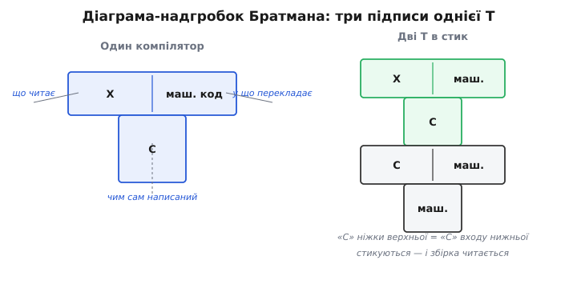

# 📜 Хто перший витяг компілятор за власні шнурки

Ідея, що програма може зібрати сама себе, звучить як парадокс — і саме тому люди, які вперше її здійснили, мусили не просто написати код, а спершу переконати себе, що це взагалі не шахрайство й не хибне коло. Наприкінці 1950-х це було зовсім не очевидно. Компілятор тоді був рідкістю, розкішшю, майже дивом: більшість програмістів досі писали в машинних кодах або асемблері й ставилися до самої думки «нехай машина сама перекладає високу мову» з осторогою. І от у цій атмосфері хтось пропонує ще зухваліше: нехай транслятор, написаний власною ж мовою, **перекладе сам себе**. Розберімося, звідки ця думка взялася, хто зважився її втілити і, окремо, звідки взялася химерна мова малюнків — Т-подібні «надгробки», якими досі малюють кожне самопідняття.

## Що саме бентежило перших

Щоб відчути, чому це було нетривіально, треба стати на місце людини 1957 року. Ви пишете компілятор нової мови. Природне питання: якою мовою його писати? Асемблер — важко, довго, помилки на кожному кроці. А що, як писати компілятор **тією самою** мовою, яку він компілює? Тоді ви пишете зручно, високо, коротко. Спокуса очевидна. Але тут-таки виринає заперечення, що здається нищівним: щоб ваш текст запрацював, його треба перекласти в машинний код — а перекладати вміє лише компілятор цієї мови, якого ще нема, бо ви його якраз і пишете.

Здоровий глузд каже: глухий кут. І багато хто на цьому й спинявся. Прозріння полягало в тому, щоб побачити: кут глухий лише доти, доки ви наполягаєте писати **відразу все й відразу нею**. Досить один раз змахлювати — написати крихітне ядро мови чимось іншим, хай навіть асемблером, — і коло розривається. Це ядро збере наступну, багатшу версію; та збере ще багатшу; аж поки компілятор не доросте до того, щоб зібрати власний повний текст. Звучить просто, коли вже знаєш відповідь. Але хтось мусив уперше не злякатися видимого парадоксу й довести його ділом.

## NELIAC: перший, хто зробив це насправді (лабораторія ВМС США, 1958)

Першою мовою високого рівня, чий компілятор зумів зібрати сам себе, стала **NELIAC** — і сталося це **1958 року** в Лабораторії електроніки ВМС США (Navy Electronics Laboratory, NEL) у Сан-Дієго. Назва — акронім: Navy Electronics Laboratory International ALGOL Compiler, тобто «міжнародний АЛГОЛ-компілятор Лабораторії електроніки ВМС». За суттю NELIAC був діалектом щойно народженого Алголу (ALGOL 58) — тодішньої першої спроби зробити спільну міжнародну мову для наукових обчислень.

Задум належав **Гаррі Гаскі (Harry Huskey, 1916–2017)** — на той час голові ACM (Association for Computing Machinery, головної професійної спільноти в обчислювальній справі) і вже досвідченому інженерові-обчислювачу. Постать колоритна: американець із Північної Кароліни, він працював зі справжніми піонерами — доклав рук до ранніх ENIAC та EDVAC, рік провів у британській Національній фізичній лабораторії, де разом з іншими будував Pilot ACE — машину, задуману **Аланом Тюрінгом (Alan Turing)**. Потім спроєктував SWAC у Бюро стандартів і машину G-15 для Bendix. Тобто до NELIAC Гаскі підійшов людиною, яка бачила народження обчислювальної техніки зсередини й розуміла, чого коштує кожен рядок машинного коду. Підтримав задум **Моріс Голстед (Maurice Halstead)** — керівник обчислювального центру лабораторії (згодом його ім'я стане відомим у зовсім іншому контексті — «метрики Голстеда» для оцінки складності програм). Цікава деталь для історії мов: серед тих, хто працював над NELIAC, був і молодий **Ніклаус Вірт (Niklaus Wirth)** — майбутній творець Паскаля.

> 🔧 **Навіщо це.** Коли сьогодні кажуть «мова дозріла», часто мають на увазі саме цей поріг: чи здатний її компілятор зібрати сам себе. NELIAC першим показав, що поріг узагалі переступний — і відтоді самопідняття стало неписаним іспитом на зрілість для кожної серйозної системної мови.

Найцікавіше — **як** саме розірвали коло, бо це канонічний зразок, за яким робитимуть усі наступні. Спершу крихітну версію NELIAC написали **в асемблері** — це і був стартовий компілятор (той самий «махлюнок» ззовні). Потім той самий компілятор **переписали вже самою NELIAC** — і згодували цей текст стартовому, асемблерному. На виході — робочий компілятор, зібраний власною мовою. А далі — контрольний штрих: цей новий компілятор **перекомпілював сам себе ще раз**, після чого стартовий, асемблерний, ставав непотрібним і його викидали. Класична триланкова схема самопідняття — уже тут, у першому ж випадку.

```
крок 1:  асемблерне ядро  компілює  джерело NELIAC  →  компілятор A
крок 2:  компілятор A     компілює  те саме джерело →  компілятор B
         (асемблерне ядро більше не потрібне — його викидають)
```

Один нюанс варто позначити чесно, бо джерела його не приховують. Кажуть «NELIAC, 1958» — але робота **розпочалася 1958-го, а повністю доведена була аж близько 1961 року**. Перша версія бігала на прототипі комп'ютера AN/USQ-17, який у лабораторії ласкаво прозвали **«Графинею» (the Countess)** — на честь Ади Лавлейс, графині Лавлейс (Ada Lovelace, Countess of Lovelace), яку вважають першою програмісткою. Далі NELIAC розповзся на цілу низку машин свого часу — CDC 1604, кілька моделей UNIVAC (1107, 490, 418), IBM 704 і 709; а сам Алгол тим часом розвивався далі (ALGOL 60), і NELIAC із ним поступово розійшовся.

**Статус доказовості: усталено.** Що NELIAC був першим самокомпільованим компілятором, згоджуються довідкові й історичні джерела; імена Гаскі та Голстеда, роль асемблерного стартового ядра, машина-«Графиня» — усе це підтверджене. Обережність лише щодо дати: «1958» — рік початку, а не рік готового результату.

## Алгол на Burroughs B5000 (1961): коли самопідняття стало основою цілої системи

Майже водночас, але з іншого боку, до тієї самої ідеї підійшла фірма Burroughs. Її машина **B5000 (1961)** була незвичайна: її архітектуру навмисне заточили під те, щоб **добре компілювати Алгол** — рідкісний випадок, коли залізо проєктували під високу мову, а не навпаки. І операційну систему цієї машини, MCP, написали не в асемблері, а мовою **ESPOL** — розширенням Алголу-60 (по суті, ранньою системною мовою: Алгол плюс те, чого бракує для роботи з залізом — переривання, багатопроцесорність тощо).

Що тут важливо для нашої історії: щойно Алгол-компілятор на B5000 запрацював, наступний компілятор для підмножини Алголу **вивели з нього самого** — «клонували» з робочого, щоб розробляти дальшу систему для наступної машини, B5500. Тобто компілятор уже жив за законом самопідняття: нову версію народжувала попередня. Це показує, що самопідняття не було одиничним трюком заради ефекту — воно швидко стало **робочим способом розвивати цілу програмну платформу**, а не лише сам компілятор.

**Статус доказовості: усталено** щодо архітектури під Алгол, ESPOL і року (1961); формулювання «самохостований» тут доречне саме в тому сенсі, що нову версію компілятора виводили з чинної.

## LISP у LISP (MIT, 1962): найвишуканіший випадок

І окремо — може, найкрасивіший приклад раннього самопідняття. **1962 року** в Массачусетському технологічному (MIT) **Тімоті Гарт (Timothy P. Hart)** і **Майкл Левін (Michael I. Levin)** написали компілятор LISP **самою мовою LISP**. Краса тут — у природі LISP. У цій мові програма й дані записуються **тим самим** способом (списками, так званими S-виразами), тож означити компілятор як звичайну функцію над даними — гранично природно. Компілятор LISP — це просто функція, яка бере на вхід S-вираз (текст програми) і повертає інший S-вираз (машинний код). А отже, її можна **згодувати самій собі**.

Так вони й зробили — і механіка цього моменту гідна того, щоб її розібрати. Уже існував **інтерпретатор** LISP (його зробив Стів Расселл, Steve Russell) — програма, що виконує LISP повільно, крок за кроком, без жодного компілятора. Гарт і Левін узяли **означення свого компілятора у вигляді S-виразу** й **прогнали його через цей інтерпретатор** — тобто змусили інтерпретатор виконати компілятор, поданий йому як дані, причому дати цьому компіляторові на вхід… його ж власний текст. На виході інтерпретатор видав машинний код самого компілятора. Ось як вони самі це описали в своєму технічному звіті (AI Memo 39):

> «Компілятор у тому вигляді, як він лежить на стандартній компіляторній стрічці, — це програма машинною мовою, отримана тим, що S-виразне означення компілятора попрацювало саме над собою через інтерпретатор».

Тобто інтерпретатор виконав роль тієї самої стартової опори: він жодного разу нічого не «компілював» у звичному сенсі, він просто **виконав** компілятор, поданий як дані. А результат виконання — це вже скомпільований, швидкий компілятор, який далі здатний збирати сам себе без інтерпретатора. Виграш був відчутний: скомпільований LISP бігав на IBM 704 приблизно **в 40 разів швидше** за той самий код під інтерпретатором.

```
інтерпретатор LISP  виконує  (означення-компілятора застосоване до себе)
                                          ↓
                       машинний код самого компілятора  (у ~40× швидший)
```

Тут же народилася й ідея, що надовго стане прикметою LISP: **поступова компіляція** (incremental compilation) — коли скомпільовані й інтерпретовані функції вільно перемішуються в одній програмі, і можна компілювати не всю систему разом, а окрему функцію, лишаючи решту інтерпретованою.

**Статус доказовості: усталено.** Імена (Тімоті Гарт, Майкл Левін), рік (1962), MIT, роль інтерпретатора Расселла, цифра «~40×» на IBM 704 і сам механізм «прогнати означення через інтерпретатор» підтверджені історичними джерелами й прямою цитатою зі звіту авторів. Гарт і Левін відомі й з іншого приводу — вони уклали «Lisp 1.5 Programmer's Manual», настільну книгу раннього LISP.

## Звідки взялися «надгробки»: Братман, 1961 — і UNCOL до нього

Коли компіляторів у ланцюзі кілька — один написаний однією мовою, другий збирає під іншу машину, третій сам себе, — тримати в голові, «що чим зібране й що на чому виконується», стає непосильно. Потрібна була мова малюнків. І вона з'явилася.

Але з'явилася не сама собою, і тут історія повчальна — бо показує, як гарний інструмент часто виростає з **невдалого** задуму. Передісторія — це **UNCOL**.

### UNCOL: велика мрія, з якої лишилися діаграми

1958 року в спільноті SHARE (об'єднання користувачів машин IBM) зібрався осібний комітет — SHARE Ad-Hoc Committee on Universal Languages, — щоб розв'язати болючу проблему тодішнього світу. Проблема була така: мов багато, машин багато, і для кожної пари «мова × машина» доводилося писати окремий компілятор. N мов на M машин — це N×M компіляторів, гора невдячної праці. Комітет (серед учасників — **Дж. Стронг, Дж. Вегштайн, О. Мок, Дж. Ольштин, А. Тріттер, Т. Стіл**; J. Strong, J. Wegstein, O. Mock, J. Olsztyn, A. Tritter, T. Steel) запропонував елегантний вихід: одна **проміжна універсальна мова** посередині — **UNCOL** (Universal Computer Oriented Language, «універсальна машинно-орієнтована мова»). Тоді для кожної мови пишеш один перекладач у UNCOL, а для кожної машини — один перекладач з UNCOL у її код; і замість N×M маєш N+M. Їхню статтю — «The Problem of Programming Communication with Changing Machines» («Проблема програмного зв'язку зі змінними машинами») — надрукували в Communications of the ACM влітку-восени 1958-го.

UNCOL як мова **так і не була ні повністю визначена, ні втілена** — вона лишилася радше концепцією, ніж робочою мовою. Але щоб пояснювати свою ідею, комітет намалював **схеми** — як мова перетікає через проміжну ланку в різні машини. Отже: сама мрія розвіялася, а от її **графічний спосіб пояснювати перетворення** виявився надто вдалим, щоб пропасти.

### Братман перевертає схему в літеру Т

За кілька років, **1961 року**, **Гарві Братман (Harvey Bratman)** узяв ці UNCOL-схеми Стронга й колег і **переробив** їх у зручнішу форму — таку, що надавалася вже не лише для UNCOL, а для опису **будь-якого** самопідняття й перенесення компілятора. Його коротка нотатка так і називалася — «An alternate form of the 'UNCOL diagram'» («Інша форма UNCOL-діаграми») — і вийшла в Communications of the ACM (том 4, випуск 3, с. 142, березень 1961). Сама назва чесно каже, що це переробка чужого: не «моя нова діаграма», а «інша форма вже наявної».

Суть переробки — надати кожному компіляторові форму **літери Т**. У кожної такої Т три підписи, і саме в трьох, бо компілятор описується рівно трьома речами:

- **ліворуч на перекладині** — мова **входу** (що компілятор читає);
- **праворуч на перекладині** — мова **виходу** (у що він перекладає);
- **на ніжці** — мова, якою сам компілятор **написаний**.


*Три підписи однієї Т. Компілятор описується трьома різними мовами: що читає, у що перекладає і чим сам написаний — і Братманова Т розводить їх у різні кути, щоб не плутати. Праворуч видно головний фокус: фігури стикуються, як пазли, — коли мова-ніжка однієї збігається з мовою-входом іншої, ланцюг збірки читається сам, без пояснень.*

Головна цінність цієї форми — вона робить **очевидним** те, що словами весь час плутають: мова, **якою написаний** компілятор, і мова, яку він **компілює**, — це дві різні речі. У самохостованого компілятора вони збігаються (він і написаний мовою X, і компілює X), але це збіг, а не тотожність — і Т чесно тримає їх у різних кутах фігури. А ще фігури **стикуються**: вихід однієї стає входом іншої, мова-реалізація однієї має збігтися з тим, що вміє наступна, — і візьми ти хоч крос-компіляцію, хоч триланкове самопідняття, правильність ланцюга видно на око, без словесних викрутасів.

Назва «надгробок» (tombstone) причепилася пізніше й суто через вигляд: перекладина зверху й ніжка знизу справді нагадують надгробну плиту. Це прізвисько-жарт, не термін самого Братмана.

**Хто зробив їх звичними.** Сам Братман дав форму, але широко в ужиток діаграми ввійшли трохи згодом — коли **МакКіман, Горнінг і Вортман** (McKeeman, Horning, Wortman) детально розписали їх у книжці «A Compiler Generator» на межі 1960–70-х. Відтоді Т-надгробки стали стандартною абеткою, якою в підручниках пояснюють і самопідняття, і перенесення компілятора на нову машину.

**Статус доказовості: усталено.** Авторство Братмана (1961), точна назва й місце публікації (CACM 4(3):142, березень 1961), те, що він **переробив** ранішу схему Стронга й колег (1958) для UNCOL, склад комітету SHARE і доля самого UNCOL (концепція, не втілена) — усе підтверджене довідковими джерелами. Пізніша популяризація через «A Compiler Generator» теж усталена; прізвисько «надгробок» — народне, за формою.

## Що з цього лишилося

Варто побачити одну наскрізну рису всіх цих історій. У кожній розрив хибного кола зроблено **однаково**: спершу чужа опора (асемблер у NELIAC, наявний Алгол-компілятор у Burroughs, інтерпретатор у Гарта й Левіна), тоді один прогін — і компілятор далі відтворює себе сам. Люди в різних місцях, з різними мовами й машинами, незалежно намацали ту саму схему — ознака, що це не хитрощі окремого розробника, а природний спосіб, у який мова стає на власні ноги.

А діаграми-надгробки — окрема мораль. Їхня історія показує, що добрий інструмент мислення нерідко переживає ідею, задля якої його зробили: універсальна мова UNCOL так і лишилася мрією, а спосіб малювати компілятори, народжений заради неї й перекроєний Братманом, живе досі — щоразу, коли хтось пояснює, як компілятор витягує сам себе за власні шнурки.
