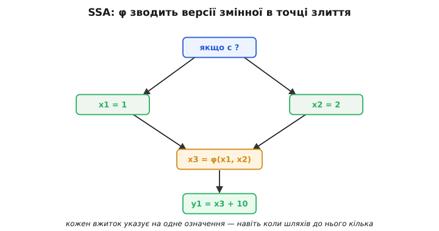
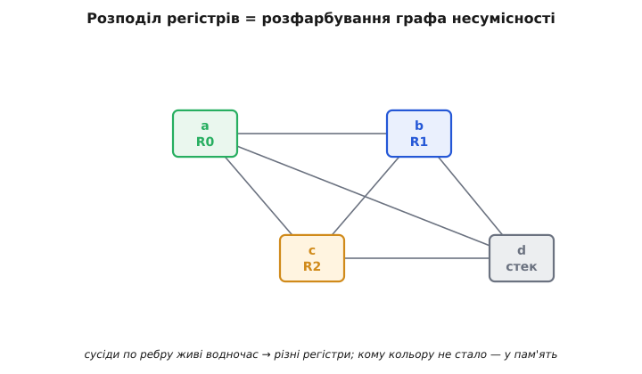

# Оптимізації компілятора

<preknowlist>
- [Компіляція](topic:programming/compilation) — перетворення тексту програми на машинний код окремою програмою-компілятором.
- [Стадії компілятора](topic:programming/compiler-stages) — передня частина (розбір), середина, задня частина (генерація коду); оптимізації живуть саме в середині.
- [Проміжне представлення (IR)](topic:programming/intermediate-representation) — внутрішня форма, у яку компілятор перекладає код і над якою працює замість вихідного тексту.
- [Правило «ніби» (as-if rule)](topic:programming/as-if-rule) — компілятор може переписувати код як завгодно, аби зовні спостережувана поведінка лишалася тією самою.
</preknowlist>

Оптимізатор обіцяє зухвале: узяти вашу програму й переписати її на швидшу чи меншу, нічого при цьому не зіпсувавши. Обіцянку «нічого не зіпсувати» легко дати на словах — але подумайте, хто її виконує. Не людина, що придивиться до коду й скаже «ну тут очевидно можна винести це за цикл». А сліпий, невтомний механізм, що переганяє мільйони рядків без крихти інтуїції й без права на «мабуть». Один хибний крок — одне переписування, що в якомусь закутку міняє поведінку, — і програму тихо зламано, без жодного попередження.

Звідси й народжується справжнє питання цієї теми. Перелік оптимізацій — згортання сталих, виніс інваріанта, розподіл регістрів — це лише вершина. Під ним лежить те, що взагалі робить оптимізацію можливою: **як бездумна машина може ДОВЕСТИ, що переписування безпечне, перш ніж його зробити.** Уся справжня механіка оптимізатора — це машинерія таких доказів. Її ми й розберемо: від того, над чим оптимізатор насправді працює, до того, чому він подеколи безсилий там, де людина впоралася б.

## Оптимізатор не чіпає вашого тексту

Перше, що варто розучитися уявляти: ніби компілятор совгає рядки вашого C. Ваш текст для машинного міркування незручний — у ньому вкладені вирази, синтаксичний цукор, людські імена — і водночас у ньому бракує того, що міркуванню потрібне: явних тимчасових значень, явних переходів. Тому ще на вході компілятор перекладає ваш код у пласку, одноманітну внутрішню форму — [проміжне представлення](topic:programming/intermediate-representation) (англ. *intermediate representation*, IR), — де кожна команда робить рівно одну дію над простими операндами. Оптимізації працюють **тільки там**, над IR, а не над текстом.

**Було в C:**

```c
int d = (a + b) * (a + b) - c;
```

**Стало у трьохадресній формі IR — кожен рядок робить одну операцію:**

```
t1 = a + b
t2 = a + b
t3 = t1 * t2
d  = t3 - c
```

Одразу видно, навіщо саме така форма. Вираз `a + b` тут не захований у дужках — він стоїть окремим, видимим рядком, ще й двічі. Питання «чи це те саме обчислення?» перестає бути здогадом і стає порівнянням двох рядків таблиці. Уся сила оптимізатора починається з цього: складне зроблено пласким і **однаковим**, а над однаковим працювати легко. Далі кожна оптимізація — це маніпуляція над цими рядками, і питання лиш одне: як довести, що маніпуляція безпечна.

## Граф потоку керування: зробити «а чи дійде сюди?» обчислюваним

Пласка стрічка команд усе ще має розгалуження й переходи, і саме вони — головна перешкода для міркування. Поки програма — це рядки згори вниз зі стрибками туди-сюди, питання на кшталт «чи виконається цей рядок?» або «яке значення тут матиме змінна?» лишаються туманними. Щоб їх прояснити, компілятор ріже стрічку на **базові блоки** (англ. *basic block*) — прямі відтинки без жодного розгалуження всередині: якщо ввійшли в початок блоку, то всі його команди виконаються підряд до кінця, без варіантів. А тоді сполучає блоки стрілками — куди звідки можна перейти. Виходить **граф потоку керування** (англ. *control-flow graph*): вузли — блоки, ребра — можливі переходи.

Цей перехід від тексту до графа — не косметика. Це той самий зсув думки, що [колись перетворив оптимізацію з набору трюків на науку](topic:programming/compiler-optimizations/hist-frances-allen.md). Над графом туманні питання стають чіткими. «Чи досяжний блок?» — чи веде до нього хоч якийсь шлях від входу. «Що напевно справджується на всіх шляхах, якими сюди приходять?» — перетин фактів по вхідних ребрах. Кожне «а що, як піде іншою гілкою?» обертається запитанням про структуру графа, а на такі запитання вже є алгоритми.

## Аналіз потоку даних: як машина взагалі щось «знає»

Ось де б'ється серце оптимізатора. Щоб будь-яке переписування було безпечним, компіляторові потрібні **факти**, певні в кожній точці програми. Викинути обчислення можна лише тоді, коли **напевно** відомо, що його результат далі ніде не читають. Винести дію за цикл можна лише тоді, коли **напевно** відомо, що всередині циклу вона щоразу дає те саме. Ці «напевно» не вгадують — їх **обчислюють**, для будь-якої програми, механічно.

Спосіб їх обчислювати зветься **аналізом потоку даних** (англ. *data-flow analysis*), і будова його всюди та сама. Візьмімо найужитковіший різновид — **живучість** (англ. *liveness*): змінна **жива** в певній точці, якщо її поточне значення ще колись прочитають далі; якщо ж її найближча доля — бути перезаписаною, а до перезапису ніхто не гляне, — вона **мертва**. Знати живучість критично: мертве присвоєння можна викинути, а регістр з-під мертвої змінної — звільнити.

Як це порахувати? Три складники, і всі три прості:

- До кожної точки чіпляємо множину фактів — тут це множина живих змінних.
- Кожна команда має **передавальну функцію** (англ. *transfer function*), що каже, як факти міняться на цій команді. Живучість тече **назад**, від кінця до початку. Команда `use(x)` робить `x` живою — її ось зараз прочитають. Команда `x = …` навпаки: щойно ми піднялися вище місця, де `x` присвоюють, її попереднє значення стає неважливим, тут `x` **вбивають**. Формула: живі перед командою = (живі після неї, без тих, кого команда присвоює) плюс ті, кого команда читає.
- На **злитті**, коли в блок веде кілька шляхів, факти об'єднують: змінна жива на виході блоку, якщо вона жива хоч на одному з подальших шляхів.

Лишається клопіт — цикли. Через зворотне ребро факти на вході блоку залежать від фактів на його виході, а ті самі залежать від входу: коло. Розірвати його наскоком не вийде. Тому роблять інакше: беруть початкове наближення (усі множини порожні), проходять граф, застосовуючи передавальні функції й злиття, і **повторюють**, доки бодай щось міняється. Коли черговий прохід нічого не змінив — прийшли до **нерухомої точки** (англ. *fixed point*), і це й є відповідь. Збіжність не диво: факти лише додаються, множини лише ростуть, а рости їм нема куди понад скінченний набір змінних — тож процес мусить спинитися.

**Порахуймо живучість на фрагменті з циклом. Рахуємо знизу вгору; праворуч — хто живий ПЕРЕД рядком:**

```
top:  if (i < n) goto body   { i, n, r }
body: r = r + i              { i, n, r }
      i = i + 1              { i, n, r }
      goto top
end:  return r               { r }
```

Почавши з кінця, `return r` робить живим лише `r`. Але `top` читає `i` та `n`, тож вони живі перед `top`; а `top` — ще й ціль зворотного ребра з `body`. Перший прохід знизу вгору проносить крізь тіло `i` та `r`, але `n` там ще не бачить — воно з'являється аж у `top`. Другий прохід, ідучи зворотним ребром із `top` назад у тіло, доносить туди й `n`. На третьому множини вже не міняються — нерухома точка. Тепер компілятор **знає**, а не гадає: перед циклом живі `i`, `n`, `r`, а от змінна, яку присвоїли, але жодного разу далі не прочитали, у жодну множину не потрапить — і її присвоєння сміливо викидають як мертве.

> 🔧 **Навіщо це.** Ось звідки славнозвісне «optimized out» у налагоджувачі. Коли ви на `-O2` наводите курсор на змінну, а вам показують «value optimized out», — це не збій. Аналіз живучості довів, що в цій точці змінна мертва або що вона все життя просидить у регістрі й місця в пам'яті не має. Показувати нема чого — змінної фізично немає. Хочете її побачити: або перезберіть на `-O0`, або візьміть її адресу (`&x`) — узята адреса змушує компілятор покласти змінну в пам'ять, і вона «проявляється».

## Кожне перетворення — це переписування під захистом доказу

Тепер видно спільний кістяк усіх оптимізацій: **перетворення плюс умова безпеки, яку встановлює аналіз.** Пройдімося переліком саме з цього боку — не «що робить», а «за якої умови це взагалі дозволено».

- **Прибирання мертвого коду** (англ. *dead-code elimination*). Умова — рівно живучість: команда, чий результат ніде не живий, не впливає ні на що видиме, тож її викидають. Аналіз довів — безпечно.
- **Згортання й поширення сталих** (англ. *constant propagation*). Це теж аналіз потоку даних, лиш факт інший: «яке стале значення напевно має ця змінна тут». Якщо **всі** означення, що дотікають до вжитку, дають ту саму сталу, її підставляють. Значення тут не «жива/мертва», а трирівневе — «ще не знаю», «точно ось ця стала», «не стала»; аналіз доводить його тими самими проходами до нерухомої точки. Сильніший різновид (англ. *sparse conditional constant propagation*) поєднує це з досяжністю й заразом викошує гілки, куди зі сталою умовою шлях узагалі не веде.
- **Усунення спільних підвиразів** (англ. *common subexpression elimination*). Умова: два обчислення з тими самими операндами, і між ними жоден операнд не переприсвоєно. Тоді друге замінюють на готовий результат першого. Точну відповідь на «ті самі операнди й нічого не змінилося» дає **нумерація значень** (англ. *value numbering*), що дає однаковим за суттю обчисленням однаковий номер.
- **Виніс інваріанта з циклу** (англ. *loop-invariant code motion*). Умова: усі операнди команди означені **поза** циклом (або самі вже визнані інваріантами), тож команда щоразу дає те саме — тримати її всередині марно. Таку команду піднімають у **передзаголовок** (англ. *preheader*) — блок перед входом у цикл. Але є пастка: підняти можна лише те, що безпечно виконати навіть коли цикл не крутиться жодного разу. Щоб довести цю безпеку, потрібне поняття, до якого ми зараз і дійдемо.

Спільне в усіх чотирьох одне: саме перетворення тривіальне, уся робота — у **доказі його передумови**, а доказ дає аналіз потоку даних над графом.

## SSA: форма, що зробила докази дешевими

У щойно описаному аналізі ховається прихована морока. Питання «які означення `x` дотікають сюди» стає плутаним, щойно `x` присвоюють у кількох місцях: до одного вжитку веде кілька різних означень, і аналіз мусить тягати цілі множини «хто кого досягає». Сучасні компілятори (GCC, LLVM) розрубують цей вузол однією радикальною зміною подання: перейменовують змінні так, щоб кожну присвоювали **рівно один раз**. Це **форма єдиного присвоєння** (англ. *static single assignment*, SSA).

```
було:                  у SSA:
x = 1                  x1 = 1
x = x + 5              x2 = x1 + 5
y = x * 2              y1 = x2 * 2
```

Тепер кожен вжиток вказує на **єдине** означення — ніяких множин, зв'язок «означення → вжиток» прочитується просто з імені. Аналіз, який раніше повз графом до нерухомої точки, часто згортається до одного погляду.

Лишається єдиний по-справжньому цікавий випадок — **злиття шляхів**:

```
if (c)
    x = 1;      // одна гілка
else
    x = 2;      // друга гілка
y = x + 10;     // яке саме x сюди прийшло?
```

У місці злиття зустрічаються два різні означення. Перейменувати їх у `x1` і `x2` легко, але яке з них узяти в `y`? Обидва — залежно від того, якою гілкою прийшли. Для цього SSA вводить особливу псевдооперацію — **φ-функцію** (грец. літера φ):

```
if (c) x1 = 1; else x2 = 2;
x3 = φ(x1, x2);   // x3 = x1, якщо прийшли лівим ребром; x2, якщо правим
y1 = x3 + 10;
```

φ — не справжня машинна команда, а позначка «тут злилися версії»; на виході з оптимізатора вона зникає, обертаючись на звичайний потік. Де саме розставляти φ — питання непросте (його точно розв'язують через **межі домінування**; це вже глибша механіка, тож приймемо цей факт як даний). Головна вигода: у SSA-формі згортання сталих, прибирання мертвого й нумерація значень стають майже даровими й дуже швидкими — саме тому вся сучасна оптимізація стоїть на цій формі.


*Навіщо потрібна φ. Після розгалуження в точку злиття приходять два різні означення однієї змінної. SSA перейменовує їх на `x1` і `x2`, а щоб дати вжиткові одне ім'я, ставить `x3 = φ(x1, x2)` — «візьми ту версію, що прийшла цим ребром». Так навіть при розгалуженнях кожен вжиток указує рівно на одне означення.*

## Домінування: мірило «де це поставити безпечно»

Кілька разів ми вже впиралися в одне й те саме питання: **де в графі значення напевно готове?** Точну відповідь дає **домінування** (англ. *dominance*). Кажуть, що блок A **домінує** над блоком B, якщо кожен шлях від входу програми до B неодмінно проходить через A. Простіше: до B ніяк не дістатися, оминувши A.

Це сухе означення насправді — універсальний інструмент:

- **Куди підняти інваріант.** Значення, обчислене в передзаголовку, буде готове в усьому тілі циклу лише тому, що передзаголовок домінує над тілом: іншого входу в тіло немає, тож повз це обчислення не проскочиш.
- **Де взагалі безпечно розмістити обчислення.** Команду можна перенести в точку, лише якщо та точка домінує над усіма її вжитками, — інакше на якомусь шляху значення виявиться ще не порахованим.
- **Як знайти цикл у графі.** Цикл видає **зворотне ребро** (англ. *back edge*) — ребро, чия ціль домінує над джерелом. Компілятор не шукає циклів «на око»; він шукає зворотні ребра, а це чисто графова властивість.
- **Куди ставити φ.** Розстановку φ, як згадано вище, теж керує домінування — через його межі.

Тобто домінування — не окрема екзотика, а той самий каркас, на якому тримаються і виніс інваріанта, і побудова SSA, і пошук циклів.

## Розподіл регістрів як розфарбування графа

Лишилося пояснити найвідчутнішу для швидкодії оптимізацію — чому «гаряче» тримають у регістрах. Регістрів у процесора мало (скажімо, шістнадцять), а живих значень у функції — десятки. Кому дати регістр, а кого відправити в повільну пам'ять? На перший погляд це морочлива головоломка розкладу. Насправді вона точно лягає на класичну задачу з теорії графів.

Ключ — знову живучість. Два значення **несумісні** (англ. *interfere*), якщо в якийсь момент **живі одночасно**: тоді їм не можна дати один регістр, бо кожне тримає своє. Побудуймо **граф несумісності** (англ. *interference graph*): вузол — значення, ребро — «ці двоє живі водночас». Тепер задача звучить так: розфарбувати вузли в K кольорів (K — число регістрів) так, щоб сусіди по ребру мали різні кольори. Це і є **розфарбування графа** (англ. *graph coloring*), а колір — це регістр.


*Розподіл регістрів очима теорії графів. Змінні, що живуть одночасно, з'єднані ребром — їм потрібні різні регістри. Три взаємно несумісні змінні беруть три кольори-регістри й уживаються. Четверта несумісна з усіма трьома одразу: третього кольору для трьох сусідів досить, а їй четвертого вже нема — тож її скидають у пам'ять.*

А якщо K кольорів не вистачає — вузол має забагато сусідів різних кольорів? Тоді якесь значення **скидають у пам'ять** (англ. *spilling*): воно втрачає регістр, живе в стеку й підвантажується лиш на мить обчислення. Скид болючий (звертання до пам'яті повільні), тож компілятор вибирає жертву обачно — радше те, що вживають рідше. Але саме тому ваша локальна змінна здебільшого **не має адреси в пам'яті**: вона дістала колір, просиділа все життя в регістрі й у пам'ять не потрапила жодного разу.

> 🔧 **Навіщо це.** Звідси практичне правило: не бійтеся дрібних локальних змінних «заради читабельності». Розбивши складний вираз на кілька іменованих проміжних, ви майже напевно не додасте жодного звертання до пам'яті — усі вони дістануть регістри й розчиняться. І навпаки: щойно ви берете адресу змінної (`&x`) чи робите її `volatile`, ви прив'язуєте її до пам'яті, і колір їй уже не дадуть. Ясний код із проміжними іменами оптимізаторові не заважає; заважає йому лише те, що ви силоміць женете в пам'ять.

## Стіна: чому оптимізатор завжди обережний

Уся ця сила має тверду межу, і саме вона пояснює, чому оптимізатор подеколи «недопрацьовує», а подеколи кусає. Межа одна: **компілятор робить лише те, що може довести; де довести не може — відступає й лишає як є.** Розгляньмо три обличчя цієї межі.

**Аліасування.** Щоб пересунути чи прибрати роботу з пам'яттю, компілятор мусить знати, що два вказівники **не** дивляться в одну комірку. Інакше запис через один невидимо зіпсує читання через другий. А відповісти на «чи можуть ці два вказівники збігтися» у загальному випадку неможливо — тож **аналіз аліасів** (англ. *alias analysis*) обережний: у сумніві він припускає, що збіг **можливий**, і від оптимізації відмовляється. Ось чому цикл, де ви пишете й читаєте через різні вказівники, часто не розганяється так, як міг би. Мова дає способи присягнутися компіляторові, що збігу немає, — правила [строгого аліасування](topic:programming/strict-aliasing) й `restrict`; це обіцянки, під які він сміливіше оптимізує. Дзеркальна обіцянка навпаки: [`volatile`](topic:programming/volatile) каже «ця комірка міняється сама, поза твоїм полем зору — не кешуй її й не викидай жодного доступу».

**Невизначена поведінка.** Друге обличчя тієї ж межі, найпідступніше. Компілятор виходить із того, що [невизначеної поведінки](topic:programming/undefined-behavior) (англ. *undefined behavior*, UB) у правильній програмі **не буває**, — і **виводить із цього факти**. Якщо у вашій програмі UB усе-таки є, ці факти хибні, і «безпечне» переписування обертається катастрофою. Механізм точний і безжальний: переповнення знакового числа — це UB, тож компілятор має право припустити, що `i + 1 > i` **завжди**; спираючись на це, він викидає перевірку меж циклу як нібито зайву — і цикл ганяє поза масивом. Це не злий намір, а та сама доказова машина, що чесно працює на **хибній посилці**, яку ви їй підсунули.

**Сама межа обчислюваності.** Глибше під цими двома лежить фундаментальний факт: більшість цікавих запитань про поведінку програми **алгоритмічно нерозв'язні** — не можна написати аналіз, що на будь-якій програмі дасть точну відповідь. Тому оптимізатор **приречений** бути консервативним: він розганяє рівно те, що зумів довести в конкретному випадку, а в усьому непевному відступає, обираючи безпеку замість вигоди. Звідси й нечастий, але реальний виняток, коли ручна оптимізація ще перемагає: ви можете **знати** те, чого компілятор довести не годен, — що ці вказівники ніколи не збігаються, що це число ніколи не переповниться, — і зробити крок, на який він не наважився.

## Що з усього цього випливає

За переліком трюків, що лякає новачка, ховається на диво проста будова. Оптимізатор не тримає в голові сотні окремих хитрощів — він робить один і той самий цикл: **подати програму графом → обчислити на ньому факти до нерухомої точки → застосувати переписування, дозволене цими фактами → повторити, бо переписування відкрило нові факти.** Згортання сталих і виніс інваріанта, живучість і домінування, SSA й розфарбування — не різні ремесла, а грані однієї машини, що доводить твердження про програму й діє рівно в межах доведеного.

Тому найточніше дивитися на оптимізатор не як на збірку прискорювачів, а як на **доказувач теорем, що на виході видає машинний код**. Його оптимізації рівно такі сильні, як його докази, — і ні на крок сильніші. Де він мовчить і не розганяє — там він не побоявся, а **не зумів довести**; де він раптом ламає ваш код — там ви підсунули йому хибну посилку, і бездоганний доказ виснував із неї дурницю. Зрозуміти оптимізатор — значить перестати бачити в ньому норовливого джина й побачити логіка: строгого, невтомного й рівно настільки сміливого, наскільки дозволяє доказ.
