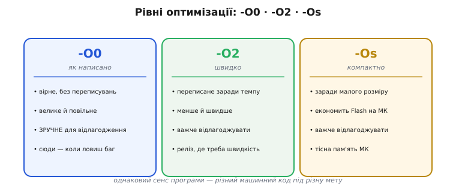
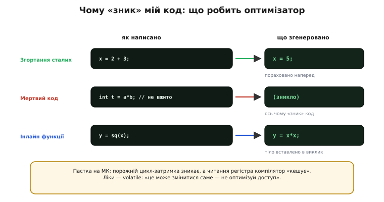

# ⚙️ Що робить оптимізатор: -O0 проти -O2, інлайн — і чому «зник» мій код

Усередині компілятора є хитра частина — **оптимізатор**. Через неї машинний код інколи геть не схожий на ваш текст: рядки переставлені, змінні «зникли», а порожній цикл випарувався. Розберімо, що він робить і чому.

## Задача

Той самий код на C компілятор може перетворити на машинний **по-різному**: вірно, але дослівно й повільно — або швидко чи компактно, переписавши до невпізнання. Чим керуватися й чому оптимізований код **дивує** (змінної «нема», рядки місцями, цикл щез) — ось питання.

## Ідея: переписати, зберігши видиму поведінку

Оптимізатор має одне священне правило — **«наче-так» (as-if)**: він може робити з кодом що завгодно, **аби видима поведінка** програми лишилася та сама. Тобто результат, який ви спостерігаєте, мусить збігатися; а **як** саме він досягнутий — клопіт компілятора. У цих межах він і переписує: рахує сталі наперед, викидає зайве, вставляє малі функції на місце виклику, переставляє дії, тримає змінні в регістрах.

Скільки на це дозволено — задає **рівень оптимізації**. **-O0** — не чіпати нічого: код «як написано», великий і повільний, зате **зручний для відлагодження** (рядки на місці, змінні видно). **-O2** — переписувати заради **швидкості**. **-Os** — заради **малого розміру**, що на МК особливо важить: Flash тісний.


*Три рівні — три компроміси. -O0: вірне «як написано», велике, повільне, найзручніше для відлагодження. -O2: переписане заради швидкості. -Os: заради малого розміру (економить Flash на МК). Сенс однаковий — машинний код різний.*

## Як саме «зникає» код

Кілька типових перетворень видно на рисунку:

```
згортання сталих:   x = 2 + 3;          →   x = 5;          // порахував наперед
мертвий код:        int t = a*b; // не вжито  →  (зникло)   // ось чому «зник» код
інлайн функції:     y = sq(x);          →   y = x*x;        // тіло вставлено на місце
```


*Джерело → оптимізований код. Сталі рахуються наперед, невжитий код просто викидається (звідси «зник мій код»), а маленька функція вставляється тілом у виклик. Унизу — пастка volatile, коли таке прибирання ламає прошивку.*

Найбільше дивує саме **прибирання**: оголосили змінну й не вжили — оптимізатор її викине; завели обчислення, результат якого нікуди не йде, — теж. З погляду «наче-так» нічого не сталося, бо нічого **видимого** воно не робило.

Перелік типових перетворень довший, ніж ці три, і варто знати їх на ім'я — тоді згенерований асемблер перестає лякати:

- **Згортання сталих** (*constant folding*): усе, що можна порахувати на етапі компіляції, рахується наперед. `60 * 60 * 24` стане `86400` ще в компіляторі — у машинному коді множень не буде.
- **Поширення копій** (*copy propagation*): якщо `b = a; c = b + 1;`, компілятор бачить, що `b` — просто інше ім'я `a`, і пише `c = a + 1`, а зайве `b` викидає.
- **Виніс із циклу** (*loop-invariant code motion*): обчислення, що в циклі дає **щоразу те саме**, виносять **за** цикл, щоб не повторювати його на кожній ітерації.
- **Розгортання циклу** (*loop unrolling*): короткий цикл на кілька проходів компілятор інколи розписує **підряд**, без лічильника й переходів, — виходить довше, зате швидше.
- **Інлайн** (*inlining*): тіло маленької функції вставляється прямо в місце виклику; зникають накладні витрати на сам виклик, а далі відкривається ще більше нагод для згортання й прибирання.

## Складність і пастки на МК

Тут і криється головна небезпека для прошивки: те, що для компілятора «невидиме», для **заліза** інколи дуже навіть видиме.

- **Порожній цикл-затримка зникає.** Написали `for(i=0;i<1000;i++);` як паузу — оптимізатор бачить цикл без видимого ефекту й **викидає** його. Затримки нема.
- **Читання регістра «кешується».** Опитуєте в циклі апаратний прапорець (`while(REG==0);`) — компілятор вирішує, що `REG` сам собою не міняється, читає його **раз** і крутить нескінченно зі старим значенням. Ваш код «завис», хоч залізо давно готове.

Ліки від обох — ключове слово [**`volatile`**](book:programming/volatile): воно каже компіляторові «це може змінитися **саме**, не оптимізуй доступ до нього». Те саме правило діє для [апаратних регістрів](book:programming/memory-mapped-io). Загальне: усе, що чіпає **залізо** чи **спільне з перериванням**, має бути `volatile`.

- **Відлагоджуйте на -O0.** На -O2 змінні бувають «optimized out», а точка зупину стрибає не на той рядок — бо рядків у переставленому коді вже наче й нема. Ловиш баг — збирай без оптимізації.
- **Невизначена поведінка (*UB*, undefined behavior) карається жорстоко.** Оптимізатор вважає, що UB **не трапляється**, і будує код, спираючись на це. Тому переповнення, вихід за межі масиву чи розіменування `nullptr` під -O2 дають не «передбачуваний збій», а химерну поведінку.

## Чому оптимізацію все ж лишають увімкненою

Перелік пасток вище легко прочитати як вирок: мовляв, оптимізатор підступний, тримаймося від нього подалі. Це хибний висновок. На мікроконтролері з тісним Flash і скромним ядром **без** оптимізації часто просто не обійтися: код `-O0` буває вдвічі більший і помітно повільніший, і програма або не влазить у пам'ять, або не встигає за реальним часом. Оптимізатор тут не ворог, а необхідний помічник — він задарма дає те, що інакше довелося б вимучувати руками.

Розумна практика — не «вимкнути назавжди», а **тримати два режими** під рукою. Щоденну, релізну збірку женуть на `-O2` чи `-Os`: так прошивка швидка й компактна. А коли з'являється загадковий баг, той самий код **тимчасово** перезбирають на `-O0` — і код знову лягає рядок-у-рядок на ваш текст, змінні видно, точки зупину стоять там, де треба. Зловивши причину, повертаються на бойовий рівень. Так оптимізатор працює на вас, а не проти, і не доводиться платити швидкістю за зручність відлагодження постійно.

Лишається тверде правило: усе, що оптимізатор **не має права** чіпати, треба позначити явно. Він діє за «наче-так», тож сам по собі не здогадається, що за адресою — апаратний регістр, а не звичайна змінна. Ось де помилка стається найчастіше.

## Як це виглядає в коді

Ось класична пастка опитування регістра — та сама, що вище описано словами, але тепер як реальний фрагмент прошивки. Скажімо, ми чекаємо, доки апаратура виставить біт «готово» в регістрі статусу:

**Умова: чекаємо біт готовності в регістрі статусу.**

```c
// ПОМИЛКА: компілятор має право читати STATUS лише раз
#define STATUS (*(uint32_t *)0x3FF44000)   // ілюстративна адреса регістра статусу

void wait_ready(void) {
    while ((STATUS & 0x01) == 0) {          // крутимося, доки біт 0 не стане 1
        ;                                    // тіло порожнє — просто чекаємо
    }
}
```

З погляду оптимізатора `STATUS` — це звичайна змінна в пам'яті, яку **ніхто в цьому коді не змінює**. За правилом «наче-так» він має повне право прочитати її **один раз**, покласти в регістр процесора й крутити порівняння вже зі **сталим** значенням. Якщо біт був 0, цикл стає **нескінченним** — навіть коли апаратура давно виставила готовність. Прошивка «зависає» на рівному місці, і на -O0 баг навіть не відтворюється (там читання щоразу справжнє).

Лікуємо одним словом — `volatile`: воно прямо забороняє компіляторові кешувати доступ, змушуючи **щоразу** читати з пам'яті:

```c
// ВІРНО: volatile змушує читати регістр на кожній ітерації
#define STATUS (*(volatile uint32_t *)0x3FF44004)

void wait_ready(void) {
    while ((STATUS & 0x01) == 0) {
        ;
    }
}
```

Перевірити, що саме згенерував компілятор, можна, попросивши в нього асемблер замість об'єктного файлу (`gcc -O2 -S file.c` — вивід у `file.s`) або розібравши готовий `.o` дизасемблером (`objdump -d file.o`). У помилковому варіанті читання `STATUS` стоятиме **поза** циклом, у виправленому — **всередині**. Це найнадійніший спосіб не сперечатися з компілятором наздогад, а **побачити** результат його роботи на власні очі.

Та сама переписана структура коду дається взнаки й тоді, коли прошивка падає в полі. Стек-трейс із релізної збірки буває оманливий: інлайн «склеїв» кілька функцій в одну, тож адреса збою показує не на той рядок, де реально криється проблема. Тому навіть для `-O2`-релізу варто збирати з відлагоджувальною інформацією (`-g` нічого не сповільнює — вона лежить окремо й у саму прошивку не йде) і **зберігати** незрізаний `.elf` кожної версії. Маючи його, посмертний розбір падіння стає можливим: дизасемблер і відлагоджувач за збереженими символами розплутають навіть агресивно оптимізований код. Без цього файлу та сама адреса збою — лише голе число, з якого вже нічого не дістати.

> 🔧 **Навіщо це.** Звичка час від часу зазирати в `-S`-вивід або `objdump` — те, що відрізняє впевнену роботу з МК від ворожіння. Коли затримка «не затримує», а опитування «висить», справжню причину видно саме в асемблері: зник цикл, читання винесено за межу. Один погляд туди економить години гадання, чому залізо поводиться не так, як написано в C.
