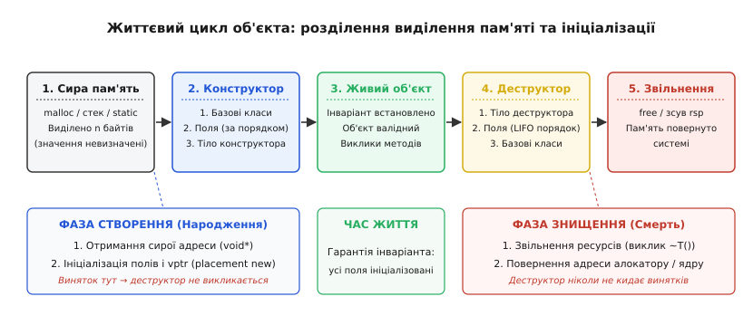
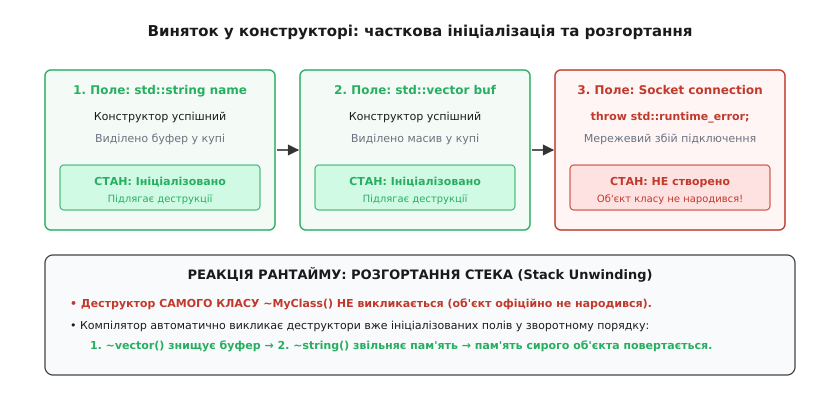
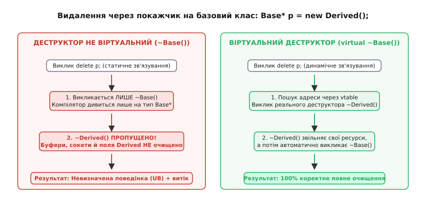

# Конструктор і деструктор: народження й смерть об'єкта

<preknowlist>
- [Стек](book:programming/stack-lifo) — локальні змінні створюються на стеку викликів і знищуються при виході зі scope за принципом LIFO.
- [Купа](book:programming/heap-dynamic-memory) — динамічна пам'ять із явним виділенням та звільненням або збирачем сміття.
- [Адреси й покажчики](book:programming/addresses-pointers) — сира пам'ять як послідовність нетипізованих байтів без внутрішньої структури.
- [RAII: ресурс прив'язаний до часу життя](book:programming/raii) — зв'язування життєвого циклу системного ресурсу з областю видимості об'єкта.
</preknowlist>

У системному коді мережевого драйвера виділення структури кільцевого буфера через стандартну функцію `malloc(sizeof(struct RingBuffer))` повертає покажчик на нетипізований блок пам'яті, заповнений випадковим «сміттям» попередніх операцій. Покажчик на масив пакетів містить невалідну адресу `0x7fffdeadbeef`, лічильники голови та хвоста черги містять довільні цілі числа, а примітив синхронізації перебуває в невизначеному стані. Якщо обробник мережевих пакетів звернеться до такого буфера до виклику спеціальної функції `init_ring_buffer()`, перша ж операція запису спричинить розіменування дикого покажчика, фатальне пошкодження пам'яті ядра або падіння процесу із сигналом `SIGSEGV`. Симетрично, якщо при вивантаженні модуля драйвера розробник забуде викликати парну функцію `destroy_ring_buffer()`, виділені під пакети сторінки фізичної пам'яті та зареєстровані DMA-дескриптори залишаться заблокованими в системі, доки вичерпання апаратних ресурсів не виведе мережеву карту з ладу.

Покладання ініціалізації та очищення даних на дисципліну розробника неминуче дає збій у складних системах із десятками умовних переходів, ранніх повернень та аварійних помилок. Фундаментальне вирішення цієї проблеми полягає в перенесенні контролю за життєвим циклом даних на рівень компілятора й системи типів: об'єкт розглядається не просто як пасивний набір байтів у пам'яті, а як математична сутність, наділена **інваріантом** (умовою внутрішньої узгодженості та валідності), який автоматично встановлюється в момент народження й коректно ліквідується в момент смерті.

Механізмами реалізації цього правила виступають **конструктор** (від лат. *constructor* — той, хто будує) та **деструктор** (від лат. *destructor* — той, хто руйнує). Вони перетворюють сиру апаратну пам'ять на безпечне абстрактне середовище існування типу даних. Детальніше про те, як ці концепції еволюціонували від перших експериментів у Simula-67 до мови C++ у лабораторіях Bell Labs, описано в нарисі про [історію винайдення конструкторів і деструкторів](book:programming/constructors-destructors/hist-constructors-origins.md).

## Життєвий цикл у пам'яті: алокація проти ініціалізації

У низькорівневих мовах програмування безпосереднє існування об'єкта в системі складається з двох чітко розмежованих етапів народження та двох симетричних етапів знищення:

```
НАРОДЖЕННЯ:
1. Алокація сирої пам'яті (отримання нетипізованого блоку байтів потрібного розміру).
2. Виклик конструктора (ініціалізація полів, налаштування vptr, встановлення інваріанта).

СМЕРТЬ:
3. Виклик деструктора (вивільнення захоплених об'єктом ресурсів, скасування інваріанта).
4. Деалокація сирої пам'яті (повернення блоку байтів розподільнику чи системному стеку).
```

Більшість високорівневих конструкцій мови (наприклад, оператор `new` або оголошення змінної на стеку `MyClass obj;`) об'єднують ці кроки в одну неподільну операцію. Проте змішування виділення пам'яті з її ініціалізацією приховує справжню природу роботи процесора.


*Фази життя об'єкта: чітке розмежування між виділенням сирої нетипізованої адреси, виконанням коду конструктора для встановлення інваріанта, роботою з валідним об'єктом, деструкцією та поверненням пам'яті.*

На першому кроці система виділяє лише ділянку сирої адреси розміром `sizeof(T)` із вирівнюванням `alignof(T)`. На цьому етапі об'єкт типу `T` ще **не існує**: спроба звернутися до цих байтів або викликати методи призведе до невизначеної поведінки (*Undefined Behavior*). Тільки коли виклик конструктора завершується без викидання винятків, блок пам'яті офіційно набуває типу `T` і стає живим об'єктом.

Симетрично, під час смерті об'єкта спочатку виконується код деструктора `~T()`. Він звільняє динамічні ресурси, якими володів екземпляр (закриває файлові дескриптори, відпускає м'ютекси, очищає виділені буфери). Щойно тіло деструктора завершилося, об'єкт перестає існувати, знову перетворюючись на безформний набір байтів сирої пам'яті, який на наступному кроці повертається алокатору пам'яті або очищається зсувом покажчика стека `rsp`.

У мовах C та C++ це розмежування можна спостерігати безпосередньо через механізм розміщувального створення (*placement new*):

:::tabs
```cpp
#include <new>
#include <memory>
#include <iostream>
#include <string>

struct Packet {
    int id;
    std::string payload;

    Packet(int i, std::string p) : id(i), payload(std::move(p)) {
        std::cout << "  Конструктор Packet #" << id << "\n";
    }

    ~Packet() {
        std::cout << "  Деструктор Packet #" << id << "\n";
    }
};

void lifecycle_demo() {
    // 1. Алокація сирої пам'яті під об'єкт (об'єкта ще немає)
    alignas(Packet) std::byte raw_storage[sizeof(Packet)];

    // 2. Ініціалізація: placement new викликає конструктор за вказаною адресою
    Packet* pkt = ::new (raw_storage) Packet(42, "Telemetry data");

    // 3. Час життя: об'єкт повністю валідний
    std::cout << "  Payload: " << pkt->payload << "\n";

    // 4. Деструкція: явний виклик деструктора (пам'ять raw_storage НЕ звільняється)
    pkt->~Packet();

    // 5. Деалокація: raw_storage автоматично зникає зі стека при виході
}
```
```c
#include <stdlib.h>
#include <stdio.h>
#include <string.h>

typedef struct {
    int id;
    char* payload;
} PacketC;

// Явний аналог конструктора
void packet_construct(PacketC* pkt, int id, const char* p) {
    pkt->id = id;
    size_t len = strlen(p) + 1;
    pkt->payload = (char*)malloc(len);
    if (pkt->payload) {
        memcpy(pkt->payload, p, len);
    }
    printf("  Конструктор C Packet #%d\n", pkt->id);
}

// Явний аналог деструктора
void packet_destruct(PacketC* pkt) {
    printf("  Деструктор C Packet #%d\n", pkt->id);
    free(pkt->payload);
    pkt->payload = NULL;
}

void lifecycle_demo_c(void) {
    // 1. Алокація сирої пам'яті під структуру
    _Alignas(PacketC) char raw_storage[sizeof(PacketC)];
    PacketC* pkt = (PacketC*)raw_storage;

    // 2. Ініціалізація сирої пам'яті
    packet_construct(pkt, 42, "Telemetry data");

    // 3. Час життя
    printf("  Payload: %s\n", pkt->payload);

    // 4. Деструкція внутрішніх ресурсів
    packet_destruct(pkt);

    // 5. Деалокація: raw_storage зникає зі стека
}
```
:::

Можливість явно розділяти виділення пам'яті та виклик конструктора є фундаментом для побудови високоефективних структур даних (наприклад, динамічного масиву `std::vector`, який резервує сиру пам'ять наперед і створює об'єкти лише при `push_back`) та користувацьких пулів пам'яті. Практичну реалізацію такого механізму розібрано у вставці про [пул об'єктів на фіксованій пам'яті](book:programming/constructors-destructors/proj-placement-new-pool.md).

## Анатомія конструктора: ініціалізація проти присвоєння

Конструктор — це особлива функція-член класу, яка не має повертаного типу (навіть `void`) і викликається автоматично при створенні екземпляра. Його головне завдання — перевести неініціалізовані байти полів у стан, що задовольняє всім інваріантам типу.

Існує фундаментальна різниця між **ініціалізацією полів у списку ініціалізації** (англ. *member initializer list*) та **присвоєнням значень у тілі конструктора**:

:::tabs
```cpp
#include <string>
#include <vector>

class BadBuffer {
    std::string name_;
    std::vector<int> data_;
public:
    // Помилковий підхід: подвійна робота
    BadBuffer(const std::string& name, const std::vector<int>& data) {
        name_ = name;  // 1. Спочатку name_ ініціалізовано конструктором за замовчуванням
                       // 2. Потім викликано оператор operator=(const std::string&)
        data_ = data;  // 1. Спочатку data_ виділив порожній вектор
                       // 2. Потім викликано operator=(const std::vector<int>&)
    }
};

class GoodBuffer {
    std::string name_;
    std::vector<int> data_;
public:
    // Правильний підхід: пряма ініціалізація в списку ініціалізації
    GoodBuffer(std::string name, std::vector<int> data)
        : name_(std::move(name)), data_(std::move(data)) {
        // Поля створюються одразу з потрібними даними через конструктори переміщення.
        // Тіло конструктора порожнє, жодних зайвих алокацій чи очищень.
    }
};
```
```c
#include <stdlib.h>
#include <string.h>

typedef struct {
    char* name;
    int* data;
    size_t size;
} GoodBufferC;

// У мові C ініціалізація завжди записується явно у функції
void good_buffer_init(GoodBufferC* buf, const char* name, const int* data, size_t size) {
    size_t name_len = strlen(name) + 1;
    buf->name = (char*)malloc(name_len);
    if (buf->name) memcpy(buf->name, name, name_len);

    buf->size = size;
    buf->data = (int*)malloc(size * sizeof(int));
    if (buf->data && data) memcpy(buf->data, data, size * sizeof(int));
}

void good_buffer_free(GoodBufferC* buf) {
    free(buf->name);
    free(buf->data);
    buf->name = NULL;
    buf->data = NULL;
    buf->size = 0;
}
```
:::

У C++ список ініціалізації є обов'язковим у трьох ключових випадках:
1. **Константні поля (`const T member`)**: константа мусить отримати значення в момент виділення пам'яті; її неможливо змінити оператором присвоєння в тілі конструктора.
2. **Посилання (`T& ref_member`)**: посилання має бути прив'язане до конкретного об'єкта під час свого народження й не може бути переприв'язане пізніше.
3. **Поля без конструктора за замовчуванням**: якщо вкладений клас не має конструктора без аргументів `T()`, компілятор не здатний неявно створити його перед входом у тіло зовнішнього конструктора.

### Залізне правило порядку ініціалізації

Порядок ініціалізації полів у пам'яті визначається **виключно порядком їхнього оголошення в тілі класу**, а не порядком їхнього запису в списку ініціалізації конструктора:

```cpp
class SensorNode {
    int size_;
    int* buffer_;
public:
    // Помилка: buffer_ оголошено ПІСЛЯ size_, але якби buffer_ стояв першим у класі:
    SensorNode(int s) : buffer_(new int[size_]), size_(s) {
        // Якщо в класі buffer_ оголошено раніше за size_, компілятор спочатку виділить
        // buffer_ розміром size_ (який ще НЕ ініціалізований і містить сміття!),
        // а вже потім ініціалізує size_ числом s.
    }
};
```

Якщо оголошення `int* buffer_` розміщене вище за `int size_`, компілятор завжди ініціалізуватиме `buffer_` першим. У виразі `new int[size_]` буде прочитано невизначене сміттєве значення поля `size_`, що призведе до спроби виділити гігабайти пам'яті або до винятку `std::bad_alloc`. Сучасні компілятори виявляють невідповідність порядку за допомогою прапорця попереджень `-Wreorder`.

## Види конструкторів у системному проектуванні

Система типів C++ розрізняє кілька спеціалізованих форм конструкторів, кожна з яких відповідає за конкретний сценарій передачі та перетворення даних:

```
ВИДИ КОНСТРУКТОРІВ:
├── Конструктор за замовчуванням (Default) : T()
├── Конструктор перетворення (Explicit)    : explicit T(Arg arg)
├── Конструктор копіювання (Copy)          : T(const T& other)
└── Конструктор переміщення (Move, C++11)  : T(T&& other) noexcept
```

### 1. Конструктор за замовчуванням і керування генерацією

Конструктор за замовчуванням (англ. *default constructor*) приймає нуль аргументів або має всі аргументи зі значеннями за замовчуванням. Якщо в класі не оголошено жодного власного конструктора, компілятор генерує його автоматично, по черзі викликаючи конструктори за замовчуванням для всіх полів-класів. Примітивні типи (`int`, покажчики) при цьому залишаються неініціалізованими.

Починаючи з C++11, розробник може явно керувати цією генерацією:
- `T() = default;` — вимагає від компілятора згенерувати стандартну реалізацію;
- `T() = delete;` — забороняє створення об'єкта без параметрів (наприклад, для класів статичних утиліт).

### 2. Конструктори перетворення та ключове слово `explicit`

Будь-який конструктор, який можна викликати з одним аргументом, за замовчуванням оголошує неявне перетворення типу (англ. *implicit conversion*). Це є джерелом небезпечних прихованих багів:

:::tabs
```cpp
#include <iostream>

class DynamicArray {
    int capacity_;
public:
    // Без explicit: компілятор дозволяє неявне перетворення int -> DynamicArray
    // explicit DynamicArray(int capacity) : capacity_(capacity) {}
    DynamicArray(int capacity) : capacity_(capacity) {}

    int capacity() const { return capacity_; }
};

void print_array(const DynamicArray& arr) {
    std::cout << "Array capacity: " << arr.capacity() << "\n";
}

int main() {
    // Несподівана поведінка: випадкова передача числа неявно конструює масив на 100 елементів!
    print_array(100); // Скомпілюється і створить тимчасовий об'єкт DynamicArray(100)
    return 0;
}
```
```c
#include <stdio.h>
#include <stdlib.h>

typedef struct {
    int capacity;
    int* data;
} DynamicArrayC;

DynamicArrayC array_create(int capacity) {
    DynamicArrayC arr;
    arr.capacity = capacity;
    arr.data = (int*)malloc(capacity * sizeof(int));
    return arr;
}

void print_array_c(const DynamicArrayC* arr) {
    printf("Array capacity: %d\n", arr->capacity);
}

int main(void) {
    // У мові C неявні перетворення структур неможливі: помилка фіксується на етапі компіляції
    DynamicArrayC arr = array_create(100);
    print_array_c(&arr);
    free(arr.data);
    return 0;
}
```
:::

Додавання ключового слова `explicit` забороняє компілятору застосовувати цей конструктор для неявних приведень та ініціалізації через знак рівності `DynamicArray a = 10;`. Конструктор можна буде викликати лише явно: `DynamicArray a(10);` або `static_cast<DynamicArray>(10)`.

### 3. Конструктор копіювання: глибоке проти поверхневого копіювання

Конструктор копіювання (англ. *copy constructor*) має сигнатуру `T(const T& other)` і викликається при ініціалізації нового об'єкта копією наявного. 

Якщо клас володіє динамічною пам'яттю або дескрипторами, автоматично згенерований компілятором конструктор виконає **поверхневе копіювання** (англ. *shallow copy*) — скопіює лише числове значення покажчика. У результаті обидва об'єкти вказуватимуть на одну ділянку пам'яті в купі. Коли перший об'єкт помре, його деструктор звільнить пам'ять. Коли помре другий об'єкт, його деструктор викличе `free()` над тією самою адресою вдруге, що спричинить фатальне пошкодження таблиці алокатора (*Double Free Crash*).

Клас, що володіє ресурсом, зобов'язаний реалізувати **глибоке копіювання** (англ. *deep copy*), виділивши власний незалежний блок пам'яті та скопіювавши туди вміст.

### 4. Конструктор переміщення та роль `noexcept`

Введений у стандарті C++11 конструктор переміщення (англ. *move constructor*) має сигнатуру `T(T&& other) noexcept`. Замість виділення нової пам'яті та копіювання байтів він просто «краде» ресурс у тимчасового об'єкта (копіює адресу покажчика) і скидає покажчик джерела в `nullptr`:

```
ПЕРЕМІЩЕННЯ РЕСУРСУ (Move Semantics):
[Джерело other] ──> Покажчик ptr: 0x1000 ──> [Буфер у купі: "Великі дані..."]
                               ▲
                              │ (копіювання адреси 0x1000)
[Ціль target]  ──> Покажчик ptr: 0x1000
[Джерело other] ──> Покажчик ptr: nullptr (обнулення, деструктор other нічого не видалить)
```

Маркування конструктора переміщення як `noexcept` є критично важливим для продуктивності стандартних контейнерів. Коли `std::vector` вичерпує місткість і збільшує внутрішній буфер, він переносить наявні елементи в нову ділянку пам'яті. Щоб зберегти строгу гарантію безпеки винятків (якщо під час реалокації станеться збій, старий вектор має залишитися неушкодженим), `std::vector` перевіряє `std::is_nothrow_move_constructible<T>::value`. Якщо конструктор переміщення **не позначено** як `noexcept`, вектор відмовиться від швидкого переміщення й виконуватиме повільне глибоке копіювання всіх елементів.

## Деструктори, розгортання стека та винятки

Деструктор викликається компілятором автоматично в точний момент завершення часу життя об'єкта:
- для локальних автоматичних змінних — при досягненні закривної фігурної дужки `}` області видимості (у строгому порядку **LIFO** — зворотній до порядку оголошення);
- для тимчасових безіменних об'єктів — наприкінці повного виразу, у якому вони створені;
- для статичних і глобальних змінних — при завершенні роботи програми (через таблицю функцій завершення `atexit`).

### Поведінка під час винятків (Stack Unwinding)

Головна сила деструкторів проявляється під час виникнення виняткових ситуацій. Якщо функція викидає виняток за допомогою оператора `throw`, потік виконання не може просто перестрибнути до блоку `catch`. Рантайм мови починає процедуру **розгортання стека** (англ. *stack unwinding*): він послідовно проходить усі активні фрейми виклику знизу вгору та гарантовано викликає деструктори всіх локальних об'єктів, створених на кожному рівні.

Проте виникає критичний крайовий випадок: **що відбувається, якщо виняток виникає всередині самого конструктора?**


*Якщо конструктор завершується аварійно, деструктор самого класу ~MyClass() ніколи не викликається. Рантайм автоматично знищує лише ті поля та базові класи, чиї конструктори встигли завершитися успішно.*

Згідно зі стандартом мови, об'єкт вважається народженим **лише після повного успішного виконання його конструктора**. Якщо виконання обривається винятком на середині тіла або під час ініціалізації одного з полів:
1. Деструктор самого класу `~MyClass()` **НЕ викликається взагалі**.
2. Усі поля класу та базові класи, які **встигли успішно сконструюватися** до моменту викидання винятку, автоматично знищуються викликом їхніх власних деструкторів у зворотному порядку.
3. Виділена під сам об'єкт сира пам'ять автоматично повертається системі.

Це правило пояснює, чому збереження сирих покажчиків у полях класу є небезпечною антипатерною практикою:

```cpp
class DangerousOwner {
    int* buffer_a_;
    int* buffer_b_;
public:
    DangerousOwner() {
        buffer_a_ = new int[1000]; // 1. Успішно виділено пам'ять
        buffer_b_ = new int[5000]; // 2. Якщо тут виникає std::bad_alloc, конструктор обривається!
    }

    ~DangerousOwner() {
        // Цей деструктор НІКОЛИ не виконається при збої на другому new!
        // Пам'ять buffer_a_ витікає назавжди.
        delete[] buffer_a_;
        delete[] buffer_b_;
    }
};
```

Якщо загорнути поля в стандартні розумні покажчики `std::unique_ptr<int[]>`, проблема зникає: якщо ініціалізація другого поля кидає виняток, рантайм автоматично викличе деструктор першого поля `std::unique_ptr`, який коректно звільнить пам'ять `buffer_a_`.

### Заборона винятків у деструкторах

Деструктор **ніколи не повинен випускати винятки назовні**. Починаючи з C++11, усі деструктори за замовчуванням неявно позначені як `noexcept(true)`.

Якщо деструктор спробує викинути виняток у той момент, коли в програмі вже відбувається розгортання стека через інший виняток, рантайм зіткнеться з нерозв'язною суперечністю: у системі не може одночасно оброблятися два активні винятки. У цій ситуації середовище виконання негайно викликає функцію `std::terminate()`, що миттєво аварійно зупиняє весь процес без можливості перехоплення.

## Поліморфізм та віртуальні деструктори

При побудові ієрархій спадкування виникає фундаментальна небезпека, пов'язана з видаленням об'єктів похідного класу через покажчик на базовий клас.

Розгляньмо ситуацію, коли базовий клас `Base` не має віртуального деструктора:

```cpp
class Base {
public:
    ~Base() { /* Не віртуальний! */ }
};

class Derived : public Base {
    int* large_buffer_;
public:
    Derived() : large_buffer_(new int[10000]) {}
    ~Derived() { delete[] large_buffer_; }
};

void cleanup(Base* ptr) {
    delete ptr; // Фатальна помилка: статичне зв'язування!
}
```

Коли компілятор обробляє інструкцію `delete ptr`, він виконує статичний аналіз типу покажчика. Оскільки деструктор `~Base()` не є віртуальним, компілятор генерує прямий виклик коду `~Base()`, повністю ігноруючи реальний динамічний тип об'єкта `Derived`.


*Зліва: без віртуального деструктора компілятор викликає лише деструктор базового класу, пропускаючи очищення похідного класу, що призводить до невизначеної поведінки та витоку ресурсів. Справа: virtual деструктор знаходить правильну точку входу через таблицю vtable.*

Наслідки видалення поліморфного об'єкта без віртуального деструктора:
1. **Витік ресурсів**: деструктор `~Derived()` не викликається, тому динамічний масив `large_buffer_` залишається завислим у пам'яті.
2. **Невизначена поведінка (Undefined Behavior)**: згідно зі стандартом C++ (§7.6.2.8), якщо статичний тип об'єкта, що видаляється через `delete`, не збігається з його динамічним типом і базовий клас не має віртуального деструктора, програма входить у стан UB. Зокрема, якщо похідний клас має інший розмір або зміщення адрес через множинне спадкування, алокатор пам'яті отримає неправильну адресу чи пошкодить внутрішні метадані купи.

> **Золоте правило поліморфізму:** якщо клас має хоча б одну віртуальну функцію (тобто призначений для використання як поліморфний базовий інтерфейс), його деструктор **зобов'язаний бути оголошеним як `virtual`**:
> ```cpp
> class BaseInterface {
> public:
>     virtual void process() = 0;
>     virtual ~BaseInterface() = default; // Гарантія коректного поліморфного видалення
> };
> ```
> Якщо клас не призначений для поліморфного видалення, його деструктор можна зробити `protected` і невіртуальним. Це заборонить клієнтам викликати `delete base_ptr;` на рівні перевірки типів компілятора.

## Спеціальні функції-члени та Правило 0 / 3 / 5

У мові C++ існує набір із **п'яти спеціальних функцій-членів** (англ. *special member functions*), які керують життєвим циклом об'єкта та його копіюванням/переміщенням у пам'яті:
1. **Деструктор**: `~T()`
2. **Конструктор копіювання**: `T(const T&)`
3. **Оператор присвоєння копіюванням**: `T& operator=(const T&)`
4. **Конструктор переміщення**: `T(T&&) noexcept`
5. **Оператор присвоєння переміщенням**: `T& operator=(T&&) noexcept`

Взаємозв'язок між цими функціями регулюється трьома фундаментальними правилами системного дизайну:

```
ЕВОЛЮЦІЯ ПРАВИЛ КЕРУВАННЯ РЕСУРСАМИ:
├── Правило трьох (Rule of Three, C++98)  : Деструктор + Копіювання (ctor + assign)
├── Правило п'яти (Rule of Five, C++11)  : + Переміщення (move ctor + move assign)
└── Правило нуля (Rule of Zero, Modern C++): Делегування стандартним RAII-типам
```

### Правило трьох (C++98)

Якщо класу потрібен користувацький деструктор для звільнення низькорівневого ресурсу (пам'ять, файловий дескриптор, блокування), йому майже напевно потрібні власні версії **конструктора копіювання** та **оператора копіювального присвоєння**.

Без них автоматично згенеровані компілятором версії виконають поверхневе копіювання покажчиків, що призведе до подвійного звільнення ресурсу (*Double Free*).

### Правило п'яти (C++11)

З появою семантики переміщення в C++11, якщо клас реалізує користувацький деструктор або операції копіювання, компілятор автоматично **вимикає генерацію** конструктора та оператора переміщення.

Щоб уникнути втрати продуктивності (переходу до повільного копіювання там, де можливе миттєве переміщення ресурсів), клас має явно оголосити або згенерувати (`= default`) усі п'ять функцій.

### Правило нуля (Modern C++)

Сучасний ідіоматичний підхід полягає в тому, щоб взагалі **не писати жодної з п'яти спеціальних функцій вручну**.

Замість того щоб самостійно тримати сирі покажчики й звільняти їх у деструкторі, клас має складати свій стан із готових компонентів, що самостійно підтримують RAII: `std::unique_ptr`, `std::shared_ptr`, `std::vector`, `std::string`.

:::tabs
```cpp
#include <string>
#include <vector>
#include <memory>

// Правило нуля: клас не оголошує жодної спеціальної функції.
// Компілятор сам генерує правильні деструктор, копіювання та переміщення.
class UserProfile {
    std::string username_;
    std::vector<int> permissions_;
    std::unique_ptr<int[]> cache_buffer_; // unique_ptr автоматично забороняє некоректне
                                          // копіювання й дозволяє коректне переміщення
public:
    UserProfile(std::string name)
        : username_(std::move(name)), cache_buffer_(std::make_unique<int[]>(256)) {}
};
```
```c
#include <stdlib.h>
#include <string.h>

// У мові C аналог «Правила нуля» неможливий: будь-яка композиція структур
// вимагає написання повного ланцюжка ручних функцій init/destroy
typedef struct {
    char* username;
    int* permissions;
    size_t perm_count;
} UserProfileC;

void user_profile_destroy(UserProfileC* profile) {
    free(profile->username);
    free(profile->permissions);
    profile->username = NULL;
    profile->permissions = NULL;
    profile->perm_count = 0;
}
```
:::

## Порівняння моделей життєвого циклу в мовах програмування

Різні парадигми та мови програмування пропонують принципово відмінні відповіді на питання про те, коли та як об'єкт має бути створений і знищений:

```
МОДЕЛІ ЖИТТЄВОГО ЦИКЛУ:
├── Детермінований час життя (C++, Rust) : Точний момент смерті прив'язаний до scope
├── Збирання сміття (Java, C#, Go)       : Недетерміноване сканування фоновим GC
├── Автоматичний підрахунок посилань     : Swift/Obj-C (ARC, детерміновано без циклів)
└── Відкладене очищення (Go defer)       : Декларативне виконання при виході з функції
```

### 1. Модель власності Rust: типаж `Drop`

У мові Rust немає класичних конструкторів як окремих ключових елементів синтаксису; натомість використовується звичайна статична функція (за домовленістю `new()`), що повертає екземпляр структури.

Знищення об'єктів повністю детерміноване й спирається на систему статичної власності (англ. *ownership*) та типаж `Drop`:

```rust
struct DeviceHandle {
    fd: i32,
}

impl Drop for DeviceHandle {
    fn drop(&mut self) {
        // Викликається компілятором автоматично в точці втрати власності (scope end)
        unsafe { libc::close(self.fd); }
    }
}
```

Rust виключає цілі класи помилок C++ на етапі компіляції: афінна система типів (*affine types*) забороняє використання об'єкта після його переміщення (*Use-After-Move*), що унеможливлює випадкове звернення до порожнього або мертвого екземпляра.

### 2. Кероване середовище Java та C#: трагедія `finalize()`

У мовах зі збирачем сміття (GC) час життя пам'яті повністю відділений від структури викликів програми. Об'єкт не знищується при виході з методу: він продовжує жити в купі, доки фоновий процес GC не виявить відсутність активних посилань на нього.

Спроба реалізувати деструктори через метод `finalize()` у Java або фіналізатори в C# зазнала повного краху в індустрії:
- **Недетермінованість**: час виклику `finalize()` не гарантується (він може відбутися через хвилину, годину або не відбутися взагалі до завершення роботи програми).
- **Виснаження системних ресурсів**: якщо об'єкт тримає дескриптор сокета, пам'ять під нього невелика, і GC не поспішає запускати очищення. У результаті сокети вичерпуються раніше, ніж GC вирішить викликати фіналізатори.
- **Воскресіння об'єктів**: усередині `finalize()` можна випадково зберегти посилання `this` у глобальну змінну, повернувши мертвий об'єкт до життя в напівзруйнованому стані.

Через це метод `finalize()` було офіційно оголошено застарілим (*deprecated*) у Java 9 і остаточно видалено в наступних версіях. Замість нього для непам'ятних ресурсів використовують явні інтерфейси `AutoCloseable` (Java) та `IDisposable` (C#) разом із конструкціями `try-with-resources` або `using`.

### 3. Відкладені виклики `defer` у Go

Мова Go поєднує збирач сміття для оперативної пам'яті з явною конструкцією `defer` для звільнення зовнішніх системних ресурсів. Інструкція `defer` реєструє функцію, яка гарантовано виконається в момент виходу з поточної функції за принципом LIFO:

```go
func processFile(filename string) error {
    f, err := os.Open(filename)
    if err != nil {
        return err
    }
    defer f.Close() // Гарантоване закриття дескриптора при будь-якому виході з функції

    // Робота з файлом...
    return nil
}
```

Головна відмінність `defer` від деструкторів RAII полягає в області дії: `defer` прив'язаний до **виходу з усієї функції**, а не до внутрішнього блоку `{ ... }` (наприклад, тіла циклу `for`), що може призводити до накопичення відкритих дескрипторів у довгих ітераціях.

### Зведена таблиця моделей керування життєвим циклом

| Мова | Ініціалізація (Народження) | Знищення пам'яті | Звільнення ресурсів (RAII) | Детермінованість |
| :--- | :--- | :--- | :--- | :--- |
| **C** | Ручна функція (`init`) | Ручний `free()` | Ручний виклик `destroy()` / `goto` | Детерміновано (ручний контроль) |
| **C++** | Конструктори (`T()`, перевантаження) | Автоматично (стек / `delete`) | Деструктор `~T()` (RAII) | **Повна (на рівні блоку `{}`)** |
| **Rust** | Функція-конструктор (`new`) | Автоматично при втраті ownership | Типаж `Drop::drop` | **Повна (на рівні блоку `{}`)** |
| **Java** | Конструктори | Трасувальний GC | `AutoCloseable` + `try-with-resources` | Недетермінована пам'ять / явний блок для ресурсів |
| **C#** | Конструктори | Трасувальний GC | `IDisposable` + блок `using` | Недетермінована пам'ять / явний блок для ресурсів |
| **Go** | Конструкторна функція | Трасувальний GC | Декларативний `defer` | Недетермінована пам'ять / вихід із функції для ресурсів |
| **Swift** | Ініціалізатори `init()` | Лічильник посилань (ARC) | `deinit` при `refcount == 0` | Детерміновано (за відсутності циклічних посилань) |

> 🔧 **Навіщо це.** Конструктор і деструктор — це не просто синтаксичний цукор над виділенням байтів, а інженерний каркас надійності програмної архітектури. Дотримання принципу «одне виділення ресурсу — один конструктор і один деструктор» разом із Правилом нуля перетворює навіть найскладніші багатопотокові системи на надійний механізм, де витоки пам'яті, десинхронізація блокувань та розіменування невалідних покажчиків ліквідуються самою структурою мови.
