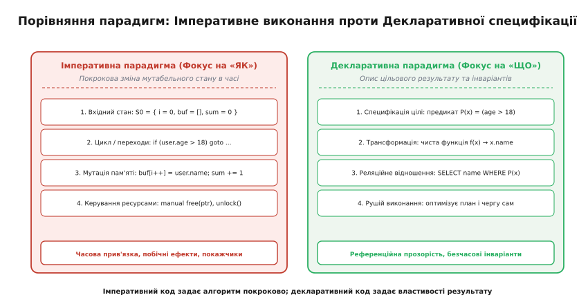
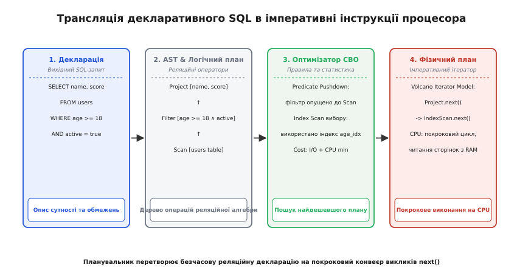
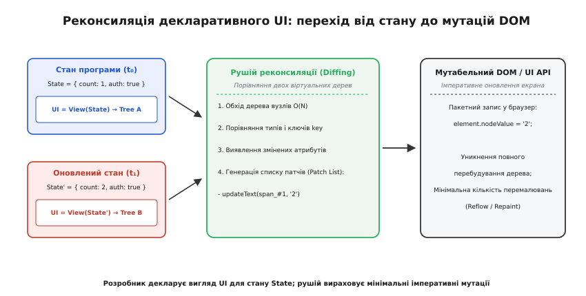

# Декларативне й імперативне: опис інваріантів проти покрокової мутації стану

<preknowlist>
- [Чисті функції і побічні ефекти](topic:programming/pure-functions-side-effects) — референційна прозорість, відсутність прихованих мутацій і відокремлення обчислення від виконання.
- [Адреси й покажчики](topic:programming/addresses-pointers) — організація комірок пам'яті, вказівники та мутабельний стан машини фон Неймана.
- [Функції як значення першого класу](topic:programming/first-class-functions) — функції як дані, замикання та композиція виразів.
- [Абстракції без витрат](topic:programming/zero-cost-abstractions) — як компілятор транслює узагальнені декларативні ланцюги у високоефективний машинний код.
</preknowlist>

Потрібно відфільтрувати 500 000 користувачів інтернет-магазину: знайти активні облікові записи з покупками понад 100 доларів за останні 30 днів, відсортувати їх за датою реєстрації й повернути перші 10 результатів. В одному підході інженер створює масив у пам'яті, заводить змінні-лічильники `i` та `j`, пише три вкладені цикли `for` з умовними переходами `if`, виділяє тимчасовий буфер для ручного сортування злиттям і виставляє прапорці індексів. Якщо обсяг даних зростає до 500 мільйонів рядків на розподілених дисках, цей код повністю ламається: він вимагає ручного переписування на посторінкову вибірку, ручного керування м'ютексами під час паралелізації та оптимізації кешу. В іншому підході той самий запит записується як математичний опис критеріїв: `SELECT id, name FROM users JOIN orders ... WHERE ... ORDER BY ... LIMIT 10`. Тут програма формулює *яким критеріям має відповідати шукана множина*, а рушій бази даних сам обирає алгоритм пошуку — сканування B-дерева, хеш-з'єднання чи паралельну фільтрацію на ядрах CPU — без зміни жодного рядка бізнес-логіки.

Ця відмінність відображає фундаментальний вододіл комп'ютерних наук: протистояння між **імперативною** та **декларативною** парадигмами програмування. Вони пропонують принципово різні ментальні моделі того, як людина виражає обчислювальну задачу і як обчислювальна система втілює її в дійсність.

> 🔧 **Навіщо це.** Розуміння межі між імперативним та декларативним підходами дозволяє проєктувати системи, стійкі до змін і масштабування: відділяти бізнес-правила (інваріанти, специфікації) від механізмів їх фізичного виконання (планувальників, алокаторів, алгоритмів паралелізації), мінімізуючи простір для прихованих багів синхронізації та витоків стану.

---

### Фундаментальна дихотомія: припис дії проти декларації відношення

Різниця починається з мовного походження термінів:
- **Імперативність** (від латинського *imperare* — наказувати, повелівати) зосереджена на питанні **«ЯК зробити»**. Програма є суворо впорядкованою в часі послідовністю наказів для процесора: «виділи 8 байтів», «завантаж число в регістр», «якщо значення менше нуля — стрибни за адресою 0x400F».
- **Декларативність** (від латинського *declarare* — проголошувати, заявляти) зосереджена на питанні **«ЩО отримати»**. Програма є формальною специфікацією цільового результату, системою рівнянь або предикатів: «знайди такий `X`, для якого істинне твердження `P(X)`».


*Порівняння парадигм: імперативний підхід керує покроковою зміною мутабельних комірок пам'яті в часі, тоді як декларативний підхід формулює математичні інваріанти цільового стану, делегуючи пошук алгоритму виконання спеціалізованому рушію.*

В імперативній програмі головним носієм смислу є **стан пам'яті в дискретний момент часу `t`**. Будь-який рядок коду набуває значення лише у контексті того, що було виконано до нього і що буде виконано після.

У декларативній програмі поняття плинного часу усунуто з інтерфейсу мови. Вираз `total = price + tax` у чистій декларативній системі — це не наказ одноразово додати два числа й зберегти результат у змінну, а **вічний інваріант**: значення `total` завжди дорівнює сумі `price` та `tax` за означенням.

Про те, як ідея відмови від часового графіка виконання формувалася в наукових суперечках між творцями машини Тьюрінга, лямбда-числення та реляційної алгебри, докладно розповідає [історичний нарис про паралельний розвиток імперативного та декларативного мислення](topic:programming/declarative-vs-imperative/hist-declarative-lineage.md).

---

### Імперативний полюс: час, пам'ять і побічні ефекти

Імперативна модель є прямою абстракцією над фізичною архітектурою фон Неймана. Центральний процесор фізично влаштований як дискретний автомат: він читає поточну інструкцію за адресою лічильника команд (*Program Counter*), змінює стан регістрів та оперативної [пам'яті](topic:programming/addresses-pointers) і пересуває вказівник на наступний крок.

Математично роботу імперативної програми можна представити як ланцюг переходів глобального стану:

```
S₀ ──(inst₁)──> S₁ ──(inst₂)──> S₂ ──(inst₃)──> ... ──(instₙ)──> S_final
```

Кожна інструкція `inst` є функцією переходу `S_{t+1} = f(S_t)`. Еволюція імперативного полюсу полягала у створенні дедалі зручніших інструментів структурування цих переходів:

1. **Процедурне програмування (Fortran, C):** об'єднання частин послідовності інструкцій у підпрограми (функції). Запровадження стекових кадрів для локалізації тимчасових даних.
2. **Структурне програмування (Algol, Pascal):** заборона довільних стрибків `goto` (маніфест Едсгера Дейкстри). Фіксація трьох базових конструкцій керування потоком: послідовне виконання, галуження (`if/else`) та цикл (`while`, `for`).
3. **Класичне об'єктно-орієнтоване програмування (Smalltalk, C++, Java):** групування фрагментів мутабельного стану разом із процедурами, які цей стан змінюють. Інкапсуляція приховує деталі переходу станів за методами об'єкта, але не усуває сам мутабельний стан.

#### Ціна мутабельності та часової зв'язаності

Головною перевагою імперативного підходу є повний і прямий контроль над кремнієм: програміст точно знає, скільки тактів процесора займе операція і в якій ділянці пам'яті лежить байт. Проте ця прозорість має високу інженерну ціну:

- **Часова зв'язаність (англ. *temporal coupling*):** Якщо функція `init_hardware()` має бути викликана строго перед `configure_radio()`, але компілятор не забороняє поміняти їх місцями в коді, виникає прихований баг. Порядок рядків стає критичним інваріантом, який компілятор неспроможний верифікувати автоматично.
- **Побічні ефекти (англ. *side effects*) та аліасинг:** Якщо дві змінні-вказівники посилаються на ту саму ділянку пам'яті, модифікація через один покажчик неявно ламає припущення коду, що працює через інший.
- **Комбінаторний вибух станів:** Функція з 5 мутабельними змінними-прапорцями має `2⁵ = 32` потенційні конфігурації стану. Додавання шостої змінної подвоює простір можливих збоїв.
- **Криза багатопотоковості:** Коли два потоки одночасно змінюють одну комірку пам'яті, виникає стан гонки (*data race*). Синхронізація через м'ютекси сповільнює виконання і призводить до взаємних блокувань (*deadlocks*).

Погляньмо на типовий імперативний алгоритм обробки фінансових рахунків:

:::tabs
```c
#include <stdio.h>
#include <stdbool.h>
#include <stddef.h>

typedef struct {
    int id;
    double balance;
    bool is_active;
} Account;

// Імперативна мутація стану масиву за місцем
void apply_monthly_fee(Account* accounts, size_t count, double fee) {
    for (size_t i = 0; i < count; ++i) {
        // Керування потоком і зміна стану комірки пам'яті
        if (accounts[i].is_active && accounts[i].balance >= fee) {
            accounts[i].balance -= fee; // Побічний ефект: мутація пам'яті
        } else if (accounts[i].is_active) {
            accounts[i].is_active = false; // Зміна інваріанту активності
        }
    }
}
```
```cpp
#include <cstddef>
#include <span>

struct Account {
    int id;
    double balance;
    bool is_active;
};

// Імперативна функція: покрокова зміна мутабельних об'єктів
void apply_monthly_fee(std::span<Account> accounts, double fee) {
    for (auto& account : accounts) {
        if (account.is_active && account.balance >= fee) {
            account.balance -= fee;
        } else if (account.is_active) {
            account.is_active = false;
        }
    }
}
```
:::

У цьому коді кожен крок залежить від попереднього, а переданий масив змінюється безпосередньо. Якщо паралельний потік прочитає `accounts` посередині циклу, він побачить частково оновлений, внутрішньо неузгоджений стан.

---

### Декларативні моделі: математичні вирази, логічний висновок та предметні DSL

Декларативний підхід усуває мутацію стану з очей програміста. Замість покрокових інструкцій розробник оперує відношеннями між сутностями. Залежно від базового математичного апарату декларативні системи поділяються на кілька великих родин.

#### 1. Функційна модель (чисті вирази та референційна прозорість)

Функційна декларативність спирається на [чисті функції](topic:programming/pure-functions-side-effects) та лямбда-числення. Головний принцип — **референційна прозорість** (англ. *referential transparency*): будь-який вираз можна замінити його значенням без зміни поведінки програми.

```
f(x) + f(x)
= 2 · f(x)    [якщо f(x) — чиста функція: результат залежить лише від x, побічні ефекти відсутні]
```

У функційній моделі:
- Немає мутабельних змінних — дані є [незмінними](topic:programming/pure-functions-side-effects) (імутабельними).
- Цикли замінюються рекурсією або функціями вищого порядку (`map`, `filter`, `fold`).
- Керування потоком замінюється композицією виразів `h = g ∘ f`.

Завдяки цьому порядок обчислення чистих виразів не впливає на кінцевий результат, що відкриває простір для [лінивого обчислення](topic:programming/lazy-evaluation) та автоматичного розпаралелювання без м'ютексів.

#### 2. Логічна модель (Prolog та Datalog)

У логічному програмуванні програма є набором аксіом у логіці першого порядку: **фактів** (тверджень про світ) та **правил висновку** (диз'юнктів Хорна). Обчислення є автоматичним процесом пошуку логічного висновку.

```prolog
% Факти: батьківські зв'язки
parent(ivan, petro).
parent(petro, olga).

% Декларативне правило: предок — це або батько, або предок батька
ancestor(X, Y) :- parent(X, Y).
ancestor(X, Y) :- parent(X, Z), ancestor(Z, Y).
```

Щоб знайти всіх предків Ольги, програміст не пише алгоритм обходу дерева у глибину — він задає запит:
```prolog
?- ancestor(X, olga).
```
Рантайм Prolog автоматично запускає механізм **уніфікації** та пошуку з поверненням (*backtracking*), повертаючи почергово `X = petro` та `X = ivan`.

#### 3. Декларативні предметно-орієнтовані мови (DSL)

Найбільшого комерційного поширення декларативний підхід набув у спеціалізованих предметних доменах:

- **SQL (Реляційні бази даних):** Запит описує проекцію та обмеження над множинами кортежів ([реляційна модель даних](topic:programming/relational-model)). Програміст пише `WHERE amount > 500`, не вказуючи, чи слід читати B-Tree індекс, чи сканувати всю таблицю.
- **HTML / CSS (Оформлення та макетування):** Тег `<button class="primary">` та стиль `.primary { background: blue; }` описують бажаний вигляд елемента. Браузер самостійно розраховує геометрію вікна (*layout*), малює пікселі на графічній карті (*rasterization*) та оновлює кадри зі швидкістю 60 або 120 FPS.
- **Декларативний UI (React JSX, SwiftUI, Flutter):** Інтерфейс виражається як чиста функція стану `UI = View(State)`. Коли змінюється `State`, програміст не шукає вручну старі кнопки у вікні — він повертає нове віртуальне дерево, а рушій сам знаходить різницю.
- **Інфраструктура як код (Terraform, Kubernetes manifests, Nix):** Інженер записує у файлі HCL чи YAML: `replicas: 3, port: 8080`. Контролер кластера безперервно порівнює фактичний стан серверів із задекларованим і запускає відсутні вузли.

---

### Трансляція декларації в імперативне виконання: архітектура рушіїв

Кремнієвий процесор не вміє виконувати предикати чи SQL-запити напряму — він залишається покроковою машиною фон Неймана. Тому будь-яка декларативна система містить всередині критично важливий компонент: **транслятор/виконувач (Engine / Planner / Reconciler)**, який перетворює опис «ЩО» на послідовність машинних інструкцій «ЯК».

Розгляньмо два фундаментальні приклади такої трансляції: планувальник запитів СУБД та реактивний рушій інтерфейсу.

#### 1. Планувальники запитів (Query Planners у RDBMS)

Коли користувач надсилає до бази даних декларативний SQL-запит, СУБД проводить його через багатоступеневий конвеєр:


*Трансляція декларативного SQL в імперативні інструкції: парсер будує AST, логічний оптимізатор застосовує еквівалентні алгебраїчні перетворення, вартісний планувальник обирає фізичні алгоритми, а модель Volcano виконує покрокові виклики next() на рівні процесора.*

1. **Парсинг та AST:** Текст запиту перетворюється на абстрактне синтаксичне дерево.
2. **Логічний план:** Дерево запиту транслюється в оператори реляційної алгебри: `Project(Filter(Scan(Users)))`.
3. **Логічна оптимізація (Rule-Based Optimization):**
   - *Predicate Pushdown (Опускання предикатів):* Фільтрація рядків опускається якомога ближче до джерела даних (читання з диска), щоб не тягнути зайві байти через увесь конвеєр.
   - *Projection Pruning (Відсікання стовпців):* Усі непотрібні поля викидаються на найранішому етапі.
4. **Фізичний план і Cost-Based Optimizer (CBO):**
   На основі зібраної статистики про розподіл даних у таблицях (гістограми, кількість сторінок на диску) оптимізатор обирає конкретні фізичні алгоритми:
   - Чи сканувати таблицю лінійно (*SeqScan*), чи використати індекс B-Tree (*IndexScan*)?
   - Як об'єднати дві таблиці: через вкладені цикли (*Nested Loop Join*), сортування зі злиттям (*Merge Join*) чи хеш-таблицю (*Hash Join*)?
5. **Фізичне виконання (Модель ітераторів Volcano):**
   Обраний фізичний план перетворюється на дерево ітераторів з уніфікованим інтерфейсом `open()`, `next()`, `close()`. Кореневий вузол викликає `next()` у дочірнього вузла, породжуючи покроковий імперативний потік викликів, який безпосередньо виконується процесором.

Детальний аналіз вибору плану та інструментів його інспектування розглядає [планувальник запитів СУБД](topic:programming/query-planner).

#### 2. Реактивні рушії та алгоритм реконсиляції (Reconciliation)

У декларативних UI-фреймворках (React, Vue, SwiftUI) розробник ніколи не викликає імперативні методи браузера `document.createElement()` чи `node.appendChild()`.


*Реконсиляція декларативного UI: при зміні стану чиста функція View породжує нове віртуальне дерево, алгоритм diffing обчислює мінімальний набір змін (Patch List), а рантайм пакетно застосовує мутації до реального DOM браузера.*

Трансляція відбувається у три фази:
1. **Render Phase (Декларативна генерація):** При зміні стану `State` викликається функція відображення, яка повертає легковагове дерево JavaScript-об'єктів — **Virtual DOM**.
2. **Reconciliation / Diffing Phase (Пошук розбіжностей):** Рушій реконсиляції порівнює попереднє віртуальне дерево `Tree_old` із новим `Tree_new`. Використовуючи евристики складності `O(N)` (порівняння типів вузлів та унікальних ключів `key`), алгоритм знаходить точну різницю.
3. **Commit Phase (Імперативне застосування):** Рушій формує мінімальний список мутацій (англ. *Patch List*) і пакетно застосовує його до реального DOM: `domNode.textContent = "New Value"`.

Завдяки цьому розробник зберігає чистоту декларативного мислення, а браузер уникає дорогих операцій перерахунку макета (*Reflow*) та повного перемалювання пікселів (*Repaint*).

---

### Гібридизація в сучасних мовах загального призначення

Сучасний розвиток мов програмування прямує не до ізоляції парадигм, а до їх синтезу: **декларативний синтаксис виразів поверх високоефективного імперативного ядра**.

Мови C#, Java, Rust, Kotlin та сучасний стандарт C++20 запровадили інструменти для декларативної обробки послідовностей даних:
- **C#:** LINQ (Language Integrated Query) — `from u in users where u.Age > 18 select u.Name`.
- **Java:** Stream API — `users.stream().filter(u -> u.age() > 18).map(User::name).toList()`.
- **Rust:** Iterators — `users.iter().filter(|u| u.age > 18).map(|u| &u.name).collect()`.
- **C++20:** Ranges and Views — `users | std::views::filter(is_adult) | std::views::transform(get_name)`.

Порівняймо, як виглядає обробка даних у C++20:

```cpp
#include <vector>
#include <string>
#include <ranges>
#include <iostream>

struct User {
    std::string name;
    int age;
    bool is_active;
};

void print_active_adult_names(const std::vector<User>& users) {
    // Декларативний конвеєр C++20: композиція операторів через пайп '|'
    auto active_adults = users
        | std::views::filter([](const User& u) { return u.is_active && u.age >= 18; })
        | std::views::transform([](const User& u) { return u.name; })
        | std::views::take(5);

    for (const auto& name : active_adults) {
        std::cout << name << '\n';
    }
}
```

#### Механіка компіляції та абстракції нульової вартості

Чому декларативний конвеєр C++20 `std::views` чи Rust Iterators працює так само швидко, як і написаний вручну низькорівневий цикл на C?

Відповідь полягає в реалізації [принципу абстракцій без витрат](topic:programming/zero-cost-abstractions):
1. **Лінивість адаптерів (Views):** Об'єкт `std::views::filter` не виділяє пам'яті в купі й не копіює вектор. Він є легковаговою обгорткою над вказівниками на початок і кінець діапазону.
2. **Шаблони та інлайнінг:** Усі виклики методів `begin()`, `end()`, `operator++()` та лямбда-предикатів розгортаються компілятором під час збірки (*monomorphization*).
3. **Злиття циклів і векторизація:** Компілятор бачить увесь конвеєр наскрізно й об'єднує фільтрацію, проекцію та лічильник у єдиний щільний машинний цикл. Якщо структури даних лежать суміжно в пам'яті, оптимізатор застосовує SIMD-інструкції (AVX2 / Neon), паралельно обробляючи по 4 або 8 елементів за такт процесора.

Як реалізувати власний рушій ітераторів з детекцією умов та оптимізацією викликів на C і C++, показано у [практичному проєкті побудови конвеєра обробки даних на C та C++20](topic:programming/declarative-vs-imperative/proj-declarative-query-engine.md).

#### Коли декларативність породжує накладні витрати

Декларативні абстракції стають повільними лише тоді, коли порушується принцип нульових витрат:
- **Жадібні алокації в динамічних мовах:** У JavaScript виклик `array.filter(...).map(...)` на кожному кроці виділяє новий масив у купі й завантажує збирач сміття.
- **Динамічна диспетчеризація:** Передача предикатів через абстрактні інтерфейси або покажчики на функції (наприклад, `std::function` у C++ чи віртуальні методи в Java) блокує інлайнінг і коштує додаткового непрямого стрибка процесора.
- **Пастки лінивих обгорток (Thunks):** У лінивих функційних мовах (Haskell) надмірне накопичення відкладених виразів може спричинити витік пам'яті (*space leak*).

---

### Інженерний вибір та межі застосування

Жодна з парадигм не є універсальною відповіддю для всіх завдань інженерії. Досвідчений архітектор обирає інструмент під конкретні обмеження задачі:

| Критерій оцінки | Імперативний підхід | Декларативний підхід |
| :--- | :--- | :--- |
| **Головне питання** | «ЯК виконати» (алгоритм, послідовність дій) | «ЩО отримати» (інваріанти, правила, відношення) |
| **Основна абстракція** | Мутабельний стан пам'яті, змінні, цикли, покажчики | Чисті функції, реляційні оператори, предикати, дерева |
| **Часова прив'язка** | Критична (порядок операцій визначає результат) | Відсутня (порядок обчислень визначає оптимізатор) |
| **Оптимізація** | Ручна (програміст контролює кеш, регістри й пам'ять) | Автоматична (рушій/компілятор обирає план виконання) |
| **Зневадження** | Просте (покроковий стек викликів, breakpoints) | Складне (абстрактний рушій ховає проміжні стани) |
| **Паралелізація** | Складна (м'ютекси, семафори, ризик race conditions) | Природна (відсутність побічних ефектів, map-reduce) |

#### Де декларативний підхід є безальтернативним:
- **Трансформація та агрегація великих даних (SQL, Spark, LINQ):** оптимізатор запитів завжди впорається з розподілом навантаження краще за ручний код.
- **Користувацькі інтерфейси (React, SwiftUI, Compose):** відокремлення візуального стану від імперативних мутацій екрана запобігає розсинхронізації UI.
- **Опис конфігурацій та інфраструктури (Terraform, Kubernetes, Nix):** ідемпотентний опис цільового стану гарантує відтворюваність середовища.
- **Бізнес-правила та логічний висновок (Datalog, системи авторизації OPA/Rego):** перевірка політик доступу через предикати виключає випадковий обхід умов.

#### Де імперативний підхід залишається обов'язковим:
- **Ядра операційних систем та драйвери пристроїв:** пряме керування регістрами апаратури (MMIO), налаштування таблиць сторінок MMU, обробка апаратних переривань.
- **Системні алокатори пам'яті (malloc/free, slab-алокатори):** ручне керування адресами та блоками фізичної пам'яті.
- **Високопродуктивні рушії комп'ютерної графіки та ігор:** низькорівнева оптимізація кешу процесора (Data-Oriented Design), ручне керування буферами GPU (Vulkan, DirectX 12) та безпосереднє застосування SIMD-інструкцій.
- **Критичні до мікросекундної латентності мережеві протоколи:** уникнення будь-яких проміжних рівнів абстракції та лінивих обгорток.

Сучасна архітектура програмних систем будується на гармонійному поєднанні: **декларативне ядро для бізнес-правил і трансформації даних** та **строго ізольовані імперативні виконавчі механізми на системному рівні**.
