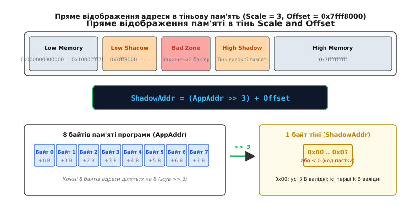
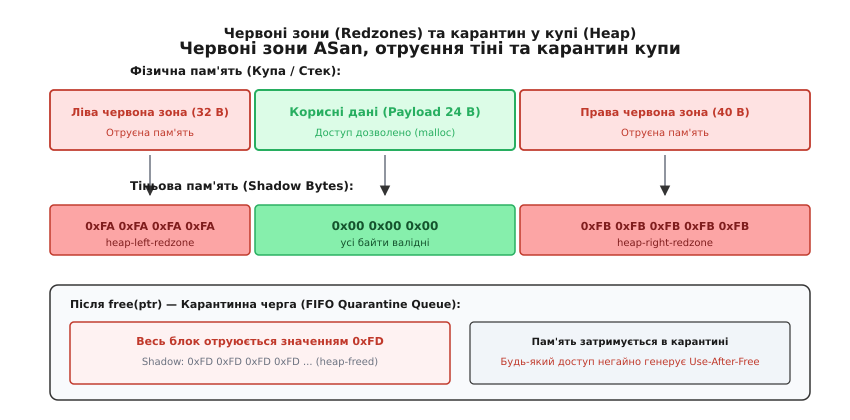
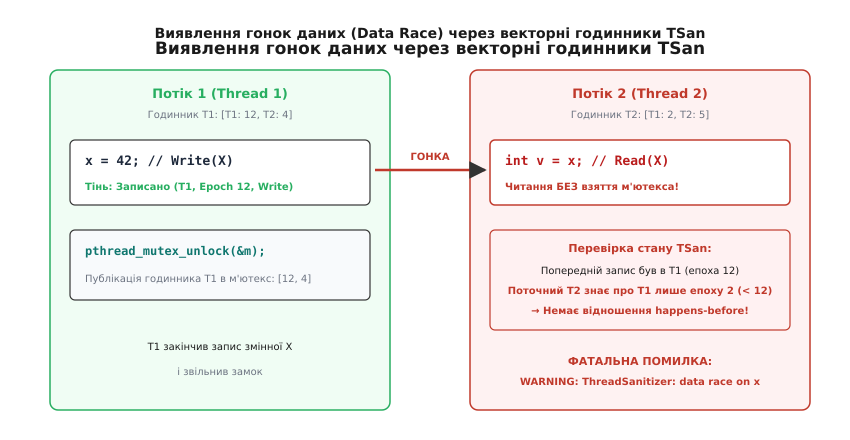
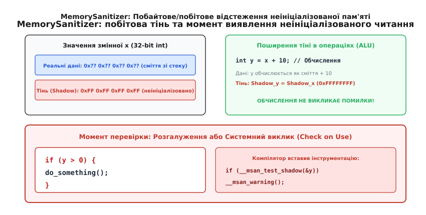

# Динамічні санітайзери: ASan, TSan, MSan, UBSan

<preknowlist>
- [Невизначена поведінка (UB)](topic:programming/undefined-behavior) — чому компілятор C/C++ припускає коректність пам'яті й оптимізує перевірки.
- [Проміжне представлення (IR)](topic:programming/intermediate-representation) — як компілятор трансформує операції читання та запису перед генерацією машинного коду.
- [Атомарність і гонки](topic:programming/atomicity-races) — визначення стану гонки даних при паралельному доступі потоків.
- [Оптимізації компілятора](topic:programming/compiler-optimizations) — як компілятор усуває зайві обчислення та змінює порядок інструкцій.
</preknowlist>

Код мережевого сервера на C чи C++ проходить усі модульні тести, не видає жодного попередження компілятора під час збірки з `-Wall -Wextra`, але після кількох годин роботи під високим навантаженням аварійно завершується із сигналом `SIGSEGV`. Повторний запуск під налагоджувачем `gdb` нічого не показує: помилка зникає або зміщується в інший модуль. Причина полягає в тому, що один із потоків виконав запис за межі виділеного буфера на 1 байт (off-by-one), пошкодивши заголовок сусіднього блоку в купі, або прочитав неініціалізоване поле структури, значення якого визначило хибний перехід.

Статичний аналіз коду неспроможний гарантовано виявити подібні дефекти через проблему аліасування покажчиків та динамічну природу виділення пам'яті: компілятор не знає точних розмірів буферів під час трансляції. Ручні перевірки меж сповільнюють розробку й захаращують код. Для вирішення цієї проблеми були створені **динамічні санітайзери** (англ. *dynamic sanitizers*, від лат. *sanitas* — здоров'я) — технологія глибокої компіляторної інструментації, що інтегрує швидкі перевірки коректності операцій безпосередньо у скомпільований машинний код.

## Компіляторне інструментування проти двійкової емуляції

До появи сучасних санітайзерів основним інструментом динамічного пошуку помилок пам'яті був Valgrind (зокрема модуль Memcheck). Valgrind працює як віртуальна машина: він перехоплює скомпільовані машинні інструкції в рантаймі, транслює їх у проміжне представлення VEX IR, додає перевірки валідності кожного біта пам'яті та виконує JIT-трансляцію назад у машинний код.

Такий підхід не вимагає перекомпіляції програми, проте спричиняє критичне сповільнення виконання у 20–50 разів і чотирикратне зростання споживання пам'яті. Запустити інтеграційне тестування великої системи чи провести фазинг-кампанію з мільйонами ітерацій під Valgrind стає практично неможливо.

Санітайзери Clang і GCC (AddressSanitizer, ThreadSanitizer, MemorySanitizer, UndefinedBehaviorSanitizer) змінили архітектуру контролю. Замість емуляції бінарного коду в просторі користувача інструментування (від лат. *instrumentum* — знаряддя) виконується [компілятором на етапі оптимізації LLVM IR або GCC GIMPLE](topic:programming/compiler-stages). Компілятор аналізує кожну інструкцію читання (`load`) та запису (`store`) пам'яті й додає перед нею короткий асемблерний код перевірки статусу цільової адреси.

Детальніше про те, як індустрія перейшла від важкої двійкової емуляції до блискавичного компіляторного контролю, описано в [історичному нарисі про еволюцію від Valgrind до ASan](topic:programming/dynamic-sanitizers/hist-valgrind-to-asan.md).

Завдяки тому, що перевірки вбудовуються до виконання загальних оптимізацій, компілятор видаляє надлишкові перевірки в циклах та інлайнить перевірку адреси в 2–3 швидкі машинні інструкції. Це знижує сповільнення програми до **1.5x–2.5x**, що дозволяє тримати санітайзери постійно увімкненими в тестових середовищах та на етапах безперервної інтеграції (CI).

### Конвеєр інструментації в LLVM

У структурі компілятора LLVM санітайзери реалізовані як набір окремих оптимізаційних проходів (Passes) над проміжним представленням LLVM IR:
- `AddressSanitizerPass` — прохід рівня функції, що трансформує інструкції читання та запису пам'яті;
- `ModuleAddressSanitizerPass` — прохід рівня модуля, що перетворює глобальні змінні, додаючи до них червоні зони, і реєструє конструктори ініціалізації тіні;
- `ThreadSanitizerPass` — вставляє виклики оновлення векторних годинників перед операціями читання/запису пам'яті та точками синхронізації;
- `MemorySanitizerPass` — генерує паралельні бітові операції ALU для обчислення тіні кожного значення та вставляє інструкції валідації перед умовними переходами.

Розглянемо, як звичайна інструкція читання пам'яті виглядає в LLVM IR до та після проходження інструментації ASan.

**LLVM IR до інструментації:**

```text
%val = load i32, i32* %ptr, align 4
```

**LLVM IR після інструментації:**

```text
; 1. Перетворення покажчика у ціле число
%ptr_int = ptrtoint i32* %ptr to i64

; 2. Пряма трансляція: зсув вправо на 3 біти (ділення на 8)
%shadow_offset = lshr i64 %ptr_int, 3

; 3. Додавання константного зсуву тіні
%shadow_addr_int = add i64 %shadow_offset, 2147450880 ; 0x7fff8000
%shadow_ptr = inttoptr i64 %shadow_addr_int to i8*

; 4. Зчитування тіньового байта
%shadow_val = load i8, i8* %shadow_ptr, align 1

; 5. Перевірка: чи тіньовий байт дорівнює 0 (0x00 = повністю валідно)
%is_invalid = icmp ne i8 %shadow_val, 0
br i1 %is_invalid, label %slow_path, label %fast_path

slow_path:
; Повільний шлях: виклик рантайм-обробника звіту про помилку
call void @__asan_report_load4(i64 %ptr_int)
unreachable

fast_path:
; Швидкий шлях: оригінальне читання пам'яті
%val = load i32, i32* %ptr, align 4
```

Оптимізатор компілятора застосовує прохід усунення спільних підвиразів (Common Subexpression Elimination) та винесення інваріантів із циклів (Loop Invariant Code Motion). Якщо цикл послідовно читає елементи масиву, компілятор може об'єднати перевірки тіні для кількох сусідніх ітерацій або перевірити межі всього блоку один раз перед входом у цикл.

### Перехоплення системних функцій та викликів бібліотек (Interceptors)

Крім інструментації окремих інструкцій процесора, санітайзери повинні контролювати стандартні бібліотечні функції, які працюють із пам'яттю блоками: `memcpy`, `memmove`, `memset`, `strcmp`, `strlen`, `strcpy`, `printf` тощо.

Рантайм-бібліотека санітайзера замінює ці функції за допомогою механізму перехоплення (Interceptors). На операційних системах сімейства Linux/POSIX перехоплення реалізується через підміну символів динамічного компонувальника (`LD_PRELOAD` або статичне зв'язування з вищим пріоритетом символів).

Перед тим як виконати реальне копіювання даних у функції `memcpy(dest, src, n)`, обробник-перехоплювач санітайзера:
1. Перевіряє, що діапазон джерела `[src, src + n)` повністю розотруєний і доступний для читання;
2. Перевіряє, що діапазон призначення `[dest, dest + n)` повністю розотруєний і доступний для запису;
3. Перевіряє, що буфери `dest` і `src` не перетинаються (якщо перетинаються — сигналізує про порушення стандарту C, де вимагається `memmove`);
4. Якщо перевірки успішні — виконує швидке копіювання та оновлює тіньову пам'ять для буфера призначення.

## Тіньова пам'ять (Shadow Memory) і пряма трансляція адрес

Фундаментальною концепцією ASan, TSan та MSan є **тіньова пам'ять** (англ. *shadow memory*). Це виділений діапазон віртуального адресного простору процесу, де кожен байт (або слово) описує стан і доступність відповідного байта основної пам'яті програми.

Щоб перевірка адреси виконувалася за мінімальну кількість тактів процесора, відображення адреси програми в адресу її тіні реалізовано через пряму арифметичну формулу без використання таблиць хешів, бінарних дерев чи системних викликів.

Формула прямої трансляції адреси:

```
ShadowAddress = (AppAddress >> Scale) + Offset
```

де:
- `AppAddress` — віртуальна адреса пам'яті, до якої звертається програма;
- `Scale` — логічний зсув вправо, що визначає коефіцієнт стиснення (у скільки разів тінь компактніша за пам'ять програми);
- `Offset` — константний базовий зсув тіньового простору в пам'яті процесу.


*Схема прямої трансляції Scale and Offset: кожні 8 байтів адреси програми діляться на 8 (зсув вправо на 3 біти) і додаються до базового зміщення Offset, що вказує на відповідний байт у тіньовому просторі.*

У 64-бітній архітектурі `x86_64` для AddressSanitizer значення `Scale` дорівнює `3`, що відповідає порозрядному зсуву вправо на 3 біти (діленню на 8). Це означає, що **кожні 8 байтів пам'яті програми описуються рівно 1 байтом у тіньовій пам'яті** (коефіцієнт стиснення 1/8, або 12.5% від усього адресного простору).

Константа `Offset` на Linux `x86_64` зазвичай становить `0x7fff8000` (для старших 32-бітних адрес) або `0x10007fff8000`. Віртуальний простір процесу ділиться на п'ять зон:
1. **Low Memory** (`0x000000000000` .. `0x10007fff7fff`) — нижня пам'ять програми (стек, купа, завантажені бібліотеки);
2. **Low Shadow** (`0x7fff8000` .. `...`) — тінь для нижньої пам'яті програми;
3. **Bad Zone** (захищений бар'єр із правами `PROT_NONE`) — діапазон адрес, звернення до якого спричиняє миттєвий апаратний збій; захищає від спроб використання самої тіні як звичайної пам'яті;
4. **High Shadow** — тінь для верхнього діапазону пам'яті;
5. **High Memory** (`...` .. `0x7fffffffffff`) — верхня пам'ять програми.

Рантайм санітайзера резервує цей діапазон на старті процесу через системний виклик `mmap()` із прапорами `MAP_NORESERVE | MAP_PRIVATE | MAP_ANONYMOUS`. Фізичні сторінки пам'яті виділяються операційною системою лише в міру реального звернення до них.

Кожна асемблерна інструкція читання 8-байтового слова:

```text
mov (%rax), %rbx
```

трансформується компілятором у послідовність швидкої перевірки тіньового байта (Fast-Path Check):

```text
mov    %rax, %rcx        ; Копіюємо адресу в тимчасовий регістр
shr    $0x3, %rcx        ; Ділимо адресу на 8 (Scale = 3)
add    $0x7fff8000, %rcx ; Додаємо Offset
cmpb   $0x0, (%rcx)      ; Перевіряємо тіньовий байт на рівність 0 (0x00 = валідно)
jne    .Lreport_error    ; Якщо не нуль — переходимо до звіту про помилку
mov    (%rax), %rbx      ; Оригінальне читання пам'яті
```

Якщо тіньовий байт дорівнює `0x00`, процесор виконує лише три додаткові інструкції (`shr`, `add`, `cmpb`) без розгалужень у повільний код, що забезпечує мінімальне просідання швидкодії.

### Мікроархітектурний вплив на кеш-пам'ять і TLB

Незважаючи на високу швидкість обчислення формули прямої трансляції, санітайзери створюють специфічне навантаження на підсистему пам'яті процесора:
1. **Засмічення кешу даних (Cache Pollution):** кожне звернення до пам'яті програми супроводжується зверненням до тіньової пам'яті. Це призводить до завантаження додаткових тіньових ліній у кеш L1D та L2, витісняючи корисні дані програми та збільшуючи відсоток кеш-промахів (cache misses).
2. **Тиск на буфер трансляції адрес (TLB Pressure):** оскільки тіньова пам'ять розміщується в іншому діапазоні віртуальних адрес, процесор паралельно обслуговує записи TLB як для сторінок програми, так і для сторінок тіні, що збільшує кількість звернень до таблиць сторінок ядра (Page Table Walks).
3. **Передбачення розгалужень (Branch Prediction):** інструкція умовного переходу `jne .Lreport_error` є сильно несиметричною (помилки виникають вкрай рідко). Блок передбачення переходів CPU майже завжди передбачає `fast_path` як неперехідний, тому конвеєр інструкцій процесора не скидається на коректному коді.

## AddressSanitizer (ASan): Червоні зони, переповнення та Use-After-Free

AddressSanitizer (вмикається прапором `-fsanitize=address`) призначений для виявлення просторових (spatial) та часових (temporal) помилок адресації пам'яті:
- Вихід за межі буфера в купі (Heap Buffer Overflow);
- Вихід за межі стекового масиву (Stack Buffer Overflow);
- Вихід за межі глобальних і статичних змінних (Global Buffer Overflow);
- Використання пам'яті після звільнення (Use-After-Free / Heap Use-After-Free);
- Використання стекової змінної після виходу з функції (Use-After-Return);
- Використання змінної після завершення області видимості (Use-After-Scope);
- Подвійне звільнення пам'яті (Double Free) та передача невалідного покажчика в `free()`.

### Кодування станів у тіньовому байті

Оскільки 1 байт тіні описує 8 байтів пам'яті програми, можливі проміжні стани, коли алокація не кратна 8 байтам (наприклад, виділено масив із 13 байтів: перші 8 байтів валідні повністю, наступні 5 — валідні, а останні 3 байти є забороненими).

ASan використовує наступну схему кодування значень тіньового байта:
- `0x00` — усі 8 байтів адреси повністю доступні для читання та запису;
- `0x01` .. `0x07` — валідними є лише перші `k` байтів (від 1 до 7); доступ до байтів із номерами ≥ `k` вважається виходом за межі (Tail Overflow);
- **Від'ємні значення (старший біт = 1):** уся 8-байтова комірка є отруєною (poisoned), а конкретне шістнадцяткове число вказує на тип пам'яті:
  - `0xFA` — ліва червона зона купи (Heap Left Redzone);
  - `0xFB` — права червона зона купи (Heap Right Redzone);
  - `0xFD` — звільнений блок пам'яті в купі (Freed Heap Region, Use-After-Free);
  - `0xF1` — ліва червона зона стекового кадру (Stack Left Redzone);
  - `0xF2` — внутрішній роздільник стекових змінних (Stack Mid Redzone);
  - `0xF3` — права червона зона стекового кадру (Stack Right Redzone);
  - `0xF5` — стекова змінна поза областю видимості (Use-After-Scope);
  - `0xF8` — червона зона глобальної змінної (Global Redzone).

### Червоні зони (Redzones) та Карантин купи

Для виявлення виходу за межі буфера ASan застосовує механізм **червоних зон**.


*Розміщення буфера в купі з червоними зонами зліва і справа. Тіньова пам'ять містить отруєні маркери 0xFA і 0xFB, а після виклику free() весь блок перетворюється на 0xFD і поміщається в чергу карантину.*

1. **Купа (Heap):** ASan підміняє стандартний розподілювач пам'яті (`malloc`, `free`, оператори `new`, `delete`) власним кастомним алокатором. Коли програма запитує блок розміром `N` байтів:
   - Алокатор виділяє буфер розміром `Redzone_left + N + Redzone_right` (де розмір зони варіюється від 16 до 128 байтів залежно від розміру виділення);
   - Тіньові байти, що відповідають лівій і правій червоним зонам, отруюються значеннями `0xFA` та `0xFB`;
   - Тіньові байти для корисних даних розміром `N` помічаються як валідні (`0x00` та залишок `N mod 8`);
   - Програмі повертається покажчик на початок корисних даних.
   Будь-яка спроба прочитати або записати байт `ptr[-1]` або `ptr[N]` потрапляє в червону зону і негайно генерує діагностичний звіт ASan.

2. **Стек (Stack):** Компілятор під час побудови стекового кадру функції збільшує розмір кадру й вставляє захисні байти між кожною парою локальних змінних. Усі локальні змінні функції групуються в єдину синтетичну структуру:

```text
struct StackFrameWithRedzones {
    uint8_t left_redzone[32];   ; 0xF1
    int var_a[10];              ; Корисні дані (40 байтів)
    uint8_t mid_redzone[32];    ; 0xF2
    char var_b[16];             ; Корисні дані (16 байтів)
    uint8_t right_redzone[32];  ; 0xF3
};
```

На вході у функцію згенерований компілятором пролог записує маркери `0xF1`, `0xF2`, `0xF3` у тіньову пам'ять, а епілог функції перед інструкцією `ret` очищає тінь значеннями `0x00`.

3. **Стековий Use-After-Return та підробний стек (Fake Stack):**
   Якщо функція повертає покажчик на локальну змінну, після виходу з функції стек розмотується, але тінь очищається. При звичайному виконанні звернення за цим покажчиком може пошкодити новий стековий кадр.
   Опція `ASAN_OPTIONS=detect_stack_use_after_return=1` активує механізм **Fake Stack**: замість виділення кадру на апаратному стеку процесора функція запитує пам'ять у рантайму через виклик `__asan_stack_malloc_N()`. Коли функція повертає управління, кадр не звільняється фізично, а позначається в тіні як отруєний. Спроба доступу за покажчиком на стару локальну змінну фіксується як `stack-use-after-return`.

4. **Глобальні змінні (Globals):** Компілятор збільшує розмір кожної глобальної та статичної змінної у секціях `.data` та `.bss` на розмір червоної зони (зазвичай 32–64 байти). Під час ініціалізації програми спеціальний конструктор ASan отруює всі створені відступи значенням `0xF8`.

5. **Захист від Use-After-Free через Карантин (Quarantine):**
   Коли програма викликає `free(ptr)`, класичний алокатор міг би негайно повернути цю пам'ять під наступний виклик `malloc()`. У такому разі помилковий запис за старим покажчиком `ptr` міг би потрапити в новий валідний об'єкт і залишитися непоміченим.
   ASan діє інакше:
   - При виклику `free(ptr)` вся ділянка пам'яті (разом із корисними даними) отруюється міткою `0xFD` (Heap Freed);
   - Звільнений блок поміщається у фіксовану кільцеву чергу — **карантин** (за замовчуванням об'ємом 256 МБ);
   - Поки блок перебуває в карантині, він ніколи не перевикористовується для нових алокацій. Будь-який доступ до нього викликає помилку `heap-use-after-free` з точним стек-трейсом місця виділення пам'яті, місця звільнення та місця невалідного доступу.

6. **Пошук витоків пам'яті (LeakSanitizer):**
   ASan за замовчуванням інтегрує модуль LSan. Під час штатного виходу з процесу (`exit`) LSan призупиняє всі допоміжні потоки та виконує консервативне сканування кореневого набору вказівників (регістри процесора кожного потоку, активні стекові кадри, глобальні змінні `.data`/`.bss` та пам'ять локальних змінних потоку TLS). Будь-який блок купи, виділений через `malloc`/`new`, на який не знайдено жодного живого покажчика, друкується у фінальному звіті як витік пам'яті.

Практичну програмну реалізацію власного емулятора тіньової пам'яті з червоними зонами та карантином наведено у вставці [практикуму з побудови Shadow Memory](topic:programming/dynamic-sanitizers/proj-shadow-memory.md).

Розглянемо типовий приклад помилки виходу за межі динамічного масиву та використання звільненої пам'яті:

:::tabs
```c
#include <stdio.h>
#include <stdlib.h>

void heap_overflow_demo(void) {
    int *array = (int *)malloc(5 * sizeof(int)); // Виділено 20 байтів
    // Допустимі індекси: 0, 1, 2, 3, 4
    array[5] = 100; // ASan зловить Heap Buffer Overflow (вихід на 4 байти вправо)
    free(array);
}

void use_after_free_demo(void) {
    char *buffer = (char *)malloc(64);
    free(buffer);
    buffer[0] = 'A'; // ASan зловить Heap Use-After-Free
}
```
```cpp
#include <iostream>
#include <vector>
#include <memory>

void heap_overflow_demo() {
    auto array = std::make_unique<int[]>(5);
    // При прямому індексуванні через сирий покажчик без перевірки меж:
    int* raw_ptr = array.get();
    raw_ptr[5] = 100; // ASan фіксує Heap Buffer Overflow
}

void use_after_free_demo() {
    int* dangling_ptr = nullptr;
    {
        auto temp_obj = std::make_unique<int>(42);
        dangling_ptr = temp_obj.get();
    } // temp_obj виходить з області видимості та звільняє пам'ять
    *dangling_ptr = 999; // ASan фіксує Heap Use-After-Free
}
```
:::

## ThreadSanitizer (TSan v2): Гонки даних і векторні годинники

Багатопотокові помилки належать до найважчих для локалізації: **гонка даних** (англ. *data race*) може проявлятися один раз на мільйон запусків залежно від планувальника ядер процесора.

Згідно зі стандартом C++ (модель пам'яті C++11/C++20), гонка даних виникає, коли:
1. Два або більше потоків одночасно звертаються до однієї комірки пам'яті;
2. Щонайменше одне зі звернень є операцією запису (`write`);
3. Потоки не використовують взаємну синхронізацію (м'ютекси, атомарні змінні) для встановлення відношення [«виконується перед» (happens-before)](topic:programming/std-atomic).

ThreadSanitizer (прапор `-fsanitize=thread`) виявляє гонки даних, взаємні блокування (deadlocks) та використання неініціалізованих м'ютексів під час виконання програми.

### Векторні годинники (Vector Clocks) та Епохи

Для формального доведення наявності чи відсутності синхронізації TSan використовує математичний апарат **векторних годинників** (Vector Clocks).

Кожен потік `T[k]` підтримує власний векторний годинник `V[k] = ⟨t₁, t₂, …, tₙ⟩`, де `t[i]` — логічний час (епоха) потоку `i`, відомий потоку `k`.
- Коли потік виконує внутрішню дію, його власний лічильник збільшується: `t[k] ← t[k] + 1`;
- Коли потік звільняє м'ютекс (`pthread_mutex_unlock`), поточний векторний годинник потоку зберігається в структурі синхронізатора;
- Коли інший потік захоплює цей м'ютекс (`pthread_mutex_lock`), його векторний годинник об'єднується (операція `max`) із годинником синхронізатора: `V_cur[i] ← max(V_cur[i], V_sync[i])`;
- Коли батьківський потік створює дочірній потік (`pthread_create`), годинник батька передається нащадку; при завершенні потоку (`pthread_join`) годинник нащадка вливається назад у батьківський потік.


*Діагностика гонки в TSan: Потік 1 записує змінну X в епосі 12 і публікує свій годинник у м'ютекс. Потік 2 читає змінну X без захоплення м'ютекса, маючи застарілий векторний годинник (знає про Потік 1 лише епоху 2 < 12). TSan виявляє відсутність happens-before і фіксує стан гонки.*

### Структура тіні TSan

У TSan тіньова пам'ять значно більша, ніж в ASan: **на кожні 8 байтів пам'яті програми виділяється 32 байти тіні** (4 слоти тіньових слів по 8 байтів). Кожне 8-байтове тіньове слово записує історію одного звернення:

```
[ Ідентифікатор потоку (TID): 16 біт ]
[ Епоха / Логічний час (Epoch): 42 біти ]
[ Зсув і розмір доступу: 5 бітів ]
[ Прапор операції IsWrite: 1 біт ]
```

Коли потік звертається до пам'яті:
1. TSan перевіряє 4 збережені в тіні попередні звернення до цієї комірки;
2. Якщо знайдено звернення іншого потоку, де хоча б одна операція є записом, TSan порівнює епоху з тіні з поточним векторним годинником потоку;
3. Якщо поточний потік **не знає** про епоху попереднього звернення (тобто між ними не було виклику розблокування/блокування м'ютекса чи атомарного релізу), це означає, що операції виконувалися паралельно — фіксується Data Race.

Якщо всі 4 слоти тіні зайняті попередніми зверненнями, TSan витісняє один із записів за алгоритмом випадкового або псевдо-LRU вибору. Витіснення старого запису може призвести до того, що дуже давня гонка не буде помічена (false negative), проте TSan **ніколи не генерує хибних спрацьовувань** (false positives) на коректно синхронізованому коді.

:::tabs
```c
#include <pthread.h>
#include <stdio.h>

static int g_shared_counter = 0; // Несинхронізована змінна

void *worker_thread(void *arg) {
    (void)arg;
    for (int i = 0; i < 1000; ++i) {
        g_shared_counter++; // Гонка даних (читання-модифікація-запис)
    }
    return NULL;
}

int main(void) {
    pthread_t t1, t2;
    pthread_create(&t1, NULL, worker_thread, NULL);
    pthread_create(&t2, NULL, worker_thread, NULL);

    pthread_join(t1, NULL);
    pthread_join(t2, NULL);
    return 0;
}
```
```cpp
#include <iostream>
#include <thread>
#include <atomic>

int g_unsynchronized_counter = 0;

void worker() {
    for (int i = 0; i < 1000; ++i) {
        // Одночасна модифікація сирого int двома потоками
        ++g_unsynchronized_counter; // TSan фіксує Data Race
    }
}

int main() {
    std::thread t1(worker);
    std::thread t2(worker);

    t1.join();
    t2.join();
    return 0;
}
```
:::

## MemorySanitizer (MSan): Побітове відстеження неініціалізованої пам'яті

Читання неініціалізованої локальної змінної зі стеку чи неініціалізованого блоку в купі (`malloc`) призводить до недетермінованої поведінки програми. У виділеній пам'яті залишаються байти попередніх операцій, паролі чи адреси покажчиків, що створює небезпечні витоки конфіденційних даних та приховані помилки алгоритмів.

MemorySanitizer (прапор `-fsanitize=memory` у Clang) відстежує стан кожного біта пам'яті.

### Побітова тінь і поширення (Propagation)

На відміну від ASan, де 1 байт тіні описує 8 байтів даних, **в MSan використовується відображення 1:1 — кожен біт пам'яті програми має рівно 1 біт у тіні**:
- `0` у тіньовому біті — відповідний біт програми є **ініціалізованим** (валідне значення);
- `1` у тіньовому біті — відповідний біт програми є **неініціалізованим** (сміття).


*Принцип роботи MSan: операції додавання чи копіювання поширюють тіньові біти без генерації помилки. Помилка Use-of-uninitialized-value виникає лише в момент використання неініціалізованого значення для розгалуження if чи розіменування адреси.*

Головний принцип MSan полягає в розмежуванні **поширення** та **перевірки**:
1. **Поширення (Shadow Propagation):** якщо програма копіює неініціалізовану структуру через `memcpy` або виконує арифметичну дію `z = x + y`, де `x` неініціалізований, MSan **не генерує помилки**. Компілятор генерує тіньові інструкції ALU, які обчислюють тінь результату: `Shadow_z = Shadow_x | Shadow_y`. Це дозволяє коректно працювати структурам із невикористаними полями вирівнювання (padding bytes).
   
   Для побітових операцій правила поширення тіні враховують обнулення бітів:
   - `Shadow(A | B) = Shadow(A) & ~B | Shadow(B) & ~A | Shadow(A) & Shadow(B)`
   - `Shadow(A & B) = Shadow(A) & (B | Shadow(B)) | Shadow(B) & (A | Shadow(A))`
   
   Завдяки цьому вираз `x & 0` дає повністю ініціалізований нуль навіть тоді, коли змінна `x` містила неініціалізоване сміття.

2. **Перевірка (Shadow Check on Use):** помилка `use-of-uninitialized-value` генерується лише тоді, коли неініціалізоване значення безпосередньо впливає на логіку виконання:
   - Використовується в умові умовного переходу (`if`, `switch`, цикли `while`/`for`);
   - Використовується як покажчик для адресації пам'яті (`*ptr`);
   - Передається як аргумент у системний виклик ядра (`write`, `send`).

### Відстеження джерела (Origin Tracking)

При простому повідомленні «значення неініціалізоване» важко зрозуміти, де саме була створена проблемна змінна, якщо вона пройшла крізь десятки функцій. Прапор `-fsanitize-memory-track-origins=2` додає вторинну тіньову пам'ять (Origin Shadow), яка зберігає 4-байтовий числовий ідентифікатор походження для кожних 4 байтів пам'яті. Цей ідентифікатор вказує на точний стек-трейс точки виділення пам'яті (оголошення змінної на стеку або виклик `malloc`).

> [!IMPORTANT]
> **Вимога повного інструментування бібліотек:**
> MSan вимагає, щоб **усі** компоненти програми, включно зі стандартною бібліотекою C++ (`libc++`), були скомпільовані з увімкненим `-fsanitize=memory`. Якщо програма викличе функцію з неінструментованої бібліотеки, повернена пам'ять не отримає оновлення тіньових бітів і вважатиметься неініціалізованою, що породить хибні спрацьовування (false positives).

## UndefinedBehaviorSanitizer (UBSan): Контроль семантики мови

UndefinedBehaviorSanitizer (прапор `-fsanitize=undefined`) контролює дотримання семантичних правил мов C і C++ у рантаймі. На відміну від ASan, TSan чи MSan, **UBSan не використовує тіньову пам'ять**.

Замість глобальної тіні компілятор під час побудови проміжного коду знаходить потенційно небезпечні операції та вставляє локальні умовні переходи на вбудовані діагностичні підпрограми (intrinsics).

### Класи порушень, що контролюються UBSan

| Категорія перевірки | Прапор підгрупи | Опис порушення |
| :--- | :--- | :--- |
| Знакове переповнення | `-fsanitize=signed-integer-overflow` | Переповнення типів `int`, `long` зі знаком (наприклад, `INT_MAX + 1`). |
| Зсуви бітів | `-fsanitize=shift` | Зсув на від'ємну величину або на кількість бітів, ≥ розрядності типу (`x << 32` для 32-бітного числа). |
| Нульові покажчики | `-fsanitize=null` | Розіменування `nullptr` або передача `null` туди, де очікується посилання. |
| Невирівняний доступ | `-fsanitize=alignment` | Читання 4-байтового `int` за непарною адресою, некратною 4. |
| Вихід за межі масивів VLA | `-fsanitize=vla-bound` | Виділення масиву змінної довжини від'ємного або нульового розміру. |
| Порушення приведення типів | `-fsanitize=vptr` | Некоректне приведення поліморфних покажчиків вниз (Downcasting) із пошкодженою таблицею vtable. |
| Недосяжний код | `-fsanitize=unreachable` | Виконання коду після виклику `__builtin_unreachable()`. |

Перевірка знакового додавання трансформується компілятором у використання процесорного прапора переповнення `OF` (Overflow Flag):

```text
add    %esi, %edi
jo     __ubsan_handle_add_overflow ; Перехід на обробник лише при переповненні
```

При перевірці поліморфного приведення типів (`-fsanitize=vptr`) UBSan аналізує префікс таблиці віртуальних методів об'єкта (`vtable`), де зберігається інформація RTTI (Run-Time Type Information). Якщо об'єкт був частково сконструйований, знищений або його пам'ять була пошкоджена, вказівник на `vptr` виявиться невалідним, і UBSan зупинить програму зі звітом про помилку типу.

Завдяки відсутності тіньової пам'яті UBSan додає мізерні накладні витрати: сповільнення процесора становить лише **5–20%**, а споживання оперативної пам'яті не збільшується взагалі.

Повний довідник прапорів компіляції, опцій середовища (`ASAN_OPTIONS`, `TSAN_OPTIONS`) та файлів придушення зібрано у [довідці інтерфейсу та опцій санітайзерів](topic:programming/dynamic-sanitizers/api-flags-and-options.md).

## Порівняння характеристик та накладних витрат

Кожен санітайзер розроблений під свій клас дефектів і має власні вимоги до пам'яті та швидкодії:

| Санітайзер | Прапор збірки | Накладні витрати CPU | Накладні витрати RAM | Потреба в Shadow Memory | Сумісність у бінарнику |
| :--- | :--- | :--- | :--- | :--- | :--- |
| **AddressSanitizer (ASan)** | `-fsanitize=address` | 1.5x – 2.0x | 2x – 3x | Так (1/8 простору, Scale = 3) | Сумісний з UBSan |
| **ThreadSanitizer (TSan)** | `-fsanitize=thread` | 5x – 15x | 5x – 10x | Так (4x простору, 32 B на 8 B) | Окрема збірка |
| **MemorySanitizer (MSan)** | `-fsanitize=memory` | 2.5x – 3.0x | 2x – 3x | Так (1:1 побітово + Origin) | Окрема збірка + `libc++` |
| **UndefinedBehavior (UBSan)** | `-fsanitize=undefined` | 1.05x – 1.20x | 0% (немає) | Ні (локальні інструкції) | Сумісний з ASan, MSan |

> [!WARNING]
> **Взаємна несумісність санітайзерів:**
> Неможливо скомпільувати один бінарний файл одночасно з прапорами `-fsanitize=address` та `-fsanitize=thread` (або `memory`). Кожен із цих санітайзерів претендує на монопольне володіння адресним простором для власної структури тіньової пам'яті та підміняє системні виклики розподілу пам'яті. Для повного тестування проекту створюють окремі профілі збірки: збірку з ASan+UBSan, окрему збірку з TSan для багатопотокових тестів та окрему збірку з MSan.

## Апаратні санітайзери: HWASan та KASan

З розвитком 64-бітних процесорів з'явилися апаратно-підтримувані модифікації санітайзерів:

1. **HWASan (Hardware-assisted AddressSanitizer):** використовує особливість архітектури ARM64 (AArch64) — **Top-Byte Ignore (TBI)**. Старші 8 бітів 64-бітного покажчика ігноруються апаратурою процесора при адресації. HWASan записує у старший байт покажчика 8-бітний випадковий тег (tag), а у відповідний байт тіньової пам'яті (Scale = 4, тобто 1 байт тіні на 16 байтів даних) — такий самий тег. При зверненні за адресою компілятор звіряє тег покажчика з тегом у тіні. Це знизило витрати пам'яті до 10–20%, дозволивши використовувати HWASan у системних службах ОС Android.
   
   В архітектурі ARMv8.5-A та ARMv9 ця ідея отримала апаратне втілення у вигляді **Memory Tagging Extension (MTE)**, де перевірка тегів покажчика виконується самим процесором на рівні кеш-ліній без генерації додаткових інструкцій, зменшуючи сповільнення до 2–5%.

2. **KASan (Kernel AddressSanitizer):** версія ASan, інтегрована безпосередньо в ядро Linux. Вона використовує тіньову пам'ять у просторі ядра для перевірки алокацій slab/slub-розподілювача та захисту драйверів від переповнень і помилок Use-After-Free.

## Стратегія використання у виробничому циклі

Для досягнення максимальної надійності та безпеки системного коду санітайзери інтегрують у процес розробки за багаторівневою схемою:

1. **Локальна розробка та Unit-тести:** збірка з прапорами `-fsanitize=address,undefined -fno-omit-frame-pointer -g`. Це дозволяє розробнику миттєво бачити будь-які виходи за межі масивів чи знакове переповнення безпосередньо під час запуску тестів.
2. **Стрес-тести багатопотоковості:** регулярний запуск тестів конкурентності під `-fsanitize=thread`.
3. **Безперервний фазинг (Continuous Fuzzing):** підключення бібліотеки до рушіїв фазингу (LibFuzzer або AFL++) у поєднанні з ASan та UBSan. Фазер генерує мільйони вхідних пакетів даних; щойно мутація спричиняє дотик до червоної зони хоча б на 1 байт, ASan перериває процес і зберігає аварійний вхідний файл (crash repro) для аналізу розробниками.
