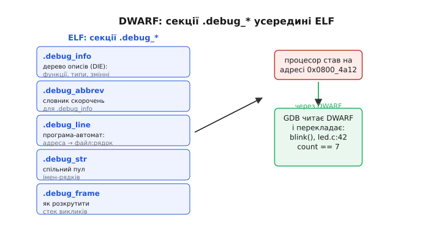

# 🔌 DWARF: як програма пам'ятає, звідки вона родом

Процесор виконує голі числа. Він не знає, що адреса `0x0800_4a12` — це рядок 42 у файлі `led.c`, усередині функції `blink()`, де саме зараз локальна змінна `count` дорівнює семи. Для нього це просто адреса, з якої треба взяти наступну інструкцію. Уся ця людська правда про програму — імена, рядки, типи, межі змінних — у самих машинних байтах **відсутня**: компілятор перемолов її на числа й адреси, бо чипу потрібні тільки вони.

І все ж, коли ви ставите точку зупину й зневаджувач спокійно каже «стоїмо в `blink()`, `led.c:42`, `count == 7`», хтось же цю правду пам'ятає. Пам'ятає її окремий, ретельно впорядкований пласт даних, що їде поряд із кодом в ELF-файлі, який зібрав [лінкер](topic:programming/linking) — **DWARF**. Це узагальнений, незалежний від виробника формат зневаджувальної інформації: той самий у тулчейні під ARM, під RISC-V, під Xtensa; той самий у GCC і в Clang. Саме тому про нього має сенс говорити як про **клас**, а не як про чиюсь окрему вигадку — жодних партномерів, жодних «версій від конкретного вендора», лише формат, який усі домовилися розуміти однаково.

Ця стаття — про те, **що** DWARF кодує, **як** улаштований, **як** його читає зневаджувач, щоб перекласти голу адресу на ім'я з рядком, і **чому** він роздуває `.elf` у рази, але не потрапляє в те, що заливають у чіп. І окремо — про найпідступніші граблі цілого класу: коли DWARF описує **не ту** програму, що крутиться в кремнії.

## Клас «формату»: словник між машиною і людиною

Щоб зрозуміти, навіщо потрібен окремий формат, згадаймо, що робить компілятор. Ви пишете `int count = 0;` у функції з іменем `blink`, у файлі `led.c`. Компілятор перетворює це на інструкції, що працюють із **регістром** або з **коміркою на стеку за певним зсувом**; ім'я `count`, назва функції, номер рядка йому для виконання **не потрібні** — і в машинний код він їх не кладе. Оптимізатор іде ще далі: він може тримати `count` то в одному регістрі, то в іншому, а на ділянці, де змінна не потрібна, — узагалі ніде. Готовий код — це потік чисел, з якого людську структуру вже не відновити.

Отут і виникає розрив, який треба чимось перекрити. З одного боку — **вихідний текст**, яким мислить людина: файли, рядки, функції, змінні, типи, вкладені області видимості. З іншого — **машинний образ**, яким живе процесор: адреси, регістри, зсуви на стеку. Зневаджувачу треба вміти ходити між цими світами в **обидва боки**: «на якій адресі починається рядок 42?» — і навпаки «процесор став на адресі 0x0800_4a12, який це рядок?». Компілятор — єдиний, хто в момент трансляції **бачив обидва світи одночасно**. Тому саме він, поки ще пам'ятає відповідність, записує її окремим пластом — це і є DWARF. Образно: DWARF — це **двомовний словник** між мовою людини й мовою машини, укладений тим, хто щойно робив переклад.

Назва, до речі, — жарт у пару до ELF. ELF означає «ельф», тож зневаджувальний формат, який їде всередині, назвали DWARF — «гном»; спочатку жодного офіційного розшифрування не було. Пізніше автор першої версії, Браян Расселл, дав акронім **«Debugging With Attributed Record Formats»** — «зневадження з форматами атрибутованих записів» (це офіційна позиція групи стандарту DWARF); ще пізніше в обіг увійшов жартівливий backronym «Debugging With Arbitrary Record Formats». Формат виріс із компілятора C та зневаджувача `sdb` в UNIX System V Release 4 наприкінці 1980-х і був задуманий пліч-о-пліч з ELF, хоч від конкретного формату об'єктного файлу не залежить — це усталений факт. Пізніші версії стандартизувала група розробників мов (PLSIG) при консорціумі Unix International.

> 🔧 **Навіщо це.** Коли ви вперше збираєте прошивку з прапорцем `-g` і бачите, що `.elf` раптом розпух із сотні кілобайтів до кількох сотень, — це у файл додався DWARF. А коли зневаджувач показує вам красивий стек із іменами замість голих адрес — він щойно прочитав цей самий DWARF. Розуміти, що це один і той самий пласт даних, — означає більше ніколи не дивуватися ні розміру `.elf`, ні тому, звідки зневаджувач знає імена, яких у чипі фізично немає.

## Блок-схема: сім'я секцій `.debug_*`

DWARF — це не одна суцільна брила, а **родина секцій** усередині ELF, кожна зі своїм іменем на `.debug_` і своєю роллю. Вони не дублюють одна одну — вони **доповнюються**: одна тримає дерево описів, друга — словник для його стиснення, третя — карту адрес на рядки, четверта — спільний склад імен. Розберімо головні, бо саме їхні імена ви побачите у звіті лінкера чи в дампі секцій.


*DWARF живе кількома секціями `.debug_*` усередині ELF. `.debug_info` тримає дерево описів (функції, типи, змінні), `.debug_abbrev` — словник скорочень до нього, `.debug_line` — карту «адреса → файл:рядок», `.debug_str` — спільний пул імен, `.debug_frame` — як розкрутити стек викликів. Зневаджувач читає їх усі разом, щоб перекласти голу адресу на ім'я, файл і рядок.*

- **`.debug_info`** — серце формату: **дерево описів** усього, що є в програмі. Кожен вузол цього дерева описує одну сутність — функцію, змінну, тип, область видимості. Це найтовстіша частина.
- **`.debug_abbrev`** — **словник скорочень** до `.debug_info`. Замість того щоб у кожному вузлі повторювати повний перелік «а тут буде ім'я, потім тип, потім адреса», DWARF один раз описує **шаблон** такого вузла в `.debug_abbrev`, а в `.debug_info` кладе лише короткий номер шаблону плюс самі значення. Без цього словника дерево описів було б у рази більшим.
- **`.debug_line`** — **карта відповідності** машинних адрес на позиції у вихідному коді: «інструкції з такої-то адреси — це рядок 42 файлу `led.c`». Улаштована вона хитро (про це нижче), але суть проста: за нею зневаджувач переводить адресу на `файл:рядок` і назад.
- **`.debug_str`** — **спільний склад рядків-імен**. Імена функцій і змінних повторюються, тож усі рядки складають в одне місце, а вузли дерева лише **показують** на потрібний рядок за зсувом. Класична економія на повторах.
- **`.debug_frame`** (споріднена з `.eh_frame`) — опис того, **як розкрутити стек**: де на стеку лежить адреса повернення, як відновити регістри попереднього кадру. Саме це дає зневаджувачу показати весь ланцюг викликів — хто кого викликав, — а не лише поточну функцію.

Головна думка, яку варто винести: **опис відокремлено від коду**. Машинний образ (`.text`) — самі інструкції; уся людська структура — поряд, у секціях `.debug_*`, і посилається на код лише через адреси. Це і робить DWARF зручним: код можна залити в чіп сам по собі, а опис лишити на комп'ютері — вони зв'язані тільки адресами, а не переплетені фізично.

## Типова «розпіновка»: що саме кодує DWARF

Якщо в звичайного компонента розпіновка — це «який вивід за що відповідає», то в DWARF роль розпіновки грає **набір сутностей, які він уміє описати**. Їх, по суті, чотири родини, і кожна відповідає на своє питання зневаджувача.

**Перше — відповідність адреса ↔ рядок.** Це найбазовіше: без неї точки зупину «на рядку 42» просто нема куди поставити. Тут криється несподіванка. Наївно карту адрес на рядки можна було б зберігати як величезну таблицю «адреса — рядок» на кожну інструкцію, але таких пар — десятки тисяч, і таблиця вийшла б неприпустимо товстою. Тому DWARF зберігає її не таблицею, а **програмою для крихітного автомата** (*line number program* — програма номерів рядків). Це послідовність однобайтових команд на кшталт «просунь адресу на 4 байти», «збільш номер рядка на 1», «а тепер видай рядок таблиці». Зневаджувач цю програму **виконує** — і вона **розгортається** в повну таблицю відповідностей. Виходить, замість тисяч рядків таблиці у файлі лежить компактний сценарій, який цю таблицю відтворює. Це той самий трюк, що й з `.bss` в ELF: не вези готове роздуте — вези рецепт, як його отримати.


*Дві головні речі, які кодує DWARF. Ліворуч — дерево описів (DIE): модуль містить функцію, функція — свої змінні, їхні типи й вкладені області видимості; кожен вузол це тег плюс атрибути. Праворуч — карта «адреса ↔ рядок»: її не зберігають готовою таблицею, а відтворюють, виконуючи компактну програму-автомат. Разом вони дають зневаджувачу і «де я в коді», і «що це за змінна».*

**Друге — опис типів і структур.** Щоб показати вам змінну по-людськи, замало знати, де вона лежить, — треба знати, **що вона таке**. `count` — це `int` на 4 байти зі знаком? `led` — це `struct` із трьох полів, і поле `pin` лежить за зсувом 4 від початку? Указівник на `char`? DWARF описує кожен тип: розмір, знаковість, поля структур та їхні зсуви, елементи перерахувань, на що вказує вказівник. Без цього зневаджувач бачив би за адресою змінної лише голі байти й не знав би, як їх показати — числом, символом, полями структури.

**Третє — розташування локальних змінних.** Глобальна змінна живе за сталою адресою — просто. А локальна? Вона то в регістрі, то на стеку за зсувом від його вершини, а після оптимізації — узагалі щоразу деінде. Тому DWARF описує розташування не одним числом, а **виразом** (*location expression* — вираз розташування): маленькою формулою на кшталт «візьми поточний покажчик кадру, відніми 8» або «змінна зараз у регістрі R3». Ба більше — таких виразів може бути **кілька на різні ділянки коду**: на початку функції змінна ще в регістрі, далі її виштовхнули на стек — і DWARF чесно каже, де саме вона на кожній адресі. Це те, що дає зневаджувачу показувати правильне значення локальної змінної навіть в оптимізованому коді (наскільки оптимізатор узагалі лишив її живою).

**Четверте — дерево областей видимості.** Програма вкладена: модуль містить функції, функція містить блоки `{ }`, блок може містити свої локальні змінні, які видно лише в ньому. DWARF повторює цю вкладеність **деревом**. Вузол функції має дітьми свої змінні й параметри; блок `{ }` — свій під-вузол зі своїми змінними. Саме тому зневаджувач знає, що на рядку 42 змінна `i` з циклу вже не існує, а `count` — існує: він дивиться, у якій області ви зараз, і показує лише те, що в ній видно.

Кожен вузол цього дерева зветься **DIE** (*Debugging Information Entry* — запис зневаджувальної інформації). Улаштований він однаково просто: **тег** (що це — `DW_TAG_subprogram` для функції, `DW_TAG_variable` для змінної, `DW_TAG_base_type` для типу) плюс набір **атрибутів** — пар «ключ — значення» (`DW_AT_name` — ім'я, `DW_AT_type` — посилання на DIE типу, `DW_AT_low_pc` — початкова адреса функції, `DW_AT_location` — вираз розташування). Атрибути можуть **посилатися на інші DIE**: у змінної атрибут «тип» показує на DIE відповідного типу, тож один опис типу `int` обслуговує всі змінні цього типу. Виходить компактне дерево з перехресними зв'язками, де нічого не дублюється двічі.

> 🔧 **Навіщо це.** Ці чотири родини — рівно те, що ви щодня бачите в зневаджувачі, не думаючи про механізм. Навели курсор на змінну й побачили її значення розкладеним по полях структури — спрацював опис типів. Стали на рядку й дивитеся локальні — спрацювали вирази розташування й дерево областей. Побачили повний стек викликів — спрацювали `.debug_frame` і дерево функцій. Коли щось із цього «бреше» (значення дивне, поля не ті, змінна «optimized out»), ви тепер знаєте, **яка саме** частина DWARF за це відповідає й де копати.

## Підключення: як зневаджувач перекладає адресу

Тепер збережімо все в русі — простежмо, що робить зневаджувач (візьмімо **GDB**, найпоширеніший), коли процесор зупинився на адресі й треба показати це людині. Це і є «підключення» DWARF: як його читають.

Процесор став на адресі `0x0800_4a12` — скажімо, ви натиснули «пауза» або спрацювала точка зупину. GDB бере цю адресу й іде до DWARF з двома різними питаннями.

Спершу — **де я в коді?** GDB виконує програму-автомат із `.debug_line`, розгортає карту «адреса → рядок» і знаходить: адреса `0x0800_4a12` лежить у діапазоні, помаченому як `led.c`, рядок 42. Уже добре — є файл і рядок.

Далі — **у якій я функції?** GDB шукає в дереві `.debug_info` вузол `DW_TAG_subprogram`, чий діапазон адрес (`DW_AT_low_pc … DW_AT_high_pc`) накриває нашу адресу. Знаходить DIE функції з атрибутом `DW_AT_name = "blink"`. Тепер відомо: ми в `blink()`, `led.c:42`.

Потім — **що тут за змінні?** GDB спускається по дітях цього DIE: параметри й локальні змінні. Для кожної бере атрибут `DW_AT_location` — вираз розташування — і **обчислює** його для поточного стану: «`count` зараз за зсувом −8 від покажчика кадру». Читає з тієї адреси (через налагоджувальний зонд у чипі) чотири байти. Але як їх показати? Дивиться `DW_AT_type` змінної, іде по посиланню до DIE типу — `int`, 4 байти, зі знаком — і форматує байти як знакове ціле. Виходить `count == 7`.

І, якщо треба, — **хто мене викликав?** GDB бере `.debug_frame`, дізнається, де на стеку лежить адреса повернення, читає її, і для **тієї** адреси повторює весь цикл спочатку: файл, рядок, функція. Так вибудовується повний стек викликів угору до `main`.

Отже, готова відповідь «`blink()`, `led.c:42`, `count == 7`» — це не одне звертання, а **кілька перехресних читань** різних секцій DWARF, зшитих навколо однієї адреси. Чіп не бере в цьому жодної участі: він лише слухняно віддає байти з регістрів і пам'яті за адресами, які GDB вирахував із DWARF. Уся розкіш «людського» вигляду народжується **на комп'ютері**, зі статичного опису, укладеного компілятором.

**Приклад: та сама зупинка очима чипа й очима зневаджувача.** Уявімо код і те, що з ним стало:

```c
void blink(void) {
    static int count = 0;   // led.c:41
    count++;                // led.c:42  ← стоїмо тут, count щойно став 7
    gpio_toggle(led_pin);   // led.c:43
}
```

```
Що знає ЧІП               Що дістає GDB із DWARF
──────────────────        ──────────────────────────────────
PC = 0x0800_4a12          .debug_line:  0x0800_4a12 → led.c:42
регістр/пам'ять: 7        .debug_info:  адреса в межах blink() (DW_TAG_subprogram)
байти: 07 00 00 00        DW_AT_location(count) → адреса; DW_AT_type → int (4 б, знак)
                          підсумок:  blink(), led.c:42, count == 7
```

Ліва колонка — уся правда, доступна кремнію. Права — та сама зупинка, перекладена людською мовою через DWARF. Різниця між ними і є цінність формату.

## «Перший байт»: що читають найперше

Як будь-який самоописний формат, DWARF починають читати не з середини, а з **шапки одиниці компіляції** (*compilation unit* — те, що вийшло з одного вихідного файлу). На початку `.debug_info` для кожної такої одиниці лежить короткий заголовок: **яка версія DWARF** (2, 3, 4 чи 5 — від неї залежить, як розбирати далі), **який розмір адреси** (4 байти для 32-бітного чипа, 8 — для 64-бітного) і **де шукати словник скорочень** — зсув у `.debug_abbrev`. Це і є «перший байт» DWARF: перш ніж читати описи, зневаджувач з'ясовує правила гри для цієї одиниці.

Далі читання йде **через словник**. Перший запис у `.debug_info` — це номер шаблону з `.debug_abbrev`; зневаджувач бере за цим номером шаблон («тут буде тег `subprogram`, потім атрибути: ім'я-рядок, low_pc, high_pc») і за шаблоном розбирає наступні байти як значення. Без словника ці байти — беззмістовний потік чисел; шаблон надає їм структуру. Тому `.debug_abbrev` і `.debug_info` **нероздільні**: одне без одного не читається.

Практичний бік: коли інструмент на кшталт `readelf --debug-dump` чи `objdump --dwarf` показує вам DWARF, він робить рівно це — читає заголовок одиниці, підтягує словник, розгортає дерево DIE в читабельний вигляд. А коли зневаджувач раптом каже «unsupported DWARF version» — він щойно прочитав оту першу шапку й побачив версію, старшу за ту, яку розуміє. Тобто найперше, на що дивиться будь-який читач DWARF, — це версія й розмір адреси; усе інше залежить від них.

## Чому DWARF роздуває `.elf`, але не летить у чіп

Тепер стає зрозуміло, звідки береться разюча різниця в розмірах, яку помічає кожен вбудований розробник. Опис програми **докладніший за саму програму**. Щоб описати одну функцію на кілька машинних інструкцій, DWARF везе її ім'я, діапазон адрес, тип повернення, кожен параметр із типом і розташуванням, кожну локальну змінну, вкладені області, карту адрес на рядки для кожної інструкції. Типи описуються повністю — з полями й зсувами. Імена файлів, назви змінних, назви типів — це все текст. У підсумку `.debug_*` часто **більший за весь інший ELF разом узятий**: код на десятки кілобайтів легко тягне за собою сотні кілобайтів DWARF.

Проілюструймо на знайомій розкладці ELF-файлу:

```
firmware.elf (зібрано з -g):  ~420 КБ
  ├─ .text          18 КБ    ← код              } це летить
  ├─ .rodata         2 КБ    ← сталі            } у .bin
  ├─ .data           1 КБ    ← початкові дані   }
  ├─ .symtab        30 КБ    ← імена символів    ⟶ у чіп НЕ йде
  └─ .debug_*      360 КБ    ← DWARF             ⟶ у чіп НЕ йде

firmware.bin (те, що заллють у Flash):  ~21 КБ
```

Виходить, DWARF — це ті самі 360 із 420 кілобайтів, тобто **майже весь розмір файлу**. Але чіп не вміє й не потребує читати ELF: [апаратура-завантажувач](topic:programming/bootloader) просто бере байти коду з Flash за фіксованою адресою й виконує їх. Для неї заголовки, дерева DIE, карти рядків — не лише зайвина, а й шкода: у крихітній Flash мікроконтролера немає місця під сотні кілобайтів опису, який чіпу ні для чого.

Тому останній крок збірки **зрізає** все службове. Інструмент `objcopy` бере ELF, лишає тільки вміст завантажуваних секцій (`.text`, `.rodata`, `.data`) і зливає їх у [голий образ](topic:programming/firmware-image) — `.bin` чи `.hex`, суцільну стрічку байтів, точно таку, якою вона має лягти у Flash. DWARF при цьому **відкидається цілком** — жоден його байт у чіп не потрапляє.

```
arm-none-eabi-objcopy -O binary firmware.elf firmware.bin
```

І це не втрата, а розумний розподіл: **важке лишається там, де потрібне**. DWARF потрібен зневаджувачу на комп'ютері — там і лишається, у `.elf`. У чіп їде худа витяжка — самі байти. Той самий образ можна залити й зневаджувати без жодного DWARF у кремнії, бо зневаджувач тримає DWARF **у себе** й лише зіставляє його з адресами, на яких зупинився чіп. Худий `.bin` у Flash, товстий `.elf` поряд на диску як ключ до розуміння — ось чому обидва існують.

> 🔧 **Навіщо це.** Звідси кілька щоденних правил. Не лякайтеся розміру `.elf`: 420 КБ файлу не означають 420 КБ у чипі — справжню зайнятість Flash показує `.bin` або суми за секціями `.text`/`.rodata`/`.data`, а не роздутий DWARF. Хочете **менший** `.elf` (наприклад, щоб швидше передавати) — збирайте без `-g` або зріжте DWARF окремою командою (`strip`), але тоді втратите змогу зневаджувати з іменами. І пам'ятайте: `-g` впливає **лише** на `.elf`; на розмір і швидкість самої прошивки в чипі він не впливає нічим, бо в чіп не потрапляє. Тож тримати `-g` увімкненим для збірок, які ви налагоджуєте, — безкоштовно з погляду чипа.

## Типові граблі класу

Оскільки DWARF живе **окремо** від коду й лише посилається на нього адресами, весь клас проблем зводиться до одного кореня: **опис перестав відповідати тому, що виконується**. Адреси в DWARF показують у порожнечу — або, гірше, не туди.

- **Розсинхрон `.elf` і залитого образу — головні граблі всього класу.** Ви перезібрали прошивку, залили свіжий `.bin` у чіп, а зневаджувачу підсунули **старий** `.elf` (з попередньої збірки чи з іншої гілки). DWARF у старому `.elf` каже «функція `blink` починається на `0x0800_4a00`», але у свіжому образі код зсунувся, і на цій адресі тепер зовсім інше. Наслідок найпідступніший: помилки нема, зневаджувач бадьоро показує імена й рядки — **тільки неправильні**. Ви стоїте нібито в `blink()`, а процесор насправді в іншій функції; значення змінних — сміття, бо читаються не звідти. Правило залізне: `.elf` для зневадження **мусить бути з тієї самої збірки**, що й залитий образ. Найнадійніше — заливати чіп **із того самого** `.elf` (зневаджувач сам зріже непотрібне), щоб опис і код фізично походили з одного акту компіляції.

- **Зневадження без DWARF — самі адреси.** Зібрали **без** `-g` (або пропустили `.elf` через `strip`) — і зневаджувач раптом показує голі адреси `0x0800_4a12` та імена на кшталт `??` замість `led.c:42`. Нічого не зламалося: DWARF просто нема, перекладати ні з чого. Ліки — зібрати з `-g` і мати цей `.elf` під рукою.

- **Оптимізований код і «optimized out».** Зібрали з оптимізацією (`-O2`) — і зневаджувач на цілком реальну змінну каже «value optimized out» або показує дивне число, а точка зупину «перестрибує» рядки. Це не баг DWARF: оптимізатор **справді** прибрав змінну (тримав у регістрі, який уже перезаписав) або переплів рядки так, що інструкції одного рядка розкидані. DWARF чесно це описує (кількома виразами розташування на різні ділянки), але фізично показати те, чого в цю мить у кремнії немає, зневаджувач не може. Для тонкого налагодження часто збирають окрему конфігурацію з меншою оптимізацією.

- **Неповний DWARF від сторонньої бібліотеки.** Свій код зневаджується гарно, а щойно зайшли в чужу бібліотеку — знову голі адреси. Причина та сама: **ту** бібліотеку зібрали без `-g`, DWARF на неї немає. Тут або брати збірку бібліотеки з відлагоджувальною інформацією, або миритися з тим, що всередині неї видно лише адреси.

- **Версія DWARF, старша за зневаджувач.** Новий компілятор за замовчуванням генерує свіжу версію DWARF (наприклад, 5), а старий зневаджувач розуміє щонайбільше 4 — і спотикається («unsupported DWARF version») або читає частково. Ліки — узгодити інструменти: оновити зневаджувач або попросити компілятор видавати старішу версію (`-gdwarf-4`).

Спільна порада для всього класу проста: якщо зневаджувач показує **дивне** — імена не ті, рядки стрибають, змінні порожні — першою підозрою має бути не містика, а **невідповідність DWARF і того, що крутиться в чипі**. Найчастіше — старий `.elf`.

## Варіації класу: версії й різновиди

DWARF розвивався, і на практиці ви стрічаєте кілька його версій. Ключові віхи (усталені дати): **DWARF 2** — початок 1990-х, перша широко вживана; **DWARF 3** — січень 2006-го (додав, зокрема, простори імен C++); **DWARF 4** — 2010-й (краще стиснення, підтримка оптимізованого коду); **DWARF 5** — лютий 2017-го (компактніше, швидший пошук, упорядкованіші секції). Різні тулчейни за замовчуванням генерують різні версії, і саме тут коріниться згадана несумісність «новий компілятор ↔ старий зневаджувач». Практично версію задають прапорцем `-gdwarf-<номер>`, коли треба погодити інструменти.

Є й **структурні варіації** того самого формату. Щоб `.elf` не розпухав так сильно, застосовують **розділений DWARF** (*split DWARF*): важкі описи виносять із `.elf` в окремий файл `.dwo`/`.dwp`, а в самому `.elf` лишають тонке посилання на них. Це пришвидшує лінкування й зменшує основний файл, але вимагає, щоб винесений файл був поряд під час зневадження. Окрема секція `.debug_frame` у світі, де є винятки, часто дублюється як `.eh_frame` — та сама ідея «як розкрутити стек», але доступна й під час виконання програми, а не лише зневаджувачу.

Варто тримати в голові й **межу класу**. DWARF — це формат зневаджувальної інформації, і він **не єдиний** у світі, просто панівний скрізь, де живе ELF (Linux, більшість вбудованих тулчейнів під ARM, RISC-V, Xtensa). У світі Windows ту саму роль грають цілком інші формати (PDB та їхня рідня) — принцип «окремий пласт опису поряд із кодом» той самий, а конкретне кодування інше. Але щойно ваш тулчейн видає ELF, зневаджувальна інформація в ньому — це майже напевно DWARF, і поводиться вона однаково незалежно від виробника чипа й від того, GCC у вас чи Clang. Саме ця однаковість і робить DWARF **класом**, про який має сенс говорити узагальнено: один формат, один спосіб читати, одні й ті самі граблі — від сервера до найдрібнішого мікроконтролера.
