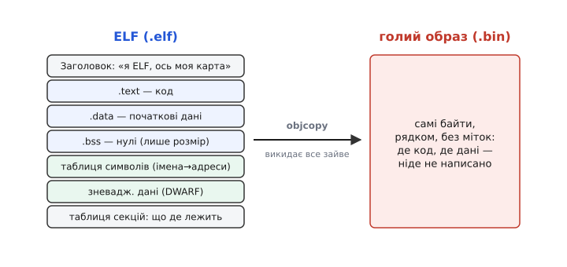
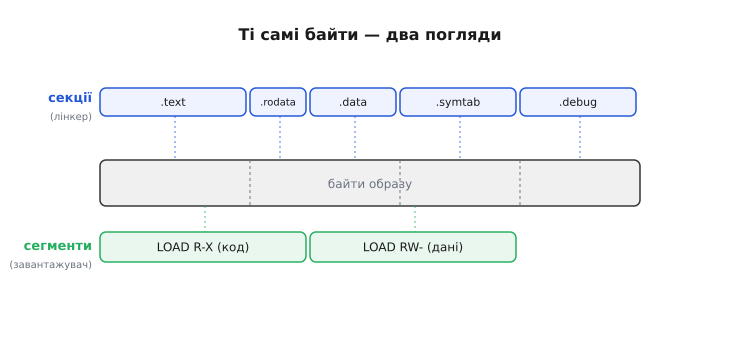
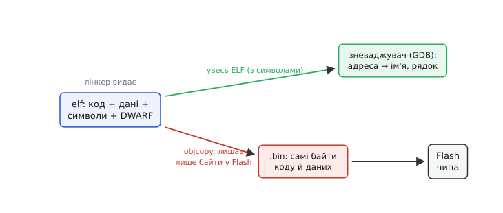

# ELF-формат прошивки: контейнер, у якому програма знає сама себе

Коли [лінкер](book:programming/linking) дозшивав усі об'єктні файли в одну програму, він не викидає результат абияк — він кладе його в акуратно впорядкований **контейнер**. На настільних системах і в переважній більшості вбудованих тулчейнів цей контейнер зветься **ELF** (*Executable and Linkable Format* — «формат виконуваного й придатного до лінкування»). Файл, який ваш компілятор урешті створює, — `firmware.elf` — це не просто «купа машинного коду». Це коробка з полицями, де на кожній полиці лежить свій сорт речей, а на кришці — опис, що на якій полиці і за якою адресою має опинитися.

І тут одразу постає питання, від якого варто танцювати: **навіщо взагалі коробка?** Чому не взяти самі байти коду й не залити прямо в чіп? Адже мікроконтролер виконує голі числа — йому ELF ні до чого. Відповідь у тому, що байти коду — це ще не вся правда про програму. Разом із кодом треба знати десяток речей, яких у самих байтах немає: де цей код має жити в пам'яті, які змінні треба обнулити перед стартом, як звати кожну функцію (щоб зневаджувач показав вам зрозумілий стек, а не голі адреси), звідки взяти початкові значення для змінних. Усе це — **службова інформація про програму**, і саме її ELF везе поряд із кодом. Голі байти для чипа народяться з ELF пізніше; сам же ELF існує, щоб усі інструменти збірки й зневадження говорили однією мовою про одну програму.


*ELF везе не лише код, а й усе, що про нього треба знати: де що лежить, як зветься, які нулі приготувати. Голий образ (`.bin`) — те саме, але зведене до самих байтів: жодних міток, де починається код і де дані. Перетворення з лівого на праве робить `objcopy`.*

## Магічні перші байти: файл, що називає себе сам

Розкрийте будь-який ELF шістнадцятковим переглядачем — і перші чотири байти завжди ті самі: `7F 45 4C 46`. Байт `0x7F`, а далі — коди літер `E`, `L`, `F` (це усталений факт: перевіряється прямо в специфікації формату). Ці чотири байти звуть **магічним числом** (*magic number* — умовна сигнатура на початку файлу). Сенс їх простий і корисний: будь-яка програма, узявши файл, за перші ж байти впізнає — «це ELF» — ще не читаючи ані рядка далі. Так формат **називає себе сам**, і жоден інструмент не сплутає ELF із чимось іншим.

Одразу за магічним числом іде решта **заголовка ELF** — коротка «шапка», що відповідає на найперші питання про файл: це 32- чи 64-бітна програма; для якого процесора вона (ARM, RISC-V, Xtensa…); з якої адреси починати виконання (**точка входу**); і — найважливіше для нас — де у файлі шукати **опис полиць**. Заголовок не містить коду; він містить **карту**, як цей файл читати. Це та сама кришка коробки: перш ніж лізти по вміст, ви читаєте етикетку.

> 🔧 **Навіщо це.** Коли складальний скрипт чи прошивач раптом каже «not an ELF file» або «wrong architecture» — він щойно прочитав ці перші байти й заголовок. Перше означає, що ви підсунули йому не той файл (може, `.bin` там, де чекали `.elf`, або навпаки). Друге — що ELF зібрано під **інший** процесор (класика: узяли тулчейн під ARM, а чіп у вас Xtensa). Тобто найбезглуздіші на позір помилки збірки — це просто чесна відповідь заголовка про те, що всередині.

## Секції: полиці, розкладені за сортом

Головна ідея ELF — **секції** (*section* — «розділ», «відділ»): вміст файлу поділено на іменовані ділянки, кожна зі своїм сортом даних. Це та сама розкладка, яку почав [лінкер](book:programming/linking), зводячи однорідне докупи; ELF лише закріплює її в файлі під сталими іменами. Кілька секцій ви зустрічатимете постійно:

- **`.text`** — сам **код**, машинні інструкції ваших функцій. (Назва історична: у давніх форматах код звали «text».) Це те, що виконує процесор.
- **`.data`** — **початкові значення** змінних, яким ви задали не нуль: `int speed = 100;`. Ці числа мусять десь фізично лежати, щоб на старті їх було звідки взяти.
- **`.rodata`** — дані **тільки для читання** (*read-only data*): рядкові сталі на кшталт `"OK\n"`, таблиці констант. Їх ніхто не змінює, тож у чипі вони можуть спокійно лишатися у Flash.
- **`.bss`** — змінні, які на старті мають бути **нулем** (`int counter;` без значення). Ось де ховається краса формату: `.bss` **не займає місця у файлі**. Навіщо зберігати мегабайт нулів, якщо досить одного рядка «тут стільки-то нулів — обнули їх сам»? ELF так і робить: для `.bss` він везе лише **розмір**, а не самі нулі.
- **Таблиця символів** (`.symtab`) — список **імен**: яка функція чи змінна за якою адресою. Це та сама відомість символів, з якою працював лінкер, тільки тепер зведена для всієї програми.
- **Зневаджувальні дані** (секції `.debug_*`) — товстий шар інформації для покрокового зневадження у форматі [DWARF](book:programming/elf-format/comp-dwarf.md): який рядок вихідного коду відповідає якій адресі, як улаштована кожна структура, де лежить кожна локальна змінна. Саме завдяки їй зневаджувач показує вам `main.c:42`, а не «адреса 0x400d1a20».

А **де записано, які секції є в файлі та скільки кожна важить?** У окремій **таблиці секцій** — тому самому «змісті», на який показував заголовок. Кожен її рядок описує одну секцію: ім'я, розмір, зсув у файлі, за якою адресою в пам'яті чипа їй жити. Читаючи цю таблицю, будь-який інструмент дістає повну карту файлу, не вгадуючи нічого.

> 🔧 **Навіщо це.** Цей поділ на секції — не абстракція, а прямі гроші у вашому бюджеті пам'яті чипа. `.text` і `.rodata` осядуть у Flash (їх багато, і вони не міняються). `.data` цікава подвійно: її початкові значення лежать у Flash, але працює вона з RAM — тому [стартовий код копіює `.data` з Flash у RAM](book:programming/firmware-image) перед `main`. А `.bss` місця у Flash не займає зовсім, лише отримує шмат RAM, який стартовий код обнуляє. Коли ви дивитесь у звіт складальника «скільки Flash і скільки RAM зайнято» — ви читаєте саме суми за цими секціями. Роздута `.bss` не з'їдає Flash, зате може переповнити RAM; величезна `.rodata` навпаки тисне на Flash. Знаючи, що є що, ви розумієте, куди дивитись, коли «не влазить».

## Два погляди на ті самі байти

Тут криється тонкість, від якої залежить розуміння всього формату. У повній назві невипадково стоять два слова — **Executable** і **Linkable**: той самий файл живе в двох ролях, і ELF навмисне дає на ті самі байти **два різні погляди**.

Перший погляд — **для лінкування**: розкладка на **секції**, які ми щойно перебрали. Дрібні, точно окреслені шматки (`.text`, `.data`, `.symtab`…), кожен зі своїм іменем. Такий погляд потрібен інструментам, що **збирають і аналізують** програму: лінкеру, коли він доклеює ще один об'єктний файл; зневаджувачу, коли він шукає, де лежить змінна.

Другий погляд — **для виконання**: та сама пам'ять, але згорнута в кілька великих **сегментів** (*segment* — «відрізок»), кожен зі своїми **правами доступу**. Тут дрібні секції злипаються за спорідненістю: увесь код (`.text` + `.rodata`) — в один сегмент «читати й виконувати, писати не можна» (позначають `R-X`); усі змінювані дані (`.data` + `.bss`) — в інший, «читати й писати» (`RW-`). Опис цих сегментів зветься **таблицею програмних заголовків** (*program headers*), і вона відповідає на єдине питання: **як розкласти цю програму по пам'яті, щоб запустити**. Дрібні імена секцій завантажувачу вже байдужі — йому важать великі шматки та їхні права.


*Байти образу одні й ті самі — різняться лише погляди на них. Лінкеру потрібні дрібні іменовані секції (згори): де код, де символи, де зневаджувальні дані. Завантажувачу потрібні великі сегменти з правами (знизу): що куди покласти й що там можна робити. ELF везе обидва описи разом, тож кожен інструмент бере свій.*

Чому це важить саме для прошивки? Бо на «великому» комп'ютері з операційною системою по цих сегментах працює завантажувач ОС: він відображає код у пам'ять «тільки для виконання», дані — «для читання-запису», і апаратура ловить спробу, скажімо, писати в код. У мікроконтролера ж завантажувача ОС здебільшого немає — [код часто виконується прямо з Flash](book:programming/microcontroller), а розкладку задає стартовий код і сценарій лінкування. Тому для голої прошивки погляд «сегменти-права» майже завжди зайвий, а от погляд «секції» — навпаки, потрібен інструментам збірки постійно. Оце й підводить до головного: у чіп їде не ELF.

## Від ELF до голих байтів: що справді летить у чіп

Мікроконтролер не вміє читати ELF. У момент запуску він не має ні коду, ні часу розбирати таблиці секцій — [апаратура-завантажувач у ПЗП](book:programming/bootloader) просто бере байти з Flash за фіксованою адресою й починає їх виконувати. Отже, для самого чипа вся службова обгортка ELF — заголовки, таблиці, імена символів, товстий DWARF — не лише зайва, а й шкідлива: це десятки й сотні кілобайтів, яким у крихітній Flash не місце.

Тому останній крок збірки — **витягти з ELF самі байти коду й даних**, викинувши все службове. Робить це інструмент **`objcopy`** (від *object copy* — «копіювання об'єктного вмісту») з набору binutils. Він бере ELF, лишає тільки вміст «завантажуваних» секцій (`.text`, `.rodata`, `.data`) і зливає їх у **голий образ** — звичайно з розширенням `.bin`: суцільну стрічку байтів, точно таку, якою вона має лягти у Flash. Жодних заголовків, жодних імен — самі числа. Оце й є те, що прошивач заллє в чіп.

**Типова команда збірки, що народжує образ для заливання з ELF:**

```
arm-none-eabi-objcopy -O binary firmware.elf firmware.bin
```

```
Було  firmware.elf : 420 КБ
       ├─ .text            18 КБ   ← код            } летить
       ├─ .rodata           2 КБ   ← сталі          } у .bin
       ├─ .data             1 КБ   ← початк. дані    }
       ├─ .bss    (лише розмір: 4 КБ RAM)  ← у файл НЕ йде
       ├─ .symtab          30 КБ   ← імена           ⟶ відкинуто
       └─ .debug_*        360 КБ   ← DWARF           ⟶ відкинуто

Стало firmware.bin :  21 КБ  ← самі байти коду й даних, як лягти у Flash
```

Різниця в розмірах промовиста: `.elf` на 420 КБ і `.bin` на 21 КБ — це той самий код, лише з нього злущено всю обгортку. Величезний DWARF (`.debug_*`) роздуває ELF у рази, але у чіп не потрапляє й байтом. І це не втрата, а розумний розподіл праці: **важкі відомості лишаються там, де потрібні** — у `.elf` на вашому комп'ютері, для зневаджувача.

Саме тут ясніє, **чому ELF не викидають** після збірки, хоч у чіп їде `.bin`. Коли ви ставите точку зупину й зневаджувач показує «зупинилися в `blink()`, файл `led.c`, рядок 42, змінна `count == 7`» — цю розкіш дає **не чіп**. Чіп знає лише голі адреси. Ім'я `blink`, прив'язку до рядка `led.c:42`, розташування `count` — усе це зневаджувач читає з `.elf`, зіставляючи адресу, на якій став процесор, із таблицею символів і DWARF. Тому в прошивку летить худий `.bin`, а товстий `.elf` лишається поряд як «ключ до розуміння» тих самих байтів.


*Один ELF — дві долі. Угору, до зневаджувача, іде весь файл із символами й DWARF: саме він перекладає голу адресу на ім'я функції та рядок коду. Униз, через `objcopy`, лишаються самі байти коду й даних — худий `.bin`, який заливають у Flash. Товсте лишається на комп'ютері, тонке — у чипі.*

> 🔧 **Навіщо це.** Звідси кілька щоденних правил. Заливаєте у чіп — беріть `.bin` (або `.hex`, [той самий вміст в іншій обгортці](book:programming/firmware-image)), не `.elf`. Хочете покроково зневаджувати — тримайте `.elf` під рукою й **не переплутайте версію**: якщо зневаджувач бачить `.elf` не від тієї збірки, що залита в чіп, він показуватиме неправдиві імена й рядки — адреси не збіжаться. І ще: не лякайтеся розміру `.elf` — 400 КБ файлу не означають 400 КБ у чипі; подивіться розмір `.bin` або суми за секціями `.text`/`.data`, щоб знати справжню зайнятість Flash. Розмір ELF роздуває зневаджувальний баласт, який до чипа не доходить.

## Чому саме такий формат

ELF не завжди був. У ранньому UNIX програми возив простіший формат `a.out`, згодом — складніший COFF; обидва тіснали розробників, коли настала пора спільних бібліотек і різних процесорів. ELF створили в Unix System Laboratories наприкінці 1980-х для системи System V Release 4, а 1993-го його підхопив галузевий комітет TIS і зробив спільним стандартом (це усталений факт; докладніше — у [нарисі про походження ELF](book:programming/elf-format/hist-elf-origin.md)). Відтоді той самий формат прижився скрізь — від серверів Linux до крихітних мікроконтролерів — саме тому, що з першого дня закладав дві потрібні речі: **гнучкість** (довільний набір іменованих секцій — додавай які треба, старі інструменти не ламаються) і **незалежність від процесора** (заголовок сам каже, під яке ядро зібрано код).

Оце й пояснює, чому ELF стоїть на роздоріжжі всієї збірки прошивки. Він — **спільна мова** інструментів: компілятор породжує ELF-об'єктні файли, лінкер зшиває їх в один ELF, зневаджувач читає з ELF імена й рядки, а `objcopy` витягує з ELF голі байти для чипа. Формат навмисне везе більше, ніж треба чипу, — бо його читає не лише чіп. У чіп поїде тонка витяжка; сам же ELF лишається повним описом програми, у якому вона **знає сама себе**: де кожен її шматок, як його звати і що з ним робити.

---
