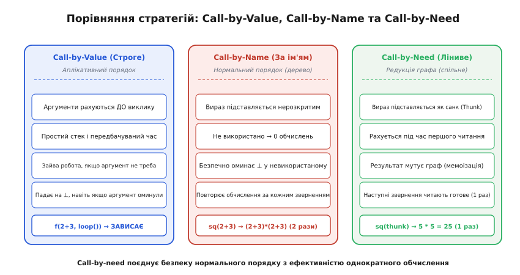
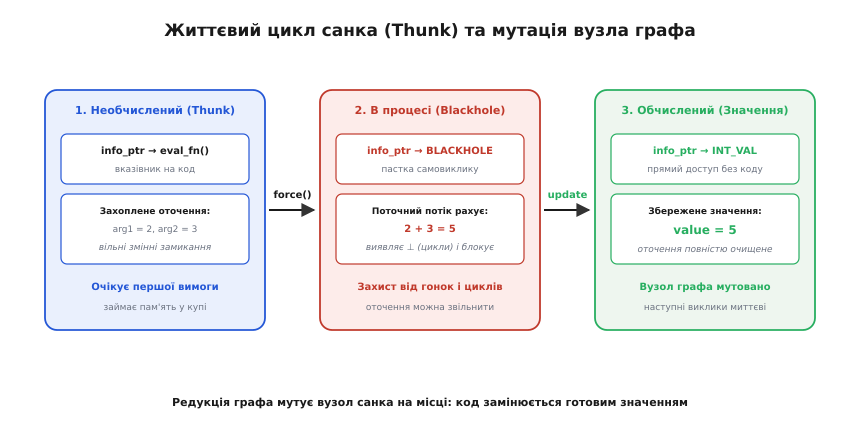
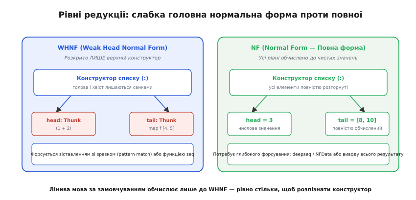
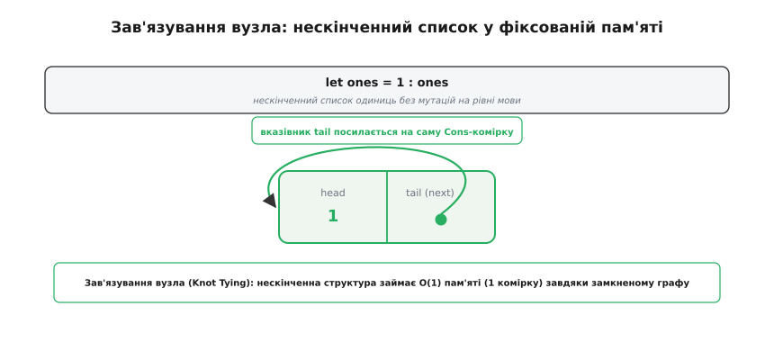
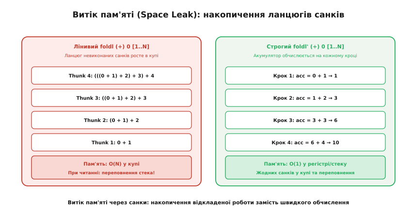

# Ліниве обчислення: виконання за вимогою, санки та редукція графів

<preknowlist>
- [Чисті функції і побічні ефекти](topic:programming/pure-functions-side-effects) — чому відсутність прихованих мутацій дає право відкладати й кешувати обчислення.
- [Купа](topic:programming/heap-dynamic-memory) — динамічна пам'ять, виділення вузлів і замикань під час виконання.
- [Функції як значення першого класу](topic:programming/first-class-functions) — замикання, захоплення оточення й передавання обчислень як даних.
- [Мемоізація](topic:algorithms/memoization) — збереження одного разу порахованого результату для уникнення повторної роботи.
</preknowlist>

Ви пишете вираз `take(5, map(expensive_calc, filter(is_prime, naturals())))`, де `naturals()` породжує нескінченний ряд натуральних чисел `[1, 2, 3, ...]`. У звичній мові зі строгим обчисленням ця програма не завершиться ніколи: `naturals()` спробує виділити нескінченну пам'ять на купі, `filter` зависне на нескінченному списку, а до виклику `take` черга взагалі не дійде. Але в системі з **лінивим обчисленням** (англ. *lazy evaluation*) той самий вираз виконується за частку мілісекунди: обчислюються рівно перші п'ять простих чисел, для кожного з них один раз викликається `expensive_calc`, а решта нескінченного ряду навіть не торкається процесора.

Різниця тут не в синтаксисі й не в магії оптимізатора. Вона полягає у фундаментальній інверсії керування обчисленнями. У строгій (жадібній) моделі обчислення штовхає **виробник даних** (push-модель): вираз обчислюється тоді, коли його створено в коді. У лінивій моделі обчислення притягує **споживач результату** (pull-модель): жодна операція не виконується доти, доки зовнішньому світу або іншій функції не знадобиться конкретне значення. Це перетворює програми з жорсткої послідовності кроків на мережу відкладених обіцянок.

> 🔧 **Навіщо це.** Ліниве обчислення дозволяє остаточно відокремити **генерацію даних від контролю завершення**. Ви можете описати генератор усіх можливих ходів шахової гри чи нескінченний потік фізичних вимірювань як окремий чистий модуль, а алгоритм пошуку або фільтрації візьме рівно стільки, скільки потрібно для поточної задачі, не турбуючись про вихід за межі пам'яті чи завчасне переривання циклів.

### Стратегії обчислення: Call-by-Value, Call-by-Name та Call-by-Need

Щоб зрозуміти внутрішній устрій лінивості, розіб'ємо процес виклику функції на базові механічні альтернативи. Коли функція `f(a, b)` отримує аргументи, рантайм мусить вирішити, коли саме перетворювати сирі вирази аргументів на підсумкові значення.

Перший підхід — **виклик за значенням** (англ. *Call-by-Value*, або аплікативний порядок редукції). Це стандартна модель C, C++, Rust, Go, Python і Java. Усі аргументи повністю обчислюються **до входу в тіло функції**. Якщо ми передаємо `f(2 + 3, heavy_computation())`, рантайм спершу додасть `2 + 3` і отримає `5`, потім запустить `heavy_computation()`, отримає результат, покладе обидва значення у стековий кадр чи регістри й передасть керування у `f`. Перевага моделі — кришталево простий стек викликів і передбачуваний час виконання. Недолік — якщо всередині `f` другий аргумент взагалі не використовується (наприклад, функція повертає перший аргумент при виконанні певної умови), час на `heavy_computation` витрачено даремно. Гірше того: якщо невикористаний аргумент містить помилку або зависає (математично позначається як `⊥`, bottom), уся програма падає або висне.

Другий підхід — **виклик за ім'ям** (англ. *Call-by-Name*, або нормальний порядок редукції). Тут аргументи взагалі не обчислюються наперед. Замість цього сирий синтаксичний вираз аргументу підставляється безпосередньо в усі місця тіла функції, де зустрічається відповідний формальний параметр. Якщо параметр у тілі не зустрічається жодного разу — аргумент обчислюється рівно нуль разів. Це рятує від зависань на невикористаних аргументах і дозволяє оминати нескінченні структури. Проте виникає катастрофічна пастка: якщо аргумент використовується у тілі функції кілька разів (наприклад, `square(x) = x * x`), вираз аргументу буде **обчислено наново стільки разів, скільки разів згадано змінну**. Виклик `square(square(2 + 3))` перетворюється на `((2+3)*(2+3)) * ((2+3)*(2+3))`, породивши експоненційний вибух повторних операцій.

Третій підхід — **виклик за потребою** (англ. *Call-by-Need*). Це і є справжнє **ліниве обчислення**. Воно поєднує безпеку виклику за ім'ям з ефективністю виклику за значенням. Аргумент передається у функцію нерозкритим, але у формі спеціального об'єкта в пам'яті. При першому зверненні до параметра цей об'єкт обчислюється, а отриманий результат **зберігається на тому ж місці** (мемоізується). Усі наступні читання цього параметра не викликають повторного коду, а миттєво повертають уже збережене значення.


*Три стратегії обчислення: Call-by-Value рахує все наперед і марнує час на невикористаному; Call-by-Name підставляє сирий вираз і дублює обчислення при повторному зверненні; Call-by-Need обчислює вираз за першою вимогою й запам'ятовує результат для наступних читань.*

Математичне обґрунтування того, чому саме нормальний порядок і call-by-need гарантують знаходження результату там, де строге обчислення заходить у нескінченний цикл, спирається на класичну [теорему стандартизації в лямбда-численні](topic:programming/lazy-evaluation/math-reduction-order.md).

### Анатомія санка (Thunk) та мутація вузла в купі

Як саме call-by-need реалізовано в кремнії та пам'яті? Якщо аргумент не можна обчислити одразу, але його не можна й дублювати в коді, компілятор загортає відкладений вираз у спеціальну структуру даних на [купі](topic:programming/heap-dynamic-memory). Цю структуру називають **санком** (англ. *thunk*, термін походить від жартівливого минулого часу дієслова *think* — те, що компілятор уже «продумав» наперед).

Санк у пам'яті складається з двох ключових компонентів:
1. **Вказівник на код (або інфо-таблиця)** — адреса машинного коду функції, яка знає, як виконати відкладене обчислення.
2. **Захоплене оточення (Payload)** — набір вільних змінних, аргументів та вказівників на інші санки, необхідних для роботи цього обчислення (по суті, замикання без аргументів).

Життєвий цикл санка проходить через три строго визначені стани:

```
[Стан 1: Thunk]       ──(force)──> [Стан 2: Blackhole]  ──(update)──> [Стан 3: Value]
info_ptr: eval_fn                  info_ptr: BLACKHOLE                info_ptr: INT_VAL
env: {a = 2, b = 3}                env: {обчислюється потоком}        payload: 5
```

Розгляньмо кожен стан детально:

- **1. Необчислений (Thunk):** Санк щойно створено й розміщено в купі. Його інфо-таблиця вказує на скомпільовану функцію генерації значення, а поля тіла містять захоплені вказівники на аргументи та контекст.
- **2. В процесі обчислення (Blackhole):** Коли споживачеві знадобилося значення, рантайм викликає процедуру форсування (force). Перше, що робить ця процедура, — **перезаписує інфо-таблицю санка маркером Blackhole** («чорна діра»). Це критично важливий крок:
  - *Виявлення зациклень:* якщо обчислення санка в процесі роботи спробує звернутися до самого себе (пряма циклічна залежність без бази рекурсії), потік натрапить на маркер Blackhole. Рантайм миттєво розпізнає нескінченний цикл (`⊥`) і викидає виняток `<<loop>>` замість тихого зависання або переповнення пам'яті.
  - *Багатопотокова синхронізація:* якщо інший потік виконання намагається прочитати той самий санк, маркер переводить його в стан очікування на системному м'ютексі до завершення першого потоку.
  - *Звільнення пам'яті для GC:* оскільки значення обчислюється, санк може відпустити вказівники на своє старе оточення ще до завершення обчислення, допомагаючи збирачу сміття.
- **3. Обчислений (Value / WHNF):** Коли функція повертає результат (наприклад, число `5`), виконується операція **update**. Рантайм **мутує вузол санка на місці**: записує замість Blackhole інфо-таблицю відповідного конструктора значення, а в тіло кладе обчислений результат.


*Життєвий цикл санка в купі: відкладений вираз під час першого форсування позначається як Blackhole для захисту від гонок і циклів, а після завершення обчислення перезаписується готовим значенням.*

Ця мутація вузла на місці є серцем техніки, відомої як **редукція графів** (англ. *graph reduction*). Програма під час виконання представляється не деревом синтаксису, а напрямленим графом. Якщо кілька функцій посилаються на один і той самий аргумент, вони тримають вказівники на єдиний спільний вузол у купі. Перший, хто смикає вузол, перетворює його на значення — і відтоді всі інші спостерігачі бачать готовий результат за одне непряме читання пам'яті.

> 📜 **Від ідеї до стандарту.** Як виникла концепція санка в комітеті Algol 60, хто вперше об'єднав редукцію графів із лінивими структурами і як це виросло в сучасний дизайн мов — в [історичному нарисі про народження лінивих обчислень](topic:programming/lazy-evaluation/hist-lazy-origins.md).

Як саме влаштовані структури санків на рівні двійкового коду, як реалізувати рушій редукції графів з детекцією циклів і лінивими потоками мовами C та C++, детально розібрано у [проєкті реалізації рантайму санків](topic:programming/lazy-evaluation/proj-thunk-runtime.md).

### Машина STG (Spineless Tagless G-machine) у компіляторі GHC

Ранні інтерпретатори лінивих мов 1970–1980-х років спиралися на комбінаторну редукцію графів (комбінатори SKI). Вони були концептуально елегантними, але працювали в десятки й сотні разів повільніше за програми на C. Прорив стався, коли Саймон Пейтон Джонс спроєктував абстрактну машину **STG** (англ. *Spineless Tagless G-machine*), яка лягла в основу компілятора Glasgow Haskell Compiler (GHC).

Назва STG розкриває два головні архітектурні принципи, що зробили лінивість швидкою на звичайному апаратному забезпеченні:

1. **Spineless («Безхребетна»):** У класичних графових редукторах вираз вигляду `f x y z` зберігався як зв'язаний ланцюг вузлів аплікацій (так званий «хребет» графа — application spine). Щоб виконати функцію, процесор мусив розкручувати цей ланцюг покажчиків у пам'яті. STG представляє застосування функції єдиним пласким блоком у купі, де аргументи передаються безпосередньо через регістри процесора, повністю усуваючи проміжний хребет.
2. **Tagless («Безтегова»):** У звичайних динамічних рантаймах кожен об'єкт у купі має числовий тег (наприклад, `TAG_INT`, `TAG_THUNK`), і код змушений виконувати інструкцію `switch(obj->tag)` перед кожним доступом. В STG перше машинне слово кожного об'єкта — це **вказівник на таблицю інформації (Info Table)**.

Таблиця Info Table розташована безпосередньо перед машинним кодом точки входу в об'єкт. Коли програмі потрібно форсувати об'єкт, вона не перевіряє теги, а виконує прямий непрямий стрибок за адресою інфо-таблиці.

#### Моделі виклику: Enter/Update проти Eval/Apply

В історії розвитку STG-машини існували дві конкуруючі моделі компіляції викликів функцій:

- **Enter/Update (Класична модель):** Щоб обчислити вираз `f x y`, зухвалий споживач кладе аргументи `x` та `y` на стек викликів і виконує перехід `enter(f)`. Якщо `f` — це функція від двох аргументів, вона забирає їх зі стека. Якщо `f` — це санк, точка входу санка виконує обчислення, записує замість санка спеціальний маркер оновлення (Update Frame) на стеку, а після завершення обчислення повертається за адресою повернення, де рантайм оновлює вузол у купі.
- **Eval/Apply (Сучасна модель GHC):** Компілятор генерує спеціалізовані функції застосування `apply(f, args)`. Код спершу інспектує арність функції `f`. Якщо кількість переданих аргументів точно збігається з арністю `f`, виклик транслюється в прямий стрибок на тіло функції з аргументами в регістрах CPU, повністю уникаючи запису на стек. Це скоротило накладні витрати на виклики у функційному коді на 15–20%.

#### Позначення покажчиків (Pointer Tagging)

У сучасних версіях GHC інженери пішли ще далі. Оскільки всі об'єкти на 64-бітній архітектурі вирівняні за межею 8 байтів, три молодші біти будь-якого вказівника завжди дорівнюють нулю.

GHC використовує ці біти для збереження тегу конструктора (англ. *pointer tagging*):
- Якщо молодші біти покажчика дорівнюють `000`, об'єкт або є необчисленим санком, або його конструктор має номер, більший за 7. У такому разі рантайм стрибає за адресою інфо-таблиці.
- Якщо молодші біти містять ненульове число (наприклад, `001` для конструктора `True` або `010` для конструктора списку `:`), це означає, що **об'єкт уже обчислено до WHNF**, і його тип відомий. Процесор читає дані напряму з пам'яті, уникаючи навіть непрямого виклику інфо-таблиці.

#### Аналіз строгості (Strictness Analysis) та Worker-Wrapper

Головна оптимізація компілятора лінивої мови полягає в тому, щоб **не створювати санки взагалі**, якщо це можливо довести статично. Цю задачу вирішує **аналіз строгості** (англ. *strictness analysis*).

Функція `f(x)` називається строгою за своїм аргументом `x`, якщо передача нетермінуючого аргументу обов'язково призводить до нетермінації всієї функції:

```
f(⊥)
= ⊥    [строгість: нетермінація аргументу спричиняє нетермінацію функції]
```

Якщо компілятор довів, що аргумент `x` завжди буде прочитаний у тілі функції (наприклад, у виразі `x + 1`), він застосовує трансформацію **Worker-Wrapper**:
1. **Wrapper (Обгортка):** приймає лінивий санк, негайно форсує його до конкретного значення і передає розпаковане значення у внутрішню функцію.
2. **Worker (Робітник):** приймає сире машинне число безпосередньо в регістрі процесора (нерозпакований тип `Int#`) і виконує операцію однією асемблерною інструкцією `ADD`.

Завдяки цьому в добре оптимізованому коді на Haskell числові цикли компілюються в такий самий швидкий машинний код без виділення пам'ять, як і аналогічний код на C або Rust.

### Слабкі головні нормальні форми (WHNF) проти повної форми (NF)

Коли ми кажемо, що лінива мова «обчислює вираз за потребою», виникає принципове питання: **до якої глибини** відбувається це обчислення?

Уявімо вираз `pair = (2 + 3, expensive_string())`. Якщо функція просить повернути пару, чи мусить рантайм обчислювати додавання та рядок? Відповідь лінивої системи — **ні**.

У мовах на зразок Haskell обчислення за замовчуванням зупиняється на рівні **слабкої головної нормальної форми** (англ. *Weak Head Normal Form*, або **WHNF**). Вираз перебуває у WHNF, якщо він відповідає одній із трьох умов:
1. Це **конструктор даних верхнього рівня** (наприклад, пара `(,)`, конс-комірка списку `:` або `Just`), незалежно від того, чи обчислені його поля.
2. Це **лямбда-абстракція** `\x -> expr` (тіло функції не обчислюється, доки їй не передадуть конкретний аргумент).
3. Це **вбудована функція**, якій передано менше аргументів, ніж вимагає її арність (часткове застосування).

На противагу цьому, **повна нормальна форма** (англ. *Normal Form*, або **NF**) означає, що сам вираз і всі його вкладені підструктури рекурсивно обчислені до кінця, і всередині не залишилося жодного санка.


*WHNF розкриває лише верхній конструктор списку, залишаючи голову й хвіст підвішеними санками; повна форма (NF) вимагає рекурсивного розгортання всіх елементів до чистих констант.*

Головним рушієм, що змушує рантайм форсувати санк до WHNF, є **зіставлення зі зразком** (англ. *pattern matching*). Коли ви пишете:

```haskell
case xs of
    []      -> 0
    (y:ys)  -> y + 1
```

Щоб обрати між гілками `[]` та `(:)`, процесор зобов'язаний розкрити санк списку `xs` рівно настільки, щоб дізнатися його конструктор. Проте елемент `y` і хвіст `ys` залишаються необчисленими санками доти, доки оператор `+` не зажадає числового значення `y`.

Якщо програмістові потрібно явно форсувати обчислення без розбору конструктора, застосовують спеціальні примітиви:
- `seq a b` форсує вираз `a` до стану **WHNF**, після чого повертає `b`.
- У синтаксисі сучасних мов це виражається також через **bang patterns** (знак оклику перед змінною: `!x`), що змушує обчислити `x` до WHNF одразу при вході у функцію.
- Для повного рекурсивного зведення структури даних до NF використовують функцію `deepseq` із класу типів `NFData`.

Ця різниця визначає дизайн структур даних у бібліотеках. Наприклад, асоціативна карта `Map k v` існує у двох варіантах: `Data.Map.Lazy` (значення у вузлах дерева є лінивими санками) та `Data.Map.Strict` (значення форсуються до WHNF під час кожної вставки `insert`, що запобігає витокам простору).

### Нескінченні структури та техніка зав'язування вузла (Knot Tying)

Найбільш наочна перевага лінивості — здатність маніпулювати нескінченними структурами даних так, ніби вони повністю присутні в пам'яті.

Розгляньмо лінивий список. У традиційних мовах список — це неперервний масив або зв'язаний ланцюжок виділених блоків. У лінивій мові список — це рекурентний рецепт:
```haskell
-- Нескінченний список натуральних чисел, починаючи з n
from n = n : from (n + 1)

-- Нескінченні числа Фібоначчі через рекурсивне злиття
fibs = 0 : 1 : zipWith (+) fibs (tail fibs)
```

Коли функція `take 3 fibs` запитує елементи, відбувається наступне:
1. `fibs` одразу віддає перші два конструктори зі значеннями `0` та `1`.
2. Третій елемент — це санк виразу `zipWith (+) fibs (tail fibs)`.
3. `take` просить третій елемент: `zipWith` бере перші елементи з `fibs` (`0`) та `tail fibs` (`1`), додає їх і повертає `1`.
4. Вимога задоволена. Обчислення зупиняється. Усі наступні числа Фібоначчі взагалі не генеруються і не займають пам'ять.

Класичний приклад — генератор простих чисел через решето Ератосфена:
```haskell
primes = sieve [2..]
  where
    sieve (p:xs) = p : sieve [x | x <- xs, x `mod` p /= 0]
```
Цей компактний вираз створює потік простих чисел, де кожен знайдений простий дільник `p` формує новий фільтрувальний шар поверх потоку наступних чисел. Хоча асимптотично цей функційний фільтр повільніший за мутабельний бітовий масив через накладні витрати санків, він слугує еталоном виразності.

Ще потужніший наслідок редукції графів — **зав'язування вузла** (англ. *knot tying*). Це техніка створення циклічних або взаємопов'язаних структур даних у чисто функційному стилі без явних покажчиків і мутацій.

Візьмімо найпростіший приклад:
```haskell
let ones = 1 : ones
```

У строгій мові цей вираз призведе до нескінченної рекурсії при спробі створити аргумент для конструктора. У лінивій мові компілятор створює на купі одну-єдину комірку списку `Cons`, поле `head` якої містить `1`, а поле `tail` містить вказівник, **що посилається на саму цю комірку**.


*Зав'язування вузла: нескінченний потік одиниць займає O(1) пам'яті завдяки замкненому в кільце вказівнику tail на власну комірку.*

Цей прийом знаходить глибоке застосування в архітектурі компіляторів. Наприклад, при побудові графа потоку керування (Control Flow Graph) або таблиці символів, вузол інструкції переходу мусить посилатися на мітку, яка з'явиться в тексті програми лише через сотні рядків. У строгій мові доводиться робити два проходи: перший будує сире дерево, а другий заповнює покажчики через мутацію пам'яті. У лінивій мові зав'язування вузла дозволяє передати майбутню таблицю символів аргументом у саму себе під час першого ж проходу — редукція графів автоматично замкне посилання в кільце, коли значення таблиці буде обчислено.

### Коротке замикання в строгих мовах як вбудована лінивість

Програмісти, які пишуть виключно строгими мовами (C, C++, Java, JavaScript, Python), щодня використовують ліниве обчислення, часто навіть не замислюючись про це. Це проявляється у формі **короткого замикання логічних виразів** (англ. *short-circuit evaluation*).

Розгляньмо класичний код перевірки покажчика перед доступом:

:::tabs
```c
// Якщо ptr == NULL, вираз ptr->value > 0 взагалі НЕ обчислюється
if (ptr != NULL && ptr->value > 0) {
    do_something();
}
```
```cpp
// Ідентична лінива семантика короткого замикання в C++
if (ptr != nullptr && ptr->value > 0) {
    do_something();
}
```
:::

Якби оператор `&&` був звичайною строгою функцією `bool and_fn(bool a, bool b)`, програма негайно аварійно завершувалася б розіменуванням нульового покажчика при обчисленні аргументу `b`. Проте оператори `&&`, `||` та тернарний оператор `cond ? expr_true : expr_false` мають у компіляторах спеціальний статус: вони реалізують **нестрогу семантику обчислення другого операнда**.

У строгих мовах створення власної нестрогої функції неможливе без явного загортання коду в лямбди (ручні санки). Порівняймо спробу написати власну функцію `my_if`:

:::tabs
```c
// У C доводиться вручну передавати вказівники на функції та контекст
int my_if_c(int cond, int (*then_fn)(void*), int (*else_fn)(void*), void* ctx) {
    if (cond) return then_fn(ctx);
    else return else_fn(ctx);
}
```
```cpp
#include <functional>

// У C++ ми передаємо функціональні об'єкти (ручні санки)
template <typename ThenFn, typename ElseFn>
auto my_if_cpp(bool cond, ThenFn then_branch, ElseFn else_branch) {
    if (cond) {
        return then_branch();
    } else {
        return else_branch();
    }
}
```
:::

У лінивій мові `my_if` — це найпростіша функція з трьома аргументами `my_if cond a b = if cond then a else b`, де аргументи `a` і `b` автоматично стають санками без додаткових синтаксичних зусиль.

Сучасні строгі мови все частіше запозичують ліниві патерни у вигляді генераторів та співпрограм (корутин). Наприклад, генератори Python із ключовим словом `yield`, `std::generator` у C++20 або послідовності `Sequence` у Kotlin реалізують pull-модель передачі елементів, дозволяючи обробляти гігантські файли рядок за рядком без завантаження всього масиву в оперативну пам'ять. Головна відмінність генераторів від повноцінної лінивості полягає в тому, що генератор за замовчуванням **не мемоізує** згенеровані елементи — повторний прохід запустить цикл наново.

### Темний бік лінивості: витоки пам'яті (Space Leaks)

Ліниве обчислення дає колосальну виразність, але вимагає принципово іншої інженерної інтуїції. Найнебезпечніша пастка лінивих середовищ — **витоки простору** (англ. *space leaks*), які виникають через нерозірвані ланцюги накопичених санків.

Класичний приклад трагедії — наївне підсумовування списку через ліву згортку:
```haskell
-- Наївний foldl у лінивій мові:
sum_naive = foldl (+) 0 [1..1000000]
```

Програміст очікує, що програма триматиме в регістрі процесора акумулятор і послідовно додасть мільйон чисел за `O(1)` додаткової пам'яті. Але оскільки обчислення ліниве, операція `+` **не викликається** під час проходу по списку!

На кожному кроці `foldl` просто формує новий санк:
```
Крок 1:  0 + 1
Крок 2:  (0 + 1) + 2
Крок 3:  ((0 + 1) + 2) + 3
...
Крок N:  ((((0 + 1) + 2) + 3) + ... + 1000000)
```

Замість одного 64-бітного числа в пам'яті утворюється гігантське дерево з одного мільйона санків, що займає десятки мегабайтів у купі. Коли нарешті програма намагається надрукувати результат (вимагає число), рантайм починає рекурсивно розгортати це дерево через стек викликів — і програма падає з аварійним **переповненням стека** (Stack Overflow).


*Витік простору (Space Leak): лінивий акумулятор накопичує в купі гігантський ланцюг невиконаних операцій додавання, тоді як строгий foldl' оновлює одне число на кожному кроці.*

Ліками від цієї проблеми є **строга згортка** `foldl'`, яка застосовує `seq` до акумулятора на кожному кроці циклу, змушуючи згортати проміжні суми до конкретних чисел негайно:

```haskell
-- Строга згортка: акумулятор форсується до WHNF на кожній ітерації
sum_fast = foldl' (+) 0 [1..1000000]
```

Витоки простору проявляються у трьох типових патернах:

1. **Ліниві поля структур даних:** Якщо тип оголошено як `data Point = Point Double Double`, створення точок у циклі призведе до накопичення санків у полях. Оголошення полів строгими (`data Point = Point !Double !Double`) змушує обчислювати координати під час створення структури.
2. **Утримання замикань (Closure Retention):** Якщо масивний об'єкт (наприклад, розпарсений JSON-файл на 500 МБ) передається в функцію, яка будує маленький числовий санк `let summary = count_users(big_data)`, але цей санк залишається необчисленим, він тримає живе посилання на весь 500-мегабайтний об'єкт. Збирач сміття не має права очистити гігантський файл доти, доки санк не буде форсовано або знищено.
3. **Ліниві монади стану:** У монадних ланцюжках використання лінивого стану `Control.Monad.Trans.State.Lazy` накопичує ланцюг нерозкритих функцій переходу стану `s -> (a, s)`, вимагаючи переходу на `State.Strict`.

Для діагностики витоків простору розробники використовують профілювання купи (наприклад, прапорці `-prof -hy` у GHC), які малюють графіки розподілу пам'яті за типами конструкторів і дозволяють точно локалізувати нерозірвані дерева санків.

### Взаємодія з побічними ефектами та нерозривний зв'язок із чистотою

Чому всі промислові мови з повною лінивістю за замовчуванням (Haskell, Clean, Miranda) є **чисто функційними**?

Причина фундаментальна: **ліниве обчислення несумісне з неконтрольованими [побічними ефектами](topic:programming/pure-functions-side-effects)**.

Уявімо гіпотетичну ліниву мову з імперативними ефектами, де ми викликаємо функцію:
```
print_both(a, b) =
    if condition() then
        print(b)
    else
        print("Done")

// Виклик:
print_both(launch_missile(), write_log_to_disk())
```

У строгій мові порядок виконання очевидний: спершу стартує ракета, потім пишеться лог, потім перевіряється умова.

У лінивій мові:
- Якщо `condition()` хибна, жоден аргумент не використовується. Ракета не злетить, лог не запишеться.
- Якщо `condition()` істинна, використано лише `b`. Запишеться лог, а виклик ракети тихо зникне з пам'яті.
- Якщо аргументи використовуються в іншому порядку всередині функції, побічні ефекти відбудуться задом наперед.

У лінивому світі момент виконання виразу залежить виключно від того, **кому і коли знадобився результат**. Будь-яка спроба поєднати це з прямим вводом-виводом або мутацією глобальних змінних перетворює програму на хаос, де неможливо передбачити, коли саме запишеться файл чи надішлеться мережевий пакет.

Саме тому лінивість зробила винахід монадичних оболонок введення-виведення (таких як монада `IO`) не академічною забаганкою, а питанням виживання мови. Монада `IO` будує явний граф залежностей ефектів у формі незмінного плану дій, гарантуючи послідовний порядок кроків незалежно від внутрішньої лінивості обчислень значень.

### Підсумок: баланс між жадібністю та лінивістю

Ліниве обчислення не є універсальною заміною строгого виконання — це інша проєкція інженерних компромісів:

| Характеристика | Строге обчислення (Call-by-Value) | Ліниве обчислення (Call-by-Need) |
| :--- | :--- | :--- |
| **Керування виконанням** | Виробник даних (push) | Споживач результату (pull) |
| **Накладні витрати** | Прямий виклик, мінімум алокацій | Алокація санка, непрямий виклик, оновлення графа |
| **Нескінченні структури** | Неможливі без явних ітераторів/генераторів | Природні та безкоштовні за замовчуванням |
| **Побічні ефекти** | Прямі, передбачуваний порядок | Вимагають суворої чистоти та монадичного контролю |
| **Головний ризик помилки** | Зайва робота, зависання на `⊥` | Витоки пам'яті через санки (Space Leaks) |

У сучасній архітектурі програмного забезпечення домінує конвергенція: строгі мови інтегрують ліниві ідеї через генератори, ітератори та потокові бібліотеки, а ліниві мови використовують потужний аналіз строгості компілятора (strictness analysis), щоб автоматично зводити роботу до прямих регістрових обчислень скрізь, де лінивість не дає архітектурної переваги.
