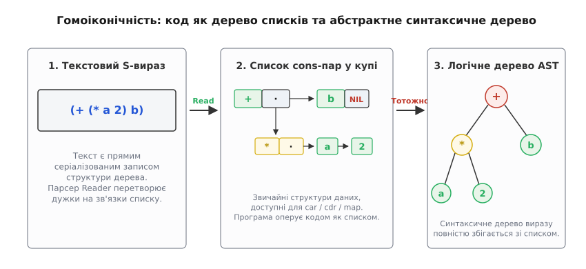
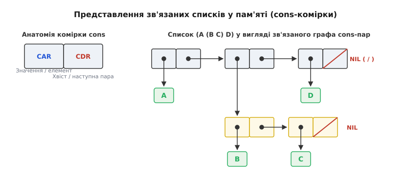
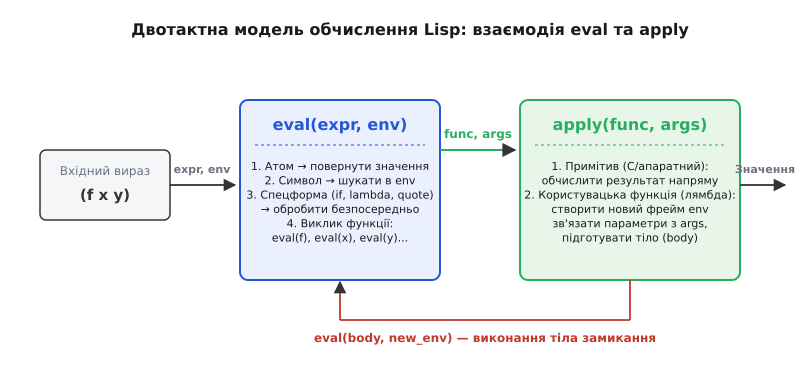
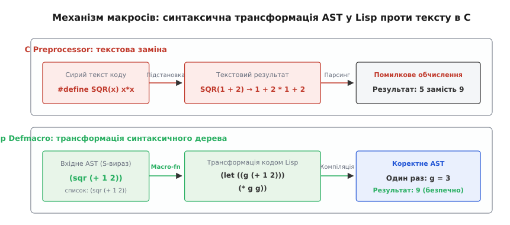

# Lisp: програма як список

<preknowlist>
- [Однозв'язний список](topic:algorithms/linked-list) — базовий ланцюжок вузлів із покажчиком на наступний елемент.
- [Рекурсія](topic:algorithms/recursion) — зведення задачі до самовиклику на менших вхідних даних.
- [Функції як значення першого класу](topic:programming/first-class-functions) — передавання функцій як аргументів і повернення їх як результатів.
- [Збирання сміття](topic:programming/garbage-collection) — автоматичне відстеження та звільнення недосяжної пам'яті.
</preknowlist>

Коли компілятор традиційної мови (як-от C, Rust чи Java) читає вихідний код, він розбиває плоский потік символів на лексеми, а потім будує з них складне абстрактне синтаксичне дерево (AST). У такому дереві кожна мовна конструкція представлена окремим типом вузла: оголошення змінної, бінарна операція, блок розгалуження чи виклик методу мають власні жорсткі структури даних. Для самої програми це дерево залишається невидимим і недосяжним: вона не може безпосередньо створити новий блок коду, видозмінити чужу функцію перед викликом або додати власну керівну конструкцію без зовнішніх генераторів коду чи складних бібліотек парсингу.

Lisp усуває цю прірву фундаментальним архітектурним рішенням: мова не має окремого синтаксису для коду, відмінного від синтаксису її базових структур даних. Програма записується безпосередньо як ієрархічний зв'язаний список символів і значень. Оскільки код програми є її рідним списком у пам'яті, програма здатна читати, аналізувати, трансформувати та генерувати інший код тими самими базовими операціями, якими вона обробляє звичайні дані.

## Гомоіконічність: синтаксис як структура даних

Властивість мови програмування, за якої первинне представлення коду збігається з її внутрішніми структурами даних, називається **гомоіконічністю** (англ. *homoiconicity*, від грец. *ὁμός* — однаковий та *εἰκών* — образ, відображення). 

У негомоіконічній мові між текстом `x = a + b * 2;` та його внутрішнім синтаксичним деревом лежить складна граматика з таблицями пріоритетів операторів. У Lisp той самий вираз записується у префіксній формі:

```lisp
(setq x (+ a (* b 2)))
```

Цей запис є **символьним виразом** або **S-виразом** (англ. *symbolic expression*, *S-expression*). Коли рідер (синтаксичний аналізатор Lisp) зустрічає круглі дужки, він не будує спеціалізовані апаратні вузли, а просто виділяє в пам'яті звичайний зв'язаний список, елементами якого є символи `setq`, `x`, `+`, `a` та вкладений підсписок `(* b 2)`.


*S-вираз (+ (* a 2) b) безпосередньо відображається у дерево cons-пар у пам'яті, яке є точним синтаксичним деревом виразу.*

> 🔧 **Навіщо це.** Завдяки гомоіконічності метапрограмування (програмування, що маніпулює іншими програмами) позбавляється необхідності парсити рядки чи оперувати сирим текстом. Написання макросу або компілятора в Lisp зводиться до звичайної роботи зі списками за допомогою тих самих функцій обходу та фільтрації, що й для будь-яких бізнес-даних.

## Анатомія S-виразів: атоми, пари та списки

Увесь універсум даних і програм у Lisp збудований лише з двох категорій сутностей: **атомів** та **парних комірок**.

**Атом** (англ. *atom*, грец. *ἄτομος* — неподільний) — це елементарне значення, яке не можна розкласти на простіші компоненти мови Lisp. Атоми бувають кількох типів:
- **Числа:** цілі (`42`, `-10`) або дробові (`3.1415`);
- **Символи** (англ. *symbols*): іменовані ідентифікатори (`x`, `total-count`, `+`, `my-function`);
- **Рядки:** послідовності символів (`"Привіт, світе"`);
- **Логічні константи:** `t` (істина) та `nil` (порожній список або хибність).

**Парна комірка** або **cons-комірка** (англ. *cons cell*, від *construct* — конструювати) — це елементарний блок динамічної пам'яті, що містить рівно два покажчики:
1. **CAR** (англ. *Contents of Address Register*) — покажчик на перший елемент (голову);
2. **CDR** (англ. *Contents of Decrement Register*) — покажчик на другий елемент (хвіст).

Назви `car` та `cdr` походять від апаратної структури 36-бітного машинного слова комп'ютера IBM 704, де створювався перший Lisp. Про те, як інженерні обмеження цього мейнфрейму сформували базовий синтаксис та привели до відкриття універсального інтерпретатора, розповідає [історична вставка про походження Lisp](topic:programming/lisp/hist-lisp-origins.md). У сучасних діалектах, як-от Clojure чи Racket, для цих операцій також вживають синоніми `first` та `rest`.


*Cons-комірка складається з двох полів — car та cdr; список утворюється послідовним ланцюжком пар із термінатором nil у кінці, а вкладені списки формують довільні дерева.*

Будь-який список у Lisp є однозв'язним ланцюжком cons-комірок. Наприклад, список із трьох чисел `(1 2 3)` фізично створюється послідовним вкладенням трьох пар:

```lisp
(cons 1 (cons 2 (cons 3 nil)))
```

Остання cons-комірка в полі `cdr` містить покажчик на `nil`, що сигналізує про завершення правильного списку (*proper list*). Якщо ж у полі `cdr` останньої комірки міститься не `nil`, а інший неподільний атом, утворюється так звана **точкова пара** (англ. *dotted pair*):

```lisp
(cons 'A 'B)   ;; Відображається як (A . B)
```

Вкладені списки утворюються тоді, коли поле `car` деякої cons-комірки вказує не на простий атом, а на голову іншого зв'язаного списку. Завдяки цьому з cons-пар можна конструювати довільні n-арні дерева, графи та таблиці символів.

## Двотактна модель обчислення: REPL, eval та apply

Класичне середовище Lisp функціонує за моделлю інтерактивного циклу **REPL** (англ. *Read-Eval-Print Loop* — цикл читання, обчислення та друку):
1. **Read:** текстовий потік розбирається рідером на cons-структури та символи.
2. **Eval:** дерево виразів обчислюється згідно з правилами семантики.
3. **Print:** результуюча структура даних серіалізується у текстовий вигляд і виводиться користувачеві.
4. **Loop:** повернення на початок циклу.

Серцем фази `Eval` є взаєморекурсивна пара функцій: `eval` та `apply`.


*Двотактний механізм інтерпретації: eval розбирає форму й обчислює аргументи, apply зв'язує параметри з новим оточенням і повертає керування в eval для обчислення тіла.*

### Алгоритм `eval(expr, env)`

Функція `eval` приймає вираз `expr` та поточне лексичне середовище (оточення, англ. *environment*) `env`, що зіставляє імена символів із їхніми значеннями в пам'яті:

1. **Якщо `expr` — самообчислюваний атом (число, рядок):** повертається сам цей атом.
2. **Якщо `expr` — символ:** шукається його значення у поточному оточенні `env` (якщо символ не знайдено — генерується помилка незв'язаної змінної).
3. **Якщо `expr` — список `(op arg1 arg2 ...)`:**
   - Інтерпретатор перевіряє перший елемент `op`.
   - **Якщо `op` — спеціальна форма (Special Form):** керування передається спеціальному обробнику форми. Аргументи форми обчислюються не за стандартним правилом, а за власною семантикою форми.
   - **Якщо `op` — звичайна функція:** `eval` рекурсивно обчислює кожен елемент списку — саму функцію `op` та всі її аргументи `(arg1, arg2, ...)`, після чого викликає `apply(func, evaluated_args)`.

### Спеціальні форми (Special Forms)

У звичайному виклику функції всі аргументи обов'язково обчислюються **до** передачі у функцію (*applicative-order evaluation*). Якби всі конструкції були функціями, базове розгалуження та визначення нових зв'язувань були б неможливими. 

Розгляньмо, чому спеціальні форми є фундаментальною частиною ядра:

- **`quote` (або скорочення `'`):** повертає свій аргумент без обчислення. Вираз `(quote (+ 1 2))` повертає список із трьох елементів `(+ 1 2)`, а не число `3`. Це перемикач контексту: «сприймай наступний фрагмент як дані, а не як інструкцію для виконання».
- **`if`:** форма умовного переходу `(if condition then-branch else-branch)`. Спочатку обчислюється лише `condition`. Якщо воно істинне, обчислюється **тільки** `then-branch`, а `else-branch` ігнорується. Якби `if` був звичайною функцією, обидві гілки обчислювалися б завжди, що унеможливило б базові випадки в рекурсії й призводило б до нескінченного зациклення.
- **`lambda`:** створює анонімну функцію (лексичне замикання). Форма `(lambda (x) (* x 2))` не обчислює своє тіло в момент визначення, а пакує список параметрів, вираз тіла та поточне оточення у функціональний об'єкт першого класу.
- **`define` / `defun`:** зв'язує символ у глобальному оточенні зі значенням або функцією без попереднього обчислення імені самого символу.

### Алгоритм `apply(func, args)`

Функція `apply` приймає обчислену функцію `func` та готовий список обчислених аргументів `args`:
1. **Якщо `func` — системний примітив (C/C++ функція):** викликається нативний машинний код із переданими аргументами.
2. **Якщо `func` — замикання (closure):** створюється новий фрейм оточення `new_env`, батьківським для якого є оточення збереження замикання. У цьому новому фреймі формальні параметри функції прив'язуються до фактичних значень із `args`. Після цього викликається `eval(body, new_env)` для тіла замикання.

Повний працюючий інтерпретатор Lisp із реалізацією фаз `read`, `eval`, `apply` та `print` наведено в [практичній вставці з кодом на C та C++](topic:programming/lisp/proj-mini-lisp.md).

## Макроси: трансформація AST під час трансляції

Більшість компільованих мов підтримують той чи інший механізм макросів, проте між макросами C-подібних мов та макросами Lisp існує принципова прірва.

У мові C препроцесор працює з сирим текстом файлу до початку синтаксичного аналізу:

:::tabs
```c
#define SQR(x) x * x

int result = SQR(1 + 2); /* Розгортається у текст: 1 + 2 * 1 + 2 = 5 замість 9! */
```
```cpp
/* У C++ замість текстової підстановки використовують типізовані шаблони або constexpr */
constexpr auto sqr(auto x) {
    return x * x;
}

int result = sqr(1 + 2); /* Обчислюється як sqr(3) = 9 із повагою до синтаксичного дерева */
```
:::

Препроцесор C не розуміє пріоритетів операцій, типів чи структури виразів, тому вимагає захисного оточення кожної змінної дужками `((x) * (x))` і часто призводить до прихованих помилок із подвійним виконанням побічних ефектів, наприклад `SQR(i++)`.

У Lisp макрос — це звичайна функція мови, яка викликається не під час виконання програми (*runtime*), а під час фази макророзгортання (**macroexpansion time**). Макрос приймає як аргументи **необчислені S-вирази** (дерева cons-пар), виконує довільні обчислення й повертає **новий S-вираз**, який компілятор або інтерпретатор підставляє на місце виклику.


*Під час макророзгортання макрофункція виконує довільні трансформації дерева cons-комірок до початку остаточної компіляції чи виконання.*

### Квазіцитування: генерація коду за шаблоном

Для зручного конструювання синтаксичних дерев Lisp використовує систему **квазіцитування** (англ. *quasiquotation*):
- Зворотний апостроф (бектік) `` ` `` цитує весь вираз як незмінні дані;
- Кома `,` (**unquote**) тимчасово вимикає цитування й обчислює вираз;
- Кома зі знаком `@` (`,@` — **unquote-splicing**) обчислює список і «вклеює» його елементи безпосередньо у батьківський список, прибираючи зовнішні дужки.

Створимо за допомогою макросу нову керівну конструкцію `while`, якої немає в базовому ядрі функційного Lisp:

```lisp
(defmacro while (condition &body body)
  (let ((loop-sym (gensym "LOOP-")))
    `(tagbody
       ,loop-sym
       (if ,condition
           (progn
             ,@body
             (go ,loop-sym))))))
```

Коли інтерпретатор або компілятор зустрічає у коді:

```lisp
(while (< x 10)
  (print x)
  (setq x (+ x 1)))
```

Він викликає макрофункцію `while`, яка будує звичайний список інструкцій низькорівневого безумовного переходу `tagbody`. Програма отримує нову мовну конструкцію, не змінюючи компілятор.

## Захоплення імен і гігієна макросів

Головна небезпека наївних макросів — **ненавмисне захоплення змінних** (англ. *variable capture*). Воно виникає у двох випадках:
1. Макрос створює внутрішню допоміжну змінну, ім'я якої випадково збігається з іменем змінної у коді користувача, перекриваючи її.
2. Вираз, переданий користувачем як аргумент макросу, випадково звертається до внутрішньої змінної макросу замість своєї локальної області видимості.

Продемонструємо дефект на небезпечному макросі подвоєння обчислення:

```lisp
;; Помилкова реалізація:
(defmacro bad-sqr (expr)
  `(let ((temp ,expr))
     (* temp temp)))

;; Виклик користувача:
(let ((temp 10))
  (bad-sqr (+ temp 5)))
```

Під час розгортання `bad-sqr` вираз перетвориться на:

```lisp
(let ((temp 10))
  (let ((temp (+ temp 5))) ;; Внутрішній temp перекрив зовнішній temp!
    (* temp temp)))
```

Замість `(+ 10 5)` обчислення звернеться до щойно оголошеного, ще не ініціалізованого внутрішнього `temp`, що призведе до катастрофічної зміни логіки програми.

### Два підходи до гігієни

В історії розвитку Lisp склалися дві стратегії подолання цієї проблеми:

1. **Common Lisp: явне генерування унікальних символів (`gensym`)**
   Функція `gensym` (англ. *generate symbol*) створює новий символ, якого гарантовано немає в жодній таблиці символів і який неможливо випадково ввести з клавіатури (наприклад, `#:G1042`). Автор макросу зобов'язаний самостійно створювати унікальні ідентифікатори для всіх проміжних змінних:

   ```lisp
   (defmacro safe-sqr (expr)
     (let ((g-temp (gensym "TEMP-")))
       `(let ((,g-temp ,expr))
          (* ,g-temp ,g-temp))))
   ```

2. **Scheme: автоматичні гігієнічні макроси (`syntax-rules`)**
   Діалект Scheme (починаючи зі стандарту R4RS/R5RS) запровадив концепцію **гігієнічних макросів** (від грец. *ὑγιεινός* — здоровий, чистий). У макросистемі `syntax-rules` розгортання здійснюється за декларативними зразками, а компілятор самостійно відстежує лексичні області видимості та автоматично перейменовує всі внутрішні змінні, гарантуючи неможливість колізій без виклику `gensym`.

Детальний довідковий опис сигнатур, операторів деструктуризації та правил побудови гігієнічних шаблонів наведено в [довідковій вставці з інтерфейсів макросистем](topic:programming/lisp/api-macro-toolkit.md).

## Спадщина Lisp в архітектурі мов програмування

Створений 1958 року як інструмент для досліджень штучного інтелекту, Lisp заклав архітектурний фундамент майже для кожного ключового напрямку сучасного програмного інженерного стеку. Більшість технологій, які вважаються стандартом у мовах XXI століття, вперше з'явилися саме в Lisp:

1. **Автоматичне збирання сміття (Garbage Collection):** оскільки структури списків динамічно створювалися та з'єднувалися під час обчислень, ручне керування пам'яттю було неможливим. Джон Маккарті 1960 року винайшов алгоритм Mark-and-Sweep, створивши першу керовану пам'ять у комп'ютерній індустрії.
2. **Функції як об'єкти першого класу та лексичні замикання:** можливість передавати функції як аргументи (`mapcar`, `filter`), повертати їх з інших функцій та зберігати стан лексичного контексту (реалізовано у діалекті Scheme Гаєм Стілом та Джеральдом Сассманом 1975 року) визначила вигляд сучасного JavaScript, Python, Swift та Rust.
3. **Динамічна типізація:** у Lisp тип є властивістю значення в пам'яті (завдяки тегам покажчиків), а не імені змінної, що дало початок усьому класу динамічних мов.
4. **Умовний вираз першого класу:** у ранньому Фортрані існував лише апаратний перехід за знаком числа `IF (A-B) 10, 20, 30`. Маккарті винайшов форму `cond` (а згодом `if`), яка не просто перенаправляє потік інструкцій, а повертає значення як повноцінний вираз.
5. **Інтерактивна розробка та живе оновлення коду:** традиція розробки всередині працюючого образу системи через REPL, де програміст може перевизначити функцію чи структуру даних у реальному часі без перезапуску процесу, стала прямим предком сучасних інтерактивних середовищ — від Smalltalk до Jupyter Notebooks та систем Hot Module Replacement у веброзробці.

Lisp продемонстрував, що мінімалістичний математичний базис із кількох операцій над зв'язаними списками здатен виразити будь-яку обчислювану модель, перетворивши код програми на найгнучкіший із можливих типів даних.
