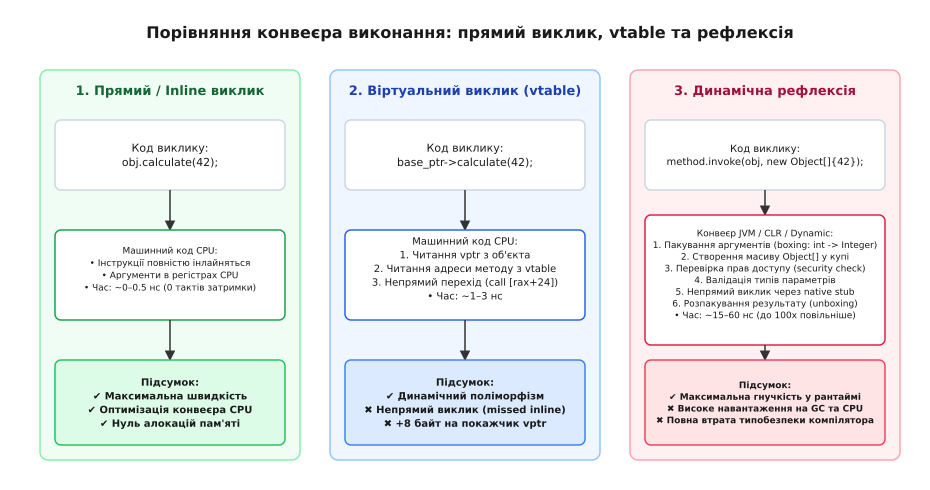

# ⚙️ Реалізація метаоб'єктного реєстру та серіалізатора

У системному програмуванні на мовах C та C++ компілятор повністю стирає імена полів і структур під час трансляції коду в машинний двійковий образ. Процесор оперує виключно фізичними адресами пам'яті та регістрами, не маючи жодного уявлення про те, які семантичні сутності закодовано за цими адресами. Якщо виникає завдання серіалізувати структури в текстові чи бінарні формати (JSON, CBOR, Protocol Buffers), передати їх через мережу або викликати функції за рядковими назвами з конфігураційних файлів, інженер змушений побудувати власну систему метаданих — **метаоб'єктний реєстр** (англ. *Metaobject Registry*).

Розгляньмо проектування універсальної системи інтроспекції та автоматичної серіалізації: спочатку через класичний дескрипторний реєстр зміщень пам'яті в C, а потім через типобезпечну систему інтроспекції на шаблонах, кортежах і `constexpr` у C++.

---

### Фізична модель пам'яті та концепція дескриптора

Щоб описати довільну структуру даних для зовнішнього серіалізатора, системі потрібні чотири базові характеристики для кожного поля:
1. **Рядкове ім'я поля** (для формування ключів JSON чи запитів до бази даних).
2. **Тип даних** (ціле число, число з рухомою комою, масив символів чи вкладена структура).
3. **Зміщення від початку структури в байтах** (фізична відстань від базової адреси об'єкта, яка обчислюється макросом `offsetof`).
4. **Розмір поля в байтах** (визначається через оператор `sizeof`).


*Принцип роботи дескриптора: пам'ять об'єкта розглядається як неперервна послідовність байтів за базовою адресою. Дескриптор містить статичну таблицю відносних зміщень (offset), що дозволяє універсальному серіалізатору читати поля без жорстко зашитого знання про типи на етапі компіляції.*

Коли універсальна функція серіалізації отримує вказівник на об'єкт типу `void*` разом із посиланням на його дескриптор, вона перетворює вказівник на беззнаковий байтовий масив `const uint8_t* base`. Для кожного поля алгоритм обчислює точну фізичну адресу `field_addr = base + field->offset`. Після цього, спираючись на збережений тег типу, серіалізатор інтерпретує байти за цією адресою як ціле число, число з рухомою комою або нуль-термінований рядок і форматує вихідний текст.

---

### Робоча реалізація метаоб'єктного серіалізатора

Порівняймо дві парадигми проектування метасистем: низькорівневу табличну реєстрацію на C з ручним керуванням зміщеннями та типобезпечну шаблонну інтроспекцію на C++, що спирається на вказівники на члени класів і згортки шаблонів.

:::tabs
```c
#include <stdio.h>
#include <stdint.h>
#include <stdbool.h>
#include <stddef.h>
#include <string.h>

// Перелік підтримуваних типів даних
typedef enum {
    TYPE_INT32,
    TYPE_DOUBLE,
    TYPE_STRING,
    TYPE_BOOL
} FieldType;

// Дескриптор одного поля структури
typedef struct {
    const char* name;
    FieldType   type;
    size_t      offset;
    size_t      size;
} FieldMeta;

// Дескриптор усієї структури (метаклас)
typedef struct {
    const char*      struct_name;
    size_t           total_size;
    const FieldMeta* fields;
    size_t           field_count;
} StructMeta;

// Цільова структура прикладних даних
typedef struct {
    int32_t id;
    char    username[32];
    double  balance;
    bool    is_active;
} UserProfile;

// Таблиця метаданих для UserProfile
static const FieldMeta USER_PROFILE_FIELDS[] = {
    { "id",        TYPE_INT32,  offsetof(UserProfile, id),        sizeof(int32_t) },
    { "username",  TYPE_STRING, offsetof(UserProfile, username),  32 },
    { "balance",   TYPE_DOUBLE, offsetof(UserProfile, balance),   sizeof(double) },
    { "is_active", TYPE_BOOL,   offsetof(UserProfile, is_active), sizeof(bool) }
};

static const StructMeta USER_PROFILE_META = {
    .struct_name = "UserProfile",
    .total_size  = sizeof(UserProfile),
    .fields      = USER_PROFILE_FIELDS,
    .field_count = sizeof(USER_PROFILE_FIELDS) / sizeof(USER_PROFILE_FIELDS[0])
};

// Універсальна функція серіалізації в JSON за метаданими
void serialize_to_json(const void* object_ptr, const StructMeta* meta, char* buffer, size_t max_len) {
    size_t written = snprintf(buffer, max_len, "{\n  \"_type\": \"%s\",\n", meta->struct_name);
    const uint8_t* base = (const uint8_t*)object_ptr;

    for (size_t i = 0; i < meta->field_count; ++i) {
        const FieldMeta* field = &meta->fields[i];
        const void* field_addr = base + field->offset;

        written += snprintf(buffer + written, max_len - written, "  \"%s\": ", field->name);

        switch (field->type) {
            case TYPE_INT32: {
                int32_t val = *(const int32_t*)field_addr;
                written += snprintf(buffer + written, max_len - written, "%d", val);
                break;
            }
            case TYPE_DOUBLE: {
                double val = *(const double*)field_addr;
                written += snprintf(buffer + written, max_len - written, "%.2f", val);
                break;
            }
            case TYPE_STRING: {
                const char* str = (const char*)field_addr;
                written += snprintf(buffer + written, max_len - written, "\"%s\"", str);
                break;
            }
            case TYPE_BOOL: {
                bool val = *(const bool*)field_addr;
                written += snprintf(buffer + written, max_len - written, "%s", val ? "true" : "false");
                break;
            }
        }

        if (i + 1 < meta->field_count) {
            written += snprintf(buffer + written, max_len - written, ",\n");
        } else {
            written += snprintf(buffer + written, max_len - written, "\n");
        }
    }
    snprintf(buffer + written, max_len - written, "}");
}

int main(void) {
    UserProfile user = {
        .id = 1042,
        .username = "andrij_f",
        .balance = 250.75,
        .is_active = true
    };

    char json_output[512];
    serialize_to_json(&user, &USER_PROFILE_META, json_output, sizeof(json_output));
    printf("%s\n", json_output);

    return 0;
}
```
```cpp
#include <iostream>
#include <string_view>
#include <string>
#include <tuple>
#include <type_traits>
#include <format>
#include <sstream>

// Універсальний типізований дескриптор поля для C++
template <typename ClassType, typename MemberType>
struct FieldDescriptor {
    std::string_view name;
    MemberType ClassType::*member_ptr;

    constexpr FieldDescriptor(std::string_view n, MemberType ClassType::*ptr)
        : name(n), member_ptr(ptr) {}
};

// Допоміжний генератор для автоматичного виведення типів
template <typename ClassType, typename MemberType>
constexpr auto make_field(std::string_view name, MemberType ClassType::*ptr) {
    return FieldDescriptor<ClassType, MemberType>(name, ptr);
}

// Базовий первинний шаблон трейту рефлексії
template <typename T>
struct TypeTraits;

// Цільова структура даних
struct UserProfile {
    int id{0};
    std::string username;
    double balance{0.0};
    bool is_active{false};
};

// Спеціалізація трейту рефлексії для структури UserProfile
template <>
struct TypeTraits<UserProfile> {
    static constexpr std::string_view type_name = "UserProfile";

    static constexpr auto fields() {
        return std::make_tuple(
            make_field("id", &UserProfile::id),
            make_field("username", &UserProfile::username),
            make_field("balance", &UserProfile::balance),
            make_field("is_active", &UserProfile::is_active)
        );
    }
};

// Універсальний відвідувач полів на базі кортежу дескрипторів
template <typename T, typename Func>
constexpr void for_each_field(const T& object, Func&& visitor) {
    auto field_tuple = TypeTraits<T>::fields();
    std::apply([&](const auto&... fields) {
        (visitor(fields.name, object.*(fields.member_ptr)), ...);
    }, field_tuple);
}

// Універсальний JSON-серіалізатор без використання void* чи ручних зміщень
template <typename T>
std::string serialize_to_json(const T& object) {
    std::ostringstream ss;
    ss << "{\n  \"_type\": \"" << TypeTraits<T>::type_name << "\",\n";

    bool first = true;
    for_each_field(object, [&](std::string_view name, const auto& value) {
        if (!first) ss << ",\n";
        first = false;

        ss << "  \"" << name << "\": ";
        if constexpr (std::is_same_v<std::decay_t<decltype(value)>, std::string> ||
                      std::is_same_v<std::decay_t<decltype(value)>, std::string_view>) {
            ss << "\"" << value << "\"";
        } else if constexpr (std::is_same_v<std::decay_t<decltype(value)>, bool>) {
            ss << (value ? "true" : "false");
        } else {
            ss << value;
        }
    });

    ss << "\n}";
    return ss.str();
}

int main() {
    UserProfile user{
        .id = 1042,
        .username = "andrij_f",
        .balance = 250.75,
        .is_active = true
    };

    std::string json = serialize_to_json(user);
    std::cout << json << '\n';

    return 0;
}
```
:::

---

### Детальний аналіз механізмів та відмінностей

У реалізації мовою C реєстр метаданих зберігається у вигляді статичного масиву `USER_PROFILE_FIELDS` у секції незмінних констант `.rodata`. Функція `serialize_to_json` є повністю поліморфною в рантаймі: вона може прийняти адресу будь-якої структури, якщо їй передано відповідний дескриптор `StructMeta`. Проте за цю гнучкість розробник платить повною відсутністю статичного контролю: якщо в таблиці вказано тип `TYPE_INT32`, а за відповідним зміщенням лежить 8-байтний вказівник або число `double`, програма скомпілюється без попереджень, але під час виконання зчитає пошкоджені дані.

У реалізації мовою C++ метадані інкапсульовано в типізовані дескриптори `FieldDescriptor`. Замість сирих числових зміщень у байтах тут використовуються **вказівники на члени класу** (англ. *pointers to members* `MemberType ClassType::*`). Звернення `object.*(fields.member_ptr)` суворо типізоване: компілятор гарантує, що поле належить саме класу `UserProfile` і має відповідний тип.

Шаблонний відвідувач `for_each_field` використовує функцію `std::apply` та **згортку виразів C++17** (англ. *fold expression* `(visitor(...), ...)`). Під час оптимізації компілятор GCC або Clang повністю розгортає цей кортеж у послідовність прямих інструкцій запису в потік. У релігійному двійковому файлі не залишається ані циклів, ані таблиць дескрипторів, ані непрямих викликів функцій.

---

### Порівняльний аналіз архітектурних характеристик

| Характеристика | Рантайм-реєстр (C) | Шаблонна інтроспекція (C++) | Статична рефлексія (C++26 P2996) |
| :--- | :--- | :--- | :--- |
| **Визначення метаданих** | Вручну таблицями зі зміщеннями | Вручну через реєстрацію вказівників | Автоматично компілятором через оператор `^^` |
| **Безпека типів** | Відсутня (`void*` та зміщення в байтах) | Повна (контролюється типами C++) | Абсолютна (інтегрована в ядро мови) |
| **Витрати оперативної пам'яті** | Таблиці дескрипторів у Flash/RAM | Нуль у рантаймі (лише типи C++) | Нуль у рантаймі (виконується в `constexpr`) |
| **Можливість інлайнінгу** | Неможливо (непрямий доступ через покажчики) | Повний інлайнінг згортки виразів | Повний інлайнінг згенерованого AST |
| **Швидкість обробки** | Середня (~150–300 нс на об'єкт) | Максимальна (~15–30 нс на об'єкт) | Максимальна (~15–30 нс на об'єкт) |

---

### Підводні камені, пастки та безпека пам'яті

При розробці систем метаданих у низькорівневих мовах необхідно враховувати низку критичних апаратних факторів:

1. **Вирівнювання пам'яті та паддінг (Structure Padding):**
   Обчислення зміщення полів «на око» шляхом простого підсумовування розмірів попередніх типів є фатальною помилкою. Компілятор вирівнює поля відповідно до вимог цільового процесора (наприклад, 64-бітне число `double` вимагає 8-байтного вирівнювання). Якщо попереднє поле `char` займало 1 байт, компілятор додасть 7 байтів мертвого простору (паддінгу). Застосування макроса `offsetof` або вказівників на члени є єдиним надійним способом отримання коректного зміщення.
2. **Порядок байтів (Endianness):**
   При розробці бінарних серіалізаторів на базі метаданих для передачі даних мережею пряме копіювання байтів через `memcpy` на архітектурах із різним порядком байтів (Little-Endian на x86/ARM проти Big-Endian на мережевих процесорах) призводить до інверсії значень чисел. Дескриптор типу має містити інформацію про необхідність виклику функцій перетворення `htonl` / `ntohl`.
3. **Версіонування та сумісність структур:**
   Якщо структура даних змінюється між релізами програмного забезпечення (додаються нові поля, видаляються застарілі), статичні таблиці метаданих дозволяють реалізувати сумісність назад: серіалізатор може звіряти версію схеми в заголовку повідомлення та ініціалізувати відсутні поля значеннями за замовчуванням, уникаючи аварійного падіння програми.
4. **Контроль меж буфера:**
   При серіалізації рядкових полів функція повинна суворо контролювати залишок вільного місця у вихідному буфері `max_len - written`. Використання небезпечних функцій сімейства `sprintf` замість `snprintf` створює пряму вразливість переповнення стека або купи при обробці неперевірених вхідних даних.
