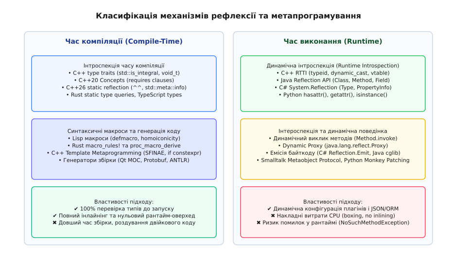
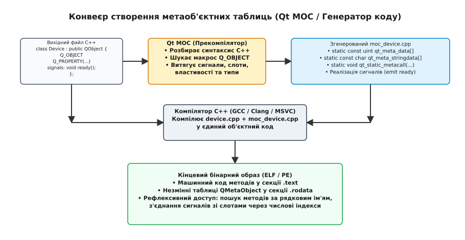
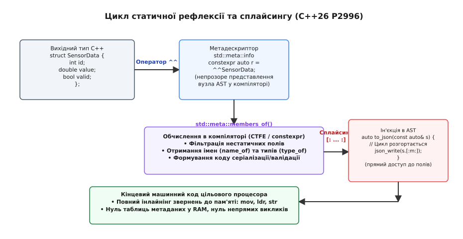

# Рефлексія й метапрограмування

<preknowlist>
- [Компіляція](book:programming/compilation) — трансляція вихідного тексту в двійкові машинні інструкції та втрата синтаксичних структур.
- [Стадії компілятора](book:programming/compiler-stages) — синтаксичні дерева (AST), таблиці символів і семантичний аналіз.
- [Абстракції без витрат](book:programming/zero-cost-abstractions) — мономорфізація шаблонів та інлайнінг у статично компільованих мовах.
- [Поліморфізм](book:programming/polymorphism) — динамічна диспетчеризація через таблиці віртуальних методів.
- [Байткод і віртуальна машина](book:programming/bytecode-vm) — виконання проміжного коду та збереження метаданих типів у рантаймі.
</preknowlist>

Коли компілятор мови C або C++ транслює структуру користувача з десятком різнотипних полів у машинний код, у пам'яті процесора залишається лише безликий блок байтів. Якщо структура займає 48 байтів, процесор бачить лише зміщення `+0`, `+8` чи `+16` відносно базової адреси регістра. Інформація про те, що перші 8 байтів кодували цілочисельний ідентифікатор `user_id`, наступні 32 байти містили масив символів `username`, а останнє поле було прапорцем прав доступу `is_admin`, повністю стирається оптимізатором. Коли виникає завдання передати цей об'єкт через мережу у форматі JSON, зберегти в реляційну базу даних або відобразити у вікні графічного інтерфейсу, інженер опиняється перед вибором: або власноруч писати монотонні функції серіалізації для сотень типів даних, або навчити програму досліджувати та модифікувати власну структуру.

Здатність комп'ютерної програми вивчати власну будову, типи даних, зміщення полів і сигнатури методів або породжувати новий код під час збірки чи виконання утворює фундаментальний розділ архітектури програмного забезпечення — **рефлексію** (від лат. *reflectere* — згинати назад, віддзеркалювати) та **метапрограмування** (від грец. *meta* — після, понад, про себе).

> 🔧 **Навіщо це.** Без механізмів рефлексії та метапрограмування будь-яка універсальна система — вебфреймворк, ORM для баз даних, серіалізатор мережевих протоколів, інжектор залежностей (DI) чи система плагінів — вимагала б генерації гігабайтів шаблонного ручного коду або сторонніх зовнішніх скриптів під кожну зміну структури даних.

---

### Анатомія самоспостереження: інтроспекція, інтероспекція та метапрограмування

Щоб чітко розрізняти способи взаємодії коду із самим собою, в теорії комп'ютерних наук використовують трирівневу класифікацію:

```
                               Метапрограмування
                     (код, що маніпулює або генерує код)
                                     │
                 ┌───────────────────┴───────────────────┐
                 ▼                                       ▼
        Час компіляції (Compile-Time)             Час виконання (Runtime)
  ┌─────────────────────────────────────┐  ┌─────────────────────────────────────┐
  │ • Синтаксичні макроси (Rust, Lisp)  │  │ • Динамічна емісія (C# Emit, cglib) │
  │ • Шаблони C++ (TMP, Concepts, SFINAE)│ │ • Метаоб'єктні системи (CLOS MOP)   │
  │ • Статична рефлексія (C++26 P2996)  │  │ • JIT-генерація проксі-об'єктів     │
  └─────────────────────────────────────┘  └─────────────────────────────────────┘
                 ▲                                       ▲
                 │                                       │
     ┌───────────┴───────────┐               ┌───────────┴───────────┐
     ▼                       ▼               ▼                       ▼
Інтроспекція          Трансформація     Інтроспекція          Інтероспекція
(type traits,         (сплайсинг,       (RTTI, Java Class<T>, (Method.invoke,
 Concepts)            proc_macro)       C# System.Reflection)  Monkey Patching)
```

1. **Інтроспекція (Introspection)** — від лат. *intro* («всередину») та *spectare* («дивитися»). Це виключно **пасивна здатність програми читати метадані про саму себе**: запитувати імена типів, кількість полів, їхні типи, розміри, зміщення в пам'яті, наявність анотацій або перелік методів. Інтроспекція лише спостерігає і ніколи не змінює стан чи поведінку досліджуваного об'єкта.
2. **Інтероспекція / Активна рефлексія (Intercession / Dynamic Reflection)** — від лат. *intercedere* («втручатися, ставати посередником»). Це **активна здатність програми змінювати власну структуру або поведінку під час виконання**: динамічно підміняти реалізації методів (англ. *monkey patching*), викликати методи за їхніми рядковими назвами з конструюванням стека викликів, перехоплювати звернення до полів через динамічні проксі-об'єкти або додавати нові члени до існуючих класів.
3. **Метапрограмування (Metaprogramming)** — це ширша концепція, де **програма розглядає інший код (або саму себе) як дані**. Метапрограма приймає на вхід синтаксичні конструкції, типи чи абстрактні дерева (AST) і генерує з них новий виконуваний код або трансформує наявний.


*Розподіл можливостей за часом виконання та глибиною впливу: статичні механізми переносять усю роботу на компілятор із нульовими витратами в рантаймі, тоді як динамічні системи надають повну гнучкість ціною витрат пам'яті та швидкодії процесора.*

Історичний шлях від перших академічних експериментів у Lisp і Smalltalk-80 до комерційних протоколів метаоб'єктів (CLOS MOP) детально викладено в [історії розвитку обчислювальної рефлексії](book:programming/languages/reflection-metaprogramming/hist-reflection-mop.md).

---

### Метапрограмування на етапі компіляції

Метапрограмування часу компіляції (англ. *Compile-Time Metaprogramming*) виконується виключно транслятором до створення фінального машинного коду. Його фундаментальна мета — забезпечити максимальну гнучкість архітектури без найменших накладних витрат у рантаймі ([абстракції без витрат](book:programming/zero-cost-abstractions)).

#### Текстові макроси проти синтаксичних дерев

Найпростішою формою метапрограмування є текстовий [препроцесор C](book:programming/preprocessor-macros). Препроцесор сприймає вихідний код як плоский потік символів, не маючи жодного уявлення про типи даних, області видимості чи синтаксичні дерева. Порівняймо спробу створити узагальнену властивість через препроцесор та сучасну обгортку:

:::tabs
```c
// Генерація оголошень аксесорів через текстовий препроцесор C
#define DECLARE_PROPERTY_ACCESSORS(type, name) \
    type get_##name(const void* self); \
    void set_##name(void* self, type val);
```
```cpp
// Ідіоматична типобезпечна обгортка властивості в C++
template <typename T>
class Property {
    T value_{};
public:
    constexpr Property() = default;
    constexpr explicit Property(T val) : value_(std::move(val)) {}
    constexpr const T& get() const noexcept { return value_; }
    constexpr void set(T val) noexcept { value_ = std::move(val); }
};
```
:::

Текстовий підхід макросів породжує критичні проблеми: неможливість перевірки типів до розгортання, колізії імен, відсутність інтроспекції та нечитабельні повідомлення про помилки.

Якісним стрибком стали **синтаксичні макроси**. У мовах сімейства [Lisp](book:programming/lisp) реалізовано концепцію **гомоіконічності** (англ. *homoiconicity* — код як дані): програма записується у вигляді вкладених списків (S-виразів), які є одночасно і вихідним текстом, і абстрактним синтаксичним деревом:

```lisp
;; Макрос у Lisp, що трансформує код як список
(defmacro with-logging (operation)
  `(progn
     (format t "Початок операції: ~A~%" ',operation)
     (let ((result ,operation))
       (format t "Результат: ~A~%" result)
       result)))
```

У сучасній мові **Rust** метапрограмування реалізовано на рівні компілятора через гігієнічні декларативні макроси (`macro_rules!`) та процедурні макроси (`proc_macro`). Процедурний макрос компілюється як плагін до компілятора `rustc`, отримує на вхід потік лексем (`TokenStream`), аналізує поля структури за допомогою синтаксичного аналізатора та генерує новий валідний Rust-код:

```rust
// Декларативне додавання серіалізації через процедурний макрос
#[derive(Serialize, Deserialize, Debug)]
pub struct SensorPacket {
    pub sensor_id: u32,
    pub temperature: f64,
    pub is_calibrated: bool,
}
```

Під час компіляції макрос `Serialize` автоматично інспектує поля структури `SensorPacket` і розгортає ефективний бінарний або текстовий парсер, усуваючи потребу ручного опису кожного члена.

---

### Еволюція метапрограмування в C++: від випадкового відкриття до стандартів

Мова C++ пройшла один із найцікавіших шляхів розвитку метапрограмування в історії інженерії: від випадкового хаку до строгої математичної системи типів.

#### 1. Шаблонне метапрограмування (TMP) та Тюрінг-повність

У 1994 році на засіданні комітету зі стандартизації C++ німецький інженер Ервін Унру (англ. *Erwin Unruh*) продемонстрував програму, яка взагалі не містила виконуваного коду: вона змушувала компілятор обчислювати прості числа під час спроби знайти збіги типів у шаблонах і виводити ці числа як попередження компіляції (`error warnings`).

Це відкрило факт, що підсистема шаблонів C++ є повноцінною чистою функційною мовою програмування, що працює всередині компілятора і є **Тюрінг-повною**:

```cpp
// Класичне шаблонне метапрограмування C++98
template <size_t N>
struct Factorial {
    static constexpr size_t value = N * Factorial<N - 1>::value;
};

// Термінальна спеціалізація (базовий випадок рекурсії)
template <>
struct Factorial<0> {
    static constexpr size_t value = 1;
};

static_assert(Factorial<5>::value == 120);
```

Замість імперативних змінних тут виступають типи та параметри шаблонів, замість циклів — рекурсивні інстанціювання, а замість розгалужень `if` — часткова спеціалізація класів.

#### 2. SFINAE та `std::enable_if`

Для інтроспекції типів — перевірки, чи має тип певний метод, чи є він цілим числом або вказівником — у C++11 застосовувався принцип **SFINAE** (англ. *Substitution Failure Is Not An Error*, невдача підстановки не є помилкою).

Якщо під час підстановки типу в сигнатуру шаблонної функції виникає синтаксична або семантична невідповідність, компілятор не зупиняє збірку з фатальною помилкою, а мовчки викидає цю перевантажену функцію з набору кандидатів:

```cpp
#include <type_traits>
#include <iostream>

// Перевантаження 1: лише для цілих чисел
template <typename T>
typename std::enable_if<std::is_integral<T>::value, void>::type
process(T value) {
    std::cout << "Цілочисельна обробка: " << value << '\n';
}

// Перевантаження 2: лише для чисел із рухомою комою
template <typename T>
typename std::enable_if<std::is_floating_point<T>::value, void>::type
process(T value) {
    std::cout << "Обробка числа з рухомою комою: " << value << '\n';
}
```

Компілятор оцінює предикат `std::is_integral<T>::value`. Якщо він повертає `true`, структура `enable_if` містить вкладений тип `type`, і підстановка вдається. Якщо `false` — типу `type` не існує, виникає невдача підстановки, і компілятор переходить до наступного варіанта.

#### 3. Революція `constexpr` та статичного розгалуження `if constexpr`

Стандарти C++14 та C++17 докорінно спростили метапрограмування завдяки розширенню обчислень константних виразів ([constexpr](book:programming/constexpr)) та конструкції `if constexpr`:

```cpp
template <typename T>
auto serialize_value(const T& val) {
    if constexpr (std::is_arithmetic_v<T>) {
        return std::to_string(val);
    } else if constexpr (std::is_same_v<T, std::string>) {
        return "\"" + val + "\"";
    } else {
        // Відкинута гілка навіть не вимагає валідності операцій для невідповідного типу
        return val.custom_to_json();
    }
}
```

Конструкція `if constexpr` виконує розгалуження під час компіляції. Тіло відкинутої гілки повністю вилучається з генерації коду, що дозволило позбутися сотень рядків SFINAE-шаблонів.

#### 4. Концепції C++20 (Concepts)

Стандарт C++20 остаточно перевів інтроспекцію типів у прості декларативні конструкції за допомогою ключового слова `requires`:

```cpp
#include <concepts>

template <typename T>
concept Printable = requires(T a) {
    { std::cout << a } -> std::same_as<std::ostream&>;
};

// Функція інстанціюється лише для типів, що задовольняють концепт
void print_element(Printable auto const& item) {
    std::cout << item << '\n';
}
```

Компілятор самостійно перевіряє семантичний контракт типу, а у випадку невідповідності генерує точне повідомлення про те, якої саме операції бракує типу `T`.

---

### Зовнішні прекомпілятори: генерація коду під час збірки

Коли мова програмування не має вбудованих інструментів для інтроспекції полів структури, розробники використовують зовнішні генератори коду на етапі збірки:
1. **Qt Meta-Object Compiler (MOC):** спеціальна утиліта сканує заголовні файли C++, шукає макроси `Q_OBJECT`, `signals` та `slots`, і генерує службовий C++ файл `moc_*.cpp`. Цей файл містить статичні масиви з назвами методів, зміщеннями властивостей та функціями маршрутизації повідомлень.
2. **Google Protocol Buffers / FlatBuffers:** мовно-незалежні компілятори схем (`protoc`), які читають файли `.proto` і генерують типізовані структури разом із бінарними серіалізаторами для десятків мов (C++, Java, Python, Go).


*Препроцесор MOC парсить вихідний C++ код, будує статичні масиви дескрипторів методів і сигналів, а звичайний компілятор лінкує їх у фінальний бінарник.*

---

### Рефлексія під час виконання: механізми у віртуальних машинах і нативних середовищах

У нативних скомпільованих мовах (C, C++, Rust, Zig) після завершення лінкування машинний код складається з адрес пам'яті та регістрових інструкцій. Якщо бінарник зібрано в релізному режимі без налагоджувальних таблиць (DWARF чи PDB у [форматі ELF](book:programming/elf-format)), у ньому немає жодного рядка з назвою функції чи структури.

#### Мінімалістичний RTTI у C++

Єдиним стандартним засобом інтроспекції під час виконання в C++ є **RTTI (Run-Time Type Information)**. Механізм RTTI вбудовано безпосередньо в поліморфні класи, що мають хоча б одну віртуальну функцію:
- Оператор `typeid(obj)` повертає посилання на статичний об'єкт `std::type_info`, що містить закодоване ім'я типу (mangled name).
- Оператор `dynamic_cast<Target*>(base_ptr)` виконує безпечне приведення вниз по ієрархії спадкування, перевіряючи таблицю типів за від'ємним зміщенням у таблиці віртуальних методів (`vtable`).

Повний аналіз внутрішнього влаштування таблиць типів та оверхеду наведено в [довіднику RTTI та динамічного приведення типів](book:cpp-standards/rtti-and-dynamic-cast).

RTTI навмисно обмежений: він не дозволяє дізнатися список полів, виклику методів за рядковим ім'ям чи створення об'єктів за назвою класу.

#### Метаоб'єктні моделі керованих середовищ (Java та C#)

У керованих віртуальних машинах ([байткод і віртуальна машина](book:programming/bytecode-vm)) ситуація є протилежною: виконуваний файл (`.class`, `.jar` або `.dll`) за стандартом містить вичерпні таблиці символів та метадані всіх типів.

:::tabs
```java
// Java Reflection API: динамічна інтроспекція та виклик методів
import java.lang.reflect.Field;
import java.lang.reflect.Method;

public class ReflectionDemo {
    public static void inspectAndInvoke(Object obj) throws Exception {
        Class<?> clazz = obj.getClass();
        System.out.println("Клас: " + clazz.getName());

        // Читання всіх полів, включно з приватними
        for (Field field : clazz.getDeclaredFields()) {
            field.setAccessible(true); // Обхід контролю доступу
            System.out.println("  Поле: " + field.getName() + 
                               ", Тип: " + field.getType().getSimpleName() + 
                               ", Значення: " + field.get(obj));
        }

        // Динамічний пошук та виклик методу
        Method method = clazz.getDeclaredMethod("calculateTotal", double.class);
        method.setAccessible(true);
        Object result = method.invoke(obj, 15.5);
        System.out.println("Результат виклику: " + result);
    }
}
```
```csharp
// C# .NET: Рефлексія через System.Reflection
using System;
using System.Reflection;

public class ReflectionDemo {
    public static void InspectAndInvoke(object obj) {
        Type type = obj.GetType();
        Console.WriteLine($"Тип: {type.FullName}");

        // Читання властивостей
        foreach (PropertyInfo prop in type.GetProperties(BindingFlags.Public | BindingFlags.Instance)) {
            Console.WriteLine($"  Властивість: {prop.Name} = {prop.GetValue(obj)}");
        }

        // Виклик методу за рядковою назвою
        MethodInfo method = type.GetMethod("CalculateTotal", new Type[] { typeof(double) });
        if (method != null) {
            object result = method.Invoke(obj, new object[] { 15.5 });
            Console.WriteLine($"Результат виклику: {result}");
        }
    }
}
```
:::

Практичну побудову власного низькорівневого метаоб'єктного реєстру на C та типізованого серіалізатора на C++ розібрано у [вставці про реалізацію метаоб'єктного реєстру](book:programming/languages/reflection-metaprogramming/proj-metaobject-system.md).

---

### Статична рефлексія нового покоління: C++26 (P2996)

Найбільшим проривом у метапрограмуванні стає впровадження **статичної рефлексії** (пропозиція P2996 для стандарту C++26). Вона об'єднує повну інтроспекцію структури типів із нульовими накладними витратами у готовому двійковому образі.

#### Модель операторів `^^` та `[: ... :]`

Статична рефлексія C++26 базується на двох фундаментальних операторах:
1. **Оператор підйому / рефлексії `^^` (Reflection Operator):** перетворює будь-яку сутність C++ (тип, поле, змінну, функцію, простір імен) на непрозорий дескриптор часу компіляції типу `std::meta::info`.
2. **Оператор зрощення / сплайсингу `[: ... :]` (Splice Operator):** перетворює значення `std::meta::info` назад у вихідний синтаксичний контекст C++ (тип, вираз, шаблонний аргумент або ідентифікатор).

```cpp
#include <experimental/meta>
#include <iostream>
#include <string_view>

struct UserAccount {
    int id;
    std::string name;
    double balance;
};

// Універсальний друк полів будь-якої структури на етапі компіляції
template <typename T>
void print_struct_fields(const T& obj) {
    // 1. Отримуємо дескриптор метаданих типу
    constexpr std::meta::info type_meta = ^^T;

    // 2. У constexpr-контексті отримуємо вектор дескрипторів усіх нестатичних полів
    constexpr auto fields = std::meta::nonstatic_data_members_of(type_meta);

    // 3. Розгортаємо цикл по полях через шаблонну згортку
    [:expand(fields):] >> [&]<auto field_meta>() {
        // Отримуємо назву поля як рядок під час збірки
        constexpr std::string_view field_name = std::meta::name_of(field_meta);
        
        // Звертаємося до поля об'єкта obj через сплайсинг дескриптора поля
        std::cout << field_name << " = " << obj.[:field_meta:] << '\n';
    };
}
```


*Конвеєр P2996: оператор `^^` передає метадані у звичайні `constexpr`-алгоритми, а сплайсинг `[: ... :]` вбудовує згенерований код назад у дерево AST без сторонніх генераторів коду чи макросів.*

Повну порівняльну матрицю API, сигнатур та сигнальних структур для C++26, Java, C#, Qt та Rust наведено в [довіднику рефлексивних інтерфейсів](book:programming/languages/reflection-metaprogramming/api-reflection-matrix.md).

---

### Вартість, компроміси та вплив на конвеєр оптимізацій

Вибір між рефлексією часу компіляції та часу виконання створює низку фундаментальних інженерних компромісів:


*Прямий виклик інлайниться процесором за 0 наносекунд. Віртуальний виклик додає непрямий перехід через vtable (~1–3 нс). Динамічний рефлексивний виклик виконує пакування аргументів, перевірку прав безпеки та динамічні алокації масивів, витрачаючи до 50 наносекунд на кожен виклик.*

#### 1. Руйнування оптимізацій та інлайнінгу
Коли метод викликається через `Method.invoke()` або динамічний покажчик за рядковою назвою, статичний оптимізатор компілятора ([оптимізації компілятора](book:programming/compiler-optimizations)) не здатний визначити цільову адресу функції на етапі генерації машинного коду:
- **Неможливість інлайнінгу:** тіло функції не може бути вбудоване в точку виклику, що призводить до збереження повного прологу та епілогу виклику зі збереженням регістрів у стек за правилами [ABI та calling convention](book:programming/abi-calling-convention).
- **Блокування аналізу витоку пам'яті (Escape Analysis):** об'єкти, передані в рефлексивний виклик через масив `Object[]`, примусово виділяються в динамічній пам'яті (купі), оскільки компілятор не може довести, що посилання на них не збережеться у внутрішніх структурах метасистеми.
- **Втрата автовекторизації (SIMD):** цикли з непрямими викликами не піддаються векторизації.

#### 2. Ціна пакування примітивів (Boxing Overhead)
У керованих мовах універсальні методи рефлексії приймають аргументи у вигляді масивів базового типу `Object[]`. Будь-яке просте число (`int`, `double`, `bool`) має бути упаковане в об'єктну обгортку в купі (`Integer`, `Double`). Це створює масивний тиск на збирач сміття (Garbage Collector) та руйнує локальність кешу процесора.

#### 3. Техніки JIT-оптимізацій: мономорфні кеші та деоптимізація
Сучасні JIT-компілятори ([JIT-компіляція](book:programming/jit-compilation)) у JVM (HotSpot C2) та .NET (RyuJIT) намагаються нівелювати цей оверхед за допомогою спеціальних оптимізацій:
- **Інфляція точок виклику (Inflation):** після певної кількості однакових викликів (наприклад, 15–20 викликів одного й того самого методу через рефлексію) JIT динамічно генерує нативний прямий байткод-адаптер (`GeneratedMethodAccessor`), усуваючи перехід через внутрішній C++ рантайм віртуальної машини.
- **Поліморфне кешування (Inline Caching, PIC):** JIT запам'ятовує останній успішний клас об'єкта в точці виклику і вставляє пряме порівняння вказівника на тип; якщо тип збігається, виконується прямий перехід замість пошуку в хеш-таблиці символів.
- **Деоптимізація (Deoptimization Bailout):** якщо програма динамічно завантажує новий клас (наприклад, через `ClassLoader`), який змінює ієрархію або перевизначає метод, JIT негайно скидає оптимізований машинний код і повертається до безпечної інтерпретації.

#### 4. Безпека типів проти часу виконання помилки
Головний архітектурний компроміс полягає у **точці виявлення помилок**:
- **Compile-time метапрограмування** гарантує виявлення будь-якої помилки (відсутність поля, невідповідність типу, зміна назви) ще під час збірки проєкту на комп'ютері розробника.
- **Runtime рефлексія** переносить ці помилки у фазу виконання на сервері клієнта (`NoSuchMethodException`, `ClassCastException`, `NullPointerException`), що вимагає 100% покриття коду інтеграційними тестами.

---

### Підсумковий синтез: архітектурний вибір парадигми

| Вимога проєкту | Оптимальний інструмент | Чому саме він |
| :--- | :--- | :--- |
| **Максимальна швидкодія, жорсткий детермінізм, мікроконтролери та вбудовані системи** | C++20 Concepts, `constexpr`, C++26 P2996, Rust `proc_macro` | Нульові витрати оперативної пам'яті, відсутність динамічних алокацій, повний інлайнінг машинного коду. |
| **Плагінні архітектури з динамічним завантаженням модулів під час роботи** | Java/C# Reflection, Dynamic Proxy, C++ табличні дескриптори | Дозволяє модулям взаємодіяти без спільного бінарного заголовка на момент первинної збірки ядра. |
| **Швидка розробка бізнес-додатків, ORM та сервісів ін'єкції залежностей** | Керована рефлексія JVM / .NET з анотаціями та атрибутами | Декларативний опис бізнес-правил без дублювання шаблонного коду серіалізації. |
| **Кросплатформні GUI-системи та декларативні мови розмітки (QML, UI)** | Прекомпілятори метаданих (Qt MOC) | Поєднує нативну швидкість C++ для логіки з динамічним зв'язуванням властивостей у графічному інтерфейсі. |
