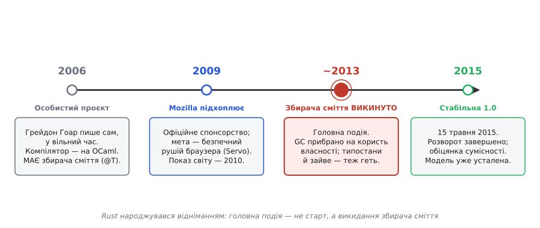

# 📜 Як народився Rust: від зламаного ліфта до мови без збирача сміття

> Це історична вставка про те, звідки взялася сама ідея «безпека пам'яті без наглядача під час виконання». Вона веде ланцюгом суперечок і хибних поворотів навколо однієї впертої думки: що комп'ютер міг би **довести наперед**, що програма не помиляється з пам'яттю, — і тоді не потрібні ні збирач сміття, ні людська пильність. Але — і в цьому вся сіль — сам Rust дійшов до цієї ідеї **не одразу**. Перші його версії якраз мали збирача сміття, і лише згодом його викинули. Історія цього викидання і є справжня історія народження мови.

Сьогодні «Rust» вимовляють так, ніби власність і перевіряч позичань були в ньому від першого дня — його суть, його гасло. Насправді це неправда. Мова, яку 2006 року почав писати сам-один один канадський програміст, спиралася на **збирача сміття**, мала купу можливостей, яких у сучасному Rust немає й сліду, і зовсім не називала себе «мовою про власність». Те, що ми звемо Rust, — це результат майже десятилітнього викручування: команда роками **прибирала** з мови те, без чого можна обійтися, аж поки на дні не лишилося кількох правил про власність. Народження Rust — це історія не про те, що додали, а про те, що **насмілилися відняти**.

---

## Зламаний ліфт: з чого все почалося

Найвідоміша легенда народження Rust — про ліфт. І, на диво для легенд, вона підтверджена самим автором.

**Грейдон Гоар** (*Graydon Hoare*) — канадський програміст; на той час, близько 2006 року, йому було під тридцять, і він працював у **Mozilla**. Жив він у Ванкувері, на **21-му** поверсі. Одного дня, повернувшись додому, він застав ліфт несправним: **його програма впала** — і це вже було не вперше. Пнучись пішки нагору, Гоар роздратувався до тієї самої думки, яка й запустила все далі: **«Це ж безглуздя, що ми, комп'ютерники, не годні зробити ліфт, який працює й не падає!»**

За цим роздратуванням стояло цілком технічне розуміння. Гоар знав, чому падають такі програми: майже завжди — через помилки роботи з пам'яттю в коді на C чи C++. Виснучий покажчик, звертання після звільнення, переповнення буфера — саме ці дрібні недогляди й валять прошивки, від яких вимагають бездоганності. Ліфт був лише останньою краплею; проблема була системна й стара.

> 🔧 **Навіщо це.** Легенда про ліфт — не просто милий анекдот про походження назви. Вона точно вказує на **мотивацію** всієї мови: Rust народжувався не в академічній тиші заради краси теорії типів, а зі злості на те, що звичайне, приземлене залізо — ліфт, авто, роутер — падає через ті самі помилки пам'яті вже десятиліттями. Мова цілилася не в те, щоб бути гарною, а в те, щоб такі падіння **стали неможливими за побудовою**.

Статус цієї історії варто назвати чесно: **підтверджена**. Гоар сам переказував її журналістам, і оповідь про ліфт, 21-й поверх і крашнуту прошивку фігурує в його власних інтерв'ю (зокрема великому нарисі *MIT Technology Review* 2023 року). Це не пізніший міф, приклеєний до мови, — це авторська версія.

### Чому «іржа»

Назва теж походить від самого Гоара, і вона напрочуд промовиста. **Rust** — це не про метал, що псується. Це про **грибок** — цілу групу грибів-**іржі** (*rust fungi*), що вражають рослини. Гоар обрав цю назву тому, що ці гриби, за його словами, **«переінженеровані на виживання»** (*over-engineered for survival*): у них хитрий, багатостадійний життєвий цикл із кількома різними господарями, який робить їх нищівно живучими.

Ось де ховається задум. Мова мала бути такою самою — **надійною до впертості**, здатною вижити там, де інші падають. Іронія в тому, що для англомовного вуха «rust» насамперед означає корозію, розпад — цілком протилежне до надійності; тому назву не раз доводилося пояснювати. Але авторський сенс був саме про **живучість грибка**, а не про руйнування металу. *(Статус: підтверджено автором; «переінженерований на виживання» — пряма цитата Гоара.)*

---

## Тихі роки: особистий проєкт, про який ніхто не знав

Кілька років Rust був **таємницею одного програміста**.

Приблизно з 2006-го по 2009 рік Гоар писав його **сам, у вільний час**, нікому в Mozilla не показуючи. Це важлива деталь: мова визрівала не як корпоративне завдання з дедлайнами, а як приватна пристрасть — простір, де можна пробувати найдикіші ідеї без огляду на те, чи знадобляться вони комусь завтра. Саме тому ранній Rust такий несхожий на сьогоднішній: у ньому було багато всього одразу, бо це був майданчик для дослідів, а не продукт.

Перший компілятор Rust Гоар написав **не на Rust** — інакше й бути не могло, бо мова ще не вміла збирати сама себе. Він написав його **мовою OCaml** — це функційна мова з міцною системою типів, улюблений інструмент для тих, хто будує компілятори. Той найперший компілятор мав близько **38 тисяч рядків OCaml-коду**. Тільки згодом, коли мова доросла, її переписали **саму на собі** (це зветься **самоскомпільований компілятор**, англ. *self-hosting*) і націлили на **LLVM** — потужний генератор машинного коду, спільний із компілятором Clang для C++.

> 🔧 **Навіщо це.** Те, що першу версію Rust написали на OCaml, — не випадковість, а слід родоводу. OCaml приніс у Rust не лише спосіб будувати компілятор, а й **смак до сильних типів**: розбір варіантів (pattern matching), алгебричні типи, вивід типів. Багато чого, що в Rust здається «системним», насправді прийшло зі світу функційних мов — просто перенесене туди, де важать швидкість і контроль над пам'яттю.

У ці роки Rust ще й **близько не був** мовою про власність. Він мав збирача сміття, мав можливості, які потім безжально повикидали, і взагалі був радше «ще однією безпечною мовою загального штибу», ніж тим суворим інструментом, яким став. Розворот був попереду.

---

## 2009: Mozilla підхоплює — і чому саме браузер

Усе змінилося, коли про проєкт дізналися колеги.

Близько 2009 року невелика група в Mozilla зацікавилася мовою, і компанія взяла Rust під **офіційне спонсорство**. А **2010 року** його вперше показали світу — на щорічному саміті Mozilla. Легенда переказує кумедну деталь: **Брендан Айк** (*Brendan Eich*, творець JavaScript і один з очільників Mozilla) начебто попередив, що буде доповідь про експериментальну мову й «не приходьте, якщо ви не справжній схиблений на мовах програмування», — а зала однаково набилася вщерть. *(Статус: анекдот із авторитетного нарису; настрій передає точно, дослівність — на совісті переказу.)*

Але чому браузерна компанія раптом вклалася в нову системну мову? Тут криється цілком тверезий розрахунок, і він — ключ до того, чому Rust став саме таким.

Браузер — це, по суті, **одна з найнебезпечніших програм на вашому комп'ютері**. Він щомиті бере недовірений код і дані з цілого інтернету й прожовує їх у величезному, старому, написаному на C++ рушії. Кожна помилка пам'яті в такому рушії — це потенційна **діра в безпеці**: зловмисник, підсунувши хитро зіпсовану сторінку, може змусити браузер звернутися до звільненої пам'яті й через це захопити контроль. А таких помилок у C++-коді браузера — тьма.

Наскільки тьма — показали пізніші підрахунки, і вони моторошні. Проєкт **Chromium** (основа браузера Chrome) перебрав свої серйозні вади безпеки й дійшов висновку: близько **70%** з них — це помилки роботи з пам'яттю, причому найбільший розряд — саме звертання після звільнення. Незалежно **Microsoft**, переглянувши виправлення вразливостей у своїх продуктах за дванадцять років, отримала **ту саму цифру — близько 70%**. Дві велетенські бази коду, різні команди, той самий діагноз. *(Статус: обидві цифри задокументовані публічно — Microsoft оприлюднила свою на конференції з безпеки 2019 року, Chromium — у матеріалах про безпеку 2020-го.)*

Ось де інтереси зійшлися. Mozilla хотіла новий, безпечний рушій браузера — і затіяла **Servo**, експериментальний рушій, який писали **саме на Rust** (проєкт фінансували спільно Mozilla й Samsung). Rust мав дати те, чого не давав жоден компроміс до нього: **швидкість C++ без його дір у пам'яті**. Servo став полігоном, де мову випробовували на справжній, велетенській, недовіреній задачі, — і частини напрацьованого згодом перекочували назад у Firefox. Мова гартувалася об реальний біль, а не об навчальні приклади.

Навколо Rust зібралася команда, чиї імена варто назвати, бо саме вони виточили мову з сирої ідеї: **Патрік Волтон** (*Patrick Walton*), **Ніко Мацакіс** (*Niko Matsakis*), **Фелікс Клок** (*Felix Klock*), **Маніш Ґореґаокар** (*Manish Goregaokar*) та інші. Це вже була не пристрасть одинака, а спільна праця — і саме колективно вони наважилися на найбільший розворот.

---

## Центральна драма: як зі збирача сміття народилася власність

Ось найважливіше, що майже завжди губиться в переказах: **Rust починав зі збирача сміття — і викинув його не одразу, а в муках і поступово.**

Ранній Rust керував пам'яттю зовсім не так, як сьогоднішній. Він мав **керовані покажчики** — їх позначали синтаксисом `@T`, і вони означали дані, за якими стежить середовище виконання. Під капотом це трималося на **підрахунку посилань** (англ. *reference counting*) із додатковими механізмами, щоб ловити цикли; фактично кожна задача (потік) мала **свій локальний збирач сміття**. Тобто рання відповідь Rust на «як не помилятися з пам'яттю» була та сама традиційна: **приставити наглядача під час виконання**. Була в мові й ціла система **типостанів** (англ. *typestate*) — спосіб перевіряти, у якому стані змінна на кожному кроці, — і купа інших конструкцій.

І тут почалося головне. Роками, приблизно з 2012-го по 2015-й, команда робила з мовою одне й те саме, знову й знову: **прибирала**. Дивилася на чергову можливість і питала — а без неї можна? І якщо можна, викидала.

- Збирач сміття **використовували дедалі рідше**, аж поки близько **2013 року** його не **прибрали зовсім** — на користь власності.
- Систему типостанів **викинули**.
- Викинули ключове слово `pure`, спеціалізовані види покажчиків, вбудований у синтаксис засіб для каналів між потоками — і ще багато чого.

Чому так шалено різали? Бо в міру того, як визрівало **правило власності** — «у кожного значення рівно один власник, і коли власник зникає, значення звільняється», — з'ясовувалася приголомшлива річ: **воно робить збирача сміття зайвим**. Якщо компілятор здатен наперед довести, де саме кінчається життя кожного значення, то він може сам вставити звільнення в правильні місця — і жоден наглядач під час виконання вже не потрібен. А коли зникає потреба в збирачі сміття, багато інших підпор, що трималися на ньому, теж провисають — і їх стає можна прибрати.

> 🔧 **Навіщо це.** Ось чому Rust — така незвична мова: її **визначальну рису отримали відніманням, а не додаванням**. Власність не «доробили згори» до готової мови — навпаки, її дали **дорости знизу**, а все, що вона робила зайвим (насамперед збирача сміття), послідовно прибрали. Тому в сучасному Rust немає рантайм-наглядача не тому, що його «забули покласти», а тому, що його **свідомо викинули**, коли переконалися: перевірка на етапі компіляції справляється сама.

Це і є справжнє народження Rust. Не день першого рядка коду 2006-го, коли мова була ще зовсім іншою, а той розтягнутий на роки процес, у якому команда **зважилася прибрати збирача сміття** й повірити, що самих правил про власність вистачить. 1.0 просто зафіксувала результат цієї відваги.

Сам Гоар, до речі, **відійшов** від керма проєкту близько 2013 року — саме тоді, коли цей розворот доходив кінця. Мову далі вела вже спільнота; те, чим Rust є сьогодні, — плід багатьох рук, а не одного задуму. Розрізняти тут варто чітко: **ідею** «безпека без рантайму через перевірку типів» кристалізувала команда протягом років спільної праці; приписувати всю сучасну модель одній людині було б неточно.

---

## Родовід ідеї: звідки взялася сама власність

Може здатися, що правило «значення можна вжити щонайбільше один раз» Rust вигадав з нуля. Ні. У нього поважні академічні предки, і чесно назвати їх — означає розрізнити **ідею** та її **втілення**.

Ідея сягає **субструктурних систем типів** (англ. *substructural type systems*) — гілки теорії типів, що виросла з **лінійної логіки**, яку 1987 року запропонував французький логік **Жан-Ів Жирар** (*Jean-Yves Girard*). Груба суть: у звичайній логіці факт, раз доведений, можна вживати скільки завгодно разів і будь-коли викидати. Субструктурні системи цю вільність обмежують — і саме з таких обмежень народжуються різні дисципліни роботи з ресурсами:

- **Лінійні типи** (*linear*): значення треба вжити **рівно один раз** — ні більше, ні менше.
- **Афінні типи** (*affine*): значення можна вжити **щонайбільше один раз** (можна й зовсім не вжити).
- **Типи унікальності** (*uniqueness types*): гарантія, що на значення веде **лише одне** посилання.

Rust успадкував саме **афінну** дисципліну: перемістив значення — і джерело вичерпано, вжити його вдруге не можна. Правило позичань поверх цього — це вже інженерне пом'якшення чистої теорії: воно дозволяє тимчасово **дивитися** на значення, не забираючи його, щоб суворість не задушила практичність.

Але афінні типи — це лише про «один власник». Друга половина родоводу — про те, **коли звільняти**, — прийшла з іншого боку: з **регіонного керування пам'яттю** (англ. *region-based memory management*). Тут головний предок — експериментальна мова **Cyclone** (безпечний діалект C, який у 2000-х розробляли в Bell Labs і Корнеллському університеті) та система **ML Kit**. Ідея регіонів: прив'язати час життя даних до **області** в коді так, щоб компілятор міг наперед знати, коли пам'ять уже нікому не потрібна, і звільнити її **без збирача сміття**. Це рівно те, що робить власність Rust із кінцем області видимості власника.

Офіційний довідник Rust сам чесно перелічує цей родовід. Варто назвати повний спадок, бо він показує, яка це збірна конструкція:

- **регіони пам'яті** — від **Cyclone** та **ML Kit**;
- **типостани** (те, що потім викинули) — від мов **NIL** і **Hermes**;
- канали й модель конкурентності — від **Newsqueak**, **Alef**, **Limbo** (мови, дотичні до кола Bell Labs і Роба Пайка);
- сильні типи, розбір варіантів, вивід типів — зі світу **ML/OCaml** і **Haskell**.

> 🔧 **Навіщо це.** Родовід руйнує міф «Rust усе вигадав сам». Жодна з цих ідей — ні афінні типи, ні регіони — не належить Rust; вони визрівали в академії десятиліттями. Заслуга Rust **інша, і вона величезна**: він **уперше поєднав** афінну власність із регіонним звільненням і додав перевіряч позичань так, щоб усе це працювало не в дослідницькій іграшці на десять прикладів, а в **реальній промисловій мові**, якою пишуть ядра, браузери й прошивки. Різниця між «мати ідею», «опублікувати теорію», «зробити дослідний прототип» і «створити мову, якою користуються мільйони» — колосальна, і саме останнє зробив Rust.

Тобто чесне формулювання таке: **ідеї — запозичені й давні; робоча система з них — власна й нова.** Rust — не винахідник афінних типів, а той, хто вивів їх з академічних статей у щоденний інструмент інженера.

---

## 15 травня 2015: коли все зафіксували

Роки відсікання зайвого мусили колись скінчитися крапкою — і нею стала **версія 1.0**.

Перший **стабільний** випуск Rust, **1.0**, вийшов **15 травня 2015 року**. *(Статус: точна, добре задокументована дата.)* Дорогою до неї були проміжні віхи — зокрема перша нумерована версія **0.1** у **січні 2012 року**, — але саме 1.0 означала дещо принципове: **обіцянку сумісності**. Від цього дня мова присягалася, що код, який збирається сьогодні, збиратиметься й завтра; експерименти скінчилися, почалася відповідальність перед тими, хто на мову покладеться.

Що важливо зрозуміти про цю дату — вона не була моментом винаходу власності. На 15 травня 2015-го **всю драму вже зіграно**: збирача сміття давно викинуто, типостани прибрано, модель власності й позичань устоялася. 1.0 не народила Rust — вона **оголосила народження закінченим** і виставила на світ мову, яку до того майже десять років точили відніманням.

*Народження Rust — не одна дата, а розтягнутий розворот. Мова стартувала 2006-го зі збирачем сміття (`@T`-покажчики, підрахунок посилань); 2009-го її підхопила Mozilla заради безпечного рушія браузера; головна ж подія — близько 2013-го, коли збирача сміття **викинули** на користь власності. 1.0 (2015) лише зафіксувала результат.*

---

## Що з цієї історії лишається важити

Народження Rust дає один урок, вартий більше за самі дати.

Найпотужнішу рису мови отримали не тоді, коли щось геніально **додали**, а тоді, коли насмілилися **відняти** — прибрати збирача сміття й повірити, що самих правил про власність вистачить, щоб гарантувати безпеку пам'яті наперед. Ідеї, на яких це стоїть, — афінні типи Жирарового роду, регіони Cyclone — старі й запозичені; новим було рішення **зібрати їх у робочу промислову мову** й довіритися компіляторові там, де всі доти ставили наглядача під час виконання.

Тому, коли ви пишете на Rust і компілятор відмовляється збирати код, бо ви двічі вжили переміщене значення, — за цією відмовою стоїть не примха, а майже десятиліття свідомого відсікання зайвого. Зламаний ліфт дав злість; грибок-іржа дав назву й гасло живучості; академія дала ідеї; Mozilla дала задачу, велику настільки, щоб на ній ці ідеї загартувалися. А народило мову — рішення викинути наглядача.
