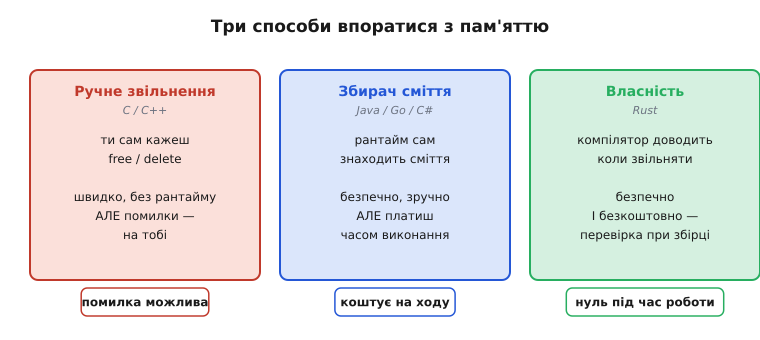
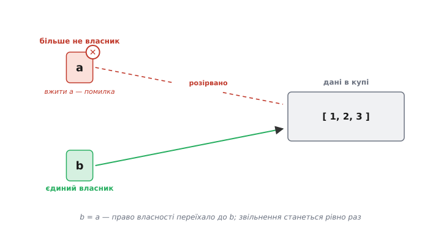
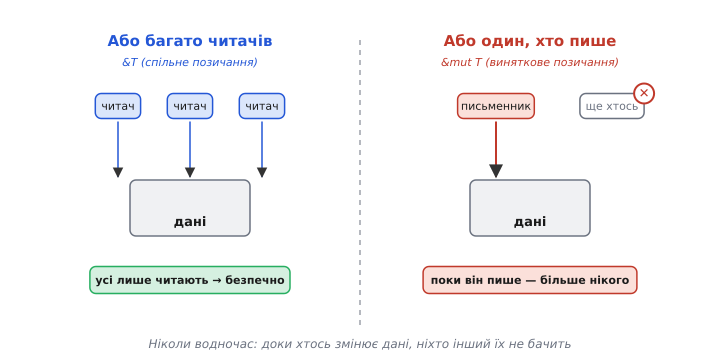

# Модель власності Rust

<preknowlist>
- [Адреси й покажчики](book:programming/addresses-pointers) — що таке покажчик на дані в пам'яті й що буває, коли він указує «в нікуди».
- [Стек](book:programming/stack-lifo) — локальні змінні живуть і зникають разом зі своєю областю видимості.
- [Купа](book:programming/heap-dynamic-memory) — динамічна пам'ять, яку явно беруть і явно повертають; без повернення — витік, з подвійним поверненням — крах.
</preknowlist>

Уся ця стаття виростає з однієї впертої, дорогої й геть буденної помилки. Ви взяли шматок пам'яті в [купі](book:programming/heap-dynamic-memory), попрацювали з ним, звільнили — а тоді десь далі в коді, забувши, що вже звільнили, звернулися до нього ще раз. Пам'ять уже не ваша; там може лежати що завгодно. Це **звертання після звільнення** (англ. *use-after-free*), і воно не викидає чесної помилки — програма то працює, то ні, то тихо псує сусідні дані, то падає за годину після справжньої причини. Поряд живуть її родичі: **подвійне звільнення** (звільнили той самий блок двічі), **виснучий покажчик** (покажчик пережив дані, на які показував), **витік** (забули звільнити взагалі). Усе це — не екзотика, а щоденний хліб програм на C і C++.

Наскільки щоденний — видно з цифр, і вони моторошні. Коли Microsoft переглянула виправлення вразливостей за дванадцять років, виявилося, що близько **70%** з них — це помилки роботи з пам'яттю. Незалежно проєкт Chromium (браузер Chrome) перебрав свої серйозні вади безпеки й отримав ту саму цифру — **70%**, причому половина з них — саме звертання після звільнення. Дві величезні бази коду, різні команди, той самий діагноз. Отже, питання «як не помилятися з пам'яттю» — це не педантизм, а одна з найдорожчих проблем усієї галузі.

## Дві старі відповіді — і чому обидві муляють

До Rust на цю проблему було дві усталені відповіді, і кожна чимось платить.

Перша — **робити все руками**, як у C. Ти сам вирішуєш, коли взяти пам'ять і коли повернути. Це дає повний контроль і жодних накладних витрат під час роботи: звільнення стається рівно тоді, коли ти написав `free`. Ціна — уся відповідальність на людині, а людина забуває, плутається й помиляється. Ті самі 70% беруться саме звідси.

Друга — **приставити наглядача**, як у Java, Go чи C#. Окрема служба всередині програми, **збирач сміття** (англ. *garbage collector*), сама стежить, які дані вже нікому не потрібні, і звільняє їх. Людина про звільнення взагалі не думає — і цілий клас помилок зникає. Але наглядач працює **під час виконання**: він періодично оглядає пам'ять, витрачає такти й час, а подеколи мусить призупинити програму, щоб прибрати. На сервері це терпимо; у грі, драйвері чи [прошивці мікроконтролера](book:programming/heap-dynamic-memory), де реакція має бути передбачувано швидкою й пам'яті обмаль, така пауза — розкіш, якої часто просто немає.

Тобто вибір стояв нещадний: або **безпека ціною рантайму** (збирач сміття), або **швидкість ціною безпеки** (ручне керування). Rust з'явився з зухвалою третьою відповіддю: а що, як **довести безпеку наперед** — під час компіляції? Хай компілятор ще до запуску переконається, що звертання після звільнення тут неможливе в принципі, і сам вставить звільнення в правильні місця. Тоді під час роботи не потрібен ані наглядач, ані людська пильність: код уже доведено безпечним, а звільнення — уже на своїх місцях.


*Ручне керування (ліворуч) швидке, але кладе всю відповідальність на людину. Збирач сміття (посередині) знімає відповідальність, але коштує тактів під час роботи. Власність (праворуч) переносить рішення «коли звільняти» на компілятор: код доведено безпечним заздалегідь, тож під час виконання не лишається ані наглядача, ані ризику.*

> 🔧 **Навіщо це.** «Безпечно й без рантайму водночас» — це саме те, що робить Rust придатним туди, куди збирач сміття не пускають: ядра операційних систем, драйвери, вбудовані системи, гарячі ділянки браузерів. Ви отримуєте гарантію «жодних звертань після звільнення», не платячи за неї ані паузами, ані зайвою пам'яттю. Це не academic-іграшка — це причина, чому мову беруть у Windows, Android і Linux.

Уся хитрість — у тому, які саме правила має перевірити компілятор, щоб така гарантія стала можливою. Виявляється, їх дуже небагато, і крутяться вони навколо одного простого поняття — **власності**.

## Ядро: у кожного значення рівно один власник

Правило перше й головне: **кожне значення в програмі належить рівно одній змінній — його власникові. Коли власник зникає (виходить із своєї області видимості), значення автоматично звільняється.**

Це звучить майже банально, але саме звідси випливає вся сила. Погляньмо, як воно працює. Оголосили ви змінну, яка тримає буфер у купі. Ця змінна — власник буфера. Поки вона жива, живий і буфер. Тільки-но виконання виходить за фігурну дужку, де змінну оголошено, — вона зникає, і рівно в цю мить компілятор (який ще під час збирання знав, де це станеться) уже вставив звільнення буфера. Вам не треба писати `free`: місце звільнення однозначно визначене місцем, де кінчається життя власника.

Помітьте, що ця сама ідея — «прив'яжи звільнення ресурсу до кінця життя змінної» — не нова; у C++ її звуть [RAII](book:programming/raii) і реалізують через деструктори. Rust бере той самий принцип, але робить його **не порадою, а законом мови**, який компілятор змушений дотримати завжди, для кожного значення без винятку. Різниця між «є хороша практика» і «інакше програма не збереться» — колосальна.

Одного власника вже досить, щоб прибрати два різновиди бід. **Витік** неможливий: у власника точно настане кінець області видимості, тож звільнення точно станеться. **Подвійне звільнення** неможливе: власник один, кінець життя в нього один, звільнення станеться рівно раз. Лишається головний ворог — звертання після звільнення. Щоб прибрати і його, треба розібратися, що діється, коли значення передають з рук у руки.

## Переміщення: право власності переїжджає, старе ім'я вмирає

Ось де починається найцікавіше й найнезвичніше. Уявіть, що ви присвоюєте вміст однієї змінної іншій, або передаєте його у функцію. У C++ за замовчуванням це **копіювання чи спільне володіння**: тепер на ті самі дані дивляться двоє. І от у цьому корінь зла. Якщо двоє вважають себе власниками одного буфера, то коли перший вийде з області видимості й звільнить буфер, другий лишиться з покажчиком на вже мертву пам'ять — класичний виснучий покажчик. А коли й другий вийде — звільнить той самий буфер удруге. Подвійне звільнення й звертання після звільнення народжуються саме з **двозначності: хто ж тут господар**.

Rust розрубує цей вузол безжально. Присвоєння `b = a` (для типу, що володіє даними в купі) — це не копія й не спільне володіння, а **переміщення** (англ. *move*): право власності **переїжджає** від `a` до `b`. І — ключове — після переїзду **саме ім'я `a` стає недійсним**. Спробуєте вжити `a` далі — компілятор відмовиться збирати програму, ще до будь-якого запуску.


*Буфер у купі належав `a`. Присвоєння `b = a` переносить право власності: тепер єдиний живий шлях до даних — через `b`, а зв'язок `a → дані` розірвано і саме ім'я `a` вжити вже не можна. Двозначності «хто господар» немає ні на мить, тож звільнення станеться рівно один раз — коли завершиться життя `b`.*

Чому це так елегантно? Бо власник **знову один** — просто тепер це `b`. Ніколи не буває двох імен, що вважають себе господарями тих самих даних, а отже, немає з чого взятися ні подвійному звільненню, ні виснучому покажчику. Вся конструкція тримається на тому, що передача даних **за умовчанням забирає їх у джерела**, а не роздвоює.

Порівняймо це руками з тим, як ту саму халепу треба пильнувати в C++.

**Подвійне звільнення, яке Rust не дасть навіть скомпілювати.**

```cpp
// C++: копіюється лише покажчик, а буфер — той самий
char* a = (char*)malloc(64);
char* b = a;          // тепер a і b дивляться на ОДИН буфер
free(a);              // буфер звільнено
// ...десь далі, забувши про free(a):
free(b);              // ✗ подвійне звільнення — те саме, що звільнити двічі
b[0] = 'x';           // ✗ звертання після звільнення — b показує в мертву пам'ять
```

Тут компілятор C++ мовчить: `b = a` для нього — законна дія, і жодного попередження. Уся біда виявляється хіба під час виконання, у найгіршому разі — рідкісним, нестабільним крахом. У Rust аналог рядка `b = a` **переносить** власність, `a` після нього недійсне, і `free` жодного разу не пишуть руками — його вставляє компілятор, і рівно один. Цілий сімейний куток помилок закрито не перевіркою під час роботи, а **відмовою компілятора приймати неоднозначний код**.

Ця «одноразовість» — вжив значення й воно спожите — має точну назву в теорії типів: **афінна система типів** (від математичного *affine* — значення можна використати щонайбільше один раз). Rust не афішує цей термін у щоденному коді, але саме він лежить в основі: перемістив — і джерело вичерпано.

## Позичання: коли дивитися можна, а забирати не хочеться

Якби кожна передача даних забирала їх назавжди, мовою було б неможливо користуватися: щоб функція просто **порахувала суму** елементів масиву, їй довелося б забрати масив у власність, а потім якось повертати назад. Абсурд. Тому поряд із власністю існує друге поняття — **позичання** (англ. *borrowing*): ви даєте комусь **тимчасове посилання** на дані, не віддаючи власності. Той, хто позичив, попрацював — і посилання зникло, а власником так само лишилися ви.

Але щойно з'являється можливість дивитися на чужі дані, повертається загроза, тепер із іншого боку. Що, як хтось читає масив, а власник тим часом його **перебудовує** — скажімо, розширює й переносить в іншу частину купи? Тоді посилання читача вказує вже на стару, звільнену адресу — знову виснучий покажчик, тільки народжений не власністю, а одночасним доступом. А якщо двоє **пишуть** в одні дані водночас у різних потоках — це [гонка даних](book:programming/atomicity-races), одне з найпідступніших джерел непередбачуваних збоїв.

Rust вибиває ґрунт з-під усіх цих бід одним-єдиним правилом позичання, яке варто закарбувати:

```
У будь-який момент часу для даних дозволено АБО:
  • скільки завгодно посилань лише для читання (&T),   — «спільне» позичання
АБО:
  • рівно одне посилання для запису (&mut T),           — «виняткове» позичання
але НІКОЛИ обидва водночас.
```

Англійською цю ідею звуть **shared XOR mutable** — «спільне АБО змінне, виключно одне з двох». Логіка проста до краси: **небезпечно лише поєднання читання й зміни водночас**. Багато читачів і жодного, хто пише, — цілком безпечно: дані незмінні, усі бачать те саме. Один, хто пише, і більше нікого — теж безпечно: ніхто не спостерігає за даними, які змінюються з-під ніг. А от читач плюс паралельний письменник — це саме та комбінація, з якої родяться і виснучі посилання, і гонки. Заборонивши **тільки** її, Rust прибирає корінь, лишаючи все безпечне дозволеним.


*Ліворуч — спільне позичання: скільки завгодно читачів одночасно, бо незмінних даних вистачить на всіх. Праворуч — виняткове: доки один змінює дані, більше до них ніхто не має доступу. Заборонено лише сполучення «хтось пише, а хтось водночас дивиться» — саме воно і є джерелом гонок та виснучих посилань.*

> 🔧 **Навіщо це.** Правило «спільне АБО змінне» — це те, завдяки чому Rust зве себе мовою **безстрашної багатопотоковості**. У C++ безпечність паралельного коду тримається на дисципліні програміста й огляді колег; забув поставити захист навколо спільних даних — отримав гонку, яка проявиться раз на мільйон запусків у продакшені. У Rust таку помилку компілятор просто **не компілює**: якщо два потоки могли б водночас торкнутися одних даних із записом, збірка падає з поясненням. Гонки даних відсіяно ще до запуску.

Тонкість, яку варто назвати: **афінні типи (одноразове володіння) і перевірка позичання — це два окремі механізми**, хоч і працюють в одній упряжці. Перший стежить, щоб власник був один і значення не «використали двічі». Другий — окрема частина компілятора, яку звуть **перевіряч позичань** (англ. *borrow checker*), — стежить, щоб позичені посилання не порушували правило «спільне АБО змінне». Разом вони й дають повну гарантію.

## Час життя: позичка не може пережити господаря

Лишилася остання щілина, яку треба заткнути. Ми дозволили позичати посилання — але що завадить посиланню **пережити самі дані**? Позичив я посилання на локальну змінну, змінна вийшла з області видимості й звільнилась, а посилання лишилось — і знову дивиться в мертву пам'ять.

Rust закриває це поняттям **часу життя** (англ. *lifetime*): у кожного посилання є проміжок, протягом якого воно дійсне, і компілятор перевіряє, що **посилання ніколи не живе довше за дані, на які показує**. Позичка мусить померти раніше за господаря — або збірка не пройде. Здебільшого ці проміжки компілятор виводить сам, мовчки, і ви їх навіть не пишете; лише в заплутаніших випадках доводиться підказати йому явно. Але суть завжди та сама: **виснуче посилання неможливе, бо компілятор не випустить у світ посилання, яке пережило б свої дані.**

Отже, складімо всю картину. Один власник → немає витоків і подвійних звільнень. Переміщення забирає дані в джерела → немає двозначності «хто господар». Правило «спільне АБО змінне» → немає гонок і псування даних з-під ніг спостерігача. Час життя → немає посилань, що переживають дані. Разом ці чотири правила зачиняють **увесь** клас помилок пам'яті — і роблять це на етапі компіляції, без жодного наглядача під час роботи.

## Де воно муляє: чесна ціна

Було б нечесно змалювати це раєм без вад. Ціна є, просто вона інша — і платиться не рантаймом, а мисленням.

**Ти воюєш із компілятором.** Правила суворі, і код, який людині здається очевидно правильним, компілятор іноді відхиляє — бо не може **довести** його безпечність, а не тому, що там справді є помилка. Новачки багато часу проводять, «сперечаючись із перевірячем позичань», і це реальний поріг входу. Мова радше відкине сумнівне, ніж пропустить небезпечне: перестраховка на боці безпеки.

**Спільне володіння коштує окремих засобів.** Модель «один власник» чудова, поки дані справді належать комусь одному. Але буває, що шматок даних мусить належати кільком господарям водночас (класична деревна чи графова структура). Тоді одного власника замало, і доводиться братися за окремі обгортки — **підрахунок посилань** (лічильник власників; дані живуть, поки лічильник не впаде до нуля). Це вже крихітна плата під час виконання — рівно там, де без неї не обійтися, і тільки там.

**Іноді правила заважають по-справжньому, і тоді є `unsafe`.** Не все на світі можна довести перевірячеві позичань — писання драйвера, який мацає регістри заліза, чи хитра структура даних принципово виходять за межі того, що компілятор здатен перевірити. Для таких місць є ключове слово `unsafe`: воно не вимикає всю безпеку, а лише дозволяє кілька операцій, за коректність яких тепер відповідає програміст. Ідея не «довіряй усьому», а «звузь небезпечне до крихітних, ретельно перевірених острівців, а весь інший океан коду хай лишається доведено безпечним».

І головне, заради чого все затівалося: за саму власність **під час виконання не платять нічого**. Переміщення, позичання, час життя — усе це поняття, що живуть **лише в компіляторі**; у зібраному машинному коді від них не лишається ані байта. Звільнення, які компілятор вставив, — це ті самі звільнення, що ви написали б руками в C, тільки поставлені без помилок. Тому власність і кажуть **абстракцією без витрат**: безпеку отримано задарма з погляду швидкості, а заплачено за неї на етапі збирання й у суворості правил.

Народилася ця модель не на порожньому місці — [історія Rust](book:programming/rust-ownership/hist-rust-origins.md) починається з особистого роздратування одного інженера й проходить дивний шлях: перші версії мови покладалися саме на збирача сміття, і лише згодом його викинули на користь власності, яку ми щойно розібрали. Але сама ідея, що безпеку пам'яті можна **довести типами замість перевіряти під час роботи**, виявилася настільки міцною, що за нею потяглися й інші мови.
